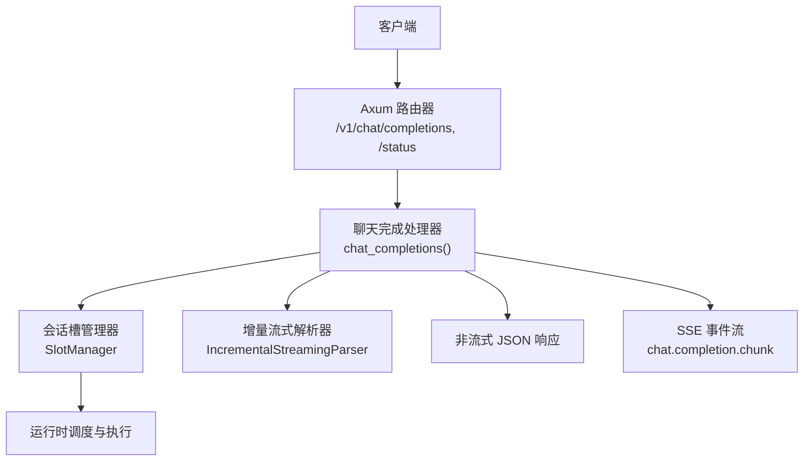
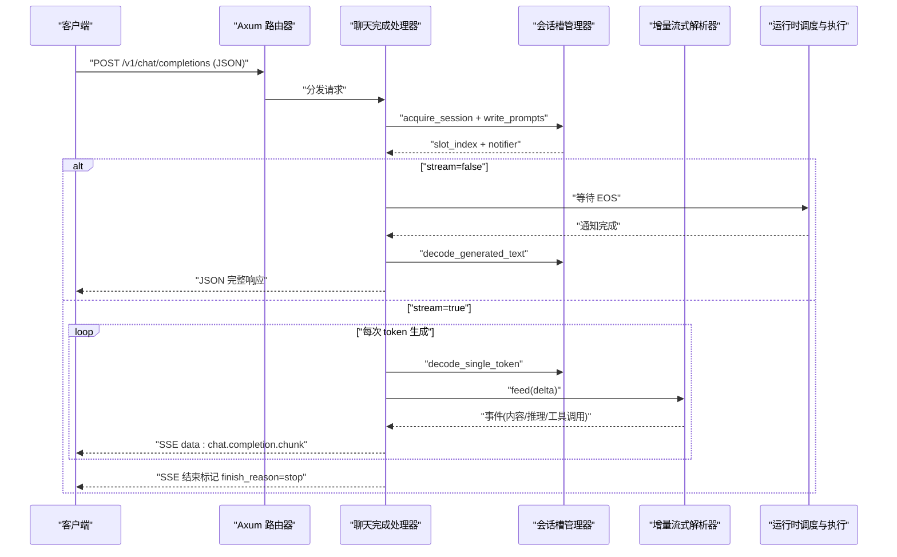
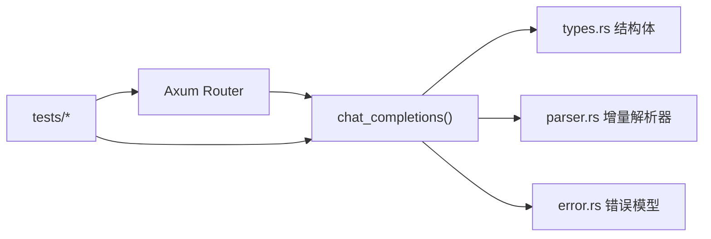

# API 参考

<cite>
**本文引用的文件**
- [src/serving/server.rs](file://src/serving/server.rs)
- [src/serving/types.rs](file://src/serving/types.rs)
- [src/serving/parser.rs](file://src/serving/parser.rs)
- [src/serving/error.rs](file://src/serving/error.rs)
- [src/config/command_line_interface.rs](file://src/config/command_line_interface.rs)
- [docs/configuration/env_vars.md](file://docs/configuration/env_vars.md)
- [docs/serving/openai_compatible_server.md](file://docs/serving/openai_compatible_server.md)
- [src/serving/tests/mod.rs](file://src/serving/tests/mod.rs)
- [src/serving/tests/syn_flow_test.rs](file://src/serving/tests/syn_flow_test.rs)
- [src/serving/tests/stream_flow_test.rs](file://src/serving/tests/stream_flow_test.rs)
</cite>

## 目录
1. [简介](#简介)
2. [项目结构](#项目结构)
3. [核心组件](#核心组件)
4. [架构总览](#架构总览)
5. [详细组件分析](#详细组件分析)
6. [依赖分析](#依赖分析)
7. [性能考虑](#性能考虑)
8. [故障排查指南](#故障排查指南)
9. [结论](#结论)
10. [附录](#附录)

## 简介
本参考文档面向使用 eLLM OpenAI 兼容 HTTP 服务的开发者，覆盖以下端点与能力：
- POST /v1/chat/completions：聊天完成接口（支持流式与非流式）
- GET /status：健康检查接口

同时提供请求/响应字段说明、错误码处理、认证与安全配置选项、请求限流与速率限制建议、客户端示例（Python、JavaScript、Rust）、流式与非流式差异与适用场景、批量推理最佳实践与性能优化建议，以及调试技巧。

## 项目结构
eLLM 的 OpenAI 兼容服务位于 serving 模块，基于 Axum 提供 HTTP 路由与 SSE 流式响应；类型定义集中在 types 模块；增量解析器在 parser 模块中实现；错误模型在 error 模块中统一；命令行与服务参数通过 CLI 配置加载。

图表来源
- [src/serving/server.rs:84-98](file://src/serving/server.rs#L84-L98)
- [src/serving/server.rs:100-176](file://src/serving/server.rs#L100-L176)
- [src/serving/parser.rs:198-221](file://src/serving/parser.rs#L198-L221)

章节来源
- [src/serving/server.rs:1-43](file://src/serving/server.rs#L1-L43)
- [docs/serving/openai_compatible_server.md:1-29](file://docs/serving/openai_compatible_server.md#L1-L29)

## 核心组件
- 路由与服务器启动：注册 /v1/chat/completions 与 /status，绑定监听端口。
- 聊天完成处理器：解析请求体、分配会话槽、写入提示词、等待生成、返回结果或构建 SSE 流。
- 流式解析器：对增量文本进行无回溯解析，提取普通内容、推理片段与工具调用。
- 类型定义：OpenAI 风格请求/响应结构体。
- 错误模型：统一错误枚举与 IntoResponse 映射。

章节来源
- [src/serving/server.rs:84-98](file://src/serving/server.rs#L84-L98)
- [src/serving/server.rs:100-176](file://src/serving/server.rs#L100-L176)
- [src/serving/parser.rs:198-221](file://src/serving/parser.rs#L198-L221)
- [src/serving/types.rs:1-82](file://src/serving/types.rs#L1-L82)
- [src/serving/error.rs:1-58](file://src/serving/error.rs#L1-L58)

## 架构总览
下图展示了从客户端到服务端的核心交互路径，包括非流式与流式两种分支。

图表来源
- [src/serving/server.rs:100-176](file://src/serving/server.rs#L100-L176)
- [src/serving/server.rs:178-311](file://src/serving/server.rs#L178-L311)
- [src/serving/parser.rs:223-406](file://src/serving/parser.rs#L223-L406)

## 详细组件分析

### 端点：POST /v1/chat/completions
- 功能：接收 OpenAI 风格的聊天消息，返回完整响应或按 token 增量推送的 SSE 事件。
- 请求体字段（ChatCompletionRequest）
  - model: 字符串，必填
  - messages: ChatMessage 数组，必填
  - stream: 布尔，可选，默认 false
  - temperature: 浮点数，可选
  - max_tokens: 整数，可选
  - top_p: 浮点数，可选
  - request_id: 字符串，可选
  - session_id: 字符串，可选
  - session_mode: 字符串，可选
- 响应体（非流式）
  - id: 字符串
  - object: "chat.completion"
  - created: Unix 秒级时间戳
  - model: 字符串
  - choices: 数组，包含 index、message(role/content)、finish_reason
- 响应体（流式）
  - 每个事件为 StreamResponse，object 为 "chat.completion.chunk"
  - choices[0].delta 可包含 role、content、reasoning_content、tool_calls
  - 最后一个事件携带 finish_reason="stop"

章节来源
- [src/serving/types.rs:1-82](file://src/serving/types.rs#L1-L82)
- [src/serving/server.rs:100-176](file://src/serving/server.rs#L100-L176)
- [src/serving/server.rs:178-311](file://src/serving/server.rs#L178-L311)

#### 请求参数详解
- model: 指定模型名称或标识。
- messages: 角色与内容的对话列表，role 通常为 user/assistant/system。
- stream: 控制是否启用 SSE 流式输出。
- temperature: 采样温度，影响随机性。
- max_tokens: 最大生成长度（当前由运行时控制）。
- top_p: 核采样阈值（当前由运行时控制）。
- request_id/session_id: 用于关联会话与追踪请求。
- session_mode: 会话模式（如可重用/不可重用），由运行时决定。

章节来源
- [src/serving/types.rs:1-14](file://src/serving/types.rs#L1-L14)
- [src/serving/server.rs:100-116](file://src/serving/server.rs#L100-L116)

#### 响应格式定义
- 非流式：完整的 ChatCompletionResponse。
- 流式：多个 StreamResponse 事件，最后以 finish_reason="stop" 结束。

章节来源
- [src/serving/types.rs:22-82](file://src/serving/types.rs#L22-L82)
- [src/serving/server.rs:160-176](file://src/serving/server.rs#L160-L176)
- [src/serving/server.rs:267-301](file://src/serving/server.rs#L267-L301)

#### 错误码处理
- 无效 JSON：返回 400 Bad Request。
- 缺少必要字段：返回 422 Unprocessable Entity。
- Tokenization/内部错误：返回 500 Internal Server Error（由 ApiError 映射）。

章节来源
- [src/serving/tests/mod.rs:34-67](file://src/serving/tests/mod.rs#L34-L67)
- [src/serving/error.rs:28-56](file://src/serving/error.rs#L28-L56)

#### 流式与非流式对比与使用场景
- 非流式：适合一次性获取完整回答，简化客户端逻辑。
- 流式：适合实时展示、长文本逐步渲染、工具调用增量解析等场景。

章节来源
- [src/serving/server.rs:139-176](file://src/serving/server.rs#L139-L176)
- [src/serving/server.rs:178-311](file://src/serving/server.rs#L178-L311)

### 端点：GET /status
- 功能：健康检查，返回运行状态与模式信息。
- 响应体字段
  - status: "running"
  - mode: 当前调度模式描述
  - info: 附加信息

章节来源
- [src/serving/server.rs:88-96](file://src/serving/server.rs#L88-L96)
- [src/serving/tests/mod.rs:12-31](file://src/serving/tests/mod.rs#L12-L31)

### 增量流式解析器（parser.rs）
- 设计目标：仅处理新增 delta，不重扫历史输出；边界安全缓冲；按模型家族选择规则。
- 关键类型
  - ParserRule：标签与工具调用格式配置
  - ToolCallFormat：Tagged/PrefixedJson/RawJson/MiniMaxM2
  - IncrementalStreamingParser：增量解析器
  - ParserEvent：Content/Reasoning/ToolCall/ToolCallDelta/Finish
- 行为要点
  - 正常态下查找 think/tool 开始标记，进入对应状态
  - 推理态遇到结束标记后回到正常态
  - 工具调用态根据格式解析 JSON 载荷，支持跨分片拼接

章节来源
- [src/serving/parser.rs:198-221](file://src/serving/parser.rs#L198-L221)
- [src/serving/parser.rs:223-406](file://src/serving/parser.rs#L223-L406)
- [src/serving/parser.rs:409-574](file://src/serving/parser.rs#L409-L574)

### 类型定义（types.rs）
- ChatCompletionRequest/ChatMessage/ChatCompletionResponse/StreamResponse/StreamChoice/StreamDelta/StreamToolCall/StreamToolFunction
- 序列化特性：跳过 None 字段，保持与 OpenAI 风格一致

章节来源
- [src/serving/types.rs:1-82](file://src/serving/types.rs#L1-L82)

### 错误模型（error.rs）
- ApiError 枚举：TokenizationError/SlotUnavailable/InternalError
- IntoResponse 映射：统一转换为 500 错误响应

章节来源
- [src/serving/error.rs:1-58](file://src/serving/error.rs#L1-L58)

## 依赖分析
- 路由层依赖 Axum 的 Router、post/get 路由与 Sse 响应。
- 处理器依赖 SlotManager 管理会话与槽位，Notify 驱动流式推进。
- 解析器依赖 ModelFamily 选择解析规则。
- 测试用例验证了 /status、非法 JSON、缺失字段等边界情况。

图表来源
- [src/serving/server.rs:84-98](file://src/serving/server.rs#L84-L98)
- [src/serving/types.rs:1-82](file://src/serving/types.rs#L1-L82)
- [src/serving/parser.rs:198-221](file://src/serving/parser.rs#L198-L221)
- [src/serving/error.rs:1-58](file://src/serving/error.rs#L1-L58)
- [src/serving/tests/mod.rs:12-67](file://src/serving/tests/mod.rs#L12-L67)

章节来源
- [src/serving/server.rs:84-98](file://src/serving/server.rs#L84-L98)
- [src/serving/tests/mod.rs:12-67](file://src/serving/tests/mod.rs#L12-L67)

## 性能考虑
- 批大小与序列长度：通过环境变量 ELLM_BATCH_SIZE、ELLM_SEQUENCE_LENGTH 调整并发与上下文长度。
- 预填充块大小与调度超时：ELLM_CHUNK_SIZE、ELLM_SCHEDULE_TIMEOUT_MS 影响 TTFT 与吞吐。
- 线程池：worker_threads 与 async_threads 自动计算，API 线程数可通过 api_server_count 配置。
- 会话复用：dialogue_cache_enabled 开启会话缓存可减少重复初始化开销。
- 流式解析：增量解析避免全量重解析，降低 CPU 占用。

章节来源
- [docs/configuration/env_vars.md:1-45](file://docs/configuration/env_vars.md#L1-L45)
- [src/config/command_line_interface.rs:186-233](file://src/config/command_line_interface.rs#L186-L233)
- [src/config/command_line_interface.rs:336-366](file://src/config/command_line_interface.rs#L336-L366)

## 故障排查指南
- 400 Bad Request：请求体不是合法 JSON。
- 422 Unprocessable Entity：缺少必填字段（如 messages）。
- 500 Internal Server Error：tokenization 失败、槽位不可用或内部错误。
- 流式未结束：确认 finish_reason 是否为 stop，检查 SSE 连接是否被中断。
- 工具调用解析异常：确认模型家族与解析规则匹配，检查 JSON 载荷完整性。

章节来源
- [src/serving/tests/mod.rs:34-67](file://src/serving/tests/mod.rs#L34-L67)
- [src/serving/error.rs:28-56](file://src/serving/error.rs#L28-L56)
- [src/serving/parser.rs:223-406](file://src/serving/parser.rs#L223-L406)

## 结论
eLLM 的 OpenAI 兼容服务提供了简洁稳定的 HTTP 接口，支持流式与非流式两种响应模式，具备增量解析与统一的错误模型。通过合理的批大小、序列长度与线程配置，可在 CPU 服务器上获得良好的端到端延迟与吞吐表现。

## 附录

### 客户端示例（Python）
- 非流式请求
  - 使用 requests 发送 POST /v1/chat/completions，设置 Content-Type: application/json
  - 读取 response.json() 中的 choices[0].message.content
- 流式请求
  - 使用 requests 发送请求并迭代 response.iter_lines()
  - 解析每行 data: 后的 JSON，收集 content/reasoning_content/tool_calls
  - 当 finish_reason 为 stop 时结束

章节来源
- [src/serving/server.rs:100-176](file://src/serving/server.rs#L100-L176)
- [src/serving/server.rs:178-311](file://src/serving/server.rs#L178-L311)

### 客户端示例（JavaScript）
- 非流式请求
  - 使用 fetch 发送 POST /v1/chat/completions
  - 读取 await response.json()
- 流式请求
  - 使用 fetch 获取 Response.body.getReader()
  - 使用 TextDecoder 解码 chunk，解析 data: 后的 JSON
  - 累积 content/reasoning_content/tool_calls，直到 finish_reason=stop

章节来源
- [src/serving/server.rs:178-311](file://src/serving/server.rs#L178-L311)

### 客户端示例（Rust）
- 非流式请求
  - 使用 reqwest::Client 发送 POST /v1/chat/completions
  - 反序列化为 ChatCompletionResponse
- 流式请求
  - 使用 tokio_stream::StreamExt 处理 Sse 事件
  - 解析 StreamResponse，累积增量内容

章节来源
- [src/serving/server.rs:178-311](file://src/serving/server.rs#L178-L311)

### 认证与安全配置
- API Key：可通过 serve.api_key 配置（CLI 或 vllm 配置文件）
- CORS：allowed_origins、allowed_methods、allowed_headers、allow_credentials
- SSL：ssl_keyfile、ssl_certfile、ssl_ca_certs
- UDS：uds 指定 Unix Domain Socket 路径

章节来源
- [src/config/command_line_interface.rs:186-233](file://src/config/command_line_interface.rs#L186-L233)
- [src/config/command_line_interface.rs:336-366](file://src/config/command_line_interface.rs#L336-L366)

### 请求限流与速率限制
- 当前版本未内置显式的速率限制中间件。
- 建议通过外部网关（Nginx、Envoy、Kong）或容器编排平台进行限流与熔断。
- 利用 ELLM_BATCH_SIZE 与 ELLM_CHUNK_SIZE 控制并发与调度粒度，间接缓解突发流量。

章节来源
- [docs/configuration/env_vars.md:1-45](file://docs/configuration/env_vars.md#L1-L45)

### 批量推理最佳实践
- 合理设置 batch_size 与 sequence_length，平衡内存与吞吐。
- 对于长上下文场景，增大 ELLM_SEQUENCE_LENGTH 以降低分段开销。
- 使用会话复用（dialogue_cache_enabled）减少重复初始化成本。
- 流式输出可降低首字延迟，提升用户体验。

章节来源
- [docs/configuration/env_vars.md:1-45](file://docs/configuration/env_vars.md#L1-L45)
- [src/config/command_line_interface.rs:336-366](file://src/config/command_line_interface.rs#L336-L366)

### 调试技巧
- 使用 /status 检查服务健康状态。
- 捕获 400/422/500 错误码定位问题。
- 流式模式下关注 finish_reason 与 SSE 事件顺序。
- 结合日志与请求 ID（request_id）进行链路追踪。

章节来源
- [src/serving/server.rs:88-96](file://src/serving/server.rs#L88-L96)
- [src/serving/tests/mod.rs:12-67](file://src/serving/tests/mod.rs#L12-L67)