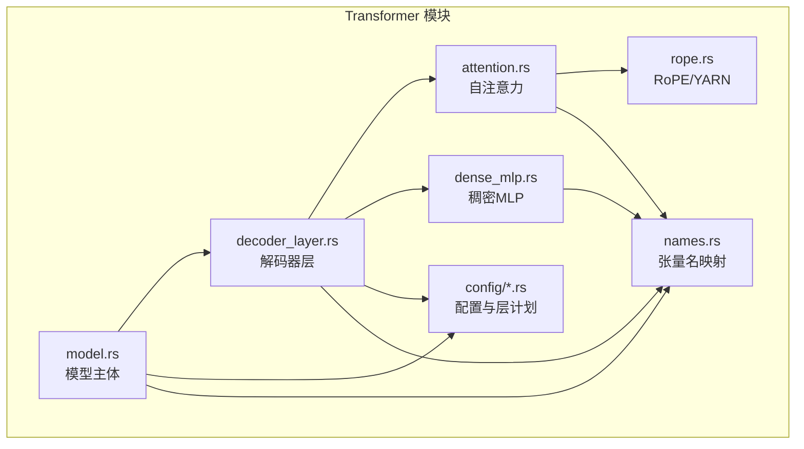
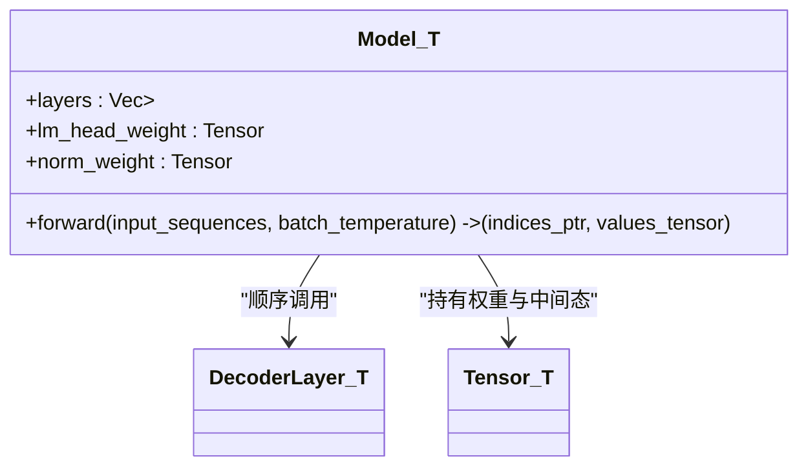
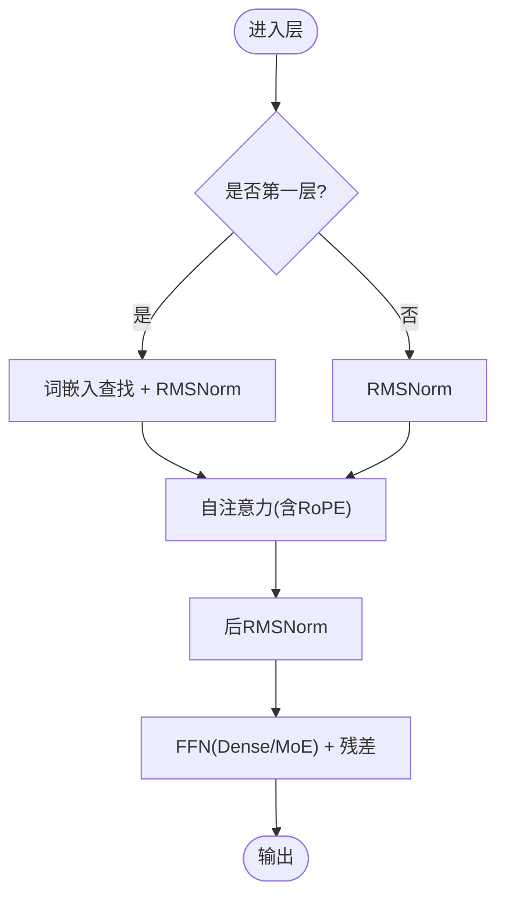
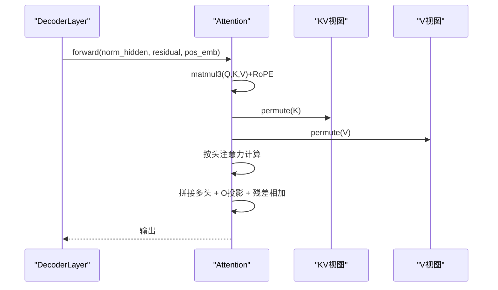
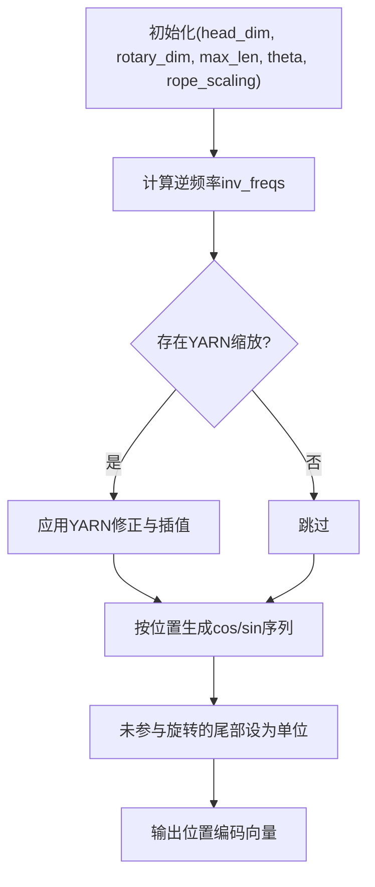
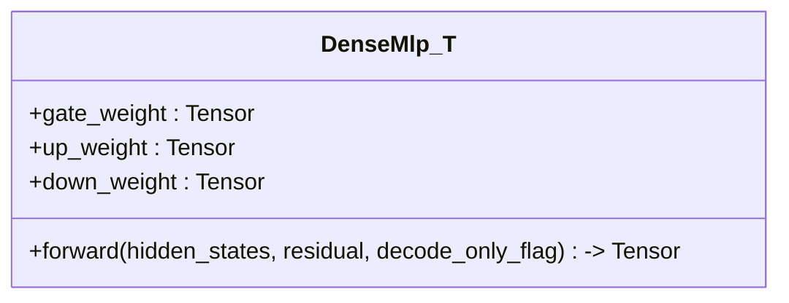
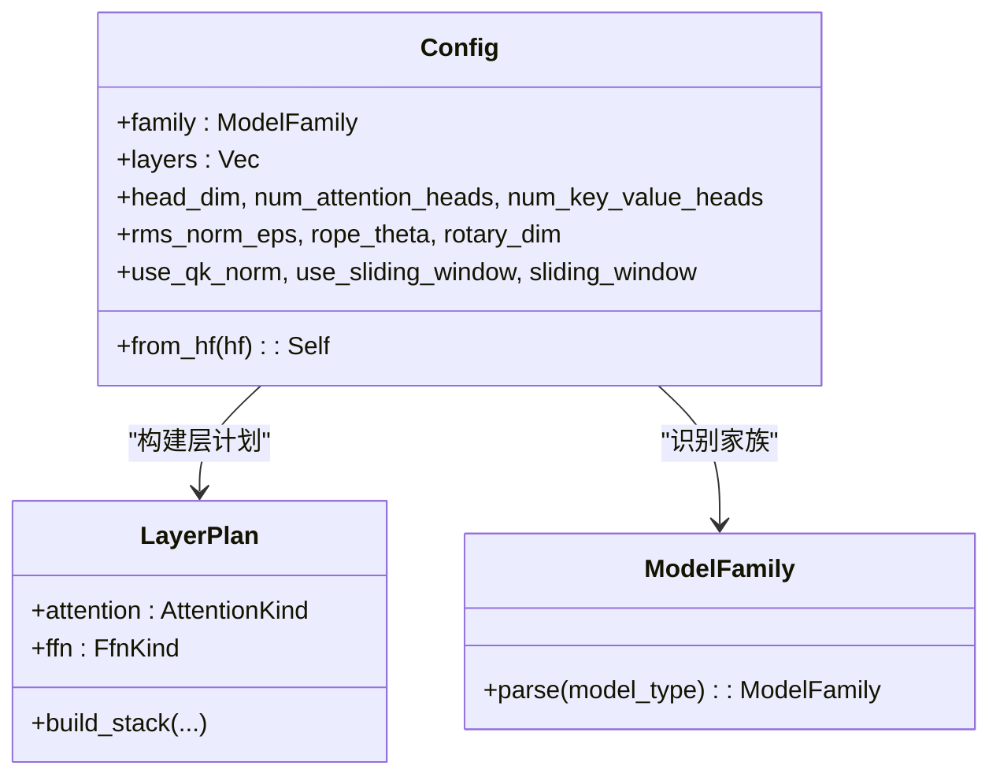
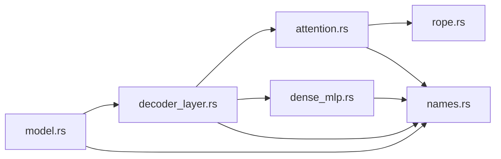

# Transformer 模型

<cite>
**本文引用的文件**
- [src/transformer/mod.rs](file://src/transformer/mod.rs)
- [src/transformer/model.rs](file://src/transformer/model.rs)
- [src/transformer/config/config.rs](file://src/transformer/config/config.rs)
- [src/transformer/config/attention_kind.rs](file://src/transformer/config/attention_kind.rs)
- [src/transformer/config/ffn_kind.rs](file://src/transformer/config/ffn_kind.rs)
- [src/transformer/config/layer_plan.rs](file://src/transformer/config/layer_plan.rs)
- [src/transformer/config/model_family.rs](file://src/transformer/config/model_family.rs)
- [src/transformer/decoder_layer.rs](file://src/transformer/decoder_layer.rs)
- [src/transformer/attention.rs](file://src/transformer/attention.rs)
- [src/transformer/dense_mlp.rs](file://src/transformer/dense_mlp.rs)
- [src/transformer/rope.rs](file://src/transformer/rope.rs)
- [src/transformer/names.rs](file://src/transformer/names.rs)
- [README.md](file://README.md)
</cite>

## 目录
1. [简介](#简介)
2. [项目结构](#项目结构)
3. [核心组件](#核心组件)
4. [架构总览](#架构总览)
5. [详细组件分析](#详细组件分析)
6. [依赖关系分析](#依赖关系分析)
7. [性能考量](#性能考量)
8. [故障排查指南](#故障排查指南)
9. [结论](#结论)
10. [附录](#附录)

## 简介
本技术文档围绕 eLLM 中的 Transformer 解码器实现，系统性阐述模型架构、注意力机制与前向传播流程、位置编码与 RoPE（含 YARN 缩放）、解码器层结构与 MLP 前馈网络实现，并给出配置参数说明、模型家族适配方法、权重加载与初始化流程、扩展自定义架构的指南以及性能分析与优化建议。该实现面向 CPU 服务器推理，强调静态计算图、连续 KV 缓存与“按头”注意力执行策略，以在长上下文场景下获得更优端到端延迟。

## 项目结构
Transformer 模块位于 src/transformer 下，采用分层组织：
- 顶层聚合与导出：mod.rs
- 模型主体与构造：model.rs
- 配置体系：config/*（包含模型族、注意力类型、FFN 类型、层计划等）
- 关键算子与层：attention.rs、decoder_layer.rs、dense_mlp.rs、sparse_moe/*、rope.rs
- 命名映射：names.rs（不同模型家族的张量名解析）

图表来源
- [src/transformer/mod.rs:1-9](file://src/transformer/mod.rs#L1-L9)
- [src/transformer/model.rs:1-549](file://src/transformer/model.rs#L1-L549)
- [src/transformer/decoder_layer.rs:1-406](file://src/transformer/decoder_layer.rs#L1-L406)
- [src/transformer/attention.rs:1-364](file://src/transformer/attention.rs#L1-L364)
- [src/transformer/dense_mlp.rs:1-102](file://src/transformer/dense_mlp.rs#L1-L102)
- [src/transformer/rope.rs:1-305](file://src/transformer/rope.rs#L1-L305)
- [src/transformer/config/config.rs:1-136](file://src/transformer/config/config.rs#L1-L136)
- [src/transformer/names.rs:1-134](file://src/transformer/names.rs#L1-L134)

章节来源
- [src/transformer/mod.rs:1-9](file://src/transformer/mod.rs#L1-L9)
- [README.md:1-207](file://README.md#L1-L207)

## 核心组件
- 模型主体 Model<T>：负责构建词嵌入、位置编码、多层解码器、最终 RMSNorm 与 LM Head，并驱动逐层前向与 TopK 采样。
- 解码器层 DecoderLayer<T>：组合输入 RMSNorm、自注意力、残差连接、后 RMSNorm 与 FFN（稠密或稀疏 MoE）。
- 注意力 Attention<T>：支持 GQA（多查询/分组键值头）、可选 Q/K 归一化、RoPE 注入、按头注意力计算与输出投影。
- 稠密 MLP DenseMlp<T>：Gate/Up 分支经 SiLU 门控融合，再经 Down 投影并与残差相加。
- 位置编码 RotaryEmbedding：标准 RoPE 频率表生成，支持 YARN 缩放与 attention_scaling。
- 配置 Config：从 HuggingFace 配置解析，统一抽象注意力类型、FFN 类型、滑动窗口、Q/K 归一化、EOS 等。
- 名称映射 names.rs：为不同模型家族提供一致的张量命名规范，便于权重加载。

章节来源
- [src/transformer/model.rs:28-252](file://src/transformer/model.rs#L28-L252)
- [src/transformer/decoder_layer.rs:33-231](file://src/transformer/decoder_layer.rs#L33-L231)
- [src/transformer/attention.rs:13-210](file://src/transformer/attention.rs#L13-L210)
- [src/transformer/dense_mlp.rs:12-101](file://src/transformer/dense_mlp.rs#L12-L101)
- [src/transformer/rope.rs:170-231](file://src/transformer/rope.rs#L170-L231)
- [src/transformer/config/config.rs:14-116](file://src/transformer/config/config.rs#L14-L116)
- [src/transformer/names.rs:56-134](file://src/transformer/names.rs#L56-L134)

## 架构总览
整体前向流程：
- 首层：对输入序列进行词嵌入查找与 RMSNorm；后续层先对隐藏状态做 RMSNorm。
- 自注意力：将隐藏状态线性变换为 Q/K/V，应用 RoPE，按头计算注意力，拼接多头输出并经 O 投影，与残差相加。
- FFN：根据层计划选择稠密 MLP 或稀疏 MoE，与残差相加。
- 末层之后：全局 RMSNorm + LM Head 矩阵乘法 + TopK Softmax 采样得到下一个 token。

```mermaid
sequenceDiagram
participant U as "调用方"
participant M as "Model<T>"
participant L as "DecoderLayer<T>"
participant A as "Attention<T>"
participant F as "DenseMlp<T>/SparseMoe<T>"
participant R as "RotaryEmbedding"
U->>M : forward(input_sequences, batch_temperature)
loop 遍历各层 i=0..N-1
M->>L : forward(hidden_states, input_sequences, decode_only_flag)
alt i==0
L->>L : 词嵌入查找+RMSNorm
else i>0
L->>L : RMSNorm
end
L->>A : forward(norm_hidden, residual, position_embedding)
A->>R : 使用预计算的旋转角
A-->>L : 注意力输出(已加残差)
L->>F : forward(norm_after_attn, attn_output)
F-->>L : FFN输出(已加残差)
L-->>M : 层输出
end
M->>M : 全局RMSNorm + LM Head + TopK Softmax
M-->>U : (topk_indices, topk_values)
```

图表来源
- [src/transformer/model.rs:174-251](file://src/transformer/model.rs#L174-L251)
- [src/transformer/decoder_layer.rs:152-230](file://src/transformer/decoder_layer.rs#L152-L230)
- [src/transformer/attention.rs:92-209](file://src/transformer/attention.rs#L92-L209)
- [src/transformer/dense_mlp.rs:46-100](file://src/transformer/dense_mlp.rs#L46-L100)
- [src/transformer/rope.rs:199-230](file://src/transformer/rope.rs#L199-L230)

## 详细组件分析

### 模型主体 Model<T>
- 职责
  - 构造词嵌入与位置编码张量，按配置创建多层解码器。
  - 维护推理参数（chunk_size、sequence_length、batch_size、topk、温度、采样开关、eos_ids 等）。
  - 前向：逐层调用解码器，最后 RMSNorm + LM Head + TopK Softmax。
- 关键点
  - 通过 names.rs 获取模型张量命名空间，确保权重加载路径一致。
  - 最后一层设置 decode_only_flag=true，以便在解码阶段仅处理最后一个 token。
  - 使用 matmul_local_topk 与 topk_softmax 完成高效 TopK 采样。

图表来源
- [src/transformer/model.rs:28-168](file://src/transformer/model.rs#L28-L168)
- [src/transformer/model.rs:174-251](file://src/transformer/model.rs#L174-L251)

章节来源
- [src/transformer/model.rs:28-168](file://src/transformer/model.rs#L28-L168)
- [src/transformer/model.rs:174-251](file://src/transformer/model.rs#L174-L251)

### 解码器层 DecoderLayer<T>
- 结构
  - 输入 RMSNorm（首层结合词嵌入），自注意力块（Full/SlidingWindow），后 RMSNorm，FFN（Dense/SparseMoe），残差连接。
- 要点
  - 首层通过 lookup_rms 直接查词嵌入并 RMSNorm，避免额外拷贝。
  - 注意力输出与残差相加后再进入 FFN。
  - 根据 config.layers[layer_idx] 的计划动态选择注意力与 FFN 类型。

图表来源
- [src/transformer/decoder_layer.rs:152-230](file://src/transformer/decoder_layer.rs#L152-L230)

章节来源
- [src/transformer/decoder_layer.rs:33-231](file://src/transformer/decoder_layer.rs#L33-L231)

### 注意力 Attention<T>
- 特性
  - 支持 GQA（num_key_value_heads ≤ num_attention_heads）。
  - 可选 Q/K 归一化（use_qk_norm）。
  - 通过 matmul3 一次性生成 Q/K/V，并在内部应用 RoPE。
  - 按头注意力计算，减少内存占用并提升缓存命中率。
  - 输出经 O 投影并与残差相加。
- 数据流
  - hidden_states → Q/K/V 线性变换 → 形状重排与 RoPE → 注意力 → 拼接与 O 投影 → 残差相加。

图表来源
- [src/transformer/attention.rs:92-209](file://src/transformer/attention.rs#L92-L209)

章节来源
- [src/transformer/attention.rs:13-210](file://src/transformer/attention.rs#L13-L210)

### 位置编码与 RoPE（含 YARN）
- 功能
  - 基于 theta 与 rotary_dim 生成逆频率表，按位置展开 cos/sin 旋转矩阵。
  - 支持 partial rotary（rotary_dim < head_dim），尾部维度恒等。
  - 支持 YARN 缩放：factor、beta_fast/beta_slow、attention_factor 等，用于外推长上下文。
- 输出
  - 预计算位置编码向量，供注意力在 Q/K 上应用旋转。

图表来源
- [src/transformer/rope.rs:170-231](file://src/transformer/rope.rs#L170-L231)
- [src/transformer/rope.rs:27-77](file://src/transformer/rope.rs#L27-L77)
- [src/transformer/rope.rs:95-126](file://src/transformer/rope.rs#L95-L126)

章节来源
- [src/transformer/rope.rs:170-231](file://src/transformer/rope.rs#L170-L231)

### 稠密 MLP DenseMlp<T>
- 结构
  - Gate/Up 两个线性分支，SiLU 激活门控融合，Down 投影与残差相加。
- 优化
  - 多次 matmul 使用统一的 MatMulParams 宏步长，利于 SIMD/AMX 内核调度。
  - silu_mul 融合激活与乘法，减少中间存储与访存。

图表来源
- [src/transformer/dense_mlp.rs:12-101](file://src/transformer/dense_mlp.rs#L12-L101)

章节来源
- [src/transformer/dense_mlp.rs:12-101](file://src/transformer/dense_mlp.rs#L12-L101)

### 配置与模型家族适配
- 配置解析
  - 从 HuggingFace 配置转换为内部 Config，推导 head_dim、num_key_value_heads、intermediate_size、sliding window、Q/K 归一化、EOS 等。
- 层计划 LayerPlan
  - 根据 layer_types、use_sliding_window、max_window_layers 决定每层的注意力类型（Full/SlidingWindow/Linear）。
  - 根据 mlp_only_layers、decoder_sparse_step、num_experts 等决定每层 FFN 类型（Dense/SparseMoe）。
- 模型家族
  - 支持 Qwen、Llama、Mixtral、MiniMax、MiniMaxM2 等，未知类型保留字符串标识。
- 张量命名
  - names.rs 为不同家族提供一致的 scope 与权重键名，便于统一加载。

图表来源
- [src/transformer/config/config.rs:39-116](file://src/transformer/config/config.rs#L39-L116)
- [src/transformer/config/layer_plan.rs:14-35](file://src/transformer/config/layer_plan.rs#L14-L35)
- [src/transformer/config/model_family.rs:13-25](file://src/transformer/config/model_family.rs#L13-L25)
- [src/transformer/names.rs:56-134](file://src/transformer/names.rs#L56-L134)

章节来源
- [src/transformer/config/config.rs:14-116](file://src/transformer/config/config.rs#L14-L116)
- [src/transformer/config/attention_kind.rs:1-36](file://src/transformer/config/attention_kind.rs#L1-L36)
- [src/transformer/config/ffn_kind.rs:1-59](file://src/transformer/config/ffn_kind.rs#L1-L59)
- [src/transformer/config/layer_plan.rs:1-36](file://src/transformer/config/layer_plan.rs#L1-L36)
- [src/transformer/config/model_family.rs:1-26](file://src/transformer/config/model_family.rs#L1-L26)
- [src/transformer/names.rs:1-134](file://src/transformer/names.rs#L1-L134)

## 依赖关系分析
- 模块耦合
  - model.rs 依赖 decoder_layer.rs、names.rs、config/config.rs。
  - decoder_layer.rs 依赖 attention.rs、dense_mlp.rs、sparse_moe/*、names.rs、config/*。
  - attention.rs 依赖 rope.rs、tensor 与 kernel 算子。
  - dense_mlp.rs 依赖 tensor 与 kernel 算子。
- 外部依赖
  - 算子库（kernel）：matmul、softmax、silu、rms_norm、flash_attention 等。
  - 内存池与操作符队列：GlobalMemPool、GlobalOperatorQueue。
- 潜在循环
  - 当前结构无循环依赖，层次清晰。

图表来源
- [src/transformer/model.rs:1-549](file://src/transformer/model.rs#L1-L549)
- [src/transformer/decoder_layer.rs:1-406](file://src/transformer/decoder_layer.rs#L1-L406)
- [src/transformer/attention.rs:1-364](file://src/transformer/attention.rs#L1-L364)
- [src/transformer/dense_mlp.rs:1-102](file://src/transformer/dense_mlp.rs#L1-L102)
- [src/transformer/rope.rs:1-305](file://src/transformer/rope.rs#L1-L305)
- [src/transformer/names.rs:1-134](file://src/transformer/names.rs#L1-L134)

章节来源
- [src/transformer/model.rs:1-549](file://src/transformer/model.rs#L1-L549)
- [src/transformer/decoder_layer.rs:1-406](file://src/transformer/decoder_layer.rs#L1-L406)
- [src/transformer/attention.rs:1-364](file://src/transformer/attention.rs#L1-L364)
- [src/transformer/dense_mlp.rs:1-102](file://src/transformer/dense_mlp.rs#L1-L102)
- [src/transformer/rope.rs:1-305](file://src/transformer/rope.rs#L1-L305)
- [src/transformer/names.rs:1-134](file://src/transformer/names.rs#L1-L134)

## 性能考量
- 按头注意力执行：在 Prefill 阶段逐个注意力头计算，最大化 KV 在 CPU 缓存中的驻留时间，降低重复访存。
- 静态形状 KV 缓存：非分页、固定形状的 KV 张量，按坐标直接读写，减少元数据与地址映射开销。
- 大规模张量布局：维度优先布局，相同逻辑坐标的元素在同一内存位置，有利于连续访问与硬件预取。
- 算子融合与宏步长：matmul3、silu_mul、matmul_add 等融合算子配合 MatMulParams 宏步长，提高 SIMD/AMX 利用率。
- 线程并行：依据系统可用并行度分配线程，平衡吞吐与延迟。

[本节为通用性能讨论，不直接分析具体文件]

## 故障排查指南
- 常见错误定位
  - 配置缺失或不匹配：检查 HuggingFace 配置字段是否完整，特别是 head_dim、num_key_value_heads、moe 相关参数。
  - 张量名不一致：确认 names.rs 中 scope 与权重键名与实际模型权重一致。
  - 设备特性检测：如 f16 测试需要 avx512fp16 支持，否则跳过相应测试。
- 调试手段
  - 开启对齐追踪环境变量，打印层构建过程，辅助定位算子构建问题。
  - 使用测试用例快速验证层与模型的形状与行为一致性。

章节来源
- [src/transformer/model.rs:174-251](file://src/transformer/model.rs#L174-L251)
- [src/transformer/model.rs:383-450](file://src/transformer/model.rs#L383-L450)

## 结论
该 Transformer 实现以 CPU 为中心，通过静态计算图、连续 KV 缓存与按头注意力执行，显著降低长上下文推理的控制与内存管理开销。配合 RoPE/YARN、GQA、Q/K 归一化、MoE 与算子融合，兼顾精度与效率。对于长上下文主导的工作负载（如 RAG、代码助手、深度研究），该架构具备显著的端到端优势。

[本节为总结性内容，不直接分析具体文件]

## 附录

### 模型配置参数说明与调优建议
- 基础参数
  - vocab_size、hidden_size、num_hidden_layers、num_attention_heads、num_key_value_heads、head_dim、max_position_embeddings、rms_norm_eps、rope_theta、rotary_dim、tie_word_embeddings。
- 注意力与窗口
  - use_sliding_window、sliding_window、max_window_layers、layer_types（控制 Full/SlidingWindow/Linear）。
- FFN 与 MoE
  - intermediate_size、moe_intermediate_size、num_experts、num_experts_per_tok、norm_topk_prob、decoder_sparse_step、mlp_only_layers。
- 其他
  - qkv_bias、use_qk_norm、rope_scaling（YARN 参数）、eos_token_id/eos_token_ids。
- 调优建议
  - 长上下文：增大 max_position_embeddings 与 chunk_size，启用滑动窗口以降低显存/内存压力。
  - 吞吐：适当增加 num_attention_heads 与 batch_size，合理设置 topk_size 与温度。
  - 精度：保持 head_dim 偶数、rotary_dim 偶数且不超过 head_dim；必要时调整 rope_theta 与 YARN factor。

章节来源
- [src/transformer/config/config.rs:14-116](file://src/transformer/config/config.rs#L14-L116)
- [src/transformer/config/attention_kind.rs:1-36](file://src/transformer/config/attention_kind.rs#L1-L36)
- [src/transformer/config/ffn_kind.rs:1-59](file://src/transformer/config/ffn_kind.rs#L1-L59)
- [src/transformer/config/layer_plan.rs:1-36](file://src/transformer/config/layer_plan.rs#L1-L36)

### 支持的模型家族与适配方法
- 支持家族：Qwen、Llama、Mixtral、MiniMax、MiniMaxM2。
- 适配步骤
  - 在 model_family.rs 中添加新 family 枚举项与解析规则。
  - 在 names.rs 中为新 family 定义 scope 与权重键名。
  - 在 config/config.rs 中补充 HuggingFace 字段到内部配置的映射。
  - 在 layer_plan.rs 与 ffn_kind.rs 中扩展层计划与 FFN 类型解析。

章节来源
- [src/transformer/config/model_family.rs:1-26](file://src/transformer/config/model_family.rs#L1-L26)
- [src/transformer/names.rs:56-134](file://src/transformer/names.rs#L56-L134)
- [src/transformer/config/config.rs:39-116](file://src/transformer/config/config.rs#L39-L116)
- [src/transformer/config/layer_plan.rs:14-35](file://src/transformer/config/layer_plan.rs#L14-L35)
- [src/transformer/config/ffn_kind.rs:30-57](file://src/transformer/config/ffn_kind.rs#L30-L57)

### 权重加载与初始化流程
- 初始化
  - 通过 names.rs 获取 scope 与权重键名。
  - 使用 Tensor::zeros/from_vec 创建零张量或从向量初始化（如位置编码）。
- 加载
  - 运行时由上层 loader 根据键名写入权重（names.rs 保证键名一致性）。
- 示例路径
  - 词嵌入：model.embed_tokens.weight
  - 位置编码：model.position_embedding.weight
  - 层内权重：model.layers.{i}.self_attn.*、model.layers.{i}.mlp.*、input_layernorm.weight、post_attention_layernorm.weight
  - 输出头：lm_head.weight 或共享词嵌入

章节来源
- [src/transformer/names.rs:56-134](file://src/transformer/names.rs#L56-L134)
- [src/transformer/model.rs:109-168](file://src/transformer/model.rs#L109-L168)

### 自定义模型架构扩展指南
- 新增注意力类型
  - 在 attention_kind.rs 中扩展 AttentionKind 枚举，并在 decoder_layer.rs 中处理新分支。
- 新增 FFN 类型
  - 在 ffn_kind.rs 中扩展 FfnKind 变体，实现对应层（参考 sparse_moe 模式），并在 decoder_layer.rs 中路由。
- 自定义位置编码
  - 在 rope.rs 中扩展新的缩放或编码策略，并在 attention.rs 中集成。
- 自定义命名空间
  - 在 names.rs 中为新架构添加 scope 与权重键名映射。

章节来源
- [src/transformer/config/attention_kind.rs:1-36](file://src/transformer/config/attention_kind.rs#L1-L36)
- [src/transformer/config/ffn_kind.rs:1-59](file://src/transformer/config/ffn_kind.rs#L1-L59)
- [src/transformer/decoder_layer.rs:77-150](file://src/transformer/decoder_layer.rs#L77-L150)
- [src/transformer/rope.rs:170-231](file://src/transformer/rope.rs#L170-L231)
- [src/transformer/names.rs:56-134](file://src/transformer/names.rs#L56-L134)

### 模型性能分析与优化技巧
- 关注点
  - 按头注意力执行、KV 连续布局、算子融合、SIMD/AMX 宏步长、线程并行度。
- 技巧
  - 调整 MatMulParams 宏步长以匹配目标 CPU 特性。
  - 合理设置 chunk_size 与 sequence_length，避免频繁重建计算图。
  - 在长上下文场景优先 Prefill 一次完成，减少重复参数加载。

[本节为通用指导，不直接分析具体文件]