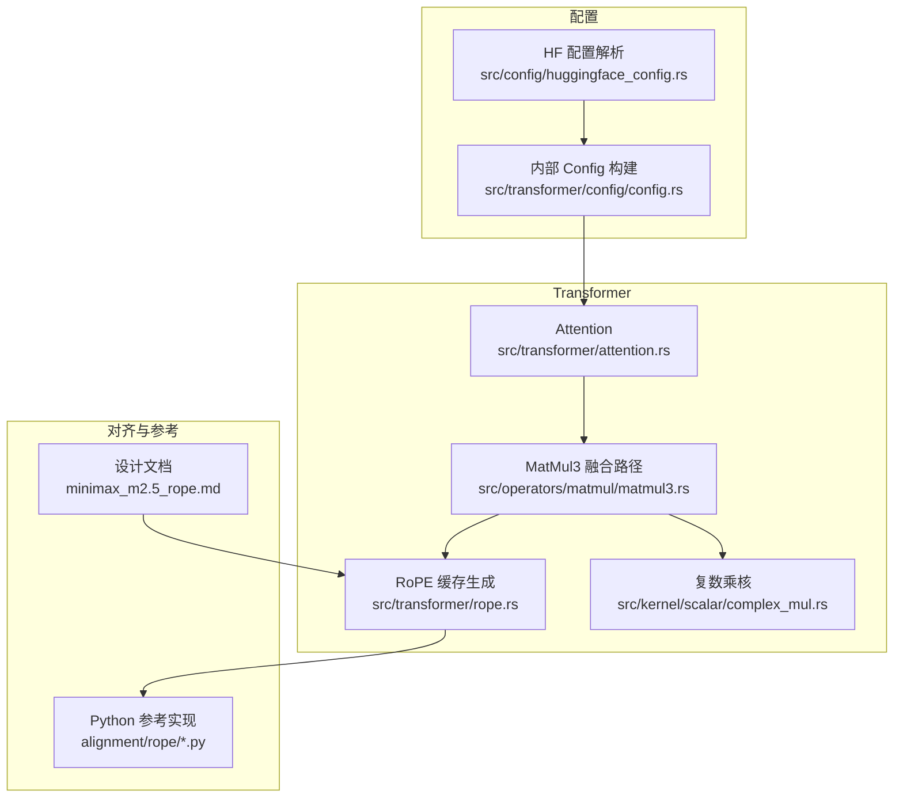
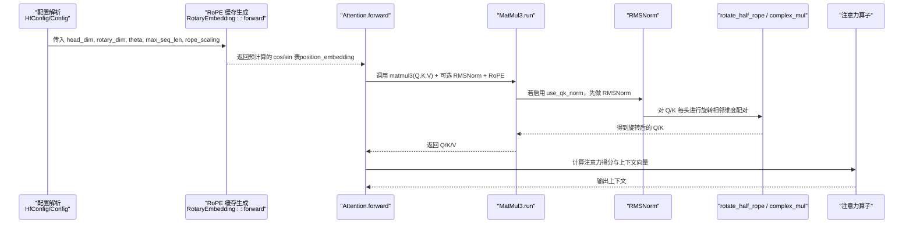
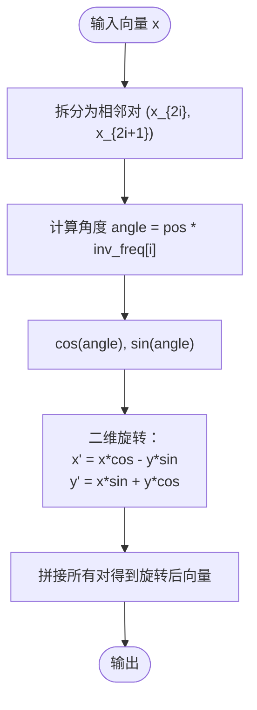
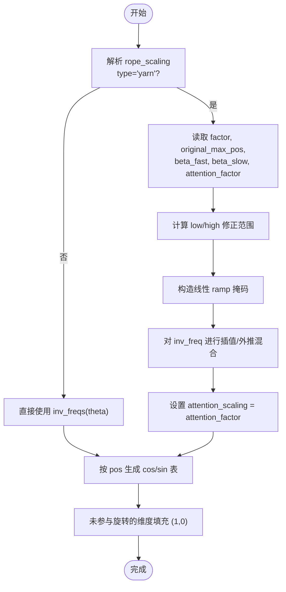
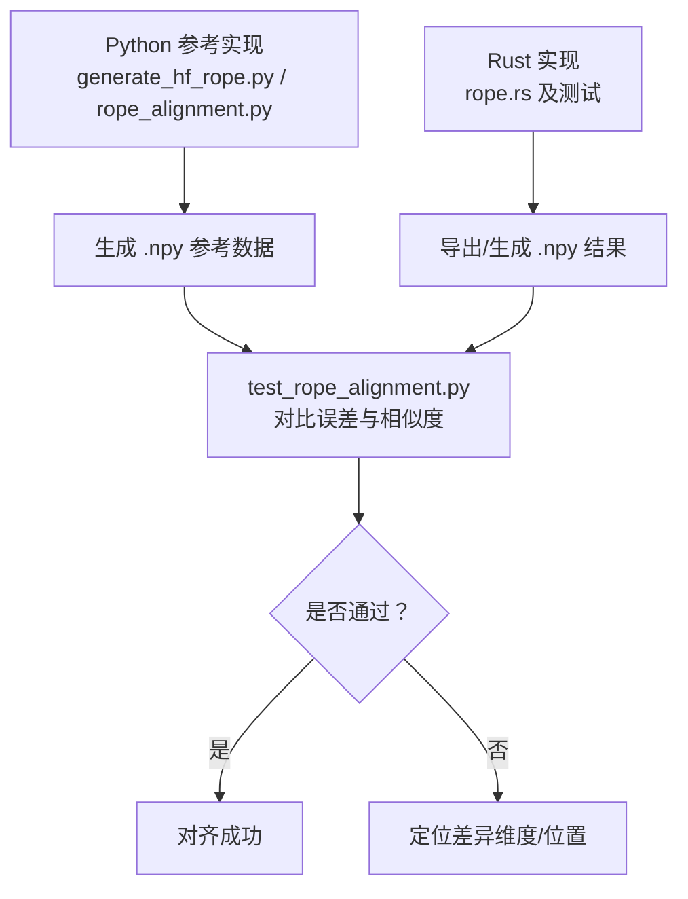
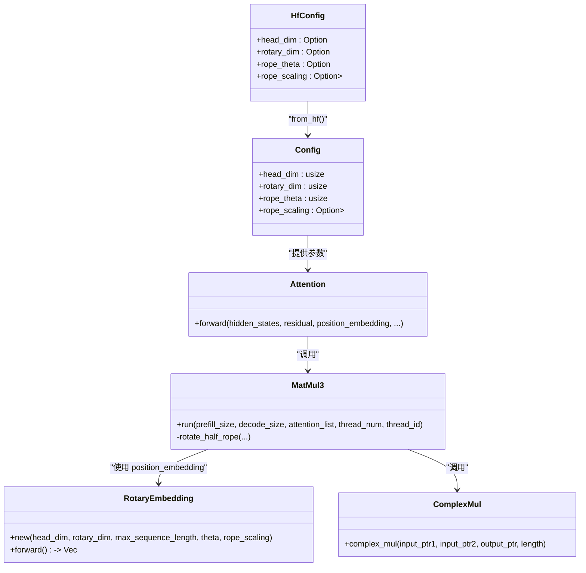

# 位置编码与 RoPE

<cite>
**本文引用的文件**   
- [src/transformer/rope.rs](file://src/transformer/rope.rs)
- [alignment/rope/rope_alignment.py](file://alignment/rope/rope_alignment.py)
- [alignment/rope/generate_hf_rope.py](file://alignment/rope/generate_hf_rope.py)
- [alignment/rope/test_rope_alignment.py](file://alignment/rope/test_rope_alignment.py)
- [docs/design/transformers/minimax_m2.5_rope.md](file://docs/design/transformers/minimax_m2.5_rope.md)
- [src/config/huggingface_config.rs](file://src/config/huggingface_config.rs)
- [src/transformer/config/config.rs](file://src/transformer/config/config.rs)
- [src/transformer/attention.rs](file://src/transformer/attention.rs)
- [src/operators/matmul/matmul3.rs](file://src/operators/matmul/matmul3.rs)
- [src/kernel/scalar/complex_mul.rs](file://src/kernel/scalar/complex_mul.rs)
</cite>

## 目录
1. [引言](#引言)
2. [项目结构](#项目结构)
3. [核心组件](#核心组件)
4. [架构总览](#架构总览)
5. [详细组件分析](#详细组件分析)
6. [依赖关系分析](#依赖关系分析)
7. [性能考量](#性能考量)
8. [故障排查指南](#故障排查指南)
9. [结论](#结论)
10. [附录](#附录)

## 引言
本技术文档围绕“位置编码”与“旋转位置编码（RoPE）”展开，结合仓库中的实现与对齐测试，系统阐述：
- 绝对位置编码与相对位置编码的区别与应用场景
- RoPE 的数学原理、几何变换解释与注意力中的作用
- 旋转矩阵构造方法与角度插值策略（含 YARN 缩放）
- 参数配置与调优建议
- 对齐测试与验证方法
- 不同模型家族的位置编码差异与适配方案

## 项目结构
本项目在 Transformer 模块中实现了 RoPE 缓存生成与融合计算路径，并在 alignment 目录下提供 Python 参考实现与对齐脚本。关键文件组织如下：
- 位置编码与 RoPE 核心：src/transformer/rope.rs
- 注意力与 Q/K/V 投影融合路径：src/transformer/attention.rs、src/operators/matmul/matmul3.rs
- 复数乘法内核：src/kernel/scalar/complex_mul.rs
- HuggingFace 配置解析与默认值推导：src/config/huggingface_config.rs、src/transformer/config/config.rs
- 对齐与参考实现：alignment/rope/*.py
- 设计说明（MiniMax-M2.5 的 partial-dimension RoPE 与 attention_scaling）：docs/design/transformers/minimax_m2.5_rope.md

图表来源
- [src/transformer/attention.rs:92-209](file://src/transformer/attention.rs#L92-L209)
- [src/operators/matmul/matmul3.rs:22-45](file://src/operators/matmul/matmul3.rs#L22-L45)
- [src/transformer/rope.rs:179-231](file://src/transformer/rope.rs#L179-L231)
- [src/kernel/scalar/complex_mul.rs:3-21](file://src/kernel/scalar/complex_mul.rs#L3-L21)
- [src/config/huggingface_config.rs:10-76](file://src/config/huggingface_config.rs#L10-L76)
- [src/transformer/config/config.rs:39-116](file://src/transformer/config/config.rs#L39-L116)
- [alignment/rope/rope_alignment.py:63-133](file://alignment/rope/rope_alignment.py#L63-L133)
- [docs/design/transformers/minimax_m2.5_rope.md:1-282](file://docs/design/transformers/minimax_m2.5_rope.md#L1-L282)

章节来源
- [src/transformer/attention.rs:92-209](file://src/transformer/attention.rs#L92-L209)
- [src/operators/matmul/matmul3.rs:22-45](file://src/operators/matmul/matmul3.rs#L22-L45)
- [src/transformer/rope.rs:179-231](file://src/transformer/rope.rs#L179-L231)
- [src/kernel/scalar/complex_mul.rs:3-21](file://src/kernel/scalar/complex_mul.rs#L3-L21)
- [src/config/huggingface_config.rs:10-76](file://src/config/huggingface_config.rs#L10-L76)
- [src/transformer/config/config.rs:39-116](file://src/transformer/config/config.rs#L39-L116)
- [alignment/rope/rope_alignment.py:63-133](file://alignment/rope/rope_alignment.py#L63-L133)
- [docs/design/transformers/minimax_m2.5_rope.md:1-282](file://docs/design/transformers/minimax_m2.5_rope.md#L1-L282)

## 核心组件
- RoPE 缓存生成器：负责按 head_dim、rotary_dim、theta、max_sequence_length 以及 rope_scaling 生成 cos/sin 表，并支持 YARN 缩放与 attention_scaling。
- 注意力前向路径：将隐藏状态经 Q/K/V 线性投影后，在 K/Q 上应用 RMSNorm+RoPE，再进入注意力打分与输出合并。
- 复数乘法内核：以相邻两维为一对复数，执行标准复数乘法，等价于二维平面上的旋转。
- 配置解析：从 HF config.json 读取 head_dim、rotary_dim、rope_theta、rope_scaling 等字段，并提供合理默认值。

章节来源
- [src/transformer/rope.rs:179-231](file://src/transformer/rope.rs#L179-L231)
- [src/transformer/attention.rs:92-209](file://src/transformer/attention.rs#L92-L209)
- [src/operators/matmul/matmul3.rs:22-45](file://src/operators/matmul/matmul3.rs#L22-L45)
- [src/kernel/scalar/complex_mul.rs:3-21](file://src/kernel/scalar/complex_mul.rs#L3-L21)
- [src/config/huggingface_config.rs:10-76](file://src/config/huggingface_config.rs#L10-L76)
- [src/transformer/config/config.rs:39-116](file://src/transformer/config/config.rs#L39-L116)

## 架构总览
下图展示了从配置到注意力计算的端到端流程，包括 RoPE 缓存生成、Q/K/V 投影、RMSNorm+RoPE 融合、以及注意力打分。

图表来源
- [src/transformer/config/config.rs:39-116](file://src/transformer/config/config.rs#L39-L116)
- [src/transformer/rope.rs:179-231](file://src/transformer/rope.rs#L179-L231)
- [src/transformer/attention.rs:92-209](file://src/transformer/attention.rs#L92-L209)
- [src/operators/matmul/matmul3.rs:22-45](file://src/operators/matmul/matmul3.rs#L22-L45)
- [src/kernel/scalar/complex_mul.rs:3-21](file://src/kernel/scalar/complex_mul.rs#L3-L21)

## 详细组件分析

### 绝对位置编码 vs 相对位置编码
- 绝对位置编码：为每个位置添加独立的可学习或固定向量，直接加到 token 表示上。优点是直观；缺点是与序列长度强耦合，外推能力有限。
- 相对位置编码：通过位置差建模相关性，常见形式如 ALiBi、T5 相对位置偏置等。优点是对长度变化更鲁棒，便于外推；缺点是需额外偏置项或核函数设计。
- 在本仓库中，RoPE 属于“将位置信息注入到查询/键的几何相位中”，其注意力点积天然携带相对位置信息，因此可视为一种“隐式相对位置”机制。

[本节为概念性内容，不直接分析具体文件]

### RoPE 的数学原理与几何变换
- 基本思想：将相邻两个维度视作复数 z = x_even + i·x_odd，乘以单位复数 e^{iθ} = cosθ + i·sinθ，实现二维平面旋转。
- 角度定义：对于第 i 个频率对，angle(pos, i) = pos × inv_freq[i]，其中 inv_freq[i] = θ^{-i/head_dim}（偶数位索引）。
- 注意力影响：Q 与 K 的点积会包含 cos(Δpos·inv_freq) 与 sin(Δpos·inv_freq) 的组合，从而引入相对位置偏好。

图表来源
- [src/transformer/rope.rs:199-231](file://src/transformer/rope.rs#L199-L231)
- [src/operators/matmul/matmul3.rs:22-45](file://src/operators/matmul/matmul3.rs#L22-L45)
- [src/kernel/scalar/complex_mul.rs:3-21](file://src/kernel/scalar/complex_mul.rs#L3-L21)

章节来源
- [src/transformer/rope.rs:199-231](file://src/transformer/rope.rs#L199-L231)
- [src/operators/matmul/matmul3.rs:22-45](file://src/operators/matmul/matmul3.rs#L22-L45)
- [src/kernel/scalar/complex_mul.rs:3-21](file://src/kernel/scalar/complex_mul.rs#L3-L21)

### 旋转矩阵构造与角度插值策略（YARN）
- 基础频率：inv_freqs(dim, theta) 按偶数位步长生成，保证成对维度参与旋转。
- YARN 缩放：当 rope_scaling.rope_type == "yarn" 时，根据 factor、original_max_position_embeddings、beta_fast、beta_slow 计算低频/高频修正范围，并对 inv_freq 进行插值/外推混合，同时使用 attention_factor 作为 attention_scaling 作用于 cos/sin。
- 部分旋转（Partial Rotary）：仅前 rotary_dim 维度参与旋转，其余维度保持恒等映射（cos=1, sin=0），有利于控制旋转强度与容量。

图表来源
- [src/transformer/rope.rs:27-77](file://src/transformer/rope.rs#L27-L77)
- [src/transformer/rope.rs:95-126](file://src/transformer/rope.rs#L95-L126)
- [src/transformer/rope.rs:140-167](file://src/transformer/rope.rs#L140-L167)
- [src/transformer/rope.rs:199-231](file://src/transformer/rope.rs#L199-L231)
- [alignment/rope/rope_alignment.py:40-60](file://alignment/rope/rope_alignment.py#L40-L60)

章节来源
- [src/transformer/rope.rs:27-77](file://src/transformer/rope.rs#L27-L77)
- [src/transformer/rope.rs:95-126](file://src/transformer/rope.rs#L95-L126)
- [src/transformer/rope.rs:140-167](file://src/transformer/rope.rs#L140-L167)
- [src/transformer/rope.rs:199-231](file://src/transformer/rope.rs#L199-L231)
- [alignment/rope/rope_alignment.py:40-60](file://alignment/rope/rope_alignment.py#L40-L60)

### 位置编码在注意力中的作用与影响
- 注入方式：在 Q/K 上应用 RoPE，使 QK^T 的点积包含相对位置信息，无需显式偏置。
- 数值稳定性：配合 RMSNorm（use_qk_norm=true）稳定 Q/K 范数，避免大尺度导致 softmax 饱和。
- 缩放因子：attention_scaling 用于匹配特定 RoPE 变体的数值范围，确保注意力分数分布合理。

章节来源
- [src/transformer/attention.rs:92-209](file://src/transformer/attention.rs#L92-L209)
- [src/operators/matmul/matmul3.rs:22-45](file://src/operators/matmul/matmul3.rs#L22-L45)
- [docs/design/transformers/minimax_m2.5_rope.md:94-106](file://docs/design/transformers/minimax_m2.5_rope.md#L94-L106)

### 参数配置与调优指南
- 关键参数
  - head_dim：每头的维度，决定旋转空间大小。
  - rotary_dim：实际参与旋转的维度（≤ head_dim），小于 head_dim 时为“部分旋转”。
  - rope_theta：频率基值，越大则高频分量衰减越慢。
  - rope_scaling：支持 yarn 类型，包含 factor、original_max_position_embeddings、beta_fast、beta_slow、attention_factor。
- 默认值与推导
  - 若未指定 head_dim，可从 hidden_size / num_attention_heads 推导。
  - 若未指定 rotary_dim，默认等于 head_dim。
  - rope_theta 默认 10000。
- 调优建议
  - 长文本外推：优先尝试 YARN 的 factor 与 attention_factor，观察困惑度与长程任务表现。
  - 部分旋转：适当减小 rotary_dim 以降低旋转强度，提升训练稳定性。
  - 频率基值：增大 rope_theta 可增强高频细节保留，但可能带来数值不稳定风险。

章节来源
- [src/config/huggingface_config.rs:21-54](file://src/config/huggingface_config.rs#L21-L54)
- [src/transformer/config/config.rs:39-116](file://src/transformer/config/config.rs#L39-L116)
- [src/transformer/rope.rs:179-197](file://src/transformer/rope.rs#L179-L197)
- [docs/design/transformers/minimax_m2.5_rope.md:32-49](file://docs/design/transformers/minimax_m2.5_rope.md#L32-L49)

### 对齐测试与验证方法
- 参考实现：Python 脚本生成与 Rust 一致的 RoPE 输出，覆盖基础、部分旋转、YARN 三种情况。
- 对比指标：最大绝对误差、平均绝对误差、余弦相似度阈值判定。
- 运行步骤
  - 使用 Python 生成参考数据（numpy 数组）。
  - 运行 Rust 侧导出或单元测试生成对应数据。
  - 比较两者输出，满足阈值即通过。

图表来源
- [alignment/rope/generate_hf_rope.py:15-40](file://alignment/rope/generate_hf_rope.py#L15-L40)
- [alignment/rope/rope_alignment.py:63-133](file://alignment/rope/rope_alignment.py#L63-L133)
- [alignment/rope/test_rope_alignment.py:179-250](file://alignment/rope/test_rope_alignment.py#L179-L250)
- [src/transformer/rope.rs:233-304](file://src/transformer/rope.rs#L233-L304)

章节来源
- [alignment/rope/generate_hf_rope.py:15-40](file://alignment/rope/generate_hf_rope.py#L15-L40)
- [alignment/rope/rope_alignment.py:63-133](file://alignment/rope/rope_alignment.py#L63-L133)
- [alignment/rope/test_rope_alignment.py:179-250](file://alignment/rope/test_rope_alignment.py#L179-L250)
- [src/transformer/rope.rs:233-304](file://src/transformer/rope.rs#L233-L304)

### 不同模型家族的位置编码差异与适配方案
- MiniMax-M2.5：采用“部分维度 RoPE”，rotary_dim < head_dim，前 rotary_dim 维度参与旋转，其余维度恒等。同时返回 attention_scaling 以匹配该变体数值范围。
- Qwen3 系列：默认启用 use_qk_norm，Q/K 先归一化再应用 RoPE，有助于稳定性。
- 适配要点
  - 明确 rotary_dim 与 head_dim 的关系，确保只在前 rotary_dim 维度应用旋转。
  - 关注 attention_scaling 的作用位置（通常作用于 cos/sin 或 Q/K 旋转阶段）。
  - 检查 rope_scaling 的 type 与字段名兼容（rope_type/type、attention_factor/attn_factor）。

章节来源
- [docs/design/transformers/minimax_m2.5_rope.md:17-29](file://docs/design/transformers/minimax_m2.5_rope.md#L17-L29)
- [docs/design/transformers/minimax_m2.5_rope.md:94-106](file://docs/design/transformers/minimax_m2.5_rope.md#L94-L106)
- [src/transformer/config/config.rs:56-61](file://src/transformer/config/config.rs#L56-L61)
- [src/transformer/rope.rs:27-77](file://src/transformer/rope.rs#L27-L77)

## 依赖关系分析
- 配置层：HfConfig 解析 JSON，Config 构建内部结构，提供 head_dim、rotary_dim、rope_theta、rope_scaling 等。
- 计算层：Attention 调用 MatMul3 进行三路投影，并在 Q/K 路径选择性地执行 RMSNorm+RoPE。
- 内核层：复杂乘法与旋转操作由 scalar/x86_64 特化路径加速。
- 对齐层：Python 参考实现与 Rust 实现保持一致，便于回归验证。

图表来源
- [src/config/huggingface_config.rs:10-76](file://src/config/huggingface_config.rs#L10-L76)
- [src/transformer/config/config.rs:39-116](file://src/transformer/config/config.rs#L39-L116)
- [src/transformer/attention.rs:92-209](file://src/transformer/attention.rs#L92-L209)
- [src/operators/matmul/matmul3.rs:22-45](file://src/operators/matmul/matmul3.rs#L22-L45)
- [src/transformer/rope.rs:179-231](file://src/transformer/rope.rs#L179-L231)
- [src/kernel/scalar/complex_mul.rs:3-21](file://src/kernel/scalar/complex_mul.rs#L3-L21)

章节来源
- [src/config/huggingface_config.rs:10-76](file://src/config/huggingface_config.rs#L10-L76)
- [src/transformer/config/config.rs:39-116](file://src/transformer/config/config.rs#L39-L116)
- [src/transformer/attention.rs:92-209](file://src/transformer/attention.rs#L92-L209)
- [src/operators/matmul/matmul3.rs:22-45](file://src/operators/matmul/matmul3.rs#L22-L45)
- [src/transformer/rope.rs:179-231](file://src/transformer/rope.rs#L179-L231)
- [src/kernel/scalar/complex_mul.rs:3-21](file://src/kernel/scalar/complex_mul.rs#L3-L21)

## 性能考量
- 融合路径：MatMul3 在 GEMM 完成后立即执行 RMSNorm+RoPE，减少中间内存读写与访存开销。
- 微内核优化：针对 f16 的 AVX-512 路径加速 GEMM 与 RMSNorm+RoPE 融合。
- 分块与面板打包：权重提前打包为 panel，提高缓存局部性与并行效率。
- 线程调度：按 tile 分配任务，充分利用多核资源。

章节来源
- [src/operators/matmul/matmul3.rs:278-391](file://src/operators/matmul/matmul3.rs#L278-L391)
- [src/operators/matmul/matmul3.rs:704-757](file://src/operators/matmul/matmul3.rs#L704-L757)

## 故障排查指南
- 形状不一致：确认 head_dim 与 rotary_dim 均为偶数且 rotary_dim ≤ head_dim；注意未参与旋转的尾部维度应填充 (1,0)。
- 数值偏差：检查 rope_scaling 的字段名兼容（rope_type/type、attention_factor/attn_factor），以及 attention_scaling 是否正确应用到 cos/sin。
- 对齐失败：使用 test_rope_alignment.py 对比 Python 与 Rust 输出，定位最大误差位置，逐步缩小范围至具体维度或位置。
- 长文本外推异常：调整 YARN 的 factor 与 attention_factor，观察注意力分布与困惑度变化。

章节来源
- [src/transformer/rope.rs:199-231](file://src/transformer/rope.rs#L199-L231)
- [src/transformer/rope.rs:27-77](file://src/transformer/rope.rs#L27-L77)
- [alignment/rope/test_rope_alignment.py:179-250](file://alignment/rope/test_rope_alignment.py#L179-L250)

## 结论
本仓库实现了高效、可扩展的 RoPE 位置编码体系，支持部分旋转与 YARN 缩放，并通过 Python 参考实现与对齐测试保障正确性。在实际应用中，应根据模型家族特性（如 MiniMax-M2.5 的部分旋转、Qwen3 的 QK 归一化）选择合适的参数与缩放策略，并结合对齐测试持续验证数值一致性。

[本节为总结性内容，不直接分析具体文件]

## 附录
- 术语
  - head_dim：注意力头的维度。
  - rotary_dim：参与旋转的维度宽度。
  - rope_theta：频率基值。
  - rope_scaling：RoPE 缩放策略（如 YARN）。
  - attention_scaling：RoPE 变体的数值缩放因子。
- 相关实现路径
  - RoPE 缓存生成：src/transformer/rope.rs
  - 注意力融合路径：src/transformer/attention.rs、src/operators/matmul/matmul3.rs
  - 复数乘法内核：src/kernel/scalar/complex_mul.rs
  - 配置解析：src/config/huggingface_config.rs、src/transformer/config/config.rs
  - 对齐脚本：alignment/rope/*.py
  - 设计文档：docs/design/transformers/minimax_m2.5_rope.md

[本节为补充信息，不直接分析具体文件]