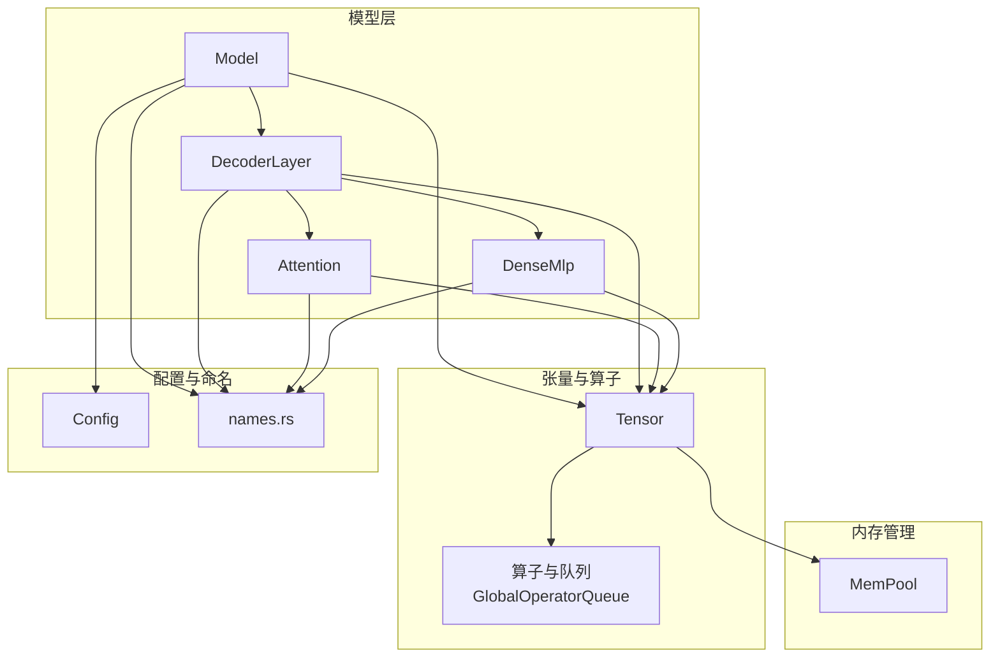
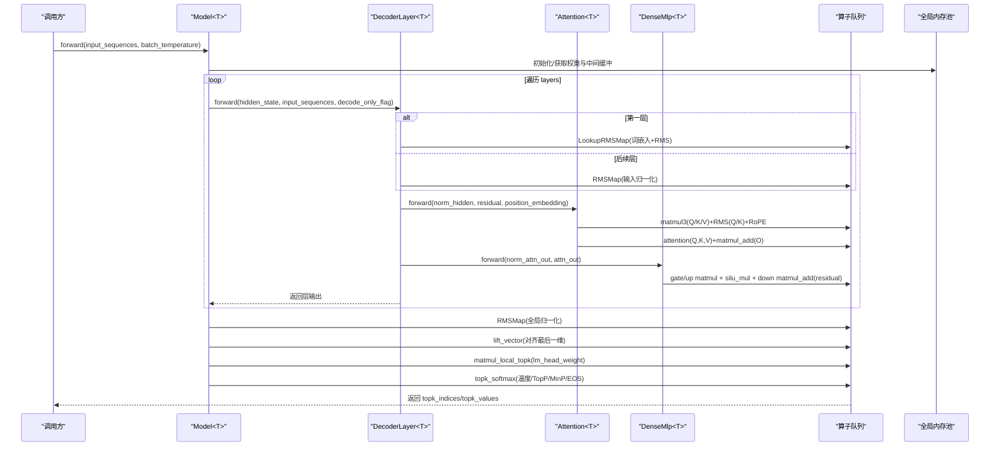
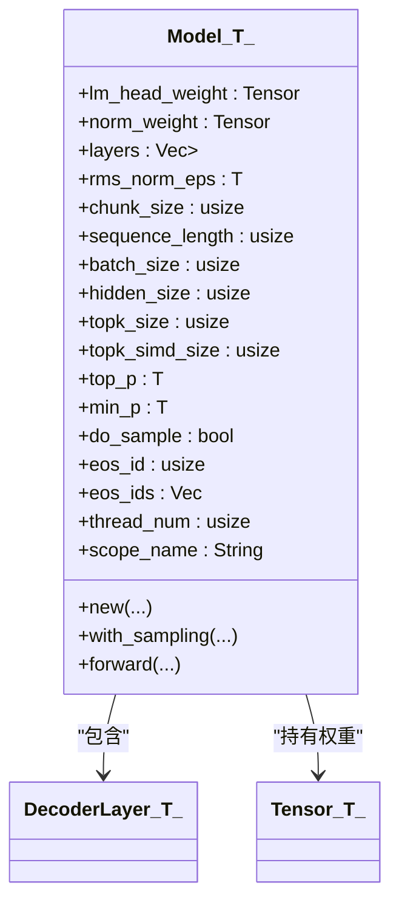
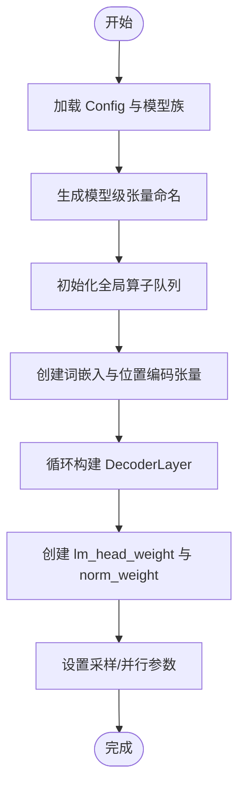
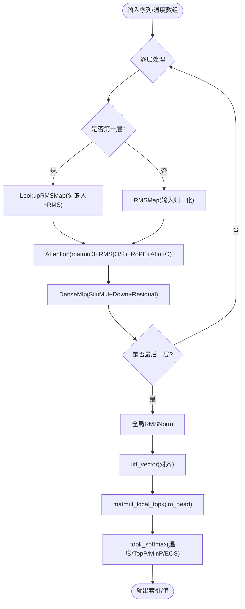
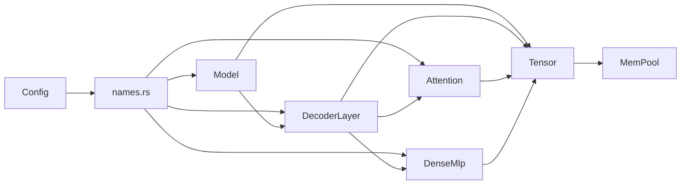

# 模型架构设计

<cite>
**本文引用的文件**   
- [src/transformer/model.rs](file://src/transformer/model.rs)
- [src/transformer/config/config.rs](file://src/transformer/config/config.rs)
- [src/transformer/decoder_layer.rs](file://src/transformer/decoder_layer.rs)
- [src/transformer/attention.rs](file://src/transformer/attention.rs)
- [src/transformer/dense_mlp.rs](file://src/transformer/dense_mlp.rs)
- [src/transformer/names.rs](file://src/transformer/names.rs)
- [src/tensor/storage.rs](file://src/tensor/storage.rs)
- [src/tensor/ops.rs](file://src/tensor/ops.rs)
- [src/mem_mgr/mem_pool.rs](file://src/mem_mgr/mem_pool.rs)
- [src/lib.rs](file://src/lib.rs)
</cite>

## 目录
1. [简介](#简介)
2. [项目结构](#项目结构)
3. [核心组件](#核心组件)
4. [架构总览](#架构总览)
5. [详细组件分析](#详细组件分析)
6. [依赖关系分析](#依赖关系分析)
7. [性能与数值类型](#性能与数值类型)
8. [故障排查指南](#故障排查指南)
9. [结论](#结论)
10. [附录：配置参数说明与调优建议](#附录：配置参数说明与调优建议)

## 简介
本技术文档围绕 Transformer 模型的核心实现，重点解析 Model<T> 的结构体设计与内存布局、初始化流程、前向传播的数据流与算子编排、支持的数值类型（f32/f16）与多线程机制，以及模型生命周期管理与资源清理策略。文档同时提供面向不同读者的分层说明与可视化图示，帮助快速理解并高效使用该系统。

## 项目结构
该仓库采用模块化组织方式，核心模型位于 transformer 模块，张量与算子队列在 tensor 模块，内存池在 mem_mgr 模块，配置在 config 与 transformer/config 下。Model<T> 作为顶层容器，组合多层 DecoderLayer，每层包含注意力与 FFN（密集或稀疏 MoE），并通过 Tensor 抽象进行零拷贝视图与算子入队，最终由全局内存池分配权重与中间缓冲。

图表来源
- [src/transformer/model.rs:28-168](file://src/transformer/model.rs#L28-L168)
- [src/transformer/decoder_layer.rs:33-150](file://src/transformer/decoder_layer.rs#L33-L150)
- [src/transformer/attention.rs:13-90](file://src/transformer/attention.rs#L13-L90)
- [src/transformer/dense_mlp.rs:12-44](file://src/transformer/dense_mlp.rs#L12-L44)
- [src/tensor/storage.rs:12-20](file://src/tensor/storage.rs#L12-L20)
- [src/mem_mgr/mem_pool.rs:88-128](file://src/mem_mgr/mem_pool.rs#L88-L128)
- [src/transformer/names.rs:56-80](file://src/transformer/names.rs#L56-L80)
- [src/transformer/config/config.rs:14-37](file://src/transformer/config/config.rs#L14-L37)

章节来源
- [src/lib.rs:1-16](file://src/lib.rs#L1-L16)
- [src/transformer/mod.rs:1-9](file://src/transformer/mod.rs#L1-L9)

## 核心组件
- Model<T>：顶层模型容器，持有词表头权重、归一化权重、层列表及采样/并行等推理参数；负责构建位置向量、词嵌入、各层模块，并执行前向传播。
- DecoderLayer<T>：解码器层，封装输入/输出 RMSNorm、注意力块与 FFN 块（密集或稀疏 MoE），支持滑动窗口注意力。
- Attention<T>：多头注意力实现，支持 Q/K/V 投影、可选 QK 归一化、RoPE 位置编码融合、KV 缓存与多核并行。
- DenseMlp<T>：门控双线性 FFN（Gate/Up 经 SiLU 融合后与 Down 相加残差）。
- Tensor<T>：带形状/步幅的张量视图，基于全局内存池分配数据，通过算子队列延迟执行。
- MemPool<T>：按名称模式匹配复用内存块，支持严格/非严格权重加载与专家权重拼接。

章节来源
- [src/transformer/model.rs:28-168](file://src/transformer/model.rs#L28-L168)
- [src/transformer/decoder_layer.rs:33-150](file://src/transformer/decoder_layer.rs#L33-L150)
- [src/transformer/attention.rs:13-90](file://src/transformer/attention.rs#L13-L90)
- [src/transformer/dense_mlp.rs:12-44](file://src/transformer/dense_mlp.rs#L12-L44)
- [src/tensor/storage.rs:12-20](file://src/tensor/storage.rs#L12-L20)
- [src/mem_mgr/mem_pool.rs:88-128](file://src/mem_mgr/mem_pool.rs#L88-L128)

## 架构总览
下图展示了从输入序列到输出的整体前向流程，包括逐层处理、RMSNorm、注意力、FFN、最后的全局 RMSNorm、TopK 与 Softmax 采样。

图表来源
- [src/transformer/model.rs:174-251](file://src/transformer/model.rs#L174-L251)
- [src/transformer/decoder_layer.rs:152-230](file://src/transformer/decoder_layer.rs#L152-L230)
- [src/transformer/attention.rs:92-209](file://src/transformer/attention.rs#L92-L209)
- [src/transformer/dense_mlp.rs:46-101](file://src/transformer/dense_mlp.rs#L46-L101)
- [src/tensor/ops.rs:105-165](file://src/tensor/ops.rs#L105-L165)

## 详细组件分析

### Model<T> 结构与内存布局
- 核心字段
  - lm_head_weight：词表头权重矩阵，形状为 [vocab_size, hidden_size]，用于将隐藏表示映射到词表空间。
  - norm_weight：全局 RMSNorm 权重，形状为 [hidden_size]，对最后一层隐藏状态做归一化。
  - layers：DecoderLayer<T> 的有序集合，顺序对应模型深度。
  - rms_norm_eps：RMSNorm 的 epsilon，避免除零。
  - chunk_size/sequence_length/batch_size：控制批大小、序列长度与分块大小，影响内存占用与并行粒度。
  - topk_size/topk_simd_size：TopK 候选数量与 SIMD 优化相关维度。
  - top_p/min_p/do_sample/eos_id/eos_ids：采样与终止条件参数。
  - thread_num：线程数，用于算子并行。
  - scope_name：张量命名作用域，便于内存池按模式复用。
- 内存布局要点
  - 所有权重与中间张量均通过 Tensor::zeros/from_vec 创建，底层由 MemPool 按名称模式分配或复用连续内存块。
  - 首层特殊处理：词嵌入查找与 RMS 归一化合并为 LookupRMSMap 算子，减少一次显式拷贝。
  - 末层 decode_only_flag=true 时，会执行 lift_vector 以对齐单 token 行，便于 TopK 与 softmax 计算。

图表来源
- [src/transformer/model.rs:28-168](file://src/transformer/model.rs#L28-L168)
- [src/tensor/storage.rs:12-20](file://src/tensor/storage.rs#L12-L20)

章节来源
- [src/transformer/model.rs:28-168](file://src/transformer/model.rs#L28-L168)

### 初始化流程
- 步骤概览
  1) 根据 Config 生成模型级张量命名（词嵌入、位置编码、lm_head、norm_weight）。
  2) 初始化全局算子队列（T::init_operator_queue）。
  3) 创建词嵌入与位置编码张量（Rc 共享引用，避免重复拷贝）。
  4) 循环构建各层 DecoderLayer，传入共享的词嵌入与位置编码。
  5) 初始化 lm_head_weight 与 norm_weight 占位张量（实际权重由 MemPool 按名称注入）。
  6) 设置采样与并行参数（top_p/min_p/do_sample/eos_ids/thread_num）。
- 关键细节
  - 位置编码向量由外部生成（如 RoPE），并按 [max_position_embeddings, 1, 1, head_dim] 形状构造。
  - thread_num 默认取系统可用并行度，可通过 set_thread_num 调整。
  - 若启用严格模式，缺失权重将触发断言失败；非严格模式下未命中权重的 .weight 会分配零填充缓冲。

图表来源
- [src/transformer/model.rs:96-168](file://src/transformer/model.rs#L96-L168)
- [src/transformer/names.rs:56-80](file://src/transformer/names.rs#L56-L80)
- [src/mem_mgr/mem_pool.rs:370-427](file://src/mem_mgr/mem_pool.rs#L370-L427)

章节来源
- [src/transformer/model.rs:96-168](file://src/transformer/model.rs#L96-L168)
- [src/transformer/names.rs:56-80](file://src/transformer/names.rs#L56-L80)
- [src/mem_mgr/mem_pool.rs:370-427](file://src/mem_mgr/mem_pool.rs#L370-L427)

### 前向传播与数据处理管道
- 总体流程
  - 逐层调用 DecoderLayer.forward，首层走 LookupRMSMap（查词嵌入并 RMS），其余层先 RMS 再进入注意力。
  - 注意力内部：matmul3 合并 Q/K/V 投影与可选 QK RMS，随后 reshape/permute 得到 Q/K/V 视图，执行 attention 并与残差相加。
  - FFN：密集路径为 Gate/Up 两路 matmul，SiLU 融合后再与 Down 相加残差。
  - 末层结束后，执行全局 RMSNorm，lift_vector 对齐单 token，再进行 lm_head 的局部 TopK 与 softmax 采样。
- 关键优化
  - 算子延迟执行：所有变换仅入队，统一调度执行，减少中间拷贝。
  - 批量与分块：chunk_size/sequence_length/batch_size 共同决定内存与并行效率。
  - 解码阶段优化：decode_only_flag=true 时，部分路径走 lift_vector 与更小的矩阵乘。

图表来源
- [src/transformer/model.rs:174-251](file://src/transformer/model.rs#L174-L251)
- [src/transformer/decoder_layer.rs:152-230](file://src/transformer/decoder_layer.rs#L152-L230)
- [src/transformer/attention.rs:92-209](file://src/transformer/attention.rs#L92-L209)
- [src/transformer/dense_mlp.rs:46-101](file://src/transformer/dense_mlp.rs#L46-L101)
- [src/tensor/ops.rs:105-165](file://src/tensor/ops.rs#L105-L165)

章节来源
- [src/transformer/model.rs:174-251](file://src/transformer/model.rs#L174-L251)
- [src/transformer/decoder_layer.rs:152-230](file://src/transformer/decoder_layer.rs#L152-L230)
- [src/transformer/attention.rs:92-209](file://src/transformer/attention.rs#L92-L209)
- [src/transformer/dense_mlp.rs:46-101](file://src/transformer/dense_mlp.rs#L46-L101)
- [src/tensor/ops.rs:105-165](file://src/tensor/ops.rs#L105-L165)

### 数值类型与多线程机制
- 数值类型
  - 支持 f32 与 f16，通过泛型 T 约束并提供 Exp/Sigmoid/Sqrt/NegInfinity/FromNumber 等运算 trait。
  - f16 需要硬件特性（如 AVX512-FP16），测试中会检测并跳过不支持的环境。
- 多线程
  - 每个数值类型维护独立的算子队列，通过 with_operator_queue 遍历执行。
  - 线程数可自动探测或手动设置，算子在 run 接口中以 thread_id 划分工作。
  - Attention 内部也使用 num_cpus 获取线程数，用于注意力计算的并行。

章节来源
- [src/transformer/model.rs:170-172](file://src/transformer/model.rs#L170-L172)
- [src/transformer/attention.rs:159-171](file://src/transformer/attention.rs#L159-L171)
- [src/lib.rs:1-5](file://src/lib.rs#L1-L5)

### 模型配置参数
- 主要字段（来自 Config）
  - family/vocab_size/hidden_size/num_hidden_layers/num_attention_heads/num_key_value_heads/head_dim/max_position_embeddings/rms_norm_eps/rope_theta/rotary_dim/tie_word_embeddings/layers/qkv_bias/use_qk_norm/rope_scaling/eos_token_id/eos_token_ids/max_window_layers/use_sliding_window/sliding_window/intermediate_size
- 用途概述
  - 决定网络拓扑（层数、头数、维度）、归一化与 RoPE 行为、滑动窗口与最大窗口层、FFN 中间维度与 MoE 路由策略等。
  - tie_word_embeddings 控制是否共享词嵌入与 lm_head 权重。
  - use_qk_norm 控制注意力中是否对 Q/K 做归一化。

章节来源
- [src/transformer/config/config.rs:14-37](file://src/transformer/config/config.rs#L14-L37)
- [src/transformer/config/config.rs:39-116](file://src/transformer/config/config.rs#L39-L116)

## 依赖关系分析
- 组件耦合
  - Model<T> 强依赖 Config 与 names.rs 提供的张量命名规则；弱依赖 DecoderLayer<T> 与 Tensor<T>。
  - DecoderLayer<T> 依赖 Attention<T> 与 DenseMlp<T>/SparseMoe<T>，并通过 names.rs 解析权重名。
  - Tensor<T> 依赖 MemPool<T> 与算子队列，解耦了具体算子实现。
- 外部依赖
  - 内存池通过正则表达式匹配张量名，实现跨层共享与专家权重拼接。
  - 算子库提供 matmul/softmax/silu/sigmoid/rms 等高性能内核。

图表来源
- [src/transformer/names.rs:56-134](file://src/transformer/names.rs#L56-L134)
- [src/transformer/model.rs:28-168](file://src/transformer/model.rs#L28-L168)
- [src/transformer/decoder_layer.rs:33-150](file://src/transformer/decoder_layer.rs#L33-L150)
- [src/transformer/attention.rs:13-90](file://src/transformer/attention.rs#L13-L90)
- [src/transformer/dense_mlp.rs:12-44](file://src/transformer/dense_mlp.rs#L12-L44)
- [src/tensor/storage.rs:12-20](file://src/tensor/storage.rs#L12-L20)
- [src/mem_mgr/mem_pool.rs:88-128](file://src/mem_mgr/mem_pool.rs#L88-L128)

章节来源
- [src/transformer/names.rs:56-134](file://src/transformer/names.rs#L56-L134)
- [src/mem_mgr/mem_pool.rs:88-128](file://src/mem_mgr/mem_pool.rs#L88-L128)

## 性能与数值类型
- 数值精度
  - f32：通用兼容，适合调试与基准验证。
  - f16：显著降低内存带宽压力，需具备相应 CPU 特性（如 AVX512-FP16），在支持环境下可获得更高吞吐。
- 并行与内存
  - 算子队列驱动的多线程执行，结合 MemPool 的块复用与专家权重拼接，减少分配开销与碎片。
  - 注意力与 FFN 中的 matmul 宏/微块参数可调，以适配不同硬件的缓存与 SIMD 宽度。
- 调优建议
  - 合理设置 chunk_size/sequence_length/batch_size，平衡吞吐与峰值内存。
  - 针对大模型开启 f16，并确保硬件特性可用。
  - 根据设备核数调整 thread_num，避免过度并行导致上下文切换开销。

[本节为通用指导，不直接分析具体文件]

## 故障排查指南
- 常见错误定位
  - 严格模式下缺失权重：当 MemPool 在 strict 模式下找不到匹配的 .weight 且形状不一致时会 panic。检查配置文件与权重文件名是否一致。
  - 形状不匹配：from_vec 与 view 等方法会对元素总数进行断言，确保 shape 与数据长度一致。
  - 硬件特性缺失：f16 测试会在不支持 AVX512-FP16 的环境下跳过，确认 CPU 指令集支持。
- 调试技巧
  - 使用 ELLM_ALIGN_TRACE 环境变量打印层构建过程，辅助定位算子构建问题。
  - 通过 with_operator_queue 遍历并执行算子，观察中间结果与耗时。

章节来源
- [src/mem_mgr/mem_pool.rs:370-427](file://src/mem_mgr/mem_pool.rs#L370-L427)
- [src/tensor/storage.rs:85-98](file://src/tensor/storage.rs#L85-L98)
- [src/transformer/model.rs:187-206](file://src/transformer/model.rs#L187-L206)

## 结论
Model<T> 以泛型与算子队列为核心，实现了高内聚、低耦合的 Transformer 推理管线。借助 MemPool 的内存复用与名字模式匹配，系统在保持灵活性的同时获得良好的性能表现。配合 f32/f16 双精度支持与多线程执行，可在多种硬件平台上取得稳定高效的推理能力。

[本节为总结性内容，不直接分析具体文件]

## 附录：配置参数说明与调优建议
- 关键参数
  - vocab_size：词表大小，影响词嵌入与 lm_head 权重尺寸。
  - hidden_size：隐藏维度，决定模型容量与计算量。
  - num_hidden_layers：层数，直接影响前向计算次数。
  - num_attention_heads/num_key_value_heads/head_dim：注意力头数与维度，决定 Q/K/V 的形状与缩放因子。
  - max_position_embeddings：最大位置编码长度，影响位置向量与 KV 缓存规模。
  - rms_norm_eps：RMSNorm 的 epsilon，防止除零。
  - rope_theta/rotary_dim/rope_scaling：RoPE 旋转角度与扩展策略。
  - tie_word_embeddings：是否共享词嵌入与 lm_head。
  - use_qk_norm：是否在注意力中对 Q/K 做归一化。
  - sliding_window/max_window_layers/use_sliding_window：滑动窗口注意力开关与范围。
  - intermediate_size：FFN 中间维度（含 MoE 场景）。
- 调优建议
  - 增大 batch_size 与 sequence_length 可提高吞吐，但需关注内存峰值。
  - 在支持 f16 的硬件上优先使用 f16，并结合更大的 topk_simd_size 提升并行效率。
  - 对于长文本，适当开启滑动窗口以降低 KV 缓存增长。

章节来源
- [src/transformer/config/config.rs:14-37](file://src/transformer/config/config.rs#L14-L37)
- [src/transformer/config/config.rs:39-116](file://src/transformer/config/config.rs#L39-L116)