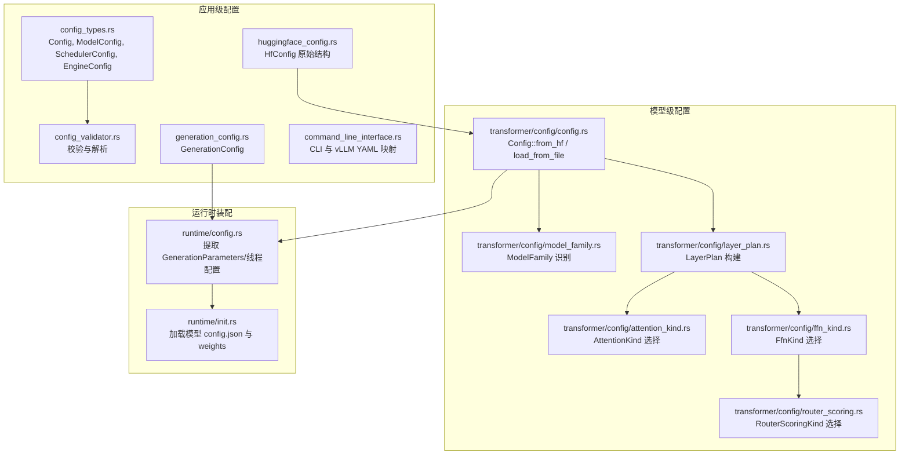
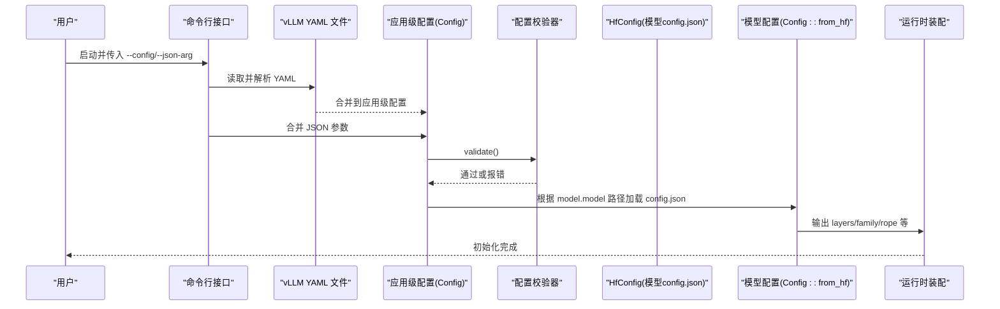
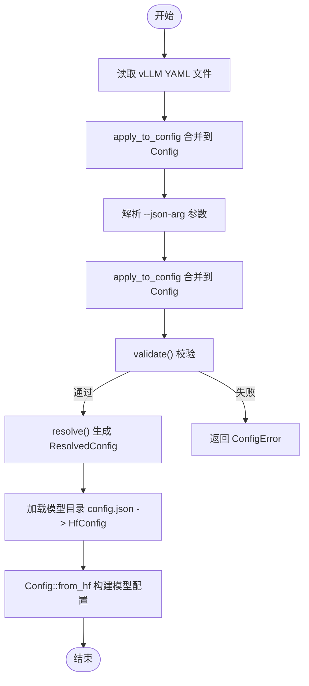
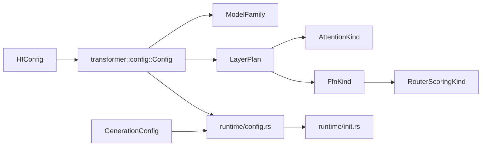

# 模型配置系统

<cite>
**本文引用的文件**   
- [src/config/mod.rs](file://src/config/mod.rs)
- [src/config/config_types.rs](file://src/config/config_types.rs)
- [src/config/config_validator.rs](file://src/config/config_validator.rs)
- [src/config/huggingface_config.rs](file://src/config/huggingface_config.rs)
- [src/config/generation_config.rs](file://src/config/generation_config.rs)
- [src/transformer/config/mod.rs](file://src/transformer/config/mod.rs)
- [src/transformer/config/config.rs](file://src/transformer/config/config.rs)
- [src/transformer/config/layer_plan.rs](file://src/transformer/config/layer_plan.rs)
- [src/transformer/config/model_family.rs](file://src/transformer/config/model_family.rs)
- [src/transformer/config/attention_kind.rs](file://src/transformer/config/attention_kind.rs)
- [src/transformer/config/ffn_kind.rs](file://src/transformer/config/ffn_kind.rs)
- [src/transformer/config/router_scoring.rs](file://src/transformer/config/router_scoring.rs)
- [src/runtime/config.rs](file://src/runtime/config.rs)
- [src/runtime/init.rs](file://src/runtime/init.rs)
</cite>

## 目录
1. [简介](#简介)
2. [项目结构](#项目结构)
3. [核心组件](#核心组件)
4. [架构总览](#架构总览)
5. [详细组件分析](#详细组件分析)
6. [依赖关系分析](#依赖关系分析)
7. [性能考虑](#性能考虑)
8. [故障排查指南](#故障排查指南)
9. [结论](#结论)
10. [附录：新模型配置添加指南与最佳实践](#附录新模型配置添加指南与最佳实践)

## 简介
本技术文档围绕“模型配置系统”展开，聚焦以下目标：
- 说明 Config 结构体的字段定义与数据类型（运行时配置与模型配置）
- 解释模型家族识别与特定模型的配置适配
- 阐述层计划（LayerPlan）的生成逻辑与执行策略
- 说明配置参数的验证机制与默认值处理
- 提供配置文件格式与加载流程的详细说明
- 动态配置更新与热重载支持现状与建议
- 配置优先级与覆盖规则
- 新模型配置的添加指南与最佳实践

## 项目结构
配置系统横跨两个层次：
- 应用级配置（服务、调度、引擎、CLI 等）：位于 src/config
- 模型级配置（Transformer 内部结构、层计划、注意力/FFN 类型等）：位于 src/transformer/config



图示来源
- [src/config/config_types.rs:188-205](file://src/config/config_types.rs#L188-L205)
- [src/config/config_validator.rs:192-220](file://src/config/config_validator.rs#L192-L220)
- [src/config/huggingface_config.rs:12-76](file://src/config/huggingface_config.rs#L12-L76)
- [src/config/generation_config.rs:6-79](file://src/config/generation_config.rs#L6-L79)
- [src/transformer/config/config.rs:14-37](file://src/transformer/config/config.rs#L14-L37)
- [src/transformer/config/model_family.rs:4-11](file://src/transformer/config/model_family.rs#L4-L11)
- [src/transformer/config/layer_plan.rs:8-35](file://src/transformer/config/layer_plan.rs#L8-L35)
- [src/transformer/config/attention_kind.rs:4-8](file://src/transformer/config/attention_kind.rs#L4-L8)
- [src/transformer/config/ffn_kind.rs:6-18](file://src/transformer/config/ffn_kind.rs#L6-L18)
- [src/transformer/config/router_scoring.rs:6-9](file://src/transformer/config/router_scoring.rs#L6-L9)
- [src/runtime/config.rs:5-12](file://src/runtime/config.rs#L5-L12)
- [src/runtime/init.rs:46-50](file://src/runtime/init.rs#L46-L50)

章节来源
- [src/config/mod.rs:1-15](file://src/config/mod.rs#L1-L15)
- [src/transformer/config/mod.rs:1-15](file://src/transformer/config/mod.rs#L1-L15)

## 核心组件
本节概述关键结构体及其职责。

- 应用级配置
  - Config：顶层配置，包含 command、model、scheduler、engine、serve、chat
  - ModelConfig：模型相关参数（路径、分词器、精度、长度、量化、KV cache dtype、seed、媒体白名单、logprobs、滑动窗口/级联注意力开关、min_p 等）
  - SchedulerConfig：调度参数（最大序列数、批 token 上限、连续批、调度策略、超时、对话缓存）
  - EngineConfig：引擎参数（runner、convert、eager、专家路由返回、Gumbel 精度）
  - ServeConfig/ChatConfig：服务与聊天模式配置
  - ResolvedConfig/ResolvedModelConfig：解析后的运行期配置（推导 served_model_name、effective_tokenizer）

- 模型级配置
  - transformer::config::Config：从 HfConfig 派生，包含 family、维度、层数、注意力头、RoPE/RMSNorm 参数、layers 列表等
  - LayerPlan：每层的注意力与 FFN 类型组合
  - AttentionKind/FfnKind/RouterScoringKind：层内算子族枚举
  - ModelFamily：模型家族识别（Qwen/Llama/Mixtral/MiniMax/MiniMaxM2/Unknown）

- 生成配置
  - GenerationConfig：采样与并行等生成参数（top_k/top_p/min_p/do_sample/eos/bos/pad/thread_num 等）

章节来源
- [src/config/config_types.rs:188-222](file://src/config/config_types.rs#L188-L222)
- [src/config/config_types.rs:58-137](file://src/config/config_types.rs#L58-L137)
- [src/config/config_types.rs:140-185](file://src/config/config_types.rs#L140-L185)
- [src/config/config_types.rs:224-334](file://src/config/config_types.rs#L224-L334)
- [src/config/config_types.rs:207-222](file://src/config/config_types.rs#L207-L222)
- [src/transformer/config/config.rs:14-37](file://src/transformer/config/config.rs#L14-L37)
- [src/transformer/config/layer_plan.rs:8-11](file://src/transformer/config/layer_plan.rs#L8-L11)
- [src/transformer/config/attention_kind.rs:4-8](file://src/transformer/config/attention_kind.rs#L4-L8)
- [src/transformer/config/ffn_kind.rs:6-18](file://src/transformer/config/ffn_kind.rs#L6-L18)
- [src/transformer/config/router_scoring.rs:6-9](file://src/transformer/config/router_scoring.rs#L6-L9)
- [src/transformer/config/model_family.rs:4-11](file://src/transformer/config/model_family.rs#L4-L11)
- [src/config/generation_config.rs:6-79](file://src/config/generation_config.rs#L6-L79)

## 架构总览
下图展示了从 CLI/YAML/JSON 到最终模型配置与运行时参数的装配流程。



图示来源
- [src/config/command_line_interface.rs:368-390](file://src/config/command_line_interface.rs#L368-L390)
- [src/config/command_line_interface.rs:571-723](file://src/config/command_line_interface.rs#L571-L723)
- [src/config/config_validator.rs:192-220](file://src/config/config_validator.rs#L192-L220)
- [src/transformer/config/config.rs:113-116](file://src/transformer/config/config.rs#L113-L116)
- [src/runtime/init.rs:46-50](file://src/runtime/init.rs#L46-L50)

## 详细组件分析

### 应用级配置结构体与默认值
- Config 由多个子配置组成，所有子配置均提供 Default 实现与 serde 默认值函数，确保缺失字段可安全回退。
- 关键字段与默认值要点：
  - Command 默认 Serve；TokenizerMode/RunnerType/ConvertType 默认 Auto；dtype 默认 Auto
  - Scheduler 默认 max_num_seqs=256、max_num_batched_tokens=8192、continuous batching 开启、Fair 策略
  - Serve 默认 host=127.0.0.1、port=8000、api_server_count=2、允许源/方法/头为 "*"
  - Model 默认 seed=0、max_logprobs=20、disable_cascade_attn=true、min_p=0.0
- 解析后配置 ResolvedConfig 会推导 served_model_name（从 model 路径末尾推断）与 effective_tokenizer（优先 tokenizer，否则回退 model）。

章节来源
- [src/config/config_types.rs:188-205](file://src/config/config_types.rs#L188-L205)
- [src/config/config_types.rs:336-387](file://src/config/config_types.rs#L336-L387)
- [src/config/config_types.rs:389-479](file://src/config/config_types.rs#L389-L479)
- [src/config/config_types.rs:481-489](file://src/config/config_types.rs#L481-L489)
- [src/config/config_validator.rs:200-220](file://src/config/config_validator.rs#L200-L220)

### 配置校验与错误类型
- 校验范围：
  - 模型：model 非空、max_model_len>0、served_model_name 非空、revision/code_revision/tokenizer_revision 非空、download_dir/hf_config_path 非空、max_logprobs<=100
  - 调度：max_num_seqs>0、max_num_batched_tokens>0、且不小于 max_num_seqs
  - 命令区：Serve 需要 serve 配置且 host/port/allowed_* 合法；Chat 需要 chat 配置
- 错误类型集中定义于 ConfigError，便于上层统一处理。

章节来源
- [src/config/config_validator.rs:8-60](file://src/config/config_validator.rs#L8-L60)
- [src/config/config_validator.rs:74-190](file://src/config/config_validator.rs#L74-L190)

### 配置文件格式与加载流程
- 应用级配置
  - 支持 YAML 格式的 vLLM 兼容配置（VllmConfigFile），按 model/scheduler/engine/server 四个块映射到 Config
  - 支持 --json-arg 键值对或 JSON 对象，按前缀 model./scheduler./engine./serve./chat. 分发到对应区域
  - 加载入口：load_from_file -> 反序列化 -> validate -> resolve
- 模型级配置
  - 从模型目录下的 config.json 加载 HfConfig，再转换为 transformer::config::Config
  - 同时可选加载 generation_config.json 用于生成参数



图示来源
- [src/config/command_line_interface.rs:368-390](file://src/config/command_line_interface.rs#L368-L390)
- [src/config/command_line_interface.rs:571-723](file://src/config/command_line_interface.rs#L571-L723)
- [src/config/config_validator.rs:192-220](file://src/config/config_validator.rs#L192-L220)
- [src/config/huggingface_config.rs:82-91](file://src/config/huggingface_config.rs#L82-L91)
- [src/transformer/config/config.rs:113-116](file://src/transformer/config/config.rs#L113-L116)

章节来源
- [src/config/config_validator.rs:192-220](file://src/config/config_validator.rs#L192-L220)
- [src/config/huggingface_config.rs:12-76](file://src/config/huggingface_config.rs#L12-L76)
- [src/config/generation_config.rs:143-149](file://src/config/generation_config.rs#L143-L149)

### 模型家族识别与特定模型适配
- ModelFamily::parse 将 model_type 归一化为小写并匹配已知家族：qwen2/qwen2_moe/qwen3/qwen3_moe -> Qwen；llama -> Llama；mixtral -> Mixtral；minimax/minimax_m2/minimax-m2/minimax_m2.5/minimax-m2.5 -> MiniMaxM2；其余 Unknown
- 在 transformer::config::Config::from_hf 中基于 family 做差异化适配：
  - router_scoring 默认 Softmax，MiniMaxM2 使用 Sigmoid
  - use_routing_bias 默认 false，MiniMaxM2 默认 true
  - use_qk_norm 对 qwen3/qwen3_moe 强制启用
  - num_key_value_heads/head_dim/intermediate_size 存在缺失时采用合理推导

章节来源
- [src/transformer/config/model_family.rs:14-25](file://src/transformer/config/model_family.rs#L14-L25)
- [src/transformer/config/config.rs:40-111](file://src/transformer/config/config.rs#L40-L111)
- [src/transformer/config/router_scoring.rs:12-22](file://src/transformer/config/router_scoring.rs#L12-L22)

### 层计划（LayerPlan）生成逻辑与执行策略
- LayerPlan::build_stack 遍历每一层，分别决定 attention 与 ffn 类型：
  - AttentionKind::for_layer
    - 若 layer_types 显式指定，按字符串关键词匹配 linear/sliding/window
    - 否则若 use_sliding_window 且层索引 < max_window_layers，则 SlidingWindow，否则 Full
  - FfnKind::for_layer
    - 若层索引在 mlp_only_layers 或 num_experts==0，则为 Dense
    - 否则若 (layer_idx+1) % decoder_sparse_step == 0，则为 SparseMoe（携带 expert 数量、per-token 选择数、norm_topk_prob、router_scoring、use_routing_bias）
    - 其他情况为 Dense
- 执行策略：
  - 全注意力层：Full 注意力 + Dense FFN
  - 滑动窗口层：SlidingWindow 注意力 + 可能为 Dense 或 SparseMoe（取决于稀疏步长与专家配置）
  - MoE 层：Dense 前置/后置 MLP 与稀疏专家混合，路由评分函数由 RouterScoringKind 决定

```mermaid
classDiagram
class LayerPlan {
+attention : AttentionKind
+ffn : FfnKind
+build_stack(...)
}
class AttentionKind {
<<enum>>
+Full
+SlidingWindow
+Linear
+for_layer(...)
}
class FfnKind {
<<enum>>
+Dense{intermediate_size}
+SparseMoe{intermediate_size,num_experts,num_experts_per_tok,norm_topk_prob,router_scoring,use_routing_bias}
+for_layer(...)
}
class RouterScoringKind {
<<enum>>
+Softmax
+Sigmoid
}
LayerPlan --> AttentionKind : "包含"
LayerPlan --> FfnKind : "包含"
FfnKind --> RouterScoringKind : "使用"
```

图示来源
- [src/transformer/config/layer_plan.rs:8-35](file://src/transformer/config/layer_plan.rs#L8-L35)
- [src/transformer/config/attention_kind.rs:4-35](file://src/transformer/config/attention_kind.rs#L4-L35)
- [src/transformer/config/ffn_kind.rs:6-58](file://src/transformer/config/ffn_kind.rs#L6-L58)
- [src/transformer/config/router_scoring.rs:6-22](file://src/transformer/config/router_scoring.rs#L6-L22)

章节来源
- [src/transformer/config/layer_plan.rs:14-34](file://src/transformer/config/layer_plan.rs#L14-L34)
- [src/transformer/config/attention_kind.rs:11-34](file://src/transformer/config/attention_kind.rs#L11-L34)
- [src/transformer/config/ffn_kind.rs:31-57](file://src/transformer/config/ffn_kind.rs#L31-L57)

### 生成参数与线程配置
- GenerationConfig 提供 top_k/top_p/min_p/do_sample/eos_token_id_list/thread_num 等
- runtime/config.rs 将其转换为 GenerationParameters，并对 top_k 进行 SIMD 对齐（avx512 宽度感知）
- 线程分配：根据可用物理核数与 api_server_count 计算 total/api/blocking 线程数

章节来源
- [src/config/generation_config.rs:6-79](file://src/config/generation_config.rs#L6-L79)
- [src/config/generation_config.rs:82-121](file://src/config/generation_config.rs#L82-L121)
- [src/runtime/config.rs:21-60](file://src/runtime/config.rs#L21-L60)
- [src/runtime/config.rs:62-104](file://src/runtime/config.rs#L62-L104)

### 配置优先级与覆盖规则
- 优先级从高到低：
  1) CLI 参数（--json-arg 与 clap 字段）
  2) vLLM YAML 文件（--config）
  3) 默认值（各结构的 Default 与 serde default）
- 覆盖方式：
  - YAML 通过 apply_to_config 逐项覆盖 Config 字段
  - JSON 参数通过 set_nested_key 按前缀分发到 model/scheduler/engine/serve/chat 子图，再 apply_to_config 覆盖
  - 注意：部分字段在 CLI 与 YAML 中存在别名映射（如 snake_case 与 kebab-case），解析时会统一

章节来源
- [src/config/command_line_interface.rs:368-390](file://src/config/command_line_interface.rs#L368-L390)
- [src/config/command_line_interface.rs:571-723](file://src/config/command_line_interface.rs#L571-L723)
- [src/config/config_types.rs:58-137](file://src/config/config_types.rs#L58-L137)

### 动态配置更新与热重载支持
- 当前代码未提供运行时热重载能力。配置在进程启动阶段一次性加载与校验，随后进入初始化与权重加载流程。
- 建议方案（概念性）：
  - 引入配置监听器（文件系统事件或 gRPC/HTTP 接口）
  - 增量合并新配置并重新 validate/resolve
  - 对无状态参数（如调度策略、采样参数）可在线切换；对需重建的状态（如层计划、线程池）需优雅重启或隔离上下文

[本节为概念性内容，不直接分析具体文件]

## 依赖关系分析
- 模块耦合
  - transformer::config::Config 依赖 HfConfig、ModelFamily、LayerPlan、RouterScoringKind
  - LayerPlan 依赖 AttentionKind、FfnKind；FfnKind 依赖 RouterScoringKind
  - runtime/config.rs 依赖 transformer::config::Config 与 generation_config.rs
  - runtime/init.rs 依赖 transformer::config::Config 与 safetensors 加载器（外部）



图示来源
- [src/transformer/config/config.rs:40-111](file://src/transformer/config/config.rs#L40-L111)
- [src/transformer/config/layer_plan.rs:14-34](file://src/transformer/config/layer_plan.rs#L14-L34)
- [src/transformer/config/attention_kind.rs:11-34](file://src/transformer/config/attention_kind.rs#L11-L34)
- [src/transformer/config/ffn_kind.rs:31-57](file://src/transformer/config/ffn_kind.rs#L31-L57)
- [src/transformer/config/router_scoring.rs:12-22](file://src/transformer/config/router_scoring.rs#L12-L22)
- [src/runtime/config.rs:21-60](file://src/runtime/config.rs#L21-L60)
- [src/runtime/init.rs:46-50](file://src/runtime/init.rs#L46-L50)

章节来源
- [src/transformer/config/mod.rs:1-15](file://src/transformer/config/mod.rs#L1-L15)
- [src/config/mod.rs:1-15](file://src/config/mod.rs#L1-L15)

## 性能考虑
- 生成参数中的 top_k 会根据 CPU SIMD 宽度自动对齐，减少分支与提升吞吐
- 线程分配依据物理核心数与 API 并发数进行划分，避免过度竞争
- 滑动窗口注意力可减少长上下文的 KV 计算开销，但需权衡精度与延迟
- MoE 仅在满足稀疏步长的层激活，降低计算量

[本节为通用指导，不直接分析具体文件]

## 故障排查指南
- 常见校验错误
  - model.model 为空、max_model_len<=0、served_model_name 为空
  - revision/code_revision/tokenizer_revision/download_dir/hf_config_path 为空
  - scheduler.max_num_seqs 或 max_num_batched_tokens 为 0，或不一致
  - serve.host 为空、port=0、allowed_* 为空
  - command 缺少对应 section（Serve 缺 serve、Chat 缺 chat）
- 定位步骤
  - 检查 YAML/JSON 字段名是否匹配（注意别名）
  - 确认模型目录下是否存在 config.json 与 generation_config.json
  - 查看 resolve 后的 served_model_name 与 effective_tokenizer 是否符合预期

章节来源
- [src/config/config_validator.rs:8-60](file://src/config/config_validator.rs#L8-L60)
- [src/config/config_validator.rs:74-190](file://src/config/config_validator.rs#L74-L190)
- [src/config/config_validator.rs:200-220](file://src/config/config_validator.rs#L200-L220)

## 结论
该配置系统以“应用级配置 + 模型级配置”的双层设计，结合严格的校验与丰富的默认值，提供了从 CLI/YAML/JSON 到模型层计划的完整装配链路。通过模型家族识别与差异化适配，以及层计划的可插拔选择，系统在保持灵活性的同时兼顾了可扩展性与可维护性。

[本节为总结性内容，不直接分析具体文件]

## 附录：新模型配置添加指南与最佳实践
- 新增模型家族
  - 在 ModelFamily::parse 中添加新的 model_type 映射
  - 如需特殊行为（如默认路由评分、bias、QK Norm），在 Config::from_hf 中补充条件分支
- 调整层计划
  - 若需自定义注意力/FFN 选择逻辑，扩展 AttentionKind/FfnKind 并在 for_layer 中增加判断
  - 通过 layer_types 显式控制每层类型，或通过 use_sliding_window/max_window_layers/decoder_sparse_step 等全局参数驱动
- 配置项扩展
  - 在 HfConfig 中新增字段并提供默认值
  - 在 transformer::config::Config::from_hf 中消费新字段
  - 若影响运行时行为，同步更新 runtime/config.rs 的参数提取逻辑
- 配置加载与校验
  - 如需新增应用级配置项，先在 config_types.rs 中定义，并在 validator 中补充校验规则
  - 在 CLI 与 YAML 映射中补齐别名与转换逻辑
- 最佳实践
  - 尽量使用默认值与推导，减少硬编码
  - 对易变参数（如调度策略、采样参数）保持可热更新潜力
  - 对不可热更新参数（如层计划、线程池）提供明确的重启策略与回滚机制

[本节为操作指南，不直接分析具体文件]