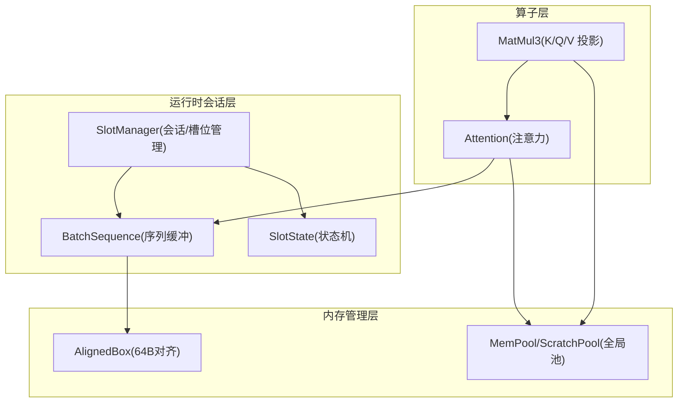
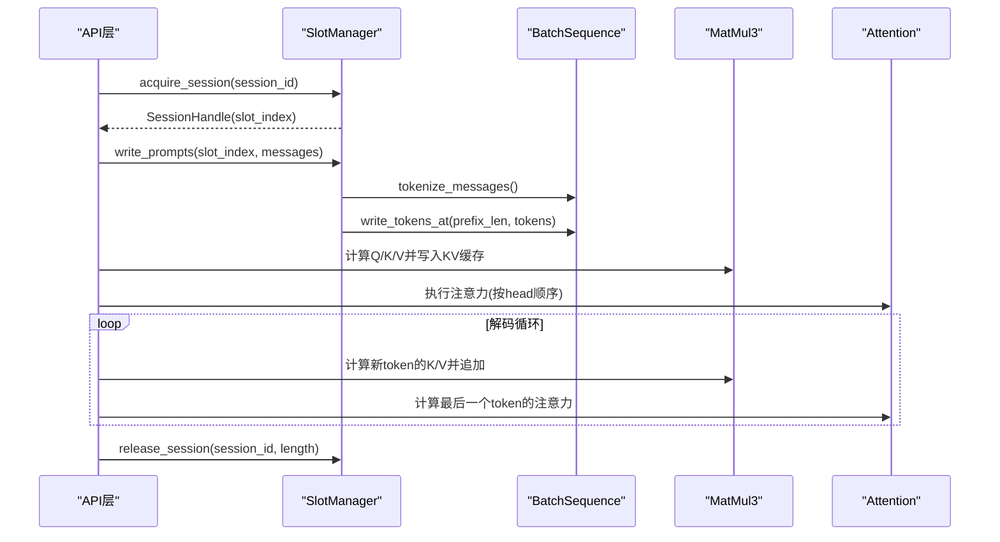
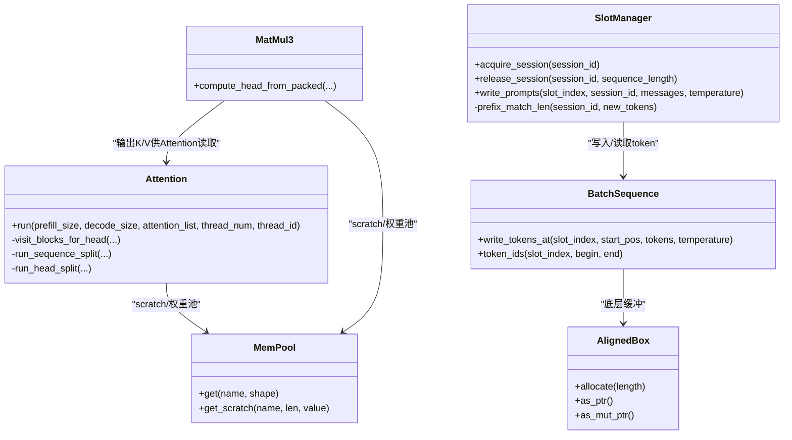
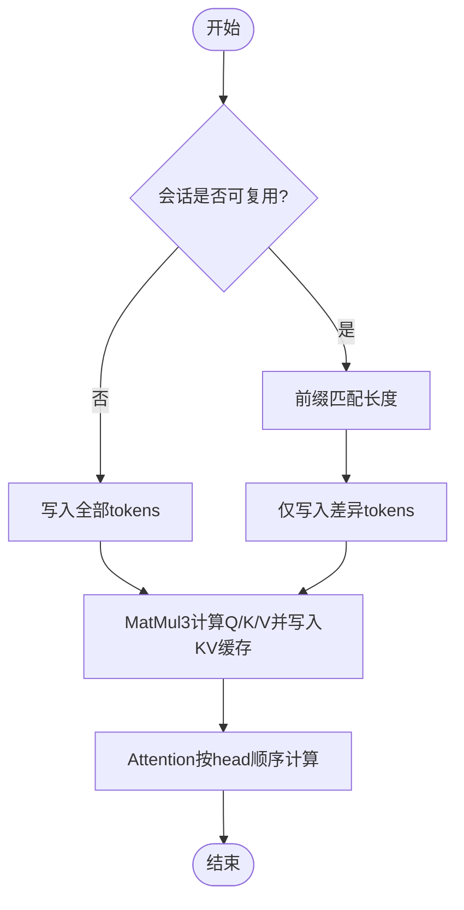
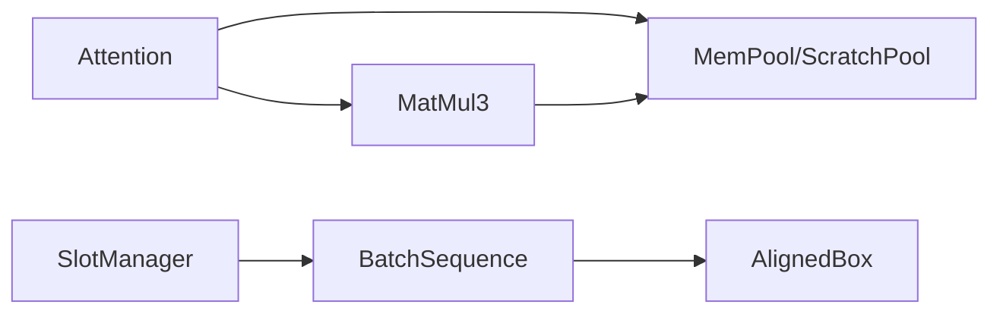

# KV 缓存管理机制

<cite>
**本文引用的文件**   
- [src/operators/attention/attention.rs](file://src/operators/attention/attention.rs)
- [src/operators/attention/compute.rs](file://src/operators/attention/compute.rs)
- [src/operators/matmul/matmul3.rs](file://src/operators/matmul/matmul3.rs)
- [src/mem_mgr/allocator.rs](file://src/mem_mgr/allocator.rs)
- [src/mem_mgr/mem_pool.rs](file://src/mem_mgr/mem_pool.rs)
- [src/runtime/session/slot.rs](file://src/runtime/session/slot.rs)
- [src/runtime/session/manager.rs](file://src/runtime/session/manager.rs)
- [src/runtime/session/sequence.rs](file://src/runtime/session/sequence.rs)
- [src/transformer/attention.rs](file://src/transformer/attention.rs)
- [README.md](file://README.md)
- [README.zh-CN.md](file://README.zh-CN.md)
</cite>

## 目录
1. [简介](#简介)
2. [项目结构](#项目结构)
3. [核心组件](#核心组件)
4. [架构总览](#架构总览)
5. [详细组件分析](#详细组件分析)
6. [依赖关系分析](#依赖关系分析)
7. [性能考量](#性能考量)
8. [故障排查指南](#故障排查指南)
9. [结论](#结论)
10. [附录](#附录)

## 简介
本技术文档聚焦于 eLLM 的 KV 缓存管理机制，围绕以下目标展开：
- 数据结构与内存布局：键值对的存储布局、维度优先的固定形状设计、批内索引与步长。
- 初始化与容量规划：最大序列长度、批处理大小、线程并行度对容量的影响。
- 增量更新机制：每个时间步高效追加新的 K/V。
- 查找与访问模式：随机访问与顺序访问优化、逐 head 顺序计算策略。
- 内存对齐与零拷贝：64B 对齐分配、子块视图与指针偏移。
- 命中率统计与监控：会话复用、前缀匹配、LRU 淘汰与保留槽位。
- 清理与回收：会话释放、超时回收、避免泄漏。
- 配置建议与最佳实践：不同场景下的参数选择。

## 项目结构
KV 缓存相关的关键模块分布在算子层、运行时会话层与内存管理层：
- 算子层：注意力实现与 matmul3 写入 KV 缓存；按 head 顺序遍历，支持 GQA 语义。
- 运行时会话层：SlotManager 管理会话生命周期、LRU 与保留槽位；BatchSequence 维护 token 序列。
- 内存管理层：AlignedBox 提供 64B 对齐分配；MemPool/ScratchPool 提供全局池化与零拷贝子块视图。

图表来源
- [src/operators/attention/attention.rs:438-505](file://src/operators/attention/attention.rs#L438-L505)
- [src/operators/matmul/matmul3.rs:576-603](file://src/operators/matmul/matmul3.rs#L576-L603)
- [src/runtime/session/manager.rs:17-44](file://src/runtime/session/manager.rs#L17-L44)
- [src/runtime/session/sequence.rs:10-51](file://src/runtime/session/sequence.rs#L10-L51)
- [src/mem_mgr/allocator.rs:1-28](file://src/mem_mgr/allocator.rs#L1-L28)
- [src/mem_mgr/mem_pool.rs:88-106](file://src/mem_mgr/mem_pool.rs#L88-L106)

章节来源
- [src/operators/attention/attention.rs:438-505](file://src/operators/attention/attention.rs#L438-L505)
- [src/operators/matmul/matmul3.rs:576-603](file://src/operators/matmul/matmul3.rs#L576-L603)
- [src/runtime/session/manager.rs:17-44](file://src/runtime/session/manager.rs#L17-L44)
- [src/runtime/session/sequence.rs:10-51](file://src/runtime/session/sequence.rs#L10-L51)
- [src/mem_mgr/allocator.rs:1-28](file://src/mem_mgr/allocator.rs#L1-L28)
- [src/mem_mgr/mem_pool.rs:88-106](file://src/mem_mgr/mem_pool.rs#L88-L106)

## 核心组件
- Attention（注意力）：负责读取 Q/K/V 并输出上下文向量；采用“逐 head 顺序计算”，在 CPU 上最大化 L3 局部性。
- MatMul3（K/Q/V 投影）：将隐藏态映射为 Q/K/V，并在 decode/prefill 阶段将 K/V 写入 KV 缓存。
- SlotManager（会话/槽位管理）：维护会话到槽位的映射、LRU 淘汰、保留槽位与超时回收。
- BatchSequence（序列缓冲）：以连续数组存放 token，支持按 slot 和位置范围读写。
- AlignedBox（对齐分配器）：64B 对齐分配，便于 SIMD 向量化。
- MemPool/ScratchPool（全局池）：按名称/正则匹配复用内存块，支持子块视图零拷贝。

章节来源
- [src/operators/attention/attention.rs:14-37](file://src/operators/attention/attention.rs#L14-L37)
- [src/operators/matmul/matmul3.rs:576-603](file://src/operators/matmul/matmul3.rs#L576-L603)
- [src/runtime/session/manager.rs:17-44](file://src/runtime/session/manager.rs#L17-L44)
- [src/runtime/session/sequence.rs:10-51](file://src/runtime/session/sequence.rs#L10-L51)
- [src/mem_mgr/allocator.rs:1-28](file://src/mem_mgr/allocator.rs#L1-L28)
- [src/mem_mgr/mem_pool.rs:88-106](file://src/mem_mgr/mem_pool.rs#L88-L106)

## 架构总览
KV 缓存从生成到使用的主要流程如下：
- Prefill：通过 MatMul3 计算得到 K/V，按 (next_sequence_index, batch_index) 写入 KV 缓存；随后 Attention 按 head 顺序读取 KV 进行注意力计算。
- Decode：每次新增一个 token，再次调用 MatMul3 写入最新 K/V，然后 Attention 仅计算最后一个 token 的输出。
- 会话管理：SlotManager 决定何时复用已有 KV（前缀匹配）、何时新建、何时释放或保留。

图表来源
- [src/runtime/session/manager.rs:137-182](file://src/runtime/session/manager.rs#L137-L182)
- [src/operators/matmul/matmul3.rs:576-603](file://src/operators/matmul/matmul3.rs#L576-L603)
- [src/operators/attention/attention.rs:438-505](file://src/operators/attention/attention.rs#L438-L505)

## 详细组件分析

### KV 缓存的数据结构与内存布局
- 布局原则：固定形状、维度优先（batch × head × seq × dim），便于逐 head 顺序访问，提升 CPU L3 命中。
- 批内索引：通过 next_sequence_index 与 batch_index 定位当前 token 行；每行长度为 head_dim。
- 步长参数：k_batch_stride/k_head_stride/k_seq_stride 等控制跨批、跨头、跨序列的内存跨度，确保同一 head 的 KV 数据连续驻留。
- 访问模式：Attention 内部按 row_step × col_step 分块遍历，先完成一个 head 的全部 token，再切换到下一个 head。

章节来源
- [src/operators/attention/attention.rs:14-37](file://src/operators/attention/attention.rs#L14-L37)
- [src/operators/attention/attention.rs:438-505](file://src/operators/attention/attention.rs#L438-L505)
- [README.zh-CN.md:147-160](file://README.zh-CN.md#L147-L160)

### 初始化与容量规划
- 最大序列长度：由 sequence_length 决定 KV 缓存的最大列数；prefill 与 decode 共享该容量。
- 批处理大小：batch_size 决定每行的批内偏移；KV 缓存总大小为 batch_size × kv_heads × sequence_length × head_dim。
- 线程并行度：thread_num 影响 split 策略；短 slice 时按 head 分组 wave 提高核心覆盖率。
- 容量规划建议：根据模型 head_dim、kv_heads、期望最大并发与最长序列估算 KV 占用，预留一定余量。

章节来源
- [src/operators/attention/attention.rs:438-505](file://src/operators/attention/attention.rs#L438-L505)
- [src/transformer/attention.rs:92-209](file://src/transformer/attention.rs#L92-L209)

### 增量更新机制（每个时间步追加新的 K/V）
- MatMul3 在 decode 路径中计算新 token 的 K/V，并按 (next_sequence_index, batch_index) 写入对应行。
- 写入后，Attention 仅针对最后一个 token 的行计算注意力，利用已驻留的 KV 数据。
- 通过 k_seq_stride/v_seq_stride 保证相邻 token 的 KV 在同一 head 下连续，利于顺序追加。

章节来源
- [src/operators/matmul/matmul3.rs:576-603](file://src/operators/matmul/matmul3.rs#L576-L603)
- [src/operators/attention/attention.rs:438-505](file://src/operators/attention/attention.rs#L438-L505)

### 查找与访问模式（随机与顺序优化）
- 顺序访问：逐 head 顺序遍历所有 token，最大化空间局部性与时间局部性。
- 随机访问：通过 next_sequence_index 与 batch_index 直接定位任意 token 的 KV 行，支持因果掩码可见窗口。
- 分块策略：row_step × col_step 分块，减少中间状态刷新开销；短 slice 切换 head 分组 wave 提升并行覆盖。

章节来源
- [src/operators/attention/attention.rs:157-311](file://src/operators/attention/attention.rs#L157-L311)
- [src/operators/attention/attention.rs:313-436](file://src/operators/attention/attention.rs#L313-L436)

### 内存对齐与零拷贝访问
- 64B 对齐：AlignedBox 使用 64B 对齐分配，适配 SIMD512 指令集，降低访存惩罚。
- 零拷贝子块：MemPool 支持 Full/Sub 两种 MemoryBlock，Sub 通过 parent + offset + size 形成零拷贝视图，避免重复复制。
- Scratch 池：ScratchPool 按名称复用临时缓冲区，按需扩容与填充初始值。

章节来源
- [src/mem_mgr/allocator.rs:1-28](file://src/mem_mgr/allocator.rs#L1-L28)
- [src/mem_mgr/mem_pool.rs:24-86](file://src/mem_mgr/mem_pool.rs#L24-L86)
- [src/mem_mgr/mem_pool.rs:208-235](file://src/mem_mgr/mem_pool.rs#L208-L235)

### 会话复用与前缀匹配（命中率与监控指标）
- 会话复用：Reusable 模式下，release_session 进入 reserved_slots，超时后自动回收；NonReusable 立即重置。
- 前缀匹配：write_prompts 时比较新 token 与已缓存 token 的前缀，仅写入差异部分，减少重复计算。
- LRU 淘汰：当所有槽位被占用时，淘汰最近最少使用的槽位。
- 监控指标建议：
  - 会话复用率 = 复用次数 / 总请求数
  - 前缀匹配命中率 = 匹配长度 > 0 的请求占比
  - 槽位利用率 = 活跃槽位数 / 总槽位数
  - 平均保留时长 = reserved_slots 存活时间均值

章节来源
- [src/runtime/session/manager.rs:84-133](file://src/runtime/session/manager.rs#L84-L133)
- [src/runtime/session/manager.rs:137-182](file://src/runtime/session/manager.rs#L137-L182)
- [src/runtime/session/manager.rs:256-282](file://src/runtime/session/manager.rs#L256-L282)
- [src/runtime/session/slot.rs:18-64](file://src/runtime/session/slot.rs#L18-L64)

### 清理与回收策略（防止内存泄漏）
- 保留槽位取消：若会话在超时前被重用，cancel_flag 置位，异步任务提前退出，避免重复清理。
- 超时回收：定时器到期后检查 cancel_flag，未取消则移除 reserved_slots 并将槽位重置为 Start。
- NonReusable 模式：立即 reset_to_start 并从 session_map 移除，加入 available 池。
- 不变式：任一时刻槽位仅处于 active_*、reserved_slots 或 available_slots 之一，无泄漏。

章节来源
- [src/runtime/session/manager.rs:84-133](file://src/runtime/session/manager.rs#L84-L133)
- [docs/design/runtime/session_management.md:366-438](file://docs/design/runtime/session_management.md#L366-L438)

### 类图（代码级结构）

图表来源
- [src/operators/attention/attention.rs:438-505](file://src/operators/attention/attention.rs#L438-L505)
- [src/operators/matmul/matmul3.rs:576-603](file://src/operators/matmul/matmul3.rs#L576-L603)
- [src/runtime/session/manager.rs:17-44](file://src/runtime/session/manager.rs#L17-L44)
- [src/runtime/session/sequence.rs:10-51](file://src/runtime/session/sequence.rs#L10-L51)
- [src/mem_mgr/allocator.rs:1-28](file://src/mem_mgr/allocator.rs#L1-L28)
- [src/mem_mgr/mem_pool.rs:88-106](file://src/mem_mgr/mem_pool.rs#L88-L106)

### 流程图（增量写入与注意力计算）

图表来源
- [src/runtime/session/manager.rs:137-182](file://src/runtime/session/manager.rs#L137-L182)
- [src/operators/matmul/matmul3.rs:576-603](file://src/operators/matmul/matmul3.rs#L576-L603)
- [src/operators/attention/attention.rs:438-505](file://src/operators/attention/attention.rs#L438-L505)

## 依赖关系分析
- Attention 依赖 MatMul3 输出的 K/V 缓存，并通过 stride 参数进行高效访问。
- SlotManager 依赖 BatchSequence 进行 token 读写，并维护会话到槽位的映射。
- MemPool/ScratchPool 为算子提供全局内存复用，减少分配/释放开销。
- AlignedBox 作为底层分配器，支撑上层零拷贝与 SIMD 友好布局。

图表来源
- [src/operators/attention/attention.rs:438-505](file://src/operators/attention/attention.rs#L438-L505)
- [src/operators/matmul/matmul3.rs:576-603](file://src/operators/matmul/matmul3.rs#L576-L603)
- [src/runtime/session/manager.rs:17-44](file://src/runtime/session/manager.rs#L17-L44)
- [src/runtime/session/sequence.rs:10-51](file://src/runtime/session/sequence.rs#L10-L51)
- [src/mem_mgr/allocator.rs:1-28](file://src/mem_mgr/allocator.rs#L1-L28)
- [src/mem_mgr/mem_pool.rs:88-106](file://src/mem_mgr/mem_pool.rs#L88-L106)

## 性能考量
- 逐 head 顺序计算：显著增强时间/空间局部性，单个 KV head 的有效缓存驻留能力较常规并行模式提升约 2–3 个数量级。
- 固定形状与维度优先布局：减少跨头/跨批的跳跃访问，降低带宽竞争。
- 分块遍历（row_step × col_step）：平衡计算粒度与中间状态刷新成本。
- 短 slice 的 head 分组 wave：提高核心覆盖率，同时限制同时驻留的 head 数量，避免 L3 抖动。

章节来源
- [README.md:142-155](file://README.md#L142-L155)
- [README.zh-CN.md:147-160](file://README.zh-CN.md#L147-L160)
- [src/operators/attention/attention.rs:313-436](file://src/operators/attention/attention.rs#L313-L436)

## 故障排查指南
- 会话不可用错误：ensure_slot_available 检查槽位是否为 Start/Eos，否则返回错误。
- 严格权重加载失败：MemPool strict 模式下缺失或形状不匹配的权重会 panic，用于快速定位配置问题。
- 保留槽位未回收：检查 cancel_flag 与定时器逻辑，确认重用路径是否正确设置取消信号。
- KV 写入越界：校验 next_sequence_index + length 不超过 sequence_length，以及 batch_index 不超过 batch_size。

章节来源
- [src/runtime/session/manager.rs:229-239](file://src/runtime/session/manager.rs#L229-L239)
- [src/mem_mgr/mem_pool.rs:388-407](file://src/mem_mgr/mem_pool.rs#L388-L407)
- [src/runtime/session/manager.rs:84-133](file://src/runtime/session/manager.rs#L84-L133)

## 结论
eLLM 的 KV 缓存管理以“固定形状、维度优先、逐 head 顺序计算”为核心，结合会话复用与前缀匹配，有效提升了 CPU 上的缓存命中率与吞吐。通过 64B 对齐与零拷贝子块，进一步降低了内存搬运与分配开销。合理的容量规划与清理回收策略确保了系统在长上下文与高并发场景下的稳定性与可扩展性。

## 附录
- 配置建议与最佳实践：
  - 短对话（<1分钟）：会话保留 1–5 分钟；开启 Reusable 模式。
  - 中等对话（1–10分钟）：保留 10–15 分钟；关注前缀命中率。
  - 长对话（>10分钟）：保留 30+ 分钟或采用 NonReusable 模式以避免长期占用。
  - 高并发：缩短保留时间，加速槽位回收；增大 batch_size 与 sequence_length 时需评估 KV 内存占用。
  - 低并发：延长保留时间，最大化复用收益。

章节来源
- [docs/design/runtime/session_management.md:520-546](file://docs/design/runtime/session_management.md#L520-L546)