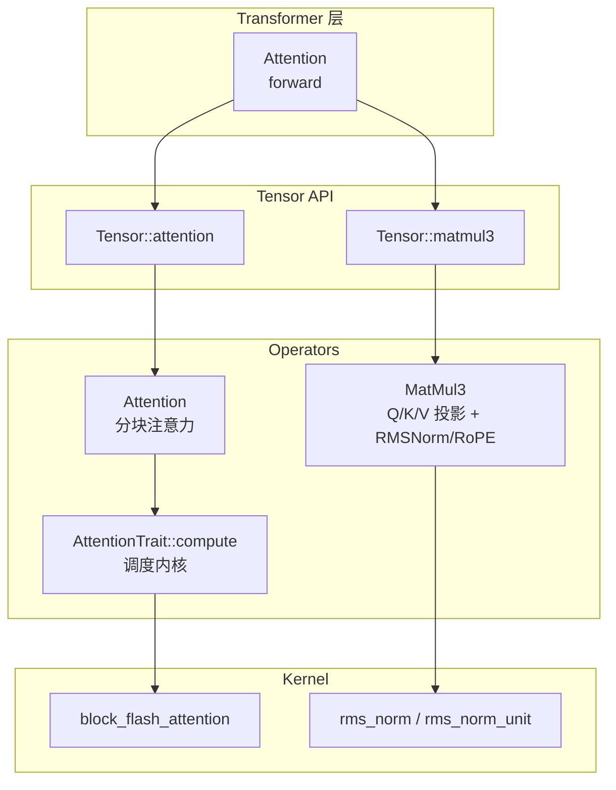
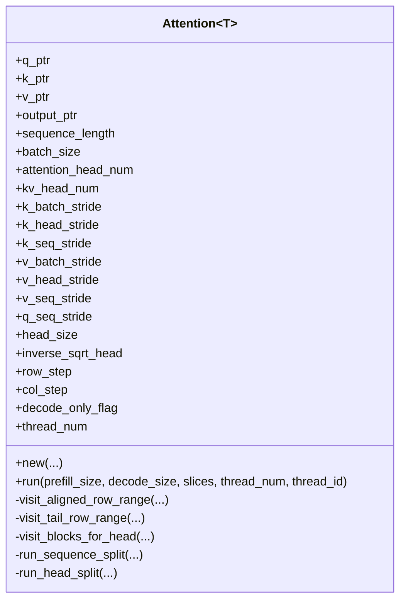
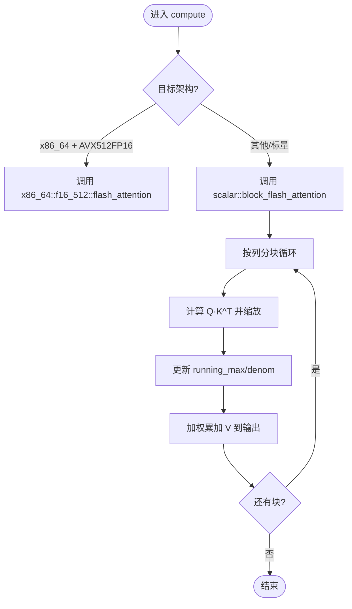
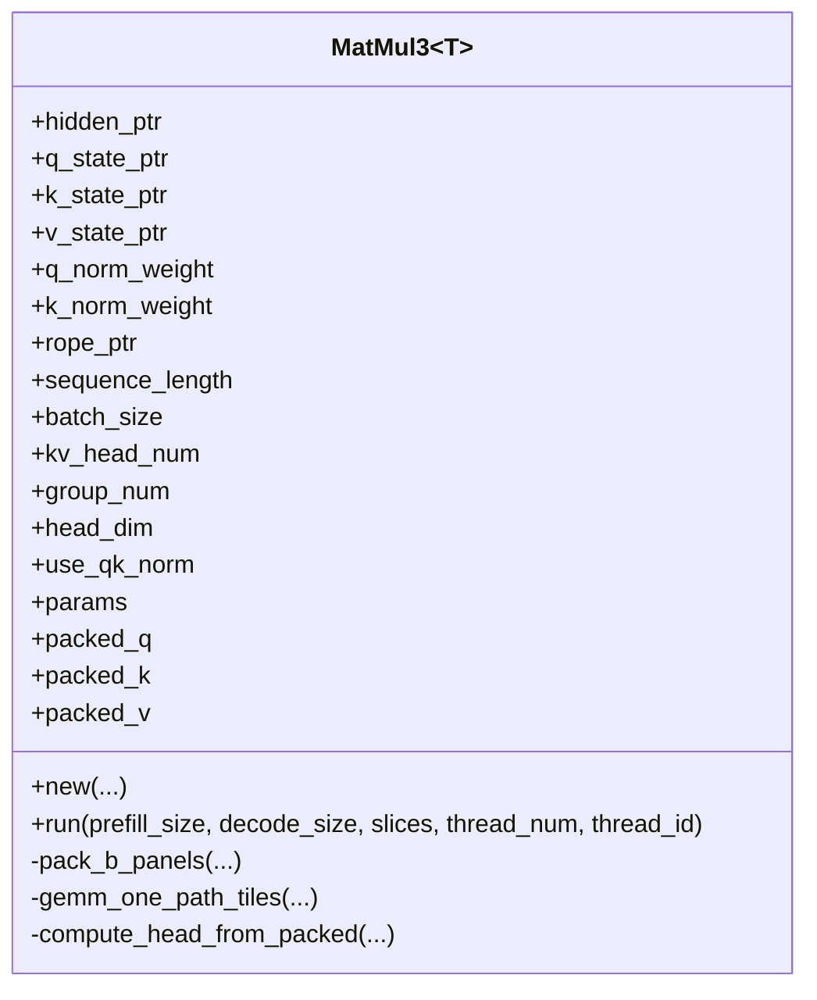
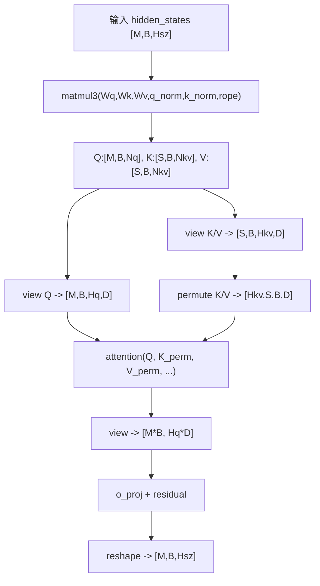
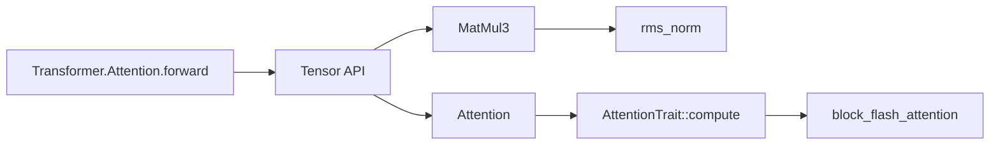

# 多头注意力核心实现

<cite>
**本文引用的文件列表**
- [src/transformer/attention.rs](file://src/transformer/attention.rs)
- [src/tensor/matmul.rs](file://src/tensor/matmul.rs)
- [src/operators/matmul/matmul3.rs](file://src/operators/matmul/matmul3.rs)
- [src/kernel/scalar/rms_norm.rs](file://src/kernel/scalar/rms_norm.rs)
- [src/operators/attention/attention.rs](file://src/operators/attention/attention.rs)
- [src/operators/attention/compute.rs](file://src/operators/attention/compute.rs)
- [src/kernel/scalar/block_flash_attention.rs](file://src/kernel/scalar/block_flash_attention.rs)
- [src/operators/attention/utils.rs](file://src/operators/attention/utils.rs)
- [src/operators/attention/scratch.rs](file://src/operators/attention/scratch.rs)
</cite>

## 目录
1. [简介](#简介)
2. [项目结构](#项目结构)
3. [核心组件](#核心组件)
4. [架构总览](#架构总览)
5. [详细组件分析](#详细组件分析)
6. [依赖关系分析](#依赖关系分析)
7. [性能与内存优化](#性能与内存优化)
8. [故障排查指南](#故障排查指南)
9. [结论](#结论)

## 简介
本技术文档聚焦于多头注意力（Multi-Head Attention）的核心实现，围绕以下关键点展开：
- Attention<T> 结构体的设计与职责边界
- Q/K/V 投影矩阵的权重初始化与管理
- forward 完整计算流程：从隐藏状态输入到最终输出的每一步变换
- matmul3 如何同时完成 Q、K、V 三路投影，并集成 RMSNorm 与 RoPE
- 张量形状变换（view/permute）对数据布局的影响
- decode_only_flag 在推理模式下的优化作用
- 使用示例路径与最佳实践

## 项目结构
本项目采用分层组织方式：
- 高层 Transformer 层封装了注意力模块的前向逻辑
- Tensor API 提供算子编排接口（如 matmul3、attention）
- 具体算子实现位于 operators 与 kernel 层，包含高性能内核与通用标量实现
- 注意力核心由 Attention<T> 驱动，内部通过分块 FlashAttention 内核进行稳定高效的注意力计算



图表来源
- [src/transformer/attention.rs:92-209](file://src/transformer/attention.rs#L92-L209)
- [src/tensor/matmul.rs:136-203](file://src/tensor/matmul.rs#L136-L203)
- [src/operators/matmul/matmul3.rs:122-207](file://src/operators/matmul/matmul3.rs#L122-L207)
- [src/operators/attention/attention.rs:439-505](file://src/operators/attention/attention.rs#L439-L505)
- [src/operators/attention/compute.rs:10-62](file://src/operators/attention/compute.rs#L10-L62)
- [src/kernel/scalar/block_flash_attention.rs:5-95](file://src/kernel/scalar/block_flash_attention.rs#L5-L95)
- [src/kernel/scalar/rms_norm.rs:5-50](file://src/kernel/scalar/rms_norm.rs#L5-L50)

章节来源
- [src/transformer/attention.rs:92-209](file://src/transformer/attention.rs#L92-L209)
- [src/tensor/matmul.rs:136-203](file://src/tensor/matmul.rs#L136-L203)

## 核心组件
- Attention<T>（operators 层）：负责按行/列分块访问 K/V，维护线程级 scratch 缓冲，调用 AttentionTrait::compute 执行分块注意力。
- MatMul3（operators 层）：一次性完成 Q/K/V 三路 GEMM，并在需要时融合 RMSNorm 与 RoPE。
- block_flash_attention（kernel 层）：数值稳定的分块注意力内核，支持增量更新 running_max/denom。
- rms_norm（kernel 层）：RMS 归一化实现，用于 Q/K 头维度的归一化。

章节来源
- [src/operators/attention/attention.rs:14-143](file://src/operators/attention/attention.rs#L14-L143)
- [src/operators/matmul/matmul3.rs:80-207](file://src/operators/matmul/matmul3.rs#L80-L207)
- [src/kernel/scalar/block_flash_attention.rs:5-95](file://src/kernel/scalar/block_flash_attention.rs#L5-L95)
- [src/kernel/scalar/rms_norm.rs:5-50](file://src/kernel/scalar/rms_norm.rs#L5-L50)

## 架构总览
下图展示了从 Transformer 层 Attention.forward 到算子执行的关键调用链与数据流向。

```mermaid
sequenceDiagram
participant Layer as "Transformer.Attention.forward"
participant T as "Tensor API"
participant M3 as "MatMul3"
participant A as "Attention<T>"
participant C as "AttentionTrait : : compute"
participant K as "block_flash_attention"
Layer->>T : matmul3(hidden, Wq,Wk,Wv, q_norm,k_norm, rope,...)
T-->>Layer : (Q_states, K_states, V_states)
Layer->>T : attention(Q, K.permute(...), V.permute(...), ...)
T-->>Layer : attn_output
Layer->>Layer : view/reshape -> o_proj + residual add
Layer-->>Layer : 返回输出
Note over T,M3 : MatMul3 并行执行三路GEMM，可选融合RMSNorm+RoPE
Note over A,C,K : Attention<T> 分块调度，调用内核做稳定注意力
```

图表来源
- [src/transformer/attention.rs:107-171](file://src/transformer/attention.rs#L107-L171)
- [src/tensor/matmul.rs:136-203](file://src/tensor/matmul.rs#L136-L203)
- [src/operators/matmul/matmul3.rs:525-621](file://src/operators/matmul/matmul3.rs#L525-L621)
- [src/operators/attention/attention.rs:439-505](file://src/operators/attention/attention.rs#L439-L505)
- [src/operators/attention/compute.rs:10-62](file://src/operators/attention/compute.rs#L10-L62)
- [src/kernel/scalar/block_flash_attention.rs:5-95](file://src/kernel/scalar/block_flash_attention.rs#L5-L95)

## 详细组件分析

### Attention<T> 结构与职责
- 字段说明
  - q_ptr/k_ptr/v_ptr/output_ptr：指向 Q、K、V 与输出缓冲的指针
  - sequence_length/batch_size/attention_head_num/kv_head_num：维度与头数
  - k_batch_stride/k_head_stride/k_seq_stride 等：K/V 的步长信息，适配不同布局
  - head_size/inverse_sqrt_head：头维与缩放因子
  - row_step/col_step：分块大小
  - decode_only_flag：推理模式开关
  - thread_num：并发线程数
  - scratch：线程级 scratch 缓冲池（running_max/denom/scores）
- 构造与参数校验
  - new 中设置 thread_num 与 row_step 下界为 1，避免除零
  - 初始化 scratch 缓冲池，按线程与分块尺寸分配
- 分块访问策略
  - visit_aligned_row_range/visit_tail_row_range：分别处理对齐与尾部未对齐的行范围
  - split_sequence_by_triangle：基于三角工作量的负载均衡划分
  - run_sequence_split/run_head_split：根据长度与线程数选择“序列切分”或“头切分”策略
- 主入口 run
  - 遍历 SequenceSlice，计算每段 slice 的 col_end、aligned_len，并选择合适策略
  - 针对每个 KV 头与局部头，调用 visit_blocks_for_head 完成计算



图表来源
- [src/operators/attention/attention.rs:14-143](file://src/operators/attention/attention.rs#L14-L143)
- [src/operators/attention/attention.rs:439-505](file://src/operators/attention/attention.rs#L439-L505)

章节来源
- [src/operators/attention/attention.rs:14-143](file://src/operators/attention/attention.rs#L14-L143)
- [src/operators/attention/attention.rs:157-311](file://src/operators/attention/attention.rs#L157-L311)
- [src/operators/attention/attention.rs:314-436](file://src/operators/attention/attention.rs#L314-L436)
- [src/operators/attention/attention.rs:439-505](file://src/operators/attention/attention.rs#L439-L505)
- [src/operators/attention/utils.rs:40-61](file://src/operators/attention/utils.rs#L40-L61)
- [src/operators/attention/scratch.rs:19-73](file://src/operators/attention/scratch.rs#L19-L73)

### AttentionTrait::compute 与分块内核
- AttentionTrait::compute 将 Attention<T> 的分块调度委托给内核
- f16 特化在具备 AVX512FP16 时使用 x86_64::f16_512::flash_attention 内核，否则回退到标量实现
- 标量内核 block_flash_attention 实现数值稳定的分块注意力：
  - 逐块计算 score 并维护 running_max/denom
  - 使用在线 softmax 更新输出，避免溢出



图表来源
- [src/operators/attention/compute.rs:10-130](file://src/operators/attention/compute.rs#L10-L130)
- [src/kernel/scalar/block_flash_attention.rs:5-95](file://src/kernel/scalar/block_flash_attention.rs#L5-L95)

章节来源
- [src/operators/attention/compute.rs:10-130](file://src/operators/attention/compute.rs#L10-L130)
- [src/kernel/scalar/block_flash_attention.rs:5-95](file://src/kernel/scalar/block_flash_attention.rs#L5-L95)

### matmul3：Q/K/V 三路投影与 RMSNorm/RoPE 集成
- 输入布局约定
  - A: [M×K]（M 为 token 行数，K 为 hidden_size）
  - Wq_nt/Wk_nt/Wv_nt: [Nq×K]/[Nkv×K]/[Nkv×K]（NT 布局）
  - Cq/Ck/Cv: [M×Nq]/[M×Nkv]/[M×Nkv]
- 关键流程
  - pack_b_panels：预打包权重面板，提升缓存命中
  - run：构建行映射（token_index, batch_index, next_sequence_index），按任务分配到各线程
  - gemm_one_path_tiles：分块 GEMM 计算，最后一步可融合 RMSNorm+RoPE
  - compute_head_from_packed：按头粒度计算，必要时应用 RMSNorm 与 RoPE
- RMSNorm 集成
  - use_qk_norm=true 时，Q/K 输出先经 RMSNorm，再应用 RoPE；V 不应用
  - 默认路径使用 rms_norm_unit 或带权重的 rms_norm
- 线程与任务分配
  - path_task 将任务划分为 V/K/Q 三类，按 head 维度拆分
  - task_assign_path 将 tile 任务映射到具体路径



图表来源
- [src/operators/matmul/matmul3.rs:80-207](file://src/operators/matmul/matmul3.rs#L80-L207)
- [src/operators/matmul/matmul3.rs:525-621](file://src/operators/matmul/matmul3.rs#L525-L621)
- [src/operators/matmul/matmul3.rs:281-391](file://src/operators/matmul/matmul3.rs#L281-L391)
- [src/operators/matmul/matmul3.rs:447-494](file://src/operators/matmul/matmul3.rs#L447-L494)

章节来源
- [src/operators/matmul/matmul3.rs:122-207](file://src/operators/matmul/matmul3.rs#L122-L207)
- [src/operators/matmul/matmul3.rs:281-391](file://src/operators/matmul/matmul3.rs#L281-L391)
- [src/operators/matmul/matmul3.rs:447-494](file://src/operators/matmul/matmul3.rs#L447-L494)
- [src/kernel/scalar/rms_norm.rs:5-50](file://src/kernel/scalar/rms_norm.rs#L5-L50)

### Transformer 层 Attention.forward 流程
- 步骤概览
  1) 调用 Tensor::matmul3 得到 Q/K/V 状态，并可选择融合 RMSNorm+RoPE
  2) 若 decode_only_flag，则对中间结果 lift_vector（便于后续单步推理）
  3) view 重塑：将 Q/K/V 展平为 [seq, batch, heads, head_dim]
  4) permute：将 K/V 转为 [heads, seq, batch, head_dim]，以匹配注意力内核期望布局
  5) 调用 Tensor::attention 执行注意力，得到 attn_output
  6) view 重塑为 [rows, hidden]，再次 lift_vector（推理模式）
  7) 与残差相加并通过 o_proj 线性层，最终 reshape 回 [seq, batch, hidden]
- 形状变化要点
  - matmul3 输出 Q:[M,B,Nq], K/V:[S,B,Nkv]
  - view 后 Q:[M,B,Hq,D], K/V:[S,B,Hkv,D]
  - permute 后 K/V:[Hkv,S,B,D]，以便按头访问
  - attention 输出形状与 Q 一致，随后被 reshape 为二维矩阵参与 o_proj



图表来源
- [src/transformer/attention.rs:107-209](file://src/transformer/attention.rs#L107-L209)
- [src/tensor/matmul.rs:136-203](file://src/tensor/matmul.rs#L136-L203)
- [src/tensor/matmul.rs:28-67](file://src/tensor/matmul.rs#L28-L67)

章节来源
- [src/transformer/attention.rs:92-209](file://src/transformer/attention.rs#L92-L209)
- [src/tensor/matmul.rs:136-203](file://src/tensor/matmul.rs#L136-L203)
- [src/tensor/matmul.rs:28-67](file://src/tensor/matmul.rs#L28-L67)

### 使用示例路径（前向传播）
- 参考测试用例中的构造与调用方式，展示如何创建 Attention 实例、准备张量、执行 forward 并运行算子队列：
  - 示例路径：[src/transformer/attention.rs:218-293](file://src/transformer/attention.rs#L218-L293)
  - 示例路径（f16）：[src/transformer/attention.rs:295-363](file://src/transformer/attention.rs#L295-L363)
  - matmul3 测试路径：[src/tensor/tests/matmul.rs:258-292](file://src/tensor/tests/matmul.rs#L258-L292)

章节来源
- [src/transformer/attention.rs:218-293](file://src/transformer/attention.rs#L218-L293)
- [src/transformer/attention.rs:295-363](file://src/transformer/attention.rs#L295-L363)
- [src/tensor/tests/matmul.rs:258-292](file://src/tensor/tests/matmul.rs#L258-L292)

### decode_only_flag 的作用与优化
- 在 Transformer.forward 中，当 decode_only_flag 为真时：
  - 对 Q/K/V 输出进行 lift_vector，减少后续操作的维度开销
  - 对 attn_output 也进行 lift_vector，使 o_proj 与残差相加更高效
- 在 Attention.run 中，decode_only_flag 影响分块策略与可见列范围（next_sequence_index）的计算，从而在自回归生成阶段跳过不必要的历史位置计算

章节来源
- [src/transformer/attention.rs:130-181](file://src/transformer/attention.rs#L130-L181)
- [src/operators/attention/attention.rs:439-505](file://src/operators/attention/attention.rs#L439-L505)

## 依赖关系分析
- 高层依赖
  - Transformer.Attention.forward 依赖 Tensor API 的 matmul3 与 attention
  - Tensor API 将操作入队，运行时统一调度执行
- 算子依赖
  - MatMul3 依赖 packed 权重面板与 RMSNorm/RoPE 内核
  - Attention<T> 依赖 AttentionTrait::compute 与 block_flash_attention 内核
- 内核依赖
  - block_flash_attention 依赖 Exp/NegInfinity 等数值特性
  - rms_norm 依赖 Sqrt 等数值特性



图表来源
- [src/transformer/attention.rs:107-171](file://src/transformer/attention.rs#L107-L171)
- [src/tensor/matmul.rs:136-203](file://src/tensor/matmul.rs#L136-L203)
- [src/operators/attention/compute.rs:10-62](file://src/operators/attention/compute.rs#L10-L62)
- [src/kernel/scalar/block_flash_attention.rs:5-95](file://src/kernel/scalar/block_flash_attention.rs#L5-L95)
- [src/kernel/scalar/rms_norm.rs:5-50](file://src/kernel/scalar/rms_norm.rs#L5-L50)

章节来源
- [src/transformer/attention.rs:107-171](file://src/transformer/attention.rs#L107-L171)
- [src/tensor/matmul.rs:136-203](file://src/tensor/matmul.rs#L136-L203)
- [src/operators/attention/compute.rs:10-62](file://src/operators/attention/compute.rs#L10-L62)
- [src/kernel/scalar/block_flash_attention.rs:5-95](file://src/kernel/scalar/block_flash_attention.rs#L5-L95)
- [src/kernel/scalar/rms_norm.rs:5-50](file://src/kernel/scalar/rms_norm.rs#L5-L50)

## 性能与内存优化
- 分块与负载均衡
  - 使用 split_sequence_by_triangle 按三角工作量均衡分配行范围，避免热点行导致负载不均
  - 选择 run_sequence_split 或 run_head_split 策略，依据长度与线程数动态切换
- 缓存友好布局
  - MatMul3 预打包权重面板（pack_b_panels），提高微内核访存效率
  - 注意 K/V 的 stride 配置，确保按头访问时的连续性与跨批访问的步长正确
- 数值稳定性
  - 分块注意力使用 running_max/denom 在线更新，避免 exp 溢出
  - inverse_sqrt_head 缩放防止点积过大
- 推理优化
  - decode_only_flag 启用 lift_vector，减少维度转换与冗余计算
  - 合理设置 row_step/col_step，平衡并行度与内核粒度
- 内存管理
  - 使用 GlobalMemPool 分配中间张量，降低频繁分配开销
  - AttentionScratch 按线程复用缓冲，避免重复分配

章节来源
- [src/operators/attention/utils.rs:40-61](file://src/operators/attention/utils.rs#L40-L61)
- [src/operators/matmul/matmul3.rs:217-256](file://src/operators/matmul/matmul3.rs#L217-L256)
- [src/operators/attention/scratch.rs:19-73](file://src/operators/attention/scratch.rs#L19-L73)
- [src/transformer/attention.rs:130-181](file://src/transformer/attention.rs#L130-L181)

## 故障排查指南
- 常见错误定位
  - 形状不匹配：检查 matmul3 与 attention 的 view/permute 顺序与维度
  - 步长错误：确认 K/V 的 strides 与 batch/seq/head 维度对应关系
  - 数值异常：检查 inverse_sqrt_head 与 eps 设置，确保运行稳定
- 调试建议
  - 使用测试用例对比 naive 实现与分块实现的结果差异
  - 逐步打印中间张量形状与首尾元素，验证布局是否正确
- 相关测试路径
  - 注意力分块与行范围测试：[src/operators/attention/attention.rs:559-703](file://src/operators/attention/attention.rs#L559-L703)
  - 分块注意力与 naive 对比：[src/kernel/scalar/block_flash_attention.rs:152-208](file://src/kernel/scalar/block_flash_attention.rs#L152-L208)

章节来源
- [src/operators/attention/attention.rs:559-703](file://src/operators/attention/attention.rs#L559-L703)
- [src/kernel/scalar/block_flash_attention.rs:152-208](file://src/kernel/scalar/block_flash_attention.rs#L152-L208)

## 结论
该实现通过分层设计将高层语义与底层内核解耦：
- Transformer 层专注流程编排与形状变换
- Tensor API 统一算子入队与执行
- operators 层提供高效且可扩展的注意力与 GEMM 实现
- kernels 层保证数值稳定与硬件加速

整体方案兼顾精度、性能与可维护性，适合大规模语言模型的训练与推理场景。