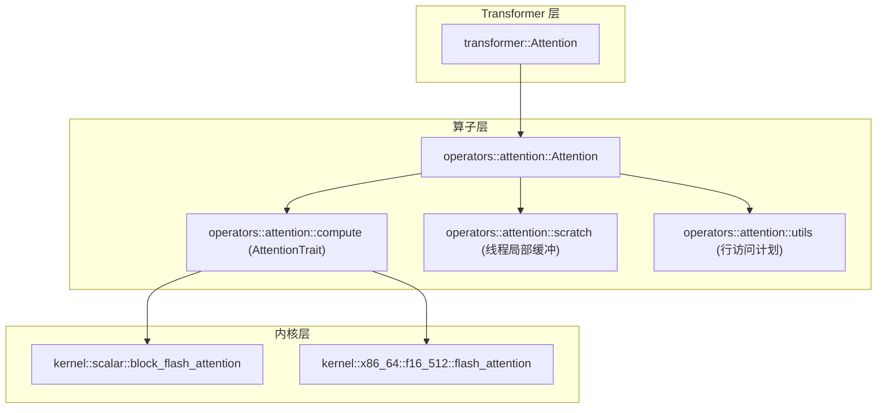
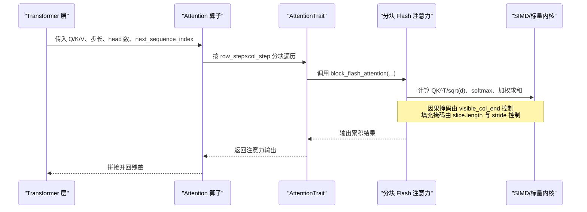
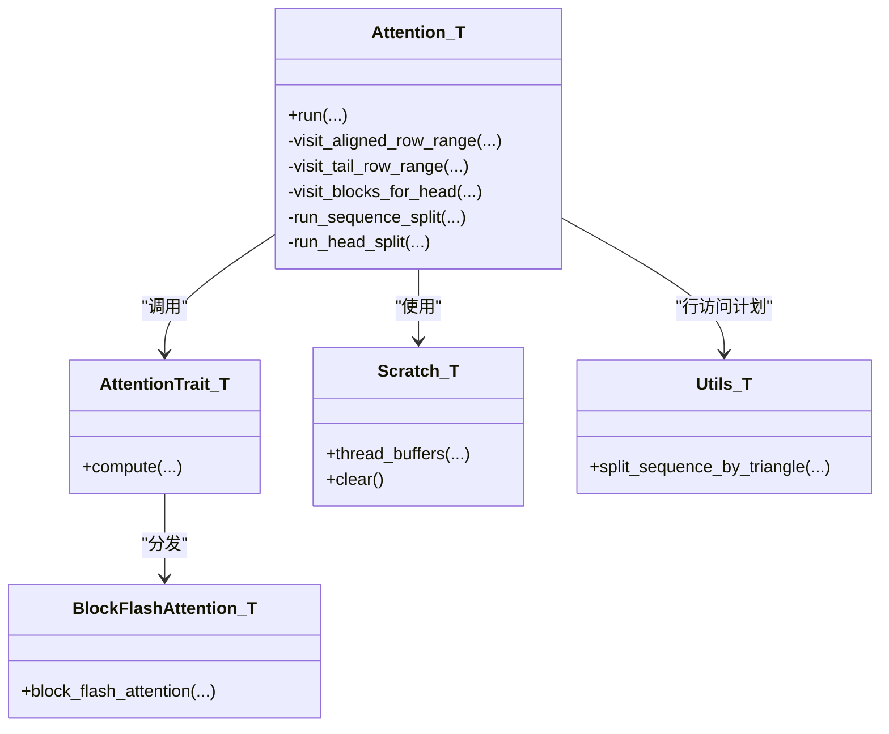
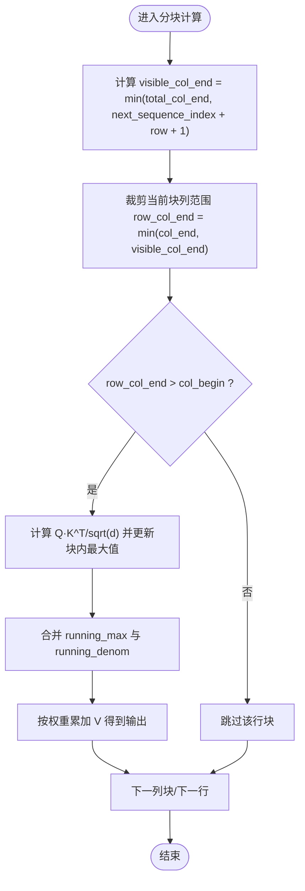

# 注意力掩码处理

<cite>
**本文引用的文件**   
- [src/operators/attention/attention.rs](file://src/operators/attention/attention.rs)
- [src/operators/attention/compute.rs](file://src/operators/attention/compute.rs)
- [src/kernel/scalar/block_flash_attention.rs](file://src/kernel/scalar/block_flash_attention.rs)
- [src/operators/attention/utils.rs](file://src/operators/attention/utils.rs)
- [src/operators/attention/scratch.rs](file://src/operators/attention/scratch.rs)
- [src/transformer/attention.rs](file://src/transformer/attention.rs)
- [docs/design/operators/attention.md](file://docs/design/operators/attention.md)
</cite>

## 目录
1. [简介](#简介)
2. [项目结构](#项目结构)
3. [核心组件](#核心组件)
4. [架构总览](#架构总览)
5. [详细组件分析](#详细组件分析)
6. [依赖关系分析](#依赖关系分析)
7. [性能与内存布局优化](#性能与内存布局优化)
8. [故障排查指南](#故障排查指南)
9. [结论](#结论)
10. [附录](#附录)

## 简介
本技术文档聚焦于注意力机制中的“掩码”处理，围绕因果掩码（防止未来信息泄露）与填充掩码（忽略无效 token）两大类型展开。结合仓库中注意力算子的实现，系统阐述：
- 掩码的生成原理与在计算图中的融合方式
- 数值稳定性与溢出处理策略
- 动态掩码对变长序列与批处理的支持
- 可视化与调试方法
- 在不同注意力变体中的应用差异
- 性能优化技巧与 SIMD 加速路径

## 项目结构
本项目采用分层组织：高层 Transformer 组装注意力层；算子层提供可并行、分块执行的 Attention 内核；底层 kernel 提供标量与特定硬件加速的实现。掩码逻辑主要内嵌在注意力内核的分块计算中，通过可见列边界控制因果掩码，并通过输入切片长度与 stride 管理填充掩码。

图表来源
- [src/transformer/attention.rs:92-209](file://src/transformer/attention.rs#L92-L209)
- [src/operators/attention/attention.rs:1-100](file://src/operators/attention/attention.rs#L1-L100)
- [src/operators/attention/compute.rs:1-62](file://src/operators/attention/compute.rs#L1-L62)
- [src/kernel/scalar/block_flash_attention.rs:1-95](file://src/kernel/scalar/block_flash_attention.rs#L1-L95)
- [src/operators/attention/scratch.rs:1-40](file://src/operators/attention/scratch.rs#L1-L40)
- [src/operators/attention/utils.rs:1-61](file://src/operators/attention/utils.rs#L1-L61)

章节来源
- [src/transformer/attention.rs:92-209](file://src/transformer/attention.rs#L92-L209)
- [docs/design/operators/attention.md:374-390](file://docs/design/operators/attention.md#L374-L390)

## 核心组件
- 注意力算子 Attention<T>：负责 Q/K/V 指针、步长、头数、分块参数、线程划分与调度。
- AttentionTrait 实现：将具体内核选择（标量或 AVX512-FP16）注入到统一接口。
- 分块 Flash 注意力内核：实现流式 softmax 的在线更新，天然支持因果掩码。
- 线程局部缓冲 Scratch：为每个线程维护 running_max、running_denom、scores 等中间状态。
- 行访问计划 utils：基于三角形工作量的静态负载均衡，适配短序列与长序列两种策略。

章节来源
- [src/operators/attention/attention.rs:11-143](file://src/operators/attention/attention.rs#L11-L143)
- [src/operators/attention/compute.rs:10-62](file://src/operators/attention/compute.rs#L10-L62)
- [src/kernel/scalar/block_flash_attention.rs:1-95](file://src/kernel/scalar/block_flash_attention.rs#L1-L95)
- [src/operators/attention/scratch.rs:1-92](file://src/operators/attention/scratch.rs#L1-L92)
- [src/operators/attention/utils.rs:1-61](file://src/operators/attention/utils.rs#L1-L61)

## 架构总览
下图展示了从 Transformer 层到内核层的调用链，以及掩码在其中的作用点。

图表来源
- [src/transformer/attention.rs:162-171](file://src/transformer/attention.rs#L162-L171)
- [src/operators/attention/compute.rs:22-61](file://src/operators/attention/compute.rs#L22-L61)
- [src/kernel/scalar/block_flash_attention.rs:35-94](file://src/kernel/scalar/block_flash_attention.rs#L35-L94)

## 详细组件分析

### 因果掩码（Causal Mask）
- 原理：第 i 个 token 只能关注位置 ≤ i 的历史 token。实现上通过 visible_col_end = min(total_col_end, next_sequence_index + row + 1) 限制每行的有效列范围，从而避免读取未来信息。
- 关键位置：
  - 行级可见边界计算与裁剪
  - 分块内的列范围与 total_col_end 的交集
- 影响：确保自回归解码时不会泄露未来 token 的信息。

章节来源
- [src/kernel/scalar/block_flash_attention.rs:35-41](file://src/kernel/scalar/block_flash_attention.rs#L35-L41)
- [src/operators/attention/attention.rs:175-179](file://src/operators/attention/attention.rs#L175-L179)
- [src/operators/attention/attention.rs:230-234](file://src/operators/attention/attention.rs#L230-L234)

### 填充掩码（Padding Mask）
- 原理：批内不同序列长度不同，尾部填充位应被忽略。实现上通过 SequenceSlice.length 与 stride 控制实际参与计算的 token 数量，未覆盖区域不参与权重归一化与加权求和。
- 关键位置：
  - run() 中对 attention_list 的遍历与切片指针偏移
  - col_end = next_sequence_index + length 决定当前序列的有效列上限
- 影响：保证变长序列在同一批内正确对齐且不被填充位污染。

章节来源
- [src/operators/attention/attention.rs:455-470](file://src/operators/attention/attention.rs#L455-L470)
- [src/operators/attention/attention.rs:464-468](file://src/operators/attention/attention.rs#L464-L468)

### 掩码与注意力权重的融合计算与数值稳定性
- 融合方式：不显式构造 N×N 掩码矩阵，而是以“可见列边界”直接裁剪注意力分数与值向量的聚合范围，减少额外内存与访存。
- 数值稳定性：
  - 使用在线最大值的稳定 softmax：维护 running_max 与 running_denom，跨分块合并时进行指数缩放与权重迁移，避免 exp 溢出。
  - 分数先减去当前块最大值，再与历史最大值比较更新全局最大值。
- 关键点：
  - running_max 与 running_denom 的增量更新公式
  - 上一块输出的按比例缩放后再与新块贡献相加

章节来源
- [src/kernel/scalar/block_flash_attention.rs:47-94](file://src/kernel/scalar/block_flash_attention.rs#L47-L94)
- [src/operators/attention/scratch.rs:75-91](file://src/operators/attention/scratch.rs#L75-L91)

### 动态掩码与变长序列支持
- 动态性：next_sequence_index 随解码推进递增，visible_col_end 随之变化，形成逐 token 增长的三角掩码。
- 批处理：SequenceSlice 携带 batch_index、token_start_index、length、next_sequence_index，使同一批次内不同序列拥有各自的掩码形状。
- 访问计划：
  - 长序列：按 row_step 切分主区间，尾部分区单独处理，保证对齐与覆盖完整。
  - 短序列：切换到 kv_head 波次分配，提高小任务并行度。

章节来源
- [src/operators/attention/attention.rs:314-361](file://src/operators/attention/attention.rs#L314-L361)
- [src/operators/attention/attention.rs:364-436](file://src/operators/attention/attention.rs#L364-L436)
- [src/operators/attention/utils.rs:40-61](file://src/operators/attention/utils.rs#L40-L61)

### 掩码在不同注意力变体中的应用差异
- GQA（分组查询注意力）：Q 头数与 KV 头数不同，掩码仍按行维度施加，KV 头共享同一掩码形状。
- 多模态/稀疏注意力：若引入非三角掩码（如窗口、稀疏模式），需替换 visible_col_end 的计算逻辑，但在线 softmax 的数值稳定框架仍可复用。
- 当前实现：以三角因果掩码为主，未见显式填充掩码矩阵，填充通过切片长度隐式处理。

章节来源
- [docs/design/operators/attention.md:374-390](file://docs/design/operators/attention.md#L374-L390)

### 掩码可视化与调试工具
- 建议方法：
  - 打印每个 Slice 的 next_sequence_index 与 length，推导 visible_col_end 分布。
  - 记录 running_max 与 running_denom 的首尾值，验证跨分块合并是否合理。
  - 对比 naive 参考实现（测试用例中已包含）与内核输出，定位偏差。
- 参考路径：
  - 注意力算子测试中的 naive 行级实现与断言
  - 分块内核测试中对 row_range 与 sequence_offset 的覆盖

章节来源
- [src/operators/attention/attention.rs:513-550](file://src/operators/attention/attention.rs#L513-L550)
- [src/kernel/scalar/block_flash_attention.rs:101-138](file://src/kernel/scalar/block_flash_attention.rs#L101-L138)
- [src/kernel/scalar/block_flash_attention.rs:211-279](file://src/kernel/scalar/block_flash_attention.rs#L211-L279)

### 掩码操作的性能优化与 SIMD 加速
- 分块策略：row_step × col_step 二维分块，提升缓存命中与吞吐。
- 线程划分：
  - 长序列：按三角形工作量静态分配行区间，避免动态调度开销。
  - 短序列：kv_head 波次+连续 slot 分配，提高利用率。
- SIMD 加速：
  - f16_512 路径在 x86_64+avx512fp16 下启用专用 flash_attention 内核。
  - 标量路径作为通用回退，保证可移植性与正确性。
- 内存布局：
  - 支持多种 stride（k_seq_stride、v_seq_stride、q_seq_stride），便于与上层张量布局对接。
  - 线程局部缓冲减少竞争与复制。

章节来源
- [src/operators/attention/attention.rs:114-143](file://src/operators/attention/attention.rs#L114-L143)
- [src/operators/attention/compute.rs:64-130](file://src/operators/attention/compute.rs#L64-L130)
- [src/operators/attention/scratch.rs:19-38](file://src/operators/attention/scratch.rs#L19-L38)
- [docs/design/operators/attention.md:374-390](file://docs/design/operators/attention.md#L374-L390)

## 依赖关系分析
- 模块耦合：
  - transformer::Attention 依赖 operators::attention::Attention 完成注意力计算。
  - operators::attention::compute 根据目标特性选择内核实现。
  - kernel 层提供具体数值路径，屏蔽硬件细节。
- 外部依赖：
  - num_traits 提供 Exp、NegInfinity 等数值抽象。
  - runtime::SequenceSlice 提供动态掩码所需的切片元数据。

图表来源
- [src/operators/attention/attention.rs:157-311](file://src/operators/attention/attention.rs#L157-L311)
- [src/operators/attention/compute.rs:10-62](file://src/operators/attention/compute.rs#L10-L62)
- [src/kernel/scalar/block_flash_attention.rs:5-95](file://src/kernel/scalar/block_flash_attention.rs#L5-L95)
- [src/operators/attention/scratch.rs:19-91](file://src/operators/attention/scratch.rs#L19-L91)
- [src/operators/attention/utils.rs:40-61](file://src/operators/attention/utils.rs#L40-L61)

章节来源
- [src/operators/attention/attention.rs:1-143](file://src/operators/attention/attention.rs#L1-L143)
- [src/operators/attention/compute.rs:1-62](file://src/operators/attention/compute.rs#L1-L62)
- [src/kernel/scalar/block_flash_attention.rs:1-95](file://src/kernel/scalar/block_flash_attention.rs#L1-L95)
- [src/operators/attention/scratch.rs:1-92](file://src/operators/attention/scratch.rs#L1-L92)
- [src/operators/attention/utils.rs:1-61](file://src/operators/attention/utils.rs#L1-L61)

## 性能与内存布局优化
- 分块大小：
  - row_step 控制行粒度，col_step 控制列块宽度；两者共同影响缓存局部性与并行效率。
- 线程分配：
  - 长序列优先按行分块，短序列切换至 kv_head 波次，避免空转。
- 内存布局：
  - 支持灵活的 k/v/q 步长，便于与上层张量布局（如 batch-first 或 seq-first）对接。
- 数值路径：
  - f16_512 路径在具备 avx512fp16 的 CPU 上显著提速；否则回退标量路径。
- 内存复用：
  - 线程局部缓冲减少锁与拷贝，降低延迟。

章节来源
- [src/operators/attention/attention.rs:114-143](file://src/operators/attention/attention.rs#L114-L143)
- [src/operators/attention/compute.rs:64-130](file://src/operators/attention/compute.rs#L64-L130)
- [src/operators/attention/scratch.rs:19-38](file://src/operators/attention/scratch.rs#L19-L38)
- [docs/design/operators/attention.md:374-390](file://docs/design/operators/attention.md#L374-L390)

## 故障排查指南
- 现象：输出出现 NaN 或 Inf
  - 检查 running_max 初始化是否为负无穷，running_denom 初始化为 0。
  - 核对 visible_col_end 是否越界或为 0。
- 现象：因果泄漏
  - 确认 next_sequence_index 是否正确递增，visible_col_end 是否按 row 递减。
- 现象：填充位污染
  - 检查 SequenceSlice.length 与 stride 设置，确保 col_end 仅覆盖有效 token。
- 现象：性能异常
  - 观察是否频繁触发 tail 分支或短序列导致 kv_head 波次过小。
  - 评估 row_step 与 col_step 是否与硬件向量宽度匹配。

章节来源
- [src/operators/attention/scratch.rs:75-91](file://src/operators/attention/scratch.rs#L75-L91)
- [src/kernel/scalar/block_flash_attention.rs:35-41](file://src/kernel/scalar/block_flash_attention.rs#L35-L41)
- [src/operators/attention/attention.rs:455-470](file://src/operators/attention/attention.rs#L455-L470)

## 结论
本实现将掩码逻辑内嵌于分块注意力内核中，通过可见列边界与切片长度分别实现因果与填充掩码，既避免了显式掩码矩阵的内存与访存开销，又借助在线 softmax 的数值稳定方案保障精度。配合行/列分块、线程局部缓冲与 SIMD 加速路径，系统在变长序列与批处理场景下具备良好的可扩展性与性能表现。

## 附录

### 算法流程（因果掩码）

图表来源
- [src/kernel/scalar/block_flash_attention.rs:35-94](file://src/kernel/scalar/block_flash_attention.rs#L35-L94)