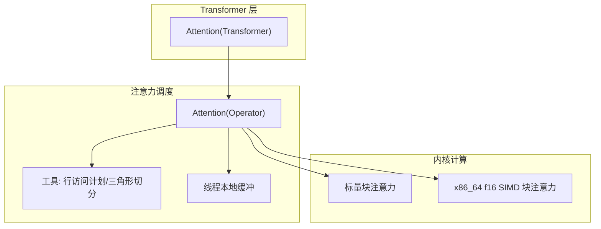
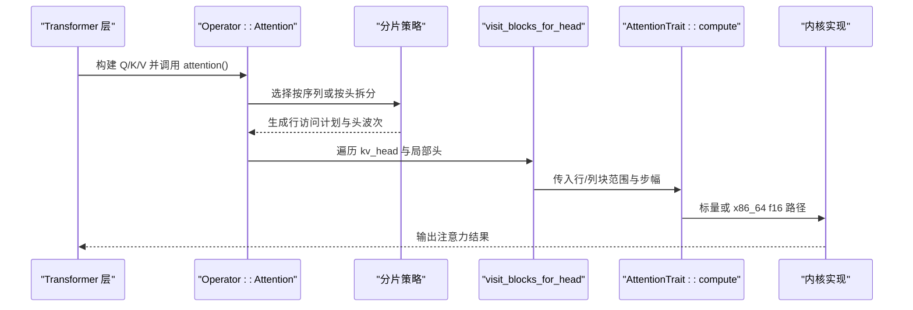
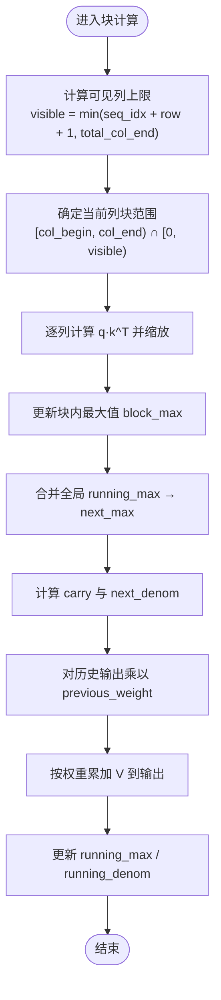
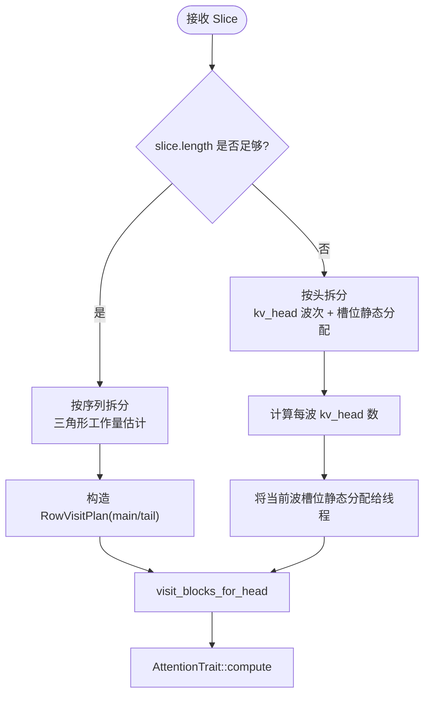
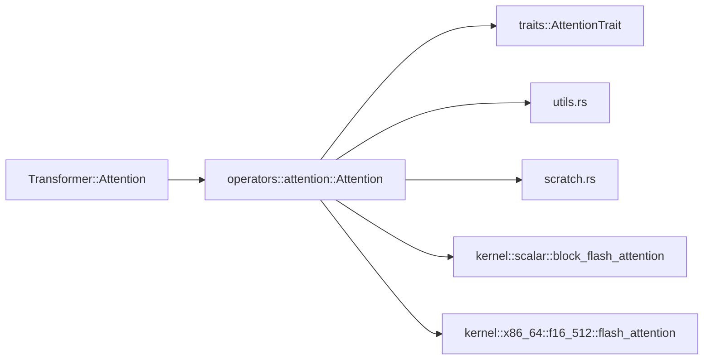

# 注意力机制实现

<cite>
**本文引用的文件**   
- [attention.rs](file://src/operators/attention/attention.rs)
- [compute.rs](file://src/operators/attention/compute.rs)
- [block_flash_attention.rs](file://src/kernel/scalar/block_flash_attention.rs)
- [flash_attention.rs](file://src/kernel/x86_64/f16_512/flash_attention.rs)
- [utils.rs](file://src/operators/attention/utils.rs)
- [scratch.rs](file://src/operators/attention/scratch.rs)
- [linear.rs](file://src/operators/traits/linear.rs)
- [attention.md](file://docs/design/operators/attention.md)
- [attention.rs（transformer）](file://src/transformer/attention.rs)
- [operator.rs](file://src/operators/operator.rs)
</cite>

## 目录
1. [简介](#简介)
2. [项目结构](#项目结构)
3. [核心组件](#核心组件)
4. [架构总览](#架构总览)
5. [详细组件分析](#详细组件分析)
6. [依赖关系分析](#依赖关系分析)
7. [性能考量](#性能考量)
8. [故障排查指南](#故障排查指南)
9. [结论](#结论)
10. [附录](#附录)

## 简介
本技术文档聚焦 eLLM 中的注意力机制实现，覆盖多头注意力的数学原理、缩放点积与在线稳定 softmax 的块级实现、KV 缓存组织与访问模式、注意力掩码（因果上三角）处理、长序列支持策略、线程静态并行划分、SIMD 优化路径，以及算子接口与使用示例。同时说明当前对 Flash Attention 类变体的支持现状与扩展方向。

## 项目结构
eLLM 的注意力实现由“高层 Transformer 层”、“注意力调度与分片”、“内核计算（标量与 x86_64 SIMD）”三部分组成：
- 高层 Transformer 层负责 Q/K/V/O 投影、维度变换与残差融合，并调用底层注意力算子。
- 注意力调度与分片负责将外部任务切片（SequenceSlice）映射到线程与头维度的静态分配，选择按序列或按头的拆分策略。
- 内核计算提供块级注意力内核，默认走标量路径，在具备 AVX512FP16 时启用 f16 专用路径。

图示来源
- [attention.rs（transformer）:92-209](file://src/transformer/attention.rs#L92-L209)
- [attention.rs:438-505](file://src/operators/attention/attention.rs#L438-L505)
- [utils.rs:40-61](file://src/operators/attention/utils.rs#L40-L61)
- [scratch.rs:19-73](file://src/operators/attention/scratch.rs#L19-L73)
- [compute.rs:10-62](file://src/operators/attention/compute.rs#L10-L62)
- [block_flash_attention.rs:5-95](file://src/kernel/scalar/block_flash_attention.rs#L5-L95)
- [flash_attention.rs:142-210](file://src/kernel/x86_64/f16_512/flash_attention.rs#L142-L210)

章节来源
- [attention.rs（transformer）:92-209](file://src/transformer/attention.rs#L92-L209)
- [attention.rs:438-505](file://src/operators/attention/attention.rs#L438-L505)
- [attention.md:46-104](file://docs/design/operators/attention.md#L46-L104)

## 核心组件
- 注意力算子结构体：封装 Q/K/V 指针、步长、head 数、缩放因子、分块粒度、解码标志与线程数，并提供 run 入口。
- 注意力特性接口：定义 compute 签名，供不同数据类型与硬件路径实现。
- 线程本地缓冲：为每个线程分配 running_max、running_denom、scores 等临时空间，避免跨线程竞争。
- 工具函数：基于下三角工作量的三角形切分，保证长序列场景下的负载均衡；行访问计划将主对齐段与尾部非对齐段分离。
- 内核实现：
  - 标量路径：通用 block_flash_attention，逐行维护运行最大值与归一化分母，支持任意 head_size。
  - x86_64 f16 路径：在 AVX512FP16 可用时启用，利用向量乘加与预取提升吞吐。

章节来源
- [attention.rs:14-143](file://src/operators/attention/attention.rs#L14-L143)
- [linear.rs:1-22](file://src/operators/traits/linear.rs#L1-L22)
- [scratch.rs:19-73](file://src/operators/attention/scratch.rs#L19-L73)
- [utils.rs:40-61](file://src/operators/attention/utils.rs#L40-L61)
- [compute.rs:10-62](file://src/operators/attention/compute.rs#L10-L62)
- [block_flash_attention.rs:5-95](file://src/kernel/scalar/block_flash_attention.rs#L5-L95)
- [flash_attention.rs:142-210](file://src/kernel/x86_64/f16_512/flash_attention.rs#L142-L210)

## 架构总览
从高层到低层的调用链如下：
- Transformer 层完成 Q/K/V 投影与维度重排后，调用 Tensor::attention，最终进入 Operator::Attention::run。
- run 根据 slice.length 与 row_step 决定“按序列拆分”或“按头拆分”，随后遍历 kv_head 与局部头，调用 visit_blocks_for_head。
- visit_blocks_for_head 通过 RowVisitPlan 将行范围拆分为 main/tail，再按列块 col_step 迭代，调用 AttentionTrait::compute。
- compute 在 f16 且目标支持 AVX512FP16 时走 x86_64 路径，否则走标量路径。

图示来源
- [attention.rs（transformer）:162-171](file://src/transformer/attention.rs#L162-L171)
- [attention.rs:438-505](file://src/operators/attention/attention.rs#L438-L505)
- [attention.rs:273-311](file://src/operators/attention/attention.rs#L273-L311)
- [compute.rs:64-129](file://src/operators/attention/compute.rs#L64-L129)
- [block_flash_attention.rs:5-95](file://src/kernel/scalar/block_flash_attention.rs#L5-L95)
- [flash_attention.rs:142-210](file://src/kernel/x86_64/f16_512/flash_attention.rs#L142-L210)

## 详细组件分析

### 数学原理与数值稳定性
- 缩放点积注意力：对每行 q 与 K 做内积并按 head_dim 开方倒数进行缩放，得到分数矩阵。
- 在线稳定 softmax：按列块增量更新 running_max 与 running_denom，避免直接 exp 溢出；权重按 (score - next_max).exp()/next_denom 计算，并对历史输出乘以 carry/next_denom 以合并前序块贡献。
- 因果掩码：每行的可见列上限为 min(next_sequence_index + row + 1, total_col_end)，天然屏蔽未来 token。

图示来源
- [block_flash_attention.rs:35-95](file://src/kernel/scalar/block_flash_attention.rs#L35-L95)
- [attention.md:356-371](file://docs/design/operators/attention.md#L356-L371)

章节来源
- [block_flash_attention.rs:5-95](file://src/kernel/scalar/block_flash_attention.rs#L5-L95)
- [attention.md:356-371](file://docs/design/operators/attention.md#L356-L371)

### 查询、键、值矩阵的计算过程
- Transformer 层内部通过 matmul3 一次性完成 Q/K/V 投影，并可选择性应用 Q/K 归一化与位置编码融合。
- 随后将 K/V 视图置换为便于 KV 缓存访问的形状，并将 Q 保持为按 head 连续布局，以便后续注意力计算。
- 最后调用 attention 算子，传入 scaling=1/sqrt(head_dim)。

章节来源
- [attention.rs（transformer）:107-171](file://src/transformer/attention.rs#L107-L171)

### 多线程静态并行与分片策略
- 最小任务单元为 SequenceSlice（一个 batch 内的连续 token 区间）。
- 当 slice.length 足够大时，采用“按序列拆分”：基于下三角工作量估计，将行区间按 thread_id 静态切分，保证负载均衡；主对齐段与尾部非对齐段分别处理。
- 当 slice.length 较短时，采用“按头拆分”：以 kv_head 为波次推进，激活最少 kv_head 数量以覆盖所有线程，再将当前波次的扁平化 (kv_head, local_head) 槽位静态分配给线程。

图示来源
- [attention.rs:438-505](file://src/operators/attention/attention.rs#L438-L505)
- [attention.rs:314-436](file://src/operators/attention/attention.rs#L314-L436)
- [utils.rs:40-61](file://src/operators/attention/utils.rs#L40-L61)
- [attention.md:136-215](file://docs/design/operators/attention.md#L136-L215)

章节来源
- [attention.rs:438-505](file://src/operators/attention/attention.rs#L438-L505)
- [utils.rs:40-61](file://src/operators/attention/utils.rs#L40-L61)
- [attention.md:136-215](file://docs/design/operators/attention.md#L136-L215)

### KV 缓存机制与内存管理
- 存储布局：K/V 以 [batch × head × seq] 的步长组织，注意力算子通过 k_batch_stride/k_seq_stride/v_batch_stride/v_seq_stride 精确寻址，适配 GQA 共享 KV head 的结构。
- 访问模式：优先顺序遍历同一 kv_head 的全部 token，最大化时间/空间局部性，利于 CPU L3 缓存命中。
- 写入时机：KV 缓存的更新发生在 Q/K/V 投影阶段（matmul3），注意力仅读取已更新的 KV。

章节来源
- [attention.rs:14-37](file://src/operators/attention/attention.rs#L14-L37)
- [attention.md:46-104](file://docs/design/operators/attention.md#L46-L104)
- [operator.rs:503-545](file://src/operators/operator.rs#L503-L545)

### 注意力掩码与长序列支持
- 掩码语义：在块级内核中按行计算可见列上限，隐式实现上三角掩码，无需显式 mask 矩阵。
- 长序列：通过“按序列拆分”的三角形工作量估计，使长序列在不同线程间近似均衡；结合 row_step×col_step 的二维块遍历，减少访存压力。

章节来源
- [attention.md:356-371](file://docs/design/operators/attention.md#L356-L371)
- [attention.rs:157-215](file://src/operators/attention/attention.rs#L157-L215)

### SIMD 指令集与性能优化
- 标量路径：通用 block_flash_attention，适用于任意 head_size 与数据类型。
- x86_64 f16 路径：在目标支持 AVX512FP16 时启用，使用 _mm512_* 系列指令进行向量化乘加与批量存储，并在循环前后插入预取提示以降低延迟。
- 运行时切换：compute.rs 根据编译期 target_feature 自动选择最优路径。

章节来源
- [compute.rs:64-129](file://src/operators/attention/compute.rs#L64-L129)
- [flash_attention.rs:1-93](file://src/kernel/x86_64/f16_512/flash_attention.rs#L1-L93)

### 接口定义与使用示例
- 接口定义：AttentionTrait<T>::compute 定义了注意力块计算的统一签名，包含行/列块边界、步长、running_max/denom/scores 等参数。
- 使用示例：
  - Transformer 层：通过 attention.rs（transformer）中的 forward 流程，完成 Q/K/V 投影、视图变换与 attention 调用。
  - 测试集成：operator.rs 中的单元测试展示了如何构造 Attention 算子、准备 Q/K/V 缓冲区、组装 SequenceSlice 列表并通过调度器执行。

章节来源
- [linear.rs:1-22](file://src/operators/traits/linear.rs#L1-L22)
- [attention.rs（transformer）:162-171](file://src/transformer/attention.rs#L162-L171)
- [operator.rs:503-545](file://src/operators/operator.rs#L503-L545)

### 不同注意力变体支持情况
- 当前实现：以“块级在线稳定 softmax”为核心，属于 Flash Attention 思想的一种简化实现（分块、数值稳定、避免全量 score 矩阵）。
- 尚未实现：完整的 Flash Attention 2/3 的 tile 级融合、寄存器级持久化与更激进的访存裁剪。
- 可扩展方向：在现有 block_flash_attention 基础上引入更细粒度的 tile 划分、更多寄存器状态与更激进的预取策略，逐步逼近 FA2 的性能。

章节来源
- [attention.md:17-18](file://docs/design/operators/attention.md#L17-L18)
- [block_flash_attention.rs:5-95](file://src/kernel/scalar/block_flash_attention.rs#L5-L95)

## 依赖关系分析
- 高层依赖：Transformer 层依赖 operators::attention 模块提供的 Attention 算子。
- 算子依赖：Attention 依赖 traits::AttentionTrait 与 scratch/utils 工具，以及 kernel 层的具体实现。
- 内核分支：compute.rs 根据目标平台特性选择标量或 x86_64 f16 路径。

图示来源
- [attention.rs（transformer）:162-171](file://src/transformer/attention.rs#L162-L171)
- [attention.rs:438-505](file://src/operators/attention/attention.rs#L438-L505)
- [compute.rs:64-129](file://src/operators/attention/compute.rs#L64-L129)

章节来源
- [attention.rs（transformer）:162-171](file://src/transformer/attention.rs#L162-L171)
- [compute.rs:64-129](file://src/operators/attention/compute.rs#L64-L129)

## 性能考量
- 数据布局与局部性：KV 按 head 顺序访问，有利于 CPU L3 缓存复用；Q 按 head 连续布局，减少跨头跳转。
- 分块粒度：row_step=1、col_step=8 在当前实现中平衡了访存与计算密度；可根据具体模型 head_dim 与批大小调优。
- 线程分配：短序列场景下按头拆分能显著提升核心利用率；长序列场景下三角形切分保证负载均衡。
- SIMD 加速：在 AVX512FP16 平台上，f16 路径可显著降低访存带宽压力与算术延迟。
- 预取与融合：x86_64 路径使用预取提示与 FMA 指令，减少流水线停顿。

章节来源
- [attention.md:291-332](file://docs/design/operators/attention.md#L291-L332)
- [flash_attention.rs:1-93](file://src/kernel/x86_64/f16_512/flash_attention.rs#L1-L93)

## 故障排查指南
- 输出异常或 NaN：检查 running_max 初始化是否为负无穷，确保 next_max 合并逻辑正确；验证 scores 与 denom 的更新顺序。
- 因果掩码失效：确认 visible_col_end 计算是否正确，避免越界访问未来 token。
- 性能不达预期：核对是否启用了 AVX512FP16 路径；检查 col_step 与 row_step 是否与硬件匹配；观察 KV 缓存命中率与线程占用率。
- 多线程结果不一致：确认线程本地缓冲未发生越界；确保每个线程的 running_max/denom/scores 独立且清零。

章节来源
- [block_flash_attention.rs:35-95](file://src/kernel/scalar/block_flash_attention.rs#L35-L95)
- [scratch.rs:75-91](file://src/operators/attention/scratch.rs#L75-L91)

## 结论
eLLM 的注意力实现以“块级在线稳定 softmax”为核心，结合 GQA 张量布局与静态并行策略，在 CPU 平台上实现了良好的吞吐与内存局部性。当前路径已涵盖长序列支持与因果掩码，且在 AVX512FP16 平台上具备 f16 专用加速。未来可在现有块级内核基础上引入更激进的 tile 级融合与寄存器持久化，逐步接近 Flash Attention 2/3 的性能表现。

## 附录
- 术语
  - GQA：分组查询注意力，多个 Q head 共享一个 KV head。
  - 在线稳定 softmax：按块增量更新 running_max 与 running_denom，避免数值溢出。
  - 块级注意力：将行/列划分为小块，逐块计算并累积结果。
- 参考路径
  - 接口定义：[linear.rs:1-22](file://src/operators/traits/linear.rs#L1-L22)
  - 算子入口：[attention.rs:438-505](file://src/operators/attention/attention.rs#L438-L505)
  - 标量内核：[block_flash_attention.rs:5-95](file://src/kernel/scalar/block_flash_attention.rs#L5-L95)
  - f16 SIMD 内核：[flash_attention.rs:142-210](file://src/kernel/x86_64/f16_512/flash_attention.rs#L142-L210)
  - 设计文档：[attention.md:1-390](file://docs/design/operators/attention.md#L1-L390)