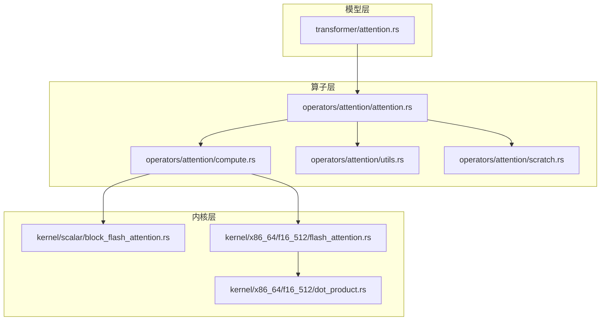
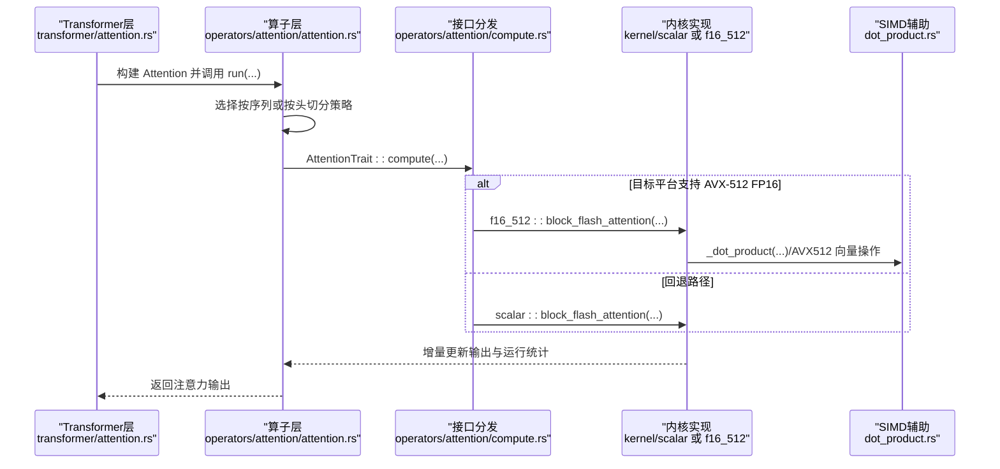
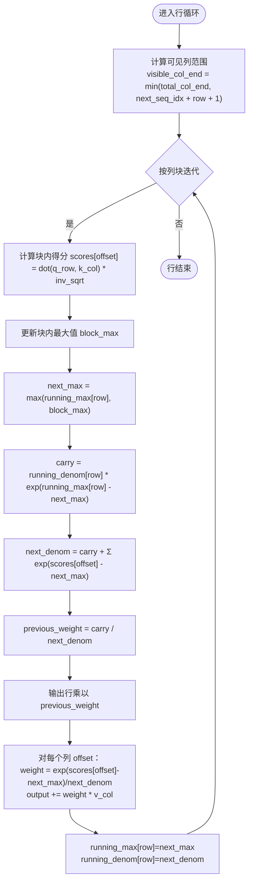
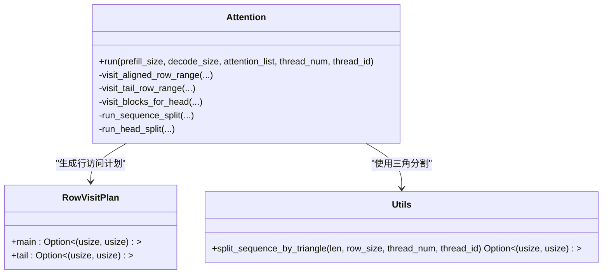
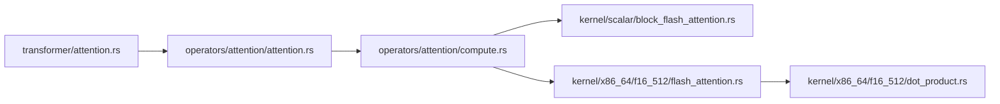

# 注意力计算内核

<cite>
**本文引用的文件**   
- [attention.rs](file://src/operators/attention/attention.rs)
- [compute.rs](file://src/operators/attention/compute.rs)
- [block_flash_attention.rs](file://src/kernel/scalar/block_flash_attention.rs)
- [flash_attention.rs](file://src/kernel/x86_64/f16_512/flash_attention.rs)
- [dot_product.rs](file://src/kernel/x86_64/f16_512/dot_product.rs)
- [utils.rs](file://src/operators/attention/utils.rs)
- [scratch.rs](file://src/operators/attention/scratch.rs)
- [attention.rs](file://src/transformer/attention.rs)
- [README.md](file://README.md)
</cite>

## 目录
1. [简介](#简介)
2. [项目结构](#项目结构)
3. [核心组件](#核心组件)
4. [架构总览](#架构总览)
5. [详细组件分析](#详细组件分析)
6. [依赖关系分析](#依赖关系分析)
7. [性能考量](#性能考量)
8. [故障排查指南](#故障排查指南)
9. [结论](#结论)
10. [附录](#附录)

## 简介
本技术文档聚焦于缩放点积注意力（Scaled Dot-Product Attention）的内核实现，系统阐述其数学公式、分块与并行策略、数值稳定性处理、掩码支持方式、KV 缓存的存储格式与增量更新机制，以及 SIMD 指令集优化细节。同时结合仓库中的实际代码路径，给出可追溯的实现说明与可视化图示，帮助读者从高层到代码级全面理解注意力计算内核的设计与优化要点。

## 项目结构
注意力计算内核在项目中分层组织：
- 算子接口与调度：位于 operators/attention 下，负责将高层调用映射到具体内核实现，并管理线程与分块访问计划。
- 标量内核：kernel/scalar 提供通用、可移植的 block flash attention 实现，保证正确性与数值稳定性。
- x86_64 加速内核：kernel/x86_64/f16_512 针对 AVX-512 FP16 进行向量化优化；AMX 相关内核主要覆盖 GEMM 等算子，当前注意力内核未直接启用 AMX 路径。
- Transformer 层集成：transformer/attention 将注意力算子嵌入模型前向流程，完成 Q/K/V 投影、重排与输出组合。

**图表来源** 
- [attention.rs:1-120](file://src/operators/attention/attention.rs#L1-L120)
- [compute.rs:1-62](file://src/operators/attention/compute.rs#L1-L62)
- [block_flash_attention.rs:1-95](file://src/kernel/scalar/block_flash_attention.rs#L1-L95)
- [flash_attention.rs:142-210](file://src/kernel/x86_64/f16_512/flash_attention.rs#L142-L210)
- [dot_product.rs:1-59](file://src/kernel/x86_64/f16_512/dot_product.rs#L1-L59)
- [attention.rs:92-171](file://src/transformer/attention.rs#L92-L171)

**章节来源**
- [attention.rs:1-120](file://src/operators/attention/attention.rs#L1-L120)
- [compute.rs:1-62](file://src/operators/attention/compute.rs#L1-L62)
- [block_flash_attention.rs:1-95](file://src/kernel/scalar/block_flash_attention.rs#L1-L95)
- [flash_attention.rs:142-210](file://src/kernel/x86_64/f16_512/flash_attention.rs#L142-L210)
- [dot_product.rs:1-59](file://src/kernel/x86_64/f16_512/dot_product.rs#L1-L59)
- [attention.rs:92-171](file://src/transformer/attention.rs#L92-L171)

## 核心组件
- Attention<T> 结构体：封装 Q/K/V 指针、步长、头数、序列长度、行/列分块大小、解码模式标志、线程数与每线程 scratch 缓冲。提供 run 入口，按 slice 列表遍历批次，选择“按序列切分”或“按头切分”的执行策略。
- AttentionTrait 与 compute：为不同数据类型（f16/f32）分发到对应内核实现；f16 在具备 AVX-512 FP16 时走 f16_512 路径，否则回退至标量路径。
- Block Flash Attention 内核：以列块为单位增量更新 running_max 与 running_denom，避免一次性 softmax 导致的溢出风险，并在每个块内对输出进行加权合并。
- 行访问计划与工具：基于三角分布的行范围划分，确保因果掩码下的负载平衡；tail 行单独处理以保证对齐边界。
- Scratch 缓冲：为每个线程分配 running_max、running_denom、scores 缓冲区，避免跨线程竞争与重复分配。

**章节来源**
- [attention.rs:13-143](file://src/operators/attention/attention.rs#L13-L143)
- [compute.rs:10-130](file://src/operators/attention/compute.rs#L10-L130)
- [block_flash_attention.rs:5-95](file://src/kernel/scalar/block_flash_attention.rs#L5-L95)
- [utils.rs:1-61](file://src/operators/attention/utils.rs#L1-L61)
- [scratch.rs:1-92](file://src/operators/attention/scratch.rs#L1-L92)

## 架构总览
注意力计算的整体数据流如下：
- 上层 transformer/attention 完成 Q/K/V 投影与张量重排后，调用 operators/attention::Attention::run。
- run 根据序列长度与线程数选择执行策略：当序列较短且线程较多时采用“按头切分”，否则采用“按序列切分”。
- 对于每个 head 与行块，调用 AttentionTrait::compute，内部再路由到具体内核实现（标量或 AVX-512）。
- 内核逐列块计算 Q·K^T 得分，维护 running_max 与 running_denom，逐步累积 V 的加权和写入输出。

**图表来源** 
- [attention.rs:438-505](file://src/operators/attention/attention.rs#L438-L505)
- [compute.rs:64-130](file://src/operators/attention/compute.rs#L64-L130)
- [block_flash_attention.rs:5-95](file://src/kernel/scalar/block_flash_attention.rs#L5-L95)
- [flash_attention.rs:142-210](file://src/kernel/x86_64/f16_512/flash_attention.rs#L142-L210)
- [dot_product.rs:1-59](file://src/kernel/x86_64/f16_512/dot_product.rs#L1-L59)
- [attention.rs:162-171](file://src/transformer/attention.rs#L162-L171)

## 详细组件分析

### 缩放点积注意力的数学公式与实现
- 数学定义：对每个查询 q_i 与键 k_j 计算相似度 s_ij = (q_i · k_j) / sqrt(d)，随后对可见位置 j ≤ i 做 softmax 归一化得到权重 a_ij，最终输出 o_i = Σ_j a_ij v_j。
- 实现要点：
  - 缩放因子 inverse_sqrt_head 在计算前乘以，避免重复开方。
  - 使用 running_max 与 running_denom 对每个行 i 的 softmax 进行分块稳定累加，防止 exp 溢出。
  - 因果掩码通过 visible_col_end = min(total_col_end, next_sequence_index + row + 1) 控制每行的可见列范围。

**图表来源** 
- [block_flash_attention.rs:35-95](file://src/kernel/scalar/block_flash_attention.rs#L35-L95)

**章节来源**
- [block_flash_attention.rs:5-95](file://src/kernel/scalar/block_flash_attention.rs#L5-L95)

### 查询-键相似度计算的优化策略：分块与并行
- 分块策略：
  - 行分块：row_step 控制每次处理的行数，便于对齐与批量访存。
  - 列分块：col_step 控制每次处理的列块大小，减少内存带宽压力并提升缓存命中率。
- 并行策略：
  - 按序列切分：当序列较长时，使用 split_sequence_by_triangle 按三角工作负载均衡分配到各线程，适合自回归场景的因果掩码。
  - 按头切分：当序列较短且线程较多时，将多个 attention heads 分配到线程，提高吞吐。
- 行访问计划 RowVisitPlan：
  - main 区间处理对齐行，tail 区间处理剩余非对齐行，确保完整覆盖。

**图表来源** 
- [attention.rs:157-311](file://src/operators/attention/attention.rs#L157-L311)
- [utils.rs:40-61](file://src/operators/attention/utils.rs#L40-L61)

**章节来源**
- [attention.rs:157-311](file://src/operators/attention/attention.rs#L157-L311)
- [utils.rs:1-61](file://src/operators/attention/utils.rs#L1-L61)

### Softmax 归一化的数值稳定性与溢出保护
- 关键技巧：
  - 在每个列块中先计算 block_max，并与上一块的 running_max 比较得到 next_max。
  - 使用 carry = running_denom * exp(running_max - next_max) 将上一块的贡献迁移到新的尺度。
  - 新块的 denom 由 carry 与新块 exp(scores - next_max) 之和构成，避免直接对大值求 exp。
- 效果：有效抑制 exp 溢出，保持数值稳定，适用于任意长度的上下文。

**章节来源**
- [block_flash_attention.rs:64-93](file://src/kernel/scalar/block_flash_attention.rs#L64-L93)

### 注意力掩码的实现与类型支持
- 因果掩码：
  - 通过 visible_col_end = min(total_col_end, next_sequence_index + row + 1) 限制每行仅关注历史位置。
  - 行访问计划与三角分割共同确保因果约束下的负载均衡。
- 填充掩码：
  - 当前实现未显式引入填充掩码逻辑；如需支持，可在 scores 计算阶段对无效位置置为负无穷，或在 softmax 阶段忽略对应项。
- 滑动窗口/其他掩码：
  - 可通过调整 visible_col_end 的上界来模拟滑动窗口；但需确保与分块策略兼容。

**章节来源**
- [block_flash_attention.rs:35-41](file://src/kernel/scalar/block_flash_attention.rs#L35-L41)
- [attention.rs:174-180](file://src/operators/attention/attention.rs#L174-L180)

### KV 缓存的存储格式与增量更新机制
- 存储布局：
  - K/V 采用 batch × head × sequence × head_dim 的维度优先布局，stride 参数明确指定各维步长，便于逐 head 顺序访问以提升 CPU L3 缓存命中。
- 增量更新：
  - 在自回归解码阶段，decode_only_flag 用于区分预填充与解码路径；KV 缓存按 next_sequence_index 指向的新位置追加写入。
  - 上层 matmul3 在生成 K/V 后将结果写入缓存，后续注意力计算读取已更新的 KV 片段。
- 访问局部性：
  - 逐 head 顺序计算使单个 head 的 KV 长期驻留于缓存，显著提升时间/空间局部性。

**章节来源**
- [attention.rs:107-171](file://src/transformer/attention.rs#L107-L171)
- [README.md:142-155](file://README.md#L142-L155)

### SIMD 指令集优化：AVX-512 与 AMX
- AVX-512 FP16：
  - f16_512 路径在目标平台支持 avx512fp16 时启用，使用 _mm512_* 系列指令进行向量加载、乘加与归约。
  - dot_product 使用 _mm512_fmadd_ph 与 _mm512_reduce_add_ph 高效计算点积。
  - 输出缩放与加权累加也采用 FMADD 融合指令减少中间存储。
- AMX：
  - 当前注意力内核未直接使用 AMX 路径；AMX 相关实现主要覆盖 GEMM 类算子（如 fused_gate_up_silu_mul_block、matmul_block），可作为未来扩展方向。

**章节来源**
- [compute.rs:64-130](file://src/operators/attention/compute.rs#L64-L130)
- [flash_attention.rs:1-93](file://src/kernel/x86_64/f16_512/flash_attention.rs#L1-L93)
- [dot_product.rs:1-59](file://src/kernel/x86_64/f16_512/dot_product.rs#L1-L59)

## 依赖关系分析
- 模块耦合：
  - operators/attention 依赖 kernel 层的具体实现，并通过 traits 抽象屏蔽底层差异。
  - transformer/attention 依赖 operators/attention 提供的 run 接口，完成端到端的前向计算。
- 外部依赖：
  - num_traits 提供 Exp、NegInfinity 等数值特性。
  - mem_mgr 提供对齐分配与内存池，保障高性能访存。
- 潜在循环依赖：
  - 当前结构清晰分层，未见明显循环依赖；若未来引入更多算子融合，需注意接口解耦。

**图表来源** 
- [attention.rs:162-171](file://src/transformer/attention.rs#L162-L171)
- [compute.rs:10-62](file://src/operators/attention/compute.rs#L10-L62)
- [block_flash_attention.rs:5-95](file://src/kernel/scalar/block_flash_attention.rs#L5-L95)
- [flash_attention.rs:142-210](file://src/kernel/x86_64/f16_512/flash_attention.rs#L142-L210)
- [dot_product.rs:1-59](file://src/kernel/x86_64/f16_512/dot_product.rs#L1-L59)

**章节来源**
- [attention.rs:162-171](file://src/transformer/attention.rs#L162-L171)
- [compute.rs:10-62](file://src/operators/attention/compute.rs#L10-L62)
- [block_flash_attention.rs:5-95](file://src/kernel/scalar/block_flash_attention.rs#L5-L95)
- [flash_attention.rs:142-210](file://src/kernel/x86_64/f16_512/flash_attention.rs#L142-L210)
- [dot_product.rs:1-59](file://src/kernel/x86_64/f16_512/dot_product.rs#L1-L59)

## 性能考量
- 内存局部性：
  - 逐 head 顺序计算与维度优先的 KV 布局显著提升 CPU L3 缓存命中率，降低带宽竞争。
- 分块与并行：
  - 合理设置 row_step 与 col_step 以匹配缓存行大小与向量宽度；在短序列多核场景下采用按头切分提升吞吐。
- 数值稳定性：
  - running_max/running_denom 的分块更新避免溢出，减少额外同步开销。
- 基准建议：
  - 在不同序列长度、batch size、head 数量与线程数下进行对比测试，记录 TTFT 与吞吐变化。
  - 对比 AVX-512 与标量路径的性能差异，评估目标平台特性检测与回退策略的有效性。

[本节为一般性指导，不直接分析具体文件]

## 故障排查指南
- 数值异常（NaN/Inf）：
  - 检查 running_max 初始化是否为负无穷，running_denom 初始化为零；确认 next_max 计算与 carry 更新逻辑。
- 掩码错误导致输出为零：
  - 核对 visible_col_end 的计算与 next_sequence_index 的设置；确保因果掩码边界正确。
- 性能不达预期：
  - 验证 row_step/col_step 是否与硬件缓存行和向量宽度匹配；检查是否启用了 AVX-512 FP16 路径。
- 多线程负载不均：
  - 确认 split_sequence_by_triangle 的三角分割是否正确；tail 行是否被正确处理。

**章节来源**
- [block_flash_attention.rs:64-93](file://src/kernel/scalar/block_flash_attention.rs#L64-L93)
- [utils.rs:40-61](file://src/operators/attention/utils.rs#L40-L61)
- [attention.rs:174-180](file://src/operators/attention/attention.rs#L174-L180)

## 结论
该注意力内核通过分块计算、稳定的 softmax 更新、因果掩码支持与高效的 SIMD 优化，在 CPU 平台上实现了高吞吐与低延迟的自回归推理能力。未来可考虑引入 AMX 路径以进一步提升 GEMM 密集阶段的性能，并结合更细粒度的掩码策略增强灵活性。

[本节为总结性内容，不直接分析具体文件]

## 附录
- 术语表：
  - Prefill：预填充阶段，处理完整输入序列。
  - Decode：解码阶段，逐个 token 生成。
  - KV 缓存：保存历史键值对以加速自回归生成。
- 参考路径：
  - 注意力算子入口：operators/attention/attention.rs
  - 内核实现：kernel/scalar/block_flash_attention.rs、kernel/x86_64/f16_512/flash_attention.rs
  - 模型集成：transformer/attention.rs

[本节为补充信息，不直接分析具体文件]