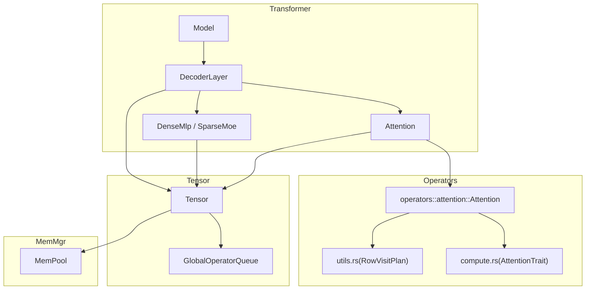
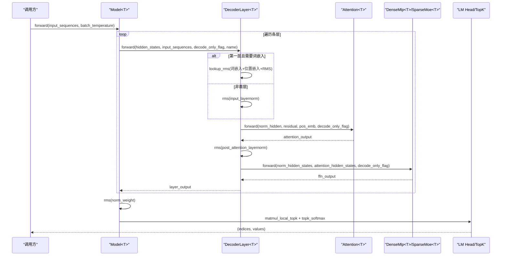
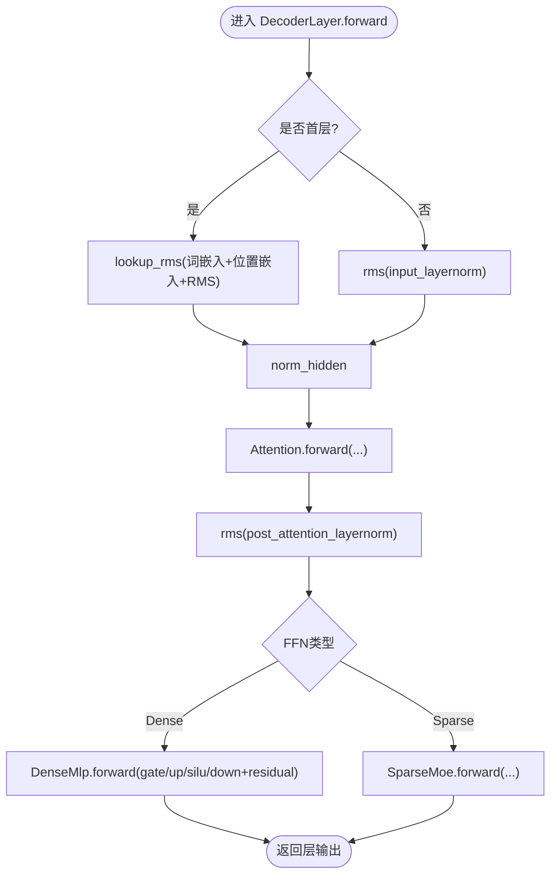
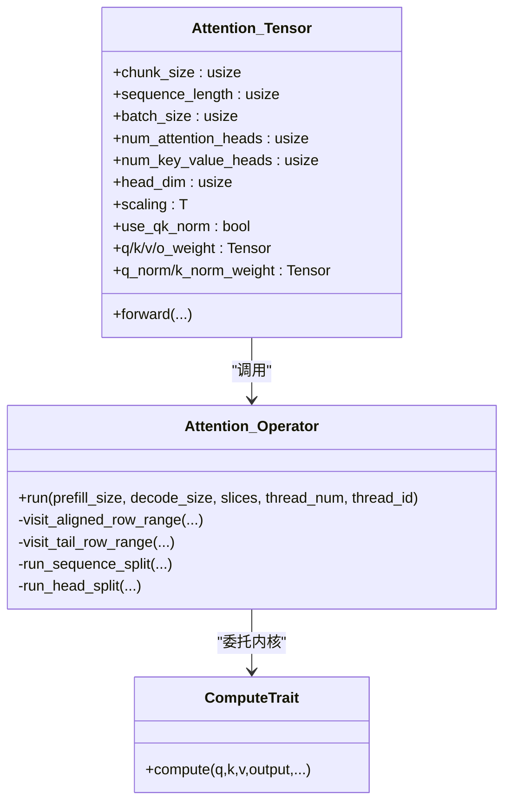
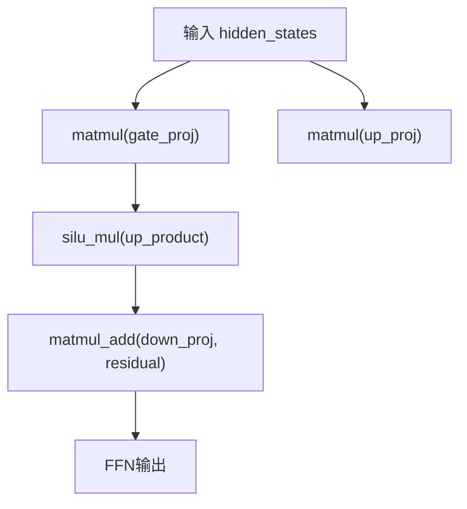
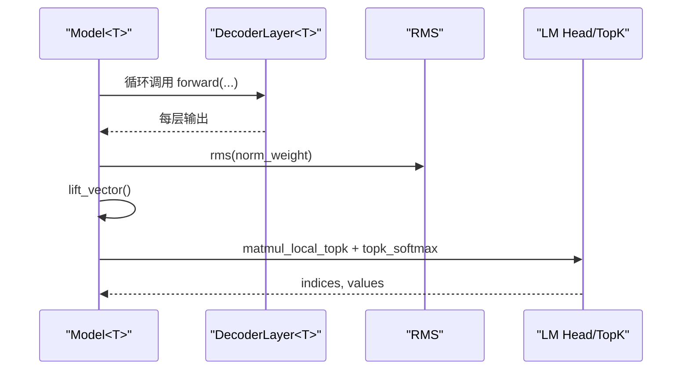
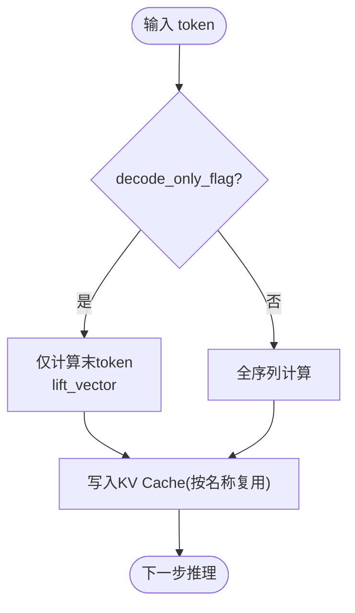
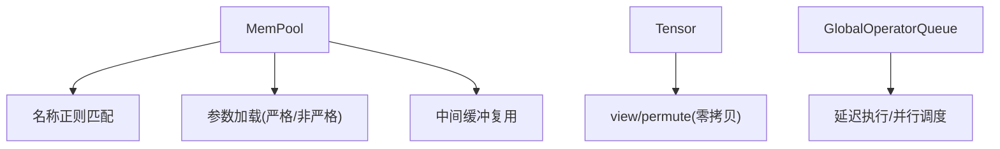
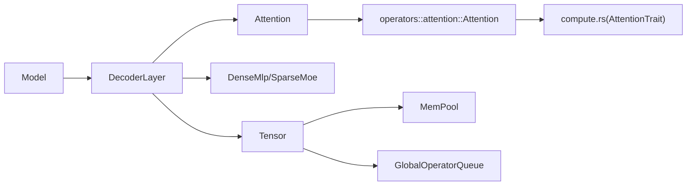

# 前向传播流程

<cite>
**本文引用的文件**   
- [decoder_layer.rs](file://src/transformer/decoder_layer.rs)
- [model.rs](file://src/transformer/model.rs)
- [attention.rs](file://src/transformer/attention.rs)
- [attention.rs（算子）](file://src/operators/attention/attention.rs)
- [compute.rs](file://src/operators/attention/compute.rs)
- [utils.rs](file://src/operators/attention/utils.rs)
- [dense_mlp.rs](file://src/transformer/dense_mlp.rs)
- [storage.rs](file://src/tensor/storage.rs)
- [queue.rs](file://src/tensor/queue.rs)
- [mem_pool.rs](file://src/mem_mgr/mem_pool.rs)
</cite>

## 目录
1. [简介](#简介)
2. [项目结构](#项目结构)
3. [核心组件](#核心组件)
4. [架构总览](#架构总览)
5. [详细组件分析](#详细组件分析)
6. [依赖关系分析](#依赖关系分析)
7. [性能考量](#性能考量)
8. [故障排查指南](#故障排查指南)
9. [结论](#结论)
10. [附录](#附录)

## 简介
本文件聚焦于解码器层的前向传播流程，系统性梳理从输入到输出的每一步计算、数据流向与内存管理策略。重点覆盖：
- 解码器层完整前向路径：RMS归一化、自注意力、残差连接、FFN（含 DenseMLP 与 SparseMoE）、输出拼接与最终 LM Head。
- 增量推理模式与解码模式的差异处理（decode_only_flag）。
- 中间结果缓存策略与 KV Cache 的持久化机制。
- 前向传播的性能瓶颈分析与优化技巧。
- 调试与可视化前向传播结果的方法。

## 项目结构
本项目采用分层组织方式：
- transformer 层：模型高层结构与模块组合（Model、DecoderLayer、Attention、DenseMlp/SparseMoe）。
- operators 层：具体算子实现（如 Attention 的并行分块与调度）。
- tensor 层：张量抽象、视图操作与全局算子队列。
- mem_mgr 层：内存池与参数分配策略。

图表来源
- [model.rs:174-251](file://src/transformer/model.rs#L174-L251)
- [decoder_layer.rs:152-230](file://src/transformer/decoder_layer.rs#L152-L230)
- [attention.rs:92-209](file://src/transformer/attention.rs#L92-L209)
- [attention.rs（算子）:439-505](file://src/operators/attention/attention.rs#L439-L505)
- [compute.rs:10-62](file://src/operators/attention/compute.rs#L10-L62)
- [utils.rs:40-61](file://src/operators/attention/utils.rs#L40-L61)
- [storage.rs:12-20](file://src/tensor/storage.rs#L12-L20)
- [queue.rs:12-18](file://src/tensor/queue.rs#L12-L18)
- [mem_pool.rs:309-427](file://src/mem_mgr/mem_pool.rs#L309-L427)

章节来源
- [model.rs:174-251](file://src/transformer/model.rs#L174-L251)
- [decoder_layer.rs:152-230](file://src/transformer/decoder_layer.rs#L152-L230)
- [attention.rs:92-209](file://src/transformer/attention.rs#L92-L209)
- [attention.rs（算子）:439-505](file://src/operators/attention/attention.rs#L439-L505)
- [compute.rs:10-62](file://src/operators/attention/compute.rs#L10-L62)
- [utils.rs:40-61](file://src/operators/attention/utils.rs#L40-L61)
- [storage.rs:12-20](file://src/tensor/storage.rs#L12-L20)
- [queue.rs:12-18](file://src/tensor/queue.rs#L12-L18)
- [mem_pool.rs:309-427](file://src/mem_mgr/mem_pool.rs#L309-L427)

## 核心组件
- Model<T>：组装多层 DecoderLayer，执行整体前向，并在最后进行 RMS 归一化与 TopK Softmax 采样。
- DecoderLayer<T>：单解码层，包含输入 RMS、自注意力、残差、后 RMS、FFN（DenseMLP 或 SparseMoE）。
- Attention<T>：封装 Q/K/V 投影、RoPE、注意力计算与 O 投影。
- DenseMlp<T>：门控线性单元（Gate/Up/Down）+ SiLU 融合 + 残差相加。
- Tensor<T>：零拷贝视图、步长与形状管理，配合全局内存池与算子队列。
- GlobalOperatorQueue：按类型（f32/f16）维护全局算子队列，延迟执行。
- MemPool<T>：基于名称正则的参数与中间缓冲复用，支持严格与非严格权重加载。

章节来源
- [model.rs:28-49](file://src/transformer/model.rs#L28-L49)
- [decoder_layer.rs:33-49](file://src/transformer/decoder_layer.rs#L33-L49)
- [attention.rs:13-32](file://src/transformer/attention.rs#L13-L32)
- [dense_mlp.rs:12-20](file://src/transformer/dense_mlp.rs#L12-20)
- [storage.rs:12-20](file://src/tensor/storage.rs#L12-L20)
- [queue.rs:12-18](file://src/tensor/queue.rs#L12-L18)
- [mem_pool.rs:88-93](file://src/mem_mgr/mem_pool.rs#L88-L93)

## 架构总览
下图展示从 Model 到 DecoderLayer、Attention、FFN 再到 LM Head 的整体前向调用链与关键分支点。

图表来源
- [model.rs:174-251](file://src/transformer/model.rs#L174-L251)
- [decoder_layer.rs:152-230](file://src/transformer/decoder_layer.rs#L152-L230)
- [attention.rs:92-209](file://src/transformer/attention.rs#L92-L209)
- [dense_mlp.rs:46-100](file://src/transformer/dense_mlp.rs#L46-L100)

## 详细组件分析

### 解码器层前向流程
- 输入预处理：
  - 首层：通过 lookup_rms 将 token 索引映射为词嵌入并叠加位置嵌入，再执行 RMS 归一化。
  - 非首层：对上一层输出执行 RMS 归一化作为注意力输入。
- 自注意力：
  - 使用 matmul3 合并 Q/K/V 投影与可选 Q/K 归一化，同时应用 RoPE。
  - 在 decode_only_flag 为真时，对当前 token 做 lift_vector 以适配后续算子。
  - 重排 K/V 维度后进行注意力计算，得到上下文向量。
  - 经 O 投影并与残差相加，得到注意力输出。
- FFN：
  - DenseMLP：Gate/Up 两路线性 + SiLU 融合 + Down 线性 + 残差相加。
  - SparseMoE：路由选择专家并聚合（此处不展开细节）。
- 输出：返回 FFN 的输出作为该层结果。

图表来源
- [decoder_layer.rs:152-230](file://src/transformer/decoder_layer.rs#L152-L230)
- [attention.rs:92-209](file://src/transformer/attention.rs#L92-L209)
- [dense_mlp.rs:46-100](file://src/transformer/dense_mlp.rs#L46-L100)

章节来源
- [decoder_layer.rs:152-230](file://src/transformer/decoder_layer.rs#L152-L230)
- [attention.rs:92-209](file://src/transformer/attention.rs#L92-L209)
- [dense_mlp.rs:46-100](file://src/transformer/dense_mlp.rs#L46-L100)

### 自注意力内部计算与增量推理
- Q/K/V 生成与缩放：
  - 通过 matmul3 一次性完成 Q/K/V 投影与可选 Q/K 归一化，并注入位置信息（RoPE）。
- 维度变换与访问布局：
  - 将 Q/K/V 重塑为 [batch, head_num/group, seq_len, head_dim] 以便逐头顺序计算。
- 增量推理（decode_only_flag=true）：
  - 仅计算最后一个 token 的注意力，KV 历史通过内存池持久化，避免重复计算。
  - 使用 lift_vector 将标量 token 提升为批内行，便于后续算子统一处理。
- 并行与分块：
  - 根据 row_step 与 col_step 划分主块与尾部块，按三角形任务分布平衡负载。
  - 支持“序列切分”和“头切分”两种并行策略，依据长度与线程数自适应选择。

图表来源
- [attention.rs:92-209](file://src/transformer/attention.rs#L92-L209)
- [attention.rs（算子）:439-505](file://src/operators/attention/attention.rs#L439-L505)
- [compute.rs:10-62](file://src/operators/attention/compute.rs#L10-L62)

章节来源
- [attention.rs:92-209](file://src/transformer/attention.rs#L92-L209)
- [attention.rs（算子）:439-505](file://src/operators/attention/attention.rs#L439-L505)
- [compute.rs:10-62](file://src/operators/attention/compute.rs#L10-L62)

### FFN（DenseMLP）前向
- Gate/Up 两路线性映射，随后进行 SiLU 融合激活。
- Down 线性映射并将残差相加，得到 FFN 输出。
- 所有矩阵乘法均通过 MatMulParams 指定宏/微步长以提升缓存命中与吞吐。

图表来源
- [dense_mlp.rs:46-100](file://src/transformer/dense_mlp.rs#L46-L100)

章节来源
- [dense_mlp.rs:46-100](file://src/transformer/dense_mlp.rs#L46-L100)

### 模型顶层与前向收尾
- 逐层累积隐藏状态，最后一层之后执行全局 RMS 归一化。
- 将 last prefill token 的归一化结果提升到批维度，确保 TopK 处理正确。
- 执行 LM Head 局部 TopK 矩阵乘与 softmax 采样，返回 token 索引与概率值。

图表来源
- [model.rs:174-251](file://src/transformer/model.rs#L174-L251)

章节来源
- [model.rs:174-251](file://src/transformer/model.rs#L174-L251)

### 增量推理与解码模式差异
- decode_only_flag 控制：
  - 在 Attention 中：当为真时，仅计算最后一个 token，并对中间结果进行 lift_vector。
  - 在 FFN 与 RMS 中：同样根据标志位调整计算范围与写入策略。
- KV Cache 持久化：
  - 通过内存池按名称规则复用 k_proj.output 与 v_proj.output，跨时间步保存历史键值。
  - 非严格模式下，缺失权重会分配零初始化缓冲；严格模式下缺失会报错。

图表来源
- [attention.rs:92-209](file://src/transformer/attention.rs#L92-L209)
- [mem_pool.rs:370-427](file://src/mem_mgr/mem_pool.rs#L370-L427)

章节来源
- [attention.rs:92-209](file://src/transformer/attention.rs#L92-L209)
- [mem_pool.rs:370-427](file://src/mem_mgr/mem_pool.rs#L370-L427)

### 中间结果缓存策略与内存管理
- 全局内存池 MemPool<T>：
  - 基于名称正则匹配复用参数与中间缓冲，减少重复分配。
  - 支持严格模式校验权重形状，非严格模式允许测试场景轻量运行。
  - 特殊处理 experts.* 子块拼接，使多专家权重共享连续内存。
- 张量视图与零拷贝：
  - Tensor<T> 提供 view/permute/transposition 等零拷贝操作，降低内存开销。
- 算子队列：
  - GlobalOperatorQueue 按数据类型维护全局队列，延迟批量执行，利于流水线与并行。

图表来源
- [mem_pool.rs:309-427](file://src/mem_mgr/mem_pool.rs#L309-L427)
- [storage.rs:126-149](file://src/tensor/storage.rs#L126-L149)
- [queue.rs:12-18](file://src/tensor/queue.rs#L12-L18)

章节来源
- [mem_pool.rs:309-427](file://src/mem_mgr/mem_pool.rs#L309-L427)
- [storage.rs:126-149](file://src/tensor/storage.rs#L126-L149)
- [queue.rs:12-18](file://src/tensor/queue.rs#L12-L18)

## 依赖关系分析
- 模块耦合：
  - Model 依赖 DecoderLayer，后者依赖 Attention 与 FFN。
  - Attention 依赖 operators::attention 中的并行实现与 compute trait。
  - Tensor 依赖内存池与算子队列。
- 外部依赖：
  - 数值特性（Exp/Sigmoid/Sqrt/NegInfinity）用于注意力与激活函数。
  - CPU 多线程与 SIMD 特性（如 AVX512FP16）用于加速路径选择。

图表来源
- [model.rs:174-251](file://src/transformer/model.rs#L174-L251)
- [decoder_layer.rs:152-230](file://src/transformer/decoder_layer.rs#L152-L230)
- [attention.rs:92-209](file://src/transformer/attention.rs#L92-L209)
- [attention.rs（算子）:439-505](file://src/operators/attention/attention.rs#L439-L505)
- [compute.rs:10-62](file://src/operators/attention/compute.rs#L10-L62)
- [storage.rs:12-20](file://src/tensor/storage.rs#L12-L20)
- [queue.rs:12-18](file://src/tensor/queue.rs#L12-L18)
- [mem_pool.rs:309-427](file://src/mem_mgr/mem_pool.rs#L309-L427)

章节来源
- [model.rs:174-251](file://src/transformer/model.rs#L174-L251)
- [decoder_layer.rs:152-230](file://src/transformer/decoder_layer.rs#L152-L230)
- [attention.rs:92-209](file://src/transformer/attention.rs#L92-L209)
- [attention.rs（算子）:439-505](file://src/operators/attention/attention.rs#L439-L505)
- [compute.rs:10-62](file://src/operators/attention/compute.rs#L10-L62)
- [storage.rs:12-20](file://src/tensor/storage.rs#L12-L20)
- [queue.rs:12-18](file://src/tensor/queue.rs#L12-L18)
- [mem_pool.rs:309-427](file://src/mem_mgr/mem_pool.rs#L309-L427)

## 性能考量
- 计算密集点：
  - 注意力 Q/K/V 投影与 O 投影、FFN 的三次线性映射。
  - 注意力 softmax 与数值稳定性（running_max/denom）。
- 内存访问局部性：
  - 逐头顺序计算与固定步长（row_step/col_step）提升 L3 命中率。
  - 视图与零拷贝减少额外内存搬运。
- 并行策略：
  - 根据长度与线程数选择“序列切分”或“头切分”，最大化吞吐。
  - 利用 SIMD 指令集（如 AVX512FP16）加速路径。
- 优化建议：
  - 合理设置 chunk_size 与 sequence_length，平衡批大小与缓存占用。
  - 在 decode_only_flag 下尽量复用 KV Cache，避免重复计算。
  - 调整 MatMulParams 宏/微步长以匹配硬件缓存层级。

[本节为通用性能讨论，无需特定文件引用]

## 故障排查指南
- 权重缺失或形状不匹配：
  - 严格模式下缺失权重会触发断言失败；检查参数加载与名称匹配。
- 算子未执行或结果异常：
  - 确认已调用 with_operator_queue 执行全局队列；检查线程数与切片列表。
- 增量推理结果不正确：
  - 检查 decode_only_flag 是否正确传递；确认 lift_vector 与 KV Cache 写入位置。
- 调试与可视化：
  - 使用环境变量 ELLM_ALIGN_TRACE 打印构建阶段日志。
  - 在测试中打印算子队列与中间张量形状，验证数据流一致性。

章节来源
- [mem_pool.rs:387-406](file://src/mem_mgr/mem_pool.rs#L387-L406)
- [model.rs:187-206](file://src/transformer/model.rs#L187-L206)
- [decoder_layer.rs:289-313](file://src/transformer/decoder_layer.rs#L289-L313)

## 结论
本文件系统梳理了 eLLM 解码器层的前向传播流程，涵盖从输入到输出的每一步计算、增量推理与解码模式差异、KV Cache 持久化与内存复用策略，以及性能优化与调试方法。通过模块化设计与高效的并行/缓存策略，系统在 CPU 平台上实现了良好的吞吐与延迟表现。

[本节为总结性内容，无需特定文件引用]

## 附录
- 术语表：
  - Prefill：初始提示词的一次性处理阶段。
  - Decode：增量生成阶段，每次只计算一个新 token。
  - KV Cache：自注意力的历史键值缓存，用于增量推理。
  - Lift Vector：将标量 token 提升为批内行，适配后续算子。

[本节为概念性说明，无需特定文件引用]