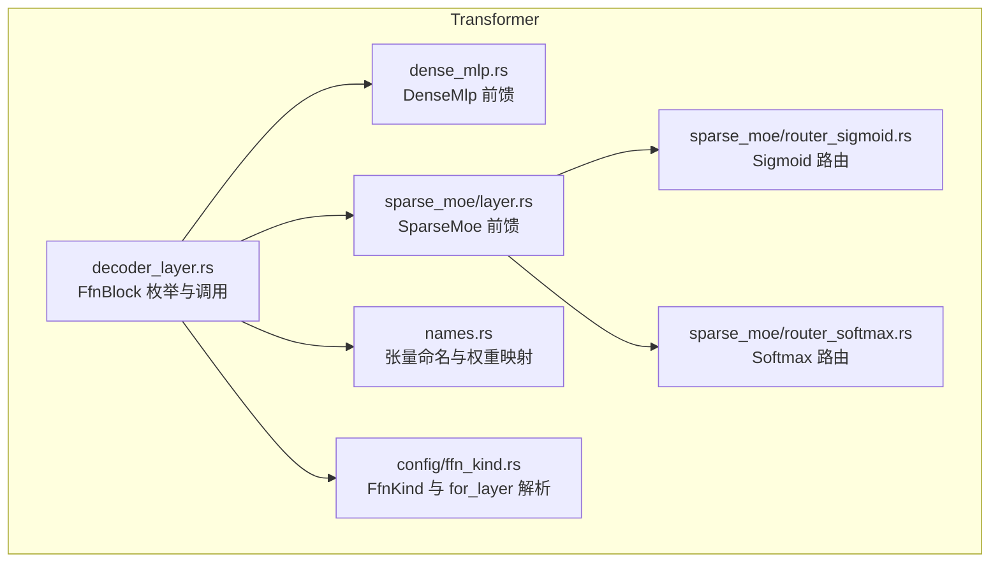
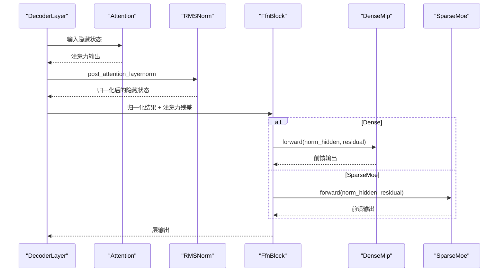
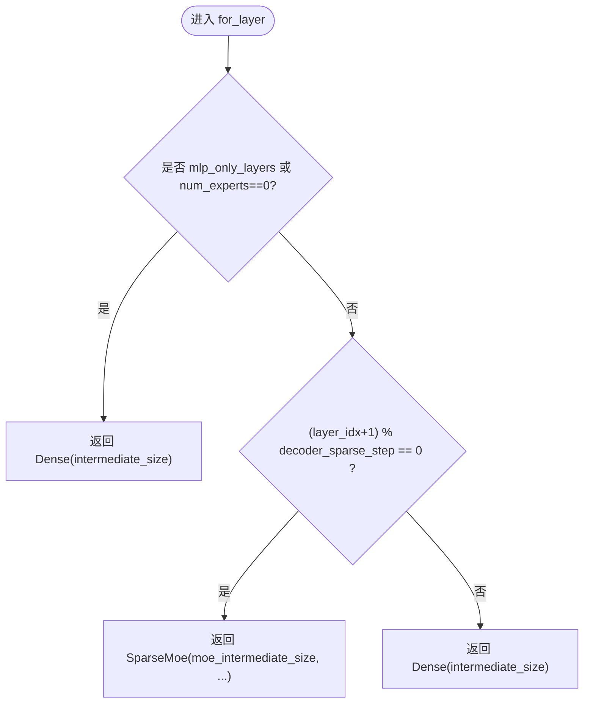
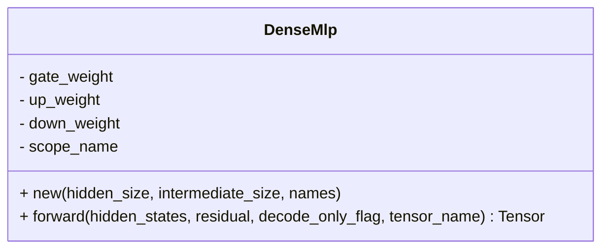
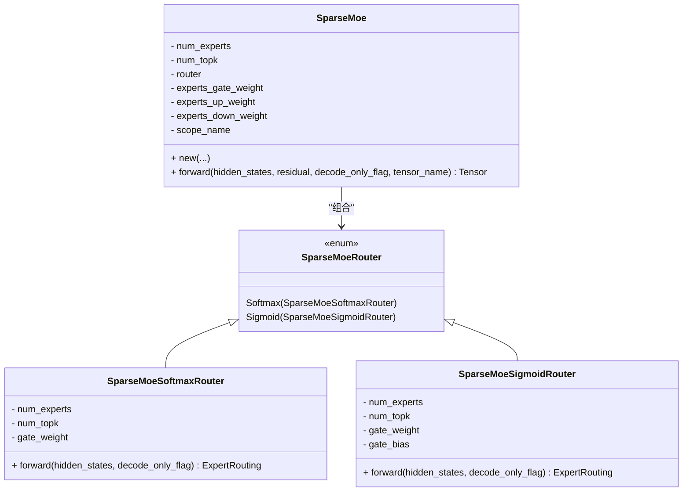
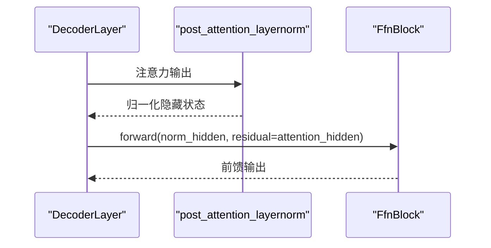
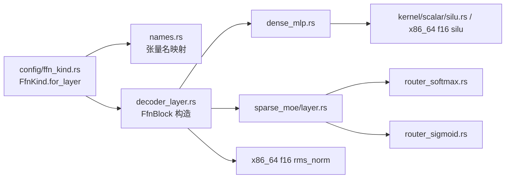

# 前馈网络块

<cite>
**本文引用的文件**   
- [src/transformer/config/ffn_kind.rs](file://src/transformer/config/ffn_kind.rs)
- [src/transformer/decoder_layer.rs](file://src/transformer/decoder_layer.rs)
- [src/transformer/dense_mlp.rs](file://src/transformer/dense_mlp.rs)
- [src/transformer/sparse_moe/mod.rs](file://src/transformer/sparse_moe/mod.rs)
- [src/transformer/sparse_moe/layer.rs](file://src/transformer/sparse_moe/layer.rs)
- [src/transformer/sparse_moe/router_sigmoid.rs](file://src/transformer/sparse_moe/router_sigmoid.rs)
- [src/transformer/sparse_moe/router_softmax.rs](file://src/transformer/sparse_moe/router_softmax.rs)
- [src/transformer/names.rs](file://src/transformer/names.rs)
- [src/kernel/scalar/silu.rs](file://src/kernel/scalar/silu.rs)
- [src/kernel/x86_64/f16_512/rms_norm.rs](file://src/kernel/x86_64/f16_512/rms_norm.rs)
- [src/kernel/x86_64/f16_512/silu.rs](file://src/kernel/x86_64/f16_512/silu.rs)
- [README.md](file://README.md)
</cite>

## 目录
1. [简介](#简介)
2. [项目结构](#项目结构)
3. [核心组件](#核心组件)
4. [架构总览](#架构总览)
5. [详细组件分析](#详细组件分析)
6. [依赖关系分析](#依赖关系分析)
7. [性能与复杂度](#性能与复杂度)
8. [故障排查指南](#故障排查指南)
9. [结论](#结论)
10. [附录：扩展自定义前馈网络](#附录：扩展自定义前馈网络)

## 简介
本文件聚焦于前馈网络块的实现与设计，系统梳理 FfnBlock 枚举的两种分支：Dense（密集前馈）与 SparseMoe（稀疏专家混合）。文档从结构差异、计算复杂度、内存占用、激活函数选择、权重初始化与归一化策略、与注意力模块的数据交互、性能对比与选型建议，以及扩展方法等维度进行深入解析，帮助读者快速理解并高效使用。

## 项目结构
前馈网络相关代码主要分布在 transformer 子模块中：
- 配置层：FfnKind 定义与按层解析逻辑
- 解码器层：FfnBlock 枚举与注意力-前馈数据流
- Dense 实现：门控双线性 + SiLU 融合的前馈
- Sparse MoE 实现：路由（Softmax/Sigmoid）+ TopK 选择 + 专家并行计算 + 合并相加

图表来源
- [src/transformer/decoder_layer.rs:99-128](file://src/transformer/decoder_layer.rs#L99-L128)
- [src/transformer/dense_mlp.rs:1-102](file://src/transformer/dense_mlp.rs#L1-L102)
- [src/transformer/sparse_moe/layer.rs:74-199](file://src/transformer/sparse_moe/layer.rs#L74-L199)
- [src/transformer/sparse_moe/router_sigmoid.rs:1-77](file://src/transformer/sparse_moe/router_sigmoid.rs#L1-L77)
- [src/transformer/sparse_moe/router_softmax.rs:1-84](file://src/transformer/sparse_moe/router_softmax.rs#L1-L84)
- [src/transformer/names.rs:97-124](file://src/transformer/names.rs#L97-L124)
- [src/transformer/config/ffn_kind.rs:30-58](file://src/transformer/config/ffn_kind.rs#L30-L58)

章节来源
- [src/transformer/decoder_layer.rs:99-128](file://src/transformer/decoder_layer.rs#L99-L128)
- [src/transformer/config/ffn_kind.rs:30-58](file://src/transformer/config/ffn_kind.rs#L30-L58)

## 核心组件
- FfnBlock 枚举：统一封装 Dense 与 SparseMoe 两种前馈实现，供 DecoderLayer 在运行时分发。
- DenseMlp：门控双线性（Gate/Up）经 SiLU 融合后，再与 Down 投影相加残差。
- SparseMoe：可插拔路由（Softmax/Sigmoid），TopK 选择专家，对选中专家进行并行前馈，最后按权重合并并与残差相加。

章节来源
- [src/transformer/decoder_layer.rs:24-30](file://src/transformer/decoder_layer.rs#L24-L30)
- [src/transformer/dense_mlp.rs:11-44](file://src/transformer/dense_mlp.rs#L11-L44)
- [src/transformer/sparse_moe/layer.rs:74-150](file://src/transformer/sparse_moe/layer.rs#L74-L150)

## 架构总览
DecoderLayer 在前向过程中先执行自注意力，随后将输出经 RMSNorm 送入 FfnBlock；FfnBlock 根据配置选择 Dense 或 SparseMoe 分支，最终输出与注意力残差相加得到层输出。

图表来源
- [src/transformer/decoder_layer.rs:152-230](file://src/transformer/decoder_layer.rs#L152-L230)
- [src/transformer/dense_mlp.rs:46-100](file://src/transformer/dense_mlp.rs#L46-L100)
- [src/transformer/sparse_moe/layer.rs:152-199](file://src/transformer/sparse_moe/layer.rs#L152-L199)

## 详细组件分析

### FfnBlock 枚举与按层解析
- FfnBlock 提供统一的 Dense 与 SparseMoe 接口，便于在 DecoderLayer 中以模式匹配方式分发。
- FfnKind::for_layer 依据以下规则决定每层采用 Dense 还是 SparseMoe：
  - 若层索引位于 mlp_only_layers 或全局专家数为 0，则强制为 Dense。
  - 否则按 decoder_sparse_step 周期性插入 SparseMoe 层，其余层为 Dense。
- 名称映射 names.rs 将 FfnKind 与具体权重张量名绑定，确保加载时正确分配 gate/up/down 或 experts.* 权重。

图表来源
- [src/transformer/config/ffn_kind.rs:30-58](file://src/transformer/config/ffn_kind.rs#L30-L58)
- [src/transformer/names.rs:97-124](file://src/transformer/names.rs#L97-L124)

章节来源
- [src/transformer/decoder_layer.rs:99-128](file://src/transformer/decoder_layer.rs#L99-L128)
- [src/transformer/config/ffn_kind.rs:30-58](file://src/transformer/config/ffn_kind.rs#L30-L58)
- [src/transformer/names.rs:97-124](file://src/transformer/names.rs#L97-L124)

### DenseMlp（密集前馈）
- 结构：门控路径（gate_proj）与上路径（up_proj）分别做线性变换，二者逐元素相乘并通过 SiLU 非线性，再与下路径（down_proj）线性变换，最后与残差相加。
- 激活函数：SiLU（Sigmoid Linear Unit），通过 fused silu_mul 算子实现，兼顾精度与吞吐。
- 归一化：由上层 DecoderLayer 的 post_attention_layernorm 完成，采用 RMSNorm。
- 权重初始化：当前实现以零初始化占位，实际权重由外部加载器填充；未见显式初始化策略。
- 计算复杂度：O(B·S·H·I)，其中 B 为批大小，S 为序列长度，H 为隐藏维，I 为中间维。
- 内存特点：需保存 gate/up 中间结果用于 silu_mul，以及 down 投影结果与残差相加。

图表来源
- [src/transformer/dense_mlp.rs:11-44](file://src/transformer/dense_mlp.rs#L11-L44)
- [src/transformer/dense_mlp.rs:46-100](file://src/transformer/dense_mlp.rs#L46-L100)

章节来源
- [src/transformer/dense_mlp.rs:46-100](file://src/transformer/dense_mlp.rs#L46-L100)
- [src/kernel/scalar/silu.rs:1-40](file://src/kernel/scalar/silu.rs#L1-L40)
- [src/kernel/x86_64/f16_512/silu.rs:1-36](file://src/kernel/x86_64/f16_512/silu.rs#L1-L36)
- [src/kernel/x86_64/f16_512/rms_norm.rs:88-136](file://src/kernel/x86_64/f16_512/rms_norm.rs#L88-L136)

### SparseMoe（稀疏专家混合）
- 结构：
  - 路由：可选 Softmax 或 Sigmoid 评分，结合可选 bias，生成每个 token 到专家的 TopK 概率与索引。
  - 专家计算：对选中的 K 个专家并行执行 Gate/Up 线性 + SiLU + Down 线性。
  - 合并：按路由概率加权求和，再与残差相加。
- 路由变体：
  - Softmax 路由：线性门 + softmax_topk_norm。
  - Sigmoid 路由：带偏置的门 + sigmoid_topk_norm。
- 归一化：同 Dense，由上层 post_attention_layernorm 提供。
- 权重初始化：router_gate/experts.* 均以零初始化占位，实际由加载器填充；未见显式初始化策略。
- 计算复杂度：约 O(B·S·H·I·K/E)，其中 K 为 topk，E 为专家数（仅激活 K/E 比例的专家）。
- 内存特点：需要存储路由结果（topk 索引与概率）、专家中间激活与合并缓冲；随 K 增大而上升。

图表来源
- [src/transformer/sparse_moe/layer.rs:74-199](file://src/transformer/sparse_moe/layer.rs#L74-L199)
- [src/transformer/sparse_moe/router_softmax.rs:11-84](file://src/transformer/sparse_moe/router_softmax.rs#L11-L84)
- [src/transformer/sparse_moe/router_sigmoid.rs:8-77](file://src/transformer/sparse_moe/router_sigmoid.rs#L8-L77)

章节来源
- [src/transformer/sparse_moe/layer.rs:152-199](file://src/transformer/sparse_moe/layer.rs#L152-L199)
- [src/transformer/sparse_moe/router_softmax.rs:57-84](file://src/transformer/sparse_moe/router_softmax.rs#L57-L84)
- [src/transformer/sparse_moe/router_sigmoid.rs:57-77](file://src/transformer/sparse_moe/router_sigmoid.rs#L57-L77)

### 与注意力模块的数据交互
- DecoderLayer 在注意力之后执行 post_attention_layernorm，再将归一化后的隐藏状态与注意力残差一起传入 FfnBlock。
- Dense 与 SparseMoe 均接收 norm_hidden_states 与 attention_hidden_states（作为残差），并在各自 forward 内完成加残差操作。

图表来源
- [src/transformer/decoder_layer.rs:192-212](file://src/transformer/decoder_layer.rs#L192-L212)

章节来源
- [src/transformer/decoder_layer.rs:192-212](file://src/transformer/decoder_layer.rs#L192-L212)

## 依赖关系分析
- 配置到实现的映射：FfnKind → names.rs 张量名 → DecoderLayer 构造 FfnBlock → DenseMlp/SparseMoe。
- 路由评分策略：RouterScoringKind 控制 Softmax 或 Sigmoid 路由的实现选择。
- 底层算子：SiLU、RMSNorm、MatMul、TopK/Softmax 等内核支撑前馈计算。

图表来源
- [src/transformer/config/ffn_kind.rs:30-58](file://src/transformer/config/ffn_kind.rs#L30-L58)
- [src/transformer/names.rs:97-124](file://src/transformer/names.rs#L97-L124)
- [src/transformer/decoder_layer.rs:99-128](file://src/transformer/decoder_layer.rs#L99-L128)
- [src/transformer/dense_mlp.rs:46-100](file://src/transformer/dense_mlp.rs#L46-L100)
- [src/transformer/sparse_moe/layer.rs:152-199](file://src/transformer/sparse_moe/layer.rs#L152-L199)
- [src/transformer/sparse_moe/router_softmax.rs:57-84](file://src/transformer/sparse_moe/router_softmax.rs#L57-L84)
- [src/transformer/sparse_moe/router_sigmoid.rs:57-77](file://src/transformer/sparse_moe/router_sigmoid.rs#L57-L77)
- [src/kernel/scalar/silu.rs:1-40](file://src/kernel/scalar/silu.rs#L1-L40)
- [src/kernel/x86_64/f16_512/silu.rs:1-36](file://src/kernel/x86_64/f16_512/silu.rs#L1-L36)
- [src/kernel/x86_64/f16_512/rms_norm.rs:88-136](file://src/kernel/x86_64/f16_512/rms_norm.rs#L88-L136)

章节来源
- [src/transformer/config/ffn_kind.rs:30-58](file://src/transformer/config/ffn_kind.rs#L30-L58)
- [src/transformer/names.rs:97-124](file://src/transformer/names.rs#L97-L124)
- [src/transformer/decoder_layer.rs:99-128](file://src/transformer/decoder_layer.rs#L99-L128)

## 性能与复杂度
- 计算复杂度
  - Dense：三次线性（Gate/Up/Down）+ 逐元素激活，整体 O(B·S·H·I)。
  - SparseMoe：仅激活 K/E 比例专家，近似 O(B·S·H·I·K/E)，但包含路由与合并开销。
- 内存使用
  - Dense：中间激活（Gate/Up 乘积）与 Down 输出缓冲。
  - SparseMoe：额外路由表（topk 索引与概率）、专家中间激活与合并缓冲；K 越大内存越高。
- 激活函数与归一化
  - 激活：SiLU（fused silu_mul），在 x86_64 f16 路径有 SIMD 优化。
  - 归一化：RMSNorm（无偏置），在 x86_64 f16 路径有专用内核。
- 权重初始化
  - 当前实现以零初始化占位，实际权重由外部加载器填充；未见显式初始化策略。
- 性能对比与选型
  - Dense 适合中小模型或低延迟场景，吞吐稳定、实现简单。
  - SparseMoe 在大参数规模下可通过稀疏激活降低计算量，但在小 batch 或不均衡负载下可能带来路由与合并开销。
  - 参考仓库 README 中对 CPU/GPU 在不同 batch 与上下文长度下的性能讨论，有助于理解小批与长上下文场景下的权衡。

章节来源
- [src/transformer/dense_mlp.rs:46-100](file://src/transformer/dense_mlp.rs#L46-L100)
- [src/transformer/sparse_moe/layer.rs:152-199](file://src/transformer/sparse_moe/layer.rs#L152-L199)
- [src/kernel/scalar/silu.rs:1-40](file://src/kernel/scalar/silu.rs#L1-L40)
- [src/kernel/x86_64/f16_512/silu.rs:1-36](file://src/kernel/x86_64/f16_512/silu.rs#L1-L36)
- [src/kernel/x86_64/f16_512/rms_norm.rs:88-136](file://src/kernel/x86_64/f16_512/rms_norm.rs#L88-L136)
- [README.md:157-182](file://README.md#L157-L182)

## 故障排查指南
- 路由形状不匹配
  - 现象：构建路由时断言失败（如 gate weight 形状不符）。
  - 排查：检查 FfnKind 中 num_experts 与 names 中 router_gate 的形状一致性。
- 路由偏置缺失
  - 现象：use_routing_bias=true 但未提供 router_bias 张量名。
  - 排查：确认 names.rs 中 router_bias 字段已正确设置。
- 层计划与张量名不一致
  - 现象：unreachable!("ffn plan and names must match")。
  - 排查：核对 config.layers[layer_idx].ffn 与 names.rs 生成的 FfnTensorNames 分支一致。
- 激活与归一化异常
  - 现象：数值不稳定或 NaN。
  - 排查：检查 RMSNorm eps 与 SiLU 实现路径；确认输入未出现全零导致除零分支。

章节来源
- [src/transformer/sparse_moe/router_softmax.rs:43-47](file://src/transformer/sparse_moe/router_softmax.rs#L43-L47)
- [src/transformer/sparse_moe/router_sigmoid.rs:42-46](file://src/transformer/sparse_moe/router_sigmoid.rs#L42-L46)
- [src/transformer/decoder_layer.rs:127-128](file://src/transformer/decoder_layer.rs#L127-L128)
- [src/kernel/x86_64/f16_512/rms_norm.rs:102-114](file://src/kernel/x86_64/f16_512/rms_norm.rs#L102-L114)

## 结论
FfnBlock 通过枚举抽象将 Dense 与 SparseMoe 统一接入 DecoderLayer，配合 FfnKind 的按层解析策略，可在同一模型中灵活混用两类前馈。Dense 实现简洁稳定，SparseMoe 在大参数规模下具备稀疏优势，但需关注路由与合并开销。激活函数与归一化均采用高效内核，利于在 CPU 平台上获得稳定吞吐。

## 附录：扩展自定义前馈网络
- 新增 FfnKind 分支
  - 在 FfnKind 中添加新变体，并在 for_layer 中增加解析逻辑。
- 实现对应前馈类
  - 参照 DenseMlp/SparseMoe 的接口签名（forward 接收 norm_hidden、residual、decode_only_flag、tensor_name），实现新的前馈模块。
- 更新名称映射
  - 在 names.rs 的 layer_tensor_names 中为新分支添加张量名映射。
- 集成到 DecoderLayer
  - 在 DecoderLayer::new 的模式匹配中处理新分支，构造对应的 FfnBlock 实例。
- 测试与对齐
  - 编写单元测试与对齐脚本，验证数值与性能表现。

章节来源
- [src/transformer/config/ffn_kind.rs:30-58](file://src/transformer/config/ffn_kind.rs#L30-L58)
- [src/transformer/names.rs:97-124](file://src/transformer/names.rs#L97-L124)
- [src/transformer/decoder_layer.rs:99-128](file://src/transformer/decoder_layer.rs#L99-L128)