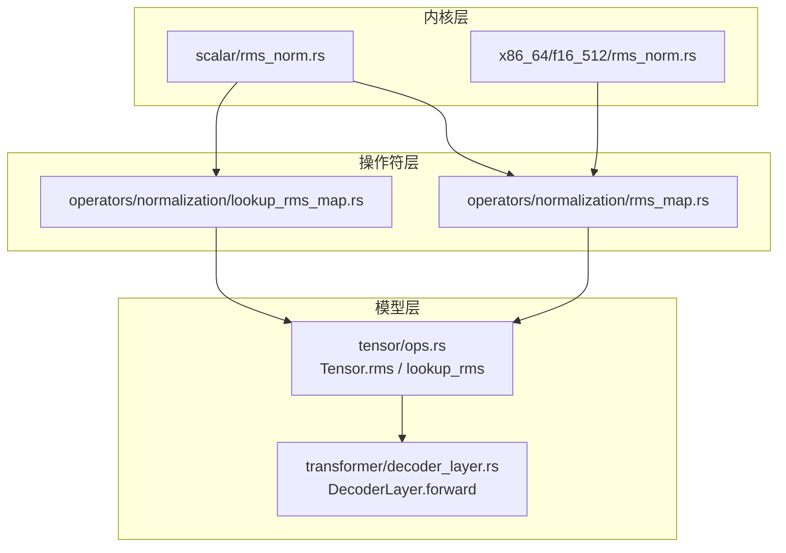
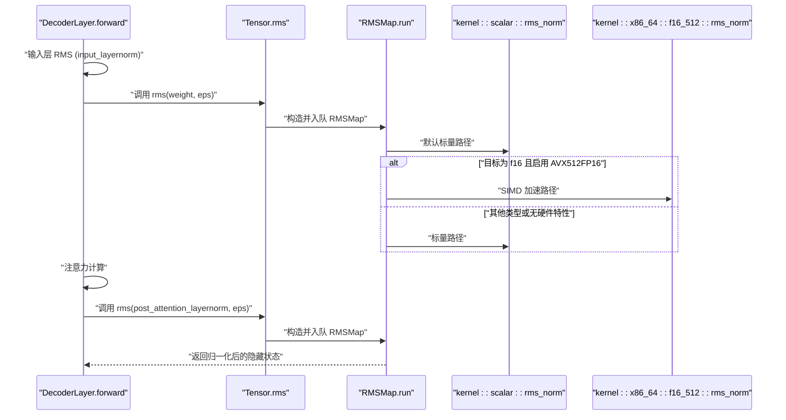
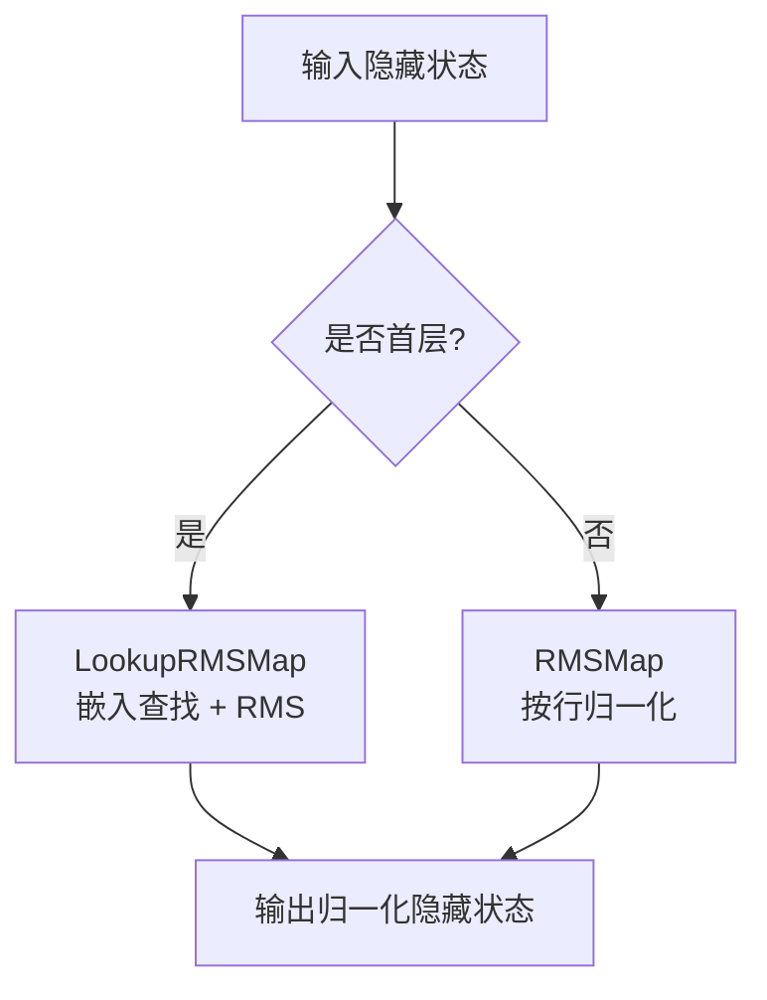
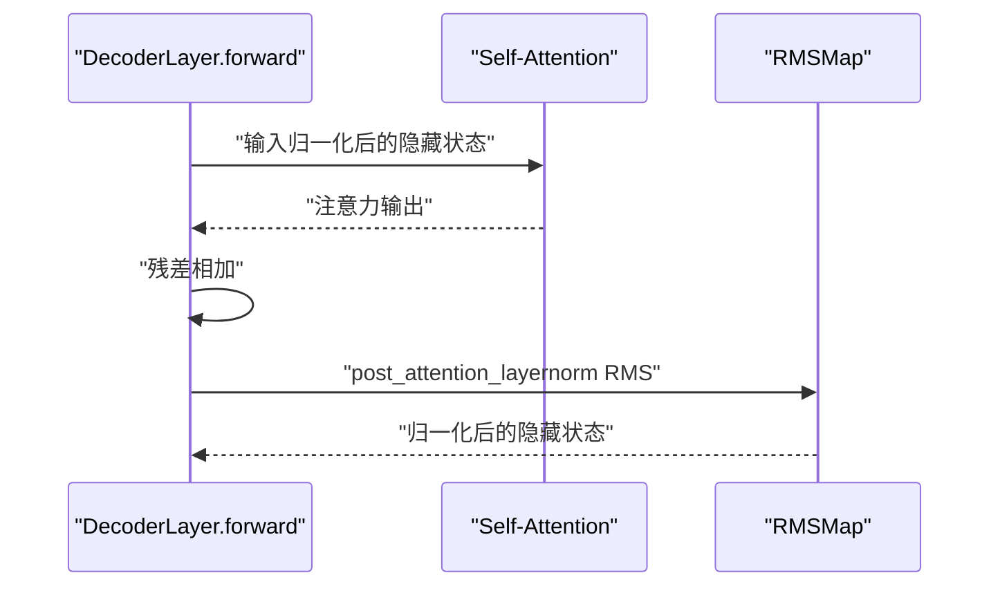
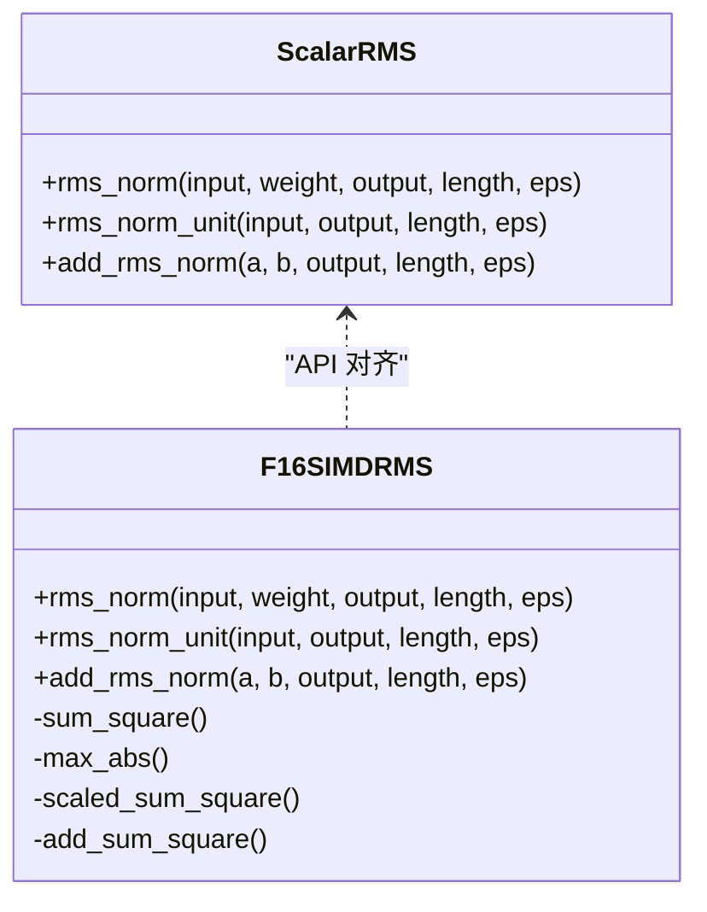
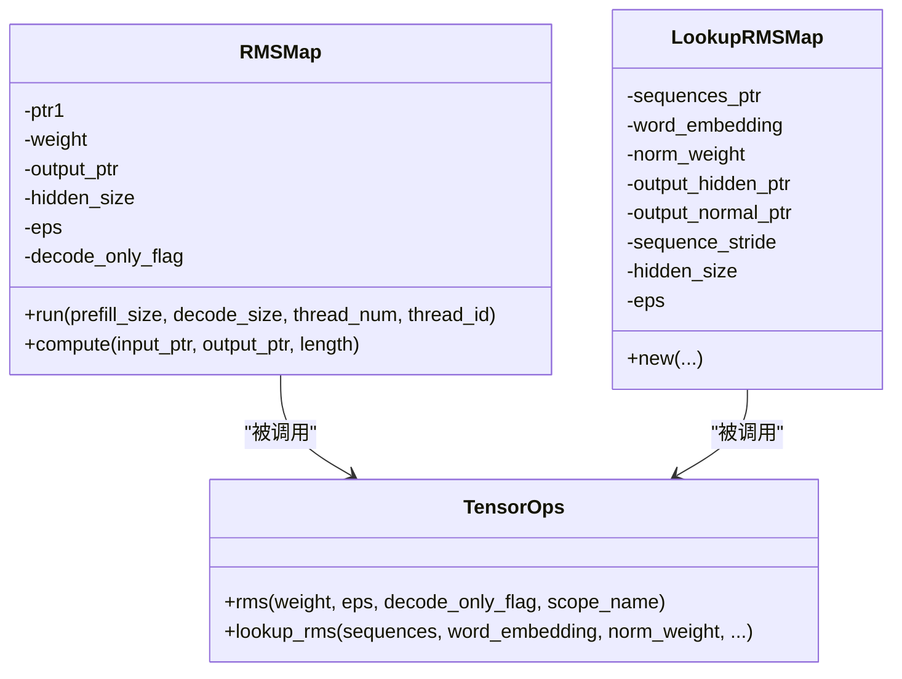
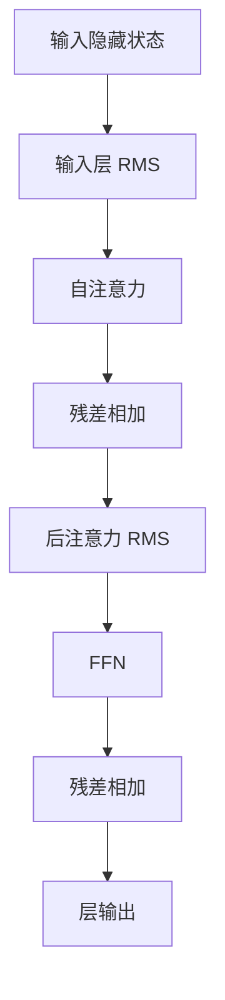
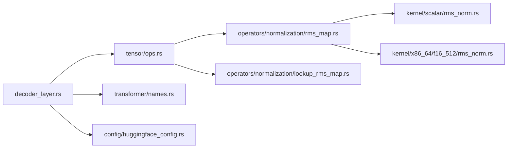

# 层归一化机制

<cite>
**本文引用的文件**   
- [src/kernel/scalar/rms_norm.rs](file://src/kernel/scalar/rms_norm.rs)
- [src/kernel/x86_64/f16_512/rms_norm.rs](file://src/kernel/x86_64/f16_512/rms_norm.rs)
- [src/operators/normalization/rms_map.rs](file://src/operators/normalization/rms_map.rs)
- [src/operators/normalization/lookup_rms_map.rs](file://src/operators/normalization/lookup_rms_map.rs)
- [src/tensor/ops.rs](file://src/tensor/ops.rs)
- [src/transformer/decoder_layer.rs](file://src/transformer/decoder_layer.rs)
- [src/config/huggingface_config.rs](file://src/config/huggingface_config.rs)
- [src/transformer/names.rs](file://src/transformer/names.rs)
- [alignment/tokenizer/compute_hf_f16_model.py](file://alignment/tokenizer/compute_hf_f16_model.py)
- [alignment/tokenizer/verify_first_layer.py](file://alignment/tokenizer/verify_first_layer.py)
</cite>

## 目录
1. [引言](#引言)
2. [项目结构](#项目结构)
3. [核心组件](#核心组件)
4. [架构总览](#架构总览)
5. [详细组件分析](#详细组件分析)
6. [依赖关系分析](#依赖关系分析)
7. [性能考量](#性能考量)
8. [故障排查指南](#故障排查指南)
9. [结论](#结论)
10. [附录](#附录)

## 引言
本技术文档聚焦于解码器中的“输入层归一化”和“后注意力层归一化”，围绕项目中实现的 RMS 归一化（Root Mean Square Normalization）展开，解释其与传统 LayerNorm 的差异与优势、参数学习策略、数值稳定性处理、在解码器层中的位置与计算流程，并提供超参数调优建议与自定义归一化集成指南。

## 项目结构
本项目将归一化实现分为三层：
- 内核层：标量与 SIMD 优化的 RMS 算子
- 操作符层：面向张量的 Map 型算子（RMSMap、LookupRMSMap）
- 模型层：解码器层调用 Tensor.rms 完成前向流程

图表来源
- [src/kernel/scalar/rms_norm.rs:1-152](file://src/kernel/scalar/rms_norm.rs#L1-L152)
- [src/kernel/x86_64/f16_512/rms_norm.rs:1-257](file://src/kernel/x86_64/f16_512/rms_norm.rs#L1-L257)
- [src/operators/normalization/rms_map.rs:1-268](file://src/operators/normalization/rms_map.rs#L1-L268)
- [src/operators/normalization/lookup_rms_map.rs:1-48](file://src/operators/normalization/lookup_rms_map.rs#L1-L48)
- [src/tensor/ops.rs:1-166](file://src/tensor/ops.rs#L1-L166)
- [src/transformer/decoder_layer.rs:1-406](file://src/transformer/decoder_layer.rs#L1-L406)

章节来源
- [src/kernel/scalar/rms_norm.rs:1-152](file://src/kernel/scalar/rms_norm.rs#L1-L152)
- [src/kernel/x86_64/f16_512/rms_norm.rs:1-257](file://src/kernel/x86_64/f16_512/rms_norm.rs#L1-L257)
- [src/operators/normalization/rms_map.rs:1-268](file://src/operators/normalization/rms_map.rs#L1-L268)
- [src/operators/normalization/lookup_rms_map.rs:1-48](file://src/operators/normalization/lookup_rms_map.rs#L1-L48)
- [src/tensor/ops.rs:1-166](file://src/tensor/ops.rs#L1-L166)
- [src/transformer/decoder_layer.rs:1-406](file://src/transformer/decoder_layer.rs#L1-L406)

## 核心组件
- 标量 RMS 内核：提供通用 RMS 计算、单位 RMS（无权重缩放）、以及先加后 RMS 的融合路径。
- x86_64 f16 SIMD 优化：针对 f16 的 AVX512FP16 加速路径，包含求平方和、最大值、缩放等内联函数，并在零方差分支做安全回退。
- RMSMap 操作符：按行对隐藏状态执行 RMS，支持 f16/f32/f64，并自动选择最优内核。
- LookupRMSMap 操作符：将词嵌入查找与 RMS 融合，输出两份结果（未归一化的嵌入与已归一化的嵌入），用于首层特殊路径。
- Tensor.rms 接口：在模型层暴露统一的归一化 API，内部构造并入队相应算子。
- DecoderLayer：在每层中依次执行“输入层 RMS → 注意力 → 后注意力 RMS → FFN”。

章节来源
- [src/kernel/scalar/rms_norm.rs:1-152](file://src/kernel/scalar/rms_norm.rs#L1-L152)
- [src/kernel/x86_64/f16_512/rms_norm.rs:1-257](file://src/kernel/x86_64/f16_512/rms_norm.rs#L1-L257)
- [src/operators/normalization/rms_map.rs:1-268](file://src/operators/normalization/rms_map.rs#L1-L268)
- [src/operators/normalization/lookup_rms_map.rs:1-48](file://src/operators/normalization/lookup_rms_map.rs#L1-L48)
- [src/tensor/ops.rs:1-166](file://src/tensor/ops.rs#L1-L166)
- [src/transformer/decoder_layer.rs:1-406](file://src/transformer/decoder_layer.rs#L1-L406)

## 架构总览
下图展示了从模型到内核的完整调用链，包括输入层与后注意力层的两次 RMS 归一化。

图表来源
- [src/transformer/decoder_layer.rs:152-230](file://src/transformer/decoder_layer.rs#L152-L230)
- [src/tensor/ops.rs:145-164](file://src/tensor/ops.rs#L145-L164)
- [src/operators/normalization/rms_map.rs:65-97](file://src/operators/normalization/rms_map.rs#L65-L97)
- [src/kernel/scalar/rms_norm.rs:5-30](file://src/kernel/scalar/rms_norm.rs#L5-L30)
- [src/kernel/x86_64/f16_512/rms_norm.rs:88-114](file://src/kernel/x86_64/f16_512/rms_norm.rs#L88-L114)

## 详细组件分析

### 输入层归一化（Input RMS）
- 位置：解码器层前，对输入隐藏状态进行逐特征维度的 RMS 归一化，作为注意力 QKV 投影的输入。
- 首层特例：首层通过 LookupRMSMap 将词嵌入查找与 RMS 融合，同时产出未归一化与已归一化两份中间结果，便于对齐与调试。
- 关键调用：
  - 非首层：DecoderLayer.forward 调用 Tensor.rms(input_layernorm_weight, eps)
  - 首层：Tensor.lookup_rms(sequences, word_embedding, norm_weight, ...)

图表来源
- [src/transformer/decoder_layer.rs:160-178](file://src/transformer/decoder_layer.rs#L160-L178)
- [src/tensor/ops.rs:105-137](file://src/tensor/ops.rs#L105-L137)
- [src/operators/normalization/lookup_rms_map.rs:1-48](file://src/operators/normalization/lookup_rms_map.rs#L1-L48)

章节来源
- [src/transformer/decoder_layer.rs:160-178](file://src/transformer/decoder_layer.rs#L160-L178)
- [src/tensor/ops.rs:105-137](file://src/tensor/ops.rs#L105-L137)
- [src/operators/normalization/lookup_rms_map.rs:1-48](file://src/operators/normalization/lookup_rms_map.rs#L1-L48)

### 后注意力层归一化（Post-Attention RMS）
- 位置：注意力残差相加之后、进入 FFN 之前，对注意力输出进行逐特征维度的 RMS 归一化。
- 关键调用：DecoderLayer.forward 中对 attention_hidden_states 调用 rms(post_attention_layernorm_weight, eps)。

图表来源
- [src/transformer/decoder_layer.rs:181-197](file://src/transformer/decoder_layer.rs#L181-L197)
- [src/tensor/ops.rs:145-164](file://src/tensor/ops.rs#L145-L164)

章节来源
- [src/transformer/decoder_layer.rs:181-197](file://src/transformer/decoder_layer.rs#L181-L197)
- [src/tensor/ops.rs:145-164](file://src/tensor/ops.rs#L145-L164)

### RMS 归一化内核实现
- 标量实现：
  - 计算每个特征的均方值 variance = mean(x^2)
  - 乘以可学习权重 weight，并使用 rrms = 1/sqrt(variance + eps) 进行缩放
  - 提供 add_rms_norm 融合路径：先逐元素相加再归一化
- f16 SIMD 优化：
  - 使用 AVX512FP16 指令集进行批量乘加与规约
  - 零方差保护：当 sum=0 时直接写零，避免除零
  - 提供 scaled_sum_square、add_sum_square 等辅助函数以支持不同融合场景

图表来源
- [src/kernel/scalar/rms_norm.rs:5-71](file://src/kernel/scalar/rms_norm.rs#L5-L71)
- [src/kernel/x86_64/f16_512/rms_norm.rs:88-161](file://src/kernel/x86_64/f16_512/rms_norm.rs#L88-L161)

章节来源
- [src/kernel/scalar/rms_norm.rs:5-71](file://src/kernel/scalar/rms_norm.rs#L5-L71)
- [src/kernel/x86_64/f16_512/rms_norm.rs:88-161](file://src/kernel/x86_64/f16_512/rms_norm.rs#L88-L161)

### 操作符与张量接口
- RMSMap：
  - 按行遍历 batch，调用底层内核执行 RMS
  - f16 路径根据编译期目标特性选择 SIMD 或标量实现
- LookupRMSMap：
  - 将 token 索引映射到词嵌入表，并对对应行执行 RMS
  - 同时输出未归一化与已归一化两份数据，便于对齐验证
- Tensor.rms：
  - 统一封装，创建输出张量并构造 Operator::RMSMap 入队执行

图表来源
- [src/operators/normalization/rms_map.rs:9-97](file://src/operators/normalization/rms_map.rs#L9-L97)
- [src/operators/normalization/lookup_rms_map.rs:14-48](file://src/operators/normalization/lookup_rms_map.rs#L14-L48)
- [src/tensor/ops.rs:105-164](file://src/tensor/ops.rs#L105-L164)

章节来源
- [src/operators/normalization/rms_map.rs:9-97](file://src/operators/normalization/rms_map.rs#L9-L97)
- [src/operators/normalization/lookup_rms_map.rs:14-48](file://src/operators/normalization/lookup_rms_map.rs#L14-L48)
- [src/tensor/ops.rs:105-164](file://src/tensor/ops.rs#L105-L164)

### 与传统 LayerNorm 的差异与优势
- 差异点：
  - RMS 仅基于二阶矩（均方根）进行缩放，不计算均值与标准差；LayerNorm 需要减去均值后再除以标准差
  - RMS 无需维护两个统计量（均值、方差），减少一次全通道减法与一次除法
- 优势：
  - 计算更简洁，内存访问更少，利于融合与并行化
  - 在大规模语言模型中表现稳定，且与 HF 对齐脚本一致
- 注意：
  - 若需严格等价于 LayerNorm，可在上层叠加一个减均值步骤；但当前模型采用 RMS 即可达到良好效果

[本节为概念性说明，不直接分析具体文件]

### 归一化参数的学习策略与数值稳定性
- 可学习参数：
  - input_layernorm.weight 与 post_attention_layernorm.weight 均为逐特征维度可学习缩放参数
  - 名称由 names.rs 生成，遵循 model.layers.{i}.input_layernorm.weight 等命名约定
- 数值稳定性：
  - eps 来自配置项 rms_norm_eps，默认常见值为 1e-6
  - f16 内核在 sum==0 时直接写零，避免除零与 NaN
  - 标量内核通过 Sqrt trait 保证 sqrt 行为一致
- 学习过程：
  - 权重随反向传播更新，与 MLP/Attention 权重共同训练

章节来源
- [src/transformer/names.rs:51-89](file://src/transformer/names.rs#L51-L89)
- [src/config/huggingface_config.rs:50-51](file://src/config/huggingface_config.rs#L50-L51)
- [src/kernel/x86_64/f16_512/rms_norm.rs:102-114](file://src/kernel/x86_64/f16_512/rms_norm.rs#L102-L114)
- [src/kernel/scalar/rms_norm.rs:14-30](file://src/kernel/scalar/rms_norm.rs#L14-L30)

### 解码器层中的位置与计算流程
- 流程顺序：
  1) 输入层 RMS（首层融合嵌入查找）
  2) 自注意力（含可选 QK 归一化，见下节）
  3) 残差相加
  4) 后注意力 RMS
  5) FFN（密集或 MoE）
  6) 残差相加得到层输出
- 关键代码路径：
  - 输入层 RMS：DecoderLayer.forward 第 160-178 行
  - 后注意力 RMS：DecoderLayer.forward 第 192-197 行

图表来源
- [src/transformer/decoder_layer.rs:160-230](file://src/transformer/decoder_layer.rs#L160-L230)

章节来源
- [src/transformer/decoder_layer.rs:160-230](file://src/transformer/decoder_layer.rs#L160-L230)

### Q/K 头归一化（QK Norm）补充说明
- 部分模型会在注意力内部对 Q/K 进行独立 RMS 归一化（q_norm/k_norm），与输入/后注意力 RMS 不同，属于注意力内部的稳定化手段
- 参考对齐脚本中对 q_norm/k_norm 的使用与对比

章节来源
- [alignment/tokenizer/compute_hf_f16_model.py:123-129](file://alignment/tokenizer/compute_hf_f16_model.py#L123-L129)
- [alignment/tokenizer/verify_first_layer.py:100-104](file://alignment/tokenizer/verify_first_layer.py#L100-L104)

## 依赖关系分析
- 模块耦合：
  - decoder_layer 依赖 tensor.ops 提供的 rms/lookup_rms 接口
  - tensor.ops 依赖 operators.normalization 下的 RMSMap/LookupRMSMap
  - operators.normalization 依赖 kernel 层的 scalar 与 x86_64 实现
- 外部依赖：
  - HuggingFace 配置中的 rms_norm_eps 控制数值稳定性
  - 名称生成 names.rs 决定权重加载路径

图表来源
- [src/transformer/decoder_layer.rs:152-230](file://src/transformer/decoder_layer.rs#L152-L230)
- [src/tensor/ops.rs:105-164](file://src/tensor/ops.rs#L105-L164)
- [src/operators/normalization/rms_map.rs:65-97](file://src/operators/normalization/rms_map.rs#L65-L97)
- [src/operators/normalization/lookup_rms_map.rs:14-48](file://src/operators/normalization/lookup_rms_map.rs#L14-L48)
- [src/kernel/scalar/rms_norm.rs:5-30](file://src/kernel/scalar/rms_norm.rs#L5-L30)
- [src/kernel/x86_64/f16_512/rms_norm.rs:88-114](file://src/kernel/x86_64/f16_512/rms_norm.rs#L88-L114)
- [src/transformer/names.rs:51-89](file://src/transformer/names.rs#L51-L89)
- [src/config/huggingface_config.rs:50-51](file://src/config/huggingface_config.rs#L50-L51)

章节来源
- [src/transformer/decoder_layer.rs:152-230](file://src/transformer/decoder_layer.rs#L152-L230)
- [src/tensor/ops.rs:105-164](file://src/tensor/ops.rs#L105-L164)
- [src/operators/normalization/rms_map.rs:65-97](file://src/operators/normalization/rms_map.rs#L65-L97)
- [src/operators/normalization/lookup_rms_map.rs:14-48](file://src/operators/normalization/lookup_rms_map.rs#L14-L48)
- [src/kernel/scalar/rms_norm.rs:5-30](file://src/kernel/scalar/rms_norm.rs#L5-L30)
- [src/kernel/x86_64/f16_512/rms_norm.rs:88-114](file://src/kernel/x86_64/f16_512/rms_norm.rs#L88-L114)
- [src/transformer/names.rs:51-89](file://src/transformer/names.rs#L51-L89)
- [src/config/huggingface_config.rs:50-51](file://src/config/huggingface_config.rs#L50-L51)

## 性能考量
- 数据类型与精度：
  - f16 路径优先使用 AVX512FP16 指令集，显著降低访存与提升吞吐
  - 标量路径保证跨平台一致性
- 融合与批处理：
  - LookupRMSMap 将嵌入查找与 RMS 融合，减少中间缓冲与额外访存
  - RMSMap 按行分片并行执行，适配多核 CPU
- 数值稳定性与开销：
  - eps 的选择影响梯度稳定性与收敛速度；过小可能导致不稳定，过大可能抑制信号
  - f16 内核的零方差保护避免异常值扩散

[本节为通用指导，不直接分析具体文件]

## 故障排查指南
- 常见问题：
  - NaN/Inf 出现：检查 eps 是否为正数；确认 f16 内核的零方差分支是否生效
  - 对齐失败：核对权重名称是否与 names.rs 生成的一致；确认 rms_norm_eps 与 HF 配置一致
  - 首层输出不一致：确认 LookupRMSMap 的输出形状与顺序，确保未归一化与已归一化两路正确区分
- 定位方法：
  - 使用 alignment 脚本对比 HF 中间结果（如 post_input_norm、post_attn_norm）
  - 打印各阶段张量范数与余弦相似度，快速定位偏差来源

章节来源
- [alignment/tokenizer/verify_first_layer.py:18-23](file://alignment/tokenizer/verify_first_layer.py#L18-L23)
- [alignment/tokenizer/compute_hf_f16_model.py:110-111](file://alignment/tokenizer/compute_hf_f16_model.py#L110-L111)
- [src/transformer/names.rs:126-127](file://src/transformer/names.rs#L126-L127)
- [src/config/huggingface_config.rs:50-51](file://src/config/huggingface_config.rs#L50-L51)

## 结论
本项目实现了高效、稳定的 RMS 归一化，覆盖标量与 f16 SIMD 路径，并通过 LookupRMSMap 与 Tensor.rms 接口无缝集成至解码器层。相比传统 LayerNorm，RMS 在保持数值稳定性的同时减少了计算与访存开销，适合大模型推理与训练。合理设置 eps 与权重初始化，结合对齐脚本验证，可获得与 HF 一致的数值结果。

[本节为总结性内容，不直接分析具体文件]

## 附录

### 超参数调优建议
- eps：
  - 起始值建议 1e-6；若训练不稳定，尝试增大至 1e-5；若收敛缓慢，可减小至 1e-7
- 权重初始化：
  - 通常初始化为接近 1 的值，使初期归一化近似恒等变换
- 数据类型：
  - 推理优先 f16；训练可根据显存与稳定性需求选择 f16/f32

[本节为通用指导，不直接分析具体文件]

### 自定义归一化方法的集成指南
- 步骤概览：
  1) 在内核层实现新的归一化函数（对标量与 f16 SIMD 分别实现）
  2) 在操作符层新增 MapTrait 实现（类似 RMSMap），负责线程分片与内核调度
  3) 在 TensorOps 中暴露统一接口（如 custom_norm），构造并入队新算子
  4) 在 DecoderLayer 中按需调用新接口，替换或叠加现有归一化
- 注意事项：
  - 保持与现有 API 风格一致（签名、错误处理、命名空间）
  - 确保与 names.rs 生成的权重名匹配，便于加载与保存
  - 提供对齐脚本验证数值一致性

[本节为通用指导，不直接分析具体文件]