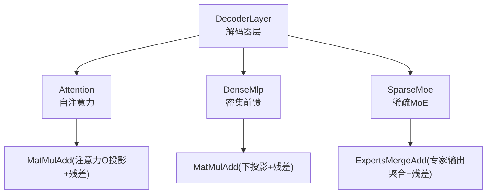
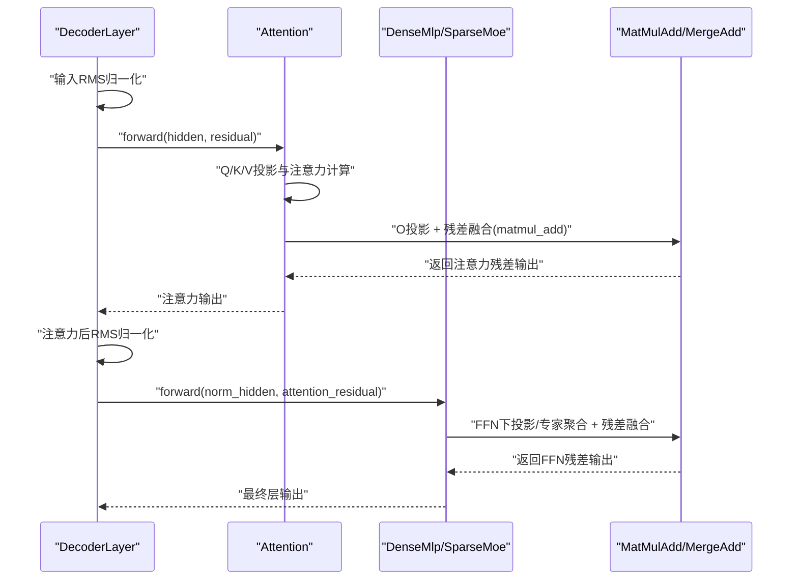
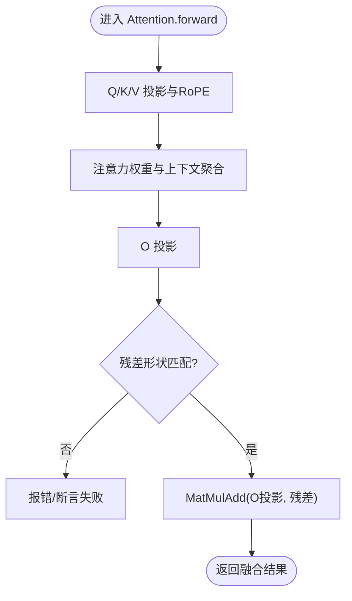
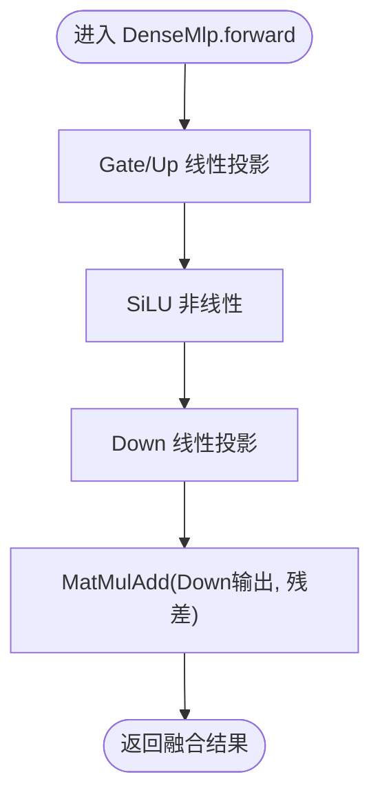
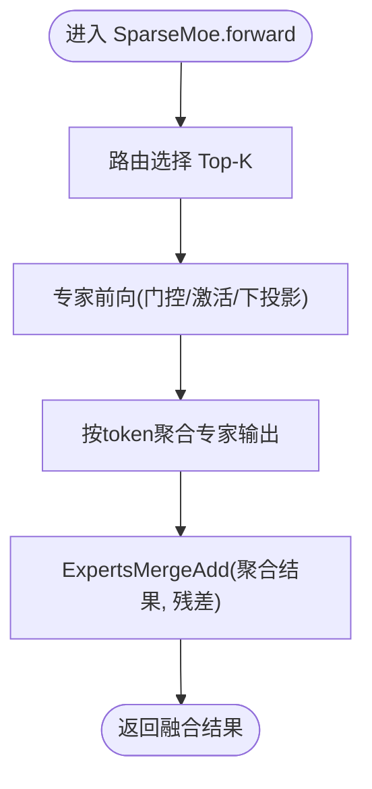
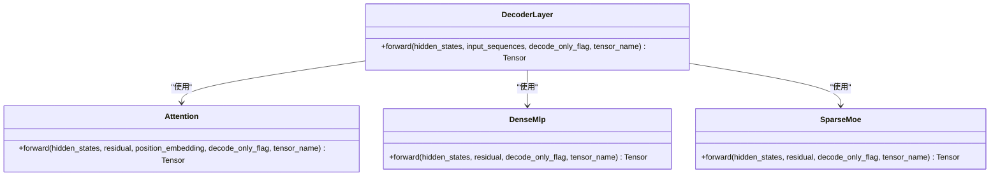
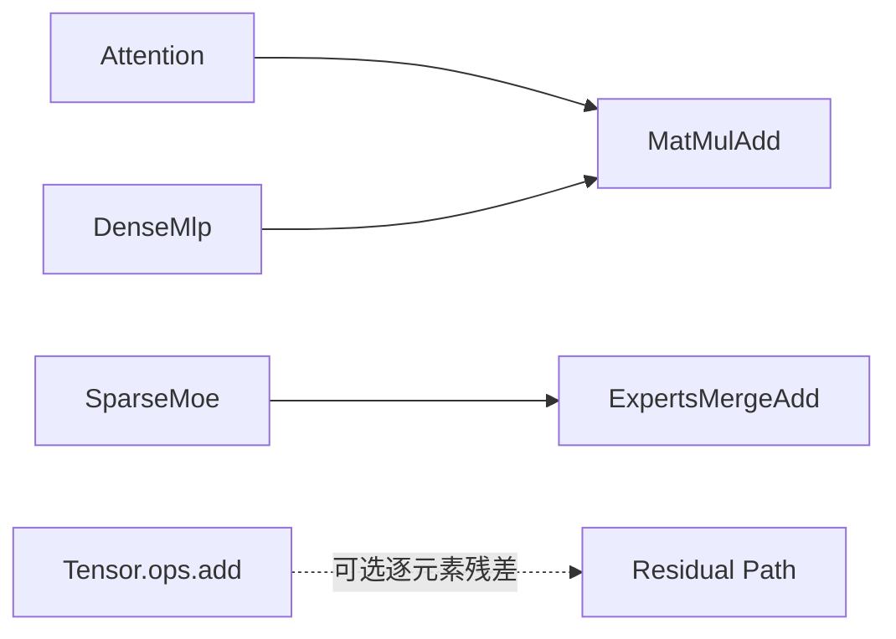

# 残差连接实现

<cite>
**本文引用的文件**   
- [decoder_layer.rs](file://src/transformer/decoder_layer.rs)
- [attention.rs](file://src/transformer/attention.rs)
- [dense_mlp.rs](file://src/transformer/dense_mlp.rs)
- [layer.rs](file://src/transformer/sparse_moe/layer.rs)
- [matmul_add.rs](file://src/operators/matmul/matmul_add.rs)
- [expert_merge_add.rs](file://src/operators/expert/expert_merge_add.rs)
- [ops.rs](file://src/tensor/ops.rs)
</cite>

## 目录
1. [简介](#简介)
2. [项目结构](#项目结构)
3. [核心组件](#核心组件)
4. [架构总览](#架构总览)
5. [详细组件分析](#详细组件分析)
6. [依赖关系分析](#依赖关系分析)
7. [性能与数值精度](#性能与数值精度)
8. [故障排查指南](#故障排查指南)
9. [结论](#结论)
10. [附录：扩展自定义残差结构](#附录：扩展自定义残差结构)

## 简介
本技术文档聚焦于解码器层中的残差连接实现，系统阐述其在注意力输出与前馈网络（含密集MLP与稀疏MoE）中的具体作用、数据流与数学表达。同时解释残差连接对梯度流动与训练稳定性的影响，说明不同层间的数据传递机制，并给出数值精度与溢出防护建议，以及扩展自定义残差结构的实践方法。

## 项目结构
本项目在Transformer模块中通过“算子融合”的方式实现残差连接：将矩阵乘法与加法合并为单一算子，减少中间张量与内存访问，提升吞吐与缓存局部性。关键位置包括：
- 解码器层编排：负责RMS归一化、注意力、FFN的调用顺序与残差输入输出管理
- 注意力模块：在O投影后执行 matmul + add 残差融合
- 密集前馈（DenseMlp）：在down_proj后执行 matmul + add 残差融合
- 稀疏MoE：在专家输出聚合阶段执行 merge + add 残差融合

图表来源
- [decoder_layer.rs:152-230](file://src/transformer/decoder_layer.rs#L152-L230)
- [attention.rs:92-210](file://src/transformer/attention.rs#L92-L210)
- [dense_mlp.rs:46-101](file://src/transformer/dense_mlp.rs#L46-L101)
- [layer.rs:152-199](file://src/transformer/sparse_moe/layer.rs#L152-L199)
- [matmul_add.rs:162-319](file://src/operators/matmul/matmul_add.rs#L162-L319)
- [expert_merge_add.rs:90-150](file://src/operators/expert/expert_merge_add.rs#L90-L150)

章节来源
- [decoder_layer.rs:152-230](file://src/transformer/decoder_layer.rs#L152-L230)
- [attention.rs:92-210](file://src/transformer/attention.rs#L92-L210)
- [dense_mlp.rs:46-101](file://src/transformer/dense_mlp.rs#L46-L101)
- [layer.rs:152-199](file://src/transformer/sparse_moe/layer.rs#L152-L199)

## 核心组件
- 解码器层（DecoderLayer）
  - 负责每层的整体流程：输入RMS归一化、注意力计算、注意力后RMS归一化、FFN计算，并在相应阶段注入残差。
  - 注意：当前实现中，注意力与FFN各自在其内部完成“乘加融合”，因此层内无需显式再做一次逐元素相加。
- 注意力（Attention）
  - 在Q/K/V线性变换、注意力权重计算与上下文拼接后，进行O投影并与传入的残差做融合（matmul + add）。
- 密集前馈（DenseMlp）
  - Gate/Up分支经非线性后，Down投影与残差融合（matmul + add）。
- 稀疏MoE（SparseMoe）
  - 路由选择Top-K专家，分别计算专家输出，再按token维度聚合，最后与残差融合（merge + add）。

章节来源
- [decoder_layer.rs:152-230](file://src/transformer/decoder_layer.rs#L152-L230)
- [attention.rs:92-210](file://src/transformer/attention.rs#L92-L210)
- [dense_mlp.rs:46-101](file://src/transformer/dense_mlp.rs#L46-L101)
- [layer.rs:152-199](file://src/transformer/sparse_moe/layer.rs#L152-L199)

## 架构总览
下图展示了解码器层在一次前向传播中残差连接的完整时序与数据流向。

图表来源
- [decoder_layer.rs:152-230](file://src/transformer/decoder_layer.rs#L152-L230)
- [attention.rs:92-210](file://src/transformer/attention.rs#L92-L210)
- [dense_mlp.rs:46-101](file://src/transformer/dense_mlp.rs#L46-L101)
- [layer.rs:152-199](file://src/transformer/sparse_moe/layer.rs#L152-L199)
- [matmul_add.rs:162-319](file://src/operators/matmul/matmul_add.rs#L162-L319)
- [expert_merge_add.rs:90-150](file://src/operators/expert/expert_merge_add.rs#L90-L150)

## 详细组件分析

### 注意力输出的残差连接
- 数学表达
  - 令注意力上下文为C，O投影权重为W_o，残差为R，则输出为 C·W_o + R。
- 实现要点
  - 注意力模块在O投影后直接调用融合算子，避免生成中间张量。
  - 支持decode_only_flag以适配prefill/decode两种模式下的形状与并行策略。
- 复杂度与内存
  - 时间复杂度与GEMM一致；空间上减少一次中间结果分配，降低峰值内存。
- 错误处理与边界
  - 对residual维度进行断言检查，确保最后一维与隐藏维一致。

图表来源
- [attention.rs:92-210](file://src/transformer/attention.rs#L92-L210)
- [matmul_add.rs:162-319](file://src/operators/matmul/matmul_add.rs#L162-L319)

章节来源
- [attention.rs:92-210](file://src/transformer/attention.rs#L92-L210)
- [matmul_add.rs:162-319](file://src/operators/matmul/matmul_add.rs#L162-L319)

### 前馈网络输出的残差连接（密集MLP）
- 数学表达
  - 令Gate/Up分支经非线性得到Z，Down投影权重为W_d，残差为R，则输出为 Z·W_d + R。
- 实现要点
  - DenseMlp在down_proj后直接调用融合算子，与残差相加。
- 复杂度与内存
  - 同样采用融合算子，减少中间张量与访存开销。

图表来源
- [dense_mlp.rs:46-101](file://src/transformer/dense_mlp.rs#L46-L101)
- [matmul_add.rs:162-319](file://src/operators/matmul/matmul_add.rs#L162-L319)

章节来源
- [dense_mlp.rs:46-101](file://src/transformer/dense_mlp.rs#L46-L101)
- [matmul_add.rs:162-319](file://src/operators/matmul/matmul_add.rs#L162-L319)

### 前馈网络输出的残差连接（稀疏MoE）
- 数学表达
  - 对每个token选择Top-K专家，计算各专家输出并求和，再与残差相加：Σ_i (z_i·W_{d,i}) + R。
- 实现要点
  - 路由选择后，专家输出按token维度聚合，最后调用 ExpertsMergeAdd 与残差融合。
- 复杂度与内存
  - 聚合阶段仅做逐元素累加，无额外GEMM；融合阶段仍保持低内存占用。

图表来源
- [layer.rs:152-199](file://src/transformer/sparse_moe/layer.rs#L152-L199)
- [expert_merge_add.rs:90-150](file://src/operators/expert/expert_merge_add.rs#L90-L150)

章节来源
- [layer.rs:152-199](file://src/transformer/sparse_moe/layer.rs#L152-L199)
- [expert_merge_add.rs:90-150](file://src/operators/expert/expert_merge_add.rs#L90-L150)

### 层间数据传递与残差路径
- 层间传递
  - DecoderLayer在前向中依次调用注意力与FFN，并将上一层的输出作为当前层的残差输入。
- 层内残差
  - 注意力与FFN各自在其内部完成“乘加融合”，因此层内不再需要额外的逐元素相加。
- 首层特殊处理
  - 首层可能从词嵌入与位置嵌入构造初始表示，随后进入标准残差流程。

图表来源
- [decoder_layer.rs:152-230](file://src/transformer/decoder_layer.rs#L152-L230)
- [attention.rs:92-210](file://src/transformer/attention.rs#L92-L210)
- [dense_mlp.rs:46-101](file://src/transformer/dense_mlp.rs#L46-L101)
- [layer.rs:152-199](file://src/transformer/sparse_moe/layer.rs#L152-L199)

章节来源
- [decoder_layer.rs:152-230](file://src/transformer/decoder_layer.rs#L152-L230)

## 依赖关系分析
- 算子融合依赖
  - MatMulAdd：用于注意力O投影与密集FFN下投影后的残差融合。
  - ExpertsMergeAdd：用于稀疏MoE专家输出聚合后的残差融合。
- 张量操作接口
  - ops.rs提供add等逐元素操作封装，但当前残差路径主要走融合算子以减少中间张量。

图表来源
- [attention.rs:92-210](file://src/transformer/attention.rs#L92-L210)
- [dense_mlp.rs:46-101](file://src/transformer/dense_mlp.rs#L46-L101)
- [layer.rs:152-199](file://src/transformer/sparse_moe/layer.rs#L152-L199)
- [matmul_add.rs:162-319](file://src/operators/matmul/matmul_add.rs#L162-L319)
- [expert_merge_add.rs:90-150](file://src/operators/expert/expert_merge_add.rs#L90-L150)
- [ops.rs:31-48](file://src/tensor/ops.rs#L31-L48)

章节来源
- [matmul_add.rs:162-319](file://src/operators/matmul/matmul_add.rs#L162-L319)
- [expert_merge_add.rs:90-150](file://src/operators/expert/expert_merge_add.rs#L90-L150)
- [ops.rs:31-48](file://src/tensor/ops.rs#L31-L48)

## 性能与数值精度
- 性能特性
  - 融合算子在run()中先拷贝残差到输出缓冲，再进行GEMM累加或逐元素累加，减少中间张量与内存带宽压力。
  - 针对f16路径提供SIMD特化（如AVX-512 FP16），在compute_rows与merge_add中利用向量指令加速。
- 数值精度与溢出防护
  - f16路径在部分标量回退实现中将累加提升到f32后再转回f16，以降低累积误差。
  - 建议在关键路径使用更高精度的累加寄存器或中间缓冲，特别是在长序列与大batch场景。
  - 对于极端值，可在RMS归一化与softmax等易发散步骤加入数值裁剪或稳定项。
- 内存与并行
  - 分块与微内核tile策略提高缓存命中率；线程级并行按tile划分任务，避免写冲突。

章节来源
- [matmul_add.rs:325-468](file://src/operators/matmul/matmul_add.rs#L325-L468)
- [expert_merge_add.rs:170-186](file://src/operators/expert/expert_merge_add.rs#L170-L186)

## 故障排查指南
- 常见错误
  - 残差维度不匹配：在注意力模块中对残差最后一维进行断言，若不一致会触发异常。
  - 形状视图错误：在reshape/view时未考虑decode_only_flag导致的行步长变化，需确保lift_vector与view顺序正确。
  - 多核写入越界：在ExpertsMergeAdd中需严格依据active_token_count限制写入范围，避免覆盖未参与计算的token。
- 定位建议
  - 打印各阶段tensor名称与形状，确认fusion前后维度一致。
  - 在测试用例中逐步启用单线程运行，复现问题后再开启多线程定位。

章节来源
- [attention.rs:182-208](file://src/transformer/attention.rs#L182-L208)
- [expert_merge_add.rs:121-147](file://src/operators/expert/expert_merge_add.rs#L121-L147)

## 结论
本项目在解码器层中通过“算子融合”的方式高效实现了残差连接：注意力O投影与密集FFN下投影均采用MatMulAdd融合，稀疏MoE采用ExpertsMergeAdd融合。该设计在保证数值稳定性的同时显著降低了内存占用与访存开销，提升了整体吞吐。结合RMS归一化与RoPE等模块，形成了稳定且高性能的解码器流水线。

## 附录：扩展自定义残差结构
- 目标
  - 在不破坏现有融合优势的前提下，引入新的残差变体（例如带缩放系数、可学习门控或通道选择性残差）。
- 推荐做法
  - 新增融合算子：参考MatMulAdd与ExpertsMergeAdd的实现，定义新的Operator，并在Tensor接口中暴露便捷方法。
  - 在DecoderLayer中插入新模块：在注意力或FFN之后添加自定义残差逻辑，并确保与后续RMS归一化的形状对齐。
  - 数值稳定性：为新算子提供f32累加回退路径，并对极端值进行裁剪或稳定化处理。
  - 测试覆盖：编写单元测试验证形状、数值与多线程正确性，覆盖prefill与decode两种模式。

章节来源
- [matmul_add.rs:162-319](file://src/operators/matmul/matmul_add.rs#L162-L319)
- [expert_merge_add.rs:90-150](file://src/operators/expert/expert_merge_add.rs#L90-L150)
- [decoder_layer.rs:152-230](file://src/transformer/decoder_layer.rs#L152-L230)