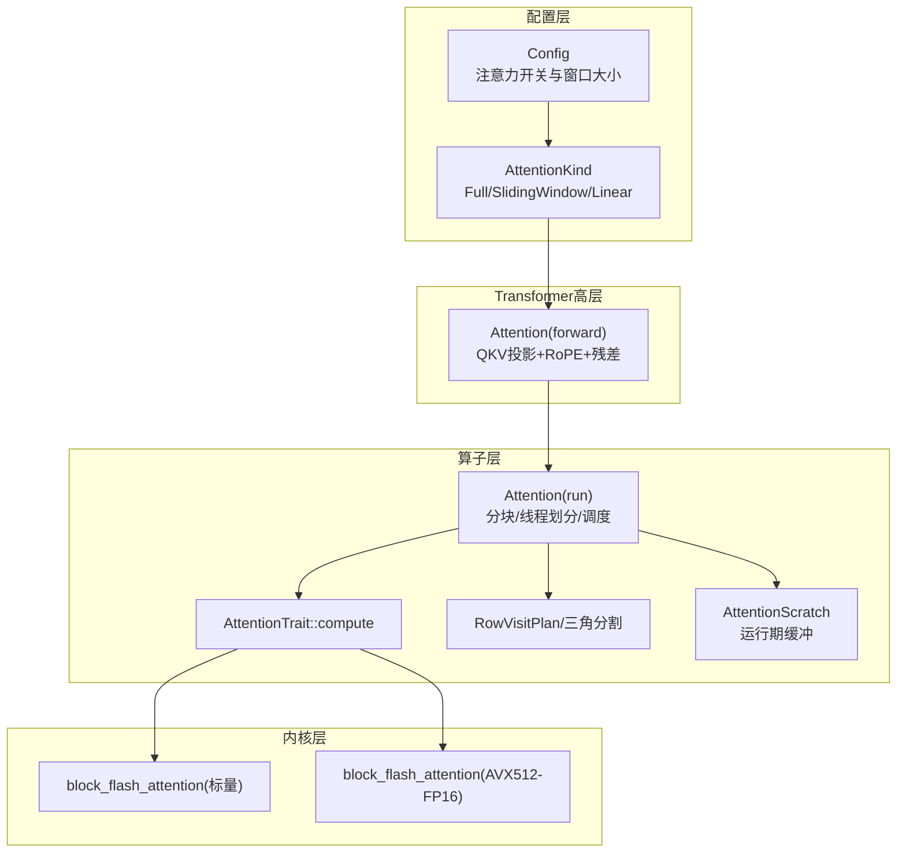
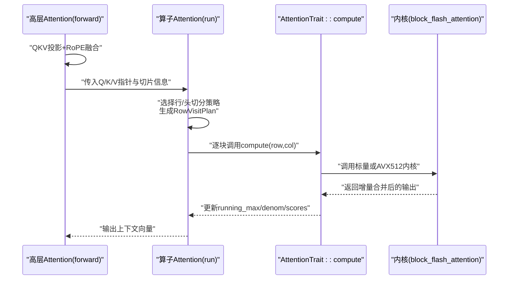
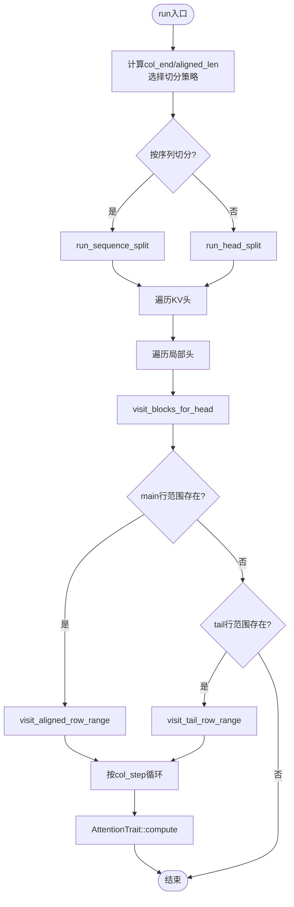
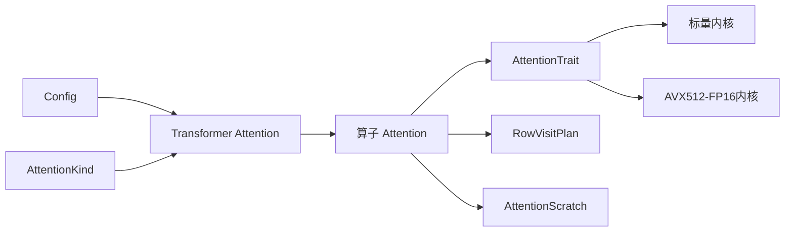

# 注意力块组件

<cite>
**本文引用的文件列表**
- [attention_kind.rs](file://src/transformer/config/attention_kind.rs)
- [config.rs](file://src/transformer/config/config.rs)
- [attention.rs（算子层）](file://src/operators/attention/attention.rs)
- [compute.rs](file://src/operators/attention/compute.rs)
- [utils.rs](file://src/operators/attention/utils.rs)
- [scratch.rs](file://src/operators/attention/scratch.rs)
- [block_flash_attention.rs（标量内核）](file://src/kernel/scalar/block_flash_attention.rs)
- [flash_attention.rs（AVX512-FP16内核）](file://src/kernel/x86_64/f16_512/flash_attention.rs)
- [linear.rs（AttentionTrait定义）](file://src/operators/traits/linear.rs)
- [attention.rs（Transformer高层封装）](file://src/transformer/attention.rs)
- [rope.rs](file://src/transformer/rope.rs)
</cite>

## 目录
1. [简介](#简介)
2. [项目结构](#项目结构)
3. [核心组件](#核心组件)
4. [架构总览](#架构总览)
5. [详细组件分析](#详细组件分析)
6. [依赖关系分析](#依赖关系分析)
7. [性能考量](#性能考量)
8. [故障排查指南](#故障排查指南)
9. [结论](#结论)
10. [附录](#附录)

## 简介
本技术文档聚焦于注意力块组件，围绕 AttentionBlock 的枚举设计、两种注意力模式（全注意力与滑动窗口注意力）的实现差异、初始化流程、参数配置、数据流处理、位置编码集成与残差连接展开。同时提供配置调优建议、性能优化策略以及扩展自定义注意力模式的指导。

## 项目结构
注意力相关代码分布在以下层次：
- 配置层：决定每层使用何种注意力模式（Full/SlidingWindow/Linear），并加载模型配置参数。
- Transformer高层封装：负责Q/K/V投影、RoPE位置编码融合、残差连接与输出投影。
- 算子层：实现分块、并行调度、内存缓冲管理与具体注意力计算内核调用。
- 内核层：提供标量与SIMD优化的注意力内核实现。

图表来源
- [config.rs:14-36](file://src/transformer/config/config.rs#L14-L36)
- [attention_kind.rs:4-35](file://src/transformer/config/attention_kind.rs#L4-L35)
- [attention.rs（Transformer高层封装）:92-209](file://src/transformer/attention.rs#L92-L209)
- [attention.rs（算子层）:39-143](file://src/operators/attention/attention.rs#L39-L143)
- [compute.rs:10-62](file://src/operators/attention/compute.rs#L10-L62)
- [utils.rs:1-61](file://src/operators/attention/utils.rs#L1-L61)
- [scratch.rs:19-73](file://src/operators/attention/scratch.rs#L19-L73)
- [block_flash_attention.rs（标量内核）:5-95](file://src/kernel/scalar/block_flash_attention.rs#L5-L95)
- [flash_attention.rs（AVX512-FP16内核）:142-210](file://src/kernel/x86_64/f16_512/flash_attention.rs#L142-L210)

章节来源
- [config.rs:14-36](file://src/transformer/config/config.rs#L14-L36)
- [attention_kind.rs:4-35](file://src/transformer/config/attention_kind.rs#L4-L35)
- [attention.rs（Transformer高层封装）:92-209](file://src/transformer/attention.rs#L92-L209)
- [attention.rs（算子层）:39-143](file://src/operators/attention/attention.rs#L39-L143)
- [compute.rs:10-62](file://src/operators/attention/compute.rs#L10-L62)
- [utils.rs:1-61](file://src/operators/attention/utils.rs#L1-L61)
- [scratch.rs:19-73](file://src/operators/attention/scratch.rs#L19-L73)
- [block_flash_attention.rs（标量内核）:5-95](file://src/kernel/scalar/block_flash_attention.rs#L5-L95)
- [flash_attention.rs（AVX512-FP16内核）:142-210](file://src/kernel/x86_64/f16_512/flash_attention.rs#L142-L210)

## 核心组件
- AttentionKind 枚举：用于选择注意力模式（Full、SlidingWindow、Linear）。通过 for_layer 方法结合层类型与全局开关决定每层实际使用的模式。
- Attention（算子层）：负责将输入切片按行/列分块，进行多线程并行调度，并通过 AttentionTrait 调用底层内核完成注意力计算。
- AttentionTrait：抽象出 compute 接口，允许在不同数据类型（f32/f16）和不同硬件特性下切换内核实现。
- RowVisitPlan 与三角分割：根据三角形可见性约束对行范围进行负载均衡分配，确保对齐到 row_step 边界。
- AttentionScratch：为每个线程分配运行期缓冲（running_max、running_denom、scores），避免重复分配与竞争。
- 内核实现：标量 block_flash_attention 与 AVX512-FP16 加速版本，均支持分块稳定 softmax 与增量合并。

章节来源
- [attention_kind.rs:4-35](file://src/transformer/config/attention_kind.rs#L4-L35)
- [attention.rs（算子层）:39-143](file://src/operators/attention/attention.rs#L39-L143)
- [linear.rs:1-22](file://src/operators/traits/linear.rs#L1-L22)
- [utils.rs:1-61](file://src/operators/attention/utils.rs#L1-L61)
- [scratch.rs:19-73](file://src/operators/attention/scratch.rs#L19-L73)
- [block_flash_attention.rs（标量内核）:5-95](file://src/kernel/scalar/block_flash_attention.rs#L5-L95)
- [flash_attention.rs（AVX512-FP16内核）:142-210](file://src/kernel/x86_64/f16_512/flash_attention.rs#L142-L210)

## 架构总览
从高层到低层的调用链如下：
- Transformer 高层 Attention.forward 执行 Q/K/V 线性投影、可选 QK 归一化、RoPE 位置编码融合、形状变换与视图重排，然后调用算子层 Attention.run。
- 算子层 Attention.run 根据序列长度与线程数选择“按序列切分”或“按头切分”策略，生成 RowVisitPlan，遍历 KV 头与局部头，调用 visit_blocks_for_head。
- visit_blocks_for_head 将行范围划分为 main（对齐块）与 tail（尾部未对齐），分别进入 visit_aligned_row_range 与 visit_tail_row_range。
- 在每个列块上，通过 AttentionTrait::compute 调用具体内核（标量或 AVX512-FP16）完成分块稳定注意力计算。

图表来源
- [attention.rs（Transformer高层封装）:92-209](file://src/transformer/attention.rs#L92-L209)
- [attention.rs（算子层）:439-505](file://src/operators/attention/attention.rs#L439-L505)
- [compute.rs:10-62](file://src/operators/attention/compute.rs#L10-L62)
- [block_flash_attention.rs（标量内核）:5-95](file://src/kernel/scalar/block_flash_attention.rs#L5-L95)
- [flash_attention.rs（AVX512-FP16内核）:142-210](file://src/kernel/x86_64/f16_512/flash_attention.rs#L142-L210)

## 详细组件分析

### AttentionKind 设计与模式选择
- 枚举值：Full、SlidingWindow、Linear。
- 决策逻辑：
  - 若层类型包含“linear”，则选择 Linear。
  - 若层类型包含“sliding”或“window”，则选择 SlidingWindow。
  - 否则，若全局 use_sliding_window 为真且当前层索引小于 max_window_layers，则选择 SlidingWindow。
  - 其余情况默认 Full。
- 该机制使得同一模型中可混合多种注意力模式，便于在浅层使用滑动窗口降低显存占用，深层使用全注意力提升建模能力。

章节来源
- [attention_kind.rs:4-35](file://src/transformer/config/attention_kind.rs#L4-L35)
- [config.rs:14-36](file://src/transformer/config/config.rs#L14-L36)

### 注意力块初始化过程与参数配置
- Transformer 高层 Attention.new：
  - 读取 head_dim、num_attention_heads、num_key_value_heads、use_qk_norm 等配置。
  - 初始化 Q/K/V/O 权重张量与可选 Q/K 归一化权重。
  - 计算缩放因子 scaling = 1 / sqrt(head_dim)。
- 运行时 forward：
  - 使用 matmul3 一次性完成 Q/K/V 投影与可选 QK 归一化，并融合 RoPE 位置编码。
  - 将结果 reshape/permute 为 [batch, heads, seq_len, head_dim] 布局以适配注意力内核。
  - 调用算子层 attention 计算，随后执行 O 投影并与残差相加。

章节来源
- [attention.rs（Transformer高层封装）:50-90](file://src/transformer/attention.rs#L50-L90)
- [attention.rs（Transformer高层封装）:92-209](file://src/transformer/attention.rs#L92-L209)
- [config.rs:14-36](file://src/transformer/config/config.rs#L14-L36)

### 数据流处理与并行调度
- 算子层 Attention.new：
  - 接收 Q/K/V 指针、输出指针、序列长度、批大小、头数、步长、head_size、缩放因子、decode_only_flag、线程数等。
  - 初始化线程级缓冲 AttentionScratch。
- run 主入口：
  - 遍历 SequenceSlice，计算 col_end、aligned_len，并根据条件选择 run_sequence_split 或 run_head_split。
  - 按 KV 头与局部头循环，为每个头构建访问计划 RowVisitPlan，调用 visit_blocks_for_head。
- 行访问计划：
  - split_sequence_by_triangle 基于三角形工作量均衡分配行范围，保证对齐到 row_step。
  - visit_aligned_row_range 与 visit_tail_row_range 分别处理对齐块与尾部未对齐行。
- 列块迭代：
  - 按 col_step 步进，调用 AttentionTrait::compute 完成分块稳定注意力计算。

图表来源
- [attention.rs（算子层）:439-505](file://src/operators/attention/attention.rs#L439-L505)
- [attention.rs（算子层）:273-311](file://src/operators/attention/attention.rs#L273-L311)
- [attention.rs（算子层）:158-270](file://src/operators/attention/attention.rs#L158-L270)
- [utils.rs:40-61](file://src/operators/attention/utils.rs#L40-L61)

章节来源
- [attention.rs（算子层）:39-143](file://src/operators/attention/attention.rs#L39-L143)
- [attention.rs（算子层）:158-311](file://src/operators/attention/attention.rs#L158-L311)
- [utils.rs:1-61](file://src/operators/attention/utils.rs#L1-L61)

### 全注意力与滑动窗口注意力的实现差异
- 全注意力（Full）：
  - 每个查询 token 对所有历史 token 计算注意力权重，适用于需要完整上下文建模的场景。
  - 时间复杂度 O(L^2·d)，空间复杂度 O(L^2)（含中间分数缓存）。
- 滑动窗口（SlidingWindow）：
  - 仅在当前 token 的前向窗口内计算注意力，减少计算与显存开销。
  - 在本仓库中，注意力可见性由 next_sequence_index 与 total_col_end 控制；对于解码阶段，next_sequence_index 限制可见列范围，从而形成“自回归可见性”。
  - 滑动窗口的具体窗口大小通常由配置项 sliding_window 与 max_window_layers 共同决定，并在层规划时确定是否启用。
- 线性注意力（Linear）：
  - 通过近似或核方法将复杂度降至 O(L·d)，适合超长序列场景。
  - 当前枚举已预留，但未见对应内核实现细节。

章节来源
- [attention_kind.rs:10-35](file://src/transformer/config/attention_kind.rs#L10-L35)
- [config.rs:33-36](file://src/transformer/config/config.rs#L33-L36)
- [attention.rs（算子层）:158-270](file://src/operators/attention/attention.rs#L158-L270)

### 位置编码集成方式
- RoPE（旋转位置编码）：
  - RotaryEmbedding 根据 head_dim、rotary_dim、theta 与 rope_scaling 生成位置频率表，并按 YARN 缩放策略调整。
  - 在 Transformer 高层 Attention.forward 中，matmul3 融合 RoPE 与 Q/K 投影，避免额外拷贝与访存。
- 集成要点：
  - rotary_dim ≤ head_dim，未覆盖维度保持恒等映射。
  - attention_scaling 来自 rope_scaling 的 attention_factor，影响角度缩放。

章节来源
- [rope.rs:169-231](file://src/transformer/rope.rs#L169-L231)
- [attention.rs（Transformer高层封装）:107-128](file://src/transformer/attention.rs#L107-L128)

### 残差连接的实现
- 在 Attention.forward 末尾，将注意力输出经 O 投影后与残差张量相加，再 reshape 回期望形状。
- 当 decode_only_flag 为真时，会进行 lift_vector 操作以适配单步解码的数据布局。

章节来源
- [attention.rs（Transformer高层封装）:178-209](file://src/transformer/attention.rs#L178-L209)

### 注意力内核与数值稳定性
- 分块稳定 softmax：
  - 维护 running_max 与 running_denom，按块增量合并，避免溢出与精度损失。
  - 每次块计算前更新 next_max，并对旧输出乘以 carry/next_denom 权重，再累加新贡献。
- 内核实现：
  - 标量版本：通用实现，易于验证正确性。
  - AVX512-FP16 版本：利用 SIMD 指令与预取优化，显著提升吞吐。

章节来源
- [block_flash_attention.rs（标量内核）:5-95](file://src/kernel/scalar/block_flash_attention.rs#L5-L95)
- [flash_attention.rs（AVX512-FP16内核）:142-210](file://src/kernel/x86_64/f16_512/flash_attention.rs#L142-L210)
- [compute.rs:10-62](file://src/operators/attention/compute.rs#L10-L62)

### 配置参数与调优指南
- 关键配置项：
  - num_attention_heads、num_key_value_heads、head_dim：影响并行度与计算量。
  - use_qk_norm：是否启用 Q/K 归一化，有助于训练稳定性。
  - use_sliding_window、max_window_layers、sliding_window：控制滑动窗口启用的层范围与窗口大小。
  - rope_theta、rotary_dim、rope_scaling：影响位置编码与长序列外推能力。
- 调优建议：
  - 增大 batch_size 与 thread_num 以提升吞吐，但需关注内存峰值。
  - 合理设置 row_step 与 col_step，平衡缓存命中与并行粒度。
  - 在长文本场景优先启用滑动窗口以降低显存占用；在短文本或关键层保留全注意力。
  - 针对 x86_64 平台开启 AVX512-FP16 目标特性以获得更高性能。

章节来源
- [config.rs:14-36](file://src/transformer/config/config.rs#L14-L36)
- [attention.rs（算子层）:50-100](file://src/operators/attention/attention.rs#L50-L100)
- [compute.rs:64-130](file://src/operators/attention/compute.rs#L64-L130)

### 性能优化建议
- 内存布局与步长：
  - 确保 k_seq_stride、v_seq_stride、q_seq_stride 与 head_size 对齐，减少跨步访存。
- 并行策略：
  - 短序列优先按头切分（run_head_split），长序列按序列切分（run_sequence_split）。
  - 使用 triangle_prefix 均衡各线程的工作量，避免尾部分配不均。
- 内核选择：
  - 在支持 AVX512-FP16 的 CPU 上编译并启用相应 target_feature，自动选择高性能路径。
- 解码优化：
  - decode_only_flag 为真时，使用 lift_vector 与更小的 col_step，减少冗余计算。

章节来源
- [attention.rs（算子层）:314-436](file://src/operators/attention/attention.rs#L314-L436)
- [utils.rs:10-61](file://src/operators/attention/utils.rs#L10-L61)
- [compute.rs:64-130](file://src/operators/attention/compute.rs#L64-L130)

### 自定义注意力模式的扩展方法
- 新增枚举值：
  - 在 AttentionKind 中添加新模式（例如 Custom）。
- 实现 AttentionTrait：
  - 在 compute.rs 中为 Attention<T> 添加新的 compute 分支，或新增 trait 实现以接入自定义内核。
- 修改 for_layer 决策：
  - 在 attention_kind.rs 的 for_layer 中加入对新模式的判定逻辑（如层类型匹配或配置开关）。
- 集成到高层：
  - 在 Transformer 高层 Attention.forward 中按需切换不同的预处理或后处理流程（如不同的掩码生成或窗口裁剪）。

章节来源
- [attention_kind.rs:4-35](file://src/transformer/config/attention_kind.rs#L4-L35)
- [compute.rs:10-62](file://src/operators/attention/compute.rs#L10-L62)
- [linear.rs:1-22](file://src/operators/traits/linear.rs#L1-L22)

## 依赖关系分析
- 模块耦合：
  - Transformer 高层依赖配置与名称映射，调用算子层注意力。
  - 算子层依赖 traits、utils、scratch 与内核模块。
  - 内核模块独立实现，通过 trait 解耦。
- 外部依赖：
  - 数学运算通过 num_traits 提供的 Exp、NegInfinity、Sqrt 等泛型接口。
  - 内存池与算子队列通过 GlobalMemPool 与 GlobalOperatorQueue 管理。

图表来源
- [config.rs:14-36](file://src/transformer/config/config.rs#L14-L36)
- [attention_kind.rs:4-35](file://src/transformer/config/attention_kind.rs#L4-L35)
- [attention.rs（Transformer高层封装）:92-209](file://src/transformer/attention.rs#L92-L209)
- [attention.rs（算子层）:39-143](file://src/operators/attention/attention.rs#L39-L143)
- [compute.rs:10-62](file://src/operators/attention/compute.rs#L10-L62)
- [utils.rs:1-61](file://src/operators/attention/utils.rs#L1-L61)
- [scratch.rs:19-73](file://src/operators/attention/scratch.rs#L19-L73)
- [block_flash_attention.rs（标量内核）:5-95](file://src/kernel/scalar/block_flash_attention.rs#L5-L95)
- [flash_attention.rs（AVX512-FP16内核）:142-210](file://src/kernel/x86_64/f16_512/flash_attention.rs#L142-L210)

章节来源
- [config.rs:14-36](file://src/transformer/config/config.rs#L14-L36)
- [attention_kind.rs:4-35](file://src/transformer/config/attention_kind.rs#L4-L35)
- [attention.rs（Transformer高层封装）:92-209](file://src/transformer/attention.rs#L92-L209)
- [attention.rs（算子层）:39-143](file://src/operators/attention/attention.rs#L39-L143)
- [compute.rs:10-62](file://src/operators/attention/compute.rs#L10-L62)
- [utils.rs:1-61](file://src/operators/attention/utils.rs#L1-L61)
- [scratch.rs:19-73](file://src/operators/attention/scratch.rs#L19-L73)
- [block_flash_attention.rs（标量内核）:5-95](file://src/kernel/scalar/block_flash_attention.rs#L5-L95)
- [flash_attention.rs（AVX512-FP16内核）:142-210](file://src/kernel/x86_64/f16_512/flash_attention.rs#L142-L210)

## 性能考量
- 时间复杂度：
  - 全注意力 O(L^2·d)，滑动窗口 O(L·W·d)，线性注意力 O(L·d)。
- 空间复杂度：
  - 全注意力需存储 L×L 分数矩阵（分块后可控），滑动窗口显著降低。
- 并行与缓存：
  - 行/列分块与线程分配提高并行度；row_step 与 col_step 影响缓存命中率。
- 硬件特性：
  - AVX512-FP16 内核在支持平台上具备显著加速效果。

[本节为通用性能讨论，不直接分析具体文件]

## 故障排查指南
- 常见错误：
  - 形状不匹配：检查 q/k/v 的 stride 与 head_size 是否正确传递。
  - 数值不稳定：确认 running_max 初始化为负无穷，running_denom 初始化为零。
  - 解码阶段异常：确认 decode_only_flag 与 next_sequence_index 的设置。
- 调试建议：
  - 对比 naive_attention_row 与内核输出，定位偏差。
  - 打印 RowVisitPlan 与 col_step 分布，验证负载均衡。
  - 在 f16 路径下检查 AVX512-FP16 目标特性是否启用。

章节来源
- [attention.rs（算子层）:509-703](file://src/operators/attention/attention.rs#L509-L703)
- [block_flash_attention.rs（标量内核）:97-281](file://src/kernel/scalar/block_flash_attention.rs#L97-L281)
- [flash_attention.rs（AVX512-FP16内核）:211-286](file://src/kernel/x86_64/f16_512/flash_attention.rs#L211-L286)

## 结论
本注意力块组件通过清晰的层次划分与可扩展的 trait 设计，实现了高效稳定的注意力计算。AttentionKind 提供了灵活的注意力模式选择，配合分块稳定 softmax 与多线程并行调度，兼顾了准确性与性能。RoPE 与残差连接的集成使模型具备更强的位置感知与梯度流动能力。通过合理的配置与内核选择，可在不同硬件与任务场景下取得良好表现。

[本节为总结性内容，不直接分析具体文件]

## 附录
- 术语说明：
  - Full Attention：全注意力，考虑所有历史 token。
  - Sliding Window Attention：滑动窗口注意力，仅考虑最近 W 个 token。
  - Linear Attention：线性注意力，通过近似降低复杂度。
  - RoPE：旋转位置编码，注入位置信息。
  - 分块稳定 softmax：增量合并的最大值与分母，避免数值溢出。

[本节为概念性内容，不直接分析具体文件]