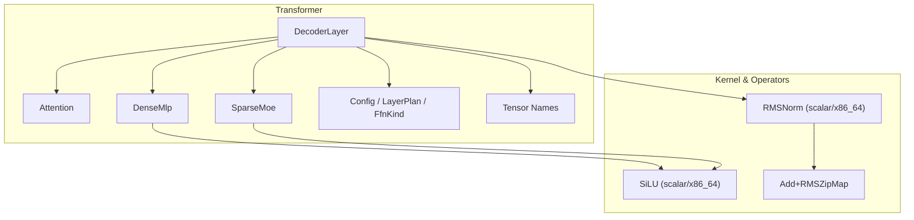
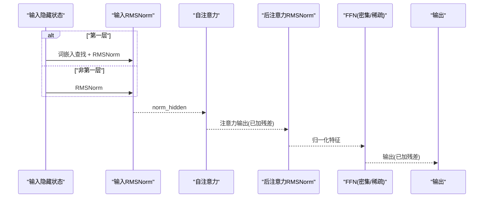
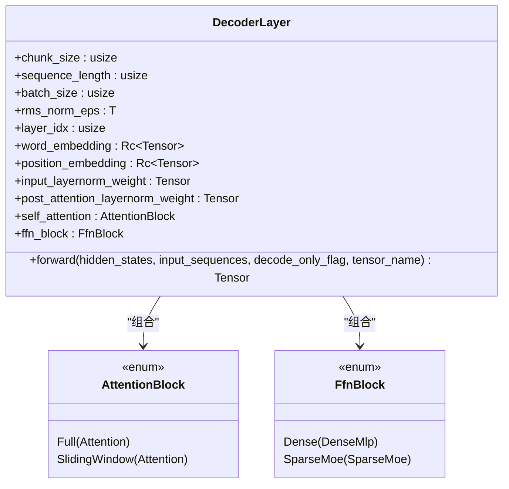
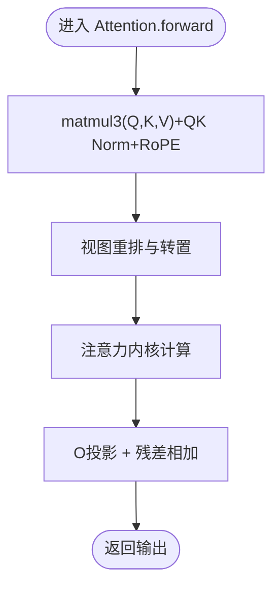
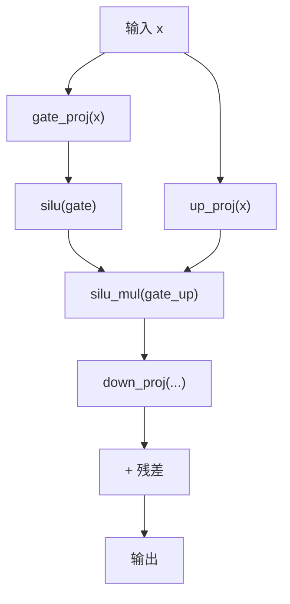
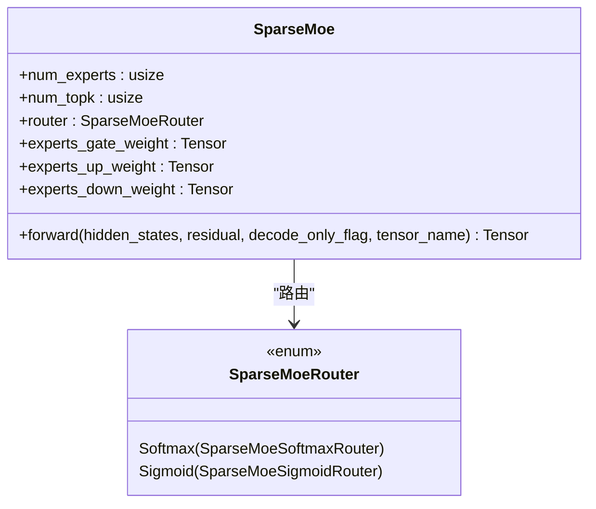
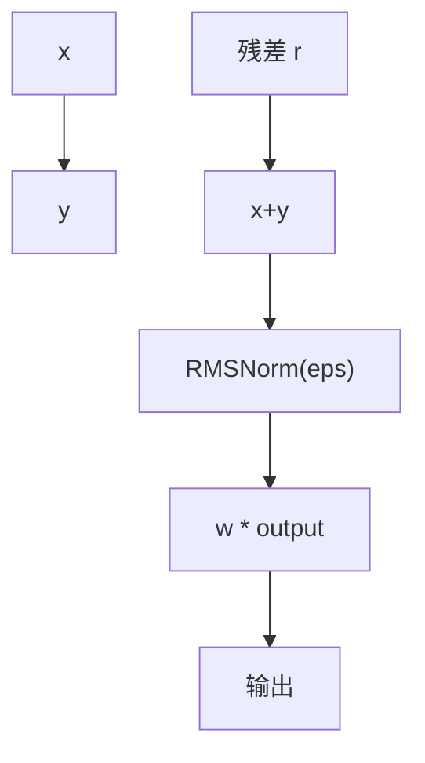
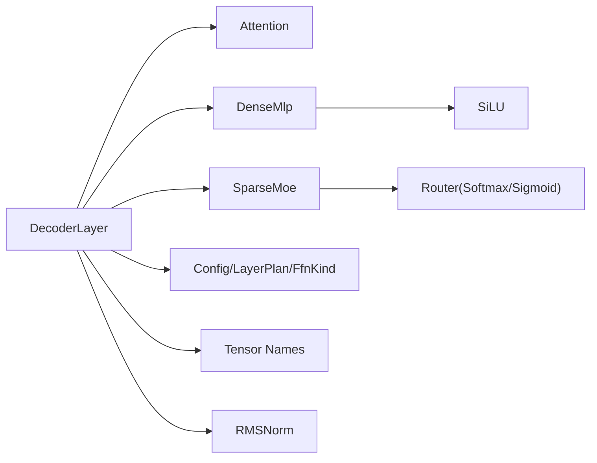

# 解码器层结构

<cite>
**本文引用的文件**   
- [decoder_layer.rs](file://src/transformer/decoder_layer.rs)
- [attention.rs](file://src/transformer/attention.rs)
- [dense_mlp.rs](file://src/transformer/dense_mlp.rs)
- [sparse_moe/layer.rs](file://src/transformer/sparse_moe/layer.rs)
- [config/config.rs](file://src/transformer/config/config.rs)
- [config/ffn_kind.rs](file://src/transformer/config/ffn_kind.rs)
- [config/layer_plan.rs](file://src/transformer/config/layer_plan.rs)
- [names.rs](file://src/transformer/names.rs)
- [kernel/scalar/rms_norm.rs](file://src/kernel/scalar/rms_norm.rs)
- [operators/normalization/add_rms_zip.rs](file://src/operators/normalization/add_rms_zip.rs)
- [kernel/scalar/silu.rs](file://src/kernel/scalar/silu.rs)
</cite>

## 目录
1. [简介](#简介)
2. [项目结构](#项目结构)
3. [核心组件](#核心组件)
4. [架构总览](#架构总览)
5. [详细组件分析](#详细组件分析)
6. [依赖关系分析](#依赖关系分析)
7. [性能考量](#性能考量)
8. [故障排查指南](#故障排查指南)
9. [结论](#结论)
10. [附录](#附录)

## 简介
本技术文档聚焦于解码器层的结构与实现，系统阐述以下要点：
- 解码器层的整体架构与组件排列顺序
- 残差连接、层归一化（RMSNorm）与前馈网络（MLP/MoE）的实现细节
- MLP 前馈网络的门控 SiLU 融合路径与优化策略
- 激活函数的选择与实现（SiLU）
- 解码器层间的数据流与控制流
- 配置参数与性能调优建议
- 自定义解码器层的扩展指南
- 不同模型架构中解码器层的差异

## 项目结构
本项目采用分层模块化组织，解码器相关代码集中在 transformer 子模块下，包含注意力、FFN（密集与稀疏 MoE）、配置与名称映射等。关键文件如下：
- 解码器层主体：decoder_layer.rs
- 自注意力：attention.rs
- 密集 FFN（DenseMlp）：dense_mlp.rs
- 稀疏 MoE FFN：sparse_moe/layer.rs
- 配置与层计划：config/config.rs, config/ffn_kind.rs, config/layer_plan.rs
- 权重命名映射：names.rs
- RMSNorm 内核与算子封装：kernel/scalar/rms_norm.rs, operators/normalization/add_rms_zip.rs
- SiLU 激活函数：kernel/scalar/silu.rs

图表来源
- [decoder_layer.rs:1-230](file://src/transformer/decoder_layer.rs#L1-L230)
- [attention.rs:1-210](file://src/transformer/attention.rs#L1-L210)
- [dense_mlp.rs:1-102](file://src/transformer/dense_mlp.rs#L1-L102)
- [sparse_moe/layer.rs:1-200](file://src/transformer/sparse_moe/layer.rs#L1-L200)
- [config/config.rs:1-136](file://src/transformer/config/config.rs#L1-L136)
- [config/ffn_kind.rs:1-59](file://src/transformer/config/ffn_kind.rs#L1-L59)
- [config/layer_plan.rs:1-36](file://src/transformer/config/layer_plan.rs#L1-L36)
- [names.rs:1-134](file://src/transformer/names.rs#L1-L134)
- [kernel/scalar/rms_norm.rs:1-152](file://src/kernel/scalar/rms_norm.rs#L1-L152)
- [operators/normalization/add_rms_zip.rs:1-230](file://src/operators/normalization/add_rms_zip.rs#L1-L230)
- [kernel/scalar/silu.rs:1-56](file://src/kernel/scalar/silu.rs#L1-L56)

章节来源
- [decoder_layer.rs:1-230](file://src/transformer/decoder_layer.rs#L1-L230)
- [config/config.rs:1-136](file://src/transformer/config/config.rs#L1-L136)
- [names.rs:1-134](file://src/transformer/names.rs#L1-L134)

## 核心组件
- DecoderLayer<T>：解码器层主结构，组合自注意力与 FFN（密集或稀疏），维护输入/后注意力 RMSNorm 权重、词嵌入与位置嵌入引用、以及作用域名称。
- Attention<T>：多头自注意力，支持 Q/K/V 投影、可选 QK 归一化、RoPE 位置编码、缩放因子与输出投影，并内建残差相加。
- DenseMlp<T>：门控双线性前馈网络（Gate/Up/Down），使用 SiLU 激活融合 Gate 与 Up 分支，再与残差相加。
- SparseMoe<T>：稀疏专家混合前馈，含路由（Softmax/Sigmoid）、Top-K 专家选择、按专家并行计算与合并相加。
- Config/LayerPlan/FfnKind：从 HuggingFace 配置解析生成每层注意力类型与 FFN 类型（密集或稀疏），决定层堆栈布局。
- Tensor Names：为各层张量提供一致的命名空间，便于权重加载与调试。
- RMSNorm 与 SiLU：底层数值内核与算子封装，提供高性能逐元素与矩阵运算。

章节来源
- [decoder_layer.rs:33-150](file://src/transformer/decoder_layer.rs#L33-L150)
- [attention.rs:13-90](file://src/transformer/attention.rs#L13-L90)
- [dense_mlp.rs:11-44](file://src/transformer/dense_mlp.rs#L11-L44)
- [sparse_moe/layer.rs:74-150](file://src/transformer/sparse_moe/layer.rs#L74-L150)
- [config/config.rs:13-116](file://src/transformer/config/config.rs#L13-L116)
- [config/ffn_kind.rs:5-59](file://src/transformer/config/ffn_kind.rs#L5-L59)
- [config/layer_plan.rs:7-36](file://src/transformer/config/layer_plan.rs#L7-L36)
- [names.rs:47-134](file://src/transformer/names.rs#L47-L134)

## 架构总览
解码器层的前向流程遵循“预归一化 + 残差”的经典范式：
- 第一层：对输入序列进行词嵌入查找与 RMSNorm，得到 norm_hidden；非第一层：先对隐藏状态做 RMSNorm。
- 自注意力：以 norm_hidden 作为查询输入，结合位置编码与残差 hidden_states 计算注意力输出，内部完成 O 投影并与残差相加。
- 后注意力 RMSNorm：对注意力输出再做一次 RMSNorm。
- FFN（密集或稀疏）：对归一化后的特征进行非线性变换，最后与注意力阶段的残差相加得到最终输出。

图表来源
- [decoder_layer.rs:152-230](file://src/transformer/decoder_layer.rs#L152-L230)
- [attention.rs:92-210](file://src/transformer/attention.rs#L92-L210)

章节来源
- [decoder_layer.rs:152-230](file://src/transformer/decoder_layer.rs#L152-L230)
- [attention.rs:92-210](file://src/transformer/attention.rs#L92-L210)

## 详细组件分析

### 解码器层（DecoderLayer）
- 构造阶段：根据配置与层索引构建注意力块（全窗口或滑动窗口）与 FFN 块（密集或稀疏），初始化 RMSNorm 权重与作用域名称。
- 前向阶段：
  - 首层特殊处理：通过 lookup_rms 将 token 索引查表到词嵌入，并进行 RMSNorm。
  - 非首层：直接对隐藏状态执行 RMSNorm。
  - 注意力：传入 norm_hidden、原始残差与位置编码，返回注意力输出。
  - 后注意力 RMSNorm：对注意力输出再次归一化。
  - FFN：调用密集或稀疏前馈，最终返回与残差相加的结果。

图表来源
- [decoder_layer.rs:16-49](file://src/transformer/decoder_layer.rs#L16-L49)
- [decoder_layer.rs:152-230](file://src/transformer/decoder_layer.rs#L152-L230)

章节来源
- [decoder_layer.rs:67-150](file://src/transformer/decoder_layer.rs#L67-L150)
- [decoder_layer.rs:152-230](file://src/transformer/decoder_layer.rs#L152-L230)

### 自注意力（Attention）
- 权重与归一化：Q/K/V/O 投影权重，可选 Q/K 头级归一化权重。
- 计算流程：
  - matmul3 一次性计算 Q/K/V，并可选择应用 QK 归一化与 RoPE。
  - 视图重排与转置，适配注意力内核的内存布局。
  - attention 内核计算注意力分数与上下文向量。
  - o_proj 投影并与残差相加，返回形状对齐的输出。

图表来源
- [attention.rs:92-210](file://src/transformer/attention.rs#L92-L210)

章节来源
- [attention.rs:50-90](file://src/transformer/attention.rs#L50-L90)
- [attention.rs:92-210](file://src/transformer/attention.rs#L92-L210)

### 密集前馈网络（DenseMlp）
- 结构：Gate/Up/Down 三线性层，Gate 与 Up 分支经 SiLU 融合后再 Down 投影，最后与残差相加。
- 优化策略：
  - 使用优化的 MatMulParams 宏步长与微步长以提升缓存命中与并行度。
  - silu_mul 将 Gate 的 SiLU 与 Up 相乘融合为一个算子，减少中间存储与访存。
  - matmul_add 在 Down 投影时直接与残差相加，避免额外加法步骤。

图表来源
- [dense_mlp.rs:46-100](file://src/transformer/dense_mlp.rs#L46-L100)
- [kernel/scalar/silu.rs:1-56](file://src/kernel/scalar/silu.rs#L1-L56)

章节来源
- [dense_mlp.rs:11-44](file://src/transformer/dense_mlp.rs#L11-L44)
- [dense_mlp.rs:46-100](file://src/transformer/dense_mlp.rs#L46-L100)

### 稀疏专家混合前馈（SparseMoe）
- 路由：支持 Softmax 或 Sigmoid 评分，可带偏置项，选择 Top-K 专家。
- 专家计算：每个专家拥有独立的 Gate/Up/Down 权重，按路由结果并行计算。
- 合并：将各专家输出按路由权重加权合并，再与残差相加。

图表来源
- [sparse_moe/layer.rs:74-150](file://src/transformer/sparse_moe/layer.rs#L74-L150)
- [sparse_moe/layer.rs:152-199](file://src/transformer/sparse_moe/layer.rs#L152-L199)

章节来源
- [sparse_moe/layer.rs:14-72](file://src/transformer/sparse_moe/layer.rs#L14-L72)
- [sparse_moe/layer.rs:74-150](file://src/transformer/sparse_moe/layer.rs#L74-L150)
- [sparse_moe/layer.rs:152-199](file://src/transformer/sparse_moe/layer.rs#L152-L199)

### 层归一化（RMSNorm）与残差连接
- RMSNorm：基于均方根归一化，带 eps 稳定项与可学习权重缩放。
- Add+RMS 融合：在部分路径中将残差相加与 RMSNorm 融合为单一算子，降低访存与提升吞吐。
- 实现层次：
  - 标量内核：kernel/scalar/rms_norm.rs 提供基础实现。
  - 算子封装：operators/normalization/add_rms_zip.rs 将 add+rms 打包为 ZipMap 算子，支持多线程分片执行。

图表来源
- [kernel/scalar/rms_norm.rs:52-71](file://src/kernel/scalar/rms_norm.rs#L52-L71)
- [operators/normalization/add_rms_zip.rs:84-135](file://src/operators/normalization/add_rms_zip.rs#L84-L135)

章节来源
- [kernel/scalar/rms_norm.rs:1-152](file://src/kernel/scalar/rms_norm.rs#L1-L152)
- [operators/normalization/add_rms_zip.rs:1-230](file://src/operators/normalization/add_rms_zip.rs#L1-L230)

### 激活函数（SiLU）
- 定义：SiLU(x) = x * sigmoid(x)。
- 实现：
  - 标量版本：逐元素计算，支持通用浮点类型。
  - x86_64 AVX512-FP16 加速：批量 SIMD 计算，显著提升吞吐。
- 在 DenseMlp 中，Gate 分支经 SiLU 后与 Up 分支融合，形成高效的 gate_up_silu_mul 路径。

章节来源
- [kernel/scalar/silu.rs:1-56](file://src/kernel/scalar/silu.rs#L1-L56)
- [dense_mlp.rs:81-85](file://src/transformer/dense_mlp.rs#L81-L85)

### 配置与层计划（Config/LayerPlan/FfnKind）
- 从 HuggingFace 配置解析：
  - 推导 head_dim、num_key_value_heads、intermediate_size、moe_intermediate_size、num_experts 等。
  - 决定是否启用 QK 归一化、路由评分方式与是否使用路由偏置。
- 层计划构建：
  - 根据 use_sliding_window 与 max_window_layers 决定注意力类型（Full/SlidingWindow）。
  - 根据 mlp_only_layers、decoder_sparse_step 与 num_experts 决定 FFN 类型（Dense/SparseMoe）。
- 名称映射：
  - 为每层生成统一的 scope 与权重键名，确保权重加载一致性。

章节来源
- [config/config.rs:39-116](file://src/transformer/config/config.rs#L39-L116)
- [config/layer_plan.rs:13-36](file://src/transformer/config/layer_plan.rs#L13-L36)
- [config/ffn_kind.rs:30-59](file://src/transformer/config/ffn_kind.rs#L30-L59)
- [names.rs:82-134](file://src/transformer/names.rs#L82-L134)

## 依赖关系分析
- DecoderLayer 依赖 Attention、DenseMlp/SparseMoe、Config、Names、RMSNorm 与 SiLU。
- Attention 依赖 MatMul 内核与注意力算子，支持 QK 归一化与 RoPE。
- DenseMlp 依赖 MatMul、SiLU 与 matmul_add 融合。
- SparseMoe 依赖路由（Softmax/Sigmoid）、专家矩阵乘法与合并相加。
- Config/LayerPlan/FfnKind 共同决定层堆栈布局与 FFN 类型。

图表来源
- [decoder_layer.rs:1-230](file://src/transformer/decoder_layer.rs#L1-L230)
- [attention.rs:1-210](file://src/transformer/attention.rs#L1-L210)
- [dense_mlp.rs:1-102](file://src/transformer/dense_mlp.rs#L1-L102)
- [sparse_moe/layer.rs:1-200](file://src/transformer/sparse_moe/layer.rs#L1-L200)
- [config/config.rs:1-136](file://src/transformer/config/config.rs#L1-L136)
- [config/layer_plan.rs:1-36](file://src/transformer/config/layer_plan.rs#L1-L36)
- [config/ffn_kind.rs:1-59](file://src/transformer/config/ffn_kind.rs#L1-L59)
- [names.rs:1-134](file://src/transformer/names.rs#L1-L134)

章节来源
- [decoder_layer.rs:1-230](file://src/transformer/decoder_layer.rs#L1-L230)
- [config/config.rs:1-136](file://src/transformer/config/config.rs#L1-L136)

## 性能考量
- 算子融合：
  - matmul3 将 Q/K/V 投影与 QK 归一化、RoPE 融合，减少中间张量与访存。
  - silu_mul 将 Gate 的 SiLU 与 Up 相乘融合，避免显式中间存储。
  - matmul_add 在 Down 投影时直接加残差，减少额外加法开销。
- 内存布局与步长：
  - MatMulParams 中的宏步长与微步长参数用于优化缓存行与并行分块，提高吞吐。
- 线程并行：
  - 注意力与算子执行利用多线程分片，按 CPU 核数分配任务。
- 数据类型与硬件特性：
  - f16 路径在支持 AVX512-FP16 的平台上使用专用内核，显著加速 SiLU 与 MoE 计算。

[本节为通用性能讨论，不直接分析具体文件]

## 故障排查指南
- 配置不一致：
  - 若 FfnKind 与权重命名不匹配，会触发不可达分支错误。检查 layer_plan 与 names 的一致性。
- 线性注意力未实现：
  - 当配置指定 Linear 注意力但层未实现时会 panic。确认 attention 类型为 Full 或 SlidingWindow。
- 路由偏置缺失：
  - 当 use_routing_bias=true 但未提供 router_bias 权重名，会触发断言失败。检查 SparseMoeTensorNames 的 router_bias 字段。
- 形状不匹配：
  - 注意力输出与残差形状需一致，否则 view 或 matmul_add 可能失败。核对 sequence_length、batch_size 与 hidden_size。

章节来源
- [decoder_layer.rs:93-97](file://src/transformer/decoder_layer.rs#L93-L97)
- [sparse_moe/layer.rs:115-122](file://src/transformer/sparse_moe/layer.rs#L115-L122)
- [attention.rs:182-208](file://src/transformer/attention.rs#L182-L208)

## 结论
解码器层在本项目中采用“预归一化 + 残差”的标准架构，结合高效算子融合与硬件加速内核，实现了高吞吐与低延迟的推理能力。通过灵活的配置与层计划机制，系统可在密集 FFN 与稀疏 MoE 之间切换，并支持多种注意力模式。RMSNorm 与 SiLU 的底层优化进一步提升了整体性能。

[本节为总结性内容，不直接分析具体文件]

## 附录

### 配置参数与调优建议
- 关键配置项：
  - hidden_size、num_attention_heads、num_key_value_heads、head_dim：影响注意力维度与并行度。
  - rms_norm_eps：RMSNorm 稳定性参数，过小可能导致数值不稳定。
  - intermediate_size/moe_intermediate_size：控制 FFN 容量与计算量。
  - num_experts/num_experts_per_tok：MoE 的专家数量与每 token 选择的专家数，影响稀疏性与吞吐。
  - decoder_sparse_step：控制稀疏层出现频率，平衡精度与效率。
  - use_qk_norm：是否启用 QK 归一化，有助于训练稳定性。
  - use_sliding_window/sliding_window/max_window_layers：控制注意力窗口大小与范围。
- 调优建议：
  - 增大 batch_size 与 chunk_size 以提升并行度，注意显存占用。
  - 调整 MatMulParams 的宏/微步长以匹配目标硬件缓存层级。
  - 在支持 AVX512-FP16 的平台优先使用 f16 路径，获得更高吞吐。
  - 对于 MoE，合理设置 num_experts_per_tok 与 router 评分方式，平衡稀疏性与准确性。

章节来源
- [config/config.rs:13-116](file://src/transformer/config/config.rs#L13-L116)
- [config/ffn_kind.rs:30-59](file://src/transformer/config/ffn_kind.rs#L30-L59)
- [config/layer_plan.rs:13-36](file://src/transformer/config/layer_plan.rs#L13-L36)

### 自定义解码器层扩展指南
- 新增 FFN 类型：
  - 在 FfnKind 中添加新变体，并在 LayerPlan::build_stack 中注册对应逻辑。
  - 在 names.rs 中为新 FFN 类型添加权重命名映射。
  - 在 DecoderLayer::new 中根据 FfnKind 实例化新的 FFN 块。
- 新增注意力类型：
  - 在 AttentionBlock 中添加新变体，并在 DecoderLayer::forward 中分发调用。
  - 实现对应的注意力内核与视图重排逻辑。
- 自定义归一化或激活：
  - 在 kernel 层实现新算子，并在 operators 中封装为 ZipMap 或 Operator。
  - 在 DenseMlp/SparseMoe 中集成新激活或融合路径。

章节来源
- [config/ffn_kind.rs:5-59](file://src/transformer/config/ffn_kind.rs#L5-L59)
- [config/layer_plan.rs:13-36](file://src/transformer/config/layer_plan.rs#L13-L36)
- [names.rs:82-134](file://src/transformer/names.rs#L82-L134)
- [decoder_layer.rs:67-150](file://src/transformer/decoder_layer.rs#L67-L150)

### 不同模型架构中解码器层的差异
- 注意力模式：
  - Full：全局注意力，适用于短上下文或训练阶段。
  - SlidingWindow：局部注意力，适用于长上下文推理，降低复杂度。
- FFN 类型：
  - Dense：标准门控前馈，结构简单，易于部署。
  - SparseMoe：稀疏专家混合，提升容量与效率，需要路由与合并逻辑。
- QK 归一化：
  - 某些模型族（如 Qwen3/Qwen3_MoE）默认启用 QK 归一化，提升稳定性。
- 路由评分与偏置：
  - 支持 Softmax 与 Sigmoid 评分，部分模型族（如 MiniMaxM2）默认使用路由偏置。

章节来源
- [config/config.rs:55-61](file://src/transformer/config/config.rs#L55-L61)
- [config/layer_plan.rs:13-36](file://src/transformer/config/layer_plan.rs#L13-L36)
- [sparse_moe/layer.rs:38-72](file://src/transformer/sparse_moe/layer.rs#L38-L72)