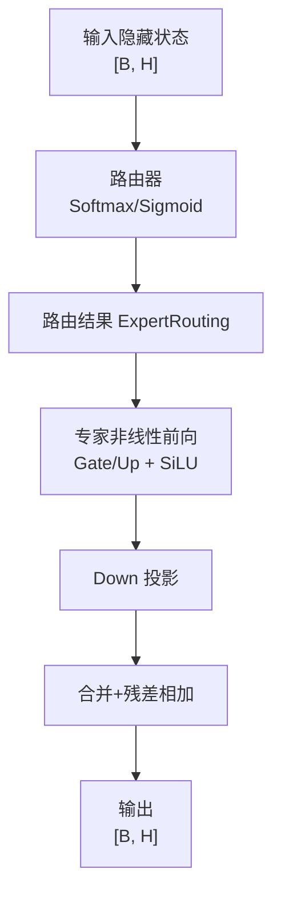
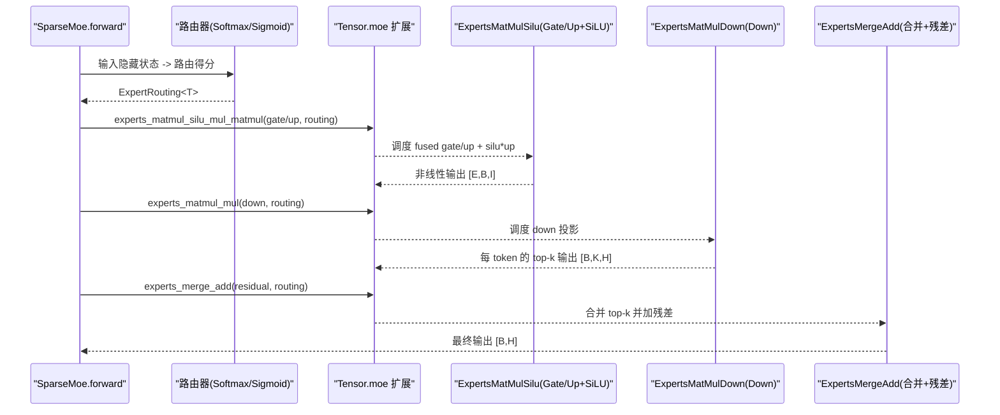
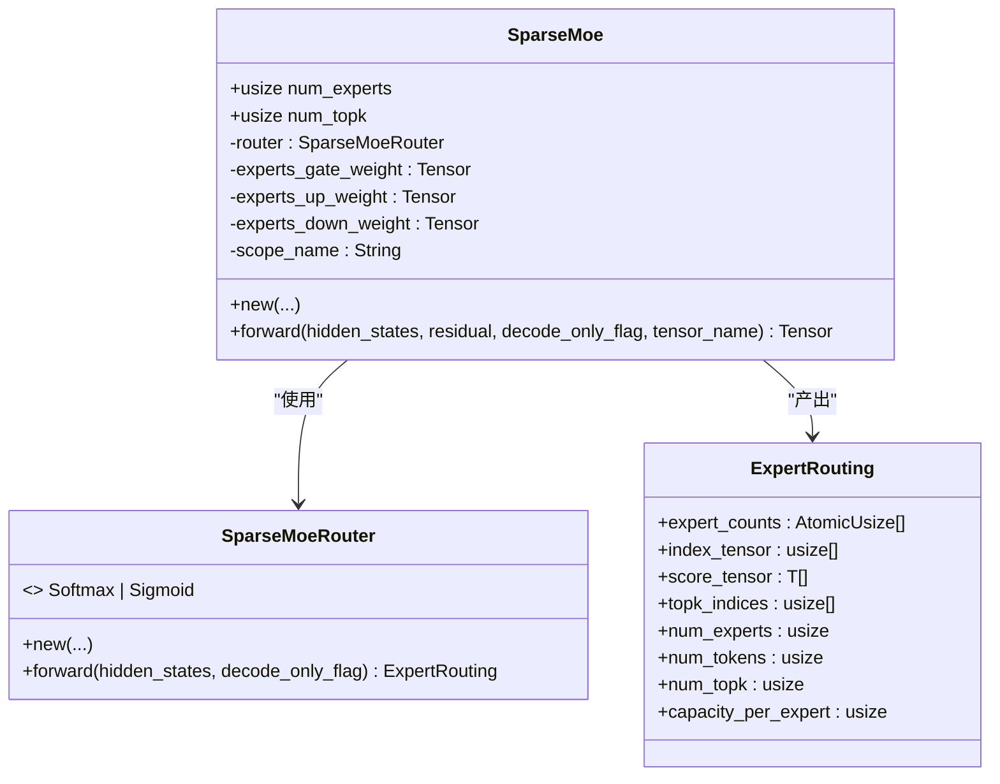
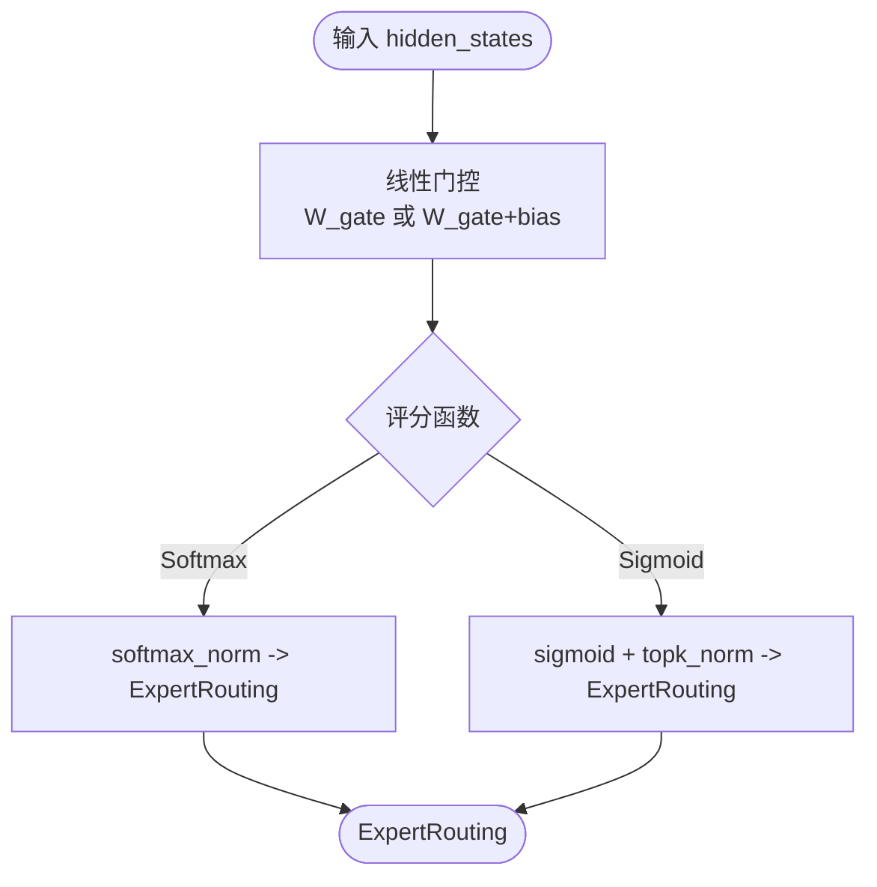
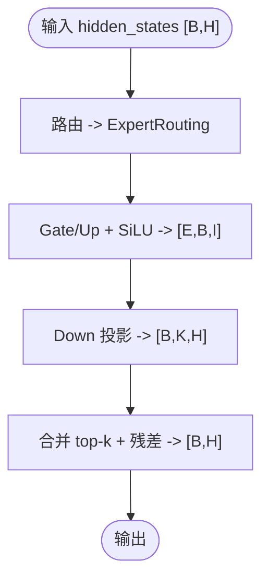
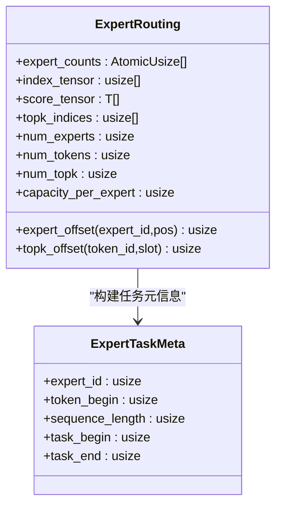
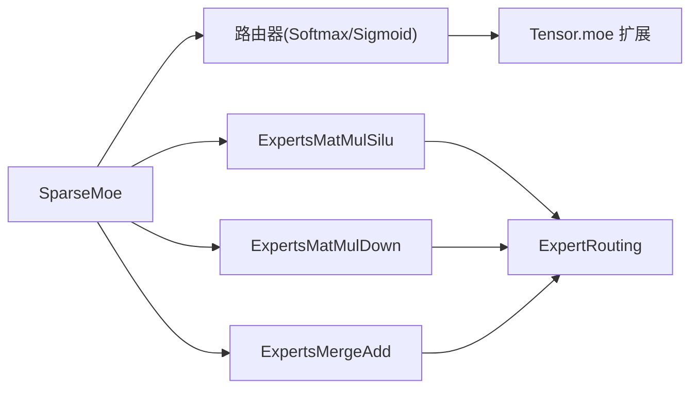

# MoE 架构设计

<cite>
**本文引用的文件列表**
- [src/transformer/sparse_moe/mod.rs](file://src/transformer/sparse_moe/mod.rs)
- [src/transformer/sparse_moe/layer.rs](file://src/transformer/sparse_moe/layer.rs)
- [src/transformer/sparse_moe/router_softmax.rs](file://src/transformer/sparse_moe/router_softmax.rs)
- [src/transformer/sparse_moe/router_sigmoid.rs](file://src/transformer/sparse_moe/router_sigmoid.rs)
- [src/operators/expert/expert_routing.rs](file://src/operators/expert/expert_routing.rs)
- [src/tensor/moe.rs](file://src/tensor/moe.rs)
- [src/operators/expert/expert_matmul_mul.rs](file://src/operators/expert/expert_matmul_mul.rs)
- [src/operators/expert/expert_merge_add.rs](file://src/operators/expert/expert_merge_add.rs)
- [src/operators/expert/expert_matmul_silu_mul_matmul.rs](file://src/operators/expert/expert_matmul_silu_mul_matmul.rs)
- [src/transformer/config/router_scoring.rs](file://src/transformer/config/router_scoring.rs)
- [src/transformer/names.rs](file://src/transformer/names.rs)
</cite>

## 目录
1. [简介](#简介)
2. [项目结构](#项目结构)
3. [核心组件](#核心组件)
4. [架构总览](#架构总览)
5. [详细组件分析](#详细组件分析)
6. [依赖关系分析](#依赖关系分析)
7. [性能与内存布局优化](#性能与内存布局优化)
8. [参数配置指南与最佳实践](#参数配置指南与最佳实践)
9. [故障排查指南](#故障排查指南)
10. [结论](#结论)

## 简介
本技术文档围绕稀疏专家混合（MoE）前向流程，系统性阐述整体架构、路由机制、计算流程与关键数据结构。重点解释 SparseMoe 结构体设计与实现，包括 num_experts、num_topk 等参数的作用；说明专家权重矩阵的组织方式（gate_weight、up_weight、down_weight）及内存布局优化；给出从输入隐藏状态到最终输出的完整前向步骤，并配以架构图和数据流图帮助理解组件交互。最后提供参数配置指南与最佳实践建议。

## 项目结构
本项目在 transformer 层实现了稀疏 MoE 模块，并通过 operators 与 tensor 扩展提供高性能算子支持。关键路径如下：
- 高层接口：SparseMoe 层封装路由与专家计算
- 路由策略：Softmax 或 Sigmoid 两种评分函数
- 专家计算：融合 Gate/Up 投影 + SiLU + Down 投影的专家内核
- 合并阶段：按 token 聚合 top-k 专家输出并叠加残差

图表来源
- [src/transformer/sparse_moe/layer.rs:152-198](file://src/transformer/sparse_moe/layer.rs#L152-L198)
- [src/tensor/moe.rs:95-134](file://src/tensor/moe.rs#L95-L134)
- [src/operators/expert/expert_matmul_mul.rs:30-89](file://src/operators/expert/expert_matmul_mul.rs#L30-L89)
- [src/operators/expert/expert_merge_add.rs:25-56](file://src/operators/expert/expert_merge_add.rs#L25-L56)

章节来源
- [src/transformer/sparse_moe/mod.rs:1-9](file://src/transformer/sparse_moe/mod.rs#L1-L9)
- [src/transformer/sparse_moe/layer.rs:74-150](file://src/transformer/sparse_moe/layer.rs#L74-L150)
- [src/transformer/config/router_scoring.rs:5-23](file://src/transformer/config/router_scoring.rs#L5-L23)
- [src/transformer/names.rs:31-39](file://src/transformer/names.rs#L31-L39)

## 核心组件
- SparseMoe 层：封装路由选择、专家权重张量与 forward 流水线
- 路由器：Softmax 与 Sigmoid 两种评分器，分别对应不同的路由策略
- ExpertRouting：路由中间态，包含每个 expert 的紧凑队列、top-k 索引与分数
- 专家算子：
  - 非线性前向：并行执行 Gate 和 Up 投影，随后进行 SiLU(gate) * up
  - Down 投影：将中间表示映射回 hidden 维度
  - 合并相加：对每个 token 的 top-k 专家输出求和并叠加残差

章节来源
- [src/transformer/sparse_moe/layer.rs:74-150](file://src/transformer/sparse_moe/layer.rs#L74-L150)
- [src/operators/expert/expert_routing.rs:43-65](file://src/operators/expert/expert_routing.rs#L43-L65)
- [src/operators/expert/expert_matmul_silu_mul_matmul.rs:35-91](file://src/operators/expert/expert_matmul_silu_mul_matmul.rs#L35-L91)
- [src/operators/expert/expert_matmul_mul.rs:41-89](file://src/operators/expert/expert_matmul_mul.rs#L41-L89)
- [src/operators/expert/expert_merge_add.rs:37-56](file://src/operators/expert/expert_merge_add.rs#L37-L56)

## 架构总览
下图展示了 MoE 前向的关键数据流与组件交互：

图表来源
- [src/transformer/sparse_moe/layer.rs:152-198](file://src/transformer/sparse_moe/layer.rs#L152-L198)
- [src/tensor/moe.rs:95-134](file://src/tensor/moe.rs#L95-L134)
- [src/operators/expert/expert_matmul_silu_mul_matmul.rs:36-91](file://src/operators/expert/expert_matmul_silu_mul_matmul.rs#L36-L91)
- [src/operators/expert/expert_matmul_mul.rs:41-89](file://src/operators/expert/expert_matmul_mul.rs#L41-L89)
- [src/operators/expert/expert_merge_add.rs:37-56](file://src/operators/expert/expert_merge_add.rs#L37-L56)

## 详细组件分析

### SparseMoe 结构体与参数
- 字段与作用
  - num_experts：专家总数，决定路由空间大小与权重形状
  - num_topk：每个 token 选择的专家数量，控制稀疏度与计算开销
  - router：路由器实例（Softmax 或 Sigmoid），负责生成 ExpertRouting
  - experts_gate_weight / experts_up_weight / experts_down_weight：专家三层权重张量
  - scope_name：用于命名中间张量的作用域
- 构造过程
  - 初始化路由器权重与可选 bias
  - 分配专家权重张量，形状分别为：
    - gate/up：[num_experts, intermediate_size, hidden_size]
    - down：[num_experts, hidden_size, intermediate_size]
- 前向流程
  - 调用 router.forward(hidden_states, decode_only_flag) 得到 ExpertRouting
  - 调用 Tensor 扩展方法完成专家非线性前向与 down 投影
  - 通过 merge_add 将 top-k 专家输出与残差相加

图表来源
- [src/transformer/sparse_moe/layer.rs:74-150](file://src/transformer/sparse_moe/layer.rs#L74-L150)
- [src/operators/expert/expert_routing.rs:43-65](file://src/operators/expert/expert_routing.rs#L43-L65)

章节来源
- [src/transformer/sparse_moe/layer.rs:74-150](file://src/transformer/sparse_moe/layer.rs#L74-L150)
- [src/transformer/names.rs:31-39](file://src/transformer/names.rs#L31-L39)

### 路由机制与评分函数
- Softmax 路由器
  - 先对 hidden_states 与 gate_weight 做线性变换，再对每个 token 的专家得分执行 softmax_norm，得到稀疏路由
- Sigmoid 路由器
  - 对 hidden_states 与 gate_weight 做线性变换并可选加上 bias，再执行 sigmoid，然后 topk_norm 选出 top-k 专家
- 路由结果
  - ExpertRouting 维护每个 expert 的紧凑队列（index_tensor、score_tensor）、每个 token 的 top-k 专家索引（topk_indices）以及每个 expert 的计数（expert_counts）

图表来源
- [src/transformer/sparse_moe/router_softmax.rs:57-83](file://src/transformer/sparse_moe/router_softmax.rs#L57-L83)
- [src/transformer/sparse_moe/router_sigmoid.rs:57-76](file://src/transformer/sparse_moe/router_sigmoid.rs#L57-L76)
- [src/tensor/moe.rs:155-176](file://src/tensor/moe.rs#L155-L176)
- [src/tensor/moe.rs:223-244](file://src/tensor/moe.rs#L223-L244)

章节来源
- [src/transformer/config/router_scoring.rs:5-23](file://src/transformer/config/router_scoring.rs#L5-L23)
- [src/transformer/sparse_moe/router_softmax.rs:10-55](file://src/transformer/sparse_moe/router_softmax.rs#L10-L55)
- [src/transformer/sparse_moe/router_sigmoid.rs:7-55](file://src/transformer/sparse_moe/router_sigmoid.rs#L7-L55)
- [src/tensor/moe.rs:155-176](file://src/tensor/moe.rs#L155-L176)
- [src/tensor/moe.rs:223-244](file://src/tensor/moe.rs#L223-L244)

### 专家权重组织与内存布局
- 权重形状
  - gate/up：[num_experts, intermediate_size, hidden_size]
  - down：[num_experts, hidden_size, intermediate_size]
- 内存布局优化
  - 采用 NT（非转置）布局，便于微内核高效访问
  - 预打包为 panel 形式，按 reduction_block_cols 与 micro_tile_cols 切分，减少访存碎片
  - 线程私有缓存池（a_tile_pool、acc_pool、idx_buf_pool 等）避免运行时分配
- 关键宏/微块参数
  - a_row_step_macro：token 宏块行数
  - b_row_step_macro：输出列宏块大小
  - column_step_macro：规约维宏块大小
  - a_row_step_micro：微内核行数（如 3）
  - b_row_step_micro：微内核列数（如 32）

章节来源
- [src/transformer/sparse_moe/layer.rs:136-149](file://src/transformer/sparse_moe/layer.rs#L136-L149)
- [src/operators/expert/expert_matmul_silu_mul_matmul.rs:113-198](file://src/operators/expert/expert_matmul_silu_mul_matmul.rs#L113-L198)
- [src/operators/expert/expert_matmul_mul.rs:118-197](file://src/operators/expert/expert_matmul_mul.rs#L118-L197)

### 前向传播完整流程
- 步骤概览
  1) 路由：根据评分函数生成 ExpertRouting
  2) 非线性前向：并行执行 Gate 与 Up 投影，随后 SiLU(gate) * up
  3) Down 投影：将中间表示映射回 hidden 维度，输出 [B, K, H]
  4) 合并相加：对每个 token 的 top-k 专家输出求和并叠加残差，得到 [B, H]
- 关键算子
  - ExpertsMatMulSilu：fused gate/up + silu*up
  - ExpertsMatMulDown：down 投影
  - ExpertsMergeAdd：合并 top-k 并加残差

图表来源
- [src/transformer/sparse_moe/layer.rs:152-198](file://src/transformer/sparse_moe/layer.rs#L152-L198)
- [src/tensor/moe.rs:95-134](file://src/tensor/moe.rs#L95-L134)
- [src/operators/expert/expert_matmul_silu_mul_matmul.rs:36-91](file://src/operators/expert/expert_matmul_silu_mul_matmul.rs#L36-L91)
- [src/operators/expert/expert_matmul_mul.rs:41-89](file://src/operators/expert/expert_matmul_mul.rs#L41-L89)
- [src/operators/expert/expert_merge_add.rs:37-56](file://src/operators/expert/expert_merge_add.rs#L37-L56)

章节来源
- [src/transformer/sparse_moe/layer.rs:152-198](file://src/transformer/sparse_moe/layer.rs#L152-L198)
- [src/tensor/moe.rs:95-134](file://src/tensor/moe.rs#L95-L134)

### 路由数据结构与任务分配
- ExpertRouting 字段
  - expert_counts：每个 expert 的已路由 token 计数（原子变量）
  - index_tensor：紧凑队列中的 token 下标
  - score_tensor：对应的路由分数
  - topk_indices：每个 token 的 top-k 专家索引
  - capacity_per_expert：每个 expert 的最大容量（通常为 num_tokens * num_topk）
- 任务分配
  - task_assign 将全局任务 id 映射到具体 expert 与其内部 tile，便于多线程并行

图表来源
- [src/operators/expert/expert_routing.rs:5-22](file://src/operators/expert/expert_routing.rs#L5-L22)
- [src/operators/expert/expert_routing.rs:43-65](file://src/operators/expert/expert_routing.rs#L43-L65)

章节来源
- [src/operators/expert/expert_routing.rs:43-65](file://src/operators/expert/expert_routing.rs#L43-L65)
- [src/operators/expert/expert_routing.rs:26-41](file://src/operators/expert/expert_routing.rs#L26-L41)

## 依赖关系分析
- 组件耦合
  - SparseMoe 依赖路由器与专家算子
  - 路由器依赖 Tensor 扩展（matmul、sigmoid_gate、softmax_norm、topk_norm）
  - 专家算子依赖 ExpertRouting 与 MatMulParams 进行任务划分与内核调度
- 外部依赖
  - 硬件加速：x86_64 AVX-512 FP16 特化路径
  - 内存管理：GlobalMemPool 与对齐分配

图表来源
- [src/transformer/sparse_moe/layer.rs:152-198](file://src/transformer/sparse_moe/layer.rs#L152-L198)
- [src/tensor/moe.rs:95-134](file://src/tensor/moe.rs#L95-L134)
- [src/operators/expert/expert_routing.rs:43-65](file://src/operators/expert/expert_routing.rs#L43-L65)

章节来源
- [src/transformer/sparse_moe/layer.rs:152-198](file://src/transformer/sparse_moe/layer.rs#L152-L198)
- [src/tensor/moe.rs:95-134](file://src/tensor/moe.rs#L95-L134)
- [src/operators/expert/expert_routing.rs:43-65](file://src/operators/expert/expert_routing.rs#L43-L65)

## 性能与内存布局优化
- 预打包权重面板
  - 将 down/gate/up 权重按 reduction_block_cols 与 micro_tile_cols 切分为 panel，提升缓存局部性
- 线程私有缓存
  - 每线程独立 a_tile_pool、acc_pool、idx_buf_pool 等，避免锁竞争与重复分配
- 微内核与宏块
  - 典型微内核尺寸：mr=3、nr=32，结合 AVX-512 FP16 指令集加速
- 任务粒度
  - 基于 expert_tasks 与 output_column_tile_count 的任务划分，提高并行度与负载均衡

章节来源
- [src/operators/expert/expert_matmul_silu_mul_matmul.rs:113-198](file://src/operators/expert/expert_matmul_silu_mul_matmul.rs#L113-L198)
- [src/operators/expert/expert_matmul_mul.rs:118-197](file://src/operators/expert/expert_matmul_mul.rs#L118-L197)
- [src/operators/expert/expert_matmul_silu_mul_matmul.rs:643-777](file://src/operators/expert/expert_matmul_silu_mul_matmul.rs#L643-L777)
- [src/operators/expert/expert_matmul_mul.rs:652-779](file://src/operators/expert/expert_matmul_mul.rs#L652-L779)

## 参数配置指南与最佳实践
- 关键参数
  - num_experts：专家数量，影响模型容量与路由复杂度
  - num_topk：每 token 选择的专家数，平衡精度与延迟
  - moe_intermediate_size：专家中间层维度，影响计算量与表达能力
  - use_routing_bias：是否启用路由偏置（Sigmoid 模式常见）
  - router_scoring：评分函数选择（Softmax 或 Sigmoid）
- 权重名称映射
  - router_gate、router_bias、experts_gate_proj、experts_up_proj、experts_down_proj
- 最佳实践
  - 合理设置 num_topk 以控制稀疏度，避免某 expert 过载
  - 使用 NT 布局与 panel 预打包，确保内核参数匹配（macro/micro 步长）
  - 在解码阶段开启 decode_only_flag 以走专用路径
  - 监控 expert_counts 分布，必要时调整路由偏置或温度参数

章节来源
- [src/transformer/sparse_moe/layer.rs:103-150](file://src/transformer/sparse_moe/layer.rs#L103-L150)
- [src/transformer/names.rs:107-123](file://src/transformer/names.rs#L107-L123)
- [src/transformer/config/router_scoring.rs:5-23](file://src/transformer/config/router_scoring.rs#L5-L23)

## 故障排查指南
- 路由计数未重置
  - 现象：多轮路由后 expert_counts 不为零
  - 处理：确保 merge_add 阶段 reset_gating=true 或在下一轮路由前清零
- 权重形状不匹配
  - 现象：断言失败或计算异常
  - 处理：检查 gate/up/down 权重形状与期望一致（NT 布局）
- 线程并行问题
  - 现象：结果不一致或崩溃
  - 处理：确认线程私有缓存池大小与 stride 正确，避免越界访问

章节来源
- [src/operators/expert/expert_merge_add.rs:109-117](file://src/operators/expert/expert_merge_add.rs#L109-L117)
- [src/transformer/sparse_moe/router_softmax.rs:43-47](file://src/transformer/sparse_moe/router_softmax.rs#L43-L47)
- [src/transformer/sparse_moe/router_sigmoid.rs:42-46](file://src/transformer/sparse_moe/router_sigmoid.rs#L42-L46)

## 结论
该 MoE 实现通过可插拔的路由策略与高度优化的专家内核，提供了高效的稀疏专家混合前向流程。合理的参数配置与内存布局优化是获得良好性能的关键。建议在部署时关注路由均衡性与内核参数匹配，并结合硬件特性选择合适的特化路径。