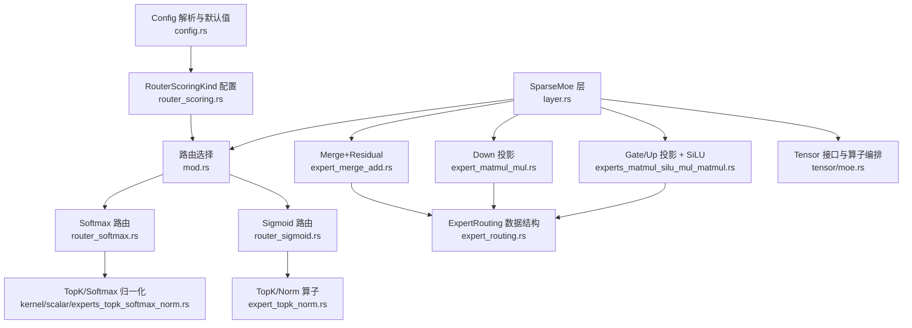
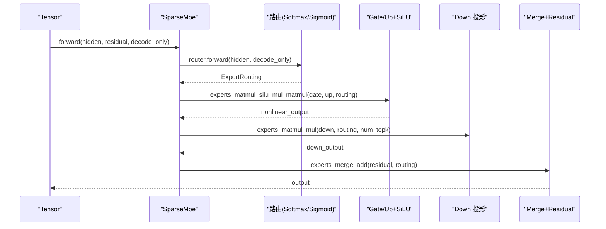
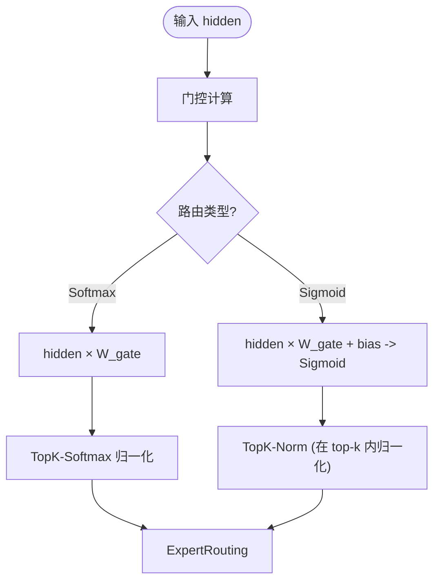
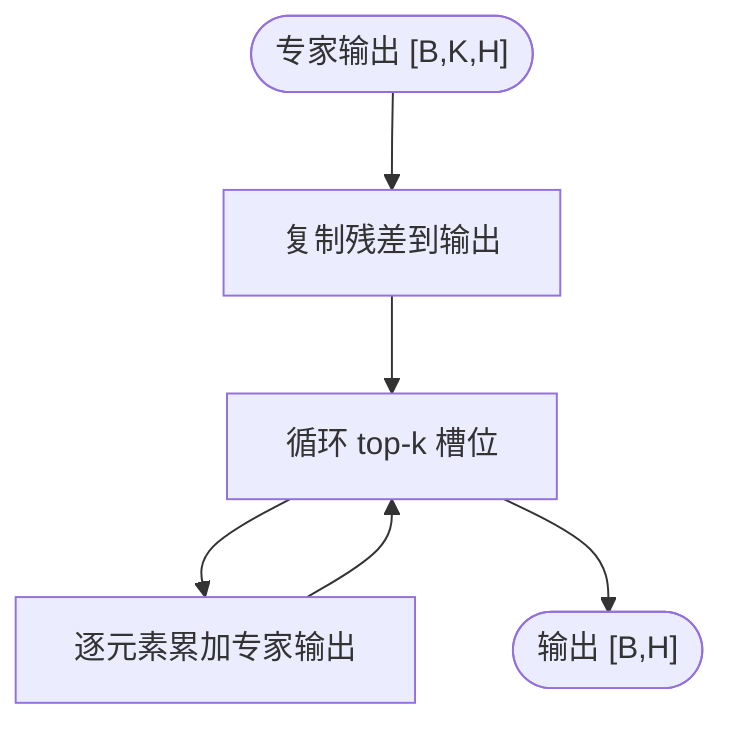
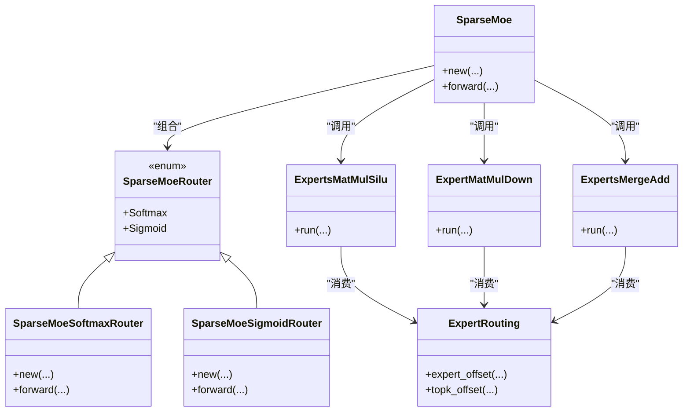

# 专家混合网络

<cite>
**本文引用的文件**   
- [src/transformer/sparse_moe/mod.rs](file://src/transformer/sparse_moe/mod.rs)
- [src/transformer/sparse_moe/layer.rs](file://src/transformer/sparse_moe/layer.rs)
- [src/transformer/sparse_moe/router_sigmoid.rs](file://src/transformer/sparse_moe/router_sigmoid.rs)
- [src/transformer/sparse_moe/router_softmax.rs](file://src/transformer/sparse_moe/router_softmax.rs)
- [src/operators/expert/expert_routing.rs](file://src/operators/expert/expert_routing.rs)
- [src/operators/expert/expert_merge_add.rs](file://src/operators/expert/expert_merge_add.rs)
- [src/operators/expert/expert_topk_norm.rs](file://src/operators/expert/expert_topk_norm.rs)
- [src/operators/expert/expert_matmul_mul.rs](file://src/operators/expert/expert_matmul_mul.rs)
- [src/operators/expert/expert_matmul_silu_mul_matmul.rs](file://src/operators/expert/expert_matmul_silu_mul_matmul.rs)
- [src/tensor/moe.rs](file://src/tensor/moe.rs)
- [src/kernel/scalar/experts_topk_softmax_norm.rs](file://src/kernel/scalar/experts_topk_softmax_norm.rs)
- [src/transformer/config/router_scoring.rs](file://src/transformer/config/router_scoring.rs)
- [src/transformer/config/config.rs](file://src/transformer/config/config.rs)
- [src/transformer/sparse_moe/tests.rs](file://src/transformer/sparse_moe/tests.rs)
- [README.md](file://README.md)
</cite>

## 目录
1. [简介](#简介)
2. [项目结构](#项目结构)
3. [核心组件](#核心组件)
4. [架构总览](#架构总览)
5. [详细组件分析](#详细组件分析)
6. [依赖关系分析](#依赖关系分析)
7. [性能与优化](#性能与优化)
8. [故障排查指南](#故障排查指南)
9. [结论](#结论)
10. [附录](#附录)

## 简介
本技术文档围绕仓库中的专家混合网络（MoE）实现，系统性阐述其稀疏激活架构、路由算法（Sigmoid 与 Softmax）、专家选择与负载均衡、专家合并与累加、内存布局与计算优化、训练与微调要点、性能分析与调优方法，以及多专家并行策略与自定义路由扩展方式。文档以代码级事实为依据，辅以可视化图示，帮助读者从高层到细节全面理解 MoE 的实现与使用。

## 项目结构
MoE 相关代码主要分布在以下模块：
- 高层层封装与路由选择：sparse_moe 子模块
- 路由算子与拓扑：expert_routing、topk_norm、softmax_norm
- 专家前向与融合：gate/up/down 投影、SiLU 融合、down 投影、merge-add
- Tensor 接口与操作编排：tensor::moe 提供高层 API 并注册 Operator 队列
- 配置与模型族适配：router_scoring、config

图表来源
- [src/transformer/sparse_moe/layer.rs:1-200](file://src/transformer/sparse_moe/layer.rs#L1-L200)
- [src/transformer/sparse_moe/mod.rs:1-9](file://src/transformer/sparse_moe/mod.rs#L1-L9)
- [src/transformer/sparse_moe/router_softmax.rs:1-84](file://src/transformer/sparse_moe/router_softmax.rs#L1-L84)
- [src/transformer/sparse_moe/router_sigmoid.rs:1-77](file://src/transformer/sparse_moe/router_sigmoid.rs#L1-L77)
- [src/operators/expert/expert_matmul_silu_mul_matmul.rs:1-800](file://src/operators/expert/expert_matmul_silu_mul_matmul.rs#L1-L800)
- [src/operators/expert/expert_matmul_mul.rs:1-800](file://src/operators/expert/expert_matmul_mul.rs#L1-L800)
- [src/operators/expert/expert_merge_add.rs:1-601](file://src/operators/expert/expert_merge_add.rs#L1-L601)
- [src/operators/expert/expert_routing.rs:1-168](file://src/operators/expert/expert_routing.rs#L1-L168)
- [src/kernel/scalar/experts_topk_softmax_norm.rs:1-165](file://src/kernel/scalar/experts_topk_softmax_norm.rs#L1-L165)
- [src/operators/expert/expert_topk_norm.rs:1-164](file://src/operators/expert/expert_topk_norm.rs#L1-L164)
- [src/tensor/moe.rs:1-332](file://src/tensor/moe.rs#L1-L332)
- [src/transformer/config/router_scoring.rs:1-23](file://src/transformer/config/router_scoring.rs#L1-L23)
- [src/transformer/config/config.rs:1-136](file://src/transformer/config/config.rs#L1-L136)

章节来源
- [src/transformer/sparse_moe/mod.rs:1-9](file://src/transformer/sparse_moe/mod.rs#L1-L9)
- [src/transformer/sparse_moe/layer.rs:1-200](file://src/transformer/sparse_moe/layer.rs#L1-L200)
- [src/transformer/config/router_scoring.rs:1-23](file://src/transformer/config/router_scoring.rs#L1-L23)
- [src/transformer/config/config.rs:1-136](file://src/transformer/config/config.rs#L1-L136)

## 核心组件
- SparseMoe 层：负责路由选择、专家门控与上下投影、残差融合；对外暴露 forward 接口。
- 路由后端：Softmax 路由与 Sigmoid 路由两种实现，统一返回 ExpertRouting。
- ExpertRouting：紧凑的“按专家分桶”的路由结果，包含 token 索引、分数、top-k 索引与每专家计数。
- 专家计算：Gate/Up 投影 + SiLU 融合、Down 投影、Merge+Residual 三个关键阶段。
- Tensor 接口：将上述步骤抽象为 Operator 入队执行，支持延迟执行与多线程调度。

章节来源
- [src/transformer/sparse_moe/layer.rs:74-199](file://src/transformer/sparse_moe/layer.rs#L74-L199)
- [src/operators/expert/expert_routing.rs:44-65](file://src/operators/expert/expert_routing.rs#L44-L65)
- [src/tensor/moe.rs:30-135](file://src/tensor/moe.rs#L30-L135)

## 架构总览
MoE 层的典型前向流程如下：
- 输入 hidden_states 进入路由分支（Softmax 或 Sigmoid），生成 ExpertRouting。
- 基于 ExpertRouting 进行 Gate/Up 投影与 SiLU 融合，得到非线性中间表示。
- 对每个专家输出进行 Down 投影，并按 top-k 权重散写到 token-major 的输出槽位。
- 最后对所有 top-k 专家输出求和并与残差相加，得到最终输出。

图表来源
- [src/transformer/sparse_moe/layer.rs:152-198](file://src/transformer/sparse_moe/layer.rs#L152-L198)
- [src/tensor/moe.rs:95-135](file://src/tensor/moe.rs#L95-L135)
- [src/operators/expert/expert_matmul_silu_mul_matmul.rs:367-559](file://src/operators/expert/expert_matmul_silu_mul_matmul.rs#L367-L559)
- [src/operators/expert/expert_matmul_mul.rs:399-578](file://src/operators/expert/expert_matmul_mul.rs#L399-L578)
- [src/operators/expert/expert_merge_add.rs:90-149](file://src/operators/expert/expert_merge_add.rs#L90-L149)

## 详细组件分析

### 路由算法：Softmax 与 Sigmoid
- Softmax 路由：先对 hidden 与 gate 权重做矩阵乘法，再对每个 token 的专家得分执行 TopK-Softmax 归一化，得到 top-k 专家及其概率。
- Sigmoid 路由：先对 hidden 与 gate 权重做带可选偏置的 Sigmoid 门控，再对每个 token 的专家得分执行 TopK-Norm（在选出的 top-k 内归一化）。

图表来源
- [src/transformer/sparse_moe/router_softmax.rs:57-83](file://src/transformer/sparse_moe/router_softmax.rs#L57-L83)
- [src/transformer/sparse_moe/router_sigmoid.rs:57-76](file://src/transformer/sparse_moe/router_sigmoid.rs#L57-L76)
- [src/kernel/scalar/experts_topk_softmax_norm.rs:5-59](file://src/kernel/scalar/experts_topk_softmax_norm.rs#L5-L59)
- [src/operators/expert/expert_topk_norm.rs:53-103](file://src/operators/expert/expert_topk_norm.rs#L53-L103)

适用场景与差异
- Softmax 路由：适合需要严格概率分布的场景，便于控制专家选择的平滑性与可解释性。
- Sigmoid 路由：允许独立阈值式选择，配合可选路由偏置，常用于特定模型族（如 MiniMaxM2）的偏好设置。

章节来源
- [src/transformer/config/router_scoring.rs:1-23](file://src/transformer/config/router_scoring.rs#L1-L23)
- [src/transformer/config/config.rs:55-59](file://src/transformer/config/config.rs#L55-L59)
- [src/transformer/sparse_moe/router_softmax.rs:1-84](file://src/transformer/sparse_moe/router_softmax.rs#L1-L84)
- [src/transformer/sparse_moe/router_sigmoid.rs:1-77](file://src/transformer/sparse_moe/router_sigmoid.rs#L1-L77)

### 专家选择与负载均衡
- 选择策略：通过 TopK 选择每个 token 的前 k 个专家，并在相应路径下进行归一化（Softmax 或 Sigmoid 后 TopK-Norm）。
- 负载均衡机制：
  - 路由阶段采用“按专家分桶”的紧凑队列，避免重复扫描稠密布尔矩阵，减少线程间竞争。
  - 使用原子计数器记录每专家的 token 数量，后续专家计算直接读取有效范围，避免无效遍历。
  - 测试覆盖单线程与多线程一致性，确保并发写入的正确性。

章节来源
- [src/operators/expert/expert_routing.rs:44-65](file://src/operators/expert/expert_routing.rs#L44-L65)
- [src/operators/expert/expert_topk_norm.rs:53-103](file://src/operators/expert/expert_topk_norm.rs#L53-L103)
- [src/transformer/sparse_moe/tests.rs:189-215](file://src/transformer/sparse_moe/tests.rs#L189-L215)

### 专家合并与累加
- Merge+Residual：将每个 token 的 top-k 专家输出按权重累加，并与残差相加。该阶段仅做逐元素加法，无矩阵乘法。
- 多线程安全：在 run 开始时可选择重置路由计数，保证下一轮路由前的状态干净。

图表来源
- [src/operators/expert/expert_merge_add.rs:90-149](file://src/operators/expert/expert_merge_add.rs#L90-L149)

章节来源
- [src/operators/expert/expert_merge_add.rs:1-601](file://src/operators/expert/expert_merge_add.rs#L1-L601)

### 内存布局与计算优化
- 紧凑路由结构：index_tensor 与 score_tensor 按专家维度连续存储，避免稠密 bool 矩阵的二次扫描。
- 预打包权重面板：在 new() 中预先打包 B 面板，run() 只读已构建的内存，降低运行时开销。
- 微内核与 tile 划分：按 micro_tile_rows × micro_tile_cols 切分，结合宏块与规约块步长，提升缓存命中与 SIMD 利用率。
- 线程私有池：a_tile、acc、idx_buf 等 per-thread 缓冲避免动态分配与锁竞争。

章节来源
- [src/operators/expert/expert_matmul_silu_mul_matmul.rs:97-198](file://src/operators/expert/expert_matmul_silu_mul_matmul.rs#L97-L198)
- [src/operators/expert/expert_matmul_mul.rs:103-197](file://src/operators/expert/expert_matmul_mul.rs#L103-L197)
- [src/tensor/moe.rs:246-288](file://src/tensor/moe.rs#L246-L288)

### 训练与微调指南
- 路由类型与偏置：根据模型族与配置决定使用 Softmax 或 Sigmoid，以及是否启用路由偏置。
- 层计划与参数：intermediate_size 与 moe_intermediate_size 影响专家容量与计算量；num_experts_per_tok 控制稀疏度。
- 建议：
  - 在数据规模较小或长上下文 decode 时，优先评估 Sigmoid 路由与路由偏置的组合效果。
  - 调整 num_experts_per_tok 以平衡精度与吞吐；过小可能导致负载不均，过大则增加通信与计算成本。

章节来源
- [src/transformer/config/config.rs:48-82](file://src/transformer/config/config.rs#L48-L82)
- [src/transformer/config/router_scoring.rs:12-22](file://src/transformer/config/router_scoring.rs#L12-L22)

### 性能分析与调优方法
- 小 batch 与瘦矩阵：CPU 对小批、低维不规则矩阵更友好，利用 L3 缓存提高复用率。
- MoE 负载不均：单机 CPU 上无需跨设备分布专家，避免跨设备通信与负载不均衡问题。
- 访存模式：静态连续 KV tensor 与坐标访问带来线性访存，利于硬件预取与缓存。
- Kernel 启动开销：函数调用执行路径稳定，在小粒度任务下更具优势。

章节来源
- [README.md:157-182](file://README.md#L157-L182)

### 多专家并行执行策略
- 任务空间构建：按 expert 统计路由 token 数，划分为 token 宏块与输出列宏块，形成全局任务 ID。
- 线程分配：assign(total_tasks, thread_num, thread_id) 将任务均匀分配到各线程。
- 局部收集与写回：线程私有 buffer 收集 routed tokens，按 micro tile 累积后写回 token-major 输出槽位。

章节来源
- [src/operators/expert/expert_matmul_silu_mul_matmul.rs:311-365](file://src/operators/expert/expert_matmul_silu_mul_matmul.rs#L311-L365)
- [src/operators/expert/expert_matmul_mul.rs:313-397](file://src/operators/expert/expert_matmul_mul.rs#L313-L397)

### 自定义路由算法扩展指南
- 扩展点：在 SparseMoeRouter 枚举中添加新路由变体，并在 new/forward 中分发。
- 返回契约：必须返回统一的 ExpertRouting 结构，包含 index_tensor、score_tensor、topk_indices 与 expert_counts。
- 归一化与 TopK：参考现有 kernel 实现，确保数值稳定性与性能。
- 测试验证：新增单元测试覆盖单/多线程一致性与边界条件。

章节来源
- [src/transformer/sparse_moe/mod.rs:1-9](file://src/transformer/sparse_moe/mod.rs#L1-L9)
- [src/transformer/sparse_moe/layer.rs:14-72](file://src/transformer/sparse_moe/layer.rs#L14-L72)
- [src/operators/expert/expert_routing.rs:44-65](file://src/operators/expert/expert_routing.rs#L44-L65)

## 依赖关系分析
MoE 层与其内部组件的依赖关系如下：

图表来源
- [src/transformer/sparse_moe/layer.rs:14-72](file://src/transformer/sparse_moe/layer.rs#L14-L72)
- [src/transformer/sparse_moe/router_softmax.rs:10-55](file://src/transformer/sparse_moe/router_softmax.rs#L10-L55)
- [src/transformer/sparse_moe/router_sigmoid.rs:7-55](file://src/transformer/sparse_moe/router_sigmoid.rs#L7-L55)
- [src/operators/expert/expert_routing.rs:44-65](file://src/operators/expert/expert_routing.rs#L44-L65)
- [src/operators/expert/expert_matmul_silu_mul_matmul.rs:36-91](file://src/operators/expert/expert_matmul_silu_mul_matmul.rs#L36-L91)
- [src/operators/expert/expert_matmul_mul.rs:41-89](file://src/operators/expert/expert_matmul_mul.rs#L41-L89)
- [src/operators/expert/expert_merge_add.rs:37-56](file://src/operators/expert/expert_merge_add.rs#L37-L56)

## 性能与优化
- 路由阶段：
  - 使用紧凑队列替代稠密布尔矩阵，减少重复扫描与线程冲突。
  - 原子计数与局部缓冲结合，降低竞争与分配开销。
- 专家计算：
  - 预打包权重面板，run 阶段只读，提升缓存命中率。
  - 微内核 tile 与宏块步长协同，最大化 SIMD 与寄存器复用。
- 合并阶段：
  - 纯逐元素加法，SIMD 特化路径（AVX-512 FP16）显著加速。
- 整体：
  - 在长上下文 decode 与小 batch 场景下，CPU 的稳定性与缓存优势明显。

章节来源
- [src/operators/expert/expert_matmul_silu_mul_matmul.rs:643-799](file://src/operators/expert/expert_matmul_silu_mul_matmul.rs#L643-L799)
- [src/operators/expert/expert_matmul_mul.rs:652-779](file://src/operators/expert/expert_matmul_mul.rs#L652-L779)
- [src/operators/expert/expert_merge_add.rs:173-186](file://src/operators/expert/expert_merge_add.rs#L173-L186)
- [README.md:157-182](file://README.md#L157-L182)

## 故障排查指南
- 路由计数未清零：确保在 merge-add 阶段 reset_gating=true 或在路由前清空 atomic counters。
- 单/多线程不一致：检查 assign 与 task_assign 的任务划分逻辑，确认线程私有 buffer 正确初始化。
- 形状不匹配：路由权重形状需为 [num_experts, hidden_size]，Gate/Up/Down 权重形状需与接口约定一致。
- 数值稳定性：TopK-Softmax 归一化注意减去最大值以避免溢出；Sigmoid 路由的偏置需合理初始化。

章节来源
- [src/operators/expert/expert_merge_add.rs:109-117](file://src/operators/expert/expert_merge_add.rs#L109-L117)
- [src/operators/expert/expert_topk_norm.rs:64-68](file://src/operators/expert/expert_topk_norm.rs#L64-L68)
- [src/transformer/sparse_moe/router_softmax.rs:43-47](file://src/transformer/sparse_moe/router_softmax.rs#L43-L47)
- [src/transformer/sparse_moe/router_sigmoid.rs:42-46](file://src/transformer/sparse_moe/router_sigmoid.rs#L42-L46)

## 结论
本 MoE 实现以紧凑路由结构与高效专家计算为核心，兼顾稀疏激活与多核并行。Softmax 与 Sigmoid 路由提供了不同权衡的选择；预打包权重与微内核 tile 设计显著提升性能；测试覆盖确保单/多线程一致性。针对长上下文与小 batch 场景，CPU 平台具备稳定与可预测的优势。未来可扩展更多路由策略与负载均衡机制，进一步提升吞吐与精度。

## 附录
- 算子队列结构验证：测试断言了 Softmax 与 Sigmoid 路由下的算子顺序与数量，有助于快速定位链路问题。
- 零权重行为：当所有权重为零时，输出应与残差完全一致（位级相等），可用于回归校验。

章节来源
- [src/transformer/sparse_moe/tests.rs:92-164](file://src/transformer/sparse_moe/tests.rs#L92-L164)
- [src/transformer/sparse_moe/tests.rs:166-186](file://src/transformer/sparse_moe/tests.rs#L166-L186)