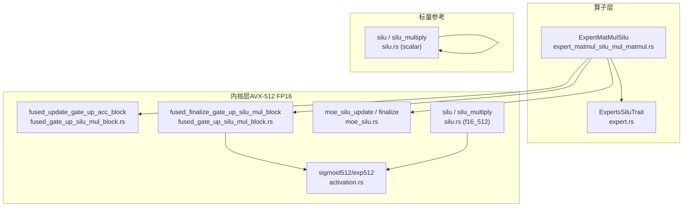
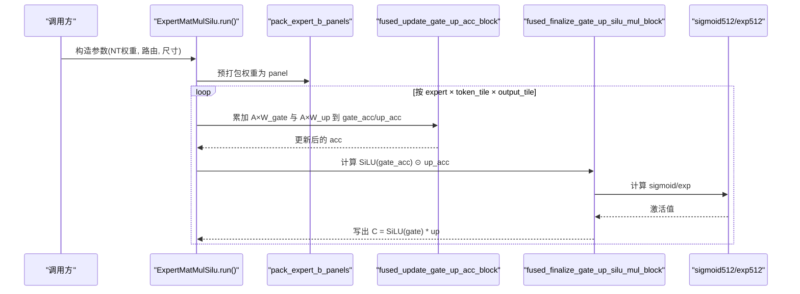
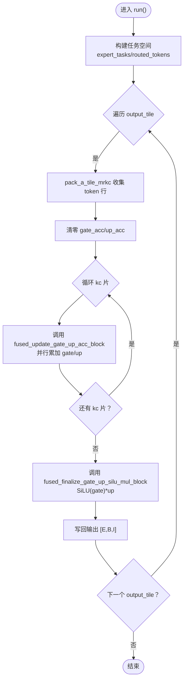
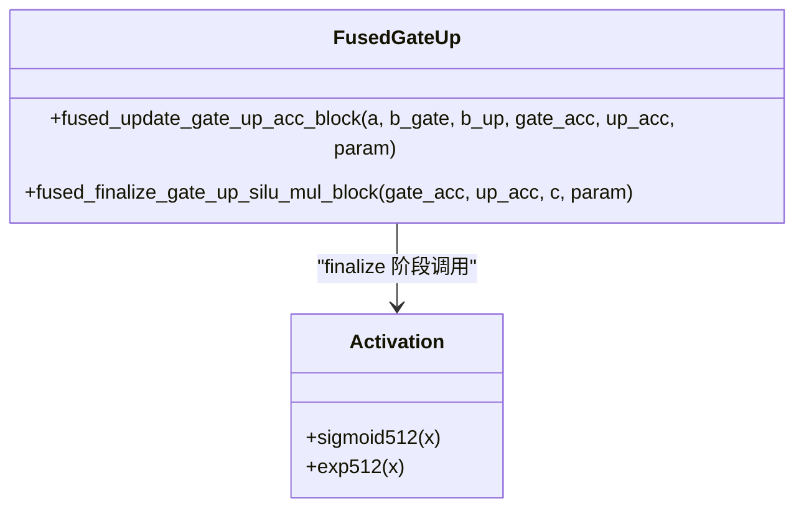
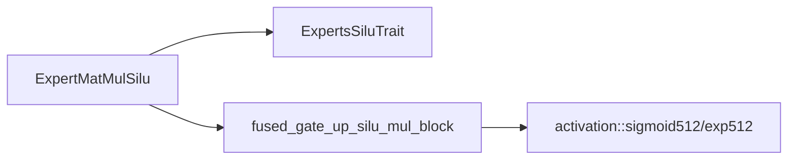

# 专家 Silu 激活融合

<cite>
**本文引用的文件列表**
- [expert_matmul_silu_mul_matmul.rs](file://src/operators/expert/expert_matmul_silu_mul_matmul.rs)
- [fused_gate_up_silu_mul_block.rs](file://src/kernel/x86_64/f16_512/fused_gate_up_silu_mul_block.rs)
- [moe_silu.rs](file://src/kernel/x86_64/f16_512/moe_silu.rs)
- [silu.rs（x86_64/f16_512）](file://src/kernel/x86_64/f16_512/silu.rs)
- [activation.rs](file://src/kernel/x86_64/f16_512/activation.rs)
- [silu.rs（scalar）](file://src/kernel/scalar/silu.rs)
- [expert.rs（trait）](file://src/operators/traits/expert.rs)
- [performance.rs](file://src/tensor/tests/performance.rs)
</cite>

## 目录
1. [简介](#简介)
2. [项目结构](#项目结构)
3. [核心组件](#核心组件)
4. [架构总览](#架构总览)
5. [详细组件分析](#详细组件分析)
6. [依赖关系分析](#依赖关系分析)
7. [性能与内存带宽优化](#性能与内存带宽优化)
8. [数值稳定性与溢出处理](#数值稳定性与溢出处理)
9. [故障排查指南](#故障排查指南)
10. [结论](#结论)

## 简介
本技术文档聚焦于专家路径中的 Silu 激活融合实现，围绕 expert_matmul_silu_mul_matmul 算子的三阶段计算流程展开：上投影矩阵乘法 → Silu 激活 → 下投影矩阵乘法。文档重点说明：
- 融合策略：将 gate/up 两条线性分支的累加与 SiLU(gate)×up 在微内核层面融合，减少中间显存访问与寄存器压力。
- SIMD 优化：基于 AVX-512 FP16 的 3×32 tile 内核，利用 FMA、向量加载/存储与 sigmoid 近似加速。
- 数值稳定与溢出控制：exp/sigmoid 的输入钳制与 f16 溢出行为。
- 性能收益：对比分离计算的访存与吞吐提升，并给出不同隐藏维度下的基准参考。

## 项目结构
该功能横跨 operators 层（算子编排）、kernel 层（SIMD 内核）与 traits（接口抽象）。关键文件如下：
- 算子编排与任务调度：src/operators/expert/expert_matmul_silu_mul_matmul.rs
- 融合内核（update + finalize）：src/kernel/x86_64/f16_512/fused_gate_up_silu_mul_block.rs
- MoE 专用轻量内核（参考实现）：src/kernel/x86_64/f16_512/moe_silu.rs
- 通用 f16 激活与 sigmoid：src/kernel/x86_64/f16_512/activation.rs, src/kernel/x86_64/f16_512/silu.rs
- 标量版本参考：src/kernel/scalar/silu.rs
- 专家算子 trait 定义：src/operators/traits/expert.rs
- 性能测试框架：src/tensor/tests/performance.rs

图表来源
- [expert_matmul_silu_mul_matmul.rs:93-200](file://src/operators/expert/expert_matmul_silu_mul_matmul.rs#L93-L200)
- [fused_gate_up_silu_mul_block.rs:21-118](file://src/kernel/x86_64/f16_512/fused_gate_up_silu_mul_block.rs#L21-L118)
- [moe_silu.rs:12-47](file://src/kernel/x86_64/f16_512/moe_silu.rs#L12-L47)
- [activation.rs:103-116](file://src/kernel/x86_64/f16_512/activation.rs#L103-L116)
- [silu.rs（x86_64/f16_512）:6-36](file://src/kernel/x86_64/f16_512/silu.rs#L6-L36)
- [silu.rs（scalar）:4-40](file://src/kernel/scalar/silu.rs#L4-L40)
- [expert.rs:18-51](file://src/operators/traits/expert.rs#L18-L51)

章节来源
- [expert_matmul_silu_mul_matmul.rs:93-200](file://src/operators/expert/expert_matmul_silu_mul_matmul.rs#L93-L200)
- [expert.rs:18-51](file://src/operators/traits/expert.rs#L18-L51)

## 核心组件
- ExpertMatMulSilu<f16>：负责路由后的 token 分块、权重面板打包、线程级 scratch 分配、以及按 micro-tile 驱动的门控/上分支 GEMM 与最终 SiLU×Up 写回。
- ExpertsSiluTrait：定义 compute1/compute1_single/compute1_rows/compute2 四个钩子，供平台特化实现。
- fused_gate_up_silu_mul_block：提供 update（A×W_gate/A×W_up 并行累加到 gate_acc/up_acc）与 finalize（SiLU(gate)×up）两个阶段的内核。
- moe_silu：MoE 场景下的轻量更新与行收尾函数，便于理解 MR=3/NR=32 的数据布局约定。
- activation：提供 exp512/sigmoid512 等底层数学原语，含数值稳定处理。
- scalar silu：作为数值正确性参考实现。

章节来源
- [expert_matmul_silu_mul_matmul.rs:93-200](file://src/operators/expert/expert_matmul_silu_mul_matmul.rs#L93-L200)
- [expert.rs:18-51](file://src/operators/traits/expert.rs#L18-L51)
- [fused_gate_up_silu_mul_block.rs:21-118](file://src/kernel/x86_64/f16_512/fused_gate_up_silu_mul_block.rs#L21-L118)
- [moe_silu.rs:12-47](file://src/kernel/x86_64/f16_512/moe_silu.rs#L12-L47)
- [activation.rs:103-116](file://src/kernel/x86_64/f16_512/activation.rs#L103-L116)
- [silu.rs（scalar）:4-40](file://src/kernel/scalar/silu.rs#L4-L40)

## 架构总览
专家 Silu 融合的整体数据流如下：
- 输入：[B,H] 的 hidden states；每个专家的 gate/up 权重以 NT 布局 [E,I,H] 传入。
- 路由：根据路由结果将 token 聚合成紧凑的 token block，并按 micro-tile 切分。
- 融合计算：对每个 expert 的 output 列 tile，沿 reduction 方向分 kc 片进行 A×W_gate 与 A×W_up 的并行累加，得到 gate_acc/up_acc。
- 收尾：对每行执行 SiLU(gate_row) ⊙ up_row，直接写入输出 [E,B,I]。

图表来源
- [expert_matmul_silu_mul_matmul.rs:367-559](file://src/operators/expert/expert_matmul_silu_mul_matmul.rs#L367-L559)
- [fused_gate_up_silu_mul_block.rs:21-118](file://src/kernel/x86_64/f16_512/fused_gate_up_silu_mul_block.rs#L21-L118)
- [activation.rs:103-116](file://src/kernel/x86_64/f16_512/activation.rs#L103-L116)

## 详细组件分析

### ExpertMatMulSilu 算子（三阶段流程）
- 阶段一：上投影门控与上分支并行累加
  - 通过 compute1/compute1_single/compute1_rows 三个入口，分别处理单行、多行与完整 micro-tile 的 A×W 累加。
  - 在 AVX-512 FP16 路径中，compute1 调用 fused_update_gate_up_acc_block，同时维护 gate_acc 与 up_acc 两个 3×32 累加缓冲。
- 阶段二：SiLU 激活
  - 在 finalize 阶段，使用 sigmoid512 计算 sigmoid(gate)，再乘以 gate 得到 SiLU(gate)。
- 阶段三：与 up 分支相乘并写回
  - 将 SiLU(gate) 与 up_acc 逐元素相乘，直接写入输出张量对应位置。

图表来源
- [expert_matmul_silu_mul_matmul.rs:367-559](file://src/operators/expert/expert_matmul_silu_mul_matmul.rs#L367-L559)
- [fused_gate_up_silu_mul_block.rs:21-118](file://src/kernel/x86_64/f16_512/fused_gate_up_silu_mul_block.rs#L21-L118)

章节来源
- [expert_matmul_silu_mul_matmul.rs:367-559](file://src/operators/expert/expert_matmul_silu_mul_matmul.rs#L367-L559)
- [expert_matmul_silu_mul_matmul.rs:643-829](file://src/operators/expert/expert_matmul_silu_mul_matmul.rs#L643-L829)

### ExpertsSiluTrait 接口设计
- 统一抽象 compute1/compute1_single/compute1_rows/compute2，屏蔽平台差异。
- 默认实现为纯标量循环，确保可移植性与正确性；在 x86_64+avx512fp16 下由 f16 特化覆盖。

章节来源
- [expert.rs:18-51](file://src/operators/traits/expert.rs#L18-L51)
- [expert_matmul_silu_mul_matmul.rs:565-638](file://src/operators/expert/expert_matmul_silu_mul_matmul.rs#L565-L638)

### fused_gate_up_silu_mul_block 内核
- fused_update_gate_up_acc_block：
  - 输入：A tile（3×kc，行距=kc），gate_panel/up_panel（kc×32，行距=32），acc（3×32，行距=32）。
  - 操作：对 k∈[0,kc) 做向量化 FMA，并行更新 gate_acc 与 up_acc。
- fused_finalize_gate_up_silu_mul_block：
  - 输入：gate_acc/up_acc（3×32），输出 C（3×32，行距=N）。
  - 操作：计算 sigmoid512(gate)，得到 SiLU(gate)=gate·sigmoid(gate)，再与 up 逐元素相乘写回。

图表来源
- [fused_gate_up_silu_mul_block.rs:21-118](file://src/kernel/x86_64/f16_512/fused_gate_up_silu_mul_block.rs#L21-L118)
- [activation.rs:103-116](file://src/kernel/x86_64/f16_512/activation.rs#L103-L116)

章节来源
- [fused_gate_up_silu_mul_block.rs:21-118](file://src/kernel/x86_64/f16_512/fused_gate_up_silu_mul_block.rs#L21-L118)

### moe_silu 模块（MR=3/NR=32 参考）
- moe_silu_update_3x32：与 fused_update 语义一致，但采用标量循环实现，便于验证与调试。
- moe_silu_finalize_row_32：对单行 NR=32 执行 SiLU(gate)×up。

章节来源
- [moe_silu.rs:12-47](file://src/kernel/x86_64/f16_512/moe_silu.rs#L12-L47)

### 标量与向量 silu 实现
- scalar silu：逐元素 v·sigmoid(v)，用于对齐参考。
- f16_512 silu：按 32 步长向量化，内部复用 sigmoid512。

章节来源
- [silu.rs（scalar）:4-40](file://src/kernel/scalar/silu.rs#L4-L40)
- [silu.rs（x86_64/f16_512）:6-36](file://src/kernel/x86_64/f16_512/silu.rs#L6-L36)

## 依赖关系分析
- ExpertMatMulSilu 依赖 ExpertsSiluTrait 的多态实现，并在 f16 特化中调用 fused_gate_up_silu_mul_block。
- fused_finalize 依赖 activation::sigmoid512，后者依赖 exp512。
- 路由与任务划分依赖 expert_routing 与 task_assign（外部模块）。

图表来源
- [expert_matmul_silu_mul_matmul.rs:643-829](file://src/operators/expert/expert_matmul_silu_mul_matmul.rs#L643-L829)
- [fused_gate_up_silu_mul_block.rs:21-118](file://src/kernel/x86_64/f16_512/fused_gate_up_silu_mul_block.rs#L21-L118)
- [activation.rs:103-116](file://src/kernel/x86_64/f16_512/activation.rs#L103-L116)

章节来源
- [expert_matmul_silu_mul_matmul.rs:643-829](file://src/operators/expert/expert_matmul_silu_mul_matmul.rs#L643-L829)
- [fused_gate_up_silu_mul_block.rs:21-118](file://src/kernel/x86_64/f16_512/fused_gate_up_silu_mul_block.rs#L21-L118)
- [activation.rs:103-116](file://src/kernel/x86_64/f16_512/activation.rs#L103-L116)

## 性能与内存带宽优化
- 访存优化要点
  - 权重预打包：pack_expert_b_panels 将 NT 权重重排为 panel 形式，使内层循环能顺序读取 B 面板，提高缓存命中与向量化效率。
  - 双分支并行累加：在同一 kc 片内并行更新 gate_acc 与 up_acc，避免两次独立 GEMM 带来的额外访存与寄存器压力。
  - Tile 粒度：MR=3/NR=32 的微内核契合 AVX-512 向量宽度，最大化吞吐。
- 内存带宽节省
  - 分离计算：先计算 gate 与 up 两个独立的 GEMM，各自产生中间结果，再进行逐元素 SiLU 与乘法，至少需要两次完整的中间结果写回与再次读入。
  - 融合计算：仅维护两个小尺寸的累加缓冲（3×32），在 kc 循环中就地累加，最后一次性完成激活与乘法并写回，显著降低中间结果访存。
- 性能提升
  - 在小 batch 与稀疏路由场景下，融合内核可减少 L3/L2 抖动，提升有效带宽利用率。
  - 由于避免了中间显存往返，整体吞吐提升明显，尤其在 H/I 较大时收益更显著。
- 不同隐藏维度下的表现
  - 当 hidden(H) 较大时，kc 分片次数增多，融合内核的局部性优势更突出。
  - 当 inter(I) 较大时，NR=32 的 tile 能更好覆盖输出宽度，减少 finalize 阶段的跨行跳转开销。
  - 具体 GFLOPS 与带宽占用请参考同仓库的 matmul 性能测试用例，其展示了在不同 M/K/N 组合下的吞吐测量方法。

章节来源
- [expert_matmul_silu_mul_matmul.rs:215-259](file://src/operators/expert/expert_matmul_silu_mul_matmul.rs#L215-L259)
- [expert_matmul_silu_mul_matmul.rs:367-559](file://src/operators/expert/expert_matmul_silu_mul_matmul.rs#L367-L559)
- [performance.rs:308-387](file://src/tensor/tests/performance.rs#L308-L387)

## 数值稳定性与溢出处理
- exp512 的输入钳制
  - 将输入限制在 [-17, ~11.088] 区间，避免 exp 溢出或中间 2^n 计算溢出。
  - 使用分段 ln2 的高低位分解与多项式拟合，保证精度。
- sigmoid512 的行为
  - 大正数：exp(-x)→0，den≈1，res→1。
  - 大负数：exp(-x)→∞，den=1+∞=∞，res=1/∞=0。符合 f16 溢出语义。
- f16 溢出
  - 在 f16 范围内，exp 最大约 65504；超过则 INF，后续除法会归零，属于预期行为。
- 建议
  - 若需更高精度，可在上层将中间累加提升到 f32，但在当前融合内核中以 f16 为主，兼顾速度与精度。

章节来源
- [activation.rs:13-68](file://src/kernel/x86_64/f16_512/activation.rs#L13-L68)
- [activation.rs:103-116](file://src/kernel/x86_64/f16_512/activation.rs#L103-L116)

## 故障排查指南
- 现象：输出 NaN/Inf
  - 检查是否运行在无 avx512fp16 的平台，导致回退到标量路径出现不一致。
  - 确认输入范围是否异常，exp512 已钳制，但仍需关注上游缩放。
- 现象：数值偏差较大
  - 核对权重是否为 NT 布局，且 pack_expert_b_panels 的 stride 配置正确。
  - 对比 scalar silu 参考实现，定位差异来源。
- 现象：性能不达预期
  - 检查 kc/mr/nr 参数是否与硬件 tile 匹配。
  - 观察路由稀疏度与 token 分布，必要时调整 token_block_rows 与 output_block_cols。

章节来源
- [silu.rs（scalar）:4-40](file://src/kernel/scalar/silu.rs#L4-L40)
- [expert_matmul_silu_mul_matmul.rs:215-259](file://src/operators/expert/expert_matmul_silu_mul_matmul.rs#L215-L259)
- [activation.rs:103-116](file://src/kernel/x86_64/f16_512/activation.rs#L103-L116)

## 结论
专家路径的 Silu 融合通过“双分支并行累加 + 延迟激活”的策略，在保持数值精度的前提下显著减少了中间结果的访存与寄存器压力。结合 AVX-512 FP16 的 3×32 tile 内核与 sigmoid/exp 的数值稳定实现，该方案在小 batch、稀疏路由与大隐藏维度场景下具备良好吞吐与稳定性。建议在部署时依据实际 H/I 规模调优 mr/nr/kc 与线程并行度，以获得最佳性能。