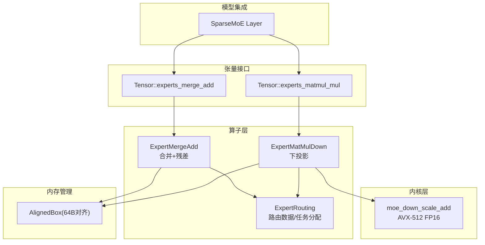
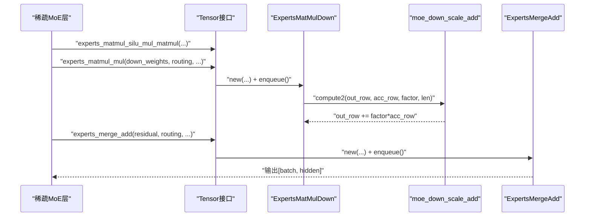
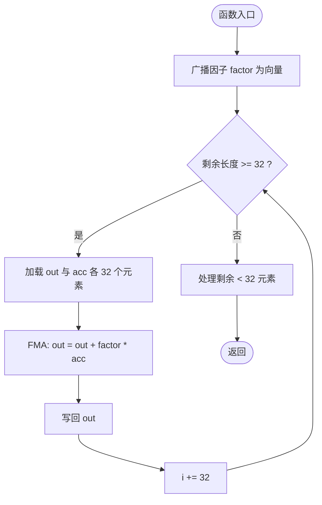
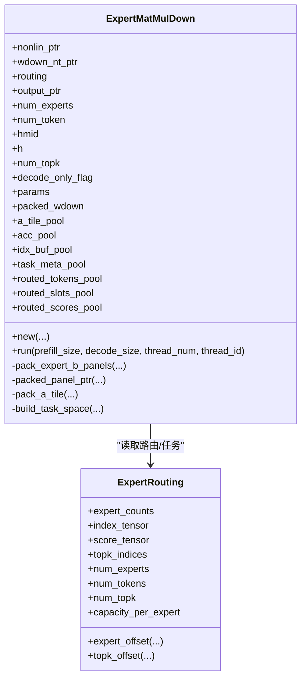
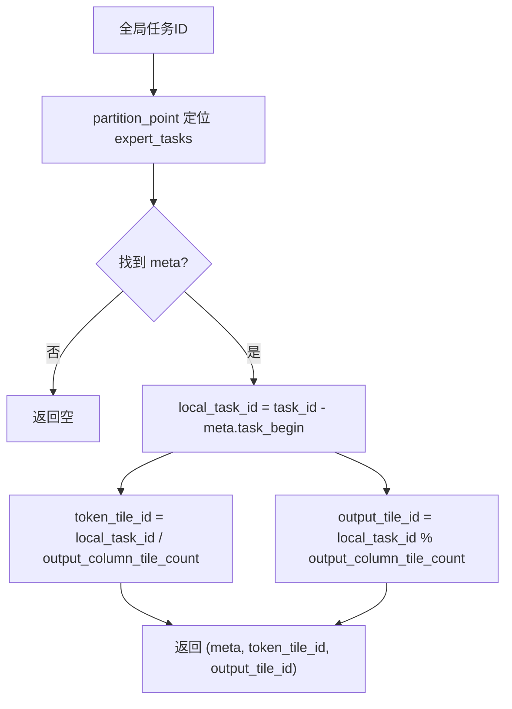
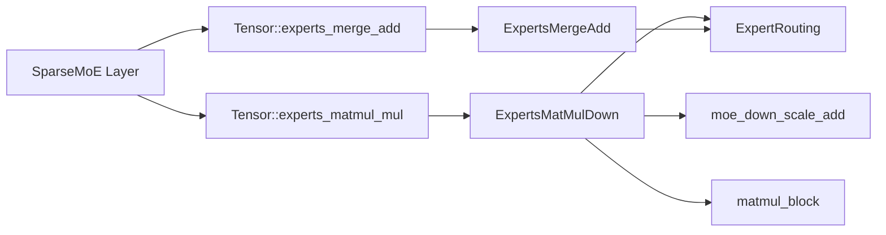

# 专家下投影优化

<cite>
**本文引用的文件**
- [src/kernel/x86_64/f16_512/moe_down.rs](file://src/kernel/x86_64/f16_512/moe_down.rs)
- [src/operators/expert/expert_matmul_mul.rs](file://src/operators/expert/expert_matmul_mul.rs)
- [src/operators/expert/expert_routing.rs](file://src/operators/expert/expert_routing.rs)
- [src/tensor/moe.rs](file://src/tensor/moe.rs)
- [src/operators/expert/expert_merge_add.rs](file://src/operators/expert/expert_merge_add.rs)
- [src/transformer/sparse_moe/layer.rs](file://src/transformer/sparse_moe/layer.rs)
- [src/mem_mgr/allocator.rs](file://src/mem_mgr/allocator.rs)
- [src/tensor/tests/performance.rs](file://src/tensor/tests/performance.rs)
</cite>

## 目录
1. [简介](#简介)
2. [项目结构](#项目结构)
3. [核心组件](#核心组件)
4. [架构总览](#架构总览)
5. [详细组件分析](#详细组件分析)
6. [依赖关系分析](#依赖关系分析)
7. [性能考量](#性能考量)
8. [故障排查指南](#故障排查指南)
9. [结论](#结论)
10. [附录](#附录)

## 简介
本技术文档聚焦于 MoE（混合专家）解码路径中的“专家下投影”阶段，围绕 moe_down_scale_add 内核与 ExpertMatMulDown 算子展开，系统阐述：
- 路由权重的缩放与累加策略
- token-major 输出布局的内存访问模式与缓存友好性设计
- top-k 专家选择结果的下标解析与 slot 映射机制
- 多专家并行计算时的线程私有缓冲区管理与同步策略
- 不同专家数量、token 规模与 hidden 维度组合下的基准测试方法与要点
- 解码模式下单 token 处理的特殊优化
- 内存对齐要求与 SIMD 向量化实现细节

## 项目结构
与“专家下投影”相关的代码主要分布在以下模块：
- 内核层：x86_64 f16_512 向量内核，提供 moe_down_scale_add 等 AVX-512 FP16 加速路径
- 算子层：expert_matmul_mul（下投影）、expert_routing（路由数据结构与任务分配）、expert_merge_add（合并与残差相加）
- 张量接口：tensor::moe 暴露 experts_matmul_mul / experts_merge_add 等高层 API
- 模型集成：sparse_moe layer 调用上投影与下投影并拼接残差
- 内存管理：AlignedBox 提供 64B 对齐分配，满足 SIMD 负载/存储需求
- 测试与基准：performance 测试覆盖多线程执行与 GFLOPs 统计方法

图示来源
- [src/kernel/x86_64/f16_512/moe_down.rs:1-36](file://src/kernel/x86_64/f16_512/moe_down.rs#L1-L36)
- [src/operators/expert/expert_matmul_mul.rs:1-800](file://src/operators/expert/expert_matmul_mul.rs#L1-L800)
- [src/operators/expert/expert_routing.rs:1-168](file://src/operators/expert/expert_routing.rs#L1-L168)
- [src/operators/expert/expert_merge_add.rs:1-601](file://src/operators/expert/expert_merge_add.rs#L1-L601)
- [src/tensor/moe.rs:1-332](file://src/tensor/moe.rs#L1-L332)
- [src/transformer/sparse_moe/layer.rs:170-199](file://src/transformer/sparse_moe/layer.rs#L170-L199)
- [src/mem_mgr/allocator.rs:1-56](file://src/mem_mgr/allocator.rs#L1-L56)

章节来源
- [src/kernel/x86_64/f16_512/moe_down.rs:1-36](file://src/kernel/x86_64/f16_512/moe_down.rs#L1-L36)
- [src/operators/expert/expert_matmul_mul.rs:1-800](file://src/operators/expert/expert_matmul_mul.rs#L1-L800)
- [src/operators/expert/expert_routing.rs:1-168](file://src/operators/expert/expert_routing.rs#L1-L168)
- [src/operators/expert/expert_merge_add.rs:1-601](file://src/operators/expert/expert_merge_add.rs#L1-L601)
- [src/tensor/moe.rs:1-332](file://src/tensor/moe.rs#L1-L332)
- [src/transformer/sparse_moe/layer.rs:170-199](file://src/transformer/sparse_moe/layer.rs#L170-L199)
- [src/mem_mgr/allocator.rs:1-56](file://src/mem_mgr/allocator.rs#L1-L56)

## 核心组件
- moe_down_scale_add：对 out += factor * acc 进行 32 元素向量化处理，并安全回退到标量尾部。
- ExpertMatMulDown：完成 NONLIN × W_down → OUT[b, slot(b,e), H] 的下投影；采用权重预打包、微内核 GEMM、按 micro_tile 分块、以及 token-major 输出 scatter。
- ExpertRouting：维护 per-expert 紧凑队列、top-k 索引、分数与计数；提供 task_assign 将全局任务映射到 expert 与局部 tile。
- ExpertMergeAdd：将每个 token 的 top-k 专家输出合并，并加上残差。
- Tensor 接口：封装上述算子为高层 API，便于在模型中调用。

章节来源
- [src/kernel/x86_64/f16_512/moe_down.rs:1-36](file://src/kernel/x86_64/f16_512/moe_down.rs#L1-L36)
- [src/operators/expert/expert_matmul_mul.rs:1-800](file://src/operators/expert/expert_matmul_mul.rs#L1-L800)
- [src/operators/expert/expert_routing.rs:1-168](file://src/operators/expert/expert_routing.rs#L1-L168)
- [src/operators/expert/expert_merge_add.rs:1-601](file://src/operators/expert/expert_merge_add.rs#L1-L601)
- [src/tensor/moe.rs:1-332](file://src/tensor/moe.rs#L1-L332)

## 架构总览
下图展示了从模型层到内核层的完整调用链与数据流，突出路由、下投影与合并三个阶段。

图示来源
- [src/transformer/sparse_moe/layer.rs:170-199](file://src/transformer/sparse_moe/layer.rs#L170-L199)
- [src/tensor/moe.rs:59-93](file://src/tensor/moe.rs#L59-L93)
- [src/operators/expert/expert_matmul_mul.rs:760-780](file://src/operators/expert/expert_matmul_mul.rs#L760-L780)
- [src/kernel/x86_64/f16_512/moe_down.rs:14-36](file://src/kernel/x86_64/f16_512/moe_down.rs#L14-L36)
- [src/tensor/moe.rs:30-57](file://src/tensor/moe.rs#L30-L57)
- [src/operators/expert/expert_merge_add.rs:90-149](file://src/operators/expert/expert_merge_add.rs#L90-L149)

## 详细组件分析

### moe_down_scale_add 内核
- 功能：out[i] += factor * acc[i]，以 32 个 f16 为一组使用 AVX-512 FP16 指令进行 FMA 融合乘加，剩余不足 32 的元素走标量尾处理。
- 输入约定：
  - out_ptr：指向 token-major 输出某一行（对应某个 token 的某个 top-k slot）的起始位置
  - acc_ptr：当前 micro_tile 行对应的累加器行
  - factor：该 token 路由到当前 expert 的权重
  - len：本次写入的列数（<= micro_tile_cols）
- 复杂度：O(len)，向量化吞吐提升显著，尾处理保证正确性。
- 适用场景：下投影完成后，将每个有效行的累加结果乘以路由权重后写回 token-major 输出。

图示来源
- [src/kernel/x86_64/f16_512/moe_down.rs:14-36](file://src/kernel/x86_64/f16_512/moe_down.rs#L14-L36)

章节来源
- [src/kernel/x86_64/f16_512/moe_down.rs:1-36](file://src/kernel/x86_64/f16_512/moe_down.rs#L1-L36)

### ExpertMatMulDown：下投影主流程
- 目标：NONLIN[e, b, Hmid] × W_down[e, Hmid, H] → OUT[b, slot(b,e), H]
- 关键设计：
  - 权重 NT 布局：W_down[e, H, Hmid]，每 expert 的 B 矩阵按 NT 组织，并在 new() 中预打包为 panel 形式，减少运行时访存开销。
  - 微内核 tile：默认 mr=3, nr=32，kc 由 column_step_macro 控制；通过 pack_a_tile 将稀疏 routed tokens 聚拢成连续 A tile，未用行补零。
  - 输出布局：token-major，即 [num_tokens, num_topk, H]；每个 token 的每个 top-k slot 独立一行，便于后续 merge_add 直接按行累加。
  - 路由权重缩放：在 compute2 中调用 moe_down_scale_add，将 acc 行乘以该 token 对该 expert 的路由权重后写回对应 slot。
  - 任务划分：build_task_space 构建 per-thread 的任务元信息，task_assign 将全局任务 ID 映射到具体 expert 与局部 tile。
- 线程私有缓冲：a_tile_pool、acc_pool、idx_buf_pool、routed_* 池等均在 new() 一次性分配，run() 复用，避免动态分配。
- 解码模式优化：decode_only_flag 配合 prefill_size/decode_size 控制活跃 token 范围；单 token 时走 compute1_single 路径，减少打包开销。

图示来源
- [src/operators/expert/expert_matmul_mul.rs:42-89](file://src/operators/expert/expert_matmul_mul.rs#L42-L89)
- [src/operators/expert/expert_routing.rs:43-65](file://src/operators/expert/expert_routing.rs#L43-L65)

章节来源
- [src/operators/expert/expert_matmul_mul.rs:119-149](file://src/operators/expert/expert_matmul_mul.rs#L119-L149)
- [src/operators/expert/expert_matmul_mul.rs:210-275](file://src/operators/expert/expert_matmul_mul.rs#L210-L275)
- [src/operators/expert/expert_matmul_mul.rs:277-310](file://src/operators/expert/expert_matmul_mul.rs#L277-L310)
- [src/operators/expert/expert_matmul_mul.rs:313-397](file://src/operators/expert/expert_matmul_mul.rs#L313-L397)
- [src/operators/expert/expert_matmul_mul.rs:399-578](file://src/operators/expert/expert_matmul_mul.rs#L399-L578)
- [src/operators/expert/expert_matmul_mul.rs:652-780](file://src/operators/expert/expert_matmul_mul.rs#L652-L780)

### 路由数据结构与任务分配
- ExpertRouting：
  - index_tensor：按 expert 压紧的 token 队列
  - score_tensor：对应位置的分数
  - topk_indices：token-major 的 top-k 专家列表，用于解析 slot
  - expert_counts：原子计数器，记录每个 expert 的有效 token 数
- task_assign：根据全局任务 ID 反查所属 expert 与局部 tile（token 块与输出列块）。

图示来源
- [src/operators/expert/expert_routing.rs:24-41](file://src/operators/expert/expert_routing.rs#L24-L41)

章节来源
- [src/operators/expert/expert_routing.rs:1-168](file://src/operators/expert/expert_routing.rs#L1-L168)

### Token-Major 输出布局与内存访问
- 布局：OUT[num_tokens, num_topk, H]
- 访问模式：
  - 下投影阶段：按 token 行 scatter 到对应 slot，write 路径为 out[token_id * (K*H) + slot * H + col]
  - 合并阶段：逐 token 遍历 K 个 slot，按行累加到 residual，再写回输出
- 缓存友好性：
  - 权重预打包使 B 面板按 micro_tile 连续，利于 L1/L2 命中
  - A tile 聚拢 routed tokens，减少跨 token 跳跃
  - 输出按行写入，merge_add 阶段顺序扫描隐藏维度，利于向量化

章节来源
- [src/operators/expert/expert_matmul_mul.rs:544-578](file://src/operators/expert/expert_matmul_mul.rs#L544-L578)
- [src/operators/expert/expert_merge_add.rs:128-149](file://src/operators/expert/expert_merge_add.rs#L128-L149)

### Top-K 下标解析与 Slot 映射
- 对于每个 routed token，在 build_task_space 中扫描其 topk_indices 行，匹配当前 expert_id，得到 topk_slot。
- 随后将 token_id、topk_slot、route_weight 分别写入 per-thread 的 routed_tokens/slots/scores 缓冲，供后续 write 阶段使用。

章节来源
- [src/operators/expert/expert_matmul_mul.rs:340-397](file://src/operators/expert/expert_matmul_mul.rs#L340-L397)

### 多专家并行与线程私有缓冲
- 线程私有池：
  - a_tile_pool：A 微 tile 缓存
  - acc_pool：累加器 tile 缓存
  - idx_buf_pool：路由 token 下标缓存
  - task_meta_pool/routed_*_pool：任务元信息与路由结果缓存
- 同步策略：
  - expert_counts 使用 AtomicUsize，release/acquire 语义确保可见性
  - run() 内部无共享可变状态，仅读共享只读数据，避免锁竞争

章节来源
- [src/operators/expert/expert_matmul_mul.rs:141-196](file://src/operators/expert/expert_matmul_mul.rs#L141-L196)
- [src/operators/expert/expert_routing.rs:43-65](file://src/operators/expert/expert_routing.rs#L43-L65)

### 解码模式下单 Token 优化
- decode_only_flag 结合 prefill_size/decode_size 控制活跃 token 集。
- 当 valid_rows == 1 时走 compute1_single 路径，避免打包 A tile 的额外拷贝，降低延迟。

章节来源
- [src/operators/expert/expert_matmul_mul.rs:489-503](file://src/operators/expert/expert_matmul_mul.rs#L489-L503)

### 内存对齐与 SIMD 向量化
- 对齐：AlignedBox 使用 64B 对齐分配，满足 AVX-512 向量负载/存储要求。
- 向量化：
  - moe_down_scale_add：32 个 f16 一次 FMA，尾部标量回退
  - matmul_block：3x32 微内核，支持 kc 分块
  - merge_add：f16 特化路径调用 moe_merge_add（同库内实现）

章节来源
- [src/mem_mgr/allocator.rs:1-56](file://src/mem_mgr/allocator.rs#L1-L56)
- [src/kernel/x86_64/f16_512/moe_down.rs:14-36](file://src/kernel/x86_64/f16_512/moe_down.rs#L14-L36)
- [src/operators/expert/expert_matmul_mul.rs:652-780](file://src/operators/expert/expert_matmul_mul.rs#L652-L780)

## 依赖关系分析
- 上层调用：sparse_moe layer 依次调用上投影、下投影与合并，形成完整 FFN 路径。
- 算子耦合：
  - ExpertMatMulDown 依赖 ExpertRouting 提供的路由结构与任务分配
  - ExpertMergeAdd 依赖 ExpertRouting 的 expert_counts 重置与 token-major 输入布局
- 外部依赖：
  - kernel::x86_64::f16_512 提供 AVX-512 FP16 内核
  - mem_mgr::allocator 提供对齐分配

图示来源
- [src/transformer/sparse_moe/layer.rs:170-199](file://src/transformer/sparse_moe/layer.rs#L170-L199)
- [src/tensor/moe.rs:59-93](file://src/tensor/moe.rs#L59-L93)
- [src/operators/expert/expert_matmul_mul.rs:652-780](file://src/operators/expert/expert_matmul_mul.rs#L652-L780)
- [src/operators/expert/expert_routing.rs:1-168](file://src/operators/expert/expert_routing.rs#L1-L168)

章节来源
- [src/transformer/sparse_moe/layer.rs:170-199](file://src/transformer/sparse_moe/layer.rs#L170-L199)
- [src/tensor/moe.rs:59-93](file://src/tensor/moe.rs#L59-L93)
- [src/operators/expert/expert_matmul_mul.rs:652-780](file://src/operators/expert/expert_matmul_mul.rs#L652-L780)
- [src/operators/expert/expert_routing.rs:1-168](file://src/operators/expert/expert_routing.rs#L1-L168)

## 性能考量
- 参数建议：
  - a_row_step_macro：控制 token 宏块大小，影响任务粒度与负载均衡
  - b_row_step_macro：控制输出列宏块，影响 cache 命中率
  - column_step_macro：控制 reduction 分块，平衡寄存器压力与访存
  - a_row_step_micro/b_row_step_micro：微内核尺寸，默认 3x32
- 线程并行：
  - detect_threads 限制最大并发线程数，避免过度并行导致争用
  - task_assign 将任务均匀分配到线程，减少热点
- 基准测试方法：
  - 参考 performance 测试中的并行运行与 GFLOPs 统计方式，可替换为下投影相关算子
  - 典型配置示例：
    - 小批短序列：batch=1~8，seq=1~64，hidden=512~1536，intermediate=1024~4096，num_experts=4~16，topk=2~4
    - 大批长序列：batch=16~64，seq=128~512，hidden=2048~4096，intermediate=4096~8192，num_experts=8~32，topk=2~4
  - 指标：GFLOPs、端到端时延、缓存命中率（可用 perf 工具辅助）

章节来源
- [src/operators/expert/expert_matmul_mul.rs:95-101](file://src/operators/expert/expert_matmul_mul.rs#L95-L101)
- [src/tensor/tests/performance.rs:307-388](file://src/tensor/tests/performance.rs#L307-L388)

## 故障排查指南
- 路由计数未清零：
  - 现象：下一轮路由出现越界或重复写入
  - 检查：ExpertMergeAdd 是否在 run() 前重置 expert_counts
- 输出越界或错位：
  - 现象：某些 token 的 slot 写入错误位置
  - 检查：topk_slot 解析逻辑与 token-major 地址计算是否正确
- 精度异常：
  - 现象：与参考实现偏差较大
  - 检查：compute2 是否正确使用 moe_down_scale_add，factor 是否为 f16
- 性能退化：
  - 现象：GFLOPs 低或抖动大
  - 检查：micro_tile 与 macro 参数是否适配硬件，线程数是否合理

章节来源
- [src/operators/expert/expert_merge_add.rs:110-117](file://src/operators/expert/expert_merge_add.rs#L110-L117)
- [src/operators/expert/expert_matmul_mul.rs:340-397](file://src/operators/expert/expert_matmul_mul.rs#L340-L397)
- [src/operators/expert/expert_matmul_mul.rs:760-780](file://src/operators/expert/expert_matmul_mul.rs#L760-L780)

## 结论
专家下投影优化通过以下关键点实现高效与可扩展：
- 路由驱动的稀疏计算与紧凑队列，最大化访存局部性
- 权重预打包与微内核 GEMM，充分发挥 AVX-512 FP16 算力
- token-major 输出布局简化后续合并与残差相加
- 线程私有缓冲与原子计数，保障高并发下的正确性与稳定性
- 解码模式下的单 token 路径优化，降低延迟

## 附录
- 术语
  - token-major：输出按 token 组织，便于后续逐 token 合并
  - compact queue：按 expert 压紧的 token 队列，减少稀疏访问
  - micro_tile：微内核计算的行列分块
- 参考实现路径
  - moe_down_scale_add：[src/kernel/x86_64/f16_512/moe_down.rs](file://src/kernel/x86_64/f16_512/moe_down.rs)
  - ExpertMatMulDown：[src/operators/expert/expert_matmul_mul.rs](file://src/operators/expert/expert_matmul_mul.rs)
  - ExpertRouting：[src/operators/expert/expert_routing.rs](file://src/operators/expert/expert_routing.rs)
  - ExpertMergeAdd：[src/operators/expert/expert_merge_add.rs](file://src/operators/expert/expert_merge_add.rs)
  - Tensor 接口：[src/tensor/moe.rs](file://src/tensor/moe.rs)
  - 模型集成：[src/transformer/sparse_moe/layer.rs](file://src/transformer/sparse_moe/layer.rs)
  - 对齐分配：[src/mem_mgr/allocator.rs](file://src/mem_mgr/allocator.rs)
  - 性能测试：[src/tensor/tests/performance.rs](file://src/tensor/tests/performance.rs)