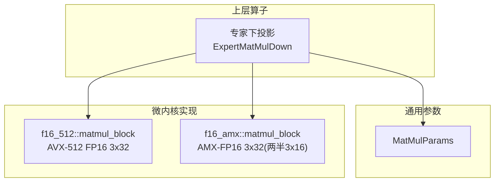
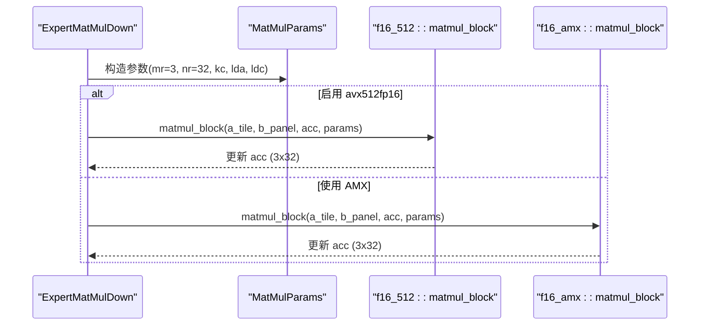
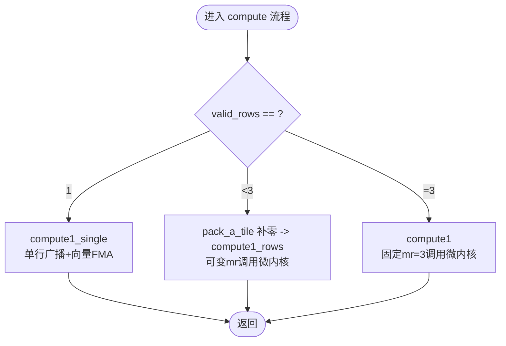
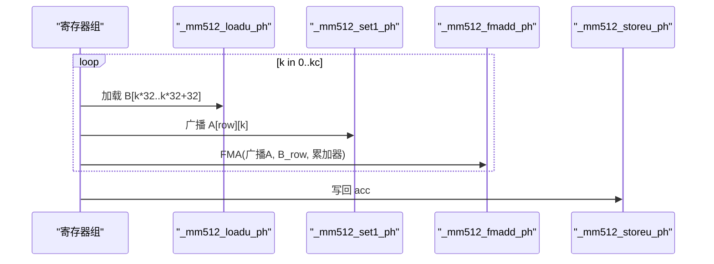
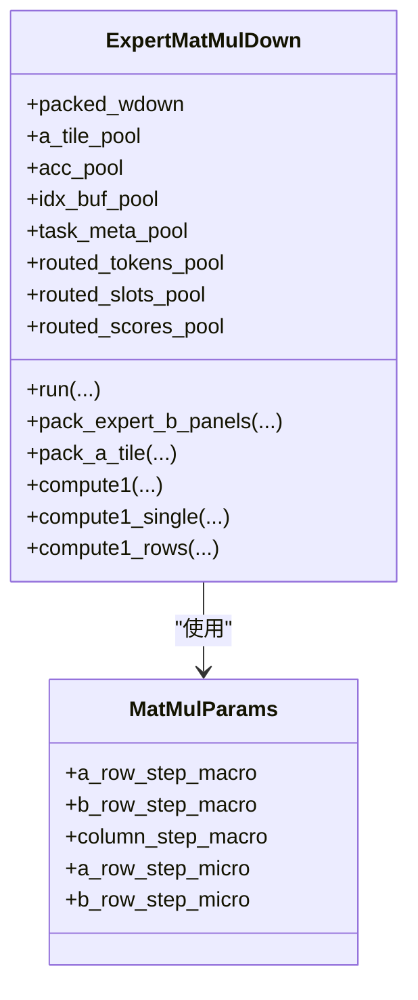
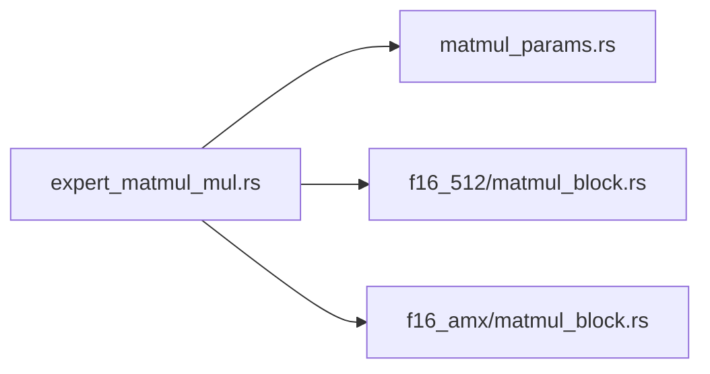

# 3x32 微内核设计

<cite>
**本文引用的文件**   
- [src/kernel/x86_64/f16_512/matmul_block.rs](file://src/kernel/x86_64/f16_512/matmul_block.rs)
- [src/kernel/x86_64/f16_amx/matmul_block.rs](file://src/kernel/x86_64/f16_amx/matmul_block.rs)
- [src/operators/expert/expert_matmul_mul.rs](file://src/operators/expert/expert_matmul_mul.rs)
- [src/kernel/common/matmul_params.rs](file://src/kernel/common/matmul_params.rs)
- [docs/design/operators/matmul.md](file://docs/design/operators/matmul.md)
</cite>

## 目录
1. [简介](#简介)
2. [项目结构](#项目结构)
3. [核心组件](#核心组件)
4. [架构总览](#架构总览)
5. [详细组件分析](#详细组件分析)
6. [依赖关系分析](#依赖关系分析)
7. [性能考量](#性能考量)
8. [故障排查指南](#故障排查指南)
9. [结论](#结论)
10. [附录](#附录)

## 简介
本文件围绕 3x32 微内核设计展开，系统阐述其在 eLLM 中的定位、选择依据与实现细节。重点包括：
- 为什么选择 3x32 作为微内核尺寸（缓存局部性、SIMD 寄存器利用率、指令并行度权衡）
- compute1、compute1_single、compute1_rows 三个核心函数的差异与优化策略
- AVX-512 FP16 内联函数调用方式（如 _mm512_fmadd_ph、_mm512_loadu_ph 等）
- 微内核与宏块之间的层次化计算架构，以及 a_tile 与 acc_pool 的内存管理与零拷贝优化
- 在不同硬件平台上的基准测试方法与调优建议

## 项目结构
本项目在 x86_64 平台上提供两套矩阵乘法微内核路径：
- f16_512：基于 AVX-512 FP16 的广播式 3x32 微内核
- f16_amx：基于 AMX-FP16 的 3x32 微内核（内部以两个 3x16 半块累加）

上层算子通过统一的参数结构与 trait 接口调度具体内核实现，并在运行时根据目标特性进行分支。

图示来源
- [src/operators/expert/expert_matmul_mul.rs:652-780](file://src/operators/expert/expert_matmul_mul.rs#L652-L780)
- [src/kernel/x86_64/f16_512/matmul_block.rs:10-85](file://src/kernel/x86_64/f16_512/matmul_block.rs#L10-L85)
- [src/kernel/x86_64/f16_amx/matmul_block.rs:17-51](file://src/kernel/x86_64/f16_amx/matmul_block.rs#L17-L51)
- [src/kernel/common/matmul_params.rs:1-36](file://src/kernel/common/matmul_params.rs#L1-L36)

章节来源
- [src/operators/expert/expert_matmul_mul.rs:652-780](file://src/operators/expert/expert_matmul_mul.rs#L652-L780)
- [src/kernel/x86_64/f16_512/matmul_block.rs:10-85](file://src/kernel/x86_64/f16_512/matmul_block.rs#L10-L85)
- [src/kernel/x86_64/f16_amx/matmul_block.rs:17-51](file://src/kernel/x86_64/f16_amx/matmul_block.rs#L17-L51)
- [src/kernel/common/matmul_params.rs:1-36](file://src/kernel/common/matmul_params.rs#L1-L36)

## 核心组件
- MatMulParams：统一描述宏块步长与微内核 tile 大小，供上层与内核共享约定。
- f16_512::matmul_block：广播式 3x32 微内核，按 Kc 循环，逐行广播 A 标量与 B 向量做 FMA。
- f16_amx::matmul_block：AMX-FP16 版本，将 3x32 拆为两个 3x16 半块，分别用 AMX GEMM 累加到 FP32，再回写 f16。
- ExpertMatMulDown：封装路由、预打包权重、线程私有缓冲池，并暴露 compute1/compute1_single/compute1_rows 接口以适配不同数据形态。

章节来源
- [src/kernel/common/matmul_params.rs:1-36](file://src/kernel/common/matmul_params.rs#L1-L36)
- [src/kernel/x86_64/f16_512/matmul_block.rs:10-85](file://src/kernel/x86_64/f16_512/matmul_block.rs#L10-L85)
- [src/kernel/x86_64/f16_amx/matmul_block.rs:17-51](file://src/kernel/x86_64/f16_amx/matmul_block.rs#L17-L51)
- [src/operators/expert/expert_matmul_mul.rs:42-89](file://src/operators/expert/expert_matmul_mul.rs#L42-L89)

## 架构总览
下图展示从上层算子到微内核的调用链与数据布局约定。

图示来源
- [src/operators/expert/expert_matmul_mul.rs:652-780](file://src/operators/expert/expert_matmul_mul.rs#L652-L780)
- [src/kernel/x86_64/f16_512/matmul_block.rs:22-85](file://src/kernel/x86_64/f16_512/matmul_block.rs#L22-L85)
- [src/kernel/x86_64/f16_amx/matmul_block.rs:17-51](file://src/kernel/x86_64/f16_amx/matmul_block.rs#L17-L51)

## 详细组件分析

### 为什么选择 3x32 微内核尺寸
- 缓存局部性：MR=3 使得 C 的子块较小，可尽量驻留寄存器/缓存；NR=32 充分利用 512-bit 向量宽度（FP16 每向量 32 元素），减少访存次数。
- SIMD 寄存器利用率：NR=32 对应一个 ZMM 寄存器装载整行 B_panel，A 的标量广播后复用，FMA 吞吐高。
- 指令并行度：广播式内核在每个 K 迭代中仅加载一次 B 向量，重复使用 A 标量，提高乘加指令密度，降低控制开销。
- 文档与设计说明参见：[docs/design/operators/matmul.md:144-196](file://docs/design/operators/matmul.md#L144-L196)

章节来源
- [docs/design/operators/matmul.md:144-196](file://docs/design/operators/matmul.md#L144-L196)
- [src/kernel/x86_64/f16_512/matmul_block.rs:10-85](file://src/kernel/x86_64/f16_512/matmul_block.rs#L10-L85)

### compute1、compute1_single、compute1_rows 的差异与优化
- compute1：对完整 micro_tile_rows（通常为 3）与 micro_tile_cols（通常为 32）的 A_tile 与 B_panel 执行批量累加，走 3x32 微内核路径。
- compute1_single：当 valid_rows==1 时，避免打包与多余循环，直接单行广播 + 向量 FMA 累加，减少分支与打包开销。
- compute1_rows：当 0 < valid_rows < micro_tile_rows 时，先打包成 a_tile（不足行补零），再以可变 mr 调用微内核，兼顾灵活性与效率。

图示来源
- [src/operators/expert/expert_matmul_mul.rs:490-537](file://src/operators/expert/expert_matmul_mul.rs#L490-L537)
- [src/operators/expert/expert_matmul_mul.rs:690-759](file://src/operators/expert/expert_matmul_mul.rs#L690-L759)

章节来源
- [src/operators/expert/expert_matmul_mul.rs:490-537](file://src/operators/expert/expert_matmul_mul.rs#L490-L537)
- [src/operators/expert/expert_matmul_mul.rs:690-759](file://src/operators/expert/expert_matmul_mul.rs#L690-L759)

### AVX-512 FP16 内联函数调用方式
- 常用内联函数：_mm512_loadu_ph、_mm512_set1_ph、_mm512_fmadd_ph、_mm512_storeu_ph。
- 典型用法模式：
  - 加载 B_panel 的一行（32 个 FP16）到一个 ZMM 寄存器
  - 将 A 的当前标量广播到 ZMM
  - 使用 FMA 累加到 C 的 ZMM 累加器
  - 循环结束后写回 acc

图示来源
- [src/operators/expert/expert_matmul_mul.rs:697-723](file://src/operators/expert/expert_matmul_mul.rs#L697-L723)
- [src/kernel/x86_64/f16_512/matmul_block.rs:22-85](file://src/kernel/x86_64/f16_512/matmul_block.rs#L22-L85)

章节来源
- [src/operators/expert/expert_matmul_mul.rs:697-723](file://src/operators/expert/expert_matmul_mul.rs#L697-L723)
- [src/kernel/x86_64/f16_512/matmul_block.rs:22-85](file://src/kernel/x86_64/f16_512/matmul_block.rs#L22-L85)

### 微内核与宏块的层次化架构与内存管理
- 宏块划分：token_block_rows × output_block_cols 由上层任务切分；输出列进一步按 micro_tile_cols 切分为多个微内核 tile。
- 规约维度：reduction_block_cols 作为 K 维的宏块步长，B 权重在 new() 阶段预打包为 panel 形式，便于微内核顺序访问。
- 线程私有缓冲：a_tile_pool 与 acc_pool 每个线程一份，避免竞争与伪共享；pack_a_tile 负责将稀疏路由 token 收集到连续 a_tile，未使用行补零。
- 零拷贝优化：run() 中只读取预打包的 packed_wdown，不重复复制；acc 仅在本地线程内读写，最后 scatter 写回 token-major 输出。

图示来源
- [src/operators/expert/expert_matmul_mul.rs:42-89](file://src/operators/expert/expert_matmul_mul.rs#L42-L89)
- [src/operators/expert/expert_matmul_mul.rs:103-197](file://src/operators/expert/expert_matmul_mul.rs#L103-L197)
- [src/operators/expert/expert_matmul_mul.rs:210-275](file://src/operators/expert/expert_matmul_mul.rs#L210-L275)
- [src/operators/expert/expert_matmul_mul.rs:277-310](file://src/operators/expert/expert_matmul_mul.rs#L277-L310)
- [src/kernel/common/matmul_params.rs:1-36](file://src/kernel/common/matmul_params.rs#L1-L36)

章节来源
- [src/operators/expert/expert_matmul_mul.rs:103-197](file://src/operators/expert/expert_matmul_mul.rs#L103-L197)
- [src/operators/expert/expert_matmul_mul.rs:210-275](file://src/operators/expert/expert_matmul_mul.rs#L210-L275)
- [src/operators/expert/expert_matmul_mul.rs:277-310](file://src/operators/expert/expert_matmul_mul.rs#L277-L310)
- [src/kernel/common/matmul_params.rs:1-36](file://src/kernel/common/matmul_params.rs#L1-L36)

### AMX-FP16 微内核对比
- AMX 路径将 3x32 拆为两个 3x16 半块，分别调用底层 GEMM 累加到 FP32，再将 f16 结果相加回写，兼顾精度与吞吐。
- 该路径适用于支持 amx-tile/amx-fp16 的目标平台。

章节来源
- [src/kernel/x86_64/f16_amx/matmul_block.rs:17-51](file://src/kernel/x86_64/f16_amx/matmul_block.rs#L17-L51)

## 依赖关系分析
- 上层算子依赖 MatMulParams 传递宏/微观步长信息。
- f16_512 与 f16_amx 两条路径通过条件编译或运行时特性检测选择。
- 预打包权重与线程私有缓冲是性能关键，避免重复分配与跨线程竞争。

图示来源
- [src/operators/expert/expert_matmul_mul.rs:652-780](file://src/operators/expert/expert_matmul_mul.rs#L652-L780)
- [src/kernel/common/matmul_params.rs:1-36](file://src/kernel/common/matmul_params.rs#L1-L36)
- [src/kernel/x86_64/f16_512/matmul_block.rs:10-85](file://src/kernel/x86_64/f16_512/matmul_block.rs#L10-L85)
- [src/kernel/x86_64/f16_amx/matmul_block.rs:17-51](file://src/kernel/x86_64/f16_amx/matmul_block.rs#L17-L51)

章节来源
- [src/operators/expert/expert_matmul_mul.rs:652-780](file://src/operators/expert/expert_matmul_mul.rs#L652-L780)
- [src/kernel/common/matmul_params.rs:1-36](file://src/kernel/common/matmul_params.rs#L1-L36)

## 性能考量
- 微内核尺寸选择：MR=3、NR=32 有利于寄存器驻留与向量复用，提升 FMA 吞吐并降低访存压力。
- 预打包权重：将非连续 B 重排为 panel 布局，使微内核顺序访问，最大化缓存命中与预取效果。
- 线程私有缓冲：a_tile_pool 与 acc_pool 避免写冲突与伪共享，稳定吞吐。
- 分支优化：compute1_single 针对单行场景减少打包与循环开销；compute1_rows 在不足行时补零后复用微内核。
- 平台特性：avx512fp16 开启时走向量路径；否则回退标量实现，保证正确性。

章节来源
- [docs/design/operators/matmul.md:144-196](file://docs/design/operators/matmul.md#L144-L196)
- [src/operators/expert/expert_matmul_mul.rs:490-537](file://src/operators/expert/expert_matmul_mul.rs#L490-L537)
- [src/operators/expert/expert_matmul_mul.rs:652-780](file://src/operators/expert/expert_matmul_mul.rs#L652-L780)

## 故障排查指南
- 特性检测失败：若 CPU 不支持 avx512fp16，相关测试会跳过；请确认目标平台特性或使用回退路径。
- 形状不匹配：确保 MatMulParams 的 mr/nr/kc/lda/ldc 与输入/权重布局一致，尤其是 B 的 panel 步长应为 NR。
- 越界与对齐：pack_a_tile 会对不足行补零，但需保证 idx_buf 与 routed 索引有效；acc 写入前清零以避免脏值。
- 数值误差：FP16 累加存在舍入误差，测试容忍度应合理设置；AMX 路径在回写 f16 前以 FP32 累加，误差更小。

章节来源
- [src/kernel/x86_64/f16_512/matmul_block.rs:93-97](file://src/kernel/x86_64/f16_512/matmul_block.rs#L93-L97)
- [src/kernel/x86_64/f16_amx/matmul_block.rs:72-76](file://src/kernel/x86_64/f16_amx/matmul_block.rs#L72-L76)
- [src/operators/expert/expert_matmul_mul.rs:277-310](file://src/operators/expert/expert_matmul_mul.rs#L277-L310)

## 结论
3x32 微内核在 MR/NR 的选择上平衡了缓存局部性、SIMD 利用率和指令并行度，配合预打包权重与线程私有缓冲，显著提升了小批、不规则 MoE 场景下的吞吐与稳定性。compute1/compute1_single/compute1_rows 的分流策略在保证正确性的同时，尽可能减少额外开销。对于支持 AVX-512 FP16 的平台，向量路径能充分发挥硬件能力；在 AMX 平台上则以更高吞吐与更低误差为目标。

## 附录
- 参考文档：关于微内核设计与 SIMD 优化的背景说明，见 [docs/design/operators/matmul.md:144-196](file://docs/design/operators/matmul.md#L144-L196)。
- 参数结构定义：[src/kernel/common/matmul_params.rs:1-36](file://src/kernel/common/matmul_params.rs#L1-L36)。
- f16_512 微内核实现：[src/kernel/x86_64/f16_512/matmul_block.rs:10-85](file://src/kernel/x86_64/f16_512/matmul_block.rs#L10-L85)。
- AMX 微内核实现：[src/kernel/x86_64/f16_amx/matmul_block.rs:17-51](file://src/kernel/x86_64/f16_amx/matmul_block.rs#L17-L51)。
- 上层算子与内存池：[src/operators/expert/expert_matmul_mul.rs:103-197](file://src/operators/expert/expert_matmul_mul.rs#L103-L197)、[src/operators/expert/expert_matmul_mul.rs:210-275](file://src/operators/expert/expert_matmul_mul.rs#L210-L275)、[src/operators/expert/expert_matmul_mul.rs:277-310](file://src/operators/expert/expert_matmul_mul.rs#L277-L310)。