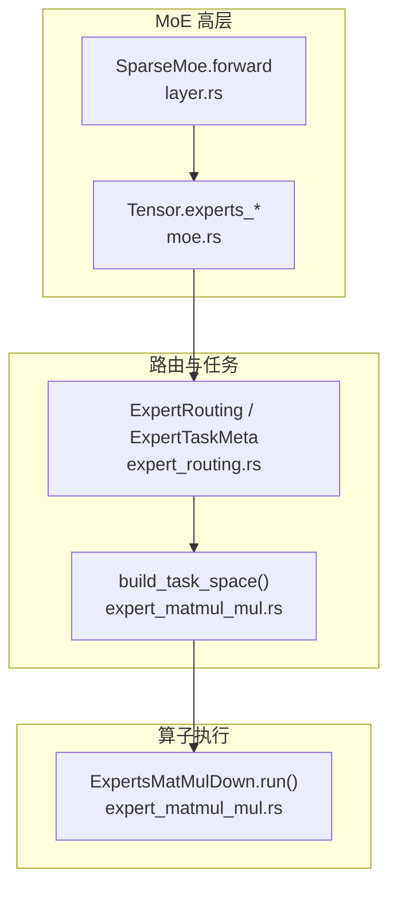
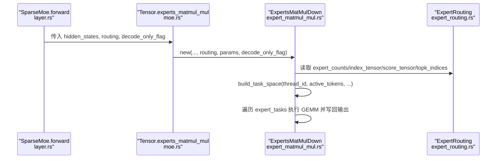
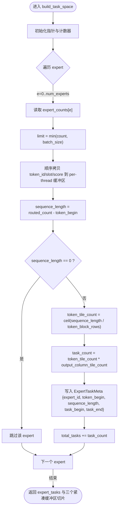
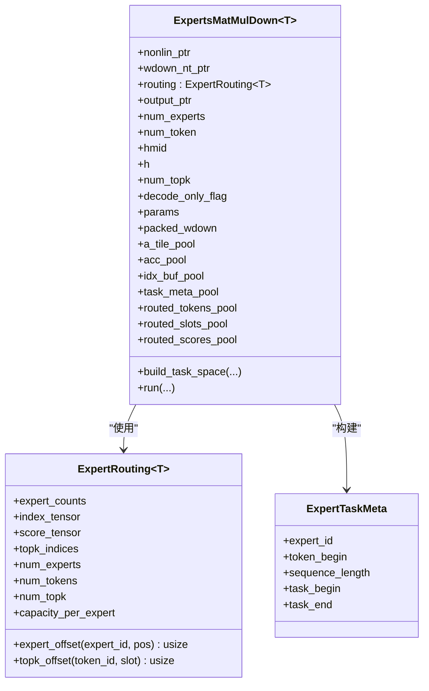
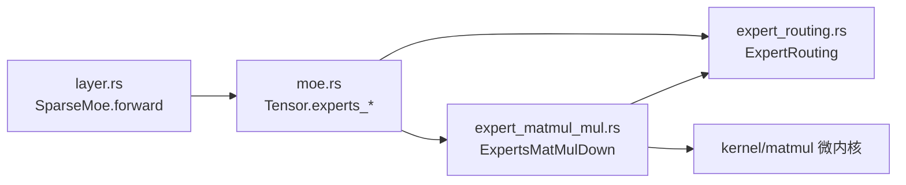

# Token 路由优化

<cite>
**本文引用的文件**   
- [expert_routing.rs](file://src/operators/expert/expert_routing.rs)
- [expert_matmul_mul.rs](file://src/operators/expert/expert_matmul_mul.rs)
- [moe.rs](file://src/tensor/moe.rs)
- [layer.rs](file://src/transformer/sparse_moe/layer.rs)
- [operator.rs](file://src/operators/operator.rs)
- [moe_routing_data_structures.md](file://docs/design/transformers/moe_routing_data_structures.md)
</cite>

## 目录
1. [简介](#简介)
2. [项目结构](#项目结构)
3. [核心组件](#核心组件)
4. [架构总览](#架构总览)
5. [详细组件分析](#详细组件分析)
6. [依赖关系分析](#依赖关系分析)
7. [性能考量](#性能考量)
8. [故障排查指南](#故障排查指南)
9. [结论](#结论)
10. [附录](#附录)

## 简介
本技术文档聚焦于 eLLM 中 Token 路由优化的实现与原理，重点解释紧凑队列存储机制、任务空间构建（build_task_space）以及三个关键缓冲区的协同工作方式。同时说明 decode_only_flag 参数对路由处理流程的影响，并给出在不同路由密度和负载均衡情况下的性能分析与优化建议。

## 项目结构
围绕 Token 路由优化的核心代码主要分布在以下模块：
- 路由数据结构与工具：src/operators/expert/expert_routing.rs
- 专家下投影算子与任务空间构建：src/operators/expert/expert_matmul_mul.rs
- MoE 高层接口与路由分配：src/tensor/moe.rs、src/transformer/sparse_moe/layer.rs
- 测试与辅助构造：src/operators/operator.rs
- 设计文档（旧到新映射）：docs/design/transformers/moe_routing_data_structures.md

图表来源
- [layer.rs:66-71](file://src/transformer/sparse_moe/layer.rs#L66-L71)
- [moe.rs:59-93](file://src/tensor/moe.rs#L59-L93)
- [expert_routing.rs:5-22](file://src/operators/expert/expert_routing.rs#L5-L22)
- [expert_matmul_mul.rs:313-397](file://src/operators/expert/expert_matmul_mul.rs#L313-L397)

章节来源
- [layer.rs:66-71](file://src/transformer/sparse_moe/layer.rs#L66-L71)
- [moe.rs:59-93](file://src/tensor/moe.rs#L59-L93)
- [expert_routing.rs:5-22](file://src/operators/expert/expert_routing.rs#L5-L22)
- [expert_matmul_mul.rs:313-397](file://src/operators/expert/expert_matmul_mul.rs#L313-L397)

## 核心组件
- ExpertRouting<T>：集中保存每个 expert 的紧凑 token 队列、对应分数、top-k 索引以及计数等元数据，提供按 expert 偏移与 top-k 槽位偏移的快速计算。
- ExpertTaskMeta：描述一个“连续任务区间”的元信息，包括所属 expert、token 在紧凑 buffer 中的起始位置、序列长度、全局任务起止范围等。
- ExpertsMatMulDown：负责将路由后的 token 进行 down-projection GEMM，并在 run() 中通过 build_task_space() 构建每线程的任务空间与紧凑缓冲区。

章节来源
- [expert_routing.rs:43-65](file://src/operators/expert/expert_routing.rs#L43-L65)
- [expert_routing.rs:5-22](file://src/operators/expert/expert_routing.rs#L5-L22)
- [expert_matmul_mul.rs:42-89](file://src/operators/expert/expert_matmul_mul.rs#L42-L89)

## 架构总览
Token 路由优化的整体流程如下：
- 上层根据评分函数生成路由结果，填充到 ExpertRouting 的紧凑结构中。
- 在执行阶段，ExpertsMatMulDown::run() 调用 build_task_space() 为当前线程构建：
  - expert_tasks：按 expert 聚合的连续任务元数据列表
  - routed_tokens_pool/routed_slots_pool/routed_scores_pool：每线程私有紧凑缓冲区
- 随后基于任务元数据进行分块 GEMM 计算，并将结果写回 token-major 输出。

图表来源
- [layer.rs:66-71](file://src/transformer/sparse_moe/layer.rs#L66-L71)
- [moe.rs:59-93](file://src/tensor/moe.rs#L59-L93)
- [expert_matmul_mul.rs:399-428](file://src/operators/expert/expert_matmul_mul.rs#L399-L428)
- [expert_routing.rs:43-65](file://src/operators/expert/expert_routing.rs#L43-L65)

## 详细组件分析

### 紧凑队列存储机制
- 设计目标：将原本分散的 token 路由信息重新组织为连续的内存布局，提升缓存命中率和访存效率。
- 存储布局：
  - index_tensor[e, pos]：第 e 个 expert 的紧凑队列中第 pos 个 token 的全局索引
  - score_tensor[e, pos]：对应 token 在该 expert 上的路由权重
  - expert_counts[e]：该 expert 的有效 token 数量
  - topk_indices[token, k]：token 的 top-k expert 选择（用于确定输出 slot）
- 访问模式：
  - 按 expert 顺序扫描其紧凑队列，避免稀疏 bool 矩阵带来的随机访问
  - 通过 expert_offset()/topk_offset() 快速定位元素

章节来源
- [expert_routing.rs:43-65](file://src/operators/expert/expert_routing.rs#L43-L65)
- [moe_routing_data_structures.md:515-577](file://docs/design/transformers/moe_routing_data_structures.md#L515-L577)

### build_task_space 与 expert_tasks 元数据构建
- 输入：
  - thread_id：当前线程标识
  - batch_size：本次参与计算的活跃 token 数（prefill 或 decode）
  - token_block_rows：GEMM 宏块的 token 行数
  - output_column_tile_count：输出列方向 tile 数量
- 过程要点：
  - 遍历每个 expert，读取 expert_counts[e] 并限制为 batch_size
  - 从 index_tensor/effective queue 中顺序拷贝 token_id、查找 topk_slot、读取 route_weight
  - 写入每线程私有缓冲区：routed_tokens_pool/routed_slots_pool/routed_scores_pool
  - 记录 sequence_length = routed_count - token_begin
  - 计算 token_tile_count = ceil(sequence_length / token_block_rows)
  - 计算 task_count = token_tile_count * output_column_tile_count
  - 写入 ExpertTaskMeta：{expert_id, token_begin, sequence_length, task_begin, task_end}
- 输出：
  - expert_tasks：当前 expert 的非空任务元数据切片
  - routed_tokens/routed_slots/routed_scores：紧凑缓冲区切片
  - total_tasks：累计任务数

图表来源
- [expert_matmul_mul.rs:313-397](file://src/operators/expert/expert_matmul_mul.rs#L313-L397)

章节来源
- [expert_matmul_mul.rs:313-397](file://src/operators/expert/expert_matmul_mul.rs#L313-L397)

### 三个缓冲区的协同工作机制
- routed_tokens_pool：存放当前 expert 的 token 全局索引，顺序排列，便于按 micro-row 打包进 a_tile
- routed_slots_pool：存放每个 token 在 token-major 输出中的 top-k slot，用于 scatter 写回
- routed_scores_pool：存放每个 token 的路由权重，用于在写回时乘以权重
- 三者共享同一 stride（num_experts * capacity_per_expert），每线程一份，避免竞争与动态分配

章节来源
- [expert_matmul_mul.rs:82-89](file://src/operators/expert/expert_matmul_mul.rs#L82-L89)
- [expert_matmul_mul.rs:147-158](file://src/operators/expert/expert_matmul_mul.rs#L147-L158)

### decode_only_flag 参数的影响
- 在 ExpertsMatMulDown::new() 中接收 decode_only_flag，并在 run() 中决定 active_token_count：
  - 若 prefill_size == 0，则使用 decode_size；否则使用 prefill_size
- 该标志也贯穿上层路由与归一化算子（如 softmax_norm/topk_norm/sigmoid_gate），用于在解码路径启用特定优化策略（例如单行/小批量的微内核分支）

章节来源
- [expert_matmul_mul.rs:103-117](file://src/operators/expert/expert_matmul_mul.rs#L103-L117)
- [expert_matmul_mul.rs:399-428](file://src/operators/expert/expert_matmul_mul.rs#L399-L428)
- [moe.rs:155-176](file://src/tensor/moe.rs#L155-L176)
- [moe.rs:223-244](file://src/tensor/moe.rs#L223-L244)
- [moe.rs:178-221](file://src/tensor/moe.rs#L178-L221)

### 类与关系图（代码级）

图表来源
- [expert_routing.rs:43-65](file://src/operators/expert/expert_routing.rs#L43-L65)
- [expert_routing.rs:5-22](file://src/operators/expert/expert_routing.rs#L5-L22)
- [expert_matmul_mul.rs:42-89](file://src/operators/expert/expert_matmul_mul.rs#L42-L89)

## 依赖关系分析
- 上层调用链：
  - SparseMoe.forward -> Tensor.experts_* -> Operators (ExpertsMatMulDown/ExpertsMergeAdd/...)
- 内部依赖：
  - ExpertsMatMulDown 依赖 ExpertRouting 提供的紧凑队列与 top-k 索引
  - build_task_space 依赖 expert_counts 与 index_tensor/score_tensor 的顺序访问
  - run 依赖 packed_wdown 预打包权重面板与微内核 GEMM 实现

图表来源
- [layer.rs:66-71](file://src/transformer/sparse_moe/layer.rs#L66-L71)
- [moe.rs:59-93](file://src/tensor/moe.rs#L59-L93)
- [expert_routing.rs:43-65](file://src/operators/expert/expert_routing.rs#L43-L65)
- [expert_matmul_mul.rs:399-428](file://src/operators/expert/expert_matmul_mul.rs#L399-L428)

章节来源
- [layer.rs:66-71](file://src/transformer/sparse_moe/layer.rs#L66-L71)
- [moe.rs:59-93](file://src/tensor/moe.rs#L59-L93)
- [expert_routing.rs:43-65](file://src/operators/expert/expert_routing.rs#L43-L65)
- [expert_matmul_mul.rs:399-428](file://src/operators/expert/expert_matmul_mul.rs#L399-L428)

## 性能考量
- 紧凑队列的优势：
  - 顺序访问 index_tensor/score_tensor，减少随机访存与分支预测失败
  - 每线程私有缓冲区避免锁竞争与重复分配
- 任务切分与 tile 化：
  - 将 token 维度按 token_block_rows 切块，输出列按 output_block_cols 切块，形成稳定的 micro-tile 工作负载
  - 有利于微内核 GEMM 的向量化与缓存复用
- decode_only_flag 的优化点：
  - 在 decode 模式下，active_token_count 通常较小，系统会走单行/少行的微内核分支，降低开销
- 不同路由密度与负载均衡场景：
  - 高路由密度（多数 token 被激活）：紧凑队列长度接近容量上限，GEMM 吞吐更高，但需关注输出写回的 scatter 合并
  - 低路由密度（稀疏激活）：build_task_space 可快速跳过空 expert，减少无效计算；注意避免过多空任务导致调度开销占比上升
  - 负载均衡良好：各 expert 的 sequence_length 相近，任务划分更均匀，线程间负载均衡，减少尾延迟
  - 负载均衡较差：少数 expert 承担大部分 token，可能成为瓶颈；可通过调整 num_topk 或路由策略改善分布

[本节为通用性能讨论，不直接分析具体文件，故无章节来源]

## 故障排查指南
- 症状：输出值异常或 NaN
  - 检查 expert_counts 是否正确更新，确保 index_tensor/score_tensor 写入位置未越界
  - 确认 topk_indices 与 routed_slots_pool 的一致性，避免写错输出 slot
- 症状：性能退化
  - 观察 expert_tasks 的数量与分布，是否存在大量空 expert 或极端不平衡
  - 检查 token_block_rows/output_block_cols 是否与微内核 tile 匹配，避免频繁边界处理
- 症状：decode 模式异常
  - 确认 decode_only_flag 传递正确，active_token_count 是否按预期取 decode_size
  - 验证单行分支是否被触发，必要时调整微内核参数

章节来源
- [expert_routing.rs:67-125](file://src/operators/expert/expert_routing.rs#L67-L125)
- [expert_matmul_mul.rs:313-397](file://src/operators/expert/expert_matmul_mul.rs#L313-L397)
- [expert_matmul_mul.rs:399-428](file://src/operators/expert/expert_matmul_mul.rs#L399-L428)

## 结论
通过将分散的 token 路由信息重组为紧凑队列，并结合每线程私有缓冲区与任务元数据（expert_tasks），eLLM 在 MoE 下投影阶段实现了更高的缓存命中率与更稳定的微内核执行路径。decode_only_flag 进一步引导系统在解码路径采用轻量分支，从而在小批量场景下保持较好的吞吐。合理的路由密度与负载均衡是发挥该优化效果的关键。

[本节为总结性内容，不直接分析具体文件，故无章节来源]

## 附录
- 旧到新映射参考：docs/design/transformers/moe_routing_data_structures.md 提供了从 dense 指示矩阵到 compact 队列的演进说明，有助于理解新结构的动机与差异。

章节来源
- [moe_routing_data_structures.md:468-577](file://docs/design/transformers/moe_routing_data_structures.md#L468-L577)