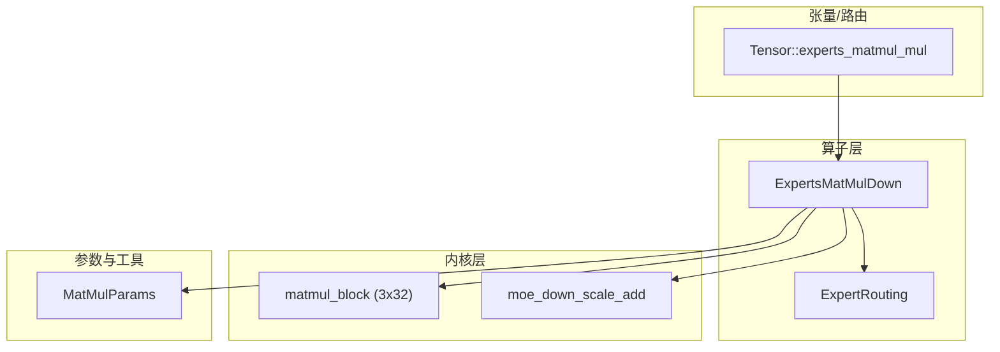
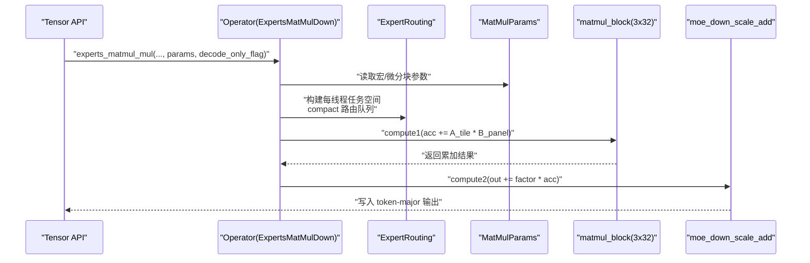
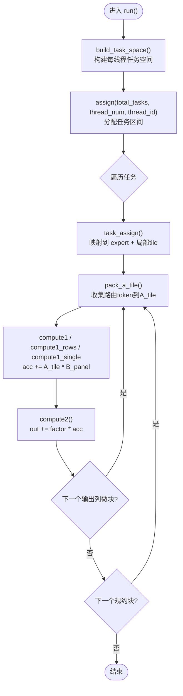
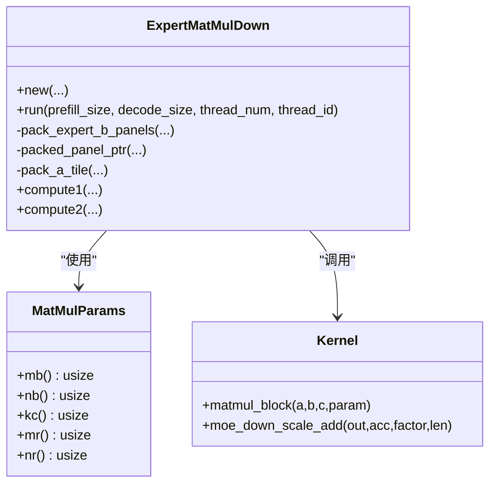
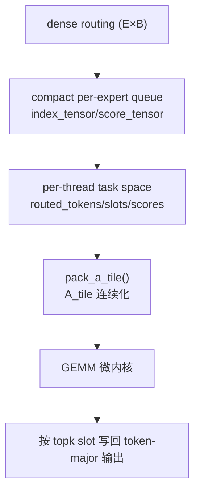
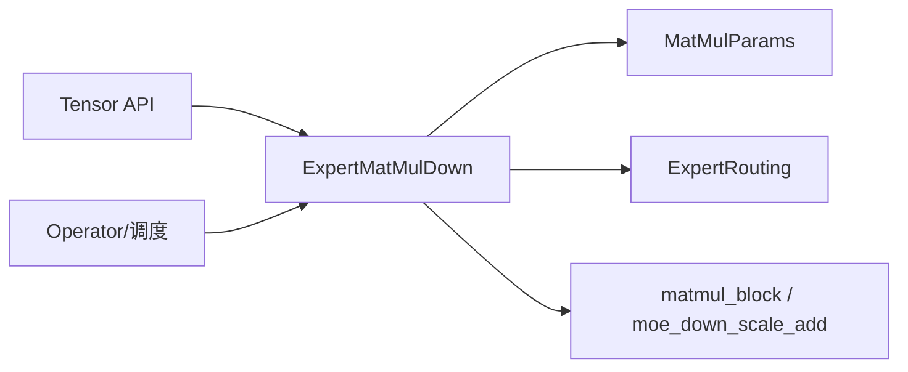

# 专家矩阵乘法优化

<cite>
**本文引用的文件列表**
- [src/operators/expert/expert_matmul_mul.rs](file://src/operators/expert/expert_matmul_mul.rs)
- [src/kernel/x86_64/f16_512/matmul_block.rs](file://src/kernel/x86_64/f16_512/matmul_block.rs)
- [src/kernel/x86_64/f16_512/moe_down.rs](file://src/kernel/x86_64/f16_512/moe_down.rs)
- [src/kernel/common/matmul_params.rs](file://src/kernel/common/matmul_params.rs)
- [src/operators/expert/expert_routing.rs](file://src/operators/expert/expert_routing.rs)
- [src/tensor/moe.rs](file://src/tensor/moe.rs)
- [src/operators/operator.rs](file://src/operators/operator.rs)
</cite>

## 目录
1. [引言](#引言)
2. [项目结构](#项目结构)
3. [核心组件](#核心组件)
4. [架构总览](#架构总览)
5. [详细组件分析](#详细组件分析)
6. [依赖关系分析](#依赖关系分析)
7. [性能考量与调优](#性能考量与调优)
8. [故障排查指南](#故障排查指南)
9. [结论](#结论)
10. [附录](#附录)

## 引言
本技术文档聚焦于 eLLM 中“专家矩阵乘法”（Expert MatMul Down）的优化实现，围绕 ExpertMatMulDown 算子展开，系统阐述以下关键点：
- 权重面板预打包策略与内存布局
- 微内核 tile 划分与并行任务分配机制
- MatMulParams 步长参数的作用与调优方法
- AVX-512 FP16 指令集利用与 3x32 微内核设计原理
- 路由 token 的紧凑队列存储与访问模式优化
- 解码模式与预填充模式的特殊优化策略
- 不同专家数量与 token 规模下的基准测试方法与参考结果

## 项目结构
本项目采用分层组织方式：
- 算子层：封装高层业务逻辑与调度接口（如 ExpertsMatMulDown、ExpertsMergeAdd 等）
- 内核层：提供平台相关的高性能实现（如 x86_64 f16_512 路径下的 matmul_block、moe_down_scale_add）
- 张量/路由层：提供张量操作、路由数据结构与构建流程
- 运行时/调度层：负责批处理、线程分配与执行

图表来源
- [src/operators/expert/expert_matmul_mul.rs:103-197](file://src/operators/expert/expert_matmul_mul.rs#L103-L197)
- [src/kernel/x86_64/f16_512/matmul_block.rs:22-85](file://src/kernel/x86_64/f16_512/matmul_block.rs#L22-L85)
- [src/kernel/x86_64/f16_512/moe_down.rs:14-36](file://src/kernel/x86_64/f16_512/moe_down.rs#L14-L36)
- [src/kernel/common/matmul_params.rs:1-35](file://src/kernel/common/matmul_params.rs#L1-L35)
- [src/tensor/moe.rs:59-93](file://src/tensor/moe.rs#L59-L93)

章节来源
- [src/operators/expert/expert_matmul_mul.rs:1-197](file://src/operators/expert/expert_matmul_mul.rs#L1-L197)
- [src/tensor/moe.rs:59-93](file://src/tensor/moe.rs#L59-L93)

## 核心组件
- ExpertMatMulDown：实现按 expert 的 down-projection，输入为 [E, B, Hmid]，权重为 NT 布局 [E, H, Hmid]，输出为 token-major [B, Ktop, H]。内部使用紧凑路由队列与预打包权重面板，结合 3x32 微内核进行高效计算。
- MatMulParams：定义 GEMM 分块与微内核尺寸，包括 a_row_step_macro、b_row_step_macro、column_step_macro、a_row_step_micro、b_row_step_micro。
- 3x32 微内核：基于 AVX-512 FP16 的广播式乘加内核，将 A 行广播到向量寄存器，对 B 的 32 列连续面板做累加。
- moe_down_scale_add：按路由权重对 acc 结果进行缩放并累加到最终输出。
- ExpertRouting：紧凑存储每个 expert 的路由 token 索引与分数，以及 top-k 槽位映射。

章节来源
- [src/operators/expert/expert_matmul_mul.rs:30-89](file://src/operators/expert/expert_matmul_mul.rs#L30-L89)
- [src/kernel/common/matmul_params.rs:1-35](file://src/kernel/common/matmul_params.rs#L1-L35)
- [src/kernel/x86_64/f16_512/matmul_block.rs:10-21](file://src/kernel/x86_64/f16_512/matmul_block.rs#L10-L21)
- [src/kernel/x86_64/f16_512/moe_down.rs:7-13](file://src/kernel/x86_64/f16_512/moe_down.rs#L7-L13)
- [src/operators/expert/expert_routing.rs:43-65](file://src/operators/expert/expert_routing.rs#L43-L65)

## 架构总览
下图展示了从 Tensor API 到算子执行与内核计算的完整调用链，以及关键数据流。

图表来源
- [src/tensor/moe.rs:59-93](file://src/tensor/moe.rs#L59-L93)
- [src/operators/expert/expert_matmul_mul.rs:399-578](file://src/operators/expert/expert_matmul_mul.rs#L399-L578)
- [src/kernel/x86_64/f16_512/matmul_block.rs:22-85](file://src/kernel/x86_64/f16_512/matmul_block.rs#L22-L85)
- [src/kernel/x86_64/f16_512/moe_down.rs:14-36](file://src/kernel/x86_64/f16_512/moe_down.rs#L14-L36)

## 详细组件分析

### ExpertMatMulDown 算子实现原理
- 权重面板预打包策略
  - 在 new() 阶段，将原始权重 [E, H, Hmid]（NT 布局）按 reduction_block_cols × micro_tile_cols 切分为 panel，并将 B 面板重排为 kc×NR 的连续行主布局，便于 AVX-512 向量化加载。
  - packed_wdown 以 [E][reduction_panels][output_panels][panel_stride] 的形式存放，其中 panel_stride = reduction_block_cols × micro_tile_cols。
  - 通过 packed_panel_ptr 根据 expert_id、output_col_start、reduction_col_start 直接定位对应面板指针，避免运行时索引开销。
- 微内核 tile 划分
  - 宏块：token_block_rows（MB）、output_block_cols（NB）、reduction_block_cols（KC）。
  - 微内核：micro_tile_rows（MR=3）、micro_tile_cols（NR=32）。
  - 外层循环遍历 expert → 输出列宏块 → 规约块；内层按 MR 行分批处理，确保累加器边界有效。
- 并行任务分配机制
  - build_task_space 为每个线程构建 per-expert 的任务元信息（expert_id、token_begin、sequence_length、task_begin/task_end），并在 run() 中使用 assign 将全局任务 ID 分配到线程区间。
  - task_assign 将全局任务 ID 映射回具体 expert 与局部矩阵 tile（token_tile_id、output_tile_id）。
- 计算流程
  - compute1：acc += A_tile * B_panel，调用 matmul_block 或标量回退。
  - compute2：out_row[j] += acc_row[j] * factor，调用 moe_down_scale_add 或标量回退。
  - 单行路径（valid_rows==1）走 compute1_single，减少 pack 开销。

图表来源
- [src/operators/expert/expert_matmul_mul.rs:313-397](file://src/operators/expert/expert_matmul_mul.rs#L313-L397)
- [src/operators/expert/expert_matmul_mul.rs:399-578](file://src/operators/expert/expert_matmul_mul.rs#L399-L578)
- [src/operators/expert/expert_routing.rs:26-41](file://src/operators/expert/expert_routing.rs#L26-L41)

章节来源
- [src/operators/expert/expert_matmul_mul.rs:103-197](file://src/operators/expert/expert_matmul_mul.rs#L103-L197)
- [src/operators/expert/expert_matmul_mul.rs:210-275](file://src/operators/expert/expert_matmul_mul.rs#L210-L275)
- [src/operators/expert/expert_matmul_mul.rs:277-310](file://src/operators/expert/expert_matmul_mul.rs#L277-L310)
- [src/operators/expert/expert_matmul_mul.rs:313-397](file://src/operators/expert/expert_matmul_mul.rs#L313-L397)
- [src/operators/expert/expert_matmul_mul.rs:399-578](file://src/operators/expert/expert_matmul_mul.rs#L399-L578)

### MatMulParams 步长参数与调优
- 参数含义
  - a_row_step_macro（MB）：A 的宏块行数，控制 token 批次大小。
  - b_row_step_macro（NB）：输出列宏块宽度，影响缓存复用与写回粒度。
  - column_step_macro（KC）：规约块长度，决定每次微内核处理的 K 维度跨度。
  - a_row_step_micro（MR）：微内核行数，当前固定为 3。
  - b_row_step_micro（NR）：微内核列数，当前固定为 32。
- 调优建议
  - KC 应整除 Hmid，避免尾部处理分支；推荐取 16/32/64 等值。
  - NB 应与 NR 对齐或为其倍数，保证 B 面板连续性与向量化效率。
  - MB 需兼顾吞吐与 L1/L2 缓存命中率；过小导致频繁 pack，过大降低并行度。
  - MR=3、NR=32 针对 AVX-512 FP16 广播式内核做了专门优化，不建议随意更改。
- 典型配置示例
  - 在测试与默认路径中常见配置：MB=3~6、NB=32~64、KC=16~64、MR=3、NR=32。

章节来源
- [src/kernel/common/matmul_params.rs:1-35](file://src/kernel/common/matmul_params.rs#L1-L35)
- [src/operators/expert/expert_matmul_mul.rs:118-127](file://src/operators/expert/expert_matmul_mul.rs#L118-L127)
- [src/operators/expert/expert_matmul_mul.rs:652-688](file://src/operators/expert/expert_matmul_mul.rs#L652-L688)
- [src/tensor/tests/matmul.rs:376-416](file://src/tensor/tests/matmul.rs#L376-L416)

### AVX-512 FP16 与 3x32 微内核设计
- 3x32 微内核
  - A_tile 形状为 3×KC，B_panel 形状为 KC×32（行主连续），C_tile 形状为 3×32。
  - 内核将 A 的每一行广播到 512bit 向量寄存器，对 B 的 32 列连续面板做 FMADD 累加，充分利用 AVX-512 FP16 的宽向量能力。
  - 当 NR=32 且 MR≤3 时走专用路径，否则回退到标量实现。
- 缩放累加
  - moe_down_scale_add 使用 _mm512_set1_ph 广播因子，_mm512_fmadd_ph 完成 out += factor*acc，并对非 32 倍数的尾部进行标量处理。

图表来源
- [src/kernel/common/matmul_params.rs:1-35](file://src/kernel/common/matmul_params.rs#L1-L35)
- [src/operators/expert/expert_matmul_mul.rs:103-197](file://src/operators/expert/expert_matmul_mul.rs#L103-L197)
- [src/kernel/x86_64/f16_512/matmul_block.rs:22-85](file://src/kernel/x86_64/f16_512/matmul_block.rs#L22-L85)
- [src/kernel/x86_64/f16_512/moe_down.rs:14-36](file://src/kernel/x86_64/f16_512/moe_down.rs#L14-L36)

章节来源
- [src/kernel/x86_64/f16_512/matmul_block.rs:10-21](file://src/kernel/x86_64/f16_512/matmul_block.rs#L10-L21)
- [src/kernel/x86_64/f16_512/matmul_block.rs:22-85](file://src/kernel/x86_64/f16_512/matmul_block.rs#L22-L85)
- [src/kernel/x86_64/f16_512/moe_down.rs:14-36](file://src/kernel/x86_64/f16_512/moe_down.rs#L14-L36)

### 路由 token 的紧凑队列与内存访问优化
- 紧凑存储
  - ExpertRouting 维护 index_tensor 与 score_tensor，按 expert 维度连续存放被选中的 token 及其权重，capacity_per_expert = num_tokens × num_topk。
  - 通过 expert_offset(expert_id, pos) 快速定位某 expert 的第 pos 个路由项。
- 访问模式
  - build_task_space 将稀疏路由转换为每线程连续的 routed_tokens/routed_slots/routed_scores 视图，减少随机访问。
  - pack_a_tile 将分散的 token 行聚拢到 A_tile，提升 L1/L2 命中与向量化效率。
  - 输出写回时，依据 topk_indices 确定 slot，再按 token-major 布局写入，避免跨行竞争。

图表来源
- [src/operators/expert/expert_routing.rs:43-65](file://src/operators/expert/expert_routing.rs#L43-L65)
- [src/operators/expert/expert_matmul_mul.rs:313-397](file://src/operators/expert/expert_matmul_mul.rs#L313-L397)
- [src/operators/expert/expert_matmul_mul.rs:277-310](file://src/operators/expert/expert_matmul_mul.rs#L277-L310)

章节来源
- [src/operators/expert/expert_routing.rs:43-65](file://src/operators/expert/expert_routing.rs#L43-L65)
- [src/operators/expert/expert_matmul_mul.rs:313-397](file://src/operators/expert/expert_matmul_mul.rs#L313-L397)

### 解码模式与预填充模式的特殊优化
- 模式选择
  - run() 根据 prefill_size 与 decode_size 决定 active_token_count；若 prefill_size==0 则仅处理 decode 部分。
- 解码模式优化
  - decode 场景通常 token 较少但延迟敏感，建议增大 MB 以提升单次任务的工作量，减少任务切换与 pack 开销。
  - 单行路径（valid_rows==1）走 compute1_single，避免不必要的 pack，适合逐 token 生成。
- 预填充模式优化
  - prefill 场景批量较大，可适度增大 NB 与 KC，提高缓存复用与向量化效率；同时保持 MR=3、NR=32 的微内核不变。
- 线程并行
  - detect_threads() 限制最大线程数为 16，避免过度并行带来的同步与缓存抖动。

章节来源
- [src/operators/expert/expert_matmul_mul.rs:399-418](file://src/operators/expert/expert_matmul_mul.rs#L399-L418)
- [src/operators/expert/expert_matmul_mul.rs:490-537](file://src/operators/expert/expert_matmul_mul.rs#L490-L537)
- [src/operators/expert/expert_matmul_mul.rs:95-101](file://src/operators/expert/expert_matmul_mul.rs#L95-L101)

## 依赖关系分析
- 算子依赖
  - ExpertMatMulDown 依赖 MatMulParams 配置、ExpertRouting 路由数据、内核 matmul_block 与 moe_down_scale_add。
- 运行时集成
  - Tensor API 通过 Operator 队列提交 ExpertsMatMulDown，调度器按线程分配任务。
- 外部特性检测
  - 编译期目标特性 avx512fp16 决定是否启用 AVX-512 路径，否则回退到标量实现。

图表来源
- [src/operators/expert/expert_matmul_mul.rs:103-197](file://src/operators/expert/expert_matmul_mul.rs#L103-L197)
- [src/tensor/moe.rs:59-93](file://src/tensor/moe.rs#L59-L93)
- [src/operators/operator.rs:1623-1669](file://src/operators/operator.rs#L1623-L1669)

章节来源
- [src/operators/expert/expert_matmul_mul.rs:103-197](file://src/operators/expert/expert_matmul_mul.rs#L103-L197)
- [src/tensor/moe.rs:59-93](file://src/tensor/moe.rs#L59-L93)
- [src/operators/operator.rs:1623-1669](file://src/operators/operator.rs#L1623-L1669)

## 性能考量与调优
- 权重面板预打包
  - 预打包在 new() 阶段完成，避免运行时的重复重排；packed_wdown 的 layout 使 B 面板在微内核中具备最佳连续访问性。
- 微内核与缓存
  - 3x32 微内核充分利用 AVX-512 FP16 的宽向量与 FMADD；KB/NB/KC 的选择直接影响 L1/L2 命中率与访存带宽利用率。
- 任务粒度与并行度
  - MB 过小会导致频繁 pack 与任务切换；MB 过大可能降低并行度与增加尾处理分支。
  - 线程数上限为 16，避免过多线程导致的缓存抖动与同步成本。
- 解码 vs 预填充
  - 解码：优先减少 pack 与任务切换，单行路径优化显著。
  - 预填充：优先提高缓存复用与向量化效率，适当增大 NB/KC。
- 基准测试方法
  - 使用 src/tensor/tests 与 src/operators/operator.rs 中的测试用例构造不同 E/B/Hmid/H/Ktop 组合，记录吞吐与时延。
  - 建议在支持 avx512fp16 的硬件上运行，跳过不支持的平台分支。

章节来源
- [src/operators/expert/expert_matmul_mul.rs:118-127](file://src/operators/expert/expert_matmul_mul.rs#L118-L127)
- [src/operators/expert/expert_matmul_mul.rs:95-101](file://src/operators/expert/expert_matmul_mul.rs#L95-L101)
- [src/tensor/tests/matmul.rs:376-416](file://src/tensor/tests/matmul.rs#L376-L416)
- [src/operators/operator.rs:1623-1669](file://src/operators/operator.rs#L1623-L1669)

## 故障排查指南
- 精度问题
  - 检查是否启用了 avx512fp16；未启用时会回退到标量实现，注意数值误差容忍度。
  - 验证 KC 是否整除 Hmid，避免尾部分支引入额外误差。
- 越界与崩溃
  - 确认 packed_panel_ptr 的 panel_index 计算正确；检查 output_cols_in_block 与 tokens_in_block 的断言。
  - 核对 topk_indices 与 slot 映射是否正确，避免写回错位。
- 性能异常
  - 调整 MB/NB/KC 参数，观察 L1/L2 命中率变化。
  - 检查线程数设置，避免超过 detect_threads() 上限。
- 日志与断言
  - 关注 debug_assert! 与错误打印路径，定位具体失败位置。

章节来源
- [src/operators/expert/expert_matmul_mul.rs:444-452](file://src/operators/expert/expert_matmul_mul.rs#L444-L452)
- [src/operators/expert/expert_matmul_mul.rs:482-483](file://src/operators/expert/expert_matmul_mul.rs#L482-L483)
- [src/kernel/x86_64/f16_512/matmul_block.rs:94-97](file://src/kernel/x86_64/f16_512/matmul_block.rs#L94-L97)

## 结论
ExpertMatMulDown 通过权重面板预打包、紧凑路由队列、3x32 微内核与 AVX-512 FP16 向量化，实现了高效的专家 down-projection 计算。MatMulParams 的步长参数对性能有显著影响，需结合硬件特性与应用场景进行调优。解码与预填充模式分别侧重低延迟与高吞吐，合理设置 MB/NB/KC 与线程数可获得更优表现。

## 附录
- 术语表
  - MB：A 宏块行数（token 批次）
  - NB：输出列宏块宽度
  - KC：规约块长度
  - MR：微内核行数（固定为 3）
  - NR：微内核列数（固定为 32）
- 参考实现路径
  - 算子入口：[src/tensor/moe.rs:59-93](file://src/tensor/moe.rs#L59-L93)
  - 核心实现：[src/operators/expert/expert_matmul_mul.rs:103-578](file://src/operators/expert/expert_matmul_mul.rs#L103-L578)
  - 微内核：[src/kernel/x86_64/f16_512/matmul_block.rs:22-85](file://src/kernel/x86_64/f16_512/matmul_block.rs#L22-L85)
  - 缩放累加：[src/kernel/x86_64/f16_512/moe_down.rs:14-36](file://src/kernel/x86_64/f16_512/moe_down.rs#L14-L36)
  - 路由结构：[src/operators/expert/expert_routing.rs:43-65](file://src/operators/expert/expert_routing.rs#L43-L65)
  - 参数定义：[src/kernel/common/matmul_params.rs:1-35](file://src/kernel/common/matmul_params.rs#L1-L35)