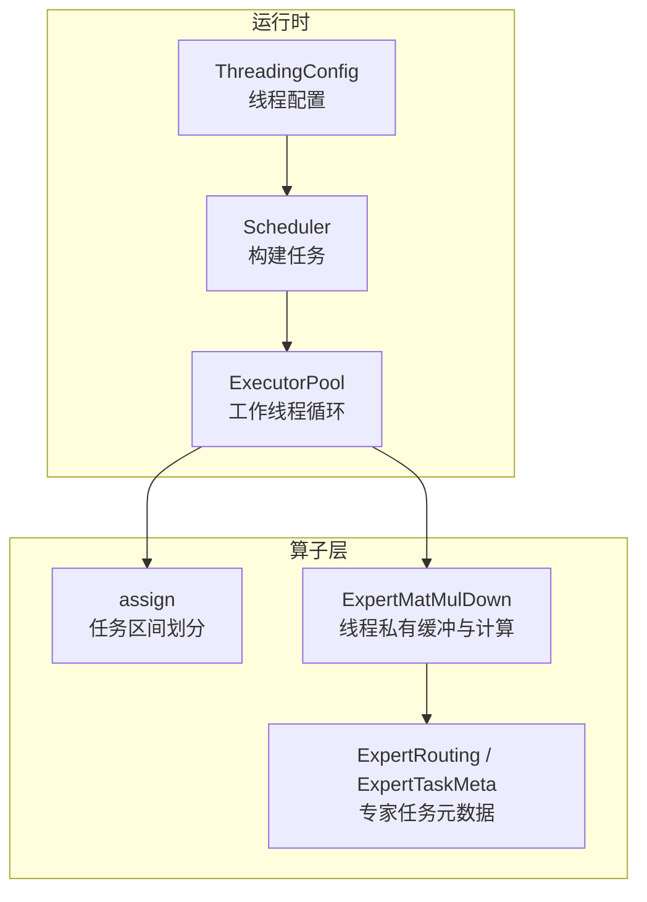
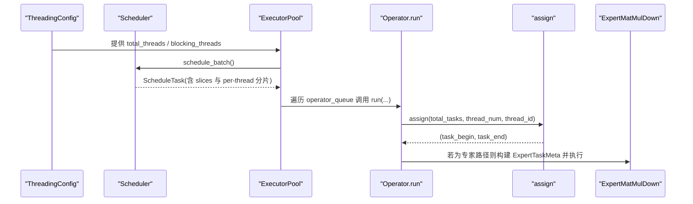
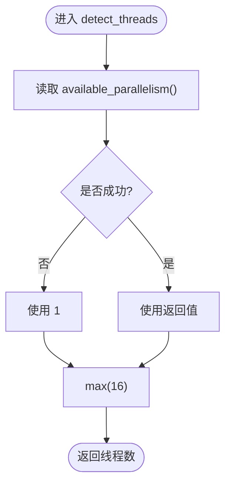
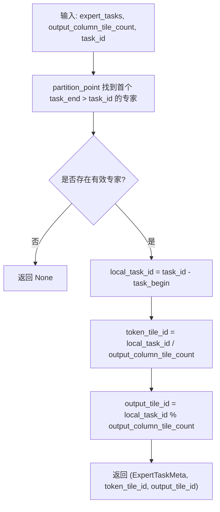
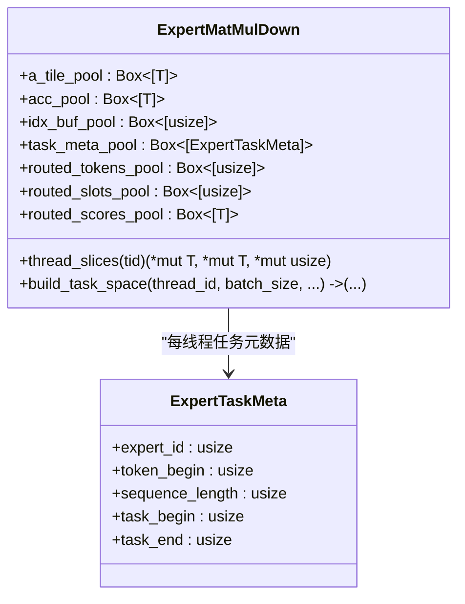
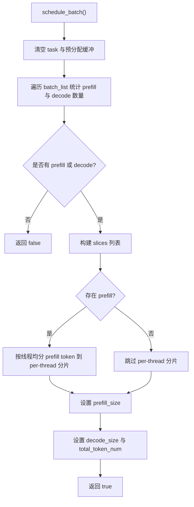
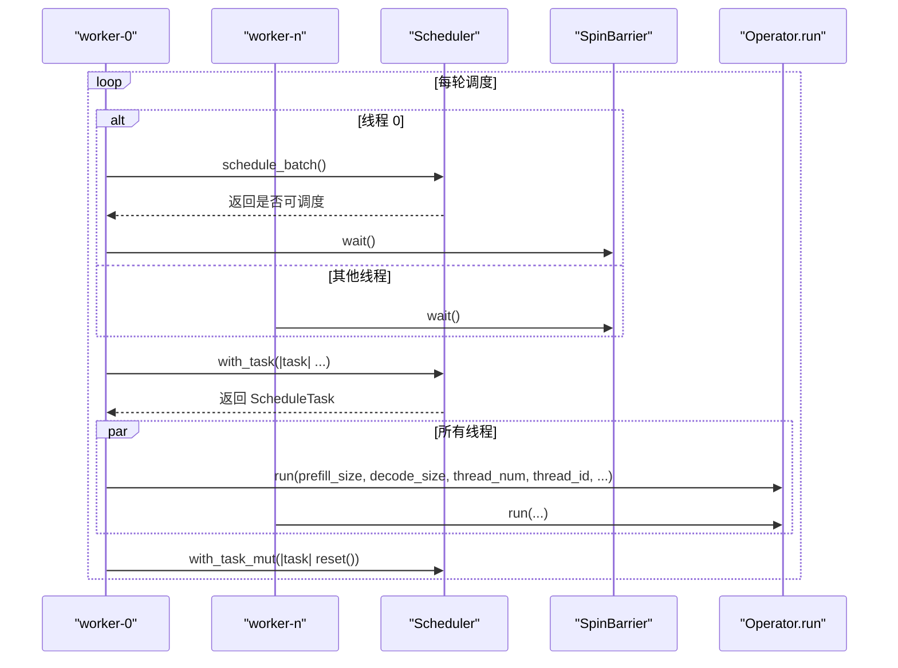
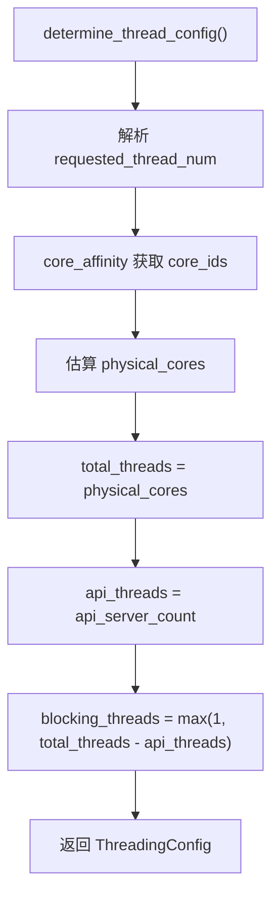
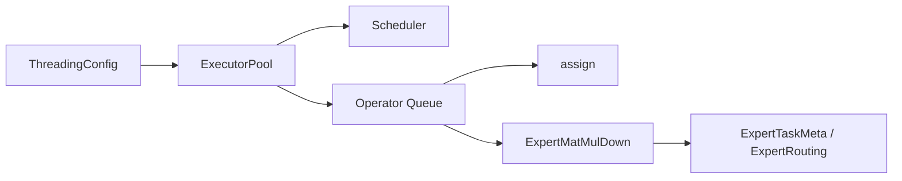

# 并行执行调度

<cite>
**本文引用的文件列表**
- [scheduler.rs](file://src/runtime/scheduler/scheduler.rs)
- [task.rs](file://src/runtime/scheduler/task.rs)
- [executor_pool.rs](file://src/runtime/executor/executor_pool.rs)
- [assign.rs](file://src/operators/assign.rs)
- [expert_routing.rs](file://src/operators/expert/expert_routing.rs)
- [expert_matmul_mul.rs](file://src/operators/expert/expert_matmul_mul.rs)
- [config.rs](file://src/runtime/config.rs)
</cite>

## 目录
1. [简介](#简介)
2. [项目结构](#项目结构)
3. [核心组件](#核心组件)
4. [架构总览](#架构总览)
5. [详细组件分析](#详细组件分析)
6. [依赖关系分析](#依赖关系分析)
7. [性能考量](#性能考量)
8. [故障排查指南](#故障排查指南)
9. [结论](#结论)
10. [附录](#附录)

## 简介
本技术文档聚焦于并行执行调度的实现与优化，围绕以下关键点展开：
- detect_threads 的线程数检测机制：如何基于 CPU 可用并行度动态调整并行度。
- task_assign 的任务分配算法：如何将总任务数均匀分配到各工作线程。
- thread_slices 的每线程私有缓冲区管理策略：a_tile_pool、acc_pool、idx_buf_pool 等缓冲区的复用机制。
- ExpertTaskMeta 在任务元数据中的作用：专家 ID、token 范围、任务边界等信息的组织方式。
- 多线程环境下的扩展性与负载均衡优化建议。

## 项目结构
与并行调度相关的核心代码分布在运行时调度器、算子分配与专家路径中：
- 运行时调度器负责将批次中的预填充（prefill）与解码（decode）阶段切分为可执行的切片，并构建 ScheduleTask。
- 执行池 ExecutorPool 启动固定数量的工作线程，循环拉取任务并调用算子执行。
- 算子内部使用 assign 进行任务区间划分，并在专家路径中使用 ExpertTaskMeta 组织按专家聚合的任务空间。
- 线程数探测与配置由 detect_threads 与 ThreadingConfig 提供。

图表来源
- [scheduler.rs:15-82](file://src/runtime/scheduler/scheduler.rs#L15-L82)
- [executor_pool.rs:10-149](file://src/runtime/executor/executor_pool.rs#L10-L149)
- [assign.rs:11-38](file://src/operators/assign.rs#L11-L38)
- [expert_routing.rs:6-41](file://src/operators/expert/expert_routing.rs#L6-L41)
- [expert_matmul_mul.rs:95-207](file://src/operators/expert/expert_matmul_mul.rs#L95-L207)

章节来源
- [scheduler.rs:15-82](file://src/runtime/scheduler/scheduler.rs#L15-L82)
- [executor_pool.rs:10-149](file://src/runtime/executor/executor_pool.rs#L10-L149)
- [assign.rs:11-38](file://src/operators/assign.rs#L11-L38)
- [expert_routing.rs:6-41](file://src/operators/expert/expert_routing.rs#L6-L41)
- [expert_matmul_mul.rs:95-207](file://src/operators/expert/expert_matmul_mul.rs#L95-L207)

## 核心组件
- Scheduler：扫描批处理槽位，统计 prefill 与 decode 数量，构建 SequenceSlice 列表与 per-thread 分片，输出 ScheduleTask。
- ExecutorPool：创建固定数量的 worker 线程，通过屏障同步，轮询调度器生成任务并执行算子队列。
- assign：将长度为 length 的任务区间均匀划分为 num 份，返回第 id 个线程的 [begin, end)。
- ExpertTaskMeta：记录每个专家对应的 token 起始偏移、长度以及全局任务区间，用于将全局任务映射到具体专家与局部 tile。
- ExpertMatMulDown：实现专家下投影 GEMM，包含 detect_threads、thread_slices 与任务空间构建逻辑。

章节来源
- [scheduler.rs:15-223](file://src/runtime/scheduler/scheduler.rs#L15-L223)
- [task.rs:1-49](file://src/runtime/scheduler/task.rs#L1-L49)
- [executor_pool.rs:10-149](file://src/runtime/executor/executor_pool.rs#L10-L149)
- [assign.rs:11-38](file://src/operators/assign.rs#L11-L38)
- [expert_routing.rs:6-41](file://src/operators/expert/expert_routing.rs#L6-L41)
- [expert_matmul_mul.rs:95-207](file://src/operators/expert/expert_matmul_mul.rs#L95-L207)

## 架构总览
下图展示了从线程配置到任务构建、再到算子执行的整体流程。

图表来源
- [config.rs:62-104](file://src/runtime/config.rs#L62-L104)
- [scheduler.rs:66-131](file://src/runtime/scheduler/scheduler.rs#L66-L131)
- [executor_pool.rs:72-149](file://src/runtime/executor/executor_pool.rs#L72-L149)
- [assign.rs:11-38](file://src/operators/assign.rs#L11-L38)
- [expert_matmul_mul.rs:399-444](file://src/operators/expert/expert_matmul_mul.rs#L399-L444)

## 详细组件分析

### detect_threads 线程数检测机制
- 功能定位：在专家矩阵乘法算子中，detect_threads 用于确定每线程私有缓冲区的规模与任务空间大小。它读取系统可用的并行度，并以一个下限值作为最小并行度，避免在小核或受限环境中产生过小的并行粒度。
- 行为特征：
  - 获取 std::thread::available_parallelism()，失败时回退为 1。
  - 对结果应用 max(16)，确保至少以 16 线程的规模准备缓冲区，从而提升缓存命中与微内核吞吐。
- 影响范围：
  - 决定 a_tile_pool、acc_pool、idx_buf_pool、task_meta_pool 等缓冲区的容量。
  - 间接影响任务空间构建时的最大并发能力。

图表来源
- [expert_matmul_mul.rs:95-101](file://src/operators/expert/expert_matmul_mul.rs#L95-L101)

章节来源
- [expert_matmul_mul.rs:95-101](file://src/operators/expert/expert_matmul_mul.rs#L95-L101)

### task_assign 任务分配算法
- 功能定位：将全局任务 ID 映射到具体的专家及其内部的局部 tile 索引。
- 输入参数：
  - expert_tasks：按专家排序的 ExpertTaskMeta 数组。
  - output_column_tile_count：输出列方向上的 tile 计数。
  - task_id：当前全局任务 ID。
- 算法步骤：
  - 使用 partition_point 找到第一个 task_end > task_id 的专家条目，即该任务所属的专家。
  - 校验 task_id 落在 [task_begin, task_end) 范围内。
  - 计算 local_task_id = task_id - task_begin。
  - 根据 output_column_tile_count 分解出 token 行块索引与输出列 tile 索引。
- 复杂度：O(log E) 查找（E 为活跃专家数），常数时间分解。

图表来源
- [expert_routing.rs:27-41](file://src/operators/expert/expert_routing.rs#L27-L41)

章节来源
- [expert_routing.rs:27-41](file://src/operators/expert/expert_routing.rs#L27-L41)

### thread_slices 每线程私有缓冲区分配与管理
- 功能定位：为每个工作线程提供独立的 scratch 缓冲区，避免跨线程竞争与锁开销。
- 主要缓冲区：
  - a_tile_pool：输入 micro 块的临时缓存，大小为 threads × micro_tile_rows × reduction_block_cols。
  - acc_pool：累加器 micro 块缓存，大小为 threads × micro_tile_rows × micro_tile_cols。
  - idx_buf_pool：路由后的 token 下标缓存，大小为 threads × token_block_rows。
  - task_meta_pool：每线程一份 ExpertTaskMeta 数组，大小为 threads × num_experts。
  - routed_*_pool：每线程一份紧凑的 token、slot、score 缓冲，大小为 threads × num_experts × capacity_per_expert。
- 访问方式：
  - thread_slices(tid) 通过 stride 计算每线程切片指针，直接返回 a_tile、acc、idx_buf 的原始指针。
  - build_task_space 使用相同策略为 task_meta 与 routed 缓冲定位每线程区域。
- 生命周期：
  - 在 new() 中一次性分配所有缓冲区，run() 中仅复用，不动态分配，降低内存抖动。
  - 每次任务开始前清零必要的累加器与索引区，保证正确性。

图表来源
- [expert_matmul_mul.rs:68-89](file://src/operators/expert/expert_matmul_mul.rs#L68-L89)
- [expert_matmul_mul.rs:199-207](file://src/operators/expert/expert_matmul_mul.rs#L199-L207)
- [expert_matmul_mul.rs:313-397](file://src/operators/expert/expert_matmul_mul.rs#L313-L397)
- [expert_routing.rs:6-22](file://src/operators/expert/expert_routing.rs#L6-L22)

章节来源
- [expert_matmul_mul.rs:68-89](file://src/operators/expert/expert_matmul_mul.rs#L68-L89)
- [expert_matmul_mul.rs:199-207](file://src/operators/expert/expert_matmul_mul.rs#L199-L207)
- [expert_matmul_mul.rs:313-397](file://src/operators/expert/expert_matmul_mul.rs#L313-L397)
- [expert_routing.rs:6-22](file://src/operators/expert/expert_routing.rs#L6-L22)

### Scheduler 与任务构建（ScheduleTask）
- 任务构建流程：
  - scan 批处理槽位，统计 prefill 与 decode 的数量，分别受 max_prefill_size 与 max_decode_size 限制。
  - 构建统一的 slices 列表，其中 prefill 部分可能拆分为多个 SequenceSlice；decode 部分每个槽位对应一个长度为 1 的 slice。
  - 针对 prefill，进一步将 token 流按线程均分到 prefilling_chunked_slices[thread_idx]，便于后续算子按线程消费。
- 关键数据结构：
  - SequenceSlice：包含 token_start_index、batch_index、next_sequence_index、length、last_token_flag。
  - ScheduleTask：汇总 prefill_size、decode_size、total_token_num，以及 slices 与 per-thread 分片。

图表来源
- [scheduler.rs:66-131](file://src/runtime/scheduler/scheduler.rs#L66-L131)
- [scheduler.rs:133-223](file://src/runtime/scheduler/scheduler.rs#L133-L223)
- [task.rs:1-49](file://src/runtime/scheduler/task.rs#L1-L49)

章节来源
- [scheduler.rs:66-223](file://src/runtime/scheduler/scheduler.rs#L66-L223)
- [task.rs:1-49](file://src/runtime/scheduler/task.rs#L1-L49)

### ExecutorPool 工作线程与算子执行
- 线程模型：
  - 启动 thread_num 个工作线程，每个线程名称为 worker-{id}。
  - 使用 SpinBarrier 在所有线程间同步，确保任务构建完成后统一执行。
- 执行循环：
  - 线程 0 负责调用 scheduler.schedule_batch() 构建任务，其他线程等待 has_work 信号。
  - 所有线程 barrier.wait() 后，读取 ScheduleTask 并遍历 operator_queue 调用 run(...)。
  - 执行完毕后，线程 0 重置 task，以便下一轮调度。
- 与 assign 的协作：
  - 算子在 run() 内部使用 assign(total_tasks, thread_num, thread_id) 获取自身任务区间，实现无锁的静态任务划分。

图表来源
- [executor_pool.rs:46-149](file://src/runtime/executor/executor_pool.rs#L46-L149)
- [scheduler.rs:66-82](file://src/runtime/scheduler/scheduler.rs#L66-L82)

章节来源
- [executor_pool.rs:46-149](file://src/runtime/executor/executor_pool.rs#L46-L149)
- [scheduler.rs:66-82](file://src/runtime/scheduler/scheduler.rs#L66-L82)

### 线程配置与动态调整
- ThreadingConfig：
  - 从 GenerationConfig 或系统可用并行度推导 requested_thread_num。
  - 尝试识别物理核心数，结合 API 线程数，计算 total_threads、blocking_threads。
- 与 detect_threads 的关系：
  - 高层调度器使用 ThreadingConfig 提供的线程数。
  - 专家算子内部 detect_threads 独立决定其私有缓冲规模，通常不小于 16，以保证微内核效率。

图表来源
- [config.rs:62-104](file://src/runtime/config.rs#L62-L104)

章节来源
- [config.rs:62-104](file://src/runtime/config.rs#L62-L104)

## 依赖关系分析
- Scheduler 依赖 SharedMut<Vec<SlotState>> 与 ScheduleTask，负责将批状态转换为可执行切片。
- ExecutorPool 依赖 Scheduler 与 Operator 队列，并通过 SpinBarrier 协调线程同步。
- 算子内部依赖 assign 进行任务区间划分，专家路径依赖 ExpertTaskMeta 与 ExpertRouting 完成按专家聚合的任务空间构建。
- 线程配置由 ThreadingConfig 提供，影响 ExecutorPool 的工作线程数与阻塞线程数。

图表来源
- [config.rs:62-104](file://src/runtime/config.rs#L62-L104)
- [executor_pool.rs:10-149](file://src/runtime/executor/executor_pool.rs#L10-L149)
- [scheduler.rs:15-82](file://src/runtime/scheduler/scheduler.rs#L15-L82)
- [assign.rs:11-38](file://src/operators/assign.rs#L11-L38)
- [expert_routing.rs:6-41](file://src/operators/expert/expert_routing.rs#L6-L41)
- [expert_matmul_mul.rs:95-207](file://src/operators/expert/expert_matmul_mul.rs#L95-L207)

章节来源
- [config.rs:62-104](file://src/runtime/config.rs#L62-L104)
- [executor_pool.rs:10-149](file://src/runtime/executor/executor_pool.rs#L10-L149)
- [scheduler.rs:15-82](file://src/runtime/scheduler/scheduler.rs#L15-L82)
- [assign.rs:11-38](file://src/operators/assign.rs#L11-L38)
- [expert_routing.rs:6-41](file://src/operators/expert/expert_routing.rs#L6-L41)
- [expert_matmul_mul.rs:95-207](file://src/operators/expert/expert_matmul_mul.rs#L95-L207)

## 性能考量
- 任务划分均衡性：
  - assign 将剩余任务优先分配给前 remainder 个线程，保证负载相对均衡。
  - 对于专家路径，先按专家聚合再按 token 行块与输出列 tile 分解，减少跨专家切换带来的缓存失效。
- 缓存友好性：
  - 每线程私有缓冲区避免伪共享与锁竞争。
  - 权重面板预打包（packed_wdown）提升访存局部性。
- 微内核粒度：
  - micro_tile_rows 与 micro_tile_cols 的选择影响寄存器压力与指令吞吐，需与硬件特性匹配。
- 线程数选择：
  - detect_threads 的下限 16 确保在高负载场景下具备足够并行度；高层 ThreadingConfig 考虑物理核心数与 API 线程占用，避免过度超分。

[本节为通用性能讨论，无需特定文件引用]

## 故障排查指南
- 无任务可调度：
  - 检查 batch_list 是否为空或全部处于 Eos 状态。
  - 确认 max_prefill_size 与 max_decode_size 是否过小导致无法形成任务。
- 线程空闲：
  - 确认 has_work 信号是否正确触发。
  - 检查 SpinBarrier 是否造成死锁或长时间自旋。
- 专家路径异常：
  - 验证 ExpertTaskMeta 的 task_begin/task_end 是否覆盖完整任务区间。
  - 核对 routed_tokens/routed_slots/routed_scores 的每线程偏移与 stride 计算。

章节来源
- [scheduler.rs:66-131](file://src/runtime/scheduler/scheduler.rs#L66-L131)
- [executor_pool.rs:72-149](file://src/runtime/executor/executor_pool.rs#L72-L149)
- [expert_matmul_mul.rs:313-397](file://src/operators/expert/expert_matmul_mul.rs#L313-L397)

## 结论
本并行执行调度方案通过 Scheduler 的批次切分、ExecutorPool 的固定线程模型、assign 的静态任务划分以及 ExpertTaskMeta 的专家级任务组织，实现了高效的多线程执行。detect_threads 与 ThreadingConfig 共同保障线程数的合理性与可扩展性。每线程私有缓冲区的复用策略显著降低了内存分配与同步开销，提升了整体吞吐。

[本节为总结性内容，无需特定文件引用]

## 附录
- 术语说明：
  - prefill：批量预填充阶段，一次处理较长序列。
  - decode：逐 token 解码阶段，每次处理单个 token。
  - tile：微内核计算的块状单位，按行与列维度切分。
  - 专家：MoE 模型中的独立子网络，按 token 路由激活。

[本节为概念性内容，无需特定文件引用]