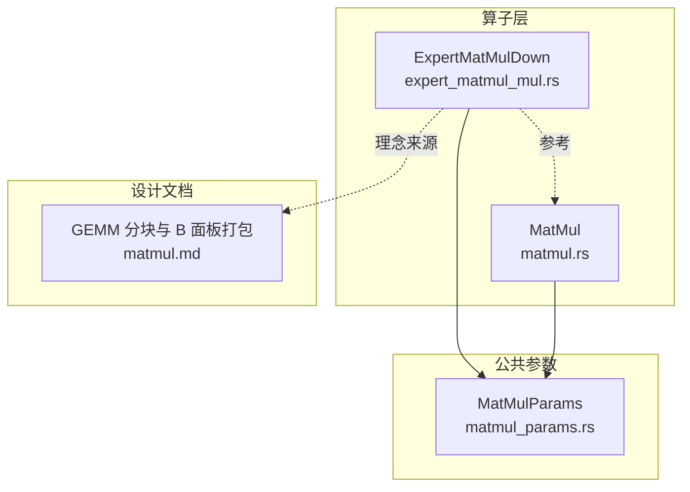
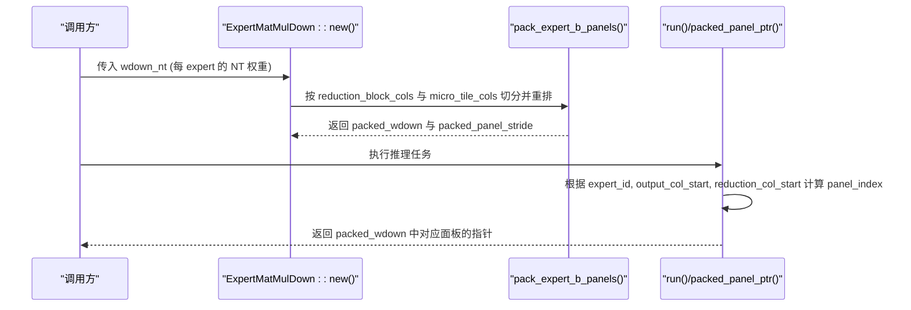
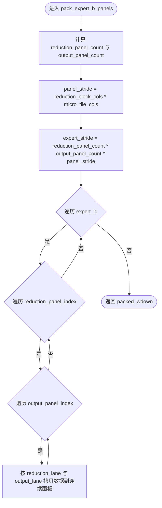
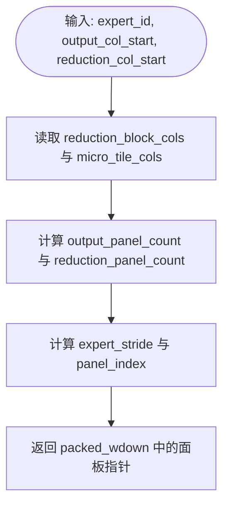
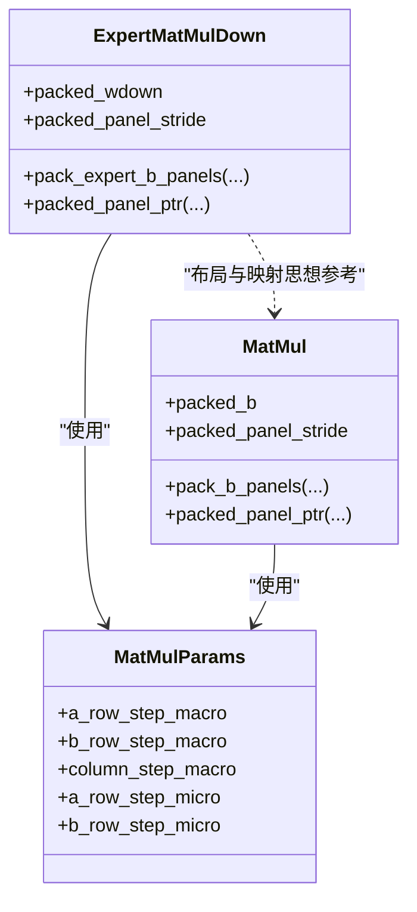

# 权重面板预打包机制

<cite>
**本文引用的文件**
- [src/operators/expert/expert_matmul_mul.rs](file://src/operators/expert/expert_matmul_mul.rs)
- [src/operators/matmul/matmul.rs](file://src/operators/matmul/matmul.rs)
- [src/kernel/common/matmul_params.rs](file://src/kernel/common/matmul_params.rs)
- [docs/design/operators/matmul.md](file://docs/design/operators/matmul.md)
</cite>

## 目录
1. [引言](#引言)
2. [项目结构](#项目结构)
3. [核心组件](#核心组件)
4. [架构总览](#架构总览)
5. [详细组件分析](#详细组件分析)
6. [依赖关系分析](#依赖关系分析)
7. [性能考量](#性能考量)
8. [故障排查指南](#故障排查指南)
9. [结论](#结论)
10. [附录](#附录)

## 引言
本技术文档聚焦于“权重面板预打包机制”，围绕 pack_expert_b_panels 函数的实现原理、packed_wdown 内存布局与步长计算、以及 packed_panel_ptr 的面板索引映射算法进行深入解析。同时，结合微内核 GEMM 的访问模式，说明该机制在缓存友好性、SIMD/向量指令复用和线程并行方面的优化策略，并给出不同专家数量与维度配置下的打包效果对比思路。

## 项目结构
与权重面板预打包相关的代码主要分布在以下模块：
- 专家下投影算子（MoE Down）：负责将每个 expert 的权重按 reduction_block_cols 与 micro_tile_cols 切分为 panel，并预打包为 packed_wdown。
- 通用矩阵乘算子：提供通用的 B 权重面板打包逻辑与面板指针定位方法，作为参考实现。
- 公共参数定义：MatMulParams 定义了宏块与微内核 tile 尺寸，贯穿打包与运行阶段。
- 设计文档：解释 GEMM 分块、B 面板打包动机与收益。

图表来源
- [src/operators/expert/expert_matmul_mul.rs:103-197](file://src/operators/expert/expert_matmul_mul.rs#L103-L197)
- [src/operators/matmul/matmul.rs:62-100](file://src/operators/matmul/matmul.rs#L62-L100)
- [src/kernel/common/matmul_params.rs:1-36](file://src/kernel/common/matmul_params.rs#L1-L36)
- [docs/design/operators/matmul.md:100-196](file://docs/design/operators/matmul.md#L100-L196)

章节来源
- [src/operators/expert/expert_matmul_mul.rs:103-197](file://src/operators/expert/expert_matmul_mul.rs#L103-L197)
- [src/operators/matmul/matmul.rs:62-100](file://src/operators/matmul/matmul.rs#L62-L100)
- [src/kernel/common/matmul_params.rs:1-36](file://src/kernel/common/matmul_params.rs#L1-L36)
- [docs/design/operators/matmul.md:100-196](file://docs/design/operators/matmul.md#L100-L196)

## 核心组件
- ExpertMatMulDown：面向 MoE 下投影的算子，内部维护 packed_wdown 与 packed_panel_stride，并在 new() 中一次性完成所有 expert 权重的面板预打包。
- MatMul：通用 GEMM 算子，提供 pack_b_panels 与 packed_panel_ptr 的参考实现，用于理解面板划分与索引映射。
- MatMulParams：统一描述宏块（MB/NB/KC）与微内核 tile（MR/NR），是面板划分与步长计算的依据。

章节来源
- [src/operators/expert/expert_matmul_mul.rs:42-89](file://src/operators/expert/expert_matmul_mul.rs#L42-L89)
- [src/operators/matmul/matmul.rs:27-51](file://src/operators/matmul/matmul.rs#L27-L51)
- [src/kernel/common/matmul_params.rs:1-36](file://src/kernel/common/matmul_params.rs#L1-L36)

## 架构总览
下图展示了从原始权重到 packed_wdown 的转换流程，以及运行时通过 packed_panel_ptr 快速定位目标面板的过程。

图表来源
- [src/operators/expert/expert_matmul_mul.rs:103-197](file://src/operators/expert/expert_matmul_mul.rs#L103-L197)
- [src/operators/expert/expert_matmul_mul.rs:210-275](file://src/operators/expert/expert_matmul_mul.rs#L210-L275)

## 详细组件分析

### pack_expert_b_panels 函数：面板划分与重排
- 输入权重布局：每个 expert 的权重以 NT 形式存储，即 [output_cols, reduction_cols]，行主序。
- 面板维度：
  - reduction_panel_count = ceil(reduction_cols / reduction_block_cols)
  - output_panel_count = ceil(output_cols / micro_tile_cols)
- 面板大小：panel_stride = reduction_block_cols * micro_tile_cols
- 每个 expert 的 stride：expert_stride = reduction_panel_count * output_panel_count * panel_stride
- 打包过程：
  - 外层遍历 expert_id
  - 中层遍历 reduction_panel_index
  - 内层遍历 output_panel_index
  - 对每个 panel，将源权重按列优先顺序拷贝至连续内存：
    - 对于 reduction_lane ∈ [0, reduction_cols_this)，output_lane ∈ [0, output_cols_this)
    - 写入位置：packed_row.add(output_lane)，其中 packed_row = packed_panel.add(reduction_lane * micro_tile_cols)
    - 读取位置：source_expert[(output_start + output_lane) * reduction_cols + (reduction_start + reduction_lane)]
- 输出布局：packed_wdown 整体形状为 [E][reduction_panels][output_panels][reduction_block × micro_cols]，同一 panel 的数据在内存中连续存放，便于微内核顺序读取。

图表来源
- [src/operators/expert/expert_matmul_mul.rs:210-254](file://src/operators/expert/expert_matmul_mul.rs#L210-L254)

章节来源
- [src/operators/expert/expert_matmul_mul.rs:210-254](file://src/operators/expert/expert_matmul_mul.rs#L210-L254)

### packed_wdown 内存布局与步长参数
- packed_panel_stride：等于 reduction_block_cols * micro_tile_cols，表示一个面板的连续元素数。
- expert_stride：等于 reduction_panel_count * output_panel_count * packed_panel_stride，表示单个 expert 占用的连续内存长度。
- 布局层次：
  - 最外层：expert_id
  - 次外层：reduction_panel_index
  - 再次层：output_panel_index
  - 最内层：panel 的连续数据，按 reduction_lane 行优先排列，每行包含 micro_tile_cols 个元素

这种布局使得：
- 同一 panel 的数据在内存中连续，利于 SIMD 加载与硬件预取。
- 通过简单的算术运算即可定位任意 expert 与任意 panel 的起始地址。

章节来源
- [src/operators/expert/expert_matmul_mul.rs:131-139](file://src/operators/expert/expert_matmul_mul.rs#L131-L139)
- [src/operators/expert/expert_matmul_mul.rs:218-222](file://src/operators/expert/expert_matmul_mul.rs#L218-L222)

### 面板索引映射算法：packed_panel_ptr
- 输入：expert_id, output_col_start, reduction_col_start
- 计算步骤：
  - reduction_block_cols = params.column_step_macro.max(1)
  - micro_tile_cols = params.b_row_step_micro.max(1)
  - output_panel_count = h.div_ceil(micro_tile_cols)
  - reduction_panel_count = hmid.div_ceil(reduction_block_cols)
  - expert_stride = reduction_panel_count * output_panel_count * packed_panel_stride
  - panel_index = (reduction_col_start / reduction_block_cols) * output_panel_count + (output_col_start / micro_tile_cols)
  - 最终指针 = packed_wdown[expert_id * expert_stride + panel_index * packed_panel_stride]

该映射保证：
- 给定任意 output_col_start 与 reduction_col_start，都能在 O(1) 时间内定位到对应的 packed 面板。
- 与 pack_expert_b_panels 的重排规则一致，确保读写对齐。

图表来源
- [src/operators/expert/expert_matmul_mul.rs:257-275](file://src/operators/expert/expert_matmul_mul.rs#L257-L275)

章节来源
- [src/operators/expert/expert_matmul_mul.rs:257-275](file://src/operators/expert/expert_matmul_mul.rs#L257-L275)

### 参考实现：通用 MatMul 的 pack_b_panels 与 packed_panel_ptr
- pack_b_panels：与专家版类似，但针对单矩阵 B_nt[N×K]，按 reduction_block_cols 与 micro_tile_cols 切分并重排为 [reduction_panels][output_panels][reduction_block × micro_cols]。
- packed_panel_ptr：根据 output_col_start 与 reduction_col_start 计算 panel_index，并返回 packed_b 中的面板指针。

这些实现有助于理解面板划分与索引映射的通用模式，适用于非专家场景。

章节来源
- [src/operators/matmul/matmul.rs:110-163](file://src/operators/matmul/matmul.rs#L110-L163)

## 依赖关系分析
- ExpertMatMulDown 依赖 MatMulParams 提供的宏块与微内核尺寸，用于面板划分与步长计算。
- ExpertMatMulDown 的 pack_expert_b_panels 与 packed_panel_ptr 与 MatMul 的 pack_b_panels 与 packed_panel_ptr 共享相同的布局与映射思想。
- 设计文档 matmul.md 解释了为何要将 B 权重打包为 KC×NR 的连续面板，以提升缓存命中与 SIMD 效率。

图表来源
- [src/kernel/common/matmul_params.rs:1-36](file://src/kernel/common/matmul_params.rs#L1-L36)
- [src/operators/expert/expert_matmul_mul.rs:103-197](file://src/operators/expert/expert_matmul_mul.rs#L103-L197)
- [src/operators/matmul/matmul.rs:62-100](file://src/operators/matmul/matmul.rs#L62-L100)

章节来源
- [src/kernel/common/matmul_params.rs:1-36](file://src/kernel/common/matmul_params.rs#L1-L36)
- [src/operators/expert/expert_matmul_mul.rs:103-197](file://src/operators/expert/expert_matmul_mul.rs#L103-L197)
- [src/operators/matmul/matmul.rs:62-100](file://src/operators/matmul/matmul.rs#L62-L100)

## 性能考量
- 缓存友好性：
  - 面板内数据连续，减少跨行跳跃，提升 L1/L2 命中率。
  - 微内核按固定 MR×NR 消费数据，有利于寄存器复用与广播乘法。
- SIMD/向量指令：
  - 连续面板使一次向量加载可覆盖多个输出列，配合 FMA 指令提高吞吐。
- 线程并行：
  - 每个线程拥有私有 scratch 缓冲，避免写冲突与伪共享。
- 控制开销：
  - 预打包在 new() 中完成，run() 仅读取已准备好的内存，降低运行时分配与重排成本。

章节来源
- [docs/design/operators/matmul.md:100-196](file://docs/design/operators/matmul.md#L100-L196)
- [src/operators/expert/expert_matmul_mul.rs:141-159](file://src/operators/expert/expert_matmul_mul.rs#L141-L159)

## 故障排查指南
- 越界访问：
  - 检查 output_col_start 与 reduction_col_start 是否超出各自面板边界。
  - 确认 output_panel_count 与 reduction_panel_count 的计算与 div_ceil 语义一致。
- 布局不一致：
  - 确保 pack_expert_b_panels 与 packed_panel_ptr 使用的 reduction_block_cols 与 micro_tile_cols 一致。
  - 验证 expert_stride 与 packed_panel_stride 的计算是否与打包循环的写入顺序匹配。
- 线程安全：
  - 确认 run() 中各线程使用独立的 a_tile_pool、acc_pool、idx_buf_pool 等缓冲区，避免并发写冲突。

章节来源
- [src/operators/expert/expert_matmul_mul.rs:210-275](file://src/operators/expert/expert_matmul_mul.rs#L210-L275)
- [src/operators/expert/expert_matmul_mul.rs:141-159](file://src/operators/expert/expert_matmul_mul.rs#L141-L159)

## 结论
权重面板预打包机制通过将原始权重按 reduction_block_cols 与 micro_tile_cols 维度进行面板划分与重排，形成 packed_wdown 的连续内存布局，显著提升了缓存命中率与 SIMD 利用率。packed_panel_ptr 的 O(1) 面板索引映射确保了运行时的高效寻址。结合线程私有的 scratch 缓冲与固定的微内核 tile 尺寸，该机制在 MoE 下投影场景中实现了稳定且高效的计算路径。

## 附录

### 不同专家数量与维度配置下的打包效果对比（方法论）
- 维度组合建议：
  - 小模型：num_experts=8, hmid=1024, h=512, reduction_block_cols=64, micro_tile_cols=32
  - 中等模型：num_experts=16, hmid=2048, h=1024, reduction_block_cols=64, micro_tile_cols=32
  - 大模型：num_experts=32, hmid=4096, h=2048, reduction_block_cols=64, micro_tile_cols=32
- 评估指标：
  - 预打包时间：new() 中 pack_expert_b_panels 的执行耗时
  - 运行时访存带宽：run() 中 packed_wdown 的顺序读取比例与缓存命中率
  - 吞吐：单位时间内完成的 token 数或 FLOPS 利用率
- 分析方法：
  - 记录不同配置下的 packed_wdown 大小与 expert_stride
  - 使用性能剖析工具统计 L1/L2/L3 命中率与向量指令占用率
  - 对比未打包与打包两种路径的端到端延迟与吞吐差异

[本节为方法论说明，不直接分析具体源码文件]