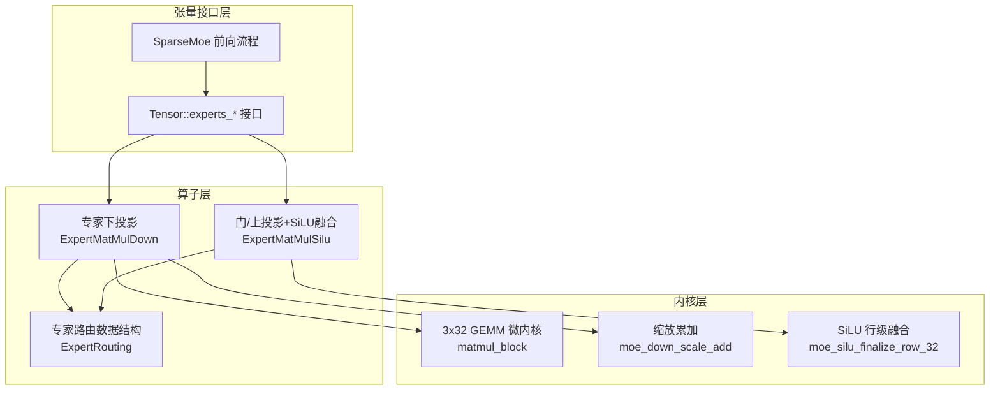
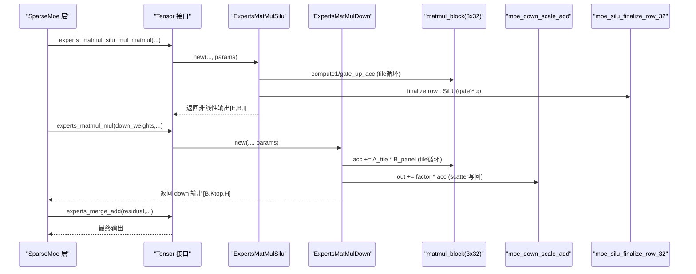
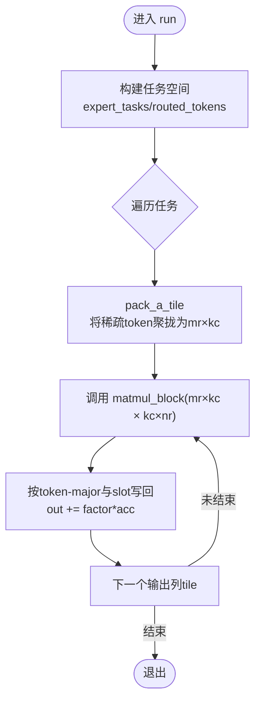
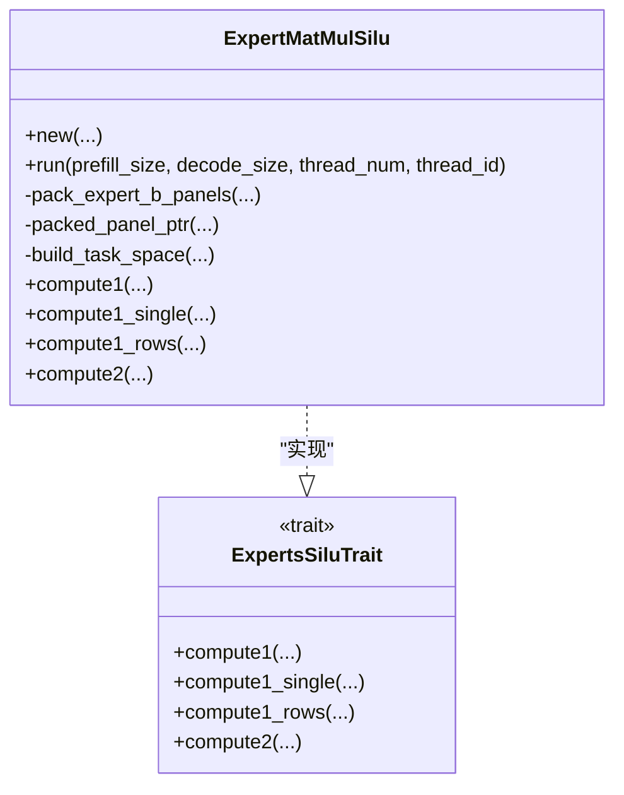
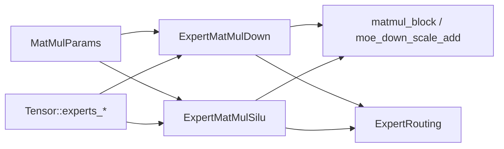

# 专家计算优化

<cite>
**本文引用的文件列表**
- [src/kernel/common/matmul_params.rs](file://src/kernel/common/matmul_params.rs)
- [src/operators/expert/expert_matmul_mul.rs](file://src/operators/expert/expert_matmul_mul.rs)
- [src/operators/expert/expert_matmul_silu_mul_matmul.rs](file://src/operators/expert/expert_matmul_silu_mul_matmul.rs)
- [src/kernel/x86_64/f16_512/matmul_block.rs](file://src/kernel/x86_64/f16_512/matmul_block.rs)
- [src/kernel/x86_64/f16_512/moe_down.rs](file://src/kernel/x86_64/f16_512/moe_down.rs)
- [src/kernel/x86_64/f16_512/moe_silu.rs](file://src/kernel/x86_64/f16_512/moe_silu.rs)
- [src/operators/expert/expert_routing.rs](file://src/operators/expert/expert_routing.rs)
- [src/tensor/moe.rs](file://src/tensor/moe.rs)
- [src/transformer/sparse_moe/layer.rs](file://src/transformer/sparse_moe/layer.rs)
- [src/tensor/tests/performance.rs](file://src/tensor/tests/performance.rs)
</cite>

## 目录
1. [简介](#简介)
2. [项目结构](#项目结构)
3. [核心组件](#核心组件)
4. [架构总览](#架构总览)
5. [详细组件分析](#详细组件分析)
6. [依赖关系分析](#依赖关系分析)
7. [性能考量与调优](#性能考量与调优)
8. [故障排查指南](#故障排查指南)
9. [结论](#结论)
10. [附录](#附录)

## 简介
本技术文档聚焦于 eLLM 中“专家（MoE）”路径的计算优化，涵盖以下主题：
- 专家矩阵乘法的分块、预打包与 SIMD 微内核策略
- Silu 激活在专家路径中的融合优化
- 多专家并行计算的内存访问模式与缓存友好设计
- MatMulParams 步长参数的含义与调优方法
- 不同专家数量下的基准测试方法与结果解读
- 解码模式下的特殊优化策略
- 专家计算的性能分析与调试方法
- 如何为新专家算子添加优化支持

## 项目结构
本项目采用“算子层 + 内核层 + 张量接口层”的分层组织方式：
- 算子层：封装专家路由、GEMM、SiLU 融合等高层逻辑
- 内核层：提供 x86_64 AVX-512 FP16 的 3x32 微内核与专用向量函数
- 张量接口层：将高层 API 编排为可并行的 Operator 队列

图示来源
- [src/operators/expert/expert_matmul_mul.rs:1-120](file://src/operators/expert/expert_matmul_mul.rs#L1-L120)
- [src/operators/expert/expert_matmul_silu_mul_matmul.rs:1-120](file://src/operators/expert/expert_matmul_silu_mul_matmul.rs#L1-L120)
- [src/kernel/x86_64/f16_512/matmul_block.rs:1-85](file://src/kernel/x86_64/f16_512/matmul_block.rs#L1-L85)
- [src/kernel/x86_64/f16_512/moe_down.rs:1-36](file://src/kernel/x86_64/f16_512/moe_down.rs#L1-L36)
- [src/kernel/x86_64/f16_512/moe_silu.rs:1-47](file://src/kernel/x86_64/f16_512/moe_silu.rs#L1-L47)
- [src/tensor/moe.rs:59-134](file://src/tensor/moe.rs#L59-L134)
- [src/transformer/sparse_moe/layer.rs:152-198](file://src/transformer/sparse_moe/layer.rs#L152-L198)

章节来源
- [src/tensor/moe.rs:59-134](file://src/tensor/moe.rs#L59-L134)
- [src/transformer/sparse_moe/layer.rs:152-198](file://src/transformer/sparse_moe/layer.rs#L152-L198)

## 核心组件
- MatMulParams：定义宏/微分块与列块步长，用于统一描述 tile 布局与内核调用参数
- ExpertMatMulDown：专家下投影（非线性输入 × W_down），含权重面板预打包、线程私有缓存、任务划分与 scatter 写回
- ExpertMatMulSilu：门/上投影并行 GEMM + SiLU(gate)×up 融合，避免中间显存写入
- 3x32 微内核 matmul_block：AVX-512 FP16 广播式 3x32 内核，最大化访存局部性与 FMA 吞吐
- moe_down_scale_add：按路由权重对输出进行缩放累加
- moe_silu_finalize_row_32：一行 32 个元素的 SiLU 融合

章节来源
- [src/kernel/common/matmul_params.rs:1-36](file://src/kernel/common/matmul_params.rs#L1-L36)
- [src/operators/expert/expert_matmul_mul.rs:1-120](file://src/operators/expert/expert_matmul_mul.rs#L1-L120)
- [src/operators/expert/expert_matmul_silu_mul_matmul.rs:1-120](file://src/operators/expert/expert_matmul_silu_mul_matmul.rs#L1-L120)
- [src/kernel/x86_64/f16_512/matmul_block.rs:1-85](file://src/kernel/x86_64/f16_512/matmul_block.rs#L1-L85)
- [src/kernel/x86_64/f16_512/moe_down.rs:1-36](file://src/kernel/x86_64/f16_512/moe_down.rs#L1-L36)
- [src/kernel/x86_64/f16_512/moe_silu.rs:1-47](file://src/kernel/x86_64/f16_512/moe_silu.rs#L1-L47)

## 架构总览
专家路径的前向流程由 SparseMoe 驱动，依次执行：
- 路由：根据评分选择 top-k 专家，生成紧凑的 per-expert token 队列
- Gate/Up 投影 + SiLU 融合：并行计算 gate 和 up，并在寄存器内完成 SiLU(gate)×up
- Down 投影：对每个专家的贡献做 GEMM，并按路由权重缩放后 scatter 到 token-major 输出
- 残差合并：将各专家输出按 slot 累加到残差

图示来源
- [src/transformer/sparse_moe/layer.rs:152-198](file://src/transformer/sparse_moe/layer.rs#L152-L198)
- [src/tensor/moe.rs:95-134](file://src/tensor/moe.rs#L95-L134)
- [src/operators/expert/expert_matmul_silu_mul_matmul.rs:367-559](file://src/operators/expert/expert_matmul_silu_mul_matmul.rs#L367-L559)
- [src/operators/expert/expert_matmul_mul.rs:399-578](file://src/operators/expert/expert_matmul_mul.rs#L399-L578)
- [src/kernel/x86_64/f16_512/matmul_block.rs:22-85](file://src/kernel/x86_64/f16_512/matmul_block.rs#L22-L85)
- [src/kernel/x86_64/f16_512/moe_down.rs:14-36](file://src/kernel/x86_64/f16_512/moe_down.rs#L14-L36)
- [src/kernel/x86_64/f16_512/moe_silu.rs:40-47](file://src/kernel/x86_64/f16_512/moe_silu.rs#L40-L47)

## 详细组件分析

### 专家下投影（ExpertMatMulDown）
- 目标：NONLIN[e,b,Hmid] × W_down[e,H,Hmid]^T → OUT[b,slot(b,e),H]
- 关键优化点：
  - 权重面板预打包：将 NT 权重重排为 [reduction_panel][output_panel] 的连续面板，提升 B 侧访存局部性
  - 每线程私有缓存池：a_tile、acc、idx_buf、task_meta 等，避免运行时分配与竞争
  - 任务空间构建：按 expert 统计路由 token 数，切分为 token_block × output_column_tile 的任务网格
  - 微内核调度：当 valid_rows=1 走单行路径；否则 pack 成 mr×kc 的 a_tile，再调用 3x32 内核
  - Scatter 写回：按 token-major 布局与 top-k slot 定位，乘以路由权重后累加到输出

图示来源
- [src/operators/expert/expert_matmul_mul.rs:399-578](file://src/operators/expert/expert_matmul_mul.rs#L399-L578)
- [src/operators/expert/expert_matmul_mul.rs:210-275](file://src/operators/expert/expert_matmul_mul.rs#L210-L275)
- [src/operators/expert/expert_matmul_mul.rs:277-310](file://src/operators/expert/expert_matmul_mul.rs#L277-L310)
- [src/kernel/x86_64/f16_512/matmul_block.rs:22-85](file://src/kernel/x86_64/f16_512/matmul_block.rs#L22-L85)
- [src/kernel/x86_64/f16_512/moe_down.rs:14-36](file://src/kernel/x86_64/f16_512/moe_down.rs#L14-L36)

章节来源
- [src/operators/expert/expert_matmul_mul.rs:1-120](file://src/operators/expert/expert_matmul_mul.rs#L1-L120)
- [src/operators/expert/expert_matmul_mul.rs:399-578](file://src/operators/expert/expert_matmul_mul.rs#L399-L578)

### 门/上投影 + SiLU 融合（ExpertMatMulSilu）
- 目标：并行计算 gate = X × W_gate^T 与 up = X × W_up^T，随后 C = SiLU(gate) × up
- 关键优化点：
  - 双路 GEMM 共享 A_tile 与 reduction panel，减少重复访存
  - 在寄存器/本地缓存中累积 gate_acc 与 up_acc，最后一次性写出 C
  - 使用 fused_update_gate_up_acc_block 或 matmul_block 加速两路累加
  - 行级 finalize：对每行执行 SiLU(gate)×up，NR=32 对齐 AVX-512 宽度

图示来源
- [src/operators/expert/expert_matmul_silu_mul_matmul.rs:35-91](file://src/operators/expert/expert_matmul_silu_mul_matmul.rs#L35-L91)
- [src/operators/expert/expert_matmul_silu_mul_matmul.rs:565-638](file://src/operators/expert/expert_matmul_silu_mul_matmul.rs#L565-L638)
- [src/operators/expert/expert_matmul_silu_mul_matmul.rs:643-800](file://src/operators/expert/expert_matmul_silu_mul_matmul.rs#L643-L800)

章节来源
- [src/operators/expert/expert_matmul_silu_mul_matmul.rs:1-120](file://src/operators/expert/expert_matmul_silu_mul_matmul.rs#L1-L120)
- [src/operators/expert/expert_matmul_silu_mul_matmul.rs:367-559](file://src/operators/expert/expert_matmul_silu_mul_matmul.rs#L367-L559)

### 3x32 微内核与专用向量函数
- matmul_block：针对 NR=32、MR≤3 的广播式内核，利用 _mm512_fmadd_ph 实现高吞吐
- moe_down_scale_add：按 32 元素向量化 out += factor*acc，处理尾部标量
- moe_silu_finalize_row_32：对一行 32 个元素执行 SiLU 与逐点乘法

章节来源
- [src/kernel/x86_64/f16_512/matmul_block.rs:1-85](file://src/kernel/x86_64/f16_512/matmul_block.rs#L1-L85)
- [src/kernel/x86_64/f16_512/moe_down.rs:1-36](file://src/kernel/x86_64/f16_512/moe_down.rs#L1-L36)
- [src/kernel/x86_64/f16_512/moe_silu.rs:1-47](file://src/kernel/x86_64/f16_512/moe_silu.rs#L1-L47)

### 路由与任务分配
- ExpertRouting：维护 per-expert 的紧凑 token 索引、分数与 top-k 映射
- task_assign：将全局任务 ID 映射到具体 expert 与局部 tile 坐标
- build_task_space：按 expert 聚合路由 token，构造任务元数据与缓冲

章节来源
- [src/operators/expert/expert_routing.rs:1-65](file://src/operators/expert/expert_routing.rs#L1-L65)
- [src/operators/expert/expert_routing.rs:67-125](file://src/operators/expert/expert_routing.rs#L67-L125)
- [src/operators/expert/expert_matmul_mul.rs:313-397](file://src/operators/expert/expert_matmul_mul.rs#L313-L397)
- [src/operators/expert/expert_matmul_silu_mul_matmul.rs:311-365](file://src/operators/expert/expert_matmul_silu_mul_matmul.rs#L311-L365)

## 依赖关系分析
- 算子依赖 MatMulParams 以统一 tile 参数
- 算子通过 trait 抽象 compute1/compute2，f16 特化调用 AVX-512 内核
- 张量接口将高层 API 转换为 Operator，并由运行器分发到多线程

图示来源
- [src/kernel/common/matmul_params.rs:1-36](file://src/kernel/common/matmul_params.rs#L1-L36)
- [src/operators/expert/expert_matmul_mul.rs:1-120](file://src/operators/expert/expert_matmul_mul.rs#L1-L120)
- [src/operators/expert/expert_matmul_silu_mul_matmul.rs:1-120](file://src/operators/expert/expert_matmul_silu_mul_matmul.rs#L1-L120)
- [src/tensor/moe.rs:59-134](file://src/tensor/moe.rs#L59-L134)

章节来源
- [src/kernel/common/matmul_params.rs:1-36](file://src/kernel/common/matmul_params.rs#L1-L36)
- [src/tensor/moe.rs:59-134](file://src/tensor/moe.rs#L59-L134)

## 性能考量与调优

### MatMulParams 步长参数说明与调优
- mb(a_row_step_macro)：A 的宏块行数（token 宏块大小），影响任务粒度与缓存命中
- nb(b_row_step_macro)：B 的宏块列数（输出宏块大小），控制输出 tile 宽度
- kc(column_step_macro)：规约块大小（reduction block），决定 B 面板与 A 列块的粒度
- mr(a_row_step_micro)：微内核行数（固定为 3），匹配 3x32 内核
- nr(b_row_step_micro)：微内核列数（固定为 32），匹配 AVX-512 向量宽度

调优建议：
- 保持 mr=3、nr=32 以启用最优 AVX-512 路径
- 增大 kc 可减少面板切换开销，但需保证 B 面板能放入 L1/L2
- 合理设置 mb/nb 以平衡线程负载与缓存复用，常见取值为 3/128 或 3/64
- 在解码模式下，mb 通常较小（如 1~3），应优先保证低延迟与高吞吐的 micro-kernel 利用率

章节来源
- [src/kernel/common/matmul_params.rs:1-36](file://src/kernel/common/matmul_params.rs#L1-L36)
- [src/operators/expert/expert_matmul_mul.rs:652-688](file://src/operators/expert/expert_matmul_mul.rs#L652-L688)
- [src/operators/expert/expert_matmul_silu_mul_matmul.rs:643-700](file://src/operators/expert/expert_matmul_silu_mul_matmul.rs#L643-L700)

### 多专家并行与内存访问模式
- 权重面板预打包：将分散的 NT 权重重排为连续面板，显著提升 B 侧顺序访存
- 每线程私有缓存：避免跨线程竞争，降低锁与缓存失效
- 路由后的 token 聚拢：将稀疏访问转为紧凑的 a_tile，提高 A 侧局部性
- 输出 scatter 写回：按 token-major 布局与 top-k slot 直接定位，减少间接寻址

章节来源
- [src/operators/expert/expert_matmul_mul.rs:210-275](file://src/operators/expert/expert_matmul_mul.rs#L210-L275)
- [src/operators/expert/expert_matmul_mul.rs:277-310](file://src/operators/expert/expert_matmul_mul.rs#L277-L310)
- [src/operators/expert/expert_matmul_silu_mul_matmul.rs:215-281](file://src/operators/expert/expert_matmul_silu_mul_matmul.rs#L215-L281)

### 解码模式下的特殊优化
- 解码时 prefill_size=0，仅处理 decode_size，任务空间更小
- 路由权重 factor 参与 moe_down_scale_add，避免额外乘法通道
- 小批量 token 更适配 micro-kernel，减少 pack 开销
- 可通过 decode_only_flag 跳过不必要的分支与统计

章节来源
- [src/operators/expert/expert_matmul_mul.rs:399-432](file://src/operators/expert/expert_matmul_mul.rs#L399-L432)
- [src/operators/expert/expert_matmul_silu_mul_matmul.rs:367-406](file://src/operators/expert/expert_matmul_silu_mul_matmul.rs#L367-L406)

### 不同专家数量下的基准测试方法
- 使用 tensor/tests/performance.rs 中的并行运行框架，结合 Avx512fp16 检测
- 调整 batch、N、K 与 MatMulParams，测量 GFLOPS
- 对于 MoE，可在 SparseMoe.forward 中传入不同 num_experts 与 num_topk，观察端到端耗时

示例参考路径：
- 并行运行与计时：[src/tensor/tests/performance.rs:10-33](file://src/tensor/tests/performance.rs#L10-L33)
- 算子并行执行入口：[src/tensor/tests/performance.rs:237-305](file://src/tensor/tests/performance.rs#L237-L305)
- 性能打印模板：[src/tensor/tests/performance.rs:376-387](file://src/tensor/tests/performance.rs#L376-L387)

章节来源
- [src/tensor/tests/performance.rs:10-33](file://src/tensor/tests/performance.rs#L10-L33)
- [src/tensor/tests/performance.rs:237-305](file://src/tensor/tests/performance.rs#L237-L305)
- [src/tensor/tests/performance.rs:376-387](file://src/tensor/tests/performance.rs#L376-L387)

## 故障排查指南
- 验证 AVX-512FP16 是否可用：在测试中先检测特征位，若不支持则跳过
- 检查路由数据一致性：确认 expert_counts、index_tensor、score_tensor 与 topk_indices 一致
- 核对输出零初始化：down 路径是 out += factor*acc，需在首次使用前清零
- 校验 tile 边界：确保 tokens_in_block、output_cols_in_block 与 micro 尺寸对齐
- 使用最小复现用例：参考 operator 测试片段，逐步缩小问题范围

章节来源
- [src/tensor/tests/performance.rs:36-40](file://src/tensor/tests/performance.rs#L36-L40)
- [src/operators/expert/expert_routing.rs:67-125](file://src/operators/expert/expert_routing.rs#L67-L125)
- [src/operators/expert/expert_matmul_mul.rs:544-578](file://src/operators/expert/expert_matmul_mul.rs#L544-L578)

## 结论
该专家计算优化方案通过“权重面板预打包 + 紧凑 token 聚拢 + 3x32 AVX-512 微内核 + 每线程私有缓存 + 路由权重融合”的组合策略，显著提升了多专家路径的吞吐与缓存效率。MatMulParams 的合理配置与解码模式的针对性优化进一步增强了在不同场景下的稳定性与性能表现。

## 附录

### 新增专家算子的优化支持步骤
- 定义算子结构与参数：参照 ExpertMatMulDown/Silu 的结构体与字段
- 实现 trait 方法：compute1/compute2 等，默认实现退化为标量路径
- 提供 f16 特化：在 AVX-512FP16 条件下调用 matmul_block 或专用向量函数
- 集成到张量接口：在 Tensor 扩展对应的方法，创建 Operator 并入队
- 编写测试与基准：覆盖正确性与性能回归，包含解码模式与不同专家数量

章节来源
- [src/operators/expert/expert_matmul_mul.rs:582-647](file://src/operators/expert/expert_matmul_mul.rs#L582-L647)
- [src/operators/expert/expert_matmul_silu_mul_matmul.rs:565-638](file://src/operators/expert/expert_matmul_silu_mul_matmul.rs#L565-L638)
- [src/tensor/moe.rs:59-134](file://src/tensor/moe.rs#L59-L134)