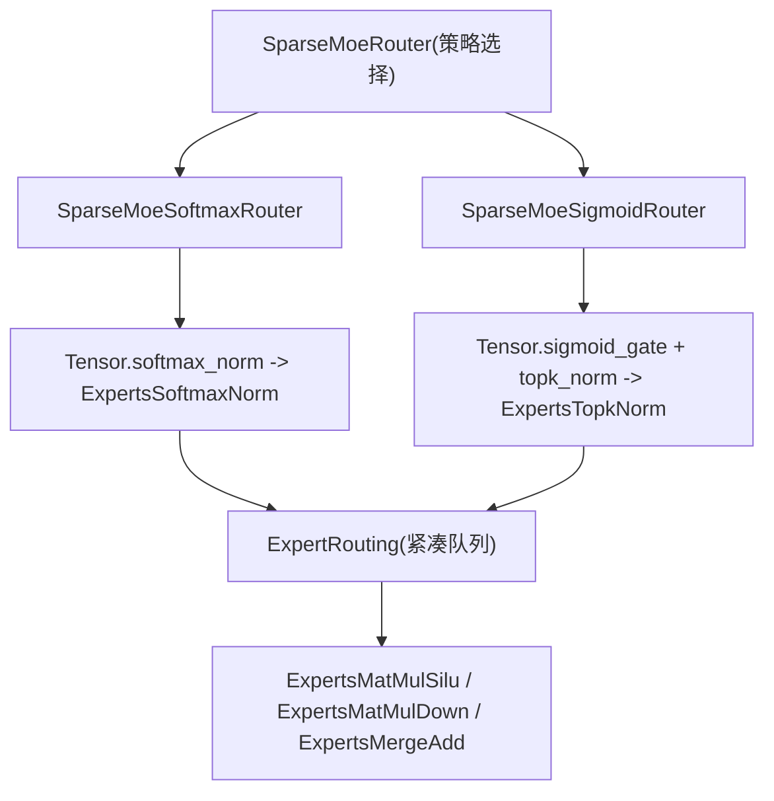
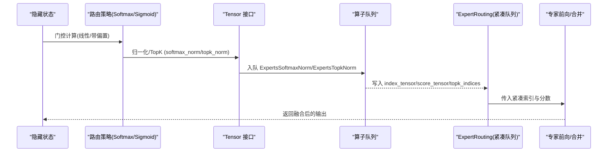
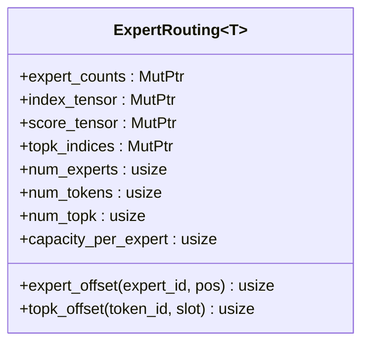
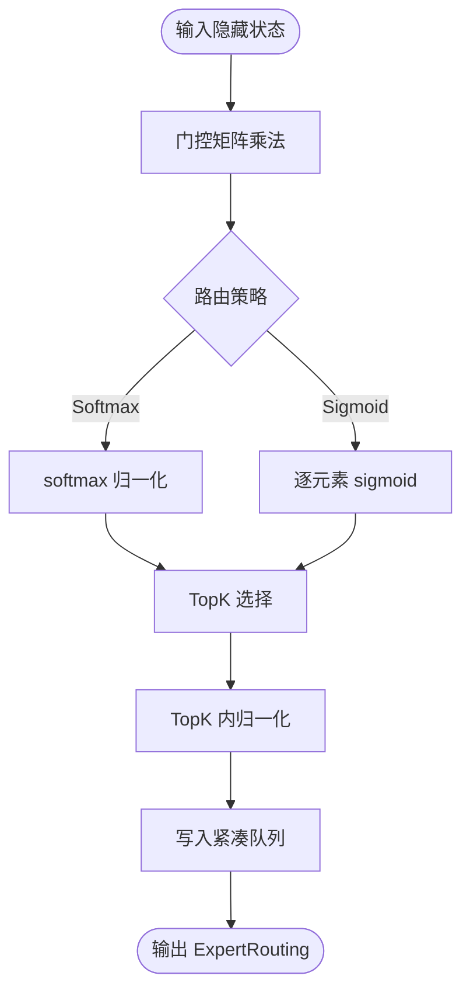
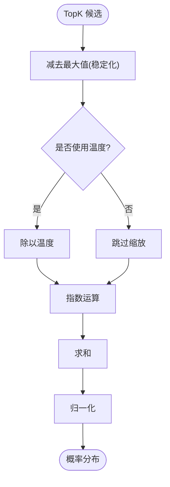
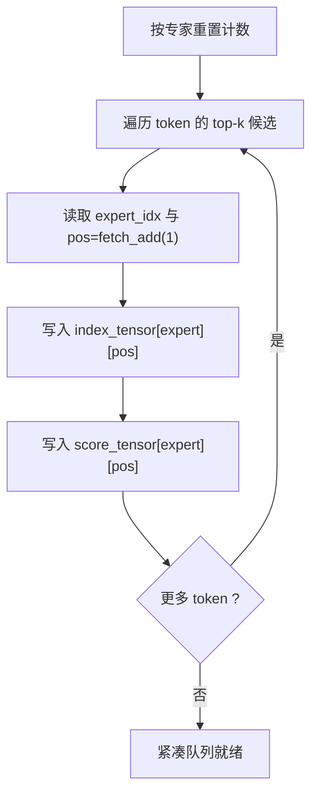
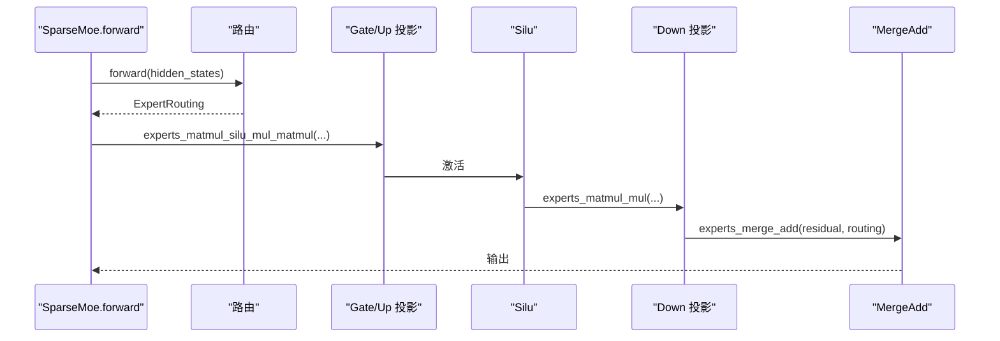
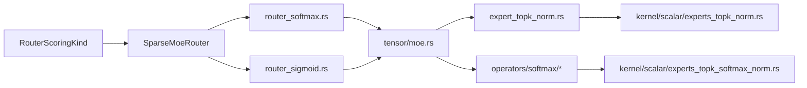

# 专家路由优化

<cite>
**本文引用的文件**   
- [src/operators/expert/expert_routing.rs](file://src/operators/expert/expert_routing.rs)
- [src/transformer/sparse_moe/router_softmax.rs](file://src/transformer/sparse_moe/router_softmax.rs)
- [src/transformer/sparse_moe/router_sigmoid.rs](file://src/transformer/sparse_moe/router_sigmoid.rs)
- [src/transformer/sparse_moe/layer.rs](file://src/transformer/sparse_moe/layer.rs)
- [src/tensor/moe.rs](file://src/tensor/moe.rs)
- [src/kernel/scalar/experts_topk_norm.rs](file://src/kernel/scalar/experts_topk_norm.rs)
- [src/kernel/scalar/experts_topk_softmax_norm.rs](file://src/kernel/scalar/experts_topk_softmax_norm.rs)
- [src/kernel/scalar/full_topk_softmax.rs](file://src/kernel/scalar/full_topk_softmax.rs)
- [src/kernel/scalar/truncated_topk_softmax.rs](file://src/kernel/scalar/truncated_topk_softmax.rs)
- [src/kernel/x86_64/f16_512/truncated_topk_softmax.rs](file://src/kernel/x86_64/f16_512/truncated_topk_softmax.rs)
- [src/operators/expert/expert_topk_norm.rs](file://src/operators/expert/expert_topk_norm.rs)
- [src/operators/expert/expert_merge_add.rs](file://src/operators/expert/expert_merge_add.rs)
- [src/transformer/config/router_scoring.rs](file://src/transformer/config/router_scoring.rs)
</cite>

## 目录
1. [引言](#引言)
2. [项目结构](#项目结构)
3. [核心组件](#核心组件)
4. [架构总览](#架构总览)
5. [详细组件分析](#详细组件分析)
6. [依赖关系分析](#依赖关系分析)
7. [性能与负载均衡](#性能与负载均衡)
8. [内存分配与零拷贝](#内存分配与零拷贝)
9. [数值稳定性与精度损失](#数值稳定性与精度损失)
10. [故障排查指南](#故障排查指南)
11. [结论](#结论)

## 引言
本技术文档聚焦于 MoE（Mixture of Experts）中的“专家路由”子系统，围绕 ExpertRouting 数据结构、紧凑队列布局、softmax 与 sigmoid 两种路由策略、权重归一化与阈值截断、索引压缩与重排优化、动态路由的内存分配与零拷贝、以及数值稳定性与精度损失展开。目标是帮助读者从系统架构到内核实现全面理解该模块的设计权衡与优化要点。

## 项目结构
与专家路由相关的代码主要分布在以下层次：
- 高层路由策略封装：Softmax/Sigmoid 路由器
- 张量接口与算子编排：Tensor 扩展方法、Operator 队列
- 路由结果数据布局：ExpertRouting 结构与紧凑队列
- 内核实现：TopK 选择、归一化、温度采样等
- 融合算子：专家前向计算与合并累加

图表来源
- [src/transformer/sparse_moe/layer.rs:14-72](file://src/transformer/sparse_moe/layer.rs#L14-L72)
- [src/transformer/sparse_moe/router_softmax.rs:10-84](file://src/transformer/sparse_moe/router_softmax.rs#L10-L84)
- [src/transformer/sparse_moe/router_sigmoid.rs:7-77](file://src/transformer/sparse_moe/router_sigmoid.rs#L7-L77)
- [src/tensor/moe.rs:155-244](file://src/tensor/moe.rs#L155-L244)
- [src/operators/expert/expert_topk_norm.rs:12-103](file://src/operators/expert/expert_topk_norm.rs#L12-L103)

章节来源
- [src/transformer/sparse_moe/layer.rs:14-72](file://src/transformer/sparse_moe/layer.rs#L14-L72)
- [src/transformer/sparse_moe/router_softmax.rs:10-84](file://src/transformer/sparse_moe/router_softmax.rs#L10-L84)
- [src/transformer/sparse_moe/router_sigmoid.rs:7-77](file://src/transformer/sparse_moe/router_sigmoid.rs#L7-L77)
- [src/tensor/moe.rs:155-244](file://src/tensor/moe.rs#L155-L244)

## 核心组件
- ExpertRouting<T>：承载路由结果的紧凑队列与元信息，包含每专家计数、紧凑索引/分数缓冲、每 token 的 top-k 候选索引、维度参数与容量上限。
- SparseMoeRouter：按配置选择 Softmax 或 Sigmoid 路由策略的统一入口。
- Tensor 扩展：提供 softmax_norm、sigmoid_gate、topk_norm、experts_matmul_*、experts_merge_add 等端到端 API，将算子入队执行。
- 内核函数：TopK 选择、归一化、温度采样等高性能实现。

章节来源
- [src/operators/expert/expert_routing.rs:43-65](file://src/operators/expert/expert_routing.rs#L43-L65)
- [src/transformer/sparse_moe/layer.rs:14-72](file://src/transformer/sparse_moe/layer.rs#L14-L72)
- [src/tensor/moe.rs:155-244](file://src/tensor/moe.rs#L155-L244)

## 架构总览
下图展示一次完整的前向流程：输入隐藏状态经门控矩阵得到评分，再根据策略进行 TopK 选择与归一化，生成紧凑路由结果；随后调用专家前向与合并累加完成输出。

图表来源
- [src/transformer/sparse_moe/router_softmax.rs:57-83](file://src/transformer/sparse_moe/router_softmax.rs#L57-L83)
- [src/transformer/sparse_moe/router_sigmoid.rs:57-76](file://src/transformer/sparse_moe/router_sigmoid.rs#L57-L76)
- [src/tensor/moe.rs:155-244](file://src/tensor/moe.rs#L155-L244)
- [src/operators/expert/expert_topk_norm.rs:53-103](file://src/operators/expert/expert_topk_norm.rs#L53-L103)

## 详细组件分析

### ExpertRouting 结构与紧凑队列布局
- 字段说明
  - expert_counts：每专家的原子计数器，用于并发安全地写入紧凑队列。
  - index_tensor：[num_experts, capacity_per_expert] 的紧凑索引缓冲，记录被路由到的 token 原始位置。
  - score_tensor：与 index_tensor 对齐的分数缓冲，保存对应 token 在所选专家上的权重。
  - topk_indices：[num_tokens, num_topk]，每个 token 选择的专家 ID。
  - num_experts/num_tokens/num_topk/capacity_per_expert：维度与容量控制。
- 紧凑布局
  - 以专家为外循环，token 顺序内聚存储，便于后续专家并行批处理。
  - capacity_per_expert = num_tokens * num_topk，保证最坏情况不越界。
- 访问辅助
  - expert_offset(expert_id, pos)：定位某专家的第 pos 个槽位。
  - topk_offset(token_id, slot)：定位某 token 的第 slot 个候选。

图表来源
- [src/operators/expert/expert_routing.rs:43-65](file://src/operators/expert/expert_routing.rs#L43-L65)

章节来源
- [src/operators/expert/expert_routing.rs:43-65](file://src/operators/expert/expert_routing.rs#L43-L65)
- [src/tensor/moe.rs:246-288](file://src/tensor/moe.rs#L246-L288)

### 路由策略：Softmax vs Sigmoid
- Softmax 路由
  - 先对门控输出做 softmax 归一化，再进行 TopK 选择与可选的 subset 归一化。
  - 适合需要严格概率解释的场景。
- Sigmoid 路由
  - 先对门控输出做逐元素 sigmoid，再 TopK 并归一化。
  - 可引入路由偏置项，常用于特定模型家族。

图表来源
- [src/transformer/sparse_moe/router_softmax.rs:57-83](file://src/transformer/sparse_moe/router_softmax.rs#L57-L83)
- [src/transformer/sparse_moe/router_sigmoid.rs:57-76](file://src/transformer/sparse_moe/router_sigmoid.rs#L57-L76)
- [src/transformer/config/router_scoring.rs:5-22](file://src/transformer/config/router_scoring.rs#L5-L22)

章节来源
- [src/transformer/sparse_moe/router_softmax.rs:10-84](file://src/transformer/sparse_moe/router_softmax.rs#L10-L84)
- [src/transformer/sparse_moe/router_sigmoid.rs:7-77](file://src/transformer/sparse_moe/router_sigmoid.rs#L7-L77)
- [src/transformer/config/router_scoring.rs:5-22](file://src/transformer/config/router_scoring.rs#L5-L22)

### 路由权重归一化与阈值截断
- TopK 归一化
  - 支持仅对选出的 top-k 子集进行归一化，减少全量 softmax 开销。
  - 当 sum 为零时退化为恒等映射，避免除零。
- 温度采样与截断
  - truncated_topk_softmax 支持 temperature 缩放与 max 平移稳定 exp。
  - 过滤非有限值，确保数值稳定。
- 全局 TopK Softmax
  - full_topk_softmax 在多线程候选集合上维护堆，并进行全局归一化。

图表来源
- [src/kernel/scalar/experts_topk_softmax_norm.rs:5-59](file://src/kernel/scalar/experts_topk_softmax_norm.rs#L5-L59)
- [src/kernel/scalar/truncated_topk_softmax.rs:6-66](file://src/kernel/scalar/truncated_topk_softmax.rs#L6-L66)
- [src/kernel/scalar/full_topk_softmax.rs:6-65](file://src/kernel/scalar/full_topk_softmax.rs#L6-L65)

章节来源
- [src/kernel/scalar/experts_topk_norm.rs:4-48](file://src/kernel/scalar/experts_topk_norm.rs#L4-L48)
- [src/kernel/scalar/experts_topk_softmax_norm.rs:5-59](file://src/kernel/scalar/experts_topk_softmax_norm.rs#L5-L59)
- [src/kernel/scalar/truncated_topk_softmax.rs:6-66](file://src/kernel/scalar/truncated_topk_softmax.rs#L6-L66)
- [src/kernel/scalar/full_topk_softmax.rs:6-65](file://src/kernel/scalar/full_topk_softmax.rs#L6-L65)

### 路由结果索引压缩与重排优化
- 紧凑写入
  - 通过 per-expert 原子计数器 fetch_add 获取槽位，直接写入 index_tensor/score_tensor，避免二次重排。
- 任务划分
  - task_assign 将全局任务 id 映射到具体专家及其内部 tile，利于并行分块。
- 合并阶段重置
  - 在合并阶段开始前按专家粒度重置计数，保证多轮路由复用同一缓冲区。

图表来源
- [src/operators/expert/expert_topk_norm.rs:53-103](file://src/operators/expert/expert_topk_norm.rs#L53-L103)
- [src/operators/expert/expert_routing.rs:24-41](file://src/operators/expert/expert_routing.rs#L24-L41)
- [src/operators/expert/expert_merge_add.rs:107-134](file://src/operators/expert/expert_merge_add.rs#L107-L134)

章节来源
- [src/operators/expert/expert_topk_norm.rs:53-103](file://src/operators/expert/expert_topk_norm.rs#L53-L103)
- [src/operators/expert/expert_routing.rs:24-41](file://src/operators/expert/expert_routing.rs#L24-L41)
- [src/operators/expert/expert_merge_add.rs:107-134](file://src/operators/expert/expert_merge_add.rs#L107-L134)

### 路由与专家前向的集成
- 层装配
  - SparseMoe 根据配置选择 Softmax 或 Sigmoid 路由，并持有专家权重。
- 前向流水线
  - 路由生成 ExpertRouting -> 专家门控+Up 投影 -> Silu -> Down 投影 -> 合并累加残差。

图表来源
- [src/transformer/sparse_moe/layer.rs:152-199](file://src/transformer/sparse_moe/layer.rs#L152-L199)
- [src/tensor/moe.rs:95-134](file://src/tensor/moe.rs#L95-L134)
- [src/tensor/moe.rs:59-93](file://src/tensor/moe.rs#L59-L93)
- [src/tensor/moe.rs:30-57](file://src/tensor/moe.rs#L30-L57)

章节来源
- [src/transformer/sparse_moe/layer.rs:74-199](file://src/transformer/sparse_moe/layer.rs#L74-L199)
- [src/tensor/moe.rs:30-134](file://src/tensor/moe.rs#L30-L134)

## 依赖关系分析
- 高层路由策略依赖 Tensor 接口与算子枚举，最终落到 kernel 标量/向量实现。
- ExpertRouting 作为中间产物被多个下游算子消费，形成低耦合的数据契约。
- 配置 RouterScoringKind 决定运行时策略分支。

图表来源
- [src/transformer/config/router_scoring.rs:5-22](file://src/transformer/config/router_scoring.rs#L5-L22)
- [src/transformer/sparse_moe/layer.rs:14-72](file://src/transformer/sparse_moe/layer.rs#L14-L72)
- [src/tensor/moe.rs:155-244](file://src/tensor/moe.rs#L155-L244)
- [src/operators/expert/expert_topk_norm.rs:12-103](file://src/operators/expert/expert_topk_norm.rs#L12-L103)
- [src/kernel/scalar/experts_topk_norm.rs:4-48](file://src/kernel/scalar/experts_topk_norm.rs#L4-L48)
- [src/kernel/scalar/experts_topk_softmax_norm.rs:5-59](file://src/kernel/scalar/experts_topk_softmax_norm.rs#L5-L59)

章节来源
- [src/transformer/config/router_scoring.rs:5-22](file://src/transformer/config/router_scoring.rs#L5-L22)
- [src/transformer/sparse_moe/layer.rs:14-72](file://src/transformer/sparse_moe/layer.rs#L14-L72)
- [src/tensor/moe.rs:155-244](file://src/tensor/moe.rs#L155-L244)
- [src/operators/expert/expert_topk_norm.rs:12-103](file://src/operators/expert/expert_topk_norm.rs#L12-L103)
- [src/kernel/scalar/experts_topk_norm.rs:4-48](file://src/kernel/scalar/experts_topk_norm.rs#L4-L48)
- [src/kernel/scalar/experts_topk_softmax_norm.rs:5-59](file://src/kernel/scalar/experts_topk_softmax_norm.rs#L5-L59)

## 性能与负载均衡
- 负载均衡效果
  - Softmax 倾向于更平滑的概率分布，有助于分散负载；Sigmoid 可能产生稀疏热点，需配合容量规划与重试/丢弃策略。
- 吞吐与延迟
  - 紧凑队列减少访存碎片与二次重排；原子计数在热路径上带来少量同步成本，但避免了锁竞争与复杂调度。
- 硬件加速
  - x86_64 f16_512 的 truncated_topk_softmax 利用 AVX512FP16 指令提升吞吐，同时保持数值稳定。

章节来源
- [src/kernel/x86_64/f16_512/truncated_topk_softmax.rs:9-78](file://src/kernel/x86_64/f16_512/truncated_topk_softmax.rs#L9-L78)
- [src/operators/expert/expert_topk_norm.rs:53-103](file://src/operators/expert/expert_topk_norm.rs#L53-L103)

## 内存分配与零拷贝
- 预分配与零拷贝
  - 通过 AlignedBox 预分配 expert_counts/index_tensor/score_tensor/topk_indices，并在创建后 forget 以移交所有权给指针，避免额外拷贝。
  - 路由过程中直接写入目标缓冲，无中间临时张量。
- 生命周期管理
  - 使用 send_sync_ptr::MutPtr 包装裸指针，配合全局队列与算子执行，确保跨线程安全访问。
- 复用与重置
  - 每轮路由前按专家重置计数，复用同一块紧凑缓冲，降低分配抖动。

章节来源
- [src/tensor/moe.rs:246-288](file://src/tensor/moe.rs#L246-L288)
- [src/operators/expert/expert_topk_norm.rs:53-103](file://src/operators/expert/expert_topk_norm.rs#L53-L103)
- [src/operators/expert/expert_merge_add.rs:107-134](file://src/operators/expert/expert_merge_add.rs#L107-L134)

## 数值稳定性与精度损失
- 数值稳定
  - 采用减去最大值的技巧避免 exp 溢出；temperature 缩放前先钳制非有限值。
  - 当归一化分母为零时回退为恒等映射，防止 NaN/Inf 传播。
- 精度考虑
  - f16 路径使用专用 SIMD 实现，注意舍入误差；测试中允许微小偏差。
  - 仅在 top-k 子集上做 softmax 会引入近似误差，但在工程上通常可接受且显著提速。

章节来源
- [src/kernel/scalar/experts_topk_softmax_norm.rs:5-59](file://src/kernel/scalar/experts_topk_softmax_norm.rs#L5-L59)
- [src/kernel/scalar/truncated_topk_softmax.rs:6-66](file://src/kernel/scalar/truncated_topk_softmax.rs#L6-L66)
- [src/kernel/x86_64/f16_512/truncated_topk_softmax.rs:9-78](file://src/kernel/x86_64/f16_512/truncated_topk_softmax.rs#L9-L78)
- [src/kernel/scalar/experts_topk_norm.rs:4-48](file://src/kernel/scalar/experts_topk_norm.rs#L4-L48)

## 故障排查指南
- 常见问题
  - 路由越界：检查 capacity_per_expert 是否足够容纳 num_tokens*num_topk。
  - 计数未重置：确认合并阶段前已按专家重置 expert_counts。
  - 数值异常：检查 temperature 是否为正、输入是否含 NaN/Inf。
- 定位建议
  - 打印每专家计数分布，观察热点与倾斜程度。
  - 对比 Softmax/Sigmoid 在不同 batch/token 规模下的吞吐与延迟。

章节来源
- [src/operators/expert/expert_topk_norm.rs:53-103](file://src/operators/expert/expert_topk_norm.rs#L53-L103)
- [src/operators/expert/expert_merge_add.rs:107-134](file://src/operators/expert/expert_merge_add.rs#L107-L134)
- [src/kernel/scalar/truncated_topk_softmax.rs:6-66](file://src/kernel/scalar/truncated_topk_softmax.rs#L6-L66)

## 结论
本方案通过统一的 ExpertRouting 紧凑队列与原子计数机制，实现了高效、可扩展的专家路由与融合前向。Softmax 与 Sigmoid 两种策略在负载均衡与吞吐之间提供了灵活取舍；结合温度采样与稳定化技巧，兼顾了数值稳健性与精度。整体设计在内存分配、零拷贝与并行任务划分方面做了充分优化，适用于大规模 MoE 推理场景。