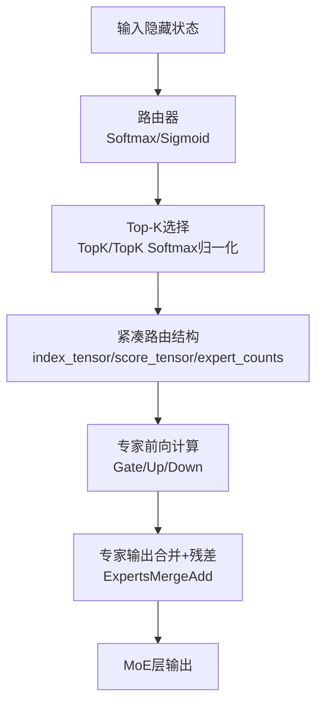
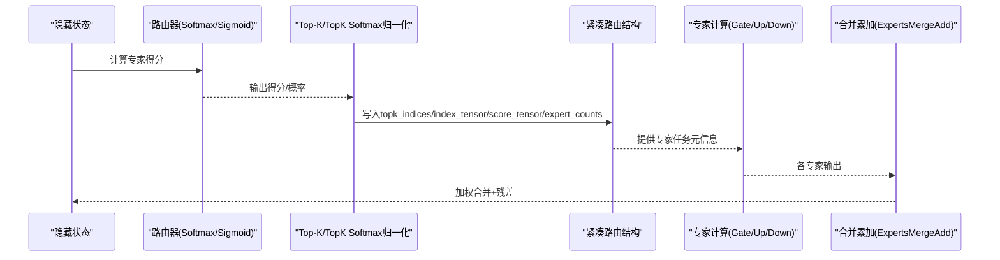
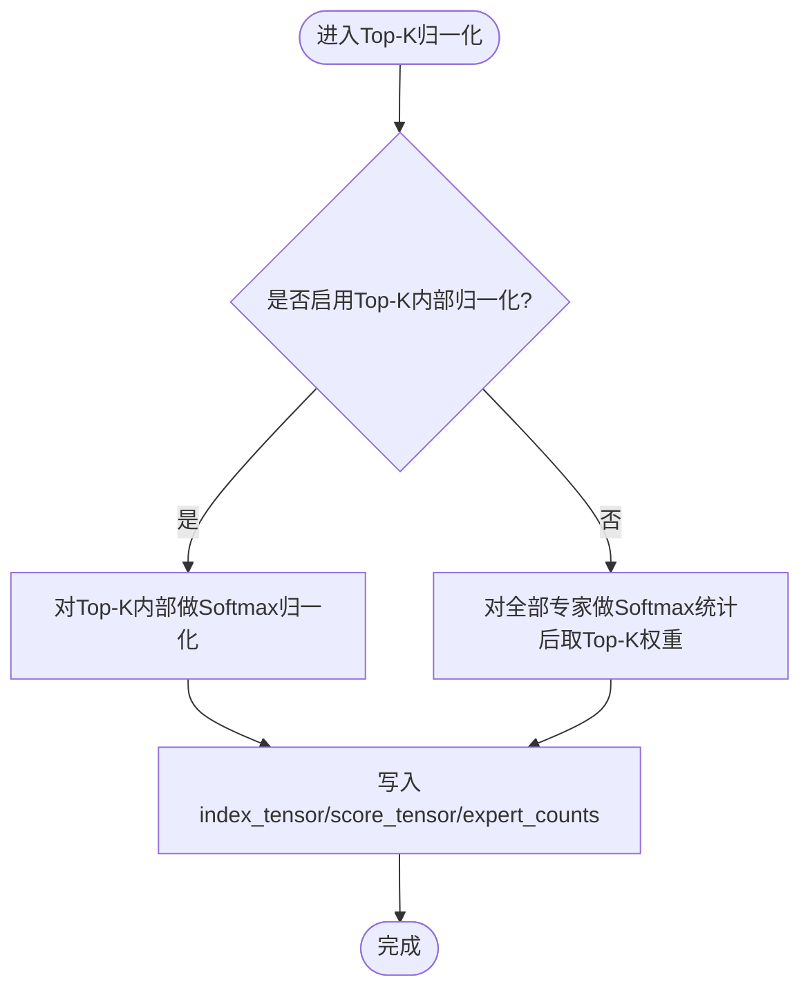
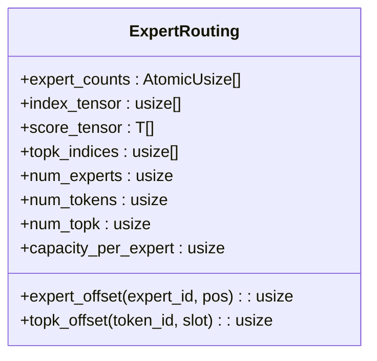

# 负载均衡机制

<cite>
**本文引用的文件列表**
- [src/operators/expert/expert_routing.rs](file://src/operators/expert/expert_routing.rs)
- [src/tensor/moe.rs](file://src/tensor/moe.rs)
- [src/transformer/sparse_moe/layer.rs](file://src/transformer/sparse_moe/layer.rs)
- [src/transformer/sparse_moe/router_softmax.rs](file://src/transformer/sparse_moe/router_softmax.rs)
- [src/transformer/sparse_moe/router_sigmoid.rs](file://src/transformer/sparse_moe/router_sigmoid.rs)
- [src/operators/expert/expert_merge_add.rs](file://src/operators/expert/expert_merge_add.rs)
- [src/kernel/scalar/experts_topk_softmax_norm.rs](file://src/kernel/scalar/experts_topk_softmax_norm.rs)
- [src/kernel/x86_64/f16_512/experts_topk_softmax_norm.rs](file://src/kernel/x86_64/f16_512/experts_topk_softmax_norm.rs)
- [src/kernel/x86_64/f32_256/experts_topk_softmax_norm.rs](file://src/kernel/x86_64/f32_256/experts_topk_softmax_norm.rs)
- [src/operators/expert/expert_topk_norm.rs](file://src/operators/expert/expert_topk_norm.rs)
- [src/kernel/scalar/experts_topk_norm.rs](file://src/kernel/scalar/experts_topk_norm.rs)
- [src/operators/softmax/softmax_norm.rs](file://src/operators/softmax/softmax_norm.rs)
- [docs/design/transformers/moe_routing_data_structures.md](file://docs/design/transformers/moe_routing_data_structures.md)
- [docs/configuration/optimization.md](file://docs/configuration/optimization.md)
</cite>

## 目录
1. [引言](#引言)
2. [项目结构](#项目结构)
3. [核心组件](#核心组件)
4. [架构总览](#架构总览)
5. [详细组件分析](#详细组件分析)
6. [依赖关系分析](#依赖关系分析)
7. [性能与负载均衡特性](#性能与负载均衡特性)
8. [监控指标与分析方法](#监控指标与分析方法)
9. [动态负载均衡配置与调优](#动态负载均衡配置与调优)
10. [故障排查与解决方案](#故障排查与解决方案)
11. [不同模型规模的负载均衡最佳实践](#不同模型规模的负载均衡最佳实践)
12. [结论](#结论)

## 引言
本技术文档聚焦于MoE（Mixture of Experts）中的“专家负载不均衡”问题，系统阐述其成因、影响与解决思路。围绕路由评分、Top-K选择、概率归一化、紧凑路由数据结构、以及专家合并累加等关键环节，解释负载均衡的实现原理与算法选择，并提供监控指标、动态配置建议、故障排查方法与不同规模下的最佳实践。

## 项目结构
本项目在MoE路径中实现了可插拔的路由策略（Softmax/Sigmoid）、Top-K选择与可选的Top-K概率归一化、基于原子计数器的紧凑路由写入、以及按专家维度的合并累加。关键代码分布在以下模块：
- 路由与评分：Softmax/Sigmoid路由器
- Top-K与归一化：TopK/TopK Softmax归一化内核
- 路由数据结构：紧凑队列与原子计数器
- 专家计算与合并：专家MatMul与MergeAdd
- 高层编排：Tensor接口与SparseMoe层

图表来源
- [src/transformer/sparse_moe/layer.rs:152-198](file://src/transformer/sparse_moe/layer.rs#L152-L198)
- [src/transformer/sparse_moe/router_softmax.rs:57-83](file://src/transformer/sparse_moe/router_softmax.rs#L57-L83)
- [src/transformer/sparse_moe/router_sigmoid.rs:57-76](file://src/transformer/sparse_moe/router_sigmoid.rs#L57-L76)
- [src/operators/expert/expert_merge_add.rs:1-494](file://src/operators/expert/expert_merge_add.rs#L1-L494)

章节来源
- [src/transformer/sparse_moe/layer.rs:152-198](file://src/transformer/sparse_moe/layer.rs#L152-L198)
- [src/transformer/sparse_moe/router_softmax.rs:57-83](file://src/transformer/sparse_moe/router_softmax.rs#L57-L83)
- [src/transformer/sparse_moe/router_sigmoid.rs:57-76](file://src/transformer/sparse_moe/router_sigmoid.rs#L57-L76)
- [src/operators/expert/expert_merge_add.rs:1-494](file://src/operators/expert/expert_merge_add.rs#L1-L494)

## 核心组件
- 路由评分器
  - Softmax路由器：对隐藏状态进行线性变换后执行Softmax，再Top-K并可选Top-K概率归一化。
  - Sigmoid路由器：对隐藏状态进行带偏置的线性变换+Sigmoid，再Top-K并可选Top-K概率归一化。
- Top-K与归一化
  - TopK选择：从专家得分中选择Top-K个专家。
  - TopK Softmax归一化：支持两种模式——仅对Top-K内部做归一化，或对全部专家做全局Softmax后再取Top-K权重。
- 紧凑路由数据结构
  - 使用每专家容量为num_tokens*num_topk的紧凑队列，避免稀疏布尔矩阵带来的二次扫描与内存浪费。
  - 通过原子计数器expert_counts实现多线程并发安全写入。
- 专家计算与合并
  - 专家前向：Gate/Up/Down三个投影阶段，按路由结果访问对应专家权重。
  - 合并累加：将每个token的Top-K专家输出按权重加权求和，并与残差相加。

章节来源
- [src/transformer/config/router_scoring.rs:1-23](file://src/transformer/config/router_scoring.rs#L1-L23)
- [src/transformer/sparse_moe/router_softmax.rs:57-83](file://src/transformer/sparse_moe/router_softmax.rs#L57-L83)
- [src/transformer/sparse_moe/router_sigmoid.rs:57-76](file://src/transformer/sparse_moe/router_sigmoid.rs#L57-L76)
- [src/operators/expert/expert_topk_norm.rs:85-121](file://src/operators/expert/expert_topk_norm.rs#L85-L121)
- [src/kernel/scalar/experts_topk_norm.rs:1-83](file://src/kernel/scalar/experts_topk_norm.rs#L1-L83)
- [src/kernel/scalar/experts_topk_softmax_norm.rs:39-58](file://src/kernel/scalar/experts_topk_softmax_norm.rs#L39-L58)
- [src/kernel/x86_64/f16_512/experts_topk_softmax_norm.rs:162-190](file://src/kernel/x86_64/f16_512/experts_topk_softmax_norm.rs#L162-L190)
- [src/kernel/x86_64/f32_256/experts_topk_softmax_norm.rs:248-290](file://src/kernel/x86_64/f32_256/experts_topk_softmax_norm.rs#L248-L290)
- [src/operators/softmax/softmax_norm.rs:87-122](file://src/operators/softmax/softmax_norm.rs#L87-L122)
- [src/operators/expert/expert_routing.rs:43-65](file://src/operators/expert/expert_routing.rs#L43-L65)
- [src/tensor/moe.rs:246-288](file://src/tensor/moe.rs#L246-L288)
- [src/operators/expert/expert_merge_add.rs:1-494](file://src/operators/expert/expert_merge_add.rs#L1-L494)

## 架构总览
下图展示了MoE层的端到端数据流与负载均衡关键点：路由评分→Top-K选择→可选Top-K概率归一化→紧凑路由写入→专家计算→合并累加。

图表来源
- [src/transformer/sparse_moe/layer.rs:152-198](file://src/transformer/sparse_moe/layer.rs#L152-L198)
- [src/transformer/sparse_moe/router_softmax.rs:57-83](file://src/transformer/sparse_moe/router_softmax.rs#L57-L83)
- [src/transformer/sparse_moe/router_sigmoid.rs:57-76](file://src/transformer/sparse_moe/router_sigmoid.rs#L57-L76)
- [src/operators/expert/expert_topk_norm.rs:85-121](file://src/operators/expert/expert_topk_norm.rs#L85-L121)
- [src/operators/softmax/softmax_norm.rs:87-122](file://src/operators/softmax/softmax_norm.rs#L87-L122)
- [src/operators/expert/expert_merge_add.rs:1-494](file://src/operators/expert/expert_merge_add.rs#L1-L494)

## 详细组件分析

### 专家负载不均衡：成因与影响
- 成因
  - 路由评分函数偏向热门专家，导致部分专家被频繁选中，其他专家空闲。
  - Top-K选择未引入额外平衡项时，易出现“赢家通吃”。
  - 批内分布波动（长尾请求、热点话题）会放大不均衡。
- 影响
  - 热点专家成为瓶颈，吞吐下降、延迟抖动增大。
  - 非热点专家利用率低，资源浪费。
  - 多核并行下，热点专家对应的线程或任务队列拥塞。

章节来源
- [docs/design/transformers/moe_routing_data_structures.md:104-149](file://docs/design/transformers/moe_routing_data_structures.md#L104-L149)

### 路由评分与策略选择
- Softmax路由器：对隐藏状态进行线性变换后执行Softmax，天然形成概率分布；配合Top-K选择，可平滑分配但仍有集中趋势。
- Sigmoid路由器：逐专家独立阈值化，适合需要更灵活门控的场景；同样需Top-K选择。
- 策略选择依据
  - 模型家族与训练目标决定默认策略（如MiniMaxM2默认Sigmoid）。
  - 可通过配置切换RouterScoringKind以适配不同场景。

章节来源
- [src/transformer/config/router_scoring.rs:1-23](file://src/transformer/config/router_scoring.rs#L1-L23)
- [src/transformer/sparse_moe/router_softmax.rs:57-83](file://src/transformer/sparse_moe/router_softmax.rs#L57-L83)
- [src/transformer/sparse_moe/router_sigmoid.rs:57-76](file://src/transformer/sparse_moe/router_sigmoid.rs#L57-L76)

### Top-K选择与Top-K概率归一化
- Top-K选择：从专家得分中选出Top-K个专家，减少计算量。
- Top-K概率归一化
  - 仅对Top-K内部归一化：增强Top-K之间的相对权重，有助于在有限专家集合内更均匀地分配权重。
  - 全局Softmax后取Top-K：保持全局一致性，但可能加剧集中。
- 实现要点
  - 标量与SIMD内核均支持norm_topk_prob开关，控制是否对Top-K内部再做一次归一化。
  - 归一化后的权重用于后续专家输出的加权合并。

图表来源
- [src/kernel/scalar/experts_topk_softmax_norm.rs:39-58](file://src/kernel/scalar/experts_topk_softmax_norm.rs#L39-L58)
- [src/kernel/x86_64/f16_512/experts_topk_softmax_norm.rs:162-190](file://src/kernel/x86_64/f16_512/experts_topk_softmax_norm.rs#L162-L190)
- [src/kernel/x86_64/f32_256/experts_topk_softmax_norm.rs:248-290](file://src/kernel/x86_64/f32_256/experts_topk_softmax_norm.rs#L248-L290)
- [src/operators/softmax/softmax_norm.rs:87-122](file://src/operators/softmax/softmax_norm.rs#L87-L122)

章节来源
- [src/kernel/scalar/experts_topk_softmax_norm.rs:39-58](file://src/kernel/scalar/experts_topk_softmax_norm.rs#L39-L58)
- [src/kernel/x86_64/f16_512/experts_topk_softmax_norm.rs:162-190](file://src/kernel/x86_64/f16_512/experts_topk_softmax_norm.rs#L162-L190)
- [src/kernel/x86_64/f32_256/experts_topk_softmax_norm.rs:248-290](file://src/kernel/x86_64/f32_256/experts_topk_softmax_norm.rs#L248-L290)
- [src/operators/softmax/softmax_norm.rs:87-122](file://src/operators/softmax/softmax_norm.rs#L87-L122)

### 紧凑路由数据结构与原子写入
- 旧结构问题
  - 使用dense bool矩阵记录路由，导致大量无效条目与重复扫描。
- 新结构优势
  - 每专家一个紧凑队列，直接存储token id与权重，避免二次扫描。
  - 使用atomic计数器expert_counts实现无锁并发写入，提升吞吐。
- 写入流程
  - 每个线程维护局部mini buffer，批量提交到全局compact queue。
  - 最终expert_counts[e]即为该专家的token数量，供后续阶段直接使用。

图表来源
- [src/operators/expert/expert_routing.rs:43-65](file://src/operators/expert/expert_routing.rs#L43-L65)
- [src/tensor/moe.rs:246-288](file://src/tensor/moe.rs#L246-L288)

章节来源
- [docs/design/transformers/moe_routing_data_structures.md:151-284](file://docs/design/transformers/moe_routing_data_structures.md#L151-L284)
- [src/operators/expert/expert_routing.rs:43-65](file://src/operators/expert/expert_routing.rs#L43-L65)
- [src/tensor/moe.rs:246-288](file://src/tensor/moe.rs#L246-L288)

### 专家合并与累加的负载均衡处理
- 合并逻辑
  - 对每个token，将其Top-K专家的输出按权重加权求和，再与残差相加。
- 负载均衡关联
  - 若Top-K权重更均匀（例如启用Top-K内部归一化），则合并阶段的热点效应减弱。
  - 紧凑路由结构确保每个专家的任务范围明确，便于并行调度与负载均衡。

章节来源
- [src/operators/expert/expert_merge_add.rs:1-494](file://src/operators/expert/expert_merge_add.rs#L1-L494)
- [src/transformer/sparse_moe/layer.rs:152-198](file://src/transformer/sparse_moe/layer.rs#L152-L198)

## 依赖关系分析
- 高层编排
  - SparseMoe层负责组合路由器、专家前向与合并累加。
- 路由与归一化
  - Softmax/Sigmoid路由器调用Tensor接口生成gate输出，随后进入TopK/TopK Softmax归一化。
- 内核实现
  - 标量与SIMD内核分别实现TopK与TopK Softmax归一化，提供高性能路径。
- 路由数据结构
  - ExpertRouting贯穿路由写入与专家计算阶段，承载原子计数与紧凑队列。

图表来源
- [src/transformer/sparse_moe/layer.rs:152-198](file://src/transformer/sparse_moe/layer.rs#L152-L198)
- [src/transformer/sparse_moe/router_softmax.rs:57-83](file://src/transformer/sparse_moe/router_softmax.rs#L57-L83)
- [src/transformer/sparse_moe/router_sigmoid.rs:57-76](file://src/transformer/sparse_moe/router_sigmoid.rs#L57-L76)
- [src/operators/expert/expert_topk_norm.rs:85-121](file://src/operators/expert/expert_topk_norm.rs#L85-L121)
- [src/operators/expert/expert_merge_add.rs:1-494](file://src/operators/expert/expert_merge_add.rs#L1-L494)

章节来源
- [src/transformer/sparse_moe/layer.rs:152-198](file://src/transformer/sparse_moe/layer.rs#L152-L198)
- [src/operators/expert/expert_topk_norm.rs:85-121](file://src/operators/expert/expert_topk_norm.rs#L85-L121)
- [src/operators/expert/expert_merge_add.rs:1-494](file://src/operators/expert/expert_merge_add.rs#L1-L494)

## 性能与负载均衡特性
- 路由阶段优化
  - 紧凑队列替代dense bool矩阵，减少无效扫描与内存占用。
  - 原子计数器避免锁竞争，提升并发写入效率。
- 归一化策略
  - Top-K内部归一化可在Top-K范围内更均匀分配权重，缓解热点。
  - 全局Softmax后取Top-K保持全局一致性，适用于需要严格概率语义的场景。
- 合并阶段
  - 按专家维度组织任务，便于细粒度并行与负载均衡。

章节来源
- [docs/design/transformers/moe_routing_data_structures.md:104-149](file://docs/design/transformers/moe_routing_data_structures.md#L104-L149)
- [src/operators/expert/expert_routing.rs:43-65](file://src/operators/expert/expert_routing.rs#L43-L65)
- [src/kernel/scalar/experts_topk_softmax_norm.rs:39-58](file://src/kernel/scalar/experts_topk_softmax_norm.rs#L39-L58)

## 监控指标与分析方法
- 专家负载分布
  - 统计expert_counts[e]在各批次中的均值与方差，评估不均衡程度。
  - 计算熵或基尼系数，量化分布均匀性。
- 路由选择稳定性
  - 对比不同批次下selected_experts的一致性，识别热点漂移。
- 归一化效果
  - 观察Top-K内部归一化前后权重的分布变化，验证是否有效分散权重。
- 分析方法
  - 对齐脚本可用于对比Rust与参考实现的router_logits、routing_weights与selected_experts，定位偏差来源。
  - 结合调度参数（batch_size、chunk_size、schedule_timeout_ms）分析负载波动。

章节来源
- [alignment/tokenizer/compare_moe_alignment.py:75-128](file://alignment/tokenizer/compare_moe_alignment.py#L75-L128)
- [docs/configuration/optimization.md:1-38](file://docs/configuration/optimization.md#L1-L38)

## 动态负载均衡配置与调优
- 当前实现要点
  - 路由评分策略可通过RouterScoringKind在Softmax与Sigmoid之间切换。
  - Top-K归一化开关norm_topk_prob控制是否对Top-K内部进行归一化。
- 可调参数与环境变量
  - batch_size、sequence_length、chunk_size、schedule_timeout_ms影响整体调度与吞吐，间接影响专家负载分布。
- 调优建议
  - 高吞吐场景：增大chunk_size与batch_size，提高批内多样性，有助于平均化专家负载。
  - 低延迟场景：减小chunk_size，降低单次调度开销，减少热点累积。
  - 长上下文：增大sequence_length，注意内存增长；分段处理时需关注Prefill重复开销。

章节来源
- [src/transformer/config/router_scoring.rs:1-23](file://src/transformer/config/router_scoring.rs#L1-L23)
- [src/kernel/scalar/experts_topk_softmax_norm.rs:39-58](file://src/kernel/scalar/experts_topk_softmax_norm.rs#L39-L58)
- [docs/configuration/optimization.md:1-38](file://docs/configuration/optimization.md#L1-L38)

## 故障排查与解决方案
- 常见问题
  - 专家计数未重置：合并阶段结束后需清零expert_counts，否则下一轮写入越界。
  - 空专家写零：当某专家无token时，应跳过计算或确保输出为零，避免污染结果。
  - 路由不一致：对比Rust与参考实现的router_logits、routing_weights与selected_experts，定位差异。
- 排查步骤
  - 检查expert_counts在每轮结束是否清零。
  - 验证Top-K选择与归一化是否符合预期（开启/关闭Top-K内部归一化的差异）。
  - 使用对齐脚本逐项比对中间结果，缩小问题范围。
- 解决方案
  - 修正路由写入边界与原子操作顺序。
  - 调整路由评分策略或Top-K归一化开关，改善负载分布。
  - 根据硬件能力选择合适的SIMD内核路径，确保数值稳定。

章节来源
- [src/operators/expert/expert_merge_add.rs:413-494](file://src/operators/expert/expert_merge_add.rs#L413-L494)
- [src/operators/expert/expert_matmul_mul.rs:1814-1860](file://src/operators/expert/expert_matmul_mul.rs#L1814-L1860)
- [alignment/tokenizer/compare_moe_alignment.py:75-128](file://alignment/tokenizer/compare_moe_alignment.py#L75-L128)

## 不同模型规模的负载均衡最佳实践
- 小规模模型（专家数少、Top-K小）
  - 优先使用Top-K内部归一化，增强Top-K内的权重均匀性。
  - 适当增大batch_size以提升批内多样性。
- 中等规模模型
  - 结合Softmax路由器与Top-K内部归一化，平衡全局一致性与局部均匀性。
  - 监控expert_counts分布，必要时微调chunk_size与schedule_timeout_ms。
- 大规模模型（专家数多、Top-K大）
  - 考虑全局Softmax后取Top-K，保持严格的概率语义。
  - 增加序列长度与批大小，但需关注内存与KV Cache管理成本。
  - 针对热点专家，可尝试引入路由偏置（若模型支持）或调整训练目标以改善分布。

[本节为概念性指导，不直接分析具体文件]

## 结论
本项目的MoE负载均衡机制通过可插拔路由评分、灵活的Top-K归一化、紧凑路由结构与原子写入，有效缓解了专家负载不均衡问题。结合监控指标与动态配置，可在不同模型规模与应用场景下取得较好的吞吐与延迟表现。未来可进一步探索路由偏置、在线自适应Top-K选择与更细粒度的任务调度策略，以实现更稳健的负载均衡。