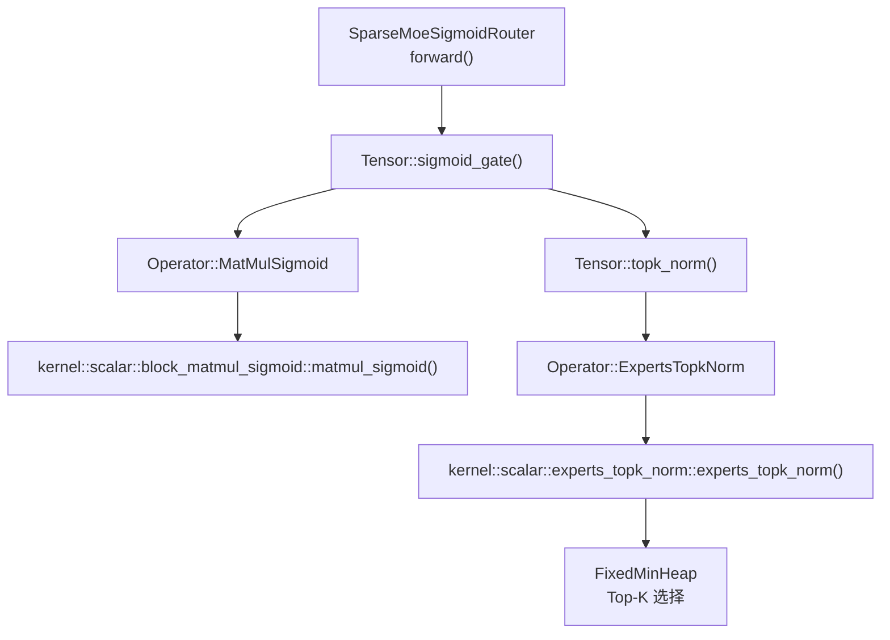
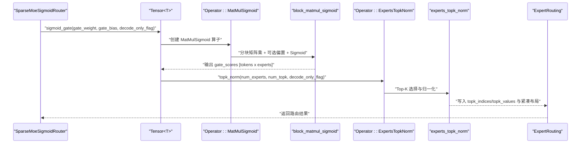
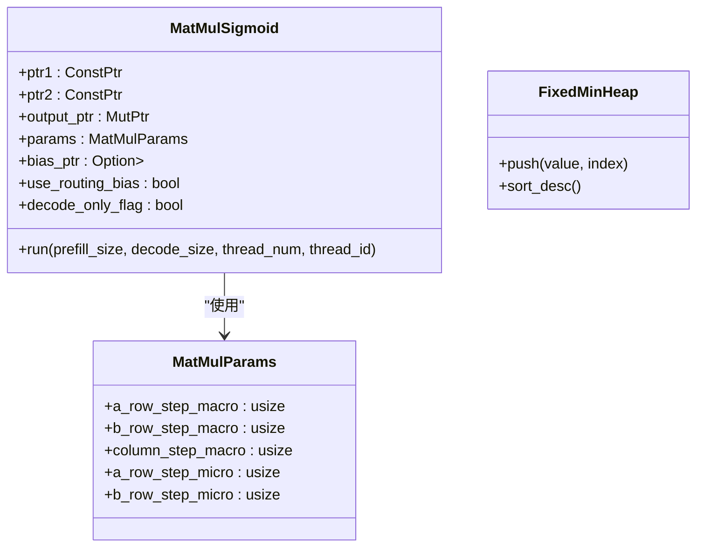
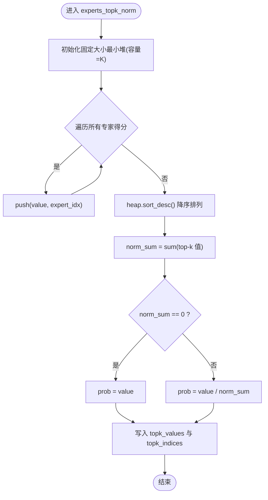
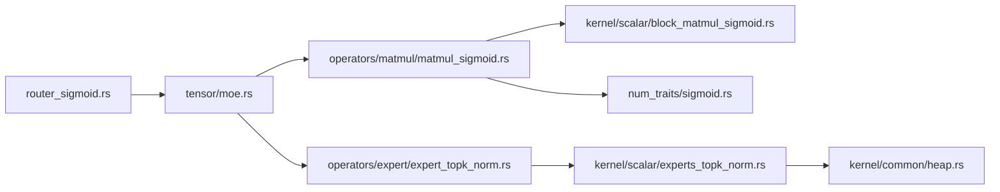

# Sigmoid 路由算法

<cite>
**本文引用的文件**   
- [router_sigmoid.rs](file://src/transformer/sparse_moe/router_sigmoid.rs)
- [moe.rs](file://src/tensor/moe.rs)
- [matmul_sigmoid.rs](file://src/operators/matmul/matmul_sigmoid.rs)
- [block_matmul_sigmoid.rs](file://src/kernel/scalar/block_matmul_sigmoid.rs)
- [experts_topk_norm.rs](file://src/kernel/scalar/experts_topk_norm.rs)
- [expert_topk_norm.rs](file://src/operators/expert/expert_topk_norm.rs)
- [expert_routing.rs](file://src/operators/expert/expert_routing.rs)
- [sigmoid.rs](file://src/num_traits/sigmoid.rs)
- [layer.rs](file://src/transformer/sparse_moe/layer.rs)
</cite>

## 目录
1. [简介](#简介)
2. [项目结构](#项目结构)
3. [核心组件](#核心组件)
4. [架构总览](#架构总览)
5. [详细组件分析](#详细组件分析)
6. [依赖关系分析](#依赖关系分析)
7. [性能考量](#性能考量)
8. [故障排查指南](#故障排查指南)
9. [结论](#结论)
10. [附录：使用示例与场景](#附录使用示例与场景)

## 简介
本技术文档聚焦于 Sigmoid 路由算法在稀疏 MoE（Mixture of Experts）中的实现与优化。Sigmoid 激活函数用于将线性门控输出映射为专家选择概率，随后通过 Top-K 选择与归一化得到最终的路由权重与专家索引。本文深入解释以下关键点：
- Sigmoid 激活函数在专家选择中的作用与数学原理
- gate_weight 与 gate_bias 的计算过程（矩阵乘法与偏置加法）
- sigmoid_gate 函数的具体实现与优化策略
- topk_norm 操作如何处理 Top-K 选择与概率归一化
- decode_only_flag 参数对 Sigmoid 路由行为的影响
- 性能分析与调优建议（内存模式、计算复杂度）
- 代码级流程与图示，便于理解与排障

## 项目结构
Sigmoid 路由涉及多层抽象：高层路由器封装、张量算子接口、底层内核实现以及通用数值特性。关键路径如下：
- 路由器层：SparseMoeSigmoidRouter 负责组合 gate 投影与 Top-K 归一化
- 张量接口层：Tensor::sigmoid_gate 与 Tensor::topk_norm 提供统一 API
- 算子层：MatMulSigmoid 执行带可选偏置的矩阵乘加与 Sigmoid
- 内核层：scalar block kernel 完成分块计算与访存优化
- 数值特性：Sigmoid trait 定义逐元素激活

图表来源
- [router_sigmoid.rs:57-75](file://src/transformer/sparse_moe/router_sigmoid.rs#L57-L75)
- [moe.rs:178-244](file://src/tensor/moe.rs#L178-L244)
- [matmul_sigmoid.rs:101-186](file://src/operators/matmul/matmul_sigmoid.rs#L101-L186)
- [block_matmul_sigmoid.rs:1-109](file://src/kernel/scalar/block_matmul_sigmoid.rs#L1-L109)
- [expert_topk_norm.rs:53-103](file://src/operators/expert/expert_topk_norm.rs#L53-L103)
- [experts_topk_norm.rs:1-84](file://src/kernel/scalar/experts_topk_norm.rs#L1-L84)

章节来源
- [router_sigmoid.rs:1-77](file://src/transformer/sparse_moe/router_sigmoid.rs#L1-L77)
- [moe.rs:1-332](file://src/tensor/moe.rs#L1-L332)
- [matmul_sigmoid.rs:1-255](file://src/operators/matmul/matmul_sigmoid.rs#L1-L255)
- [block_matmul_sigmoid.rs:1-109](file://src/kernel/scalar/block_matmul_sigmoid.rs#L1-L109)
- [experts_topk_norm.rs:1-84](file://src/kernel/scalar/experts_topk_norm.rs#L1-L84)
- [expert_topk_norm.rs:43-163](file://src/operators/expert/expert_topk_norm.rs#L43-L163)
- [expert_routing.rs:43-125](file://src/operators/expert/expert_routing.rs#L43-L125)
- [sigmoid.rs:1-41](file://src/num_traits/sigmoid.rs#L1-L41)
- [layer.rs:47-72](file://src/transformer/sparse_moe/layer.rs#L47-L72)

## 核心组件
- SparseMoeSigmoidRouter：封装 num_experts、num_topk、gate_weight、gate_bias，并调用 forward(hidden_states, decode_only_flag) 生成 ExpertRouting
- Tensor::sigmoid_gate：构建 MatMulSigmoid 算子，支持可选 bias；输出形状为 [token_count, num_experts]
- Tensor::topk_norm：构建 ExpertsTopkNorm 算子，进行 Top-K 选择与归一化，产出 ExpertRouting
- MatMulSigmoid：线程并行分块计算，支持可选偏置与 Sigmoid 融合
- experts_topk_norm：基于固定大小最小堆的 Top-K 选择与按 K 归一化
- ExpertRouting：紧凑存储每个 expert 被选中的 token 列表与对应分数

章节来源
- [router_sigmoid.rs:7-76](file://src/transformer/sparse_moe/router_sigmoid.rs#L7-L76)
- [moe.rs:178-244](file://src/tensor/moe.rs#L178-L244)
- [matmul_sigmoid.rs:23-95](file://src/operators/matmul/matmul_sigmoid.rs#L23-L95)
- [experts_topk_norm.rs:1-48](file://src/kernel/scalar/experts_topk_norm.rs#L1-L48)
- [expert_routing.rs:43-65](file://src/operators/expert/expert_routing.rs#L43-L65)

## 架构总览
下图展示从输入 hidden_states 到最终路由结果的端到端数据流与控制流。

图表来源
- [router_sigmoid.rs:57-75](file://src/transformer/sparse_moe/router_sigmoid.rs#L57-L75)
- [moe.rs:178-244](file://src/tensor/moe.rs#L178-L244)
- [matmul_sigmoid.rs:101-186](file://src/operators/matmul/matmul_sigmoid.rs#L101-L186)
- [block_matmul_sigmoid.rs:1-109](file://src/kernel/scalar/block_matmul_sigmoid.rs#L1-L109)
- [expert_topk_norm.rs:53-103](file://src/operators/expert/expert_topk_norm.rs#L53-L103)
- [experts_topk_norm.rs:1-48](file://src/kernel/scalar/experts_topk_norm.rs#L1-L48)

## 详细组件分析

### Sigmoid 激活函数与数学原理
- 作用：将线性门控得分映射到 (0,1)，表示每个专家被选择的相对强度；后续 Top-K 选择与归一化将其转换为可解释的概率权重
- 数学形式：σ(x) = 1 / (1 + exp(-x))
- 实现：通过 Sigmoid trait 在 f16/f32/f64 上提供统一接口，底层使用标准指数运算

章节来源
- [sigmoid.rs:1-41](file://src/num_traits/sigmoid.rs#L1-L41)

### gate_weight 与 gate_bias 的计算过程
- 输入维度：hidden_states [tokens, hidden_size]
- 权重维度：gate_weight [num_experts, hidden_size]
- 可选偏置：gate_bias [num_experts]
- 计算流程：
  - 矩阵乘法：C = hidden_states × gate_weight^T → [tokens, num_experts]
  - 可选偏置加法：C[j] += gate_bias[j]
  - 逐元素 Sigmoid：Y = σ(C)
- 实现要点：
  - Tensor::sigmoid_gate 构造 MatMulSigmoid 算子，传入 MatMulParams 控制分块宏/微 tile 尺寸
  - MatMulSigmoid::run 根据 prefill/decode 阶段选择活跃行数，分配线程任务，调用 scalar block kernel
  - block_matmul_sigmoid 内部按 micro tile 累加到 acc_pool，最后一次性写回输出并应用偏置与 Sigmoid

章节来源
- [moe.rs:178-221](file://src/tensor/moe.rs#L178-L221)
- [matmul_sigmoid.rs:44-95](file://src/operators/matmul/matmul_sigmoid.rs#L44-L95)
- [matmul_sigmoid.rs:101-186](file://src/operators/matmul/matmul_sigmoid.rs#L101-L186)
- [block_matmul_sigmoid.rs:1-109](file://src/kernel/scalar/block_matmul_sigmoid.rs#L1-L109)

#### 类图：MatMulSigmoid 与相关类型

图表来源
- [matmul_sigmoid.rs:23-95](file://src/operators/matmul/matmul_sigmoid.rs#L23-L95)
- [block_matmul_sigmoid.rs:1-109](file://src/kernel/scalar/block_matmul_sigmoid.rs#L1-L109)

### sigmoid_gate 的具体实现与优化策略
- 形状校验：若提供 bias，则要求 bias.shape == [num_experts]
- 输出形状：[token_count, num_experts]
- 分块与并行：
  - 宏块行/列与微 tile 行/列由 MatMulParams 配置
  - 每线程维护 b_panel_pool 与 acc_pool 复用，减少分配开销
  - 任务划分依据 total_tiles 与 assign 工具函数
- 访存优化：
  - 按 micro tile 对齐，提升缓存命中
  - 先累积到 acc_pool，再批量写回输出，减少重复写
- 偏置与激活融合：
  - 仅在需要时加载 bias 行切片
  - 写回前直接应用 Sigmoid，避免中间缓冲

章节来源
- [moe.rs:178-221](file://src/tensor/moe.rs#L178-L221)
- [matmul_sigmoid.rs:101-186](file://src/operators/matmul/matmul_sigmoid.rs#L101-L186)
- [block_matmul_sigmoid.rs:44-109](file://src/kernel/scalar/block_matmul_sigmoid.rs#L44-L109)

### topk_norm 操作：Top-K 选择与概率归一化
- 目标：从每个 token 的 num_experts 个得分中选择前 K 个专家，并对所选概率进行归一化
- 算法步骤：
  - 使用固定大小最小堆（容量 K）扫描所有专家得分，维护最大 K 个值及其原始索引
  - 排序后得到降序的 top-k 值与索引
  - 计算 norm_sum = sum(top-k 值)，若为零则保持原值，否则 prob = value / norm_sum
- 数据结构：
  - FixedMinHeap 以原地数组实现，避免额外分配
  - 比较函数同时考虑值与索引，保证稳定顺序
- 输出：
  - topk_values：归一化后的概率
  - topk_indices：对应的专家 ID
  - 写入 ExpertRouting 的紧凑布局（index_tensor、score_tensor），供后续专家计算使用

图表来源
- [experts_topk_norm.rs:1-48](file://src/kernel/scalar/experts_topk_norm.rs#L1-L48)
- [common_heap.rs:1-162](file://src/kernel/common/heap.rs#L1-L162)

章节来源
- [experts_topk_norm.rs:1-84](file://src/kernel/scalar/experts_topk_norm.rs#L1-L84)
- [expert_topk_norm.rs:53-103](file://src/operators/expert/expert_topk_norm.rs#L53-L103)
- [expert_routing.rs:43-125](file://src/operators/expert/expert_routing.rs#L43-L125)

### decode_only_flag 参数的影响
- 在 MatMulSigmoid::run 中，active_input_rows 由 prefill_size 与 decode_size 决定：
  - 若 prefill_size == 0，则仅处理 decode 阶段的 token
  - 否则处理 prefill 阶段的 token
- 该标志用于调度器在不同阶段切换工作集，避免不必要的计算
- 在 router 层，decode_only_flag 会透传到 sigmoid_gate 与 topk_norm，确保两阶段一致的行为

章节来源
- [matmul_sigmoid.rs:101-136](file://src/operators/matmul/matmul_sigmoid.rs#L101-L136)
- [router_sigmoid.rs:57-75](file://src/transformer/sparse_moe/router_sigmoid.rs#L57-L75)
- [moe.rs:178-244](file://src/tensor/moe.rs#L178-L244)

### 路由器集成与高层封装
- SparseMoeSigmoidRouter::new 接收 hidden_size、num_experts、num_topk、gate_weight、gate_bias 与 scope_name
- forward 调用 Tensor::sigmoid_gate 与 Tensor::topk_norm，形成完整路由管线
- 上层 layer.rs 根据 RouterScoringKind 选择 Softmax 或 Sigmoid 路由器

章节来源
- [router_sigmoid.rs:7-76](file://src/transformer/sparse_moe/router_sigmoid.rs#L7-L76)
- [layer.rs:47-72](file://src/transformer/sparse_moe/layer.rs#L47-L72)

## 依赖关系分析
- 模块耦合：
  - router_sigmoid.rs 依赖 tensor/moe.rs 提供的算子接口
  - moe.rs 依赖 operators/matmul/matmul_sigmoid.rs 与 operators/expert/expert_topk_norm.rs
  - matmul_sigmoid.rs 依赖 kernel/scalar/block_matmul_sigmoid.rs 与 num_traits/sigmoid.rs
  - expert_topk_norm.rs 依赖 kernel/scalar/experts_topk_norm.rs 与 kernel/common/heap.rs
- 外部依赖：
  - 标准库原子操作与线程并行度查询
  - 内存分配器 AlignedBox 用于零拷贝与对齐

图表来源
- [router_sigmoid.rs:57-75](file://src/transformer/sparse_moe/router_sigmoid.rs#L57-L75)
- [moe.rs:178-244](file://src/tensor/moe.rs#L178-L244)
- [matmul_sigmoid.rs:101-186](file://src/operators/matmul/matmul_sigmoid.rs#L101-L186)
- [block_matmul_sigmoid.rs:1-109](file://src/kernel/scalar/block_matmul_sigmoid.rs#L1-L109)
- [experts_topk_norm.rs:1-48](file://src/kernel/scalar/experts_topk_norm.rs#L1-L48)
- [expert_topk_norm.rs:53-103](file://src/operators/expert/expert_topk_norm.rs#L53-L103)
- [sigmoid.rs:1-41](file://src/num_traits/sigmoid.rs#L1-L41)

章节来源
- [router_sigmoid.rs:1-77](file://src/transformer/sparse_moe/router_sigmoid.rs#L1-L77)
- [moe.rs:1-332](file://src/tensor/moe.rs#L1-L332)
- [matmul_sigmoid.rs:1-255](file://src/operators/matmul/matmul_sigmoid.rs#L1-L255)
- [block_matmul_sigmoid.rs:1-109](file://src/kernel/scalar/block_matmul_sigmoid.rs#L1-L109)
- [experts_topk_norm.rs:1-84](file://src/kernel/scalar/experts_topk_norm.rs#L1-L84)
- [expert_topk_norm.rs:43-163](file://src/operators/expert/expert_topk_norm.rs#L43-L163)
- [sigmoid.rs:1-41](file://src/num_traits/sigmoid.rs#L1-L41)

## 性能考量
- 计算复杂度：
  - 门控矩阵乘：O(tokens × hidden_size × num_experts)
  - Top-K 选择：O(tokens × num_experts × log K)
  - 归一化：O(tokens × K)
- 内存使用模式：
  - 输出 gate_scores：[tokens, num_experts]
  - Top-K 缓冲区：每 token 保存 K 个值与索引
  - ExpertRouting 紧凑布局：每个 expert 预分配 capacity_per_expert = tokens × K，避免动态扩容
  - 线程本地池：b_panel_pool 与 acc_pool 复用，降低分配与 GC 压力
- 并行与分块：
  - MatMulSigmoid 按 tile 切分任务，线程数由系统可用并行度决定
  - Micro tile 对齐提升缓存局部性
- 调优建议：
  - 合理设置 MatMulParams 的宏/微 tile 尺寸，匹配硬件缓存层级
  - 在 decode 阶段启用 decode_only_flag，减少无效计算
  - 调整 num_topk 平衡精度与吞吐；过小可能丢失重要专家，过大增加通信与计算
  - 若 bias 未使用，关闭 use_routing_bias 分支以减少分支判断与访存

章节来源
- [matmul_sigmoid.rs:101-186](file://src/operators/matmul/matmul_sigmoid.rs#L101-L186)
- [block_matmul_sigmoid.rs:1-109](file://src/kernel/scalar/block_matmul_sigmoid.rs#L1-L109)
- [experts_topk_norm.rs:1-48](file://src/kernel/scalar/experts_topk_norm.rs#L1-L48)
- [expert_routing.rs:43-125](file://src/operators/expert/expert_routing.rs#L43-L125)

## 故障排查指南
- 形状不匹配：
  - bias.shape 必须等于 [num_experts]；若不匹配会在 sigmoid_gate 中触发断言失败
- 路由计数越界：
  - ExpertRouting 的 capacity_per_expert 需足够大；调试断言会检查 pos < capacity_per_expert
- 空路由或全零得分：
  - 当 norm_sum 为零时，topk_norm 保持原值不变；检查上游门控输出是否异常
- 线程安全与并发：
  - expert_counts 使用 AtomicUsize 进行原子递增；确保多线程访问正确同步

章节来源
- [moe.rs:185-191](file://src/tensor/moe.rs#L185-L191)
- [expert_topk_norm.rs:89-103](file://src/operators/expert/expert_topk_norm.rs#L89-L103)
- [experts_topk_norm.rs:25-47](file://src/kernel/scalar/experts_topk_norm.rs#L25-L47)

## 结论
Sigmoid 路由通过“线性门控 + 可选偏置 + Sigmoid + Top-K 归一化”的组合，实现了高效且稳定的专家选择机制。其实现采用分层设计：高层路由器封装、张量接口统一、算子分块并行与内核级优化，兼顾了准确性与性能。合理配置 MatMulParams、num_topk 与 decode_only_flag，可在不同负载下取得良好吞吐与延迟表现。

## 附录：使用示例与场景
- 典型用法：
  - 在 Transformer 层中，根据 RouterScoringKind 选择 Sigmoid 路由器
  - 调用 forward(hidden_states, decode_only_flag) 获取 ExpertRouting
  - 将 ExpertRouting 传递给专家计算与合并阶段
- 参考路径：
  - 路由器选择与构造：[layer.rs:47-72](file://src/transformer/sparse_moe/layer.rs#L47-L72)
  - 路由调用：[router_sigmoid.rs:57-75](file://src/transformer/sparse_moe/router_sigmoid.rs#L57-L75)
  - 张量接口：[moe.rs:178-244](file://src/tensor/moe.rs#L178-L244)

章节来源
- [layer.rs:47-72](file://src/transformer/sparse_moe/layer.rs#L47-L72)
- [router_sigmoid.rs:57-75](file://src/transformer/sparse_moe/router_sigmoid.rs#L57-L75)
- [moe.rs:178-244](file://src/tensor/moe.rs#L178-L244)