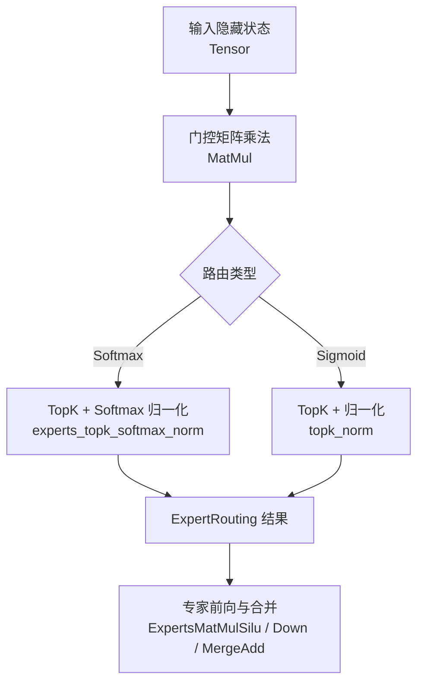
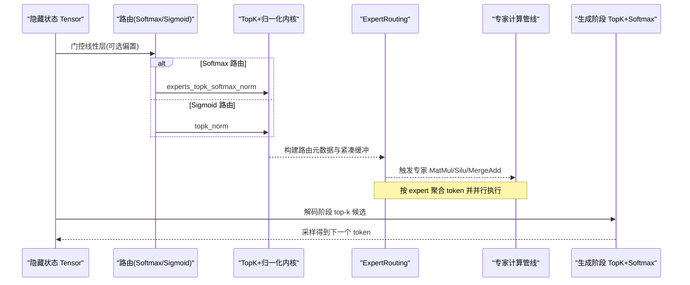
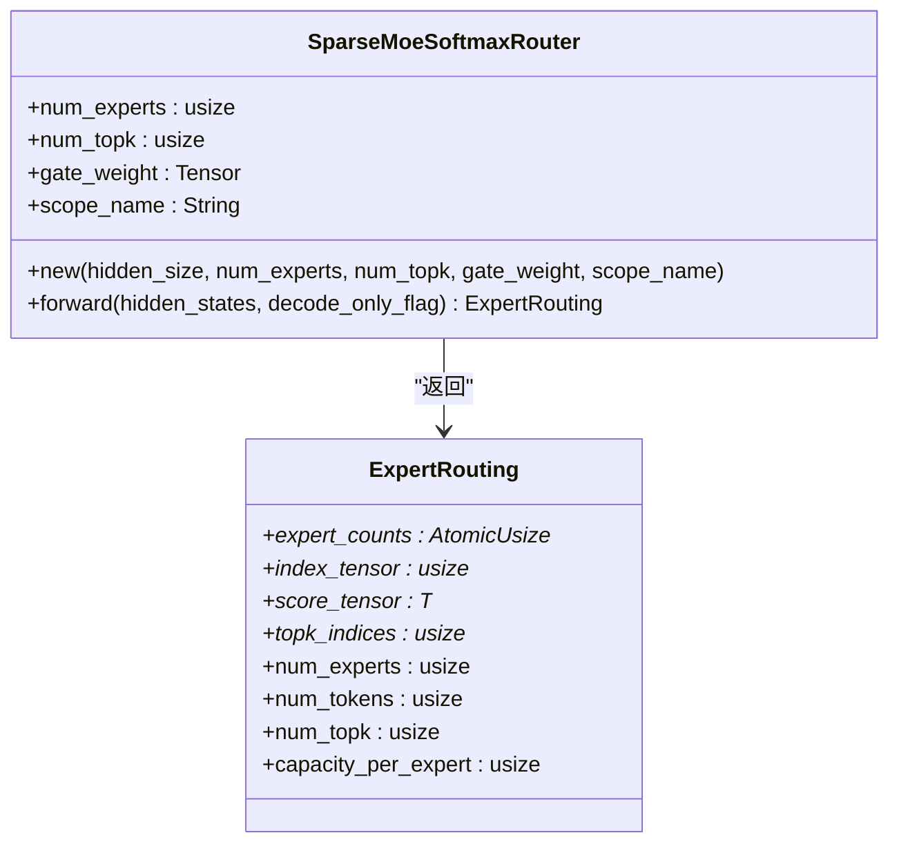
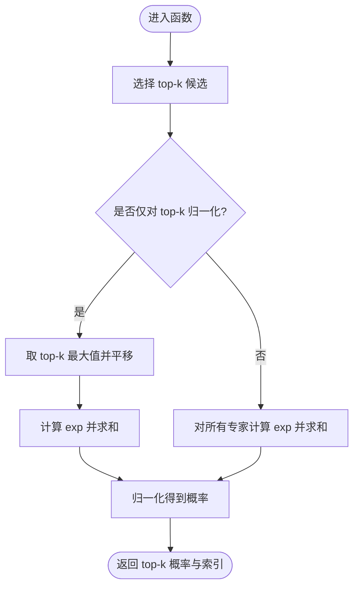
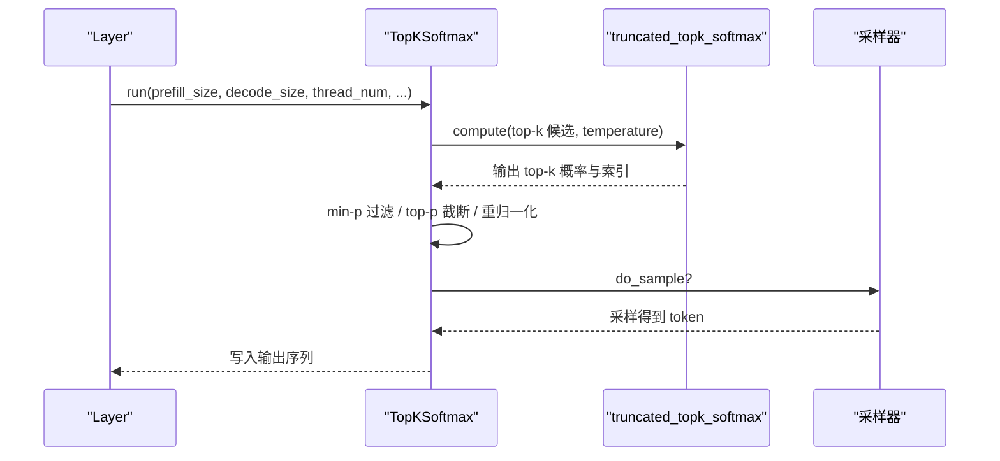
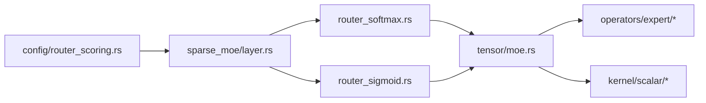

# Softmax 路由算法

<cite>
**本文引用的文件**
- [src/transformer/sparse_moe/router_softmax.rs](file://src/transformer/sparse_moe/router_softmax.rs)
- [src/transformer/sparse_moe/router_sigmoid.rs](file://src/transformer/sparse_moe/router_sigmoid.rs)
- [src/transformer/sparse_moe/layer.rs](file://src/transformer/sparse_moe/layer.rs)
- [src/operators/expert/expert_routing.rs](file://src/operators/expert/expert_routing.rs)
- [src/tensor/moe.rs](file://src/tensor/moe.rs)
- [src/kernel/scalar/experts_topk_softmax_norm.rs](file://src/kernel/scalar/experts_topk_softmax_norm.rs)
- [src/kernel/scalar/truncated_topk_softmax.rs](file://src/kernel/scalar/truncated_topk_softmax.rs)
- [src/operators/softmax/topk_softmax.rs](file://src/operators/softmax/topk_softmax.rs)
- [src/transformer/config/router_scoring.rs](file://src/transformer/config/router_scoring.rs)
</cite>

## 目录
1. [简介](#简介)
2. [项目结构](#项目结构)
3. [核心组件](#核心组件)
4. [架构总览](#架构总览)
5. [详细组件分析](#详细组件分析)
6. [依赖关系分析](#依赖关系分析)
7. [性能与内存特征](#性能与内存特征)
8. [与其他路由算法的对比](#与其他路由算法的对比)
9. [配置参数与最佳实践](#配置参数与最佳实践)
10. [故障排查指南](#故障排查指南)
11. [结论](#结论)

## 简介
本技术文档聚焦于 MoE（Mixture of Experts）中的 Softmax 路由实现，系统梳理其数学原理、数值稳定性处理、与 Sigmoid 路由的差异、在不同 batch size 下的性能与内存特征，并给出配置建议与最佳实践。文档同时覆盖 TopK 选择、TopK 归一化、以及生成阶段的 TopK+Softmax 采样流程，帮助读者从代码到工程落地全面理解该模块。

## 项目结构
本项目在稀疏 MoE 路径中提供两种路由策略：Softmax 与 Sigmoid。Softmax 路由通过门控矩阵乘法得到专家得分，再对每个 token 的 top-k 候选进行 softmax 归一化；Sigmoid 路由则先对门控输出做逐元素 sigmoid，再进行 top-k 选择与归一化。两者共享统一的 ExpertRouting 数据结构与后续专家计算流水线。

图表来源
- [src/transformer/sparse_moe/router_softmax.rs:57-82](file://src/transformer/sparse_moe/router_softmax.rs#L57-L82)
- [src/transformer/sparse_moe/router_sigmoid.rs:57-75](file://src/transformer/sparse_moe/router_sigmoid.rs#L57-L75)
- [src/tensor/moe.rs:155-176](file://src/tensor/moe.rs#L155-L176)
- [src/tensor/moe.rs:223-244](file://src/tensor/moe.rs#L223-L244)

章节来源
- [src/transformer/sparse_moe/router_softmax.rs:1-84](file://src/transformer/sparse_moe/router_softmax.rs#L1-L84)
- [src/transformer/sparse_moe/router_sigmoid.rs:1-77](file://src/transformer/sparse_moe/router_sigmoid.rs#L1-L77)
- [src/tensor/moe.rs:155-176](file://src/tensor/moe.rs#L155-L176)
- [src/tensor/moe.rs:223-244](file://src/tensor/moe.rs#L223-L244)

## 核心组件
- 路由抽象与选择
  - 路由策略枚举 RouterScoringKind 支持 Softmax 与 Sigmoid，并在模型层根据配置选择具体实现。
- Softmax 路由
  - 通过门控权重与隐藏状态做矩阵乘法得到专家得分，随后调用 softmax 归一化算子完成 TopK 选择与概率归一化。
- Sigmoid 路由
  - 通过带可选偏置的门控线性层后接逐元素 sigmoid，再进行 TopK 选择与归一化。
- 路由结果结构
  - ExpertRouting 统一承载每 expert 的任务计数、紧凑索引张量、分数张量与 top-k 索引，供后续专家并行执行使用。
- 归一化内核
  - experts_topk_softmax_norm 针对 top-k 子集或全专家集合进行 softmax 归一化，支持“仅对 top-k 归一化”的优化分支。
- 生成阶段 TopK+Softmax
  - truncated_topk_softmax 与 TopKSoftmax 算子用于解码阶段的 top-k 候选筛选与温度缩放、top-p/min-p 过滤与采样。

章节来源
- [src/transformer/config/router_scoring.rs:1-23](file://src/transformer/config/router_scoring.rs#L1-L23)
- [src/transformer/sparse_moe/router_softmax.rs:1-84](file://src/transformer/sparse_moe/router_softmax.rs#L1-L84)
- [src/transformer/sparse_moe/router_sigmoid.rs:1-77](file://src/transformer/sparse_moe/router_sigmoid.rs#L1-L77)
- [src/operators/expert/expert_routing.rs:44-65](file://src/operators/expert/expert_routing.rs#L44-L65)
- [src/kernel/scalar/experts_topk_softmax_norm.rs:1-59](file://src/kernel/scalar/experts_topk_softmax_norm.rs#L1-L59)
- [src/kernel/scalar/truncated_topk_softmax.rs:1-66](file://src/kernel/scalar/truncated_topk_softmax.rs#L1-L66)
- [src/operators/softmax/topk_softmax.rs:1-120](file://src/operators/softmax/topk_softmax.rs#L1-L120)

## 架构总览
下图展示了从输入到路由再到专家计算的端到端数据流，包括 Softmax 与 Sigmoid 两条分支以及生成阶段的 TopK+Softmax 采样路径。

图表来源
- [src/transformer/sparse_moe/layer.rs:152-198](file://src/transformer/sparse_moe/layer.rs#L152-L198)
- [src/tensor/moe.rs:155-176](file://src/tensor/moe.rs#L155-L176)
- [src/tensor/moe.rs:223-244](file://src/tensor/moe.rs#L223-L244)
- [src/kernel/scalar/experts_topk_softmax_norm.rs:1-59](file://src/kernel/scalar/experts_topk_softmax_norm.rs#L1-L59)
- [src/operators/softmax/topk_softmax.rs:127-206](file://src/operators/softmax/topk_softmax.rs#L127-L206)

## 详细组件分析

### Softmax 路由类与接口
- 职责
  - 构造时校验门控权重形状，保存 num_experts、num_topk 等超参。
  - forward 中执行门控矩阵乘法，随后调用 softmax 归一化完成路由。
- 关键要点
  - 门控权重形状为 [num_experts, hidden_size]，与输入维度严格匹配。
  - 通过 matmul 参数宏控制分块步长以适配底层优化。
  - 返回 ExpertRouting，包含 top-k 索引与分数、每 expert 任务计数与紧凑布局。

图表来源
- [src/transformer/sparse_moe/router_softmax.rs:10-84](file://src/transformer/sparse_moe/router_softmax.rs#L10-L84)
- [src/operators/expert/expert_routing.rs:44-65](file://src/operators/expert/expert_routing.rs#L44-L65)

章节来源
- [src/transformer/sparse_moe/router_softmax.rs:1-84](file://src/transformer/sparse_moe/router_softmax.rs#L1-L84)
- [src/operators/expert/expert_routing.rs:44-65](file://src/operators/expert/expert_routing.rs#L44-L65)

### Sigmoid 路由类与接口
- 职责
  - 与 Softmax 路由类似，但门控输出经逐元素 sigmoid 后再进行 top-k 选择与归一化。
  - 支持可选偏置张量。
- 差异点
  - 不直接进行 softmax 全局归一化，而是独立地对每个专家通道做 sigmoid，再挑选 top-k。

章节来源
- [src/transformer/sparse_moe/router_sigmoid.rs:1-77](file://src/transformer/sparse_moe/router_sigmoid.rs#L1-L77)

### 路由选择与 MoE 层集成
- 路由选择
  - 通过 RouterScoringKind 决定采用 Softmax 或 Sigmoid。
- MoE 层
  - 负责初始化路由与专家权重，并在 forward 中串联路由、专家前向与残差合并。

章节来源
- [src/transformer/config/router_scoring.rs:1-23](file://src/transformer/config/router_scoring.rs#L1-L23)
- [src/transformer/sparse_moe/layer.rs:14-72](file://src/transformer/sparse_moe/layer.rs#L14-L72)
- [src/transformer/sparse_moe/layer.rs:152-198](file://src/transformer/sparse_moe/layer.rs#L152-L198)

### TopK+Softmax 归一化内核
- 功能
  - 对每个 token 的专家得分进行 top-k 选择，并对选出的 top-k 或全部专家进行 softmax 归一化。
- 数值稳定性
  - 使用 max 值平移（value - max）再做 exp，避免溢出。
- 优化分支
  - 当仅对 top-k 子集归一化时，跳过全专家求和，减少计算量。

图表来源
- [src/kernel/scalar/experts_topk_softmax_norm.rs:1-59](file://src/kernel/scalar/experts_topk_softmax_norm.rs#L1-L59)

章节来源
- [src/kernel/scalar/experts_topk_softmax_norm.rs:1-165](file://src/kernel/scalar/experts_topk_softmax_norm.rs#L1-L165)

### 生成阶段 TopK+Softmax 采样
- 功能
  - 在解码阶段对 top-k 候选进行温度缩放、min-p 过滤、top-p 截断、重归一化与采样。
- 关键点
  - 支持 f16/f32 特化实现，f16 在无 AVX512FP16 时回退到 f32 中间精度计算。
  - 维护序列状态与 EOS 终止条件。

图表来源
- [src/operators/softmax/topk_softmax.rs:127-206](file://src/operators/softmax/topk_softmax.rs#L127-L206)
- [src/kernel/scalar/truncated_topk_softmax.rs:1-66](file://src/kernel/scalar/truncated_topk_softmax.rs#L1-L66)

章节来源
- [src/operators/softmax/topk_softmax.rs:1-120](file://src/operators/softmax/topk_softmax.rs#L1-L120)
- [src/kernel/scalar/truncated_topk_softmax.rs:1-120](file://src/kernel/scalar/truncated_topk_softmax.rs#L1-L120)

## 依赖关系分析
- 路由层依赖
  - router_softmax.rs 依赖 tensor.matmul 与 softmax_norm 算子。
  - router_sigmoid.rs 依赖 sigmoid_gate 与 topk_norm 算子。
- 算子层依赖
  - tensor/moe.rs 将路由与专家计算编排为 Operator 队列，统一管理执行。
  - kernel 层提供高效标量内核（如 experts_topk_softmax_norm）。
- 配置层依赖
  - router_scoring.rs 提供路由策略枚举与默认行为。

图表来源
- [src/transformer/sparse_moe/router_softmax.rs:1-84](file://src/transformer/sparse_moe/router_softmax.rs#L1-L84)
- [src/transformer/sparse_moe/router_sigmoid.rs:1-77](file://src/transformer/sparse_moe/router_sigmoid.rs#L1-L77)
- [src/tensor/moe.rs:155-176](file://src/tensor/moe.rs#L155-L176)
- [src/transformer/config/router_scoring.rs:1-23](file://src/transformer/config/router_scoring.rs#L1-L23)

章节来源
- [src/transformer/sparse_moe/router_softmax.rs:1-84](file://src/transformer/sparse_moe/router_softmax.rs#L1-L84)
- [src/transformer/sparse_moe/router_sigmoid.rs:1-77](file://src/transformer/sparse_moe/router_sigmoid.rs#L1-L77)
- [src/tensor/moe.rs:155-176](file://src/tensor/moe.rs#L155-L176)
- [src/transformer/config/router_scoring.rs:1-23](file://src/transformer/config/router_scoring.rs#L1-L23)

## 性能与内存特征
- 时间复杂度
  - 门控矩阵乘法：O(B * H * E)，其中 B 为 token 数，H 为隐藏维，E 为专家数。
  - TopK 选择：O(E log K) 或 O(E) 配合堆/选择算法，K 为 top-k。
  - Softmax 归一化：若仅对 top-k 归一化则为 O(K)，否则为 O(E)。
- 空间占用
  - ExpertRouting 需要 per-expert 容量为 B*K 的紧凑索引与分数缓冲，总计约 E*B*K 个条目。
  - 生成阶段 TopKSoftmax 需要临时存储 top-k 候选与采样缓冲区。
- Batch Size 影响
  - 大 batch 下，门控矩阵乘与路由分配成为瓶颈；需关注线程划分与缓存局部性。
  - 小 batch 下，调度与同步开销占比上升，应适当增大 top-k 或批内并行度。
- 数值稳定性
  - 使用 max 平移与 exp 计算，避免上溢；在 f16 路径中必要时回退到 f32 中间精度。

[本节为通用性能讨论，无需特定文件引用]

## 与其他路由算法的对比
- Softmax vs Sigmoid
  - 竞争性与分布
    - Softmax 在全局范围内产生互斥的概率分布，适合多专家竞争场景，强调“相对优势”。
    - Sigmoid 对每个专家独立激活，允许“多选”，适合专家能力互补且可并行的场景。
  - 收敛与训练动态
    - Softmax 通常带来更清晰的梯度信号，有助于稳定训练；Sigmoid 可能更易出现专家饱和。
  - 推理成本
    - Softmax 需要对 top-k 或全专家做 exp 与求和，计算略高；Sigmoid 仅需逐元素 sigmoid，成本更低。
- 与纯 TopK（无 softmax）
  - 纯 TopK 仅选择最高得分专家，忽略概率解释；Softmax 提供可解释的概率权重，利于加权融合。

章节来源
- [src/transformer/sparse_moe/router_softmax.rs:57-82](file://src/transformer/sparse_moe/router_softmax.rs#L57-L82)
- [src/transformer/sparse_moe/router_sigmoid.rs:57-75](file://src/transformer/sparse_moe/router_sigmoid.rs#L57-L75)
- [src/kernel/scalar/experts_topk_softmax_norm.rs:32-57](file://src/kernel/scalar/experts_topk_softmax_norm.rs#L32-L57)

## 配置参数与最佳实践
- 路由策略选择
  - 通过 RouterScoringKind 指定 Softmax 或 Sigmoid；未显式指定时，依据模型族设置默认策略。
- 关键超参
  - num_experts：专家数量，影响门控矩阵大小与路由分配开销。
  - num_topk：每 token 选择的专家数，平衡精度与吞吐。
  - norm_topk_prob：是否仅对 top-k 子集进行 softmax 归一化，可减少计算。
  - temperature：生成阶段温度，控制分布平滑度。
  - top_p/min_p/do_sample：生成阶段采样策略参数。
- 最佳实践
  - 优先启用“仅对 top-k 归一化”以提升吞吐。
  - 在 f16 路径确保硬件特性可用，否则回退到 f32 以保证数值稳定。
  - 合理设置 num_topk，避免专家负载不均导致热点。
  - 在解码阶段结合 top-p/min-p 提升多样性与稳定性。

章节来源
- [src/transformer/config/router_scoring.rs:1-23](file://src/transformer/config/router_scoring.rs#L1-L23)
- [src/kernel/scalar/experts_topk_softmax_norm.rs:13-14](file://src/kernel/scalar/experts_topk_softmax_norm.rs#L13-L14)
- [src/operators/softmax/topk_softmax.rs:77-120](file://src/operators/softmax/topk_softmax.rs#L77-L120)

## 故障排查指南
- 形状不匹配
  - 检查门控权重形状是否为 [num_experts, hidden_size]，与输入维度一致。
- 路由为空或零质量
  - 确认 top-k 选择与过滤逻辑未将所有概率置零；必要时回退到最大概率候选。
- 数值异常
  - 检查是否存在 NaN/Inf 输入；在 f16 路径注意回退到 f32 中间精度。
- 线程与并发
  - 验证 ExpertRouting 的原子计数与紧凑缓冲写入顺序，避免越界。

章节来源
- [src/transformer/sparse_moe/router_softmax.rs:43-47](file://src/transformer/sparse_moe/router_softmax.rs#L43-L47)
- [src/operators/softmax/topk_softmax.rs:227-270](file://src/operators/softmax/topk_softmax.rs#L227-L270)
- [src/operators/expert/expert_routing.rs:44-65](file://src/operators/expert/expert_routing.rs#L44-L65)

## 结论
Softmax 路由在多专家竞争中提供更强的互斥性与可解释的概率分布，配合 top-k 选择与数值稳定的 softmax 实现，能在保证精度的同时获得良好吞吐。与 Sigmoid 路由相比，Softmax 更适合强调相对优势的竞争场景；而 Sigmoid 则在并行与低成本方面具备优势。工程中应结合硬件特性、batch size 与采样策略进行调优，以获得最佳的性能与质量权衡。