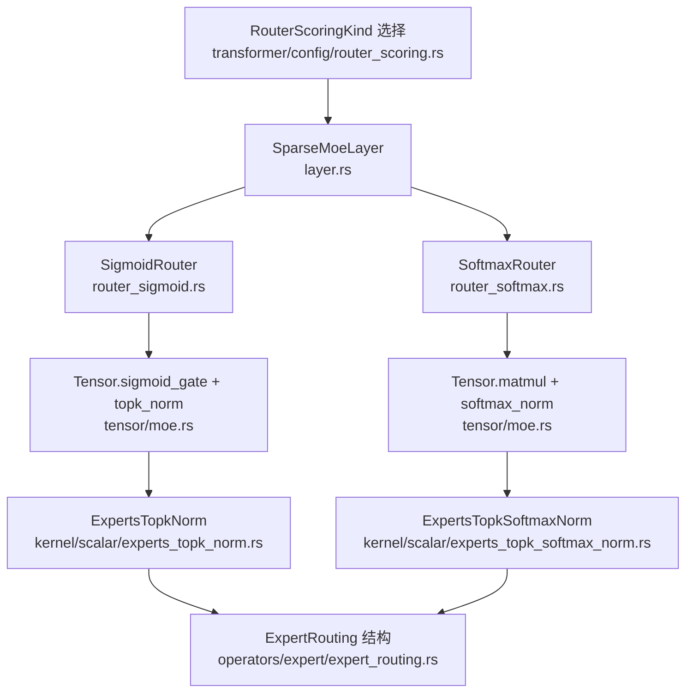
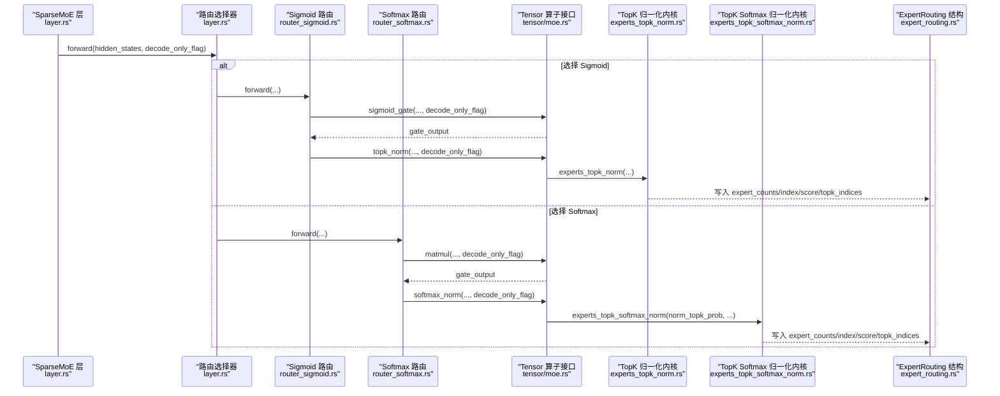
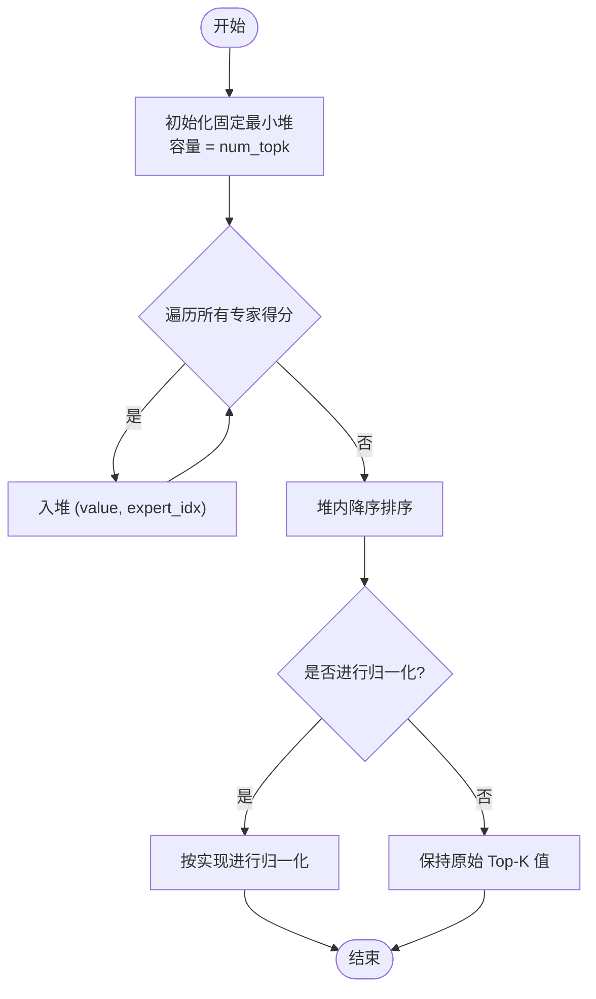
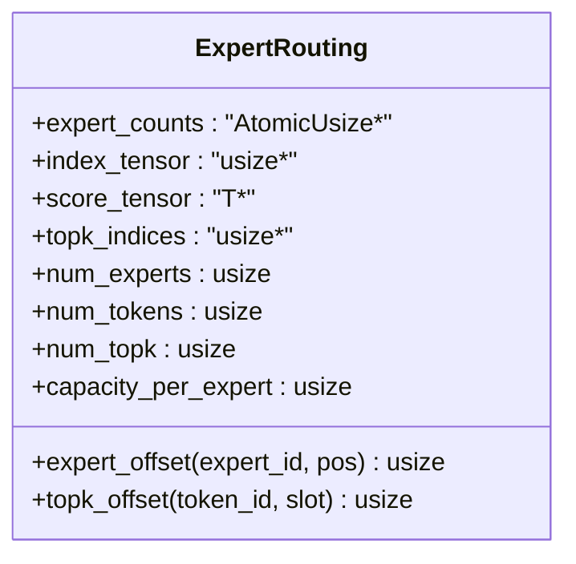
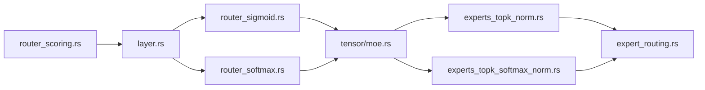

# 路由算法实现

<cite>
**本文引用的文件**   
- [router_sigmoid.rs](file://src/transformer/sparse_moe/router_sigmoid.rs)
- [router_softmax.rs](file://src/transformer/sparse_moe/router_softmax.rs)
- [layer.rs](file://src/transformer/sparse_moe/layer.rs)
- [router_scoring.rs](file://src/transformer/config/router_scoring.rs)
- [moe.rs](file://src/tensor/moe.rs)
- [expert_routing.rs](file://src/operators/expert/expert_routing.rs)
- [experts_topk_norm.rs](file://src/kernel/scalar/experts_topk_norm.rs)
- [experts_topk_softmax_norm.rs](file://src/kernel/scalar/experts_topk_softmax_norm.rs)
- [topk_softmax.rs](file://src/operators/softmax/topk_softmax.rs)
- [minimax_m2.5_router.md](file://docs/design/operators/minimax_m2.5_router.md)
</cite>

## 目录
1. [简介](#简介)
2. [项目结构](#项目结构)
3. [核心组件](#核心组件)
4. [架构总览](#架构总览)
5. [详细组件分析](#详细组件分析)
6. [依赖关系分析](#依赖关系分析)
7. [性能考量](#性能考量)
8. [故障排查指南](#故障排查指南)
9. [结论](#结论)
10. [附录](#附录)

## 简介
本技术文档聚焦于 MoE（Mixture of Experts）中的路由算法实现，系统对比 Sigmoid 路由与 Softmax 路由两种方案在评分函数、Top-K 选择策略、权重归一化方式以及 decode_only_flag 对行为的影响等方面的差异。同时给出路由偏差（bias）的作用与使用场景、性能分析与调优建议，并提供扩展自定义路由算法的指南与示例路径。

## 项目结构
路由相关代码主要分布在以下模块：
- 高层路由封装与组合：sparse_moe/layer.rs
- 具体路由实现：sparse_moe/router_sigmoid.rs、sparse_moe/router_softmax.rs
- 配置与路由评分类型选择：transformer/config/router_scoring.rs
- Tensor 层算子接口与调度：tensor/moe.rs
- 路由结果数据结构与任务分配：operators/expert/expert_routing.rs
- Top-K 与 Softmax 内核实现：kernel/scalar/experts_topk_norm.rs、kernel/scalar/experts_topk_softmax_norm.rs
- 生成阶段 TopKSoftmax（采样/过滤）：operators/softmax/topk_softmax.rs
- MiniMax M2.5 路由设计说明：docs/design/operators/minimax_m2.5_router.md

图表来源
- [layer.rs:14-72](file://src/transformer/sparse_moe/layer.rs#L14-L72)
- [router_sigmoid.rs:1-77](file://src/transformer/sparse_moe/router_sigmoid.rs#L1-L77)
- [router_softmax.rs:1-84](file://src/transformer/sparse_moe/router_softmax.rs#L1-L84)
- [moe.rs:155-244](file://src/tensor/moe.rs#L155-L244)
- [experts_topk_norm.rs:1-84](file://src/kernel/scalar/experts_topk_norm.rs#L1-L84)
- [experts_topk_softmax_norm.rs:1-165](file://src/kernel/scalar/experts_topk_softmax_norm.rs#L1-L165)
- [expert_routing.rs:43-65](file://src/operators/expert/expert_routing.rs#L43-L65)
- [router_scoring.rs:1-23](file://src/transformer/config/router_scoring.rs#L1-L23)

章节来源
- [layer.rs:14-72](file://src/transformer/sparse_moe/layer.rs#L14-L72)
- [router_sigmoid.rs:1-77](file://src/transformer/sparse_moe/router_sigmoid.rs#L1-L77)
- [router_softmax.rs:1-84](file://src/transformer/sparse_moe/router_softmax.rs#L1-L84)
- [moe.rs:155-244](file://src/tensor/moe.rs#L155-L244)
- [expert_routing.rs:43-65](file://src/operators/expert/expert_routing.rs#L43-L65)
- [router_scoring.rs:1-23](file://src/transformer/config/router_scoring.rs#L1-L23)

## 核心组件
- 路由评分函数
  - Sigmoid 路由：通过门控线性投影 + 可选 bias + sigmoid 激活得到专家得分，再执行 Top-K 选择与归一化。
  - Softmax 路由：通过门控线性投影得到专家得分，再执行 Top-K 选择与 Softmax 归一化。
- Top-K 选择与归一化
  - Sigmoid 分支：先选 Top-K，再在所选集合内做概率归一化（或按实现进行简单比例归一）。
  - Softmax 分支：支持“仅在 Top-K 内归一”和“全量归一后取 Top-K 概率”两种模式。
- 路由结果数据结构
  - ExpertRouting：包含每个专家的 token 紧凑队列、分数、Top-K 索引等，供后续专家计算直接使用。
- 配置与路由类型选择
  - RouterScoringKind：从模型配置或家族默认值决定采用 Softmax 还是 Sigmoid。

章节来源
- [router_sigmoid.rs:57-76](file://src/transformer/sparse_moe/router_sigmoid.rs#L57-L76)
- [router_softmax.rs:57-83](file://src/transformer/sparse_moe/router_softmax.rs#L57-L83)
- [moe.rs:178-244](file://src/tensor/moe.rs#L178-L244)
- [experts_topk_norm.rs:1-84](file://src/kernel/scalar/experts_topk_norm.rs#L1-L84)
- [experts_topk_softmax_norm.rs:1-165](file://src/kernel/scalar/experts_topk_softmax_norm.rs#L1-L165)
- [expert_routing.rs:43-65](file://src/operators/expert/expert_routing.rs#L43-L65)
- [router_scoring.rs:1-23](file://src/transformer/config/router_scoring.rs#L1-L23)

## 架构总览
下图展示了从高层 SparseMoE 层到具体路由实现、再到内核与路由数据结构的完整调用链。

图表来源
- [layer.rs:66-72](file://src/transformer/sparse_moe/layer.rs#L66-L72)
- [router_sigmoid.rs:57-76](file://src/transformer/sparse_moe/router_sigmoid.rs#L57-L76)
- [router_softmax.rs:57-83](file://src/transformer/sparse_moe/router_softmax.rs#L57-L83)
- [moe.rs:178-244](file://src/tensor/moe.rs#L178-L244)
- [experts_topk_norm.rs:1-84](file://src/kernel/scalar/experts_topk_norm.rs#L1-L84)
- [experts_topk_softmax_norm.rs:1-165](file://src/kernel/scalar/experts_topk_softmax_norm.rs#L1-L165)
- [expert_routing.rs:43-65](file://src/operators/expert/expert_routing.rs#L43-L65)

## 详细组件分析

### Sigmoid 路由 vs Softmax 路由：实现差异与适用场景
- 评分函数
  - Sigmoid：门控线性投影 + 可选 bias + sigmoid 激活，表达各专家独立激活倾向，适合需要“多专家并行激活”的场景（如 MiniMax-M2.5 的设计目标）。
  - Softmax：门控线性投影后直接进行 Softmax 归一化，体现全局竞争式概率分布，适合“互斥性更强”的专家选择。
- 归一化范围
  - Sigmoid：在 Top-K 内部进行归一化（或基于 Top-K 值的比例归一），避免全量 softmax 开销。
  - Softmax：支持“仅 Top-K 内归一”与“全量归一后取 Top-K 概率”两种模式，兼顾数值稳定与效率。
- 偏差（bias）
  - Sigmoid：支持 routing bias，且应在评分阶段参与，直接影响专家排序与选择。
  - Softmax：当前实现未暴露 bias 参数。
- 适用场景
  - Sigmoid：专家数量大、希望多个专家并行激活、需通过 bias 调节专家偏好（MiniMax-M2.5）。
  - Softmax：强调专家间竞争、追求更严格的稀疏性与概率解释。

章节来源
- [router_sigmoid.rs:57-76](file://src/transformer/sparse_moe/router_sigmoid.rs#L57-L76)
- [router_softmax.rs:57-83](file://src/transformer/sparse_moe/router_softmax.rs#L57-L83)
- [moe.rs:178-244](file://src/tensor/moe.rs#L178-L244)
- [experts_topk_norm.rs:1-84](file://src/kernel/scalar/experts_topk_norm.rs#L1-L84)
- [experts_topk_softmax_norm.rs:1-165](file://src/kernel/scalar/experts_topk_softmax_norm.rs#L1-L165)
- [minimax_m2.5_router.md:1-244](file://docs/design/operators/minimax_m2.5_router.md#L1-L244)

### 路由评分函数的数学原理与计算方法
- Sigmoid 评分
  - 步骤：线性投影 → 可选 bias 注入 → sigmoid 激活 → Top-K 选择 → 归一化。
  - 特点：每个专家得分相互独立；bias 可显式提升/降低某专家被选中的概率。
- Softmax 评分
  - 步骤：线性投影 → Top-K 选择 → 归一化（Top-K 内或全量）→ 输出概率。
  - 特点：概率具有全局约束；可通过是否仅 Top-K 内归一控制数值稳定性与计算成本。

章节来源
- [router_sigmoid.rs:57-76](file://src/transformer/sparse_moe/router_sigmoid.rs#L57-L76)
- [router_softmax.rs:57-83](file://src/transformer/sparse_moe/router_softmax.rs#L57-L83)
- [moe.rs:178-244](file://src/tensor/moe.rs#L178-L244)
- [experts_topk_norm.rs:1-84](file://src/kernel/scalar/experts_topk_norm.rs#L1-L84)
- [experts_topk_softmax_norm.rs:1-165](file://src/kernel/scalar/experts_topk_softmax_norm.rs#L1-L165)

### Top-K 选择的策略与实现细节
- 固定最小堆（FixedMinHeap）用于高效维护 Top-K。
- 比较与排序：
  - 将输入专家得分依次入堆，保持堆顶为当前第 K 大的阈值。
  - 出堆后按降序排列，得到最终 Top-K 专家及其得分。
- 边界处理：
  - 当 num_topk > num_experts 时，实际只保留全部专家并按得分排序。
  - 空输入或零长度时快速返回。

图表来源
- [experts_topk_norm.rs:1-84](file://src/kernel/scalar/experts_topk_norm.rs#L1-L84)
- [experts_topk_softmax_norm.rs:1-165](file://src/kernel/scalar/experts_topk_softmax_norm.rs#L1-L165)

章节来源
- [experts_topk_norm.rs:1-84](file://src/kernel/scalar/experts_topk_norm.rs#L1-L84)
- [experts_topk_softmax_norm.rs:1-165](file://src/kernel/scalar/experts_topk_softmax_norm.rs#L1-L165)

### 路由权重的归一化处理
- Sigmoid 分支
  - 在 Top-K 内部进行归一化：对选出的 K 个专家得分求和后按比例缩放，保证 Top-K 概率之和为 1。
  - 若 sum 为零则退化处理，保持原值或置零。
- Softmax 分支
  - 模式一（norm_topk_prob=true）：仅对 Top-K 内的得分做 softmax，避免全量 exp 计算，提高吞吐。
  - 模式二（norm_topk_prob=false）：对所有专家做 softmax，再取 Top-K 的概率值，确保严格的全局概率语义。

章节来源
- [experts_topk_norm.rs:1-84](file://src/kernel/scalar/experts_topk_norm.rs#L1-L84)
- [experts_topk_softmax_norm.rs:1-165](file://src/kernel/scalar/experts_topk_softmax_norm.rs#L1-L165)

### decode_only_flag 对路由行为的影响
- 作用位置
  - 在 Tensor 层算子中作为关键参数传入，影响底层算子的执行路径与调度（例如 matmul、sigmoid_gate、softmax_norm、topk_norm 等）。
- 典型影响
  - 在 decode 阶段（单步生成）可能启用更激进的缓存复用、更小的 tile 尺寸或不同的线程划分策略，以降低延迟。
  - 在 prefill 阶段（批量填充）可能采用更大批量的矩阵分块以提升吞吐。
- 注意
  - 该标志不改变路由的数学定义，但会显著影响算子内部的实现细节与性能表现。

章节来源
- [moe.rs:178-244](file://src/tensor/moe.rs#L178-L244)
- [router_sigmoid.rs:57-76](file://src/transformer/sparse_moe/router_sigmoid.rs#L57-L76)
- [router_softmax.rs:57-83](file://src/transformer/sparse_moe/router_softmax.rs#L57-L83)

### 路由偏差（bias）的作用与使用场景
- 作用机制
  - 在 Sigmoid 路由中，bias 在评分阶段注入，直接影响专家得分与排序，从而改变 Top-K 选择结果。
- 使用场景
  - 需要显式引导某些专家被优先选中（例如领域知识或负载均衡策略）。
  - 在 MiniMax-M2.5 设计中，routing bias 是核心特性之一，必须参与评分而非事后修正。
- 注意事项
  - 量化策略通常要求 gate 与 routing bias 保持高精度，以保证路由稳定性。

章节来源
- [router_sigmoid.rs:57-76](file://src/transformer/sparse_moe/router_sigmoid.rs#L57-L76)
- [minimax_m2.5_router.md:1-244](file://docs/design/operators/minimax_m2.5_router.md#L1-L244)

### 路由结果数据结构与任务映射
- ExpertRouting
  - 字段包括：每个专家的 token 计数、token 紧凑队列 index_tensor、对应分数 score_tensor、每 token 的 Top-K 专家索引 topk_indices 等。
  - 提供便捷偏移计算：expert_offset、topk_offset，便于后续专家计算直接访问。
- 任务分配
  - task_assign 将全局任务 id 映射到具体专家与其局部 tile，支撑后续专家 GEMM 的高效调度。

图表来源
- [expert_routing.rs:43-65](file://src/operators/expert/expert_routing.rs#L43-L65)

章节来源
- [expert_routing.rs:43-65](file://src/operators/expert/expert_routing.rs#L43-L65)

### 生成阶段 TopKSoftmax（采样/过滤）
- 功能
  - 在解码阶段对候选词表进行 Top-K 截断、Top-P 核采样、Min-P 过滤、温度缩放与归一化，并支持确定性或随机采样。
- 与路由的关系
  - 该模块作用于词表采样，而非 MoE 专家路由；但其 Top-K 与归一化思想与路由相似，可作为参考。

章节来源
- [topk_softmax.rs:1-800](file://src/operators/softmax/topk_softmax.rs#L1-L800)

## 依赖关系分析
- 高层编排
  - SparseMoE 层根据 RouterScoringKind 选择具体路由实现。
- 路由实现
  - Sigmoid 路由依赖 Tensor.sigmoid_gate 与 topk_norm。
  - Softmax 路由依赖 Tensor.matmul 与 softmax_norm。
- 内核实现
  - Top-K 与归一化由 scalar 内核完成，分别对应 Sigmoid 与 Softmax 分支。
- 数据结构
  - ExpertRouting 贯穿路由与后续专家计算，提供紧凑的专家-令牌映射。

图表来源
- [router_scoring.rs:1-23](file://src/transformer/config/router_scoring.rs#L1-L23)
- [layer.rs:14-72](file://src/transformer/sparse_moe/layer.rs#L14-L72)
- [router_sigmoid.rs:1-77](file://src/transformer/sparse_moe/router_sigmoid.rs#L1-L77)
- [router_softmax.rs:1-84](file://src/transformer/sparse_moe/router_softmax.rs#L1-L84)
- [moe.rs:155-244](file://src/tensor/moe.rs#L155-L244)
- [experts_topk_norm.rs:1-84](file://src/kernel/scalar/experts_topk_norm.rs#L1-L84)
- [experts_topk_softmax_norm.rs:1-165](file://src/kernel/scalar/experts_topk_softmax_norm.rs#L1-L165)
- [expert_routing.rs:43-65](file://src/operators/expert/expert_routing.rs#L43-L65)

章节来源
- [router_scoring.rs:1-23](file://src/transformer/config/router_scoring.rs#L1-L23)
- [layer.rs:14-72](file://src/transformer/sparse_moe/layer.rs#L14-L72)
- [moe.rs:155-244](file://src/tensor/moe.rs#L155-L244)

## 性能考量
- 计算复杂度
  - Top-K 选择：O(num_experts log K)，K 较小，整体接近线性。
  - Softmax 归一化：全量模式 O(num_experts)，Top-K 内模式 O(K)。
- 访存与并行
  - ExpertRouting 的紧凑队列减少后续专家计算的扫描开销，避免 dense bool 矩阵重复遍历。
  - 多线程路由采用本地桶 + 原子预留 + 连续写，降低锁竞争与冲突。
- 数值稳定性
  - Softmax 在 Top-K 内归一可降低溢出风险；必要时仍可采用全量归一以维持严格概率语义。
- 调优建议
  - 合理设置 num_topk：增大提升表达能力但增加计算与内存压力。
  - 针对 decode 阶段开启 decode_only_flag 以优化小 batch 下的延迟。
  - 在 Sigmoid 路由中谨慎调整 routing bias，避免专家负载严重倾斜。

[本节为通用指导，无需特定文件引用]

## 故障排查指南
- 形状不匹配
  - 检查 gate_weight 的形状是否为 [num_experts, hidden_size]。
  - 若启用 bias，确认其形状为 [num_experts]。
- 路由结果为空或异常
  - 检查 num_topk 与 num_experts 的大小关系。
  - 确认 ExpertRouting 的 capacity_per_expert 足够容纳最坏情况（num_tokens * num_topk）。
- 数值不稳定
  - 在 Softmax 分支尝试仅 Top-K 内归一；或在极端情况下回退到全量归一。
- 性能瓶颈
  - 观察 decode_only_flag 是否正确使用。
  - 评估 num_topk 与专家数量的平衡，避免过度稀疏导致负载不均。

章节来源
- [router_sigmoid.rs:34-55](file://src/transformer/sparse_moe/router_sigmoid.rs#L34-L55)
- [router_softmax.rs:36-55](file://src/transformer/sparse_moe/router_softmax.rs#L36-L55)
- [moe.rs:246-288](file://src/tensor/moe.rs#L246-L288)
- [expert_routing.rs:43-65](file://src/operators/expert/expert_routing.rs#L43-L65)

## 结论
- Sigmoid 路由与 Softmax 路由各有优势：前者适合多专家并行激活与显式 bias 控制，后者强调全局竞争与概率解释。
- Top-K 选择与归一化在不同分支下有不同的权衡，需结合模型规模与部署场景进行选择。
- ExpertRouting 的紧凑队列设计有效降低了后续专家计算的扫描与访存开销。
- 在工程实践中，decode_only_flag 与 bias 的使用对路由行为与性能有重要影响，应结合具体需求进行调优。

[本节为总结性内容，无需特定文件引用]

## 附录

### 自定义路由算法扩展指南与实现示例
- 扩展点
  - 新增路由评分函数：在 tensor/moe.rs 中新增方法（如 custom_gate），并在路由层注册新实现。
  - 新增 Top-K 与归一化内核：在 kernel/scalar 下实现新的内核函数，并在 tensor/moe.rs 中调用。
  - 更新路由选择：在 layer.rs 的枚举或工厂中添加新路由类型，并在 router_scoring.rs 中增加配置项。
- 示例路径
  - 参考 Sigmoid 路由的实现路径：
    - [router_sigmoid.rs:1-77](file://src/transformer/sparse_moe/router_sigmoid.rs#L1-L77)
    - [moe.rs:178-244](file://src/tensor/moe.rs#L178-L244)
  - 参考 Softmax 路由的实现路径：
    - [router_softmax.rs:1-84](file://src/transformer/sparse_moe/router_softmax.rs#L1-L84)
    - [moe.rs:155-176](file://src/tensor/moe.rs#L155-L176)
  - 参考 Top-K 内核实现：
    - [experts_topk_norm.rs:1-84](file://src/kernel/scalar/experts_topk_norm.rs#L1-L84)
    - [experts_topk_softmax_norm.rs:1-165](file://src/kernel/scalar/experts_topk_softmax_norm.rs#L1-L165)
  - 参考路由选择与配置：
    - [router_scoring.rs:1-23](file://src/transformer/config/router_scoring.rs#L1-L23)
    - [layer.rs:14-72](file://src/transformer/sparse_moe/layer.rs#L14-L72)

章节来源
- [router_sigmoid.rs:1-77](file://src/transformer/sparse_moe/router_sigmoid.rs#L1-L77)
- [router_softmax.rs:1-84](file://src/transformer/sparse_moe/router_softmax.rs#L1-L84)
- [moe.rs:155-244](file://src/tensor/moe.rs#L155-L244)
- [experts_topk_norm.rs:1-84](file://src/kernel/scalar/experts_topk_norm.rs#L1-L84)
- [experts_topk_softmax_norm.rs:1-165](file://src/kernel/scalar/experts_topk_softmax_norm.rs#L1-L165)
- [router_scoring.rs:1-23](file://src/transformer/config/router_scoring.rs#L1-L23)
- [layer.rs:14-72](file://src/transformer/sparse_moe/layer.rs#L14-L72)