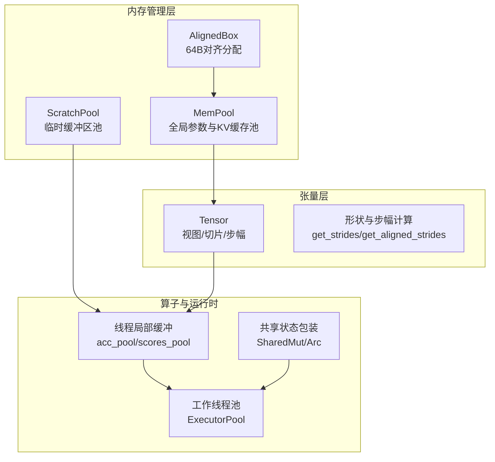
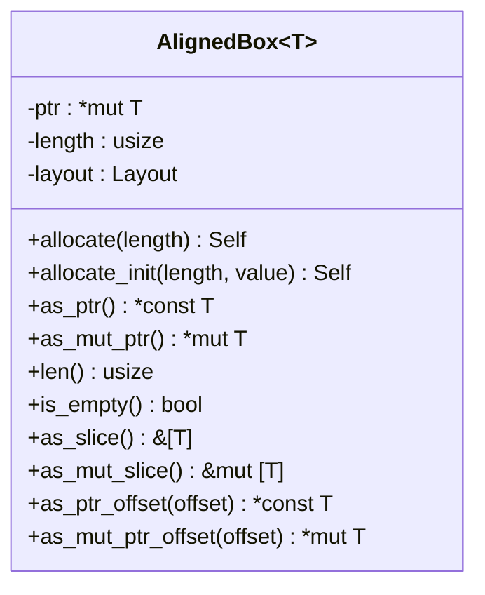
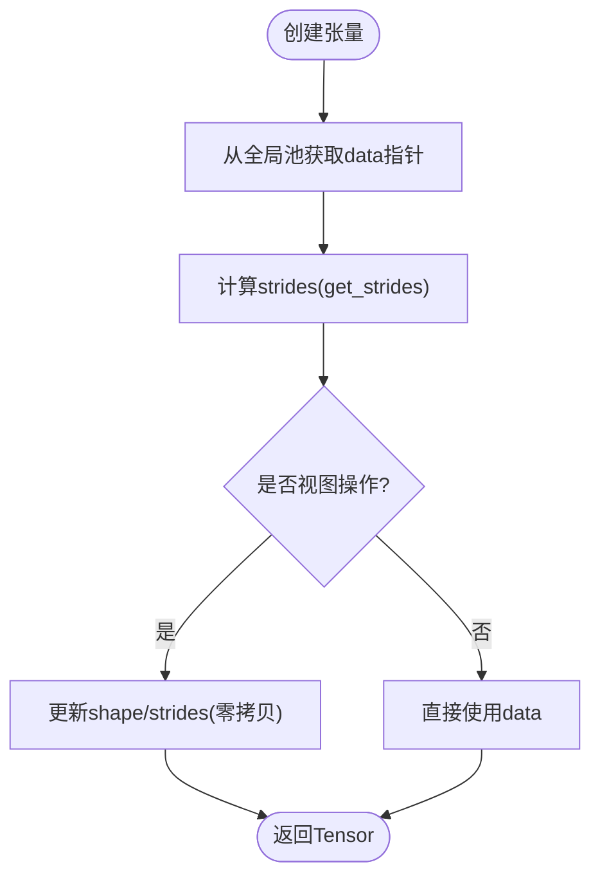
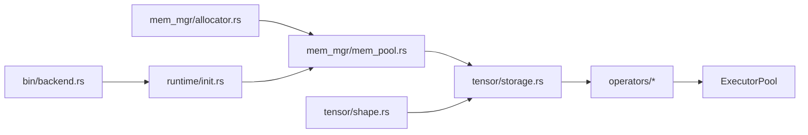

# 内存管理

<cite>
**本文引用的文件**   
- [src/mem_mgr/allocator.rs](file://src/mem_mgr/allocator.rs)
- [src/mem_mgr/mem_pool.rs](file://src/mem_mgr/mem_pool.rs)
- [src/tensor/storage.rs](file://src/tensor/storage.rs)
- [src/tensor/shape.rs](file://src/tensor/shape.rs)
- [src/operators/send_sync_ptr.rs](file://src/operators/send_sync_ptr.rs)
- [src/bin/backend.rs](file://src/bin/backend.rs)
- [src/runtime/init.rs](file://src/runtime/init.rs)
- [src/operators/matmul/matmul_sigmoid.rs](file://src/operators/matmul/matmul_sigmoid.rs)
- [src/operators/attention/scratch.rs](file://src/operators/attention/scratch.rs)
</cite>

## 目录
1. [简介](#简介)
2. [项目结构](#项目结构)
3. [核心组件](#核心组件)
4. [架构总览](#架构总览)
5. [详细组件分析](#详细组件分析)
6. [依赖关系分析](#依赖关系分析)
7. [性能与优化](#性能与优化)
8. [故障排查指南](#故障排查指南)
9. [结论](#结论)
10. [附录](#附录)

## 简介
本技术文档聚焦于 eLLM 的内存管理系统，围绕以下目标展开：
- 解释 64 字节对齐分配的设计与重要性（面向 SIMD512 等向量化指令）
- 说明全局内存池的实现原理：内存块分配、回收与管理机制
- 阐述零拷贝技术：视图与切片如何避免数据复制
- 详述张量存储的管理：内存布局、步幅计算与数据持久化策略
- 介绍内存泄漏防护机制与调试工具
- 提供内存使用监控与分析方法
- 给出内存优化最佳实践与性能调优指南
- 说明多线程环境下的内存安全与同步机制

## 项目结构
内存相关代码主要分布在如下模块：
- 对齐分配器与内存池：src/mem_mgr
- 张量与存储抽象：src/tensor
- 算子线程局部缓冲与并行执行：src/operators/*
- 运行时初始化与工作线程池：src/runtime, src/bin



图表来源
- [src/mem_mgr/allocator.rs:1-156](file://src/mem_mgr/allocator.rs#L1-L156)
- [src/mem_mgr/mem_pool.rs:1-543](file://src/mem_mgr/mem_pool.rs#L1-L543)
- [src/tensor/storage.rs:1-154](file://src/tensor/storage.rs#L1-L154)
- [src/tensor/shape.rs:1-182](file://src/tensor/shape.rs#L1-L182)
- [src/operators/attention/scratch.rs:41-91](file://src/operators/attention/scratch.rs#L41-L91)
- [src/bin/backend.rs:145-187](file://src/bin/backend.rs#L145-L187)
- [src/runtime/init.rs:108-135](file://src/runtime/init.rs#L108-L135)
- [src/operators/send_sync_ptr.rs:1-59](file://src/operators/send_sync_ptr.rs#L1-59)

章节来源
- [src/mem_mgr/mod.rs:1-3](file://src/mem_mgr/mod.rs#L1-L3)
- [src/tensor/mod.rs:1-14](file://src/tensor/mod.rs#L1-L14)

## 核心组件
- 对齐分配器 AlignedBox：以 64 字节对齐分配原始内存，支持按长度分配、初始化和安全的 Drop 释放。
- 全局内存池 MemPool：基于名称映射到内存块，支持权重加载、严格模式校验、专家权重合并为连续块、KV 输出持久化等。
- ScratchPool：为布尔/索引等常用类型提供可复用、带初始化的临时缓冲区。
- Tensor<T>：持有原始指针、形状与步幅，通过视图/切片实现零拷贝；从全局池获取或写入数据。
- 形状与步幅工具：提供标准行主序步幅计算、广播对齐步幅与广播形状推导。
- 线程局部缓冲：在注意力、矩阵乘法等算子中预分配 per-thread 的中间结果与面板缓冲，避免锁竞争与重复分配。
- 共享状态包装 SharedMut/Arc：在多线程环境下安全地共享可变状态。

章节来源
- [src/mem_mgr/allocator.rs:1-156](file://src/mem_mgr/allocator.rs#L1-L156)
- [src/mem_mgr/mem_pool.rs:1-543](file://src/mem_mgr/mem_pool.rs#L1-L543)
- [src/tensor/storage.rs:1-154](file://src/tensor/storage.rs#L1-L154)
- [src/tensor/shape.rs:1-182](file://src/tensor/shape.rs#L1-L182)
- [src/operators/attention/scratch.rs:41-91](file://src/operators/attention/scratch.rs#L41-L91)
- [src/operators/matmul/matmul_sigmoid.rs:66-111](file://src/operators/matmul/matmul_sigmoid.rs#L66-L111)
- [src/operators/send_sync_ptr.rs:1-59](file://src/operators/send_sync_ptr.rs#L1-59)

## 架构总览
整体内存管理采用“底层对齐分配 + 全局池 + 张量视图”的分层设计：
- 底层：AlignedBox 负责 64 字节对齐的堆分配与生命周期管理
- 中层：MemPool/ScratchPool 维护命名空间、复用大块内存、处理专家权重拼接与 KV 缓存持久化
- 上层：Tensor<T> 通过视图/切片访问同一块物理内存，实现零拷贝
- 并行：算子内部使用 per-thread 缓冲，配合 ExecutorPool 调度执行

```mermaid
sequenceDiagram
participant App as "应用/模型"
participant Pool as "MemPool<f16/f32>"
participant Box as "AlignedBox"
participant T as "Tensor<T>"
participant Op as "算子(含per-thread缓冲)"
participant Exec as "ExecutorPool"
App->>Pool : get("tensor_name", shape)
Pool->>Pool : 匹配正则/查找已有块
alt 命中且容量足够
Pool-->>App : 返回 *mut T
else 未命中或容量不足
Pool->>Box : allocate_init(size, init?)
Pool-->>App : 返回 *mut T
end
App->>T : from_pool(shape, name)
T-->>Op : 提供data指针+shape/strides
Op->>Op : 使用per-thread acc_pool/scores_pool
Op->>Exec : 提交任务/执行
```

图表来源
- [src/mem_mgr/mem_pool.rs:237-428](file://src/mem_mgr/mem_pool.rs#L237-L428)
- [src/mem_mgr/allocator.rs:12-43](file://src/mem_mgr/allocator.rs#L12-L43)
- [src/tensor/storage.rs:41-50](file://src/tensor/storage.rs#L41-L50)
- [src/operators/attention/scratch.rs:41-91](file://src/operators/attention/scratch.rs#L41-L91)
- [src/bin/backend.rs:182-187](file://src/bin/backend.rs#L182-L187)

## 详细组件分析

### 对齐分配器 AlignedBox（64 字节对齐）
- 设计要点
  - 使用系统分配器并指定 64 字节对齐，满足 SIMD512 等向量化指令对地址对齐的要求
  - 封装长度与 Layout，确保 Drop 时正确析构元素并释放内存
  - 提供 as_ptr/as_mut_ptr、as_slice/as_mut_slice、偏移访问等高效接口
  - 支持 Clone 进行深拷贝，便于测试与独立场景
- 复杂度与性能
  - 分配/释放 O(1)
  - 切片访问 O(1)，无额外开销
  - 64 字节对齐提升向量内核吞吐，减少分支与边界检查



图表来源
- [src/mem_mgr/allocator.rs:1-156](file://src/mem_mgr/allocator.rs#L1-L156)

章节来源
- [src/mem_mgr/allocator.rs:1-156](file://src/mem_mgr/allocator.rs#L1-L156)

### 全局内存池 MemPool（参数/KV/专家权重）
- 关键特性
  - 名称到内存块的映射，支持精确命中与容量复用
  - 正则表达式匹配用于识别权重、KV 输出、层共享参数等
  - 严格模式：缺失或尺寸不匹配的权重会触发断言/panic，保障加载正确性
  - MoE 专家权重合并：将 experts.{i}.weight 拼接为连续基块，并以子块形式暴露各专家切片
  - KV 输出持久化：k_proj.output/v_proj.output 每层独立分配，避免跨层覆盖
- 数据结构
  - MemoryBlock::Full(Arc<AlignedBox>)：完整块
  - MemoryBlock::Sub{parent, offset, size}：父块上的子视图
- 并发与安全
  - 全局池通过 Mutex 保护，提供 with_global 闭包访问
  - 块内数据由 Arc 共享，子块仅记录偏移与大小，零拷贝

```mermaid
classDiagram
class MemPool~T~ {
-blocks : HashMap<String, MemoryBlock<T>>
-parameters : HashMap<String, Vec<T>>
-strict_weights : bool
+new(parameters) Self
+new_strict(parameters) Self
+get(name, shape) *mut T
+get_scratch(name, len, value) *mut T
-get_block(name, shape) &mut MemoryBlock<T>
}
class MemoryBlock~T~ {
<<enum>>
Full(Arc<AlignedBox<T>>)
Sub{parent : Arc<AlignedBox<T>>, offset : usize, size : usize}
+as_ptr() *const T
+as_mut_ptr() *mut T
+len() usize
+as_slice() &[T]
+as_mut_slice() &mut [T]
}
class GlobalMemPool {
<<trait>>
+init_global(parameters)
+init_global_strict(parameters)
+with_global(f) R
}
MemPool ..|> GlobalMemPool
MemoryBlock --> AlignedBox : "引用"
```

图表来源
- [src/mem_mgr/mem_pool.rs:24-93](file://src/mem_mgr/mem_pool.rs#L24-L93)
- [src/mem_mgr/mem_pool.rs:111-186](file://src/mem_mgr/mem_pool.rs#L111-L186)
- [src/mem_mgr/mem_pool.rs:237-428](file://src/mem_mgr/mem_pool.rs#L237-L428)

章节来源
- [src/mem_mgr/mem_pool.rs:1-543](file://src/mem_mgr/mem_pool.rs#L1-L543)

### ScratchPool（临时缓冲区）
- 用途：为布尔掩码、索引数组等高频小对象提供可复用、带初始化的缓冲区
- 行为：若现有块容量不足则重新分配并填充初值；否则复用并覆盖前 len 个元素
- 全局单例：bool/usize 类型的全局 ScratchPool 通过 Mutex 保护

章节来源
- [src/mem_mgr/mem_pool.rs:95-235](file://src/mem_mgr/mem_pool.rs#L95-L235)

### 张量存储 Tensor<T>（零拷贝视图/切片）
- 核心字段：data(*mut T)、shape、strides、tensor_name
- 从池获取：from_pool/from_mem_pool 通过全局池按名称和形状分配或复用
- 零拷贝视图：view/permute/transposition 仅更新 shape/strides，不复制数据
- 步幅计算：get_strides 生成行主序步幅；get_aligned_strides 支持广播对齐
- 持久化：通过 MemPool 的名称键与 KV 输出规则保证跨调用存活



图表来源
- [src/tensor/storage.rs:41-50](file://src/tensor/storage.rs#L41-L50)
- [src/tensor/storage.rs:100-149](file://src/tensor/storage.rs#L100-L149)
- [src/tensor/shape.rs:1-42](file://src/tensor/shape.rs#L1-L42)

章节来源
- [src/tensor/storage.rs:1-154](file://src/tensor/storage.rs#L1-L154)
- [src/tensor/shape.rs:1-182](file://src/tensor/shape.rs#L1-L182)

### 算子线程局部缓冲与并行执行
- 注意力 scratch：每个线程拥有 running_max、running_denom、scores 等缓冲，避免锁竞争
- 矩阵乘法：b_panel_pool 与 acc_pool 分别解决输入面板打包与中间累加状态管理
- 工作线程池：ExecutorPool 消费全局算子队列，按线程数分发任务

章节来源
- [src/operators/attention/scratch.rs:41-91](file://src/operators/attention/scratch.rs#L41-L91)
- [src/operators/matmul/matmul_sigmoid.rs:66-111](file://src/operators/matmul/matmul_sigmoid.rs#L66-L111)
- [src/bin/backend.rs:182-187](file://src/bin/backend.rs#L182-L187)
- [src/runtime/init.rs:108-135](file://src/runtime/init.rs#L108-L135)

### 多线程安全与同步机制
- 全局池访问：Mutex 保护全局 MemPool/ScratchPool，with_* 闭包方式访问
- 共享状态：Arc + SharedMut 包裹批列表、序列等可变状态，供调度器与工作线程共享
- 线程本地：算子内部使用 per-thread 缓冲，避免共享写冲突
- 发送/同步：自定义 ConstPtr/MutPtr/SharedMut 显式标注 Send/Sync，谨慎控制所有权

章节来源
- [src/mem_mgr/mem_pool.rs:104-206](file://src/mem_mgr/mem_pool.rs#L104-L206)
- [src/operators/send_sync_ptr.rs:1-59](file://src/operators/send_sync_ptr.rs#L1-59)
- [src/bin/backend.rs:163-187](file://src/bin/backend.rs#L163-L187)

## 依赖关系分析
- 模块耦合
  - mem_mgr 提供底层分配与池化能力，被 tensor 与 operators 广泛使用
  - tensor 依赖 mem_mgr 的池与分配器，并通过 shape 工具计算布局
  - operators 依赖 tensor 提供的零拷贝视图与 per-thread 缓冲
  - runtime/bin 负责初始化全局池、构建工作线程池与调度器
- 外部依赖
  - once_cell::sync::Lazy 用于全局池懒初始化
  - regex/RegexSet 用于参数名模式匹配
  - std::alloc/Layout 用于对齐分配



图表来源
- [src/mem_mgr/allocator.rs:1-156](file://src/mem_mgr/allocator.rs#L1-L156)
- [src/mem_mgr/mem_pool.rs:1-543](file://src/mem_mgr/mem_pool.rs#L1-L543)
- [src/tensor/storage.rs:1-154](file://src/tensor/storage.rs#L1-L154)
- [src/tensor/shape.rs:1-182](file://src/tensor/shape.rs#L1-L182)
- [src/runtime/init.rs:108-135](file://src/runtime/init.rs#L108-L135)
- [src/bin/backend.rs:145-187](file://src/bin/backend.rs#L145-L187)

章节来源
- [src/mem_mgr/mod.rs:1-3](file://src/mem_mgr/mod.rs#L1-L3)
- [src/tensor/mod.rs:1-14](file://src/tensor/mod.rs#L1-L14)

## 性能与优化
- 对齐与向量化
  - 64 字节对齐有利于 SIMD512 等内核，减少边界分支与未对齐访存惩罚
- 零拷贝视图
  - view/permute/transposition 仅修改元信息，避免昂贵数据复制
- 池化与复用
  - MemPool 按名称复用块，减少频繁分配/释放
  - ScratchPool 复用常见类型缓冲，降低热点路径分配开销
- 专家权重合并
  - 将分散的专家权重拼接为连续块，提高顺序访存效率与缓存命中率
- 线程局部缓冲
  - per-thread 的 acc_pool/scores_pool 避免锁竞争，提升并行吞吐
- 建议
  - 合理设置 batch/chunk 大小，使矩阵规模更利于向量化与缓存
  - 尽量重用视图而非复制数据
  - 在长上下文场景下，利用 CPU 大内存优势维持较大 chunk/batch

[本节为通用指导，无需具体文件分析]

## 故障排查指南
- 严格模式错误
  - 缺失权重或尺寸不匹配会触发 panic，优先检查参数加载与形状定义
- 视图越界与形状不一致
  - view/permute 要求元素总数一致，注意广播与转置后的 strides 是否正确
- 线程安全问题
  - 确认全局池已初始化，共享状态通过 Arc+SharedMut 访问
  - 避免在多个线程同时写同一块内存，必要时使用 per-thread 缓冲
- 内存泄漏风险
  - leaked_aligned_ptr 使用 std::mem::forget 绕过自动释放，需确保上层有明确释放点
  - 某些算子内部也使用 forget 传递所有权给上层，务必遵循所有权契约

章节来源
- [src/mem_mgr/mem_pool.rs:387-427](file://src/mem_mgr/mem_pool.rs#L387-L427)
- [src/tensor/storage.rs:22-27](file://src/tensor/storage.rs#L22-L27)
- [src/operators/expert/expert_routing.rs:82-154](file://src/operators/expert/expert_routing.rs#L82-L154)

## 结论
eLLM 的内存管理以“对齐分配 + 全局池 + 零拷贝视图”为核心，结合线程局部缓冲与严格的参数加载校验，兼顾了高性能与安全性。通过对齐与池化减少分配与对齐成本，通过视图与切片避免数据复制，通过严格模式与全局池锁定保障正确性与一致性。在长上下文推理场景中，该设计能充分发挥 CPU 大内存与稳定访存的优势。

[本节为总结性内容，无需具体文件分析]

## 附录

### 内存使用监控与分析方法
- 进程级指标
  - 使用系统工具（如 Linux 的 /proc/self/status、top、htop、perf）观察 RSS/VSS、页换入换出、缺页中断
- 分配热点
  - 使用 perf record/report 定位热点函数，结合源码中的 allocate/allocate_init 调用点
- 池命中率
  - 在 MemPool::get_existing_if_valid 命中路径添加计数统计，评估复用效果
- 视图与复制
  - 通过静态分析确认是否存在不必要的 copy_from_nonoverlapping 或 clone 路径
- 线程局部缓冲
  - 评估 per-thread 缓冲大小与利用率，避免过大导致内存浪费

[本节为通用指导，无需具体文件分析]