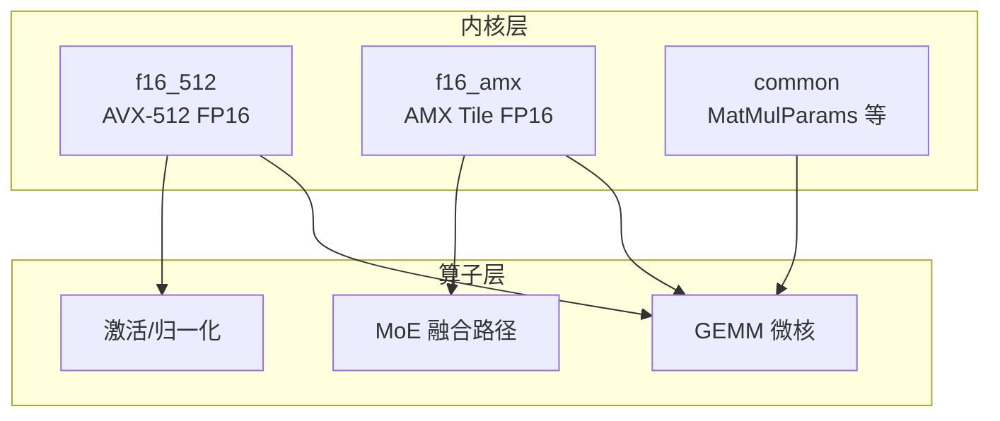
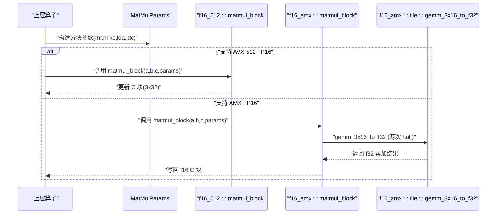
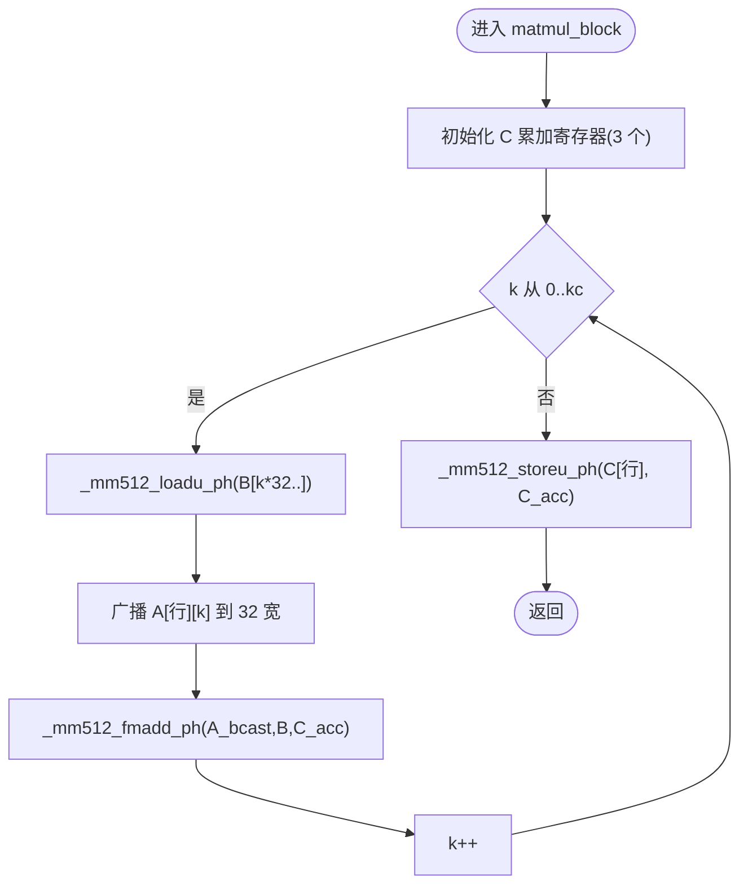
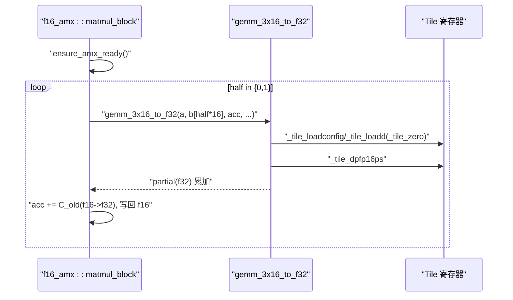
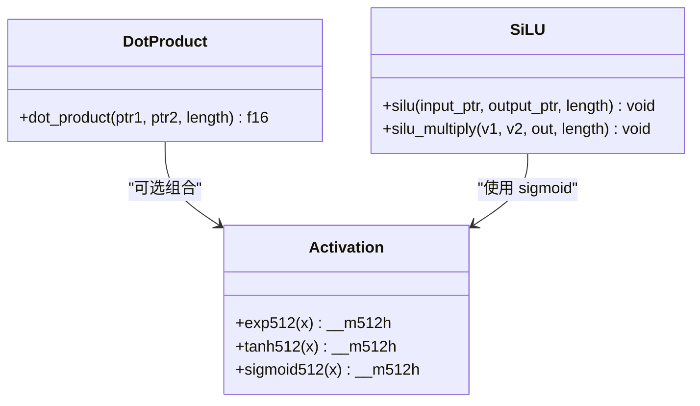
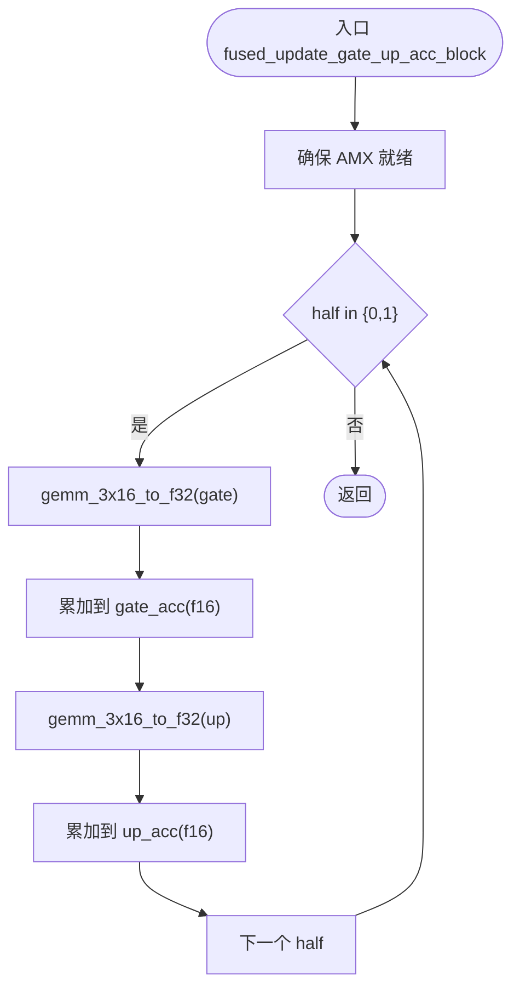
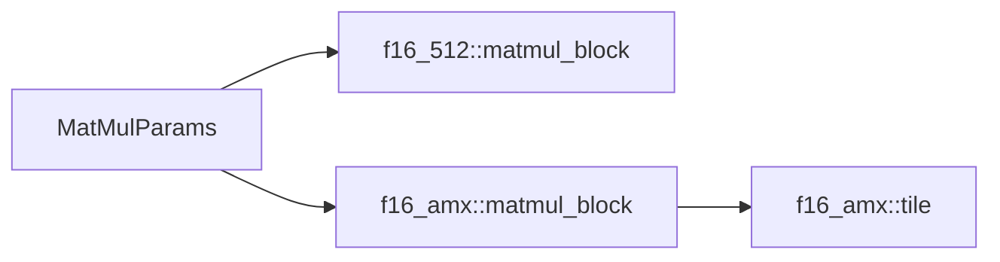

# SIMD 指令集优化

<cite>
**本文引用的文件**   
- [src/kernel/x86_64/f16_512/matmul_block.rs](file://src/kernel/x86_64/f16_512/matmul_block.rs)
- [src/kernel/x86_64/f16_amx/matmul_block.rs](file://src/kernel/x86_64/f16_amx/matmul_block.rs)
- [src/kernel/x86_64/f16_amx/tile.rs](file://src/kernel/x86_64/f16_amx/tile.rs)
- [src/kernel/x86_64/f16_512/dot_product.rs](file://src/kernel/x86_64/f16_512/dot_product.rs)
- [src/kernel/x86_64/f16_512/activation.rs](file://src/kernel/x86_64/f16_512/activation.rs)
- [src/kernel/x86_64/f16_512/silu.rs](file://src/kernel/x86_64/f16_512/silu.rs)
- [src/kernel/x86_64/f16_amx/fused_gate_up_silu_mul_block.rs](file://src/kernel/x86_64/f16_amx/fused_gate_up_silu_mul_block.rs)
- [src/kernel/x86_64/f16_amx/moe_silu.rs](file://src/kernel/x86_64/f16_amx/moe_silu.rs)
- [src/kernel/common/matmul_params.rs](file://src/kernel/common/matmul_params.rs)
</cite>

## 目录
1. [简介](#简介)
2. [项目结构](#项目结构)
3. [核心组件](#核心组件)
4. [架构总览](#架构总览)
5. [详细组件分析](#详细组件分析)
6. [依赖关系分析](#依赖关系分析)
7. [性能考量](#性能考量)
8. [故障排查指南](#故障排查指南)
9. [结论](#结论)
10. [附录](#附录)

## 简介
本技术文档聚焦于 x86_64 平台上的 SIMD 与矩阵加速优化，围绕以下目标展开：
- AVX-512 FP16 指令的使用与实现细节（如 _mm512_fmadd_ph、_mm512_loadu_ph、_mm512_storeu_ph 等）
- AMX（Advanced Matrix Extensions）FP16 的矩阵加速能力与数据布局要求
- f16/f32 在寄存器中的布局与转换策略
- 指令选择指南与性能权衡
- 编译器内联函数与运行时特性检测的最佳实践与调试技巧
- 内存对齐与缓存友好的数据布局设计

## 项目结构
本项目将不同硬件路径按“数据类型 + 指令集”组织：
- f16_512：基于 AVX-512 FP16 的内核（向量宽度 512，每次处理 32 个 f16）
- f16_amx：基于 AMX Tile 的 GEMM 内核（以 tile 为单位进行矩阵乘累加）
- common：通用参数结构与共享工具

图表来源
- [src/kernel/x86_64/f16_512/matmul_block.rs:1-236](file://src/kernel/x86_64/f16_512/matmul_block.rs#L1-L236)
- [src/kernel/x86_64/f16_amx/matmul_block.rs:1-172](file://src/kernel/x86_64/f16_amx/matmul_block.rs#L1-L172)
- [src/kernel/x86_64/f16_amx/tile.rs:1-168](file://src/kernel/x86_64/f16_amx/tile.rs#L1-L168)
- [src/kernel/common/matmul_params.rs:1-36](file://src/kernel/common/matmul_params.rs#L1-L36)

章节来源
- [src/kernel/x86_64/f16_512/matmul_block.rs:1-236](file://src/kernel/x86_64/f16_512/matmul_block.rs#L1-L236)
- [src/kernel/x86_64/f16_amx/matmul_block.rs:1-172](file://src/kernel/x86_64/f16_amx/matmul_block.rs#L1-L172)
- [src/kernel/x86_64/f16_amx/tile.rs:1-168](file://src/kernel/x86_64/f16_amx/tile.rs#L1-L168)
- [src/kernel/common/matmul_params.rs:1-36](file://src/kernel/common/matmul_params.rs#L1-L36)

## 核心组件
- MatMulParams：统一描述分块矩阵乘的参数（行步长、列步长、微核尺寸 mr/nr、宏观 K 步长 kc）。该结构被 AVX-512 与 AMX 两条路径复用。
- AVX-512 FP16 微核：以 3×32 为典型微核形状，使用 _mm512_fmadd_ph 做乘加，配合 _mm512_loadu_ph/_mm512_storeu_ph 完成访存。
- AMX FP16 内核：通过 tile 配置与 _tile_dpfp16ps 执行 3×16 的半片 GEMM，结果累加到 f32 累加器，再写回 f16。

章节来源
- [src/kernel/common/matmul_params.rs:1-36](file://src/kernel/common/matmul_params.rs#L1-L36)
- [src/kernel/x86_64/f16_512/matmul_block.rs:1-236](file://src/kernel/x86_64/f16_512/matmul_block.rs#L1-L236)
- [src/kernel/x86_64/f16_amx/matmul_block.rs:1-172](file://src/kernel/x86_64/f16_amx/matmul_block.rs#L1-L172)

## 架构总览
下图展示了从高层调用到具体内核的路径，以及两种实现（AVX-512 与 AMX）如何并行存在并在运行时选择。

图表来源
- [src/kernel/x86_64/f16_512/matmul_block.rs:1-236](file://src/kernel/x86_64/f16_512/matmul_block.rs#L1-L236)
- [src/kernel/x86_64/f16_amx/matmul_block.rs:1-172](file://src/kernel/x86_64/f16_amx/matmul_block.rs#L1-L172)
- [src/kernel/x86_64/f16_amx/tile.rs:1-168](file://src/kernel/x86_64/f16_amx/tile.rs#L1-L168)

## 详细组件分析

### AVX-512 FP16 微核：3×32 GEMM
- 输入约定
  - A_tile：3 × kc，行主序，行距 lda
  - B_panel：kc × 32，行主序打包（每行 32 连续）
  - C_tile：3 × 32，行主序，行距 ldc
- 关键指令与语义
  - _mm512_loadu_ph / _mm512_storeu_ph：非对齐加载/存储 32 个 f16
  - _mm512_set1_ph：广播标量到 32 个 f16
  - _mm512_fmadd_ph：FMA 乘加，形如 c = a*b + c
- 循环体要点
  - 对每个 k，将 A 的一列广播到 32 宽向量，与 B 的整行面板做 FMA 累加
  - 针对 mr=3 的特化分支减少分支开销
- 精度与数值稳定性
  - 累加在 f16 向量中进行；大 K 时误差累积需容忍度测试覆盖

图表来源
- [src/kernel/x86_64/f16_512/matmul_block.rs:1-236](file://src/kernel/x86_64/f16_512/matmul_block.rs#L1-L236)

章节来源
- [src/kernel/x86_64/f16_512/matmul_block.rs:1-236](file://src/kernel/x86_64/f16_512/matmul_block.rs#L1-L236)

### AMX FP16 内核：3×32 分两半 3×16
- 运行期准备
  - ensure_amx_ready：检查并请求 AMX 权限（Linux 下通过 arch_prctl）
- 计算流程
  - 将 3×32 拆成两个 3×16 半片，分别调用 gemm_3x16_to_f32
  - 内部使用 tile 配置 palette=1（FP16 dot product），加载 A/B 到 tile，执行 _tile_dpfp16ps，结果写入 partial（f32）
  - 将 f32 累加结果与原始 f16 C 相加后写回
- B 的布局适配
  - AMX 的 TDPFP16PS 消费 B 的 pair-interleaved 布局，代码中显式重排

图表来源
- [src/kernel/x86_64/f16_amx/matmul_block.rs:1-172](file://src/kernel/x86_64/f16_amx/matmul_block.rs#L1-L172)
- [src/kernel/x86_64/f16_amx/tile.rs:1-168](file://src/kernel/x86_64/f16_amx/tile.rs#L1-L168)

章节来源
- [src/kernel/x86_64/f16_amx/matmul_block.rs:1-172](file://src/kernel/x86_64/f16_amx/matmul_block.rs#L1-L172)
- [src/kernel/x86_64/f16_amx/tile.rs:1-168](file://src/kernel/x86_64/f16_amx/tile.rs#L1-L168)

### 点积与激活函数（AVX-512 FP16）
- 点积
  - 使用 _mm512_load_ph 与 _mm512_fmadd_ph 累加，最后 _mm512_reduce_add_ph 归约
- 激活
  - exp/tanh/sigmoid 均基于 Cephes 风格多项式近似与范围规约，利用 _mm512_fnmadd_ph 提升精度
  - silu 由 x * sigmoid(x) 构成，批量向量化

图表来源
- [src/kernel/x86_64/f16_512/dot_product.rs:1-59](file://src/kernel/x86_64/f16_512/dot_product.rs#L1-L59)
- [src/kernel/x86_64/f16_512/activation.rs:1-238](file://src/kernel/x86_64/f16_512/activation.rs#L1-L238)
- [src/kernel/x86_64/f16_512/silu.rs:1-148](file://src/kernel/x86_64/f16_512/silu.rs#L1-L148)

章节来源
- [src/kernel/x86_64/f16_512/dot_product.rs:1-59](file://src/kernel/x86_64/f16_512/dot_product.rs#L1-L59)
- [src/kernel/x86_64/f16_512/activation.rs:1-238](file://src/kernel/x86_64/f16_512/activation.rs#L1-L238)
- [src/kernel/x86_64/f16_512/silu.rs:1-148](file://src/kernel/x86_64/f16_512/silu.rs#L1-L148)

### MoE 融合路径（AMX + AVX-512）
- fused_gate_up_silu_mul_block：仅对 gate/up 的 GEMM 部分走 AMX，SiLU 与逐元素乘法仍用 AVX-512
- moe_silu_update_3x32：同样只对 GEMM 累加走 AMX，后续逐元素操作保持 AVX-512

图表来源
- [src/kernel/x86_64/f16_amx/fused_gate_up_silu_mul_block.rs:1-156](file://src/kernel/x86_64/f16_amx/fused_gate_up_silu_mul_block.rs#L1-L156)
- [src/kernel/x86_64/f16_amx/moe_silu.rs:1-127](file://src/kernel/x86_64/f16_amx/moe_silu.rs#L1-127)
- [src/kernel/x86_64/f16_amx/tile.rs:1-168](file://src/kernel/x86_64/f16_amx/tile.rs#L1-L168)

章节来源
- [src/kernel/x86_64/f16_amx/fused_gate_up_silu_mul_block.rs:1-156](file://src/kernel/x86_64/f16_amx/fused_gate_up_silu_mul_block.rs#L1-L156)
- [src/kernel/x86_64/f16_amx/moe_silu.rs:1-127](file://src/kernel/x86_64/f16_amx/moe_silu.rs#L1-127)

## 依赖关系分析
- MatMulParams 作为统一接口被两类内核共用，降低上层耦合
- AMX 内核依赖 tile 模块进行 tile 配置与指令封装
- AVX-512 内核直接依赖 std::arch::x86_64 的 intrinsics

图表来源
- [src/kernel/common/matmul_params.rs:1-36](file://src/kernel/common/matmul_params.rs#L1-L36)
- [src/kernel/x86_64/f16_512/matmul_block.rs:1-236](file://src/kernel/x86_64/f16_512/matmul_block.rs#L1-L236)
- [src/kernel/x86_64/f16_amx/matmul_block.rs:1-172](file://src/kernel/x86_64/f16_amx/matmul_block.rs#L1-L172)
- [src/kernel/x86_64/f16_amx/tile.rs:1-168](file://src/kernel/x86_64/f16_amx/tile.rs#L1-L168)

章节来源
- [src/kernel/common/matmul_params.rs:1-36](file://src/kernel/common/matmul_params.rs#L1-L36)
- [src/kernel/x86_64/f16_512/matmul_block.rs:1-236](file://src/kernel/x86_64/f16_512/matmul_block.rs#L1-L236)
- [src/kernel/x86_64/f16_amx/matmul_block.rs:1-172](file://src/kernel/x86_64/f16_amx/matmul_block.rs#L1-L172)
- [src/kernel/x86_64/f16_amx/tile.rs:1-168](file://src/kernel/x86_64/f16_amx/tile.rs#L1-L168)

## 性能考量
- 指令选择
  - 当 mr=3、nr=32 且 kc 较大时，AMX 通常具备更高吞吐；小 K 或尾块场景，AVX-512 更灵活
  - 对于逐元素激活/归一化，AVX-512 更高效
- 数据布局
  - B 面板采用行主序打包（NR 连续），利于 AVX-512 顺序访问；AMX 需要 pair-interleaved 布局，需额外重排
- 内存对齐
  - AVX-512 提供 _mm512_loadu_ph/_mm512_storeu_ph 支持非对齐访问；若保证 64B 对齐可使用对齐版本以提升带宽
  - AMX tile 配置要求 64B 对齐的 TileConfig
- 数值精度
  - AVX-512 路径在 f16 上累加，K 很大时需关注误差；AMX 路径在 f32 累加后再写回 f16，数值更稳定
- 分支与特化
  - 针对 mr<=3 的特化分支可减少控制流开销

[本节为通用指导，不直接分析具体文件]

## 故障排查指南
- 运行时特性检测
  - AVX-512 FP16：is_x86_feature_detected!("avx512fp16")
  - AMX：is_x86_feature_detected!("amx-tile") 与 is_x86_feature_detected!("amx-fp16")
- AMX 权限问题
  - Linux 下需通过 arch_prctl 请求 XTILEDATA 权限；未授权会触发断言失败
- 常见错误定位
  - 非法内存访问：确认指针与 stride 一致，避免越界
  - 精度不达标：增大测试容差或改用 f32 累加路径验证
  - 性能退化：检查是否误入标量回退路径或频繁跨页访问

章节来源
- [src/kernel/x86_64/f16_512/matmul_block.rs:87-155](file://src/kernel/x86_64/f16_512/matmul_block.rs#L87-L155)
- [src/kernel/x86_64/f16_amx/matmul_block.rs:53-126](file://src/kernel/x86_64/f16_amx/matmul_block.rs#L53-L126)
- [src/kernel/x86_64/f16_amx/tile.rs:59-101](file://src/kernel/x86_64/f16_amx/tile.rs#L59-L101)

## 结论
- AVX-512 FP16 适合逐元素与小规模 GEMM 的微优化；AMX 在大矩阵乘上具有显著优势
- 统一的 MatMulParams 抽象使多后端可插拔，便于在不同硬件间切换
- 正确的数据布局（尤其是 B 面板的 pack 与 AMX 的 pair-interleaved）是发挥性能的关键
- 建议结合运行时特性检测与单元测试，确保正确性与稳定性

[本节为总结性内容，不直接分析具体文件]

## 附录

### 数据类型与寄存器布局
- f16 在 512 位向量中占 32 个元素；AMX tile 以 16×16 为单位组织，pair-interleaved 布局用于 B 面板
- 转换策略
  - AVX-512：尽量在 f16 通道内运算，必要时转 f32 累加再写回
  - AMX：tile DP 输出 f32，最终写回 f16

[本节为概念性说明，不直接分析具体文件]

### 指令选择与最佳实践
- 优先使用 _mm512_fmadd_ph 做乘加，减少中间寄存器压力
- 使用 _mm512_set1_ph 广播常量，避免重复加载
- 对热点路径开启 target_feature 编译开关，避免运行时分支
- 使用 AlignedBox 等分配器保证 64B 对齐，提升访存效率

[本节为通用指导，不直接分析具体文件]