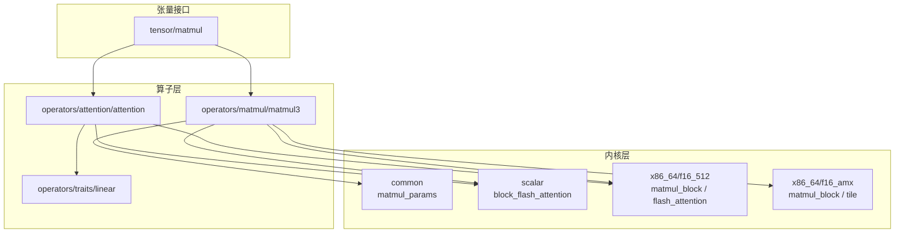
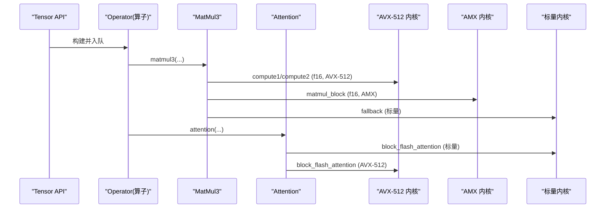
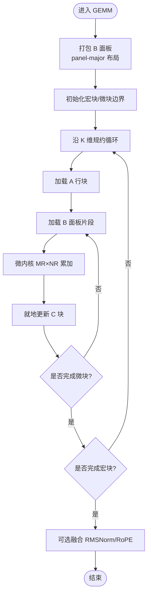
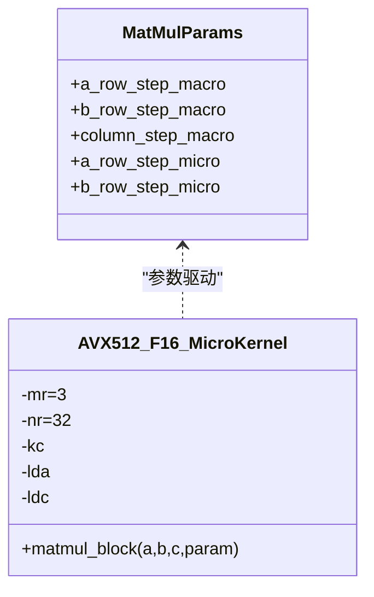
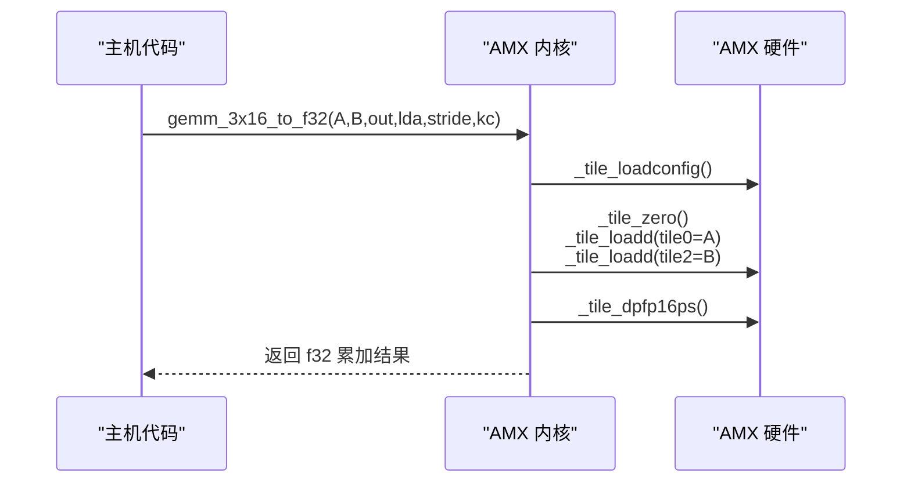
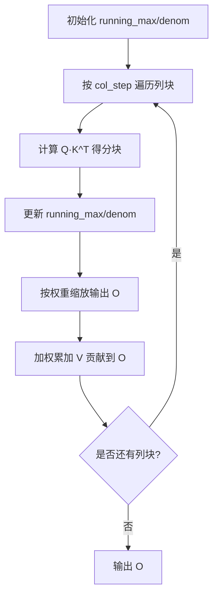
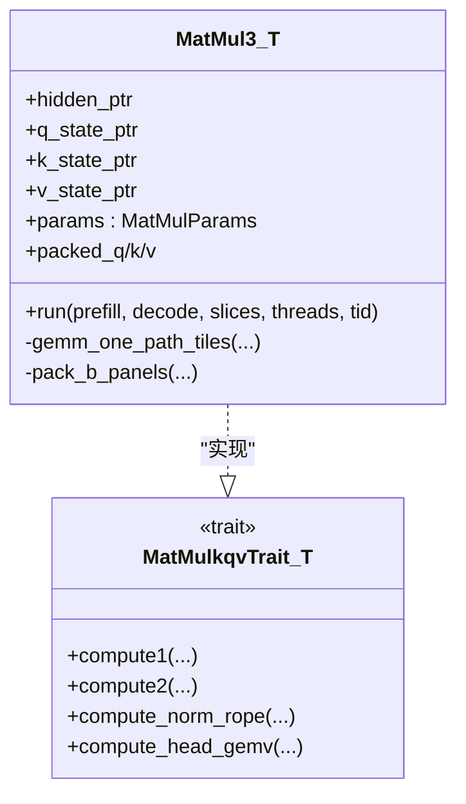
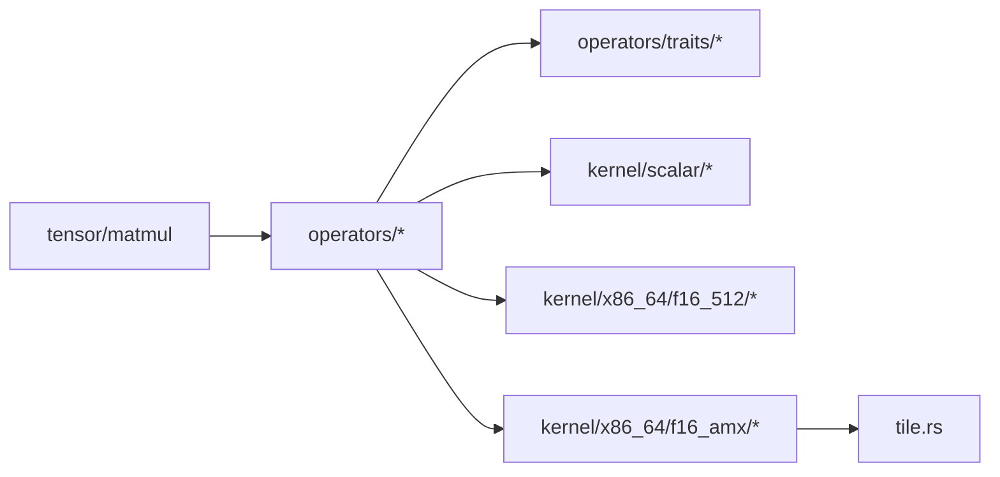

# 内核优化

<cite>
**本文引用的文件**   
- [src/kernel/mod.rs](file://src/kernel/mod.rs)
- [src/kernel/x86_64/mod.rs](file://src/kernel/x86_64/mod.rs)
- [src/kernel/scalar/mod.rs](file://src/kernel/scalar/mod.rs)
- [src/kernel/common/matmul_params.rs](file://src/kernel/common/matmul_params.rs)
- [src/operators/traits/linear.rs](file://src/operators/traits/linear.rs)
- [src/operators/matmul/matmul3.rs](file://src/operators/matmul/matmul3.rs)
- [src/tensor/matmul.rs](file://src/tensor/matmul.rs)
- [src/kernel/scalar/block_flash_attention.rs](file://src/kernel/scalar/block_flash_attention.rs)
- [src/kernel/x86_64/f16_512/matmul_block.rs](file://src/kernel/x86_64/f16_512/matmul_block.rs)
- [src/kernel/x86_64/f16_amx/matmul_block.rs](file://src/kernel/x86_64/f16_amx/matmul_block.rs)
- [src/kernel/x86_64/f16_amx/tile.rs](file://src/kernel/x86_64/f16_amx/tile.rs)
- [src/kernel/x86_64/f16_512/flash_attention.rs](file://src/kernel/x86_64/f16_512/flash_attention.rs)
- [src/operators/attention/attention.rs](file://src/operators/attention/attention.rs)
</cite>

## 目录
1. [简介](#简介)
2. [项目结构](#项目结构)
3. [核心组件](#核心组件)
4. [架构总览](#架构总览)
5. [详细组件分析](#详细组件分析)
6. [依赖关系分析](#依赖关系分析)
7. [性能考量](#性能考量)
8. [故障排查指南](#故障排查指南)
9. [结论](#结论)
10. [附录](#附录)

## 简介
本技术文档聚焦于底层内核优化，覆盖以下主题：
- SIMD 指令集优化：AVX-512（含 FP16）与 AMX（Tile + FP16）的使用方式与差异。
- 矩阵乘法内核的分块实现与缓存优化策略：宏块/微块划分、B 面板打包、行/列步长参数化。
- FlashAttention 内核的并行化与内存访问优化：分块注意力、在线归一化、预取与向量化路径。
- x86_64 平台特定优化：目标特性检测、AMX 权限请求、寄存器级操作。
- 数据类型优化：f16 与 f32 的不同实现路径与精度权衡。
- 内核性能分析与调试方法：基准测试、对齐与跟踪开关、断言与回退路径。
- 新平台移植指南与编译器优化选项：跨平台分支、目标特性启用建议。
- 内存对齐与缓存局部性技巧：面板布局、预取提示、行主/列主布局选择。
- 基准测试与性能对比分析方法：端到端算子调用链、分层计时与误差容忍度。

## 项目结构
本项目将“通用标量实现”、“x86_64 平台特化实现”和“上层算子接口”分层组织：
- kernel/common：通用参数与工具（如 MatMulParams）。
- kernel/scalar：纯标量参考实现（FlashAttention 分块、RMSNorm、Softmax 等）。
- kernel/x86_64：按数据类型与指令集划分的内核（f16_512、f16_amx、f32_256）。
- operators：面向模型的高层算子封装（MatMul、MatMul3、Attention 等），负责任务切分、线程调度与参数装配。
- tensor：张量 API 与 Operator 队列，统一入口。

图示来源
- [src/kernel/mod.rs:1-4](file://src/kernel/mod.rs#L1-L4)
- [src/kernel/x86_64/mod.rs:1-4](file://src/kernel/x86_64/mod.rs#L1-L4)
- [src/kernel/scalar/mod.rs:1-16](file://src/kernel/scalar/mod.rs#L1-L16)
- [src/kernel/common/matmul_params.rs:1-36](file://src/kernel/common/matmul_params.rs#L1-L36)
- [src/operators/matmul/matmul3.rs:1-120](file://src/operators/matmul/matmul3.rs#L1-L120)
- [src/operators/attention/attention.rs:1-120](file://src/operators/attention/attention.rs#L1-L120)
- [src/tensor/matmul.rs:1-120](file://src/tensor/matmul.rs#L1-L120)

章节来源
- [src/kernel/mod.rs:1-4](file://src/kernel/mod.rs#L1-L4)
- [src/kernel/x86_64/mod.rs:1-4](file://src/kernel/x86_64/mod.rs#L1-L4)
- [src/kernel/scalar/mod.rs:1-16](file://src/kernel/scalar/mod.rs#L1-L16)
- [src/kernel/common/matmul_params.rs:1-36](file://src/kernel/common/matmul_params.rs#L1-L36)

## 核心组件
- 矩阵乘参数结构 MatMulParams：以 mr/nr/kc/lda/ldc 五个维度描述宏块/微块与步长，贯穿所有 GEMM 变体。
- MatMul3：Q/K/V 三路投影，支持权重 B 面板打包、tile 遍历、可选 RMSNorm+RoPE 融合。
- Attention：分块注意力，支持序列拆分与头拆分两种并行策略，维护 running_max/denom 的在线归一化。
- AVX-512 F16 微核：3x32 广播式 FMADD 累加，C 为 f16 就地更新。
- AMX-FP16 微核：3x16 计算到 f32 累加器，再写回 f16；需要 Tile 配置与权限申请。
- FlashAttention（AVX-512）：分块内 dot-product 与向量缩放/加权累加，配合预取提升访存吞吐。

章节来源
- [src/kernel/common/matmul_params.rs:1-36](file://src/kernel/common/matmul_params.rs#L1-L36)
- [src/operators/matmul/matmul3.rs:64-120](file://src/operators/matmul/matmul3.rs#L64-L120)
- [src/operators/attention/attention.rs:11-120](file://src/operators/attention/attention.rs#L11-L120)
- [src/kernel/x86_64/f16_512/matmul_block.rs:1-85](file://src/kernel/x86_64/f16_512/matmul_block.rs#L1-L85)
- [src/kernel/x86_64/f16_amx/matmul_block.rs:1-51](file://src/kernel/x86_64/f16_amx/matmul_block.rs#L1-L51)
- [src/kernel/x86_64/f16_amx/tile.rs:1-101](file://src/kernel/x86_64/f16_amx/tile.rs#L1-L101)
- [src/kernel/x86_64/f16_512/flash_attention.rs:31-93](file://src/kernel/x86_64/f16_512/flash_attention.rs#L31-L93)

## 架构总览
从张量 API 到具体内核的调用链如下：

图示来源
- [src/tensor/matmul.rs:136-203](file://src/tensor/matmul.rs#L136-L203)
- [src/operators/matmul/matmul3.rs:525-621](file://src/operators/matmul/matmul3.rs#L525-L621)
- [src/operators/attention/attention.rs:439-505](file://src/operators/attention/attention.rs#L439-L505)
- [src/kernel/x86_64/f16_512/matmul_block.rs:22-85](file://src/kernel/x86_64/f16_512/matmul_block.rs#L22-L85)
- [src/kernel/x86_64/f16_amx/matmul_block.rs:18-51](file://src/kernel/x86_64/f16_amx/matmul_block.rs#L18-L51)
- [src/kernel/scalar/block_flash_attention.rs:5-95](file://src/kernel/scalar/block_flash_attention.rs#L5-L95)
- [src/kernel/x86_64/f16_512/flash_attention.rs:142-210](file://src/kernel/x86_64/f16_512/flash_attention.rs#L142-L210)

## 详细组件分析

### 矩阵乘法内核（GEMM）分块与缓存优化
- 分块策略
  - 宏块：输入 A 的行块、输出 C 的列块、规约 K 的列块。
  - 微块：MR×NR 的微内核形状（例如 3×32）。
  - 参数化：通过 MatMulParams 传入 mr/nr/kc/lda/ldc，便于在不同硬件上切换。
- B 面板打包
  - 将原始 NT 权重的 K×N 重排为 panel-major 布局，使微内核能顺序读取连续数据，显著提升 L1/L2 命中率。
- 遍历顺序
  - 外层按宏块 tile 迭代，内层按 micro-kernel 展开，减少循环开销与寄存器压力。
- 就地更新与融合
  - C 就地累加，避免额外分配；在 Q/K/V 路径中，最后一步可融合 RMSNorm+RoPE，降低中间写入。

图示来源
- [src/operators/matmul/matmul3.rs:217-256](file://src/operators/matmul/matmul3.rs#L217-L256)
- [src/operators/matmul/matmul3.rs:281-391](file://src/operators/matmul/matmul3.rs#L281-L391)
- [src/kernel/common/matmul_params.rs:1-36](file://src/kernel/common/matmul_params.rs#L1-L36)

章节来源
- [src/operators/matmul/matmul3.rs:217-256](file://src/operators/matmul/matmul3.rs#L217-L256)
- [src/operators/matmul/matmul3.rs:281-391](file://src/operators/matmul/matmul3.rs#L281-L391)
- [src/kernel/common/matmul_params.rs:1-36](file://src/kernel/common/matmul_params.rs#L1-L36)

### AVX-512 F16 微内核（3x32）
- 设计要点
  - 使用 _mm512_fmadd_ph 进行广播式累加，A 的每行元素广播到 512bit 向量，与 B 的 32 列向量做乘加。
  - C 为 3×32 的 f16 块，就地更新，减少内存带宽压力。
- 适用场景
  - 对 head_dim 为 32 倍数的路径尤为高效；若不支持 avx512fp16，自动回退到标量路径。

图示来源
- [src/kernel/x86_64/f16_512/matmul_block.rs:22-85](file://src/kernel/x86_64/f16_512/matmul_block.rs#L22-L85)
- [src/kernel/common/matmul_params.rs:1-36](file://src/kernel/common/matmul_params.rs#L1-L36)

章节来源
- [src/kernel/x86_64/f16_512/matmul_block.rs:1-85](file://src/kernel/x86_64/f16_512/matmul_block.rs#L1-L85)

### AMX-FP16 微内核（3x16）
- 设计要点
  - 使用 AMX Tile 指令集，将 A 载入 tile0，B 按 pair-interleaved 布局载入 tile2，执行 DPFP16PS 累加到 tile0（f32 累加器）。
  - 由于 AMX 一次处理 16 列，需将 32 列拆成两个 16 列半块分别计算，再合并回 f16 结果。
- 平台要求
  - 需要 amx-tile 与 amx-fp16 特性；Linux 下需申请 XTILEDATA 权限。

图示来源
- [src/kernel/x86_64/f16_amx/tile.rs:104-167](file://src/kernel/x86_64/f16_amx/tile.rs#L104-L167)
- [src/kernel/x86_64/f16_amx/matmul_block.rs:18-51](file://src/kernel/x86_64/f16_amx/matmul_block.rs#L18-L51)

章节来源
- [src/kernel/x86_64/f16_amx/tile.rs:1-101](file://src/kernel/x86_64/f16_amx/tile.rs#L1-L101)
- [src/kernel/x86_64/f16_amx/matmul_block.rs:1-51](file://src/kernel/x86_64/f16_amx/matmul_block.rs#L1-L51)

### FlashAttention 内核（分块与并行）
- 分块算法
  - 逐列块扫描，维护 running_max 与 running_denom，实现数值稳定的在线 softmax。
  - 支持 row_step 与 col_step 控制块大小，兼顾并行粒度与缓存命中。
- 并行策略
  - 序列拆分：当行块数小于线程数时，按行范围切分。
  - 头拆分：当行块数较多时，按 KV 头分组，多波次并行。
- 内存访问优化
  - 预取 K/V 下一块数据，减少访存延迟。
  - 针对 AVX-512 路径，使用 512bit 向量批量缩放与加权累加。

图示来源
- [src/kernel/scalar/block_flash_attention.rs:5-95](file://src/kernel/scalar/block_flash_attention.rs#L5-L95)
- [src/kernel/x86_64/f16_512/flash_attention.rs:142-210](file://src/kernel/x86_64/f16_512/flash_attention.rs#L142-L210)
- [src/operators/attention/attention.rs:157-215](file://src/operators/attention/attention.rs#L157-L215)

章节来源
- [src/kernel/scalar/block_flash_attention.rs:1-95](file://src/kernel/scalar/block_flash_attention.rs#L1-L95)
- [src/kernel/x86_64/f16_512/flash_attention.rs:1-93](file://src/kernel/x86_64/f16_512/flash_attention.rs#L1-L93)
- [src/operators/attention/attention.rs:157-215](file://src/operators/attention/attention.rs#L157-L215)

### MatMul3（Q/K/V 三路投影）
- 功能概述
  - 一次性完成 Q/K/V 三个投影，支持 GQA（KV 头复用）、可选 RMSNorm+RoPE 融合。
  - 内部将权重 B 预先打包为 panel-major，加速微内核访存。
- 任务分配
  - 根据行映射与头信息生成任务，按线程均匀分配 tile 或 head 任务。
- 特化路径
  - 在 x86_64 且启用 avx512fp16 时，调用 AVX-512 微内核；否则回退到标量实现。

图示来源
- [src/operators/matmul/matmul3.rs:64-120](file://src/operators/matmul/matmul3.rs#L64-L120)
- [src/operators/traits/linear.rs:61-95](file://src/operators/traits/linear.rs#L61-L95)
- [src/operators/matmul/matmul3.rs:704-757](file://src/operators/matmul/matmul3.rs#L704-L757)

章节来源
- [src/operators/matmul/matmul3.rs:525-621](file://src/operators/matmul/matmul3.rs#L525-L621)
- [src/operators/traits/linear.rs:61-95](file://src/operators/traits/linear.rs#L61-L95)

## 依赖关系分析
- 模块耦合
  - tensor/matmul 作为统一入口，创建 Operator 并交由运行时执行。
  - operators/matmul3 与 operators/attention 依赖 traits 定义的计算接口。
  - x86_64 内核通过条件编译与运行时特性检测选择最优路径。
- 外部依赖
  - 仅依赖标准库与 x86_64 内置 intrinsics；AMX 路径依赖 Linux 系统调用获取权限。

图示来源
- [src/tensor/matmul.rs:136-203](file://src/tensor/matmul.rs#L136-L203)
- [src/operators/traits/linear.rs:1-96](file://src/operators/traits/linear.rs#L1-L96)
- [src/kernel/x86_64/f16_amx/tile.rs:1-101](file://src/kernel/x86_64/f16_amx/tile.rs#L1-L101)

章节来源
- [src/tensor/matmul.rs:136-203](file://src/tensor/matmul.rs#L136-L203)
- [src/operators/traits/linear.rs:1-96](file://src/operators/traits/linear.rs#L1-L96)

## 性能考量
- 分块尺寸选择
  - MR×NR 应匹配寄存器宽度与缓存行大小；3×32 在 AVX-512 上表现良好，AMX 采用 3×16 以适配 Tile 规格。
- 内存布局
  - B 面板采用 panel-major 布局，确保微内核顺序访问；A 保持行主以便广播。
- 预取与向量化
  - FlashAttention 中使用 _mm_prefetch 提前加载 K/V，结合 512bit 向量批量运算降低访存瓶颈。
- 并行粒度
  - 根据行块数与线程数动态选择序列拆分或头拆分，避免负载不均。
- 精度与速度权衡
  - AMX 累加到 f32 再写回 f16，提高数值稳定性；AVX-512 F16 直接 f16 累加，速度更快但需注意溢出风险。

[本节为通用指导，不直接分析具体文件]

## 故障排查指南
- 特性检测失败
  - 检查目标特性是否可用（avx512fp16、amx-tile、amx-fp16），必要时回退到标量路径。
- AMX 权限问题
  - Linux 下需成功申请 XTILEDATA 权限；ensure_amx_ready 会断言失败提示权限不足。
- 对齐与越界
  - 关注 micro_tile 与 head_dim 的对齐断言；确保 panel 索引计算正确。
- 精度偏差
  - 比较 f16 与 f32 路径的差异，适当放宽误差容忍度；检查 exp/sqrt 近似实现。
- 调试开关
  - 设置环境变量 ELLM_ALIGN_TRACE 打印对齐与构建信息，辅助定位布局问题。

章节来源
- [src/kernel/x86_64/f16_amx/tile.rs:94-101](file://src/kernel/x86_64/f16_amx/tile.rs#L94-L101)
- [src/operators/matmul/matmul3.rs:303-308](file://src/operators/matmul/matmul3.rs#L303-L308)
- [src/tensor/matmul.rs:213-231](file://src/tensor/matmul.rs#L213-L231)

## 结论
本项目通过分层设计与平台特化，实现了高效的矩阵乘法与注意力内核。AVX-512 与 AMX 两条路径互补，前者强调高吞吐，后者强调高算力密度；分块与面板打包策略显著改善缓存局部性；在线归一化的 FlashAttention 实现保证了数值稳定与可扩展并行。建议在部署前进行特性检测与基准验证，并根据硬件能力选择合适的内核与分块参数。

[本节为总结，不直接分析具体文件]

## 附录

### 数据类型优化：f16 与 f32 路径
- f16 路径
  - AVX-512 F16：直接使用 _mm512_fmadd_ph，适合大规模矩阵乘与注意力。
  - AMX-FP16：Tile 计算到 f32 累加器，再写回 f16，平衡精度与性能。
- f32 路径
  - 用于需要更高精度的场景或作为回退路径；注意带宽与功耗成本。

章节来源
- [src/kernel/x86_64/f16_512/matmul_block.rs:22-85](file://src/kernel/x86_64/f16_512/matmul_block.rs#L22-L85)
- [src/kernel/x86_64/f16_amx/matmul_block.rs:18-51](file://src/kernel/x86_64/f16_amx/matmul_block.rs#L18-L51)

### 平台特定优化：x86_64
- 目标特性检测
  - 使用 target_feature 与 is_x86_feature_detected 进行运行时分支。
- AMX 权限申请
  - Linux 下通过 arch_prctl 获取 XTILEDATA 权限；非 Linux 默认放行。
- 预取与对齐
  - 使用 _mm_prefetch 与对齐分配器（AlignedBox）减少缺页与未对齐访问。

章节来源
- [src/kernel/x86_64/f16_amx/tile.rs:59-101](file://src/kernel/x86_64/f16_amx/tile.rs#L59-L101)
- [src/kernel/x86_64/f16_512/flash_attention.rs:41-68](file://src/kernel/x86_64/f16_512/flash_attention.rs#L41-L68)

### 内存对齐与缓存局部性
- 面板布局
  - B 面板按 reduction_panel × output_panel 组织，保证微内核顺序访问。
- 行主/列主选择
  - A 行主便于广播；B 面板行主便于连续加载；C 行主便于就地更新。
- 预取策略
  - 在注意力循环中提前预取下一块 K/V，隐藏访存延迟。

章节来源
- [src/operators/matmul/matmul3.rs:217-256](file://src/operators/matmul/matmul3.rs#L217-L256)
- [src/kernel/x86_64/f16_512/flash_attention.rs:41-68](file://src/kernel/x86_64/f16_512/flash_attention.rs#L41-L68)

### 基准测试与性能对比分析方法
- 端到端调用
  - 通过 tensor/matmul 的 matmul3 与 attention 接口触发不同内核路径。
- 分层计时
  - 在 run 入口与微内核前后插入计时点，统计各阶段耗时。
- 误差容忍度
  - 使用相对误差阈值评估 f16 与 f32 路径一致性。
- 环境开关
  - 使用 ELLM_ALIGN_TRACE 打印构建与对齐信息，辅助定位布局问题。

章节来源
- [src/tensor/matmul.rs:136-203](file://src/tensor/matmul.rs#L136-L203)
- [src/tensor/matmul.rs:213-231](file://src/tensor/matmul.rs#L213-L231)