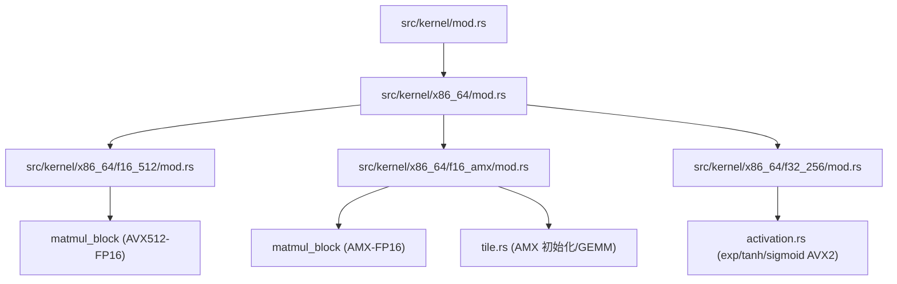
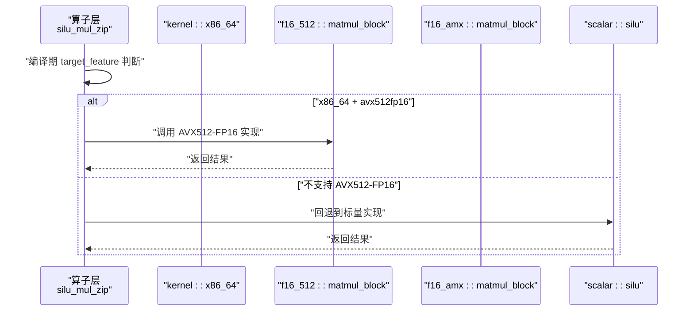
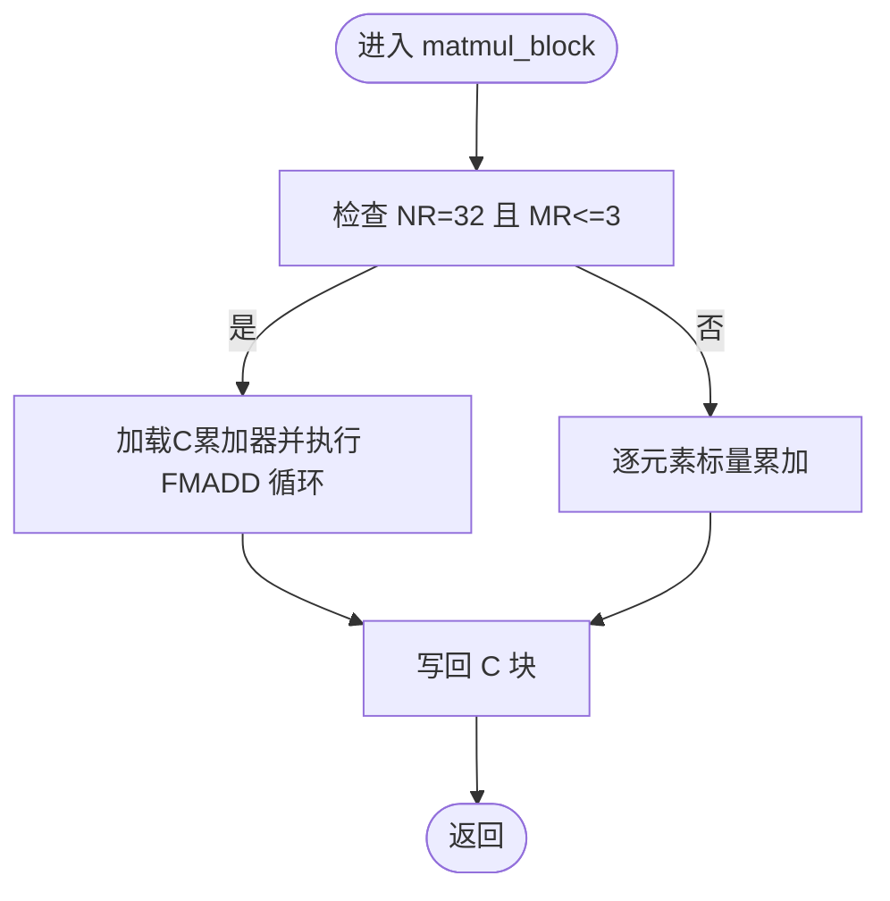
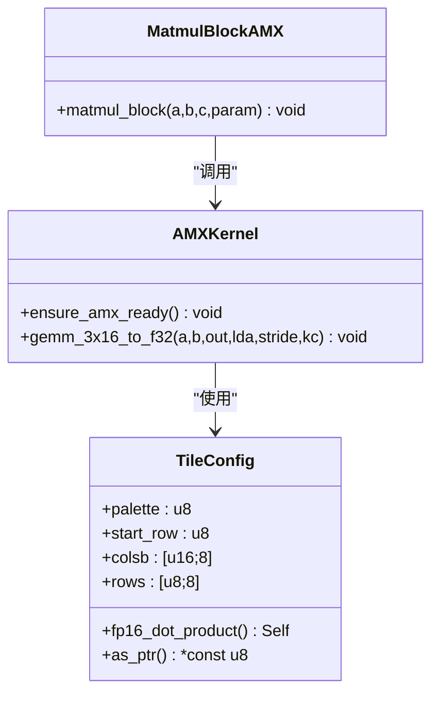
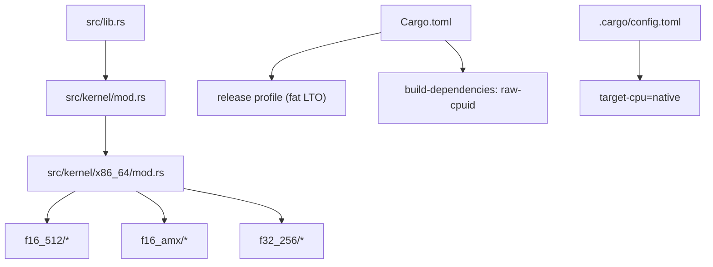

# 平台特定优化

<cite>
**本文引用的文件**   
- [src/lib.rs](file://src/lib.rs)
- [src/kernel/mod.rs](file://src/kernel/mod.rs)
- [src/kernel/x86_64/mod.rs](file://src/kernel/x86_64/mod.rs)
- [src/kernel/x86_64/f16_512/mod.rs](file://src/kernel/x86_64/f16_512/mod.rs)
- [src/kernel/x86_64/f16_amx/mod.rs](file://src/kernel/x86_64/f16_amx/mod.rs)
- [src/kernel/x86_64/f32_256/mod.rs](file://src/kernel/x86_64/f32_256/mod.rs)
- [src/kernel/x86_64/f16_512/matmul_block.rs](file://src/kernel/x86_64/f16_512/matmul_block.rs)
- [src/kernel/x86_64/f16_amx/matmul_block.rs](file://src/kernel/x86_64/f16_amx/matmul_block.rs)
- [src/kernel/x86_64/f16_amx/tile.rs](file://src/kernel/x86_64/f16_amx/tile.rs)
- [src/kernel/x86_64/f32_256/activation.rs](file://src/kernel/x86_64/f32_256/activation.rs)
- [src/kernel/common/matmul_params.rs](file://src/kernel/common/matmul_params.rs)
- [src/operators/elementwise/silu_mul_zip.rs](file://src/operators/elementwise/silu_mul_zip.rs)
- [Cargo.toml](file://Cargo.toml)
- [.cargo/config.toml](file://.cargo/config.toml)
- [src/runtime/init.rs](file://src/runtime/init.rs)
- [src/tensor/tests/performance.rs](file://src/tensor/tests/performance.rs)
</cite>

## 目录
1. [简介](#简介)
2. [项目结构](#项目结构)
3. [核心组件](#核心组件)
4. [架构总览](#架构总览)
5. [详细组件分析](#详细组件分析)
6. [依赖关系分析](#依赖关系分析)
7. [性能考量](#性能考量)
8. [故障排查指南](#故障排查指南)
9. [结论](#结论)
10. [附录](#附录)

## 简介
本技术文档聚焦于 x86_64 平台的特定优化与特性检测机制，覆盖以下主题：
- 子架构 f16_512、f16_amx、f32_256 的选择策略与编译时配置
- 运行时特性检测与动态分发机制
- 新平台移植的完整指南（指令集支持检查与兼容性处理）
- 跨平台抽象层的设计与实现
- 性能基准测试与回归测试方法
- 编译器优化选项与链接时优化（LTO）技术

## 项目结构
本项目在 kernel 层按目标架构组织优化内核。x86_64 下提供三种子架构实现：
- f16_512：基于 AVX-512 FP16 的算子内核
- f16_amx：基于 AMX-TILE/FP16 的 GEMM 内核
- f32_256：基于 AVX2 的标量/向量内核（以 f32 为主）

图表来源
- [src/kernel/mod.rs:1-4](file://src/kernel/mod.rs#L1-L4)
- [src/kernel/x86_64/mod.rs:1-4](file://src/kernel/x86_64/mod.rs#L1-L4)
- [src/kernel/x86_64/f16_512/mod.rs:1-17](file://src/kernel/x86_64/f16_512/mod.rs#L1-L17)
- [src/kernel/x86_64/f16_amx/mod.rs:1-6](file://src/kernel/x86_64/f16_amx/mod.rs#L1-L6)
- [src/kernel/x86_64/f32_256/mod.rs:1-5](file://src/kernel/x86_64/f32_256/mod.rs#L1-L5)

章节来源
- [src/kernel/mod.rs:1-4](file://src/kernel/mod.rs#L1-L4)
- [src/kernel/x86_64/mod.rs:1-4](file://src/kernel/x86_64/mod.rs#L1-L4)
- [src/kernel/x86_64/f16_512/mod.rs:1-17](file://src/kernel/x86_64/f16_512/mod.rs#L1-L17)
- [src/kernel/x86_64/f16_amx/mod.rs:1-6](file://src/kernel/x86_64/f16_amx/mod.rs#L1-L6)
- [src/kernel/x86_64/f32_256/mod.rs:1-5](file://src/kernel/x86_64/f32_256/mod.rs#L1-L5)

## 核心组件
- 通用矩阵乘参数结构 MatMulParams：统一描述微核/宏核步长与 K 维块大小，供不同后端复用。
- f16_512 后端：使用 AVX-512 FP16 内建函数实现高性能 3x32 微核等算子。
- f16_amx 后端：利用 AMX-TILE/FP16 进行 GEMM 计算，包含线程级权限请求与 tile 配置。
- f32_256 后端：提供 exp/tanh/sigmoid 等激活函数的 AVX2 实现。
- 算子层分发：通过编译期 target_feature 选择最优路径，并在必要时回退到标量实现。

章节来源
- [src/kernel/common/matmul_params.rs:1-36](file://src/kernel/common/matmul_params.rs#L1-L36)
- [src/kernel/x86_64/f16_512/matmul_block.rs:1-200](file://src/kernel/x86_64/f16_512/matmul_block.rs#L1-L200)
- [src/kernel/x86_64/f16_amx/matmul_block.rs:1-172](file://src/kernel/x86_64/f16_amx/matmul_block.rs#L1-L172)
- [src/kernel/x86_64/f16_amx/tile.rs:1-168](file://src/kernel/x86_64/f16_amx/tile.rs#L1-L168)
- [src/kernel/x86_64/f32_256/activation.rs:1-64](file://src/kernel/x86_64/f32_256/activation.rs#L1-L64)
- [src/operators/elementwise/silu_mul_zip.rs:128-164](file://src/operators/elementwise/silu_mul_zip.rs#L128-L164)

## 架构总览
下图展示了从算子调用到具体内核实现的典型流程，以及运行时的特性检测与分发点。

图表来源
- [src/operators/elementwise/silu_mul_zip.rs:128-164](file://src/operators/elementwise/silu_mul_zip.rs#L128-L164)
- [src/kernel/x86_64/f16_512/matmul_block.rs:1-200](file://src/kernel/x86_64/f16_512/matmul_block.rs#L1-L200)
- [src/kernel/x86_64/f16_amx/matmul_block.rs:1-172](file://src/kernel/x86_64/f16_amx/matmul_block.rs#L1-L172)

## 详细组件分析

### 组件一：f16_512 后端（AVX-512 FP16）
- 设计要点
  - 采用 3x32 微核，充分利用 AVX-512 宽寄存器与 FP16 融合乘加指令。
  - 通过 MatMulParams 传入 mr/nr/kc/lda/ldc，便于上层分块调度。
  - 测试中使用 is_x86_feature_detected!("avx512fp16") 做运行时保护。
- 关键实现位置
  - 微核入口与循环展开：[src/kernel/x86_64/f16_512/matmul_block.rs:1-200](file://src/kernel/x86_64/f16_512/matmul_block.rs#L1-L200)
  - 其他算子模块声明：[src/kernel/x86_64/f16_512/mod.rs:1-17](file://src/kernel/x86_64/f16_512/mod.rs#L1-L17)

图表来源
- [src/kernel/x86_64/f16_512/matmul_block.rs:1-200](file://src/kernel/x86_64/f16_512/matmul_block.rs#L1-L200)

章节来源
- [src/kernel/x86_64/f16_512/matmul_block.rs:1-200](file://src/kernel/x86_64/f16_512/matmul_block.rs#L1-L200)
- [src/kernel/x86_64/f16_512/mod.rs:1-17](file://src/kernel/x86_64/f16_512/mod.rs#L1-L17)

### 组件二：f16_amx 后端（AMX-TILE/FP16）
- 设计要点
  - 将 3x32 输出拆分为两个 3x16 半块，分别用 AMX 计算后与原有 f16 C 值相加。
  - 需要确保线程拥有 AMX 数据区权限（Linux 下通过 arch_prctl 请求）。
  - 使用 _tile_loadconfig/_tile_loadd/_tile_dpfp16ps/_tile_stored 完成 GEMM。
- 关键实现位置
  - AMX GEMM 封装：[src/kernel/x86_64/f16_amx/matmul_block.rs:1-172](file://src/kernel/x86_64/f16_amx/matmul_block.rs#L1-L172)
  - Tile 配置与权限管理：[src/kernel/x86_64/f16_amx/tile.rs:1-168](file://src/kernel/x86_64/f16_amx/tile.rs#L1-L168)

图表来源
- [src/kernel/x86_64/f16_amx/tile.rs:1-168](file://src/kernel/x86_64/f16_amx/tile.rs#L1-L168)
- [src/kernel/x86_64/f16_amx/matmul_block.rs:1-172](file://src/kernel/x86_64/f16_amx/matmul_block.rs#L1-L172)

章节来源
- [src/kernel/x86_64/f16_amx/matmul_block.rs:1-172](file://src/kernel/x86_64/f16_amx/matmul_block.rs#L1-L172)
- [src/kernel/x86_64/f16_amx/tile.rs:1-168](file://src/kernel/x86_64/f16_amx/tile.rs#L1-L168)

### 组件三：f32_256 后端（AVX2）
- 设计要点
  - 提供 exp/tanh/sigmoid 等激活函数的 AVX2 实现，适合 f32 路径或作为回退路径。
- 关键实现位置
  - 激活函数实现：[src/kernel/x86_64/f32_256/activation.rs:1-64](file://src/kernel/x86_64/f32_256/activation.rs#L1-L64)
  - 模块声明：[src/kernel/x86_64/f32_256/mod.rs:1-5](file://src/kernel/x86_64/f32_256/mod.rs#L1-L5)

章节来源
- [src/kernel/x86_64/f32_256/activation.rs:1-64](file://src/kernel/x86_64/f32_256/activation.rs#L1-L64)
- [src/kernel/x86_64/f32_256/mod.rs:1-5](file://src/kernel/x86_64/f32_256/mod.rs#L1-L5)

### 组件四：运行时初始化与全局资源
- 设计要点
  - 运行时加载模型权重并初始化内存池；创建调度器、会话管理器与执行器池。
  - 设置模型线程数，启动工作线程池，准备推理流水线。
- 关键实现位置
  - 运行时初始化：[src/runtime/init.rs:1-136](file://src/runtime/init.rs#L1-L136)

章节来源
- [src/runtime/init.rs:1-136](file://src/runtime/init.rs#L1-L136)

## 依赖关系分析
- 编译期特性开关
  - 库启用不稳定特性（如 f16、stdarch_x86_avx512_f16、x86_amx_intrinsics），用于访问底层 SIMD/AMX 能力。
  - 构建默认开启 target-cpu=native，最大化本机优化。
  - release profile 启用 fat LTO、单 codegen unit，提升跨单元优化效果。
- 外部依赖
  - build-dependencies 引入 raw-cpuid，可用于 CPUID 查询（当前代码未直接使用，但为未来特性探测预留）。

图表来源
- [src/lib.rs:1-16](file://src/lib.rs#L1-L16)
- [src/kernel/mod.rs:1-4](file://src/kernel/mod.rs#L1-L4)
- [src/kernel/x86_64/mod.rs:1-4](file://src/kernel/x86_64/mod.rs#L1-L4)
- [Cargo.toml:69-81](file://Cargo.toml#L69-L81)
- [Cargo.toml:82-84](file://Cargo.toml#L82-L84)
- [.cargo/config.toml:1-3](file://.cargo/config.toml#L1-L3)

章节来源
- [src/lib.rs:1-16](file://src/lib.rs#L1-L16)
- [Cargo.toml:69-81](file://Cargo.toml#L69-L81)
- [Cargo.toml:82-84](file://Cargo.toml#L82-L84)
- [.cargo/config.toml:1-3](file://.cargo/config.toml#L1-L3)

## 性能考量
- 微核形状与缓存友好性
  - f16_512 的 3x32 微核匹配常见 head_size 与批维度，减少访存碎片化。
  - f16_amx 将 N 维切分为 16 列半块，适配 AMX tile 宽度，提高吞吐。
- 并行度与线程配置
  - 运行时根据生成配置决定 API 线程数，并通过执行器池调度算子队列。
- 数值精度与回退
  - AMX 累加至 f32 再写回 f16，兼顾精度与速度；当硬件不支持时回退到标量实现。
- 构建优化
  - fat LTO 与单 codegen unit 有利于跨模块内联与常量折叠，减小二进制体积并提升性能。

章节来源
- [src/kernel/x86_64/f16_512/matmul_block.rs:1-200](file://src/kernel/x86_64/f16_512/matmul_block.rs#L1-L200)
- [src/kernel/x86_64/f16_amx/matmul_block.rs:1-172](file://src/kernel/x86_64/f16_amx/matmul_block.rs#L1-L172)
- [src/runtime/init.rs:1-136](file://src/runtime/init.rs#L1-L136)
- [Cargo.toml:69-81](file://Cargo.toml#L69-L81)

## 故障排查指南
- AMX 权限不足
  - 现象：调用 AMX 内核时报错提示“AMX tile data permission is not available for this thread”。
  - 原因：Linux 下线程未获得 XTILEDATA 权限。
  - 解决：确保 ensure_amx_ready() 被调用，且在 Linux 上允许 arch_prctl 请求。
  - 参考实现：[src/kernel/x86_64/f16_amx/tile.rs:59-101](file://src/kernel/x86_64/f16_amx/tile.rs#L59-L101)
- 特性缺失导致跳过测试
  - 现象：测试打印“Skipping ... test on unsupported hardware”或直接跳过。
  - 原因：is_x86_feature_detected! 返回 false。
  - 解决：在支持相应指令集的机器上运行，或禁用该测试分支。
  - 参考示例：
    - [src/kernel/x86_64/f16_512/matmul_block.rs:93-97](file://src/kernel/x86_64/f16_512/matmul_block.rs#L93-L97)
    - [src/kernel/x86_64/f16_amx/matmul_block.rs:72-76](file://src/kernel/x86_64/f16_amx/matmul_block.rs#L72-L76)
- 回退路径验证
  - 现象：在无 AVX512-FP16 环境下仍可通过标量路径得到正确结果。
  - 参考：[src/operators/elementwise/silu_mul_zip.rs:128-164](file://src/operators/elementwise/silu_mul_zip.rs#L128-L164)

章节来源
- [src/kernel/x86_64/f16_amx/tile.rs:59-101](file://src/kernel/x86_64/f16_amx/tile.rs#L59-L101)
- [src/kernel/x86_64/f16_512/matmul_block.rs:93-97](file://src/kernel/x86_64/f16_512/matmul_block.rs#L93-L97)
- [src/kernel/x86_64/f16_amx/matmul_block.rs:72-76](file://src/kernel/x86_64/f16_amx/matmul_block.rs#L72-L76)
- [src/operators/elementwise/silu_mul_zip.rs:128-164](file://src/operators/elementwise/silu_mul_zip.rs#L128-L164)

## 结论
本项目在 x86_64 平台上提供了多后端优化：
- f16_512 针对 AVX-512 FP16 的微核实现，适合高吞吐场景
- f16_amx 借助 AMX 加速 GEMM，具备更高带宽利用率
- f32_256 提供稳定的 AVX2 路径与回退保障
结合编译期特性选择与运行时特性检测，系统能在不同硬件上自动选择最优路径，同时保证可移植性与稳定性。

## 附录

### 子架构选择策略与编译时配置
- 选择策略
  - 优先尝试 f16_amx（若硬件支持 amx-tile/amx-fp16 且线程已授权）
  - 其次选择 f16_512（若支持 avx512fp16）
  - 最后回退到 scalar 或 f32_256 路径
- 编译时配置
  - 启用 unstable features：f16、stdarch_x86_avx512_f16、x86_amx_intrinsics
  - 构建标志：target-cpu=native
  - Release 配置：opt-level=3、lto=fat、codegen-units=1、panic=abort、strip=symbols

章节来源
- [src/lib.rs:1-16](file://src/lib.rs#L1-L16)
- [.cargo/config.toml:1-3](file://.cargo/config.toml#L1-L3)
- [Cargo.toml:69-81](file://Cargo.toml#L69-L81)

### 运行时特性检测与动态分发机制
- 检测方式
  - 使用 is_x86_feature_detected! 在运行期判断 avx512fp16、amx-tile、amx-fp16 等
  - AMX 线程权限通过 ensure_amx_ready() 校验
- 分发方式
  - 算子层通过 #[cfg(all(target_arch = "x86_64", target_feature = "avx512fp16"))] 编译期分支选择最快路径
  - 不支持时回退到标量实现

章节来源
- [src/operators/elementwise/silu_mul_zip.rs:128-164](file://src/operators/elementwise/silu_mul_zip.rs#L128-L164)
- [src/kernel/x86_64/f16_amx/tile.rs:94-101](file://src/kernel/x86_64/f16_amx/tile.rs#L94-L101)

### 新平台移植指南（x86_64 扩展与其他架构）
- 指令集支持检查
  - 新增 target_feature 分支，使用 is_x86_feature_detected! 进行运行时保护
  - 对 AMX 类内核增加权限请求逻辑（Linux 下 arch_prctl）
- 兼容性处理
  - 为每个新后端提供标量回退实现
  - 在单元测试中增加特性检测跳过逻辑
- 构建与发布
  - 在 Cargo.toml 中维护 release profile 与 build-dependencies
  - 在 .cargo/config.toml 中设置 target-cpu 策略
- 参考路径
  - 新增后端目录：src/kernel/x86_64/<new_backend>/mod.rs
  - 公共参数：src/kernel/common/matmul_params.rs
  - 算子分发示例：src/operators/elementwise/silu_mul_zip.rs

章节来源
- [src/kernel/x86_64/f16_amx/tile.rs:59-101](file://src/kernel/x86_64/f16_amx/tile.rs#L59-L101)
- [src/kernel/common/matmul_params.rs:1-36](file://src/kernel/common/matmul_params.rs#L1-L36)
- [src/operators/elementwise/silu_mul_zip.rs:128-164](file://src/operators/elementwise/silu_mul_zip.rs#L128-L164)
- [Cargo.toml:69-81](file://Cargo.toml#L69-L81)
- [.cargo/config.toml:1-3](file://.cargo/config.toml#L1-L3)

### 跨平台抽象层设计与实现
- 抽象层次
  - 算子接口位于 operators 层，屏蔽底层实现差异
  - kernel 层按架构划分，提供统一签名与参数约定（MatMulParams）
- 分发策略
  - 编译期 target_feature 选择最优实现
  - 运行期特性检测兜底，确保无可用 SIMD 时仍可运行
- 参考路径
  - 算子分发：src/operators/elementwise/silu_mul_zip.rs
  - 内核组织：src/kernel/mod.rs、src/kernel/x86_64/mod.rs

章节来源
- [src/operators/elementwise/silu_mul_zip.rs:128-164](file://src/operators/elementwise/silu_mul_zip.rs#L128-L164)
- [src/kernel/mod.rs:1-4](file://src/kernel/mod.rs#L1-L4)
- [src/kernel/x86_64/mod.rs:1-4](file://src/kernel/x86_64/mod.rs#L1-L4)

### 性能基准测试与回归测试方法
- 基准测试
  - 使用 Criterion 框架（dev-dependencies 中已声明）
  - 建议针对不同 micro-kernel 形状（如 3x32、3x16）构造输入，统计吞吐与时延
- 回归测试
  - 在 tensor/tests 中添加与 HF 对齐的数值对比用例
  - 针对 AMX/F16_512/F32_256 分别编写特性检测跳过逻辑
- 参考路径
  - 性能测试样例：[src/tensor/tests/performance.rs:100-237](file://src/tensor/tests/performance.rs#L100-L237)
  - 依赖声明：[Cargo.toml:85-92](file://Cargo.toml#L85-L92)

章节来源
- [src/tensor/tests/performance.rs:100-237](file://src/tensor/tests/performance.rs#L100-L237)
- [Cargo.toml:85-92](file://Cargo.toml#L85-L92)

### 编译器优化选项与链接时优化技术
- 编译器选项
  - target-cpu=native：针对本机 CPU 生成最佳指令序列
- 链接时优化
  - lto=fat：跨 crate 的全局优化，利于内联与死代码消除
  - codegen-units=1：减少并行编译粒度，换取更好的全局优化效果
  - panic=abort、strip=symbols：减小体积、避免异常开销
- 参考路径
  - [Cargo.toml:69-81](file://Cargo.toml#L69-L81)
  - [.cargo/config.toml:1-3](file://.cargo/config.toml#L1-L3)

章节来源
- [Cargo.toml:69-81](file://Cargo.toml#L69-L81)
- [.cargo/config.toml:1-3](file://.cargo/config.toml#L1-L3)