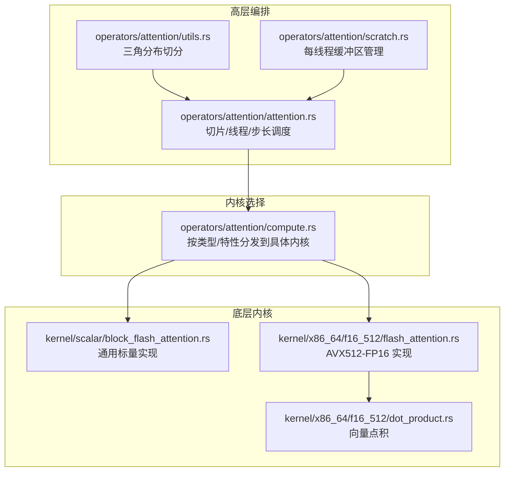
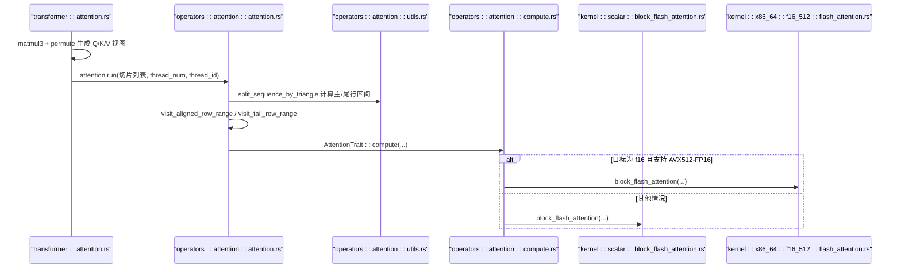
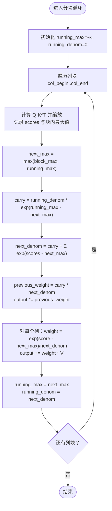
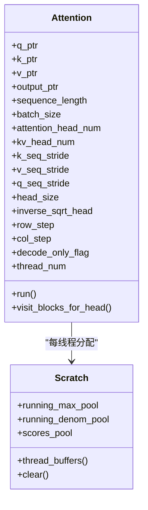
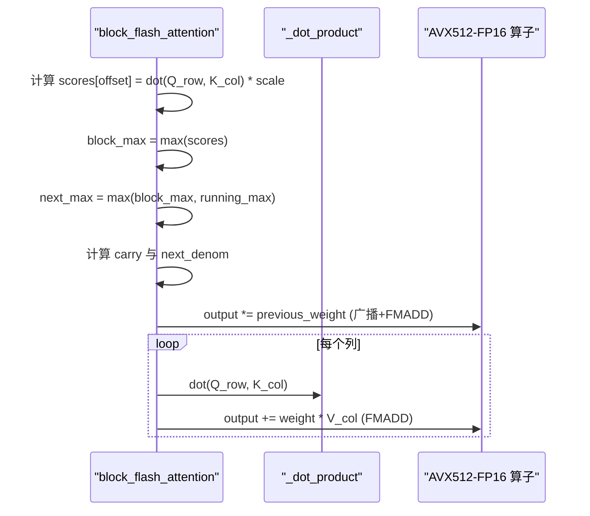
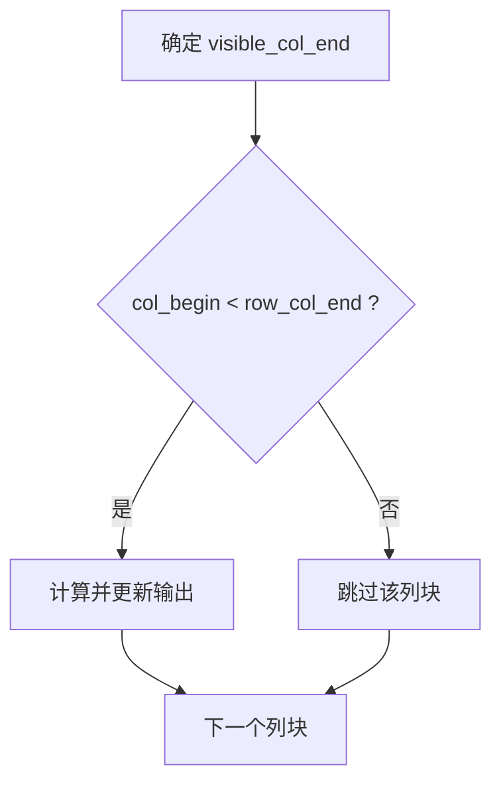
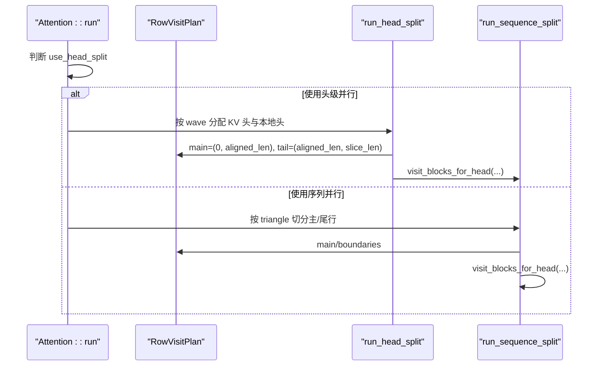
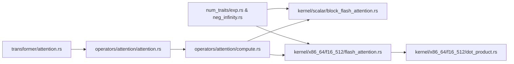

# 注意力计算内核

<cite>
**本文引用的文件**   
- [src/operators/attention/attention.rs](file://src/operators/attention/attention.rs)
- [src/operators/attention/compute.rs](file://src/operators/attention/compute.rs)
- [src/operators/attention/utils.rs](file://src/operators/attention/utils.rs)
- [src/operators/attention/scratch.rs](file://src/operators/attention/scratch.rs)
- [src/kernel/scalar/block_flash_attention.rs](file://src/kernel/scalar/block_flash_attention.rs)
- [src/kernel/x86_64/f16_512/flash_attention.rs](file://src/kernel/x86_64/f16_512/flash_attention.rs)
- [src/kernel/x86_64/f16_512/dot_product.rs](file://src/kernel/x86_64/f16_512/dot_product.rs)
- [src/num_traits/exp.rs](file://src/num_traits/exp.rs)
- [src/num_traits/neg_infinity.rs](file://src/num_traits/neg_infinity.rs)
- [src/transformer/attention.rs](file://src/transformer/attention.rs)
</cite>

## 目录
1. [简介](#简介)
2. [项目结构](#项目结构)
3. [核心组件](#核心组件)
4. [架构总览](#架构总览)
5. [详细组件分析](#详细组件分析)
6. [依赖关系分析](#依赖关系分析)
7. [性能考量](#性能考量)
8. [故障排查指南](#故障排查指南)
9. [结论](#结论)
10. [附录](#附录)

## 简介
本技术文档聚焦于注意力计算内核，围绕分块注意力（FlashAttention 风格）的并行化实现与内存访问优化进行深入解析。内容涵盖：
- 分块注意力计算的数学原理与数值稳定性处理
- Q、K、V 矩阵的分块加载与计算流程
- softmax 操作的向量化实现与溢出防护
- 不同序列长度下的性能优化建议
- GPU 与 CPU 实现的对比分析
- 注意力掩码的处理与稀疏计算优化

## 项目结构
本项目将注意力算子分为三层：
- 高层编排层：负责切片调度、线程划分、KV 头分组与行步长对齐等
- 内核选择层：根据数据类型与目标特性选择标量或 AVX512-FP16 内核
- 底层内核层：提供标量与 x86_64 AVX512-FP16 的具体实现

图表来源
- [src/operators/attention/attention.rs:1-120](file://src/operators/attention/attention.rs#L1-L120)
- [src/operators/attention/utils.rs:1-61](file://src/operators/attention/utils.rs#L1-L61)
- [src/operators/attention/scratch.rs:1-92](file://src/operators/attention/scratch.rs#L1-L92)
- [src/operators/attention/compute.rs:1-174](file://src/operators/attention/compute.rs#L1-L174)
- [src/kernel/scalar/block_flash_attention.rs:1-95](file://src/kernel/scalar/block_flash_attention.rs#L1-L95)
- [src/kernel/x86_64/f16_512/flash_attention.rs:1-93](file://src/kernel/x86_64/f16_512/flash_attention.rs#L1-L93)
- [src/kernel/x86_64/f16_512/dot_product.rs:1-59](file://src/kernel/x86_64/f16_512/dot_product.rs#L1-L59)

章节来源
- [src/operators/attention/attention.rs:1-120](file://src/operators/attention/attention.rs#L1-L120)
- [src/operators/attention/utils.rs:1-61](file://src/operators/attention/utils.rs#L1-L61)
- [src/operators/attention/scratch.rs:1-92](file://src/operators/attention/scratch.rs#L1-L92)
- [src/operators/attention/compute.rs:1-174](file://src/operators/attention/compute.rs#L1-L174)

## 核心组件
- Attention 结构体：封装 Q/K/V 指针、步长、head_size、缩放因子、解码标志、线程数以及分块大小（row_step、col_step），并提供 run 入口进行多切片、多线程调度。
- 内核选择器：在 f16 路径下，若目标支持 AVX512-FP16，则调用 x86_64 专用内核；否则回退至标量内核。
- 分块内核：维护 running_max 与 running_denom，逐列块增量更新输出，避免显式构建全尺寸注意力矩阵。
- 工具与缓冲：基于三角工作量的行范围切分与每线程 scratch 缓冲区，降低锁竞争与内存分配开销。

章节来源
- [src/operators/attention/attention.rs:1-120](file://src/operators/attention/attention.rs#L1-L120)
- [src/operators/attention/compute.rs:1-174](file://src/operators/attention/compute.rs#L1-L174)
- [src/operators/attention/utils.rs:1-61](file://src/operators/attention/utils.rs#L1-L61)
- [src/operators/attention/scratch.rs:1-92](file://src/operators/attention/scratch.rs#L1-L92)

## 架构总览
下图展示了从 Transformer 层到注意力内核的完整调用链，包括数据布局变换、分块策略与内核选择。

图表来源
- [src/transformer/attention.rs:92-209](file://src/transformer/attention.rs#L92-L209)
- [src/operators/attention/attention.rs:439-505](file://src/operators/attention/attention.rs#L439-L505)
- [src/operators/attention/utils.rs:40-61](file://src/operators/attention/utils.rs#L40-L61)
- [src/operators/attention/compute.rs:64-130](file://src/operators/attention/compute.rs#L64-L130)
- [src/kernel/scalar/block_flash_attention.rs:5-95](file://src/kernel/scalar/block_flash_attention.rs#L5-L95)
- [src/kernel/x86_64/f16_512/flash_attention.rs:31-93](file://src/kernel/x86_64/f16_512/flash_attention.rs#L31-L93)

## 详细组件分析

### 分块注意力算法与数值稳定性
- 数学原理
  - 对每个可见列块，计算 Q 行与 K 列的点积并缩放，得到局部分数块。
  - 使用在线 softmax 的增量合并公式：维护 running_max 与 running_denom，通过 exp(m_i - m_prev) 与权重迁移实现稳定合并。
  - 输出累积：先对已有输出乘以迁移权重，再累加当前块的加权 V。
- 数值稳定性
  - 以块内最大值与全局 running_max 的差值作为指数偏移，避免 exp 上溢。
  - 使用负无穷初始化 running_max，确保首个块正确启动。
- 复杂度
  - 时间：O(T·H·B·C)，其中 T 为行数块数，H 为 head_dim，B 为列块大小，C 为列块数量。
  - 空间：O(H + B) 每线程 scratch，避免 O(T·C) 的全局矩阵。

图表来源
- [src/kernel/scalar/block_flash_attention.rs:5-95](file://src/kernel/scalar/block_flash_attention.rs#L5-L95)

章节来源
- [src/kernel/scalar/block_flash_attention.rs:5-95](file://src/kernel/scalar/block_flash_attention.rs#L5-L95)
- [src/num_traits/exp.rs:1-24](file://src/num_traits/exp.rs#L1-L24)
- [src/num_traits/neg_infinity.rs:1-24](file://src/num_traits/neg_infinity.rs#L1-L24)

### Q、K、V 的分块加载与计算流程
- 行步长 row_step 与列步长 col_step 控制分块粒度，兼顾缓存命中与并行度。
- 对于每个行块，先清零对应输出区域，再按列块顺序增量更新。
- 可见列边界由 next_sequence_index 与 row 共同决定，形成上三角掩码效果。

图表来源
- [src/operators/attention/attention.rs:13-100](file://src/operators/attention/attention.rs#L13-L100)
- [src/operators/attention/scratch.rs:1-92](file://src/operators/attention/scratch.rs#L1-L92)

章节来源
- [src/operators/attention/attention.rs:157-311](file://src/operators/attention/attention.rs#L157-L311)
- [src/operators/attention/scratch.rs:1-92](file://src/operators/attention/scratch.rs#L1-L92)

### softmax 的向量化实现与溢出防护
- 标量路径：逐元素计算 exp(score - next_max)，并按 next_denom 归一化。
- AVX512-FP16 路径：
  - 使用 _mm512_fmadd_ph 做乘加融合，减少中间存储与精度损失。
  - 使用 _mm512_set1_ph 广播标量权重，批量更新输出。
  - 通过 (score - next_max) 的偏移保证 exp 输入非正，防止上溢。
- 点积加速：_dot_product 使用 32 宽度的 FP16 向量累加，提升吞吐。

图表来源
- [src/kernel/scalar/block_flash_attention.rs:49-93](file://src/kernel/scalar/block_flash_attention.rs#L49-L93)
- [src/kernel/x86_64/f16_512/flash_attention.rs:12-93](file://src/kernel/x86_64/f16_512/flash_attention.rs#L12-L93)
- [src/kernel/x86_64/f16_512/dot_product.rs:1-59](file://src/kernel/x86_64/f16_512/dot_product.rs#L1-L59)

章节来源
- [src/kernel/x86_64/f16_512/flash_attention.rs:31-93](file://src/kernel/x86_64/f16_512/flash_attention.rs#L31-L93)
- [src/kernel/x86_64/f16_512/dot_product.rs:1-59](file://src/kernel/x86_64/f16_512/dot_product.rs#L1-L59)

### 注意力掩码与稀疏计算优化
- 上三角掩码：visible_col_end = min(total_col_end, next_sequence_index + row + 1)，仅对历史 token 计算注意力。
- 行步长对齐：split_sequence_by_triangle 按三角形工作量均摊，使主块对齐 row_step，尾部单独处理，避免越界与重复计算。
- 稀疏性利用：当 col_begin >= row_col_end 时直接跳过整块，减少无效访存与计算。

图表来源
- [src/operators/attention/attention.rs:159-215](file://src/operators/attention/attention.rs#L159-L215)
- [src/operators/attention/utils.rs:40-61](file://src/operators/attention/utils.rs#L40-L61)

章节来源
- [src/operators/attention/attention.rs:159-215](file://src/operators/attention/attention.rs#L159-L215)
- [src/operators/attention/utils.rs:1-61](file://src/operators/attention/utils.rs#L1-L61)

### 并行化与线程调度
- 行级并行：main 块按 row_step 切分，tail 块由最后一个线程处理剩余行。
- 头级并行：当行块较少而线程较多时，切换到 run_head_split，按 KV 头与多头映射分配到线程。
- 工作均衡：基于三角形前缀和二分查找，将“有效计算量”均匀分配给各线程。

图表来源
- [src/operators/attention/attention.rs:364-436](file://src/operators/attention/attention.rs#L364-L436)
- [src/operators/attention/attention.rs:314-361](file://src/operators/attention/attention.rs#L314-L361)
- [src/operators/attention/utils.rs:40-61](file://src/operators/attention/utils.rs#L40-L61)

章节来源
- [src/operators/attention/attention.rs:314-436](file://src/operators/attention/attention.rs#L314-L436)
- [src/operators/attention/utils.rs:1-61](file://src/operators/attention/utils.rs#L1-L61)

### 不同序列长度下的性能优化建议
- 短序列（length << row_step）：优先启用 run_head_split，提高线程利用率。
- 中等序列（length ≈ k·row_step）：保持 row_step 与 col_step 平衡，最大化 L1/L2 命中率。
- 长序列（length >> row_step）：增大 col_step 以减少循环次数；必要时增加 row_step 以降低任务分裂开销。
- 解码阶段（decode_only_flag=true）：可考虑减小 col_step 以适配单步增量更新的访存模式。

[本节为通用指导，不直接分析具体文件]

### GPU 与 CPU 实现对比分析
- CPU（x86_64）
  - 优势：无显式显存拷贝，寄存器与 L1/L2 缓存友好；AVX512-FP16 路径利用 FMADD 与预取指令。
  - 局限：受限于核数与带宽，超长序列仍需合理分块。
- GPU（概念性说明）
  - 优势：大规模并行与高带宽，适合大 batch 与大序列；可通过共享内存与 warp/simd 级规约进一步优化。
  - 挑战：需精细管理片上内存与同步；数值稳定性同样依赖行/块级最大值的动态偏移。
- 迁移要点
  - 将 running_max/running_denom 的跨块合并逻辑映射到线程块间规约。
  - 用 tile 化的 Q/K/V 加载替代逐列访存，结合寄存器堆累积。

[本节为概念性说明，不直接分析具体文件]

## 依赖关系分析
- 类型与特性
  - Exp/NegInfinity 抽象 exp 与负无穷，统一 f16/f32/f64 行为。
- 内核选择
  - compute.rs 在 f16 路径下按 target_feature 选择 AVX512-FP16 或标量内核。
- 数据流
  - transformer::attention 完成投影与转置后，调用 operators::attention 的 run，最终落到 kernel 层。

图表来源
- [src/num_traits/exp.rs:1-24](file://src/num_traits/exp.rs#L1-L24)
- [src/num_traits/neg_infinity.rs:1-24](file://src/num_traits/neg_infinity.rs#L1-L24)
- [src/operators/attention/compute.rs:64-130](file://src/operators/attention/compute.rs#L64-L130)
- [src/kernel/x86_64/f16_512/dot_product.rs:1-59](file://src/kernel/x86_64/f16_512/dot_product.rs#L1-L59)
- [src/transformer/attention.rs:92-209](file://src/transformer/attention.rs#L92-L209)

章节来源
- [src/operators/attention/compute.rs:1-174](file://src/operators/attention/compute.rs#L1-L174)
- [src/num_traits/exp.rs:1-24](file://src/num_traits/exp.rs#L1-L24)
- [src/num_traits/neg_infinity.rs:1-24](file://src/num_traits/neg_infinity.rs#L1-L24)

## 性能考量
- 访存局部性
  - 行块与列块双重分块，配合 _mm_prefetch 预取下一批 K/V，降低延迟。
- 向量化与融合
  - FMADD 融合乘加，减少中间结果写回；广播权重批量更新输出。
- 线程与负载均衡
  - 三角形工作量切分避免负载倾斜；tail 行集中处理减少同步。
- 数值稳定性
  - 动态偏移与运行统计量避免 exp 上溢，保障长序列训练/推理稳定。

[本节为通用指导，不直接分析具体文件]

## 故障排查指南
- 数值异常（NaN/Inf）
  - 检查 running_max 初始化为负无穷，确保首个块正确启动。
  - 确认所有 exp 计算均以 (score - next_max) 形式进行。
- 结果不一致
  - 核对 next_sequence_index 与 visible_col_end 的计算，确保上三角掩码生效。
  - 验证 stride 参数与数据布局一致（Q/K/V 的 seq/head/batch 步长）。
- 性能退化
  - 调整 row_step/col_step 以匹配硬件缓存行与向量宽度。
  - 在短序列场景切换至 run_head_split 提升并行度。

章节来源
- [src/kernel/scalar/block_flash_attention.rs:5-95](file://src/kernel/scalar/block_flash_attention.rs#L5-L95)
- [src/operators/attention/attention.rs:159-215](file://src/operators/attention/attention.rs#L159-L215)

## 结论
本注意力内核采用 FlashAttention 风格的在线分块算法，在 CPU 平台上通过行/列分块、预取与 AVX512-FP16 向量化实现高效稳定的自注意力计算。上层编排层提供了灵活的线程与头级并行策略，结合三角形工作量切分与 tail 行处理，兼顾了负载均衡与边界安全。未来可在 GPU 端复用相同的数值稳定性与分块思想，进一步发挥并行与带宽优势。

## 附录
- 关键接口路径参考
  - 注意力运行入口：[src/operators/attention/attention.rs:439-505](file://src/operators/attention/attention.rs#L439-L505)
  - 内核选择与分发：[src/operators/attention/compute.rs:64-130](file://src/operators/attention/compute.rs#L64-L130)
  - 标量分块内核：[src/kernel/scalar/block_flash_attention.rs:5-95](file://src/kernel/scalar/block_flash_attention.rs#L5-L95)
  - AVX512-FP16 分块内核：[src/kernel/x86_64/f16_512/flash_attention.rs:31-93](file://src/kernel/x86_64/f16_512/flash_attention.rs#L31-L93)
  - 向量点积：[src/kernel/x86_64/f16_512/dot_product.rs:1-59](file://src/kernel/x86_64/f16_512/dot_product.rs#L1-L59)
  - 行切分工具：[src/operators/attention/utils.rs:40-61](file://src/operators/attention/utils.rs#L40-L61)
  - 每线程缓冲：[src/operators/attention/scratch.rs:1-92](file://src/operators/attention/scratch.rs#L1-L92)
  - 数值特性：[src/num_traits/exp.rs:1-24](file://src/num_traits/exp.rs#L1-L24), [src/num_traits/neg_infinity.rs:1-24](file://src/num_traits/neg_infinity.rs#L1-L24)
  - 模型集成：[src/transformer/attention.rs:92-209](file://src/transformer/attention.rs#L92-L209)