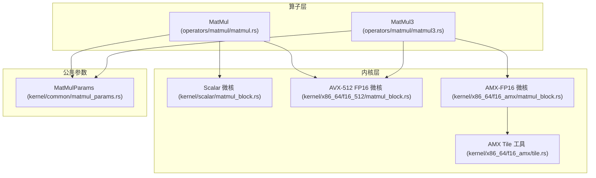
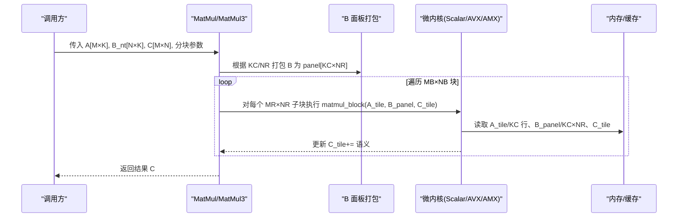
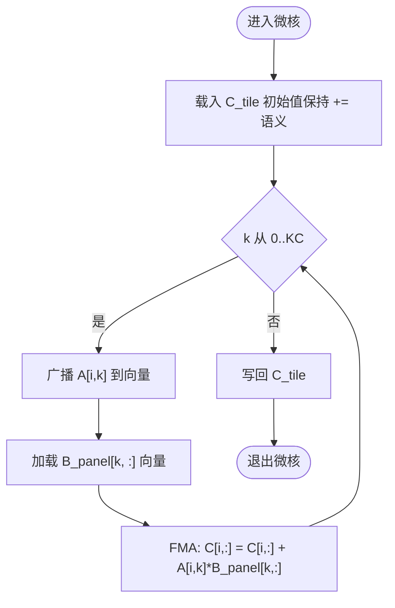
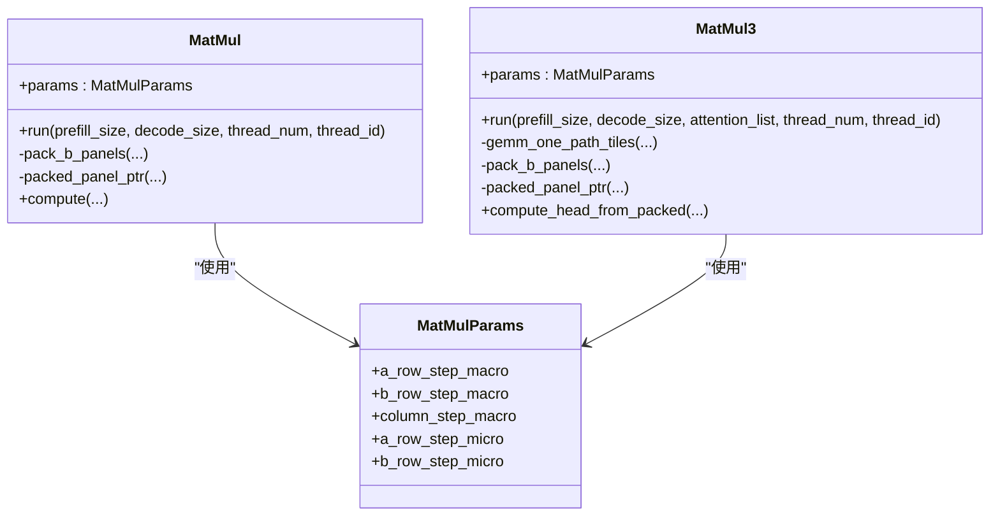
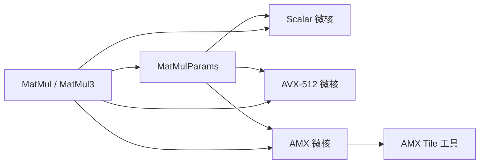

# 矩阵乘法内核

<cite>
**本文引用的文件**
- [src/kernel/common/matmul_params.rs](file://src/kernel/common/matmul_params.rs)
- [src/kernel/scalar/matmul_block.rs](file://src/kernel/scalar/matmul_block.rs)
- [src/kernel/x86_64/f16_512/matmul_block.rs](file://src/kernel/x86_64/f16_512/matmul_block.rs)
- [src/kernel/x86_64/f16_amx/matmul_block.rs](file://src/kernel/x86_64/f16_amx/matmul_block.rs)
- [src/kernel/x86_64/f16_amx/tile.rs](file://src/kernel/x86_64/f16_amx/tile.rs)
- [src/operators/matmul/matmul.rs](file://src/operators/matmul/matmul.rs)
- [src/operators/matmul/matmul3.rs](file://src/operators/matmul/matmul3.rs)
</cite>

## 目录
1. [简介](#简介)
2. [项目结构](#项目结构)
3. [核心组件](#核心组件)
4. [架构总览](#架构总览)
5. [详细组件分析](#详细组件分析)
6. [依赖关系分析](#依赖关系分析)
7. [性能考量与调优指南](#性能考量与调优指南)
8. [故障排查指南](#故障排查指南)
9. [结论](#结论)
10. [附录](#附录)

## 简介
本技术文档聚焦于仓库中的矩阵乘法（GEMM）内核实现，围绕分块算法、3x32 微核设计、参数化配置 MatMulParams、A_tile/B_panel/C_tile 数据布局与优化策略、广播式计算模式与向量化累加过程展开。同时提供不同规模矩阵乘法的性能调优建议、内存访问模式分析与缓存命中率优化技巧，并解释数值精度处理与溢出防护机制。

## 项目结构
该项目的 GEMM 相关代码主要分布在以下位置：
- 通用参数定义：MatMulParams
- 标量参考实现：scalar::matmul_block
- x86_64 AVX-512 FP16 专用微核：f16_512::matmul_block
- x86_64 AMX-FP16 专用微核：f16_amx::matmul_block 及 tile 工具
- 算子封装与调度：operators::matmul::MatMul 与 operators::matmul::MatMul3

图表来源
- [src/operators/matmul/matmul.rs:165-288](file://src/operators/matmul/matmul.rs#L165-L288)
- [src/operators/matmul/matmul3.rs:281-391](file://src/operators/matmul/matmul3.rs#L281-L391)
- [src/kernel/scalar/matmul_block.rs:14-43](file://src/kernel/scalar/matmul_block.rs#L14-L43)
- [src/kernel/x86_64/f16_512/matmul_block.rs:22-85](file://src/kernel/x86_64/f16_512/matmul_block.rs#L22-L85)
- [src/kernel/x86_64/f16_amx/matmul_block.rs:18-51](file://src/kernel/x86_64/f16_amx/matmul_block.rs#L18-L51)
- [src/kernel/x86_64/f16_amx/tile.rs:104-167](file://src/kernel/x86_64/f16_amx/tile.rs#L104-L167)
- [src/kernel/common/matmul_params.rs:1-36](file://src/kernel/common/matmul_params.rs#L1-L36)

章节来源
- [src/operators/matmul/matmul.rs:165-288](file://src/operators/matmul/matmul.rs#L165-L288)
- [src/operators/matmul/matmul3.rs:281-391](file://src/operators/matmul/matmul3.rs#L281-L391)
- [src/kernel/scalar/matmul_block.rs:14-43](file://src/kernel/scalar/matmul_block.rs#L14-L43)
- [src/kernel/x86_64/f16_512/matmul_block.rs:22-85](file://src/kernel/x86_64/f16_512/matmul_block.rs#L22-L85)
- [src/kernel/x86_64/f16_amx/matmul_block.rs:18-51](file://src/kernel/x86_64/f16_amx/matmul_block.rs#L18-L51)
- [src/kernel/x86_64/f16_amx/tile.rs:104-167](file://src/kernel/x86_64/f16_amx/tile.rs#L104-L167)
- [src/kernel/common/matmul_params.rs:1-36](file://src/kernel/common/matmul_params.rs#L1-L36)

## 核心组件
- MatMulParams：统一承载分块形状与微核尺寸，供上层算子与底层微核共享。
- 标量微核：通用参考实现，用于验证与无硬件加速时的回退路径。
- AVX-512 FP16 微核：针对 3x32 的广播式 FMA 内核，最大化利用 512bit 向量寄存器。
- AMX-FP16 微核：基于 AMX 指令集，将 3x32 拆分为两个 3x16 半块，在 FP32 累加后写回 f16。
- 算子封装：MatMul 与 MatMul3 负责宏/中/微观三层分块、B 权重面板打包、任务分配与线程并行。

章节来源
- [src/kernel/common/matmul_params.rs:1-36](file://src/kernel/common/matmul_params.rs#L1-L36)
- [src/kernel/scalar/matmul_block.rs:14-43](file://src/kernel/scalar/matmul_block.rs#L14-L43)
- [src/kernel/x86_64/f16_512/matmul_block.rs:22-85](file://src/kernel/x86_64/f16_512/matmul_block.rs#L22-L85)
- [src/kernel/x86_64/f16_amx/matmul_block.rs:18-51](file://src/kernel/x86_64/f16_amx/matmul_block.rs#L18-L51)
- [src/operators/matmul/matmul.rs:165-288](file://src/operators/matmul/matmul.rs#L165-L288)
- [src/operators/matmul/matmul3.rs:281-391](file://src/operators/matmul/matmul3.rs#L281-L391)

## 架构总览
整体采用“宏观分块 + 中观规约块 + 微观固定 tile”的分层策略：
- 宏观分块：按 MB×NB 划分 A/C 的行/列块，减少 L2/L3 缓存压力。
- 中观规约块：沿 K 方向以 KC 切分，形成 B 的面板（panel），便于预取与复用。
- 微观内核：固定 MR=3、NR=32 的微核，使用广播式 FMA 或 AMX 指令进行高效累加。

图表来源
- [src/operators/matmul/matmul.rs:165-288](file://src/operators/matmul/matmul.rs#L165-L288)
- [src/operators/matmul/matmul3.rs:281-391](file://src/operators/matmul/matmul3.rs#L281-L391)
- [src/kernel/scalar/matmul_block.rs:14-43](file://src/kernel/scalar/matmul_block.rs#L14-L43)
- [src/kernel/x86_64/f16_512/matmul_block.rs:22-85](file://src/kernel/x86_64/f16_512/matmul_block.rs#L22-L85)
- [src/kernel/x86_64/f16_amx/matmul_block.rs:18-51](file://src/kernel/x86_64/f16_amx/matmul_block.rs#L18-L51)

## 详细组件分析

### MatMulParams 参数结构与含义
MatMulParams 是贯穿上下的分块与微核形状描述对象，字段映射如下：
- a_row_step_macro → MB（输入 A 的宏观行块大小）
- b_row_step_macro → NB（输出 C 的宏观列块大小）
- column_step_macro → KC（K 维规约块长度）
- a_row_step_micro → MR（微核行数，固定为 3）
- b_row_step_micro → NR（微核列数，固定为 32）

这些字段被上层算子用于决定分块策略，并被微核用于确定循环边界与步长。

章节来源
- [src/kernel/common/matmul_params.rs:1-36](file://src/kernel/common/matmul_params.rs#L1-L36)
- [src/operators/matmul/matmul.rs:298-308](file://src/operators/matmul/matmul.rs#L298-L308)
- [src/operators/matmul/matmul3.rs:297-307](file://src/operators/matmul/matmul3.rs#L297-L307)

### 数据布局约定：A_tile、B_panel、C_tile
- A_tile：[MR × KC]，行主存储，行距 lda = param.a_row_step_macro（通常为 K）。
- B_panel：[KC × NR]，行主打包，每行连续 NR 个元素；行距 ldb_panel = NR。
- C_tile：[MR × NR]，行主存储，行距 ldc = param.b_row_step_macro（通常为 N）。

上述布局在 scalar、AVX-512、AMX 三个微核中保持一致，确保上层分块逻辑可复用。

章节来源
- [src/kernel/scalar/matmul_block.rs:14-43](file://src/kernel/scalar/matmul_block.rs#L14-L43)
- [src/kernel/x86_64/f16_512/matmul_block.rs:10-21](file://src/kernel/x86_64/f16_512/matmul_block.rs#L10-L21)
- [src/kernel/x86_64/f16_amx/matmul_block.rs:8-16](file://src/kernel/x86_64/f16_amx/matmul_block.rs#L8-L16)

### 广播式计算模式与向量化累加
- 广播式：对每一 k，将 A 的一行元素广播到 512bit 向量，再与 B_panel 的一行向量做 FMA，逐行累加到 C 的三行向量寄存器中。
- 向量化累加：AVX-512 路径使用 _mm512_fmadd_ph 完成 a*b+c 的融合乘加；AMX 路径通过 TDPFP16PS 指令在 FP32 累加器中进行点积，最后写回 f16。

图表来源
- [src/kernel/x86_64/f16_512/matmul_block.rs:34-85](file://src/kernel/x86_64/f16_512/matmul_block.rs#L34-L85)
- [src/kernel/x86_64/f16_amx/matmul_block.rs:18-51](file://src/kernel/x86_64/f16_amx/matmul_block.rs#L18-L51)
- [src/kernel/x86_64/f16_amx/tile.rs:104-167](file://src/kernel/x86_64/f16_amx/tile.rs#L104-L167)

### 分块算法与任务调度
- 宏观分块：MB×NB 划分 A/C 的行/列块，降低缓存压力。
- 中观规约：KC 切分 K 维度，生成 B 的面板，提高访存局部性。
- 微观内核：固定 MR=3、NR=32，避免尾块处理复杂度。
- 任务分配：按 tile 数量均分到线程，保证负载均衡。

图表来源
- [src/operators/matmul/matmul.rs:27-100](file://src/operators/matmul/matmul.rs#L27-L100)
- [src/operators/matmul/matmul3.rs:79-115](file://src/operators/matmul/matmul3.rs#L79-L115)
- [src/kernel/common/matmul_params.rs:1-36](file://src/kernel/common/matmul_params.rs#L1-L36)

章节来源
- [src/operators/matmul/matmul.rs:165-288](file://src/operators/matmul/matmul.rs#L165-L288)
- [src/operators/matmul/matmul3.rs:281-391](file://src/operators/matmul/matmul3.rs#L281-L391)

### AMX-FP16 微核细节
- 将 3x32 拆成两个 3x16 半块，分别调用 gemm_3x16_to_f32 在 FP32 累加器中计算。
- 需要确保 AMX 权限可用，并在每次使用前加载 tile 配置。
- 最终将 FP32 累加结果与原始 f16 C 相加后写回。

章节来源
- [src/kernel/x86_64/f16_amx/matmul_block.rs:18-51](file://src/kernel/x86_64/f16_amx/matmul_block.rs#L18-L51)
- [src/kernel/x86_64/f16_amx/tile.rs:94-101](file://src/kernel/x86_64/f16_amx/tile.rs#L94-L101)
- [src/kernel/x86_64/f16_amx/tile.rs:104-167](file://src/kernel/x86_64/f16_amx/tile.rs#L104-L167)

## 依赖关系分析
- 算子层依赖 MatMulParams 作为唯一形状契约，屏蔽底层差异。
- 微核之间通过相同的数据布局约定（A_tile/B_panel/C_tile）解耦。
- AMX 微核依赖 tile 工具进行寄存器配置与数据装载。

图表来源
- [src/kernel/common/matmul_params.rs:1-36](file://src/kernel/common/matmul_params.rs#L1-L36)
- [src/operators/matmul/matmul.rs:298-343](file://src/operators/matmul/matmul.rs#L298-L343)
- [src/operators/matmul/matmul3.rs:704-776](file://src/operators/matmul/matmul3.rs#L704-L776)
- [src/kernel/x86_64/f16_amx/matmul_block.rs:18-51](file://src/kernel/x86_64/f16_amx/matmul_block.rs#L18-L51)
- [src/kernel/x86_64/f16_amx/tile.rs:94-101](file://src/kernel/x86_64/f16_amx/tile.rs#L94-L101)

章节来源
- [src/operators/matmul/matmul.rs:298-343](file://src/operators/matmul/matmul.rs#L298-L343)
- [src/operators/matmul/matmul3.rs:704-776](file://src/operators/matmul/matmul3.rs#L704-L776)
- [src/kernel/x86_64/f16_amx/matmul_block.rs:18-51](file://src/kernel/x86_64/f16_amx/matmul_block.rs#L18-L51)
- [src/kernel/x86_64/f16_amx/tile.rs:94-101](file://src/kernel/x86_64/f16_amx/tile.rs#L94-L101)

## 性能考量与调优指南

### 分块参数选择建议
- MR=3、NR=32 固定，由微核约束。
- MB 与 NB 应使 A_tile 与 C_tile 能驻留 L1/L2 缓存，典型取值 MB∈[6,24]，NB∈[64,128]。
- KC 应与 B_panel 的打包粒度匹配，常见 KC=64 或 128，兼顾访存吞吐与重复利用。

章节来源
- [src/operators/matmul/matmul.rs:470-476](file://src/operators/matmul/matmul.rs#L470-L476)
- [src/operators/matmul/matmul3.rs:303-307](file://src/operators/matmul/matmul3.rs#L303-L307)

### 内存访问模式与缓存命中优化
- A_tile 行主访问，按行顺序读入，利于预取；B_panel 行主且每行连续 NR 元素，提升向量加载效率。
- C_tile 按行写入，保持与 A 相同的行距风格，减少跨行跳跃。
- 建议对齐分配（如 64B 对齐）以提升 AVX-512/AMX 的加载/存储效率。

章节来源
- [src/kernel/scalar/matmul_block.rs:25-43](file://src/kernel/scalar/matmul_block.rs#L25-L43)
- [src/kernel/x86_64/f16_512/matmul_block.rs:34-85](file://src/kernel/x86_64/f16_512/matmul_block.rs#L34-L85)
- [src/kernel/x86_64/f16_amx/tile.rs:120-167](file://src/kernel/x86_64/f16_amx/tile.rs#L120-L167)

### 不同规模矩阵乘法的调优要点
- 小矩阵（M,N,K 较小）：优先增大 MB/NB 以减少内核调用开销；KC 不宜过小，避免频繁重打包。
- 中等矩阵：平衡 MB/NB 与 KC，使 A_tile/C_tile 常驻 L2，B_panel 常驻 L1。
- 大矩阵：增加 KC 以降低 K 循环次数；考虑多线程并行度与 NUMA 亲和性。

章节来源
- [src/operators/matmul/matmul.rs:165-288](file://src/operators/matmul/matmul.rs#L165-L288)
- [src/operators/matmul/matmul3.rs:281-391](file://src/operators/matmul/matmul3.rs#L281-L391)

### 数值精度与溢出防护
- AVX-512 路径：在 f16 域内直接 FMA，注意累积误差随 KC 增长；测试容忍度随规模调整。
- AMX 路径：在 FP32 累加器中计算，再写回 f16，显著降低累积误差。
- 建议在大规模 K 时采用 AMX 路径或更高精度中间表示。

章节来源
- [src/kernel/x86_64/f16_512/matmul_block.rs:76-85](file://src/kernel/x86_64/f16_512/matmul_block.rs#L76-L85)
- [src/kernel/x86_64/f16_amx/matmul_block.rs:18-51](file://src/kernel/x86_64/f16_amx/matmul_block.rs#L18-L51)

## 故障排查指南
- 未启用目标特性：当目标平台不支持 avx512fp16 或 amx-tile/amx-fp16 时，自动回退到标量路径。检查运行时特性检测与编译目标。
- AMX 权限不足：需确保线程具备 AMX 数据权限，否则 ensure_amx_ready 会断言失败。
- 参数不满足断言：MR=3、NR=32 以及 KB/NB 对齐要求会在 debug_assert 中校验，若失败请检查 MatMulParams 设置。

章节来源
- [src/kernel/x86_64/f16_512/matmul_block.rs:94-97](file://src/kernel/x86_64/f16_512/matmul_block.rs#L94-L97)
- [src/kernel/x86_64/f16_amx/matmul_block.rs:18-23](file://src/kernel/x86_64/f16_amx/matmul_block.rs#L18-L23)
- [src/kernel/x86_64/f16_amx/tile.rs:94-101](file://src/kernel/x86_64/f16_amx/tile.rs#L94-L101)
- [src/operators/matmul/matmul3.rs:303-307](file://src/operators/matmul/matmul3.rs#L303-L307)

## 结论
该矩阵乘法内核通过统一的 MatMulParams 抽象，结合三层分块与固定 3x32 微核，实现了高可移植性与高性能。AVX-512 与 AMX 两条路径在各自硬件上发挥极致吞吐，而标量路径保证了正确性与兼容性。合理选择 MB/NB/KC、对齐分配与线程并行度，可在不同规模下获得稳定高效的性能表现。

## 附录

### 关键函数与路径索引
- 参数定义：[src/kernel/common/matmul_params.rs:1-36](file://src/kernel/common/matmul_params.rs#L1-L36)
- 标量微核：[src/kernel/scalar/matmul_block.rs:14-43](file://src/kernel/scalar/matmul_block.rs#L14-L43)
- AVX-512 微核：[src/kernel/x86_64/f16_512/matmul_block.rs:22-85](file://src/kernel/x86_64/f16_512/matmul_block.rs#L22-L85)
- AMX 微核：[src/kernel/x86_64/f16_amx/matmul_block.rs:18-51](file://src/kernel/x86_64/f16_amx/matmul_block.rs#L18-L51)
- AMX Tile 工具：[src/kernel/x86_64/f16_amx/tile.rs:104-167](file://src/kernel/x86_64/f16_amx/tile.rs#L104-L167)
- 算子封装 MatMul：[src/operators/matmul/matmul.rs:165-288](file://src/operators/matmul/matmul.rs#L165-L288)
- 算子封装 MatMul3：[src/operators/matmul/matmul3.rs:281-391](file://src/operators/matmul/matmul3.rs#L281-L391)