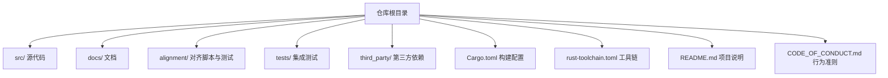
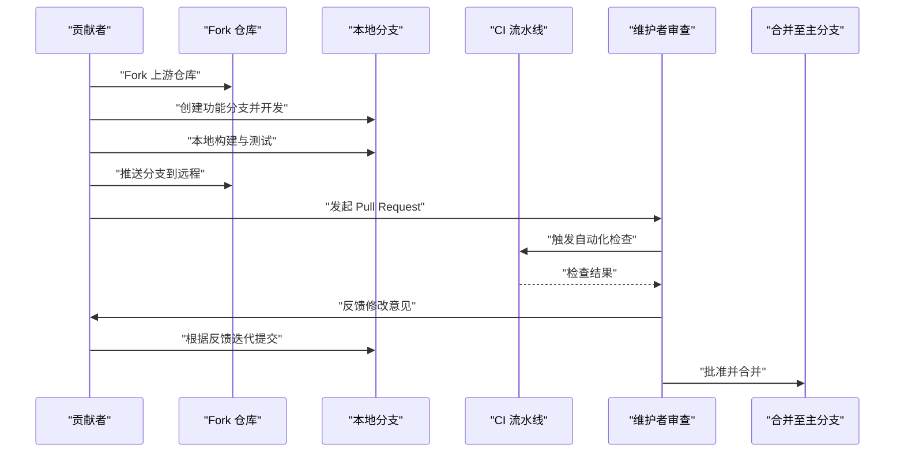
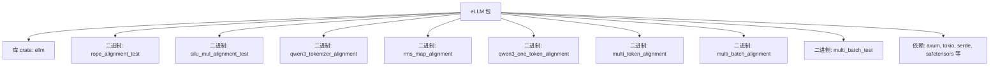

# 代码贡献流程

<cite>
**本文引用的文件**
- [README.md](file://README.md)
- [CODE_OF_CONDUCT.md](file://CODE_OF_CONDUCT.md)
- [Cargo.toml](file://Cargo.toml)
- [rust-toolchain.toml](file://rust-toolchain.toml)
- [docs/contributing/index.md](file://docs/contributing/index.md)
- [docs/getting_started/installation.md](file://docs/getting_started/installation.md)
</cite>

## 目录
1. [简介](#简介)
2. [项目结构](#项目结构)
3. [核心组件](#核心组件)
4. [架构总览](#架构总览)
5. [详细组件分析](#详细组件分析)
6. [依赖分析](#依赖分析)
7. [性能考虑](#性能考虑)
8. [故障排查指南](#故障排查指南)
9. [结论](#结论)
10. [附录](#附录)

## 简介
本文件面向希望为 eLLM 贡献代码的开发者，提供从 Fork、创建分支、提交到 Pull Request（PR）审查与合并的完整工作流程说明。同时涵盖代码风格与格式化建议、Git 提交信息规范、分支管理策略与版本发布流程，以及代码审查检查清单与最佳实践，帮助贡献者高效、高质量地参与协作。

## 项目结构
仓库采用 Rust 工程组织方式，核心源码位于 src/，构建与依赖由 Cargo 管理；文档集中于 docs/，包含贡献指南入口页与安装说明等。

**图示来源**
- [Cargo.toml:1-102](file://Cargo.toml#L1-L102)
- [rust-toolchain.toml:1-3](file://rust-toolchain.toml#L1-L3)
- [README.md:1-207](file://README.md#L1-L207)

**章节来源**
- [Cargo.toml:1-102](file://Cargo.toml#L1-L102)
- [rust-toolchain.toml:1-3](file://rust-toolchain.toml#L1-L3)
- [README.md:1-207](file://README.md#L1-L207)

## 核心组件
- 构建与运行
  - 使用 cargo 进行构建与运行，开发环境可通过 cargo build 编译，发布构建使用 cargo build --release。
  - 项目使用 nightly 工具链，通过 rust-toolchain.toml 指定。
- 贡献文档入口
  - 贡献指南入口页列出“Pull request expectations”“Code style and formatting”“Testing and validation”等主题，作为贡献流程的导航起点。

**章节来源**
- [docs/getting_started/installation.md:22-25](file://docs/getting_started/installation.md#L22-L25)
- [rust-toolchain.toml:1-3](file://rust-toolchain.toml#L1-L3)
- [docs/contributing/index.md:1-16](file://docs/contributing/index.md#L1-L16)

## 架构总览
下图展示贡献者从本地开发到 PR 提交流程的关键步骤与交互对象。

[此图为概念性流程图，不直接映射具体源文件]

## 详细组件分析

### 工作流：Fork、分支与提交
- Fork 仓库
  - 在 GitHub 上 Fork 本项目到你的账户，作为独立工作区。
- 克隆与初始化
  - 将你的 Fork 克隆到本地，进入项目根目录。
- 选择工具链
  - 项目使用 nightly 工具链，确保本地已安装对应版本（可通过 rustup 安装）。
- 创建分支
  - 基于主分支创建功能分支，命名遵循语义化前缀（如 feature/xxx、fix/xxx、docs/xxx）。
- 开发与本地验证
  - 使用 cargo build 进行开发构建，必要时执行 cargo build --release 做发布构建验证。
  - 在 alignment/ 或 tests/ 下运行相关脚本或测试用例，确保改动正确。
- 提交与推送
  - 按“提交信息规范”编写 commit message，分步提交小粒度变更，避免大杂烩。
  - 推送分支到远程 Fork。
- 发起 PR
  - 在 GitHub 上创建 Pull Request，填写清晰的描述、影响范围与测试情况。

**章节来源**
- [docs/getting_started/installation.md:22-25](file://docs/getting_started/installation.md#L22-L25)
- [rust-toolchain.toml:1-3](file://rust-toolchain.toml#L1-L3)

### 提交信息规范
- 格式建议
  - 类型: 标题（例如 feat: 新增算子对齐测试）
  - 正文：简要说明动机、影响面与验证方式
  - 尾注：关联 Issue 编号（如有）
- 常见类型
  - feat、fix、docs、style、refactor、perf、test、build、ci、chore、revert
- 示例模板（仅结构示意）
  - 类型: 简短标题
  - 
  - 详细说明（可选）
  - 
  - 关联问题（可选）

[本节为通用规范说明，不直接引用具体文件]

### 代码风格与格式化
- 语言与工具
  - 本项目为 Rust 工程，建议使用 rustfmt 进行统一格式化，clippy 辅助静态检查。
- 风格要点
  - 遵循社区通用 Rust 风格约定（缩进、命名、模块组织等）。
  - 保持函数与模块职责单一，注释清晰，错误处理明确。
- 本地自检
  - 在提交前运行格式化与静态检查，确保无风格差异与明显警告。

[本节为通用规范说明，不直接引用具体文件]

### 测试与验证
- 构建与运行
  - 开发构建：cargo build
  - 发布构建：cargo build --release
- 对齐与单元测试
  - 参考 alignment/ 下的脚本与二进制目标，用于算子与模型对齐验证。
  - 在 tests/ 目录下运行相关测试用例，覆盖关键路径。
- 持续集成
  - 建议在 PR 中附带必要的本地测试结果截图或日志，便于审查。

**章节来源**
- [docs/getting_started/installation.md:22-25](file://docs/getting_started/installation.md#L22-L25)
- [Cargo.toml:10-41](file://Cargo.toml#L10-L41)

### Pull Request 规范与审查流程
- PR 要求
  - 清晰的标题与描述，说明变更目的、影响范围与测试方法。
  - 变更尽量聚焦，避免无关改动混入。
  - 若涉及 API 或配置变更，需更新相关文档。
- 审查流程
  - 维护者会进行代码审查，关注正确性、性能、可维护性与一致性。
  - 可能提出修改意见，贡献者需及时响应并迭代。
- 合并标准
  - 通过所有自动化检查与人工审查后，方可合并至主分支。

**章节来源**
- [docs/contributing/index.md:1-16](file://docs/contributing/index.md#L1-L16)

### 分支管理策略
- 主分支保护
  - 主分支保持稳定，禁止直接推送，所有变更通过 PR 合并。
- 分支命名
  - feature/xxx：新功能
  - fix/xxx：缺陷修复
  - docs/xxx：文档改进
  - refactor/xxx：重构
  - perf/xxx：性能优化
  - test/xxx：测试增强
- 生命周期
  - 功能完成后尽快合入，避免长期滞留；定期清理已合并分支。

[本节为通用策略说明，不直接引用具体文件]

### 版本发布流程
- 版本号
  - 当前仓库 README 显示存在 alpha 与早期版本记录，遵循语义化版本（主.次.修订）。
- 发布准备
  - 完成功能冻结、回归测试与文档更新。
  - 在 CHANGELOG 或相关文档中记录重要变更。
- 发布动作
  - 打 Tag 并发布 Release，通知社区与更新文档链接。

**章节来源**
- [README.md:10-12](file://README.md#L10-L12)

### 代码审查检查清单与最佳实践
- 正确性
  - 逻辑正确、边界条件覆盖、错误处理完备。
- 性能
  - 无明显性能退化，热点路径有基准或对比数据。
- 可维护性
  - 命名清晰、模块内聚、注释到位、复杂度可控。
- 兼容性
  - 对现有接口与配置兼容，破坏性变更需充分说明与迁移方案。
- 文档
  - 用户可见变更需更新文档与示例。
- 安全与合规
  - 遵循行为准则，不包含敏感信息与不当内容。

**章节来源**
- [CODE_OF_CONDUCT.md:1-131](file://CODE_OF_CONDUCT.md#L1-L131)

## 依赖分析
- 构建系统
  - 使用 Cargo 管理依赖与构建，定义库与二进制目标，配置发布与开发 profile。
- 工具链
  - 指定 nightly 工具链，确保特性与编译器行为一致。
- 外部依赖
  - 网络、序列化、随机数、内存映射等常用库，支撑运行时与服务端能力。

**图示来源**
- [Cargo.toml:1-102](file://Cargo.toml#L1-L102)

**章节来源**
- [Cargo.toml:1-102](file://Cargo.toml#L1-L102)
- [rust-toolchain.toml:1-3](file://rust-toolchain.toml#L1-L3)

## 性能考虑
- 构建优化
  - 发布构建启用 LTO 与优化等级，减少体积并提升运行效率。
- 运行时
  - 合理设置并发与资源限制，避免过度竞争导致抖动。
- 基准与回归
  - 对关键路径添加基准测试，防止性能回退。

**章节来源**
- [Cargo.toml:69-81](file://Cargo.toml#L69-L81)

## 故障排查指南
- 构建失败
  - 确认工具链版本与平台匹配，清理缓存后重试。
  - 检查依赖冲突与缺失，必要时升级或降级特定版本。
- 运行时异常
  - 开启更详细的日志输出，定位错误上下文。
  - 针对服务端口、SSL 证书与权限问题进行逐项排查。
- 行为准则
  - 遇到不当行为或安全问题，依据行为准则上报与维护者沟通。

**章节来源**
- [CODE_OF_CONDUCT.md:40-68](file://CODE_OF_CONDUCT.md#L40-L68)

## 结论
通过规范的 Fork、分支与提交流程，配合严格的 PR 审查与统一的代码风格，可以显著提升协作效率与代码质量。结合完善的测试与性能基线，有助于在快速迭代的同时维持系统的稳定性与可维护性。

## 附录
- 贡献文档入口
  - 查看贡献指南入口页，了解“Pull request expectations”“Code style and formatting”“Testing and validation”等主题。
- 安装与构建
  - 参考安装文档中的构建命令，快速搭建本地开发环境。

**章节来源**
- [docs/contributing/index.md:1-16](file://docs/contributing/index.md#L1-L16)
- [docs/getting_started/installation.md:22-25](file://docs/getting_started/installation.md#L22-L25)