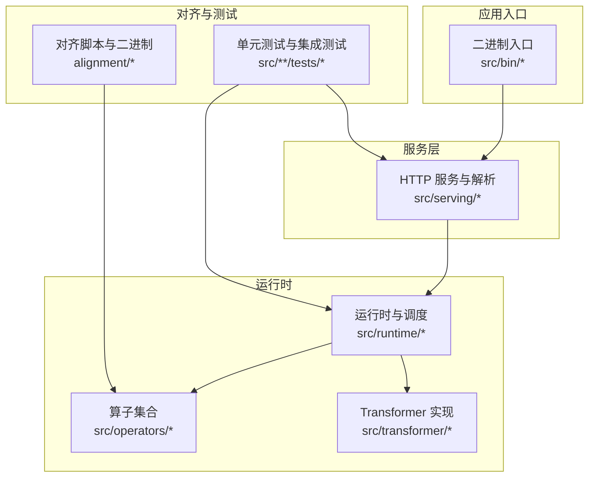
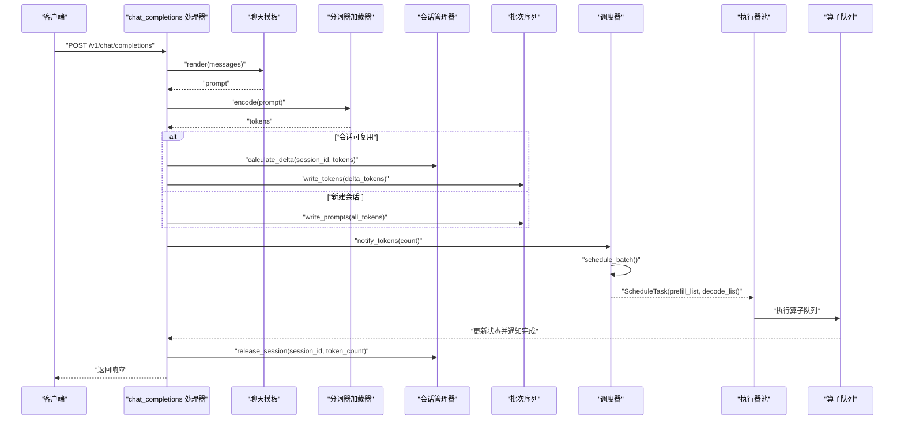
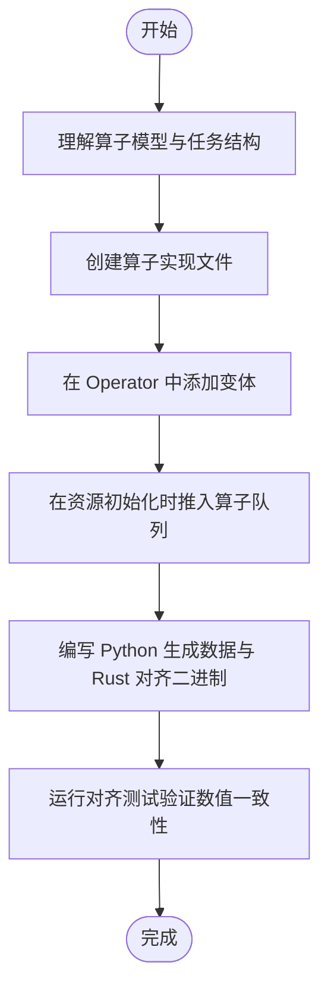
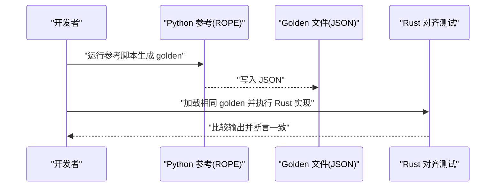
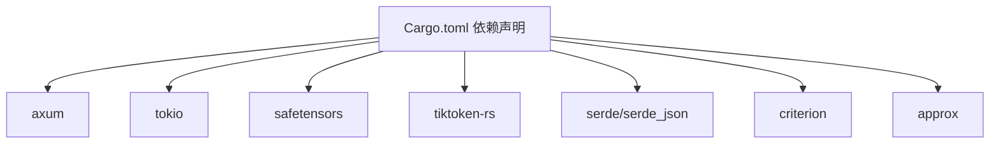

# 开发指南

<cite>
**本文引用的文件**
- [README.md](file://README.md)
- [Cargo.toml](file://Cargo.toml)
- [rust-toolchain.toml](file://rust-toolchain.toml)
- [docs/contributing/index.md](file://docs/contributing/index.md)
- [docs/contributing/new_operator.md](file://docs/contributing/new_operator.md)
- [docs/contributing/hf_alignment.md](file://docs/contributing/hf_alignment.md)
- [docs/contributing/model/basic.md](file://docs/contributing/model/basic.md)
- [docs/contributing/model/registration.md](file://docs/contributing/model/registration.md)
- [docs/contributing/model/tests.md](file://docs/contributing/model/tests.md)
- [docs/getting_started/installation.md](file://docs/getting_started/installation.md)
- [docs/design/runtime/overview.md](file://docs/design/runtime/overview.md)
- [src/operators/operator.rs](file://src/operators/operator.rs)
- [src/operators/mod.rs](file://src/operators/mod.rs)
- [src/operators/elementwise/silu_mul_zip.rs](file://src/operators/elementwise/silu_mul_zip.rs)
- [src/operators/fake_echo.rs](file://src/operators/fake_echo.rs)
- [src/operators/left_vector.rs](file://src/operators/left_vector.rs)
- [src/transformer/rope.rs](file://src/transformer/rope.rs)
- [alignment/rope/rope_alignment_test.rs](file://alignment/rope/rope_alignment_test.rs)
- [alignment/silu_mul/silu_mul_alignment_test.rs](file://alignment/silu_mul/silu_mul_alignment_test.rs)
- [alignment/tokenizer/qwen3_tokenizer_alignment.rs](file://alignment/tokenizer/qwen3_tokenizer_alignment.rs)
- [alignment/rms_map/rms_map_alignment.rs](file://alignment/rms_map/rms_map_alignment.rs)
- [alignment/tokenizer/multi_batch_test.rs](file://alignment/tokenizer/multi_batch_test.rs)
- [src/bin/qwen3_coder_30b_a3b.rs](file://src/bin/qwen3_coder_30b_a3b.rs)
- [src/runtime/tests/scenario_tests.rs](file://src/runtime/tests/scenario_tests.rs)
- [src/serving/tests/stream_flow_test.rs](file://src/serving/tests/stream_flow_test.rs)
- [src/serving/tests/test_utils.rs](file://src/serving/tests/test_utils.rs)
- [src/serving/parser.rs](file://src/serving/parser.rs)
</cite>

## 目录
1. [简介](#简介)
2. [项目结构](#项目结构)
3. [核心组件](#核心组件)
4. [架构总览](#架构总览)
5. [详细组件分析](#详细组件分析)
6. [依赖分析](#依赖分析)
7. [性能考虑](#性能考虑)
8. [故障排查指南](#故障排查指南)
9. [结论](#结论)
10. [附录](#附录)

## 简介
本指南面向希望为 eLLM 贡献代码的开发者，涵盖开发环境搭建、代码贡献流程、新算子与模型支持规范、与 HuggingFace 的对齐测试方法、单元与集成测试编写、代码风格与规范、调试与性能分析方法、持续集成与自动化测试配置、问题报告与功能请求流程，以及社区协作方式。eLLM 是专为 CPU 服务器优化的大模型推理框架，强调低延迟、高吞吐与长上下文能力，并兼容 vLLM API 行为。

## 项目结构
仓库采用分层组织：
- 运行时与调度：src/runtime（会话管理、批调度、执行器池）
- 算子层：src/operators（元素级、注意力、MoE、归一化等）
- Transformer 实现：src/transformer（RoPE、解码层、配置）
- 服务接口：src/serving（HTTP 路由、解析、错误处理）
- 对齐与参考：alignment（Python 生成 + Rust 对比的二进制）
- 文档：docs（贡献、设计、部署、使用等）
- 构建与依赖：Cargo.toml、rust-toolchain.toml

图表来源
- [src/bin/qwen3_coder_30b_a3b.rs:266-311](file://src/bin/qwen3_coder_30b_a3b.rs#L266-L311)
- [src/serving/parser.rs:46-100](file://src/serving/parser.rs#L46-L100)
- [src/operators/operator.rs](file://src/operators/operator.rs)
- [src/transformer/rope.rs:90-126](file://src/transformer/rope.rs#L90-L126)
- [alignment/rope/rope_alignment_test.rs](file://alignment/rope/rope_alignment_test.rs)

章节来源
- [docs/getting_started/installation.md:1-90](file://docs/getting_started/installation.md#L1-L90)
- [docs/design/runtime/overview.md:176-221](file://docs/design/runtime/overview.md#L176-L221)

## 核心组件
- 算子枚举与分发：Operator<T> 作为统一分发入口，每个调度轮次由 ExecutorPool 调用 run(thread_id, thread_num, task)。
- 执行器池：ExecutorPool 负责从全局队列取出任务并分发给各线程执行。
- 调度器与批处理：Scheduler 维护预填充与解码列表，按轮次产出 ScheduleTask。
- 会话与序列：SessionManager 与 BatchSequence 管理请求生命周期与 KV 缓存状态。
- 服务层：HTTP 路由接收请求，渲染模板、编码 token，写入批次并触发调度。
- 对齐工具：Python 生成期望输出，Rust 对齐二进制加载输入并比较结果。

章节来源
- [docs/contributing/new_operator.md:1-143](file://docs/contributing/new_operator.md#L1-L143)
- [src/operators/operator.rs](file://src/operators/operator.rs)
- [src/bin/qwen3_coder_30b_a3b.rs:266-311](file://src/bin/qwen3_coder_30b_a3b.rs#L266-L311)
- [src/serving/parser.rs:46-100](file://src/serving/parser.rs#L46-L100)

## 架构总览
下图展示从 HTTP 请求到算子执行的端到端流程，包括会话复用、增量预填充、调度与执行。

图表来源
- [docs/design/runtime/overview.md:176-221](file://docs/design/runtime/overview.md#L176-L221)
- [src/bin/qwen3_coder_30b_a3b.rs:266-311](file://src/bin/qwen3_coder_30b_a3b.rs#L266-L311)

## 详细组件分析

### 新算子开发与注册流程
目标：在 eLLM 中新增一个算子，使其能被调度器纳入执行队列并在每轮调度中被执行。

步骤概览：
- 理解算子模型：无状态计算单元，通过 run(thread_id, thread_num, task) 执行；任务携带 prefill_list 与 decode_list。
- 创建算子文件：在 src/operators/<category>/ 下添加实现，暴露 new() 与 run()。
- 加入算子枚举：在 Operator<T> 中添加变体并实现匹配分支。
- 推入算子队列：在初始化资源处将新算子 push 到全局队列。
- 编写对齐测试：Python 生成 .npy 输入/期望输出，Rust 对齐二进制加载并比较。
- 命名约定：结构体 PascalCase，文件 snake_case，对齐目录 alignment/<op_name>/，测试输入 python_<op_name>_<role>.npy。

图表来源
- [docs/contributing/new_operator.md:1-143](file://docs/contributing/new_operator.md#L1-L143)
- [src/operators/operator.rs](file://src/operators/operator.rs)
- [src/operators/mod.rs](file://src/operators/mod.rs)
- [src/operators/elementwise/silu_mul_zip.rs](file://src/operators/elementwise/silu_mul_zip.rs)
- [src/operators/fake_echo.rs](file://src/operators/fake_echo.rs)
- [src/operators/left_vector.rs](file://src/operators/left_vector.rs)

章节来源
- [docs/contributing/new_operator.md:1-143](file://docs/contributing/new_operator.md#L1-L143)

### HuggingFace 对齐测试与验证方法
目标：确保 Rust 实现与 HF 风格的 Python 参考在逐层或逐算子级别保持一致。

推荐流程：
- 在 tests/reference/hf/cases/*.json 描述最小用例。
- 使用 Python 参考生成 golden 文件（JSON）。
- 在 Rust 测试中加载同一 golden 文件并比较结果。

当前 RoPE 参考：
- Rust 实现在 src/transformer/rope.rs。
- Python 参考在 tests/reference/hf/rope.py，覆盖基础频率、部分旋转尾部、YaRN 缩放与注意力缩放。
- 输出格式包含 head_dim、rotary_dim、max_sequence_length、theta、attention_scaling、values（按位置交错 cos/sin 后跟恒等尾）。

生成 golden 文件示例（Windows PowerShell）：
- 运行 tests/reference/hf/run_rope_reference.ps1 或直接调用 rope.py 指定 --case 与 --output。

图表来源
- [docs/contributing/hf_alignment.md:1-53](file://docs/contributing/hf_alignment.md#L1-L53)
- [src/transformer/rope.rs:90-126](file://src/transformer/rope.rs#L90-L126)
- [alignment/rope/rope_alignment_test.rs](file://alignment/rope/rope_alignment_test.rs)

章节来源
- [docs/contributing/hf_alignment.md:1-53](file://docs/contributing/hf_alignment.md#L1-L53)

### 新模型支持与注册流程
目标：为新模型提供最小路径的支持与注册。

典型流程：
- 识别模型家族与架构。
- 添加或复用分词器与配置映射。
- 接入权重加载路径。
- 验证前向与生成分支。

建议文档内容：
- 必需配置字段
- 最小代码变更
- 常见失败模式
- 合并前应通过的冒烟测试

注意：当前“模型注册”页面为占位符，后续将补充具体注册点与示例。

章节来源
- [docs/contributing/model/basic.md:1-18](file://docs/contributing/model/basic.md#L1-L18)
- [docs/contributing/model/registration.md:1-5](file://docs/contributing/model/registration.md#L1-L5)

### 单元测试与集成测试编写指南
- 单元测试：针对算子、解析器、数值模块进行小范围断言，确保正确性与边界条件。
- 集成测试：覆盖会话生命周期、调度器集成、流式与非流式完整链路。
- 服务测试：验证 /status 健康检查、/v1/chat/completions 的请求解析与响应格式。

常用工具与模式：
- 使用 tokio::test 异步测试。
- 使用 test_utils 构造测试分词器与聊天模板。
- 使用 tower::ServiceExt 发送请求并收集响应体。

章节来源
- [src/runtime/tests/scenario_tests.rs:102-136](file://src/runtime/tests/scenario_tests.rs#L102-L136)
- [src/serving/tests/stream_flow_test.rs:1-44](file://src/serving/tests/stream_flow_test.rs#L1-L44)
- [src/serving/tests/test_utils.rs:1-39](file://src/serving/tests/test_utils.rs#L1-L39)
- [src/serving/tests/mod.rs:1-50](file://src/serving/tests/mod.rs#L1-L50)

### 代码风格与规范要求
- 语言与工具链：Rust nightly，使用 cargo 构建与测试。
- 构建配置：release 启用 opt-level=3、lto=fat、codegen-units=1，追求单线程吞吐最大化。
- 命名与结构：遵循现有目录与命名约定（如算子文件 snake_case，结构体 PascalCase）。
- 格式化与 Lint：建议使用 rustfmt 与 clippy（仓库未显式配置 .rustfmt.toml，请保持默认风格一致）。

章节来源
- [rust-toolchain.toml:1-3](file://rust-toolchain.toml#L1-L3)
- [Cargo.toml:69-102](file://Cargo.toml#L69-L102)
- [docs/contributing/index.md:1-16](file://docs/contributing/index.md#L1-L16)

### 调试技巧与性能分析方法
- 调试技巧：
  - 使用 debug 构建快速编译，便于断点与日志。
  - 在关键路径增加日志（如首次 token 时间、调度耗时）。
  - 利用对齐测试定位数值差异。
- 性能分析：
  - 使用 release 构建以获得真实吞吐表现。
  - 关注调度开销、KV 缓存访问模式、中间张量复用。
  - 结合 benchmarking 文档与 profiling 工具（perf、flamegraph）定位热点。

章节来源
- [docs/getting_started/installation.md:1-90](file://docs/getting_started/installation.md#L1-L90)
- [README.md:120-183](file://README.md#L120-L183)

### 持续集成与自动化测试配置
- CI 应覆盖：
  - 构建与测试矩阵（不同 OS、CPU 特性）
  - 格式化与 Lint 检查
  - 对齐测试与回归测试
  - 可重复性与缓存策略
- 迁移说明：若工作流对贡献者有操作意义，请在 docs/contributing/ci/index.md 中记录而非仅保留在 CI 配置文件中。

章节来源
- [docs/contributing/ci/index.md:1-16](file://docs/contributing/ci/index.md#L1-L16)

### 问题报告与功能请求流程
- 问题报告：
  - 提供复现步骤、环境信息（OS、CPU、内存）、模型与版本。
  - 附上对齐测试结果与日志片段。
- 功能请求：
  - 明确需求背景、预期行为与验收标准。
  - 评估影响范围与兼容性。
- 沟通渠道：
  - 通过仓库 Issue 与讨论区协作。
  - 邮件联系：lucienhuangfu@outlook.com

章节来源
- [README.md:1-20](file://README.md#L1-L20)

### 社区参与与协作方式
- 开源承诺：致力于 AI 民主化与开源合作，欢迎产业伙伴协作。
- 学生实习：目前开放 1-2 个实习生岗位，欢迎计算机专业学生申请。
- 文档与贡献：遵循贡献指南，提交 PR 前确保本地测试与对齐通过。

章节来源
- [README.md:1-20](file://README.md#L1-L20)
- [docs/contributing/index.md:1-16](file://docs/contributing/index.md#L1-L16)

## 依赖分析
主要外部依赖与用途：
- axum：HTTP 服务框架
- tokio：异步运行时
- safetensors：权重加载
- tiktoken-rs：分词器
- serde/serde_json：序列化
- criterion：基准测试
- approx：浮点近似比较

图表来源
- [Cargo.toml:42-92](file://Cargo.toml#L42-L92)

章节来源
- [Cargo.toml:42-92](file://Cargo.toml#L42-L92)

## 性能考虑
- 静态计算图与维度优先布局：减少重建成本，提升缓存命中。
- 固定形状 KV 缓存：避免分页与地址映射开销，顺序访问序列维。
- 头到头注意力：充分利用 CPU 大缓存，延长 KV 驻留窗口。
- 小批量与稀疏 MoE：CPU 对小矩阵与不规则运算更友好，降低调度与内核启动开销。
- 控制与同步开销：减少 chunk 切分带来的额外同步点。

章节来源
- [README.md:47-58](file://README.md#L47-L58)
- [README.md:142-183](file://README.md#L142-L183)

## 故障排查指南
- 数值不一致：
  - 使用对齐测试定位差异层级（算子/层/模型）。
  - 检查 golden 文件格式与值顺序是否与 Rust 一致。
- 服务异常：
  - 检查 /status 健康检查与请求解析错误码。
  - 确认会话释放与超时设置。
- 性能退化：
  - 分析调度与内存管理开销，关注 KV 访问模式与中间张量复用。
  - 使用 release 构建与 profiling 工具定位热点。

章节来源
- [src/serving/tests/mod.rs:1-50](file://src/serving/tests/mod.rs#L1-L50)
- [src/serving/tests/stream_flow_test.rs:1-44](file://src/serving/tests/stream_flow_test.rs#L1-L44)
- [src/runtime/tests/scenario_tests.rs:102-136](file://src/runtime/tests/scenario_tests.rs#L102-L136)

## 结论
eLLM 通过静态计算图、固定形状 KV 缓存与头到头注意力等设计，在 CPU 服务器上实现了低延迟与高吞吐的推理能力。贡献者应遵循新算子与模型支持的规范，完善对齐测试与单元/集成测试，确保数值一致性与系统稳定性。借助 CI 与文档化的贡献流程，社区可高效协作推进项目发展。

## 附录
- 安装与环境变量：见 docs/getting_started/installation.md
- 设计与运行：见 docs/design/runtime/overview.md
- 贡献总览：见 docs/contributing/index.md