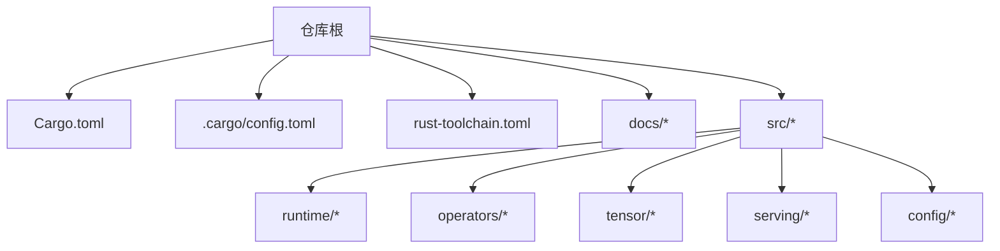
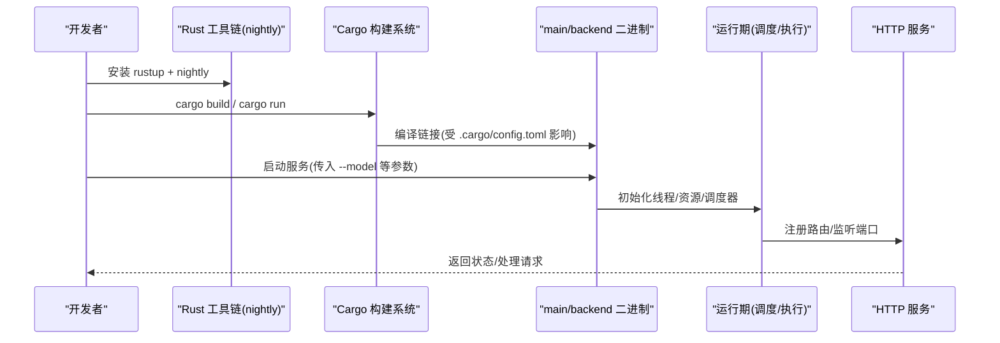
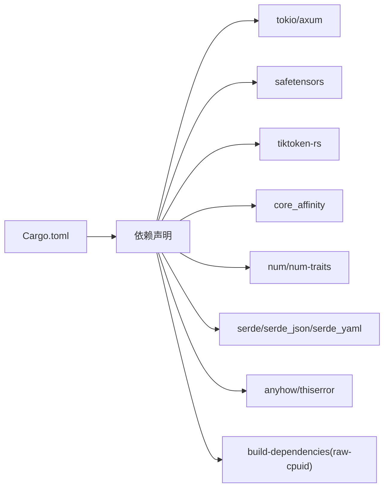

# 开发环境搭建

<cite>
**本文引用的文件**   
- [README.md](file://README.md)
- [Cargo.toml](file://Cargo.toml)
- [rust-toolchain.toml](file://rust-toolchain.toml)
- [.cargo/config.toml](file://.cargo/config.toml)
- [安装指南](file://docs/getting_started/installation.md)
- [快速开始](file://docs/getting_started/quickstart.md)
- [环境变量](file://docs/configuration/env_vars.md)
- [优化配置](file://docs/configuration/optimization.md)
- [运行时线程配置](file://src/runtime/config.rs)
- [生成配置（SIMD 对齐）](file://src/config/generation_config.rs)
- [服务模块入口](file://src/serving/mod.rs)
- [CLI 参数与配置类型](file://src/config/command_line_interface.rs)
- [配置校验器](file://src/config/config_validator.rs)
</cite>

## 目录
1. [简介](#简介)
2. [项目结构](#项目结构)
3. [核心组件](#核心组件)
4. [架构总览](#架构总览)
5. [详细组件分析](#详细组件分析)
6. [依赖关系分析](#依赖关系分析)
7. [性能考虑](#性能考虑)
8. [故障排查指南](#故障排查指南)
9. [结论](#结论)
10. [附录](#附录)

## 简介
本指南面向希望在本地或服务器环境中搭建 eLLM 开发环境的工程师，覆盖 Rust 工具链安装、构建系统使用、IDE/编辑器推荐配置、调试与性能分析工具、常见问题排查以及跨平台注意事项。eLLM 是纯 CPU 推理框架，目标在 x86_64 平台上利用 AVX-512/AVX2 等 SIMD 能力获得更优的端到端延迟与吞吐表现。

## 项目结构
仓库采用 Cargo 工程组织，包含库 crate、多个二进制可执行文件、对齐测试脚本与文档。关键位置：
- 根级 Cargo 清单定义包名、crate 类型、依赖、profile 与 dev-dependencies
- .cargo/config.toml 设置全局构建选项（关闭增量编译、启用 target-cpu=native）
- rust-toolchain.toml 锁定 nightly 工具链通道
- docs 提供安装、快速开始与环境变量说明
- src 下包含运行期、算子、张量、内存管理、服务层等模块

图表来源
- [Cargo.toml:1-102](file://Cargo.toml#L1-L102)
- [.cargo/config.toml:1-4](file://.cargo/config.toml#L1-L4)
- [rust-toolchain.toml:1-3](file://rust-toolchain.toml#L1-L3)

章节来源
- [安装指南:1-90](file://docs/getting_started/installation.md#L1-L90)
- [快速开始:1-125](file://docs/getting_started/quickstart.md#L1-L125)

## 核心组件
- 构建系统与依赖管理
  - Cargo 清单定义了库与二进制产物、依赖项、发布/开发 profile 及特性开关
  - 通过 .cargo/config.toml 统一构建行为，确保针对本机 CPU 指令集优化
  - 使用 nightly 工具链以启用 f16 等实验性语言特性
- 运行期与服务
  - 服务层暴露 OpenAI 兼容接口，负责请求解析、调度与执行
  - 运行期负责模型加载、会话管理、调度与执行池
- 配置与校验
  - CLI 参数与环境变量共同决定运行行为
  - 配置校验器对必填字段与一致性进行约束

章节来源
- [Cargo.toml:1-102](file://Cargo.toml#L1-L102)
- [.cargo/config.toml:1-4](file://.cargo/config.toml#L1-L4)
- [rust-toolchain.toml:1-3](file://rust-toolchain.toml#L1-L3)
- [服务模块入口:1-15](file://src/serving/mod.rs#L1-L15)
- [CLI 参数与配置类型:273-309](file://src/config/command_line_interface.rs#L273-L309)
- [配置校验器:1-43](file://src/config/config_validator.rs#L1-L43)

## 架构总览
下图展示了从源码到可执行服务的整体流程：工具链与 Cargo 驱动构建，.cargo 配置影响编译器标志，最终产出 main/backend 等二进制；服务启动后读取环境变量与 CLI 参数，初始化运行期并对外提供服务。

图表来源
- [安装指南:1-90](file://docs/getting_started/installation.md#L1-L90)
- [.cargo/config.toml:1-4](file://.cargo/config.toml#L1-L4)
- [服务模块入口:1-15](file://src/serving/mod.rs#L1-L15)

## 详细组件分析

### Rust 工具链与构建系统
- 工具链要求
  - 使用 nightly 通道（由 rust-toolchain.toml 指定），以启用 f16 等特性
  - 最低版本建议遵循官方安装文档（1.78+），但实际以 nightly 为准
- 构建配置
  - .cargo/config.toml 中设置 target-cpu=native，最大化本机 SIMD/FMA 收益
  - 关闭增量编译以稳定发布版性能
  - Cargo.toml 中 release profile 开启 LTO(fat)、单 codegen-unit、strip 符号等
- 依赖管理
  - 生产依赖包括异步运行时、HTTP 框架、序列化、安全张量加载、CPU 亲和性等
  - 开发依赖包含基准测试、网络测试、临时文件等

章节来源
- [rust-toolchain.toml:1-3](file://rust-toolchain.toml#L1-L3)
- [.cargo/config.toml:1-4](file://.cargo/config.toml#L1-L4)
- [Cargo.toml:1-102](file://Cargo.toml#L1-L102)
- [安装指南:1-90](file://docs/getting_started/installation.md#L1-L90)

### IDE 与代码编辑器推荐配置
- VS Code
  - 扩展：rust-analyzer、CodeLLDB、crates、Error Lens、Better TOML
  - 工作区设置建议：
    - 启用 rust-analyzer 诊断与自动补全
    - 将默认工具链设置为 nightly（可通过 rustup default nightly）
    - 开启保存时格式化（rustfmt）
- CLion/RustRover
  - 集成 rust-analyzer 与 Cargo 任务
  - 配置外部工具调用 cargo test/bench
- 通用建议
  - 使用 rustfmt 与 clippy 作为代码风格与静态检查
  - 在 CI 中复用相同规则，保证团队一致性

[本节为通用实践，不直接分析具体文件]

### 调试工具与性能分析
- 调试
  - 使用 LLDB/GDB 配合 CodeLLDB 进行断点调试
  - 使用 cargo test 运行单元测试与集成测试
- 性能分析
  - Linux: perf、flamegraph、criterion（HTML 报告）
  - Windows: VTune、Visual Studio Profiler、perfview
  - 结合 release profile 获取真实性能数据
- 基准与对齐
  - 使用 dev-dependencies 中的 criterion 编写基准
  - alignment 目录下的 Python/Rust 脚本用于与参考实现对比

章节来源
- [Cargo.toml:85-92](file://Cargo.toml#L85-L92)
- [快速开始:1-125](file://docs/getting_started/quickstart.md#L1-L125)

### 环境变量与运行参数
- 主要环境变量
  - ELLM_BATCH_SIZE、ELLM_SEQUENCE_LENGTH、ELLM_CHUNK_SIZE、ELLM_SCHEDULE_TIMEOUT_MS
- 线程配置
  - 线程数由运行时根据可用 CPU 自动计算，区分 API 线程与阻塞线程
- 模型路径
  - 通过 CLI 参数 --model 指定模型目录

章节来源
- [环境变量:1-45](file://docs/configuration/env_vars.md#L1-L45)
- [运行时线程配置:62-104](file://src/runtime/config.rs#L62-L104)
- [快速开始:1-125](file://docs/getting_started/quickstart.md#L1-L125)

### 生成配置与 SIMD 对齐
- 生成配置中包含 top_k/top_k_simd 等参数
- 提供 avx512_simd_width 与 align_top_k 等方法，按数据类型对齐 top_k 以提升 SIMD 效率

章节来源
- [生成配置（SIMD 对齐）:81-108](file://src/config/generation_config.rs#L81-L108)

### 服务与调度
- 服务入口导出 initialize_serving_resources 与 run
- 调度策略与批大小、序列长度、chunk 大小等参数密切相关
- 低延迟场景建议减小 chunk_size，高吞吐场景增大 batch_size 与 chunk_size

章节来源
- [服务模块入口:1-15](file://src/serving/mod.rs#L1-L15)
- [优化配置:1-61](file://docs/configuration/optimization.md#L1-L61)

## 依赖关系分析
- 构建期依赖
  - raw-cpuid 用于构建期检测 CPU 能力
- 运行期依赖
  - tokio/axum 提供异步运行时与 HTTP 服务
  - safetensors 加载权重
  - tiktoken-rs 处理分词
  - core_affinity 绑定线程到物理核
- 开发期依赖
  - criterion 基准测试
  - tower/hyper/futures-util 用于测试与流式处理

图表来源
- [Cargo.toml:42-92](file://Cargo.toml#L42-L92)

章节来源
- [Cargo.toml:1-102](file://Cargo.toml#L1-L102)

## 性能考虑
- 构建优化
  - release profile 已启用 opt-level=3、fat LTO、单 codegen-unit、strip 符号
  - .cargo/config.toml 设置 target-cpu=native，充分利用本机 SIMD/FMA
- 运行时调优
  - 降低 ELLM_CHUNK_SIZE 可减少首 token 延迟
  - 提高 ELLM_BATCH_SIZE 与 ELLM_CHUNK_SIZE 可提升吞吐
  - 长上下文需增大 ELLM_SEQUENCE_LENGTH，注意内存线性增长
- 线程与亲和性
  - 自动计算物理核数量，合理分配 API 与阻塞线程
  - 使用 core_affinity 固定线程到物理核，减少迁移开销

章节来源
- [Cargo.toml:69-81](file://Cargo.toml#L69-L81)
- [.cargo/config.toml:1-4](file://.cargo/config.toml#L1-L4)
- [环境变量:1-45](file://docs/configuration/env_vars.md#L1-L45)
- [运行时线程配置:62-104](file://src/runtime/config.rs#L62-L104)

## 故障排查指南
- 无法编译或找不到 nightly 特性
  - 确认 rustup 已安装且当前 channel 为 nightly
  - 若未安装 nightly，执行 rustup install nightly 并设为默认
- 构建速度慢或结果不稳定
  - 检查 .cargo/config.toml 是否意外启用了增量编译
  - 发布构建建议使用 cargo build --release
- 运行时崩溃或段错误
  - 检查 CPU 是否支持 AVX-512；不支持时将回退至标量路径
  - 确认模型目录结构与必要文件齐全
- 服务端口占用或无法访问
  - 检查 8000 端口是否被占用
  - 查看 /status 接口返回的状态信息
- 环境变量未生效
  - 确认在进程启动前正确 export 环境变量
  - 对照环境变量文档核对键名与取值范围

章节来源
- [安装指南:1-90](file://docs/getting_started/installation.md#L1-L90)
- [快速开始:1-125](file://docs/getting_started/quickstart.md#L1-L125)
- [环境变量:1-45](file://docs/configuration/env_vars.md#L1-L45)

## 结论
通过正确的工具链与构建配置、合理的依赖管理与运行参数调优，可以在 x86_64 平台上充分发挥 eLLM 的 CPU 优势。建议在发布构建中使用 release profile 与 native 目标 CPU，并结合 perf/criterion 等工具持续评估与优化。

[本节为总结性内容，不直接分析具体文件]

## 附录

### 常见环境问题与解决方案
- 缺少 nightly 工具链
  - 现象：编译报错提示需要 f16 等特性
  - 解决：安装并切换至 nightly
- 构建时间过长
  - 现象：首次构建耗时久
  - 解决：使用 release 模式并关闭增量编译（已在 .cargo/config.toml 中设置）
- 性能不达预期
  - 现象：推理延迟偏高
  - 解决：调整 ELLM_CHUNK_SIZE 与 ELLM_BATCH_SIZE；确认 target-cpu=native 生效
- 模型加载失败
  - 现象：启动时报错找不到配置文件或权重
  - 解决：确认 models/<name>/ 下存在 config.json、generation_config.json、model.safetensors 与 tokenizer.json

章节来源
- [安装指南:1-90](file://docs/getting_started/installation.md#L1-L90)
- [.cargo/config.toml:1-4](file://.cargo/config.toml#L1-L4)
- [环境变量:1-45](file://docs/configuration/env_vars.md#L1-L45)

### 跨平台开发与特定平台配置
- 平台支持
  - 官方测试平台：Linux(Ubuntu 22.04) 与 Windows(Windows 11)
  - 架构：x86_64，优先 AVX-512，支持 AVX2 标量回退
- 特定平台注意事项
  - Linux
    - 使用 perf/flamegraph 进行性能剖析
    - 注意 NUMA 与 cgroup 限制对线程亲和性的影响
  - Windows
    - 使用 VTune/VS Profiler 进行分析
    - 注意文件系统路径与权限问题
- 交叉编译
  - 如需为目标平台交叉编译，需安装对应目标工具链并在 Cargo 中指定 target
  - 注意 SIMD 特性在不同目标上的可用性差异

章节来源
- [安装指南:1-90](file://docs/getting_started/installation.md#L1-L90)
- [README.md:20-31](file://README.md#L20-L31)