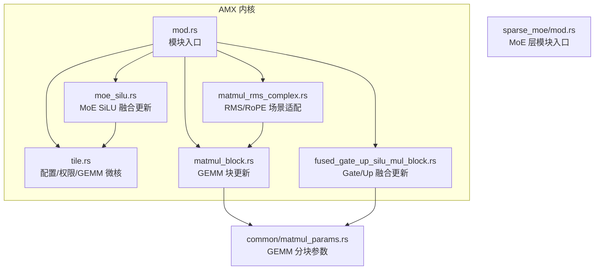
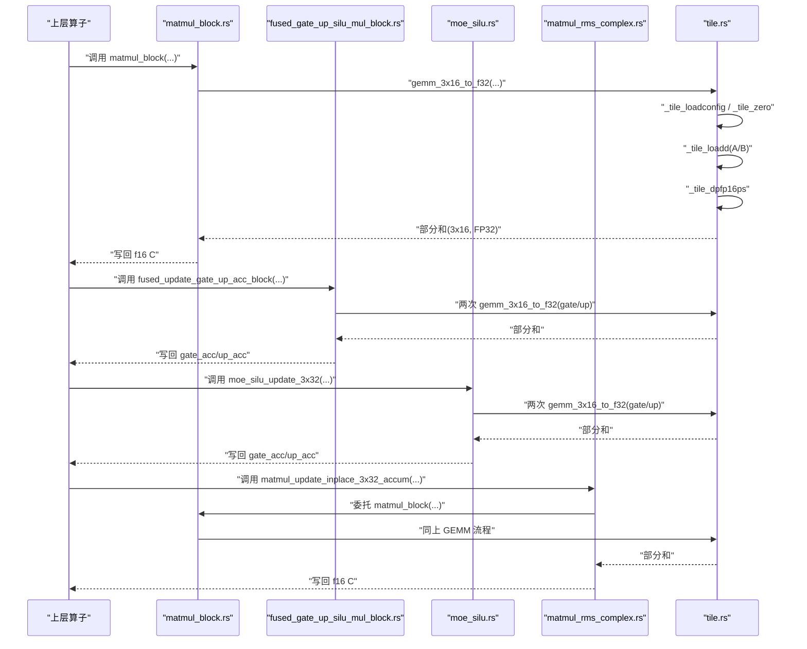
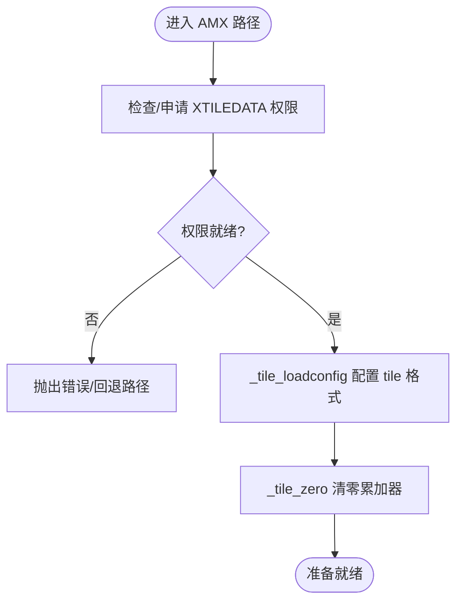
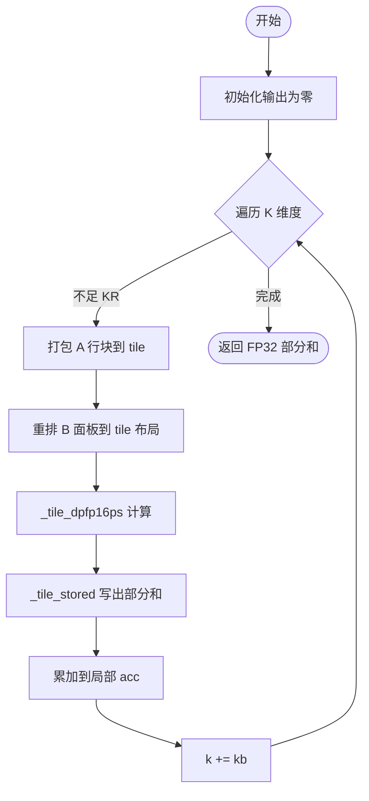
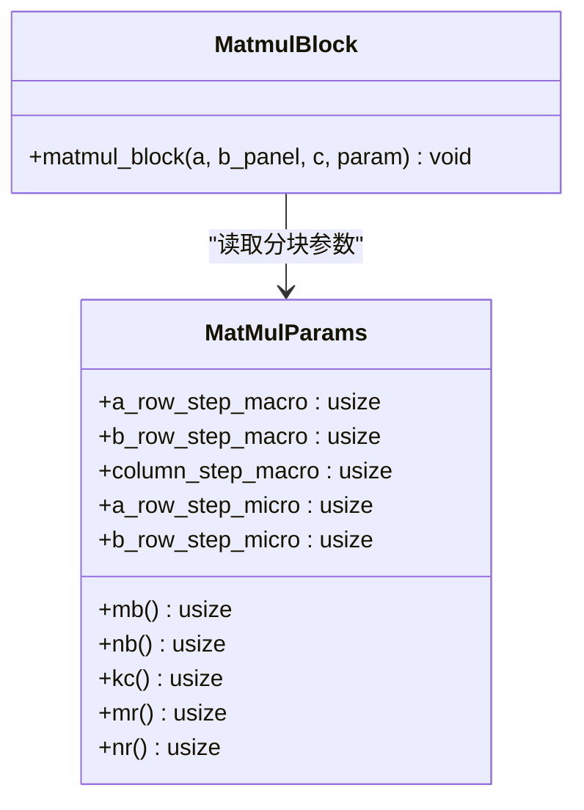
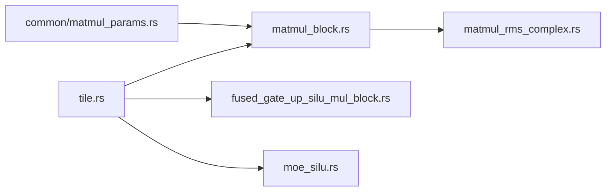

# AMX 张量数学加速

<cite>
**本文引用的文件**   
- [src/kernel/x86_64/f16_amx/mod.rs](file://src/kernel/x86_64/f16_amx/mod.rs)
- [src/kernel/x86_64/f16_amx/tile.rs](file://src/kernel/x86_64/f16_amx/tile.rs)
- [src/kernel/x86_64/f16_amx/matmul_block.rs](file://src/kernel/x86_64/f16_amx/matmul_block.rs)
- [src/kernel/x86_64/f16_amx/moe_silu.rs](file://src/kernel/x86_64/f16_amx/moe_silu.rs)
- [src/kernel/x86_64/f16_amx/fused_gate_up_silu_mul_block.rs](file://src/kernel/x86_64/f16_amx/fused_gate_up_silu_mul_block.rs)
- [src/kernel/x86_64/f16_amx/matmul_rms_complex.rs](file://src/kernel/x86_64/f16_amx/matmul_rms_complex.rs)
- [src/kernel/common/matmul_params.rs](file://src/kernel/common/matmul_params.rs)
- [src/transformer/sparse_moe/mod.rs](file://src/transformer/sparse_moe/mod.rs)
</cite>

## 目录
1. [简介](#简介)
2. [项目结构](#项目结构)
3. [核心组件](#核心组件)
4. [架构总览](#架构总览)
5. [详细组件分析](#详细组件分析)
6. [依赖关系分析](#依赖关系分析)
7. [性能考量](#性能考量)
8. [故障排查指南](#故障排查指南)
9. [结论](#结论)
10. [附录](#附录)

## 简介
本指南聚焦于在 x86_64 平台上使用 Intel AMX（Advanced Matrix Extensions）进行 FP16 张量数学加速，结合仓库中的实现，系统阐述：
- AMX 指令集与 tile 数据模型的基本工作原理
- tile 数据的加载、计算与存储流程（_tile_loadconfig、_tile_loadd、_tile_dpfp16ps、_tile_stored、_tile_zero、_tile_release）
- 在专家混合网络（MoE）与前馈网络（FFN）中的优化应用
- 大规模矩阵运算的调用路径与示例化用法（以代码片段路径替代具体代码）
- 与传统 SIMD（如 AVX512）的性能对比与选型建议
- 调试工具与性能分析方法

## 项目结构
AMX 相关实现集中在 src/kernel/x86_64/f16_amx 下，提供面向 GEMM 与 MoE 融合算子的内核；通用参数定义位于 src/kernel/common。



图示来源
- [src/kernel/x86_64/f16_amx/mod.rs:1-6](file://src/kernel/x86_64/f16_amx/mod.rs#L1-L6)
- [src/kernel/x86_64/f16_amx/tile.rs:1-168](file://src/kernel/x86_64/f16_amx/tile.rs#L1-L168)
- [src/kernel/x86_64/f16_amx/matmul_block.rs:1-172](file://src/kernel/x86_64/f16_amx/matmul_block.rs#L1-L172)
- [src/kernel/x86_64/f16_amx/fused_gate_up_silu_mul_block.rs:1-156](file://src/kernel/x86_64/f16_amx/fused_gate_up_silu_mul_block.rs#L1-156)
- [src/kernel/x86_64/f16_amx/moe_silu.rs:1-127](file://src/kernel/x86_64/f16_amx/moe_silu.rs#L1-L127)
- [src/kernel/x86_64/f16_amx/matmul_rms_complex.rs:1-84](file://src/kernel/x86_64/f16_amx/matmul_rms_complex.rs#L1-L84)
- [src/kernel/common/matmul_params.rs:1-36](file://src/kernel/common/matmul_params.rs#L1-L36)
- [src/transformer/sparse_moe/mod.rs:1-9](file://src/transformer/sparse_moe/mod.rs#L1-L9)

章节来源
- [src/kernel/x86_64/f16_amx/mod.rs:1-6](file://src/kernel/x86_64/f16_amx/mod.rs#L1-L6)
- [src/kernel/common/matmul_params.rs:1-36](file://src/kernel/common/matmul_params.rs#L1-L36)

## 核心组件
- AMX Tile 配置与权限管理
  - 通过 _tile_loadconfig 设置 tile 格式（FP16 dot-product），并通过系统调用申请 XTILEDATA 权限。
  - 关键函数路径：[ensure_amx_ready:94-101](file://src/kernel/x86_64/f16_amx/tile.rs#L94-L101)、[request_amx_permission:59-92](file://src/kernel/x86_64/f16_amx/tile.rs#L59-L92)。
- AMX GEMM 微核
  - 将 A 行块与 B 面板按 tile 布局装载，执行 _tile_dpfp16ps 累加到 FP32 部分结果，再写回。
  - 关键函数路径：[gemm_3x16_to_f32:103-167](file://src/kernel/x86_64/f16_amx/tile.rs#L103-L167)。
- GEMM 块更新封装
  - 将 micro-kernel 包装为面向上层算子的 matmul_block，负责两半 3x16 的拼接与 f16 累加。
  - 关键函数路径：[matmul_block:17-51](file://src/kernel/x86_64/f16_amx/matmul_block.rs#L17-L51)。
- MoE 融合更新
  - 针对 gate/up 分支并行做 GEMM 累加，SiLU 等逐元素操作保留在 AVX512 路径。
  - 关键函数路径：[moe_silu_update_3x32:11-63](file://src/kernel/x86_64/f16_amx/moe_silu.rs#L11-L63)。
- Gate/Up 融合更新
  - 与 MoE 类似，但作为独立接口供其他融合算子复用。
  - 关键函数路径：[fused_update_gate_up_acc_block:13-71](file://src/kernel/x86_64/f16_amx/fused_gate_up_silu_mul_block.rs#L13-L71)。
- RMS/RoPE 场景适配
  - 将 matmul_block 嵌入到更复杂的复合算子中，仅替换 GEMM 部分。
  - 关键函数路径：[matmul_update_inplace_3x32_accum:13-31](file://src/kernel/x86_64/f16_amx/matmul_rms_complex.rs#L13-L31)。
- GEMM 分块参数
  - 统一描述 MR/NR/KC 与宏步长，便于上层调度。
  - 关键类型路径：[MatMulParams:1-36](file://src/kernel/common/matmul_params.rs#L1-L36)。

章节来源
- [src/kernel/x86_64/f16_amx/tile.rs:1-168](file://src/kernel/x86_64/f16_amx/tile.rs#L1-L168)
- [src/kernel/x86_64/f16_amx/matmul_block.rs:1-172](file://src/kernel/x86_64/f16_amx/matmul_block.rs#L1-L172)
- [src/kernel/x86_64/f16_amx/moe_silu.rs:1-127](file://src/kernel/x86_64/f16_amx/moe_silu.rs#L1-L127)
- [src/kernel/x86_64/f16_amx/fused_gate_up_silu_mul_block.rs:1-156](file://src/kernel/x86_64/f16_amx/fused_gate_up_silu_mul_block.rs#L1-156)
- [src/kernel/x86_64/f16_amx/matmul_rms_complex.rs:1-84](file://src/kernel/x86_64/f16_amx/matmul_rms_complex.rs#L1-L84)
- [src/kernel/common/matmul_params.rs:1-36](file://src/kernel/common/matmul_params.rs#L1-L36)

## 架构总览
下图展示了从高层算子到 AMX 微内核的调用链与数据流向。



图示来源
- [src/kernel/x86_64/f16_amx/matmul_block.rs:17-51](file://src/kernel/x86_64/f16_amx/matmul_block.rs#L17-L51)
- [src/kernel/x86_64/f16_amx/fused_gate_up_silu_mul_block.rs:13-71](file://src/kernel/x86_64/f16_amx/fused_gate_up_silu_mul_block.rs#L13-L71)
- [src/kernel/x86_64/f16_amx/moe_silu.rs:11-63](file://src/kernel/x86_64/f16_amx/moe_silu.rs#L11-L63)
- [src/kernel/x86_64/f16_amx/matmul_rms_complex.rs:13-31](file://src/kernel/x86_64/f16_amx/matmul_rms_complex.rs#L13-L31)
- [src/kernel/x86_64/f16_amx/tile.rs:103-167](file://src/kernel/x86_64/f16_amx/tile.rs#L103-L167)

## 详细组件分析

### AMX Tile 配置与权限
- 功能要点
  - 设置 tile palette 为 FP16 dot-product，并配置 rows/colsb。
  - Linux 下通过 arch_prctl 请求 XTILEDATA 权限，非 Linux 默认放行。
  - 提供 ensure_amx_ready 断言可用后再进入 AMX 路径。
- 关键路径
  - [TileConfig::fp16_dot_product:39-57](file://src/kernel/x86_64/f16_amx/tile.rs#L39-L57)
  - [request_amx_permission:59-92](file://src/kernel/x86_64/f16_amx/tile.rs#L59-L92)
  - [ensure_amx_ready:94-101](file://src/kernel/x86_64/f16_amx/tile.rs#L94-L101)



图示来源
- [src/kernel/x86_64/f16_amx/tile.rs:59-101](file://src/kernel/x86_64/f16_amx/tile.rs#L59-L101)

章节来源
- [src/kernel/x86_64/f16_amx/tile.rs:1-101](file://src/kernel/x86_64/f16_amx/tile.rs#L1-L101)

### AMX GEMM 微内核（tile.rs）
- 数据布局
  - A 取 3×kc 行块，B 取 kc×32 面板并按 pair-interleaved 重排后装入 tile。
  - 累加在 FP32 中进行，避免溢出与精度损失。
- 指令序列
  - _tile_loadconfig → _tile_zero → _tile_loadd(A/B) → _tile_dpfp16ps → _tile_stored → _tile_release
- 关键路径
  - [gemm_3x16_to_f32:103-167](file://src/kernel/x86_64/f16_amx/tile.rs#L103-L167)



图示来源
- [src/kernel/x86_64/f16_amx/tile.rs:103-167](file://src/kernel/x86_64/f16_amx/tile.rs#L103-L167)

章节来源
- [src/kernel/x86_64/f16_amx/tile.rs:103-167](file://src/kernel/x86_64/f16_amx/tile.rs#L103-L167)

### GEMM 块更新（matmul_block.rs）
- 职责
  - 将两个 3×16 半块的结果合并为 3×32，并与已有 f16 C 相加。
  - 通过 MatMulParams 传入 MR/NR/KC 与宏步长。
- 关键路径
  - [matmul_block:17-51](file://src/kernel/x86_64/f16_amx/matmul_block.rs#L17-L51)
  - [MatMulParams:1-36](file://src/kernel/common/matmul_params.rs#L1-L36)



图示来源
- [src/kernel/x86_64/f16_amx/matmul_block.rs:17-51](file://src/kernel/x86_64/f16_amx/matmul_block.rs#L17-L51)
- [src/kernel/common/matmul_params.rs:1-36](file://src/kernel/common/matmul_params.rs#L1-L36)

章节来源
- [src/kernel/x86_64/f16_amx/matmul_block.rs:1-172](file://src/kernel/x86_64/f16_amx/matmul_block.rs#L1-L172)
- [src/kernel/common/matmul_params.rs:1-36](file://src/kernel/common/matmul_params.rs#L1-L36)

### MoE 融合更新（moe_silu.rs）
- 设计思路
  - 对 gate/up 两个分支分别调用 GEMM 微核，得到 FP32 部分和后写回 f16 累加缓冲区。
  - SiLU 激活保持 AVX512 路径，减少跨域切换开销。
- 关键路径
  - [moe_silu_update_3x32:11-63](file://src/kernel/x86_64/f16_amx/moe_silu.rs#L11-L63)

```mermaid
sequenceDiagram
participant Up as "上层"
participant MS as "moe_silu.rs"
participant T as "tile.rs"
Up->>MS : "moe_silu_update_3x32(a, gate_panel, up_panel, ...)"
MS->>T : "gemm_3x16_to_f32(gate)"
T-->>MS : "acc_g"
MS->>T : "gemm_3x16_to_f32(up)"
T-->>MS : "acc_u"
MS-->>Up : "gate_acc += acc_g; up_acc += acc_u"
```

图示来源
- [src/kernel/x86_64/f16_amx/moe_silu.rs:11-63](file://src/kernel/x86_64/f16_amx/moe_silu.rs#L11-L63)
- [src/kernel/x86_64/f16_amx/tile.rs:103-167](file://src/kernel/x86_64/f16_amx/tile.rs#L103-L167)

章节来源
- [src/kernel/x86_64/f16_amx/moe_silu.rs:1-127](file://src/kernel/x86_64/f16_amx/moe_silu.rs#L1-L127)

### Gate/Up 融合更新（fused_gate_up_silu_mul_block.rs）
- 用途
  - 为需要同时更新 gate/up 的融合算子提供统一接口。
- 关键路径
  - [fused_update_gate_up_acc_block:13-71](file://src/kernel/x86_64/f16_amx/fused_gate_up_silu_mul_block.rs#L13-L71)

章节来源
- [src/kernel/x86_64/f16_amx/fused_gate_up_silu_mul_block.rs:1-156](file://src/kernel/x86_64/f16_amx/fused_gate_up_silu_mul_block.rs#L1-L156)

### RMS/RoPE 场景适配（matmul_rms_complex.rs）
- 思路
  - 将 matmul_block 嵌入到包含 RMSNorm/RoPE 的复合算子中，仅替换 GEMM 部分。
- 关键路径
  - [matmul_update_inplace_3x32_accum:13-31](file://src/kernel/x86_64/f16_amx/matmul_rms_complex.rs#L13-L31)

章节来源
- [src/kernel/x86_64/f16_amx/matmul_rms_complex.rs:1-84](file://src/kernel/x86_64/f16_amx/matmul_rms_complex.rs#L1-L84)

### MoE 层集成（sparse_moe/mod.rs）
- 角色
  - 暴露 SparseMoe 模块入口，组织路由与专家层的组合。
- 关键路径
  - [sparse_moe/mod.rs:1-9](file://src/transformer/sparse_moe/mod.rs#L1-L9)

章节来源
- [src/transformer/sparse_moe/mod.rs:1-9](file://src/transformer/sparse_moe/mod.rs#L1-L9)

## 依赖关系分析
- 模块内聚与耦合
  - tile.rs 提供底层能力，被 matmul_block、moe_silu、fused_gate_up_silu_mul_block、matmul_rms_complex 复用，内聚良好。
  - matmul_block 依赖 common/matmul_params 抽象分块参数，降低耦合度。
- 外部依赖
  - 仅依赖标准库与 x86_64 intrinsics，无第三方运行时依赖。
- 潜在循环依赖
  - 当前结构无循环依赖。



图示来源
- [src/kernel/x86_64/f16_amx/tile.rs:1-168](file://src/kernel/x86_64/f16_amx/tile.rs#L1-L168)
- [src/kernel/x86_64/f16_amx/matmul_block.rs:1-172](file://src/kernel/x86_64/f16_amx/matmul_block.rs#L1-L172)
- [src/kernel/x86_64/f16_amx/fused_gate_up_silu_mul_block.rs:1-156](file://src/kernel/x86_64/f16_amx/fused_gate_up_silu_mul_block.rs#L1-L156)
- [src/kernel/x86_64/f16_amx/moe_silu.rs:1-127](file://src/kernel/x86_64/f16_amx/moe_silu.rs#L1-L127)
- [src/kernel/x86_64/f16_amx/matmul_rms_complex.rs:1-84](file://src/kernel/x86_64/f16_amx/matmul_rms_complex.rs#L1-L84)
- [src/kernel/common/matmul_params.rs:1-36](file://src/kernel/common/matmul_params.rs#L1-L36)

章节来源
- [src/kernel/x86_64/f16_amx/mod.rs:1-6](file://src/kernel/x86_64/f16_amx/mod.rs#L1-L6)
- [src/kernel/common/matmul_params.rs:1-36](file://src/kernel/common/matmul_params.rs#L1-L36)

## 性能考量
- 何时选择 AMX
  - 当存在较大 KC 且 MR/NR 匹配 tile 粒度（如 3×32）时，AMX 能显著降低访存压力并提高吞吐。
  - 对于逐元素或短向量操作，AVX512 通常更优。
- 内存布局与打包
  - B 面板需按 pair-interleaved 布局以便 _tile_dpfp16ps 高效消费；A 行块尽量连续访问。
- 累加精度
  - 内部使用 FP32 累加，最终写回 f16，兼顾数值稳定与带宽节省。
- 分支融合
  - 在 MoE/FFN 中将多个 GEMM 与激活融合，减少中间写入与缓存抖动。
- 调参建议
  - 根据 KC 尾数调整 pack 策略，避免多余零填充。
  - 合理划分 macro/micro 步长，使 tile 利用率最大化。

[本节为通用指导，不直接分析具体文件]

## 故障排查指南
- 常见错误
  - 未启用 amx-tile/amx-fp16 特性导致跳过或崩溃：确保目标平台支持并在编译/运行环境启用相应特性。
  - 线程未获得 XTILEDATA 权限：Linux 下需成功调用 arch_prctl 请求权限。
- 定位方法
  - 使用 is_x86_feature_detected!("amx-tile") 与 is_x86_feature_detected!("amx-fp16") 快速判断。
  - 在 ensure_amx_ready 处添加日志，确认权限获取是否成功。
- 参考路径
  - [ensure_amx_ready:94-101](file://src/kernel/x86_64/f16_amx/tile.rs#L94-L101)
  - [request_amx_permission:59-92](file://src/kernel/x86_64/f16_amx/tile.rs#L59-L92)
  - [测试用例中的特性检测:71-76](file://src/kernel/x86_64/f16_amx/matmul_block.rs#L71-L76)

章节来源
- [src/kernel/x86_64/f16_amx/tile.rs:59-101](file://src/kernel/x86_64/f16_amx/tile.rs#L59-L101)
- [src/kernel/x86_64/f16_amx/matmul_block.rs:71-76](file://src/kernel/x86_64/f16_amx/matmul_block.rs#L71-L76)

## 结论
本项目在 x86_64 上实现了基于 AMX-FP16 的张量加速内核，围绕 tile 数据模型提供了稳定的 GEMM 微核，并将其无缝集成到 MoE 与 FFN 的融合算子中。通过合理的内存布局、FP32 累加与融合策略，可在大规模矩阵运算中获得可观的吞吐提升。建议在具备 AMX 特性的平台上优先采用该路径，并结合具体工作负载进行参数调优。

[本节为总结性内容，不直接分析具体文件]

## 附录

### 典型调用示例（以路径代替代码）
- 基础 GEMM 块更新
  - 入口：[matmul_block:17-51](file://src/kernel/x86_64/f16_amx/matmul_block.rs#L17-L51)
  - 参数：[MatMulParams:1-36](file://src/kernel/common/matmul_params.rs#L1-L36)
- MoE 融合更新
  - 入口：[moe_silu_update_3x32:11-63](file://src/kernel/x86_64/f16_amx/moe_silu.rs#L11-L63)
- Gate/Up 融合更新
  - 入口：[fused_update_gate_up_acc_block:13-71](file://src/kernel/x86_64/f16_amx/fused_gate_up_silu_mul_block.rs#L13-L71)
- RMS/RoPE 场景
  - 入口：[matmul_update_inplace_3x32_accum:13-31](file://src/kernel/x86_64/f16_amx/matmul_rms_complex.rs#L13-L31)

### 与传统 SIMD 的对比与选型
- AMX 优势
  - 高吞吐的矩阵乘，适合大 KC 与固定 micro-kernel 形状。
  - 低访存压力，tile 直读直算。
- AVX512 优势
  - 灵活度高，适合逐元素、短向量与不规则形状。
- 选型建议
  - 大矩阵乘法优先 AMX；逐元素/小矩阵优先 AVX512。
  - 融合多算子以减少中间写入，最大化 AMX 收益。

[本节为通用指导，不直接分析具体文件]

### 调试与性能分析
- 特性检测
  - 使用 is_x86_feature_detected!("amx-tile") 与 is_x86_feature_detected!("amx-fp16") 进行运行时判断。
- 权限与配置
  - 关注 ensure_amx_ready 与 _tile_loadconfig 的执行路径。
- 基准与回归
  - 利用各模块内的单元测试验证数值误差范围与边界情况（如 KC 尾部）。
- 参考路径
  - [特性检测与测试:71-76](file://src/kernel/x86_64/f16_amx/matmul_block.rs#L71-L76)
  - [权限检查:94-101](file://src/kernel/x86_64/f16_amx/tile.rs#L94-L101)

章节来源
- [src/kernel/x86_64/f16_amx/matmul_block.rs:71-76](file://src/kernel/x86_64/f16_amx/matmul_block.rs#L71-L76)
- [src/kernel/x86_64/f16_amx/tile.rs:94-101](file://src/kernel/x86_64/f16_amx/tile.rs#L94-L101)