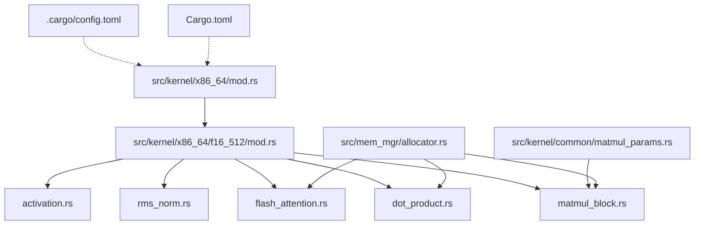
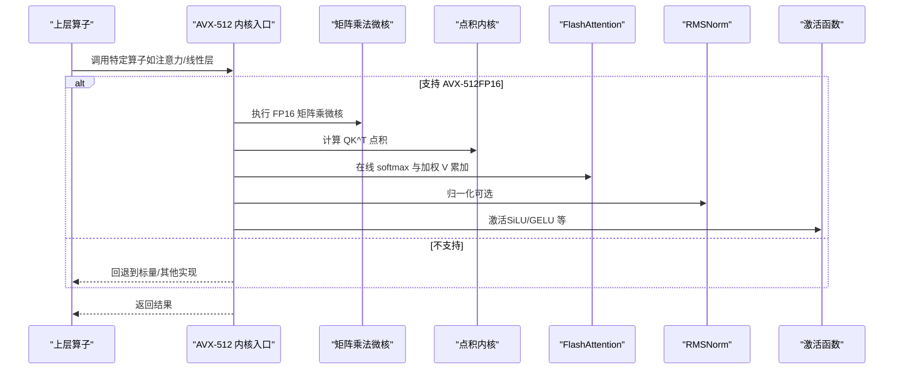
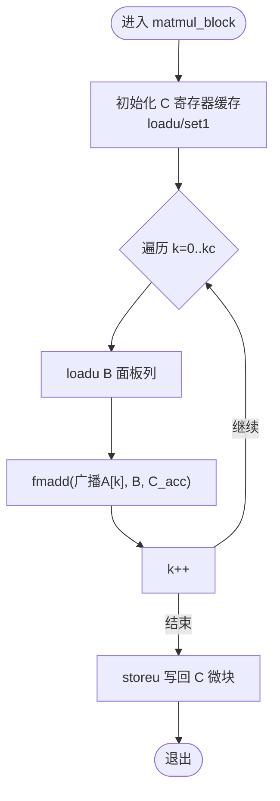
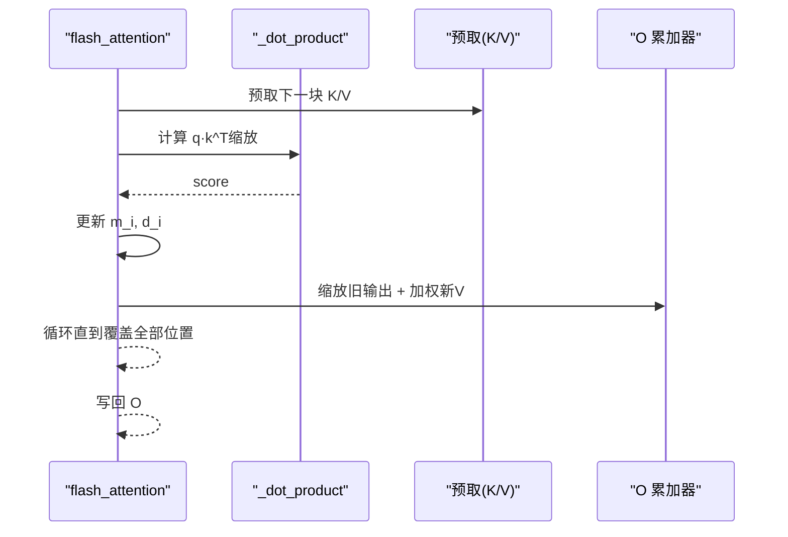
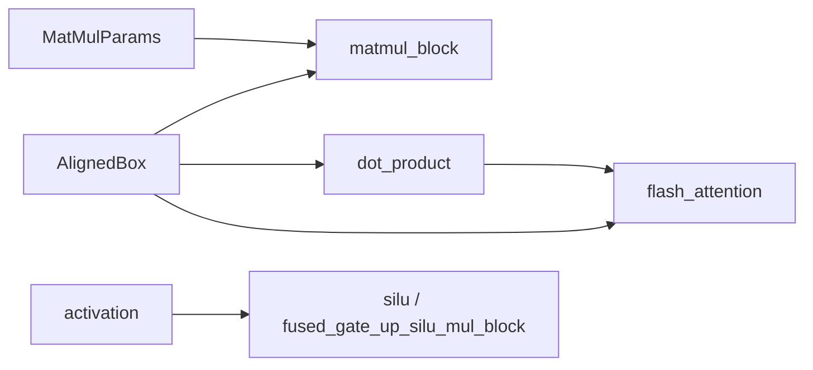

# AVX-512 指令集优化

<cite>
**本文引用的文件列表**
- [src/kernel/x86_64/mod.rs](file://src/kernel/x86_64/mod.rs)
- [src/kernel/x86_64/f16_512/mod.rs](file://src/kernel/x86_64/f16_512/mod.rs)
- [src/kernel/x86_64/f16_512/matmul_block.rs](file://src/kernel/x86_64/f16_512/matmul_block.rs)
- [src/kernel/x86_64/f16_512/dot_product.rs](file://src/kernel/x86_64/f16_512/dot_product.rs)
- [src/kernel/x86_64/f16_512/flash_attention.rs](file://src/kernel/x86_64/f16_512/flash_attention.rs)
- [src/kernel/x86_64/f16_512/rms_norm.rs](file://src/kernel/x86_64/f16_512/rms_norm.rs)
- [src/kernel/x86_64/f16_512/activation.rs](file://src/kernel/x86_64/f16_512/activation.rs)
- [src/kernel/common/matmul_params.rs](file://src/kernel/common/matmul_params.rs)
- [src/mem_mgr/allocator.rs](file://src/mem_mgr/allocator.rs)
- [.cargo/config.toml](file://.cargo/config.toml)
- [Cargo.toml](file://Cargo.toml)
</cite>

## 目录
1. [简介](#简介)
2. [项目结构](#项目结构)
3. [核心组件](#核心组件)
4. [架构总览](#架构总览)
5. [详细组件分析](#详细组件分析)
6. [依赖关系分析](#依赖关系分析)
7. [性能考量](#性能考量)
8. [故障排查指南](#故障排查指南)
9. [结论](#结论)
10. [附录](#附录)

## 简介
本指南聚焦于在 Rust 中使用 std::arch::x86_64 模块访问 AVX-512 内在函数，特别是 FP16（half）数据路径的优化实践。仓库中已包含大量面向 x86_64 的 AVX-512FP16 内核实现，涵盖矩阵乘法微核、点积、激活函数、RMSNorm、FlashAttention 等关键算子。本文将系统梳理这些实现的设计模式、数据流与性能特性，并给出条件编译与运行时特性检测的最佳实践，帮助开发者在不同硬件上获得稳定且高性能的推理体验。

## 项目结构
本项目将 x86_64 SIMD 内核按目标特征组织：
- src/kernel/x86_64/mod.rs：统一暴露 f16_512、f16_amx、f32_256 等后端模块。
- src/kernel/x86_64/f16_512/mod.rs：集中声明所有 FP16 + AVX-512 的内核模块。
- src/kernel/x86_64/f16_512/*：具体内核实现，如 matmul_block、dot_product、flash_attention、rms_norm、activation 等。
- src/kernel/common/*：通用参数与工具，例如 MatMulParams。
- src/mem_mgr/allocator.rs：提供 64B 对齐内存分配器，适配 AVX-512 向量化加载/存储。
- .cargo/config.toml：构建时启用 -C target-cpu=native，最大化利用本机 CPU 特性。
- Cargo.toml：发布配置开启 LTO、单 codegen-unit 等优化选项。

图表来源
- [src/kernel/x86_64/mod.rs:1-4](file://src/kernel/x86_64/mod.rs#L1-L4)
- [src/kernel/x86_64/f16_512/mod.rs:1-17](file://src/kernel/x86_64/f16_512/mod.rs#L1-L17)
- [src/kernel/x86_64/f16_512/matmul_block.rs:1-236](file://src/kernel/x86_64/f16_512/matmul_block.rs#L1-L236)
- [src/kernel/x86_64/f16_512/dot_product.rs:1-59](file://src/kernel/x86_64/f16_512/dot_product.rs#L1-L59)
- [src/kernel/x86_64/f16_512/flash_attention.rs:1-286](file://src/kernel/x86_64/f16_512/flash_attention.rs#L1-L286)
- [src/kernel/x86_64/f16_512/rms_norm.rs:1-257](file://src/kernel/x86_64/f16_512/rms_norm.rs#L1-L257)
- [src/kernel/x86_64/f16_512/activation.rs:1-238](file://src/kernel/x86_64/f16_512/activation.rs#L1-L238)
- [src/kernel/common/matmul_params.rs:1-36](file://src/kernel/common/matmul_params.rs#L1-L36)
- [src/mem_mgr/allocator.rs:1-156](file://src/mem_mgr/allocator.rs#L1-L156)
- [.cargo/config.toml:1-3](file://.cargo/config.toml#L1-L3)
- [Cargo.toml:69-81](file://Cargo.toml#L69-L81)

章节来源
- [src/kernel/x86_64/mod.rs:1-4](file://src/kernel/x86_64/mod.rs#L1-L4)
- [src/kernel/x86_64/f16_512/mod.rs:1-17](file://src/kernel/x86_64/f16_512/mod.rs#L1-L17)
- [src/kernel/common/matmul_params.rs:1-36](file://src/kernel/common/matmul_params.rs#L1-L36)
- [src/mem_mgr/allocator.rs:1-156](file://src/mem_mgr/allocator.rs#L1-L156)
- [.cargo/config.toml:1-3](file://.cargo/config.toml#L1-L3)
- [Cargo.toml:69-81](file://Cargo.toml#L69-L81)

## 核心组件
- 矩阵乘法微核（FP16 + AVX-512）
  - 使用 _mm512_fmadd_ph 进行乘加融合，结合 _mm512_set1_ph 广播标量，逐列累加到寄存器缓存，最后写回。
  - 通过 MatMulParams 描述 micro/macro tile 步长，便于上层分块调度。
- 点积（FP16 + AVX-512）
  - 使用 _mm512_load_ph 与 _mm512_reduce_add_ph 完成向量内积归约。
- FlashAttention（FP16 + AVX-512）
  - 基于在线 softmax 的稳定数值实现，使用预取与向量化缩放/加权累加。
- RMSNorm（FP16 + AVX-512）
  - 提供多种变体：纯标量版本与若干向量化辅助函数（平方和、最大绝对值、缩放平方和）。
- 激活函数（FP16 + AVX-512）
  - exp/tanh/sigmoid 的半精度近似实现，采用范围裁剪与多项式拟合，兼顾稳定性与速度。

章节来源
- [src/kernel/x86_64/f16_512/matmul_block.rs:1-236](file://src/kernel/x86_64/f16_512/matmul_block.rs#L1-L236)
- [src/kernel/x86_64/f16_512/dot_product.rs:1-59](file://src/kernel/x86_64/f16_512/dot_product.rs#L1-L59)
- [src/kernel/x86_64/f16_512/flash_attention.rs:1-286](file://src/kernel/x86_64/f16_512/flash_attention.rs#L1-L286)
- [src/kernel/x86_64/f16_512/rms_norm.rs:1-257](file://src/kernel/x86_64/f16_512/rms_norm.rs#L1-L257)
- [src/kernel/x86_64/f16_512/activation.rs:1-238](file://src/kernel/x86_64/f16_512/activation.rs#L1-L238)
- [src/kernel/common/matmul_params.rs:1-36](file://src/kernel/common/matmul_params.rs#L1-L36)

## 架构总览
下图展示了从高层模块到 AVX-512 内核的数据与控制流。上层算子根据运行时特性选择最优实现；若不支持 AVX-512FP16，则回退至标量或更宽向量实现。

图表来源
- [src/kernel/x86_64/f16_512/matmul_block.rs:1-236](file://src/kernel/x86_64/f16_512/matmul_block.rs#L1-L236)
- [src/kernel/x86_64/f16_512/dot_product.rs:1-59](file://src/kernel/x86_64/f16_512/dot_product.rs#L1-L59)
- [src/kernel/x86_64/f16_512/flash_attention.rs:1-286](file://src/kernel/x86_64/f16_512/flash_attention.rs#L1-L286)
- [src/kernel/x86_64/f16_512/rms_norm.rs:1-257](file://src/kernel/x86_64/f16_512/rms_norm.rs#L1-L257)
- [src/kernel/x86_64/f16_512/activation.rs:1-238](file://src/kernel/x86_64/f16_512/activation.rs#L1-L238)

## 详细组件分析

### 矩阵乘法微核（FP16 + AVX-512）
- 设计要点
  - 使用 _mm512_fmadd_ph 做乘加融合，减少中间写入与访存压力。
  - 使用 _mm512_set1_ph 广播行元素，配合 _mm512_loadu_ph/_mm512_storeu_ph 处理非对齐数据。
  - 以 MR×NR 的微块（如 3×32）为粒度，KC 为归约维度，lda/ldc 控制宏步长。
- 复杂度与吞吐
  - 时间复杂度 O(M·N·K)，空间局部性良好，寄存器缓存降低访存带宽压力。
  - 对 KC 循环展开与分支裁剪（mr>0/1/2）有助于提升流水线效率。
- 兼容性
  - 测试中使用 is_x86_feature_detected!("avx512fp16") 跳过不支持的硬件。
  - 上层多处使用 #[cfg(all(target_arch = "x86_64", target_feature = "avx512fp16"))] 进行编译期分支。

图表来源
- [src/kernel/x86_64/f16_512/matmul_block.rs:22-85](file://src/kernel/x86_64/f16_512/matmul_block.rs#L22-L85)
- [src/kernel/common/matmul_params.rs:1-36](file://src/kernel/common/matmul_params.rs#L1-L36)

章节来源
- [src/kernel/x86_64/f16_512/matmul_block.rs:1-236](file://src/kernel/x86_64/f16_512/matmul_block.rs#L1-L236)
- [src/kernel/common/matmul_params.rs:1-36](file://src/kernel/common/matmul_params.rs#L1-L36)

### 点积（FP16 + AVX-512）
- 关键点
  - 使用 _mm512_load_ph 与 _mm512_fmadd_ph 累积，最终 _mm512_reduce_add_ph 归约。
  - 适用于 QK^T 等场景，注意输入需满足 32 字节对齐以获得最佳性能。
- 精度
  - 内部以 f16 累加，必要时可在上层转换为 f32 再归约以降低误差。

章节来源
- [src/kernel/x86_64/f16_512/dot_product.rs:1-59](file://src/kernel/x86_64/f16_512/dot_product.rs#L1-L59)

### FlashAttention（FP16 + AVX-512）
- 算法流程
  - 在线 softmax：维护运行最大值 m_i 与分母 d_i，逐步合并新块的最大值与权重。
  - 使用 _mm_prefetch 预取 K/V 数据，减少缓存缺失。
  - 向量化缩放输出与加权累加 V，避免多次全局写。
- 数值稳定性
  - 通过 m_i 与 d_i 的递推更新，避免指数溢出。
  - 使用 f16 的 exp 近似与 clamp 策略保证范围合理。

图表来源
- [src/kernel/x86_64/f16_512/flash_attention.rs:31-93](file://src/kernel/x86_64/f16_512/flash_attention.rs#L31-L93)
- [src/kernel/x86_64/f16_512/dot_product.rs:1-59](file://src/kernel/x86_64/f16_512/dot_product.rs#L1-L59)

章节来源
- [src/kernel/x86_64/f16_512/flash_attention.rs:1-286](file://src/kernel/x86_64/f16_512/flash_attention.rs#L1-L286)
- [src/kernel/x86_64/f16_512/dot_product.rs:1-59](file://src/kernel/x86_64/f16_512/dot_product.rs#L1-L59)

### RMSNorm（FP16 + AVX-512）
- 实现要点
  - 提供 sum_square、max_abs、scaled_sum_square 等向量化辅助函数。
  - 主路径 rms_norm/add_rms_norm 使用标量循环以保证数值一致性，同时提供 norm 向量化缩放。
- 适用场景
  - Transformer 解码器层的归一化，常与残差相加组合。

章节来源
- [src/kernel/x86_64/f16_512/rms_norm.rs:1-257](file://src/kernel/x86_64/f16_512/rms_norm.rs#L1-L257)

### 激活函数（FP16 + AVX-512）
- 实现要点
  - exp512：范围裁剪 + 分段 ln2 分解 + 多项式拟合 + 重建 2^n。
  - tanh512/sigmoid512：基于 exp 的稳定形式，位操作恢复符号。
- 精度与稳定性
  - 使用 fnmadd 提高中间精度，clamp 防止溢出。
  - 测试容忍度控制在 f16 级别。

章节来源
- [src/kernel/x86_64/f16_512/activation.rs:1-238](file://src/kernel/x86_64/f16_512/activation.rs#L1-L238)

## 依赖关系分析
- 模块耦合
  - f16_512 模块内部相互引用（如 flash_attention 依赖 dot_product）。
  - 上层算子通过 MatMulParams 与微核解耦，便于替换不同 MR/NR/KC 配置。
- 外部依赖
  - 构建期通过 .cargo/config.toml 的 -C target-cpu=native 启用本机优化。
  - 发布配置启用 LTO、单 codegen-unit，有利于跨模块内联与优化。

图表来源
- [src/kernel/common/matmul_params.rs:1-36](file://src/kernel/common/matmul_params.rs#L1-L36)
- [src/kernel/x86_64/f16_512/matmul_block.rs:1-236](file://src/kernel/x86_64/f16_512/matmul_block.rs#L1-L236)
- [src/kernel/x86_64/f16_512/dot_product.rs:1-59](file://src/kernel/x86_64/f16_512/dot_product.rs#L1-L59)
- [src/kernel/x86_64/f16_512/flash_attention.rs:1-286](file://src/kernel/x86_64/f16_512/flash_attention.rs#L1-L286)
- [src/kernel/x86_64/f16_512/activation.rs:1-238](file://src/kernel/x86_64/f16_512/activation.rs#L1-L238)
- [src/mem_mgr/allocator.rs:1-156](file://src/mem_mgr/allocator.rs#L1-L156)

章节来源
- [src/kernel/common/matmul_params.rs:1-36](file://src/kernel/common/matmul_params.rs#L1-L36)
- [src/mem_mgr/allocator.rs:1-156](file://src/mem_mgr/allocator.rs#L1-L156)
- [.cargo/config.toml:1-3](file://.cargo/config.toml#L1-L3)
- [Cargo.toml:69-81](file://Cargo.toml#L69-L81)

## 性能考量
- 内存对齐
  - 使用 64B 对齐分配器 AlignedBox，确保 _mm512_load_ph/_mm512_store_ph 高效执行。
- 预取与缓存
  - FlashAttention 中使用 _mm_prefetch(_MM_HINT_T2) 提前加载 K/V，降低延迟。
- 寄存器缓存与访存
  - 矩阵乘法微核将 C 累加保留在寄存器，减少写回次数；仅在微块结束时 storeu。
- 编译与链接优化
  - release 配置开启 opt-level=3、lto=fat、codegen-units=1，最大化跨模块优化。
- 数据类型与精度
  - FP16 路径优先，但在需要更高精度的归约处可转 f32 后再截断回 f16。

[本节为通用指导，不直接分析具体文件]

## 故障排查指南
- 特性检测与回退
  - 使用 is_x86_feature_detected!("avx512fp16") 在运行时判断是否启用 AVX-512FP16 路径。
  - 使用 #[cfg(all(target_arch = "x86_64", target_feature = "avx512fp16"))] 在编译期生成对应分支。
- 常见错误
  - 未对齐访问导致崩溃：确保使用 _mm512_loadu_ph/_mm512_storeu_ph 或在分配时使用 64B 对齐。
  - 数值不稳定：检查 exp/clamp 范围与在线 softmax 的 m_i/d_i 更新逻辑。
- 调试建议
  - 在小规模数据上对比标量参考实现，定位差异。
  - 打印中间向量（借助 _mm512_storeu_ph 转切片）观察数值分布。

章节来源
- [src/kernel/x86_64/f16_512/matmul_block.rs:87-155](file://src/kernel/x86_64/f16_512/matmul_block.rs#L87-L155)
- [src/kernel/x86_64/f16_512/flash_attention.rs:211-286](file://src/kernel/x86_64/f16_512/flash_attention.rs#L211-L286)
- [src/kernel/x86_64/f16_512/activation.rs:117-238](file://src/kernel/x86_64/f16_512/activation.rs#L117-L238)
- [src/mem_mgr/allocator.rs:1-156](file://src/mem_mgr/allocator.rs#L1-L156)

## 结论
本项目在 FP16 + AVX-512 方向提供了完整而实用的内核集合，覆盖了矩阵乘法、注意力、归一化与激活等关键路径。通过合理的微块设计、寄存器缓存、预取与对齐策略，以及严谨的特性检测与回退机制，能够在支持 AVX-512FP16 的硬件上获得显著加速，同时在旧硬件上保持稳定可用。建议在后续迭代中进一步扩展更多 MR/NR/KC 组合的微核，并结合基准测试持续调优。

[本节为总结性内容，不直接分析具体文件]

## 附录

### 关键 AVX-512 内在函数速查（FP16）
- 加载/存储
  - _mm512_loadu_ph / _mm512_storeu_ph：非对齐加载/存储
  - _mm512_load_ph / _mm512_store_ph：对齐加载/存储（推荐用于 64B 对齐数据）
- 算术与融合
  - _mm512_fmadd_ph(a, b, c)：c += a*b（融合乘加）
  - _mm512_mul_ph / _mm512_add_ph / _mm512_div_ph：基本运算
  - _mm512_set1_ph(x)：广播标量
- 归约与比较
  - _mm512_reduce_add_ph / _mm512_reduce_max_ph：向量归约
  - _mm512_max_ph / _mm512_min_ph / _mm512_abs_ph：比较/绝对值
- 预取
  - _mm_prefetch(addr, _MM_HINT_T2)：提示预取

章节来源
- [src/kernel/x86_64/f16_512/matmul_block.rs:1-85](file://src/kernel/x86_64/f16_512/matmul_block.rs#L1-L85)
- [src/kernel/x86_64/f16_512/dot_product.rs:1-59](file://src/kernel/x86_64/f16_512/dot_product.rs#L1-L59)
- [src/kernel/x86_64/f16_512/flash_attention.rs:1-93](file://src/kernel/x86_64/f16_512/flash_attention.rs#L1-L93)
- [src/kernel/x86_64/f16_512/rms_norm.rs:1-86](file://src/kernel/x86_64/f16_512/rms_norm.rs#L1-L86)
- [src/kernel/x86_64/f16_512/activation.rs:1-116](file://src/kernel/x86_64/f16_512/activation.rs#L1-L116)