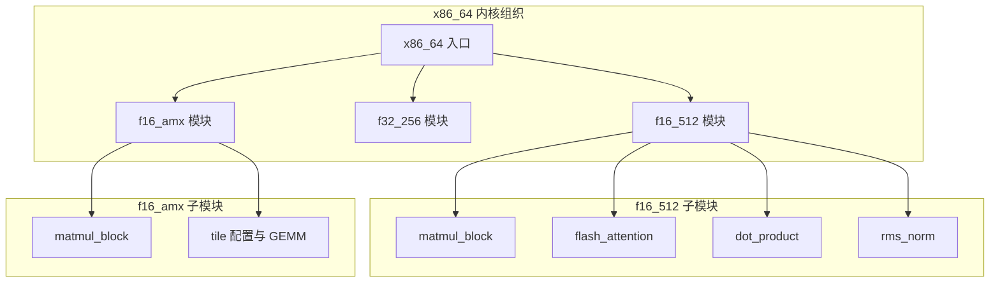
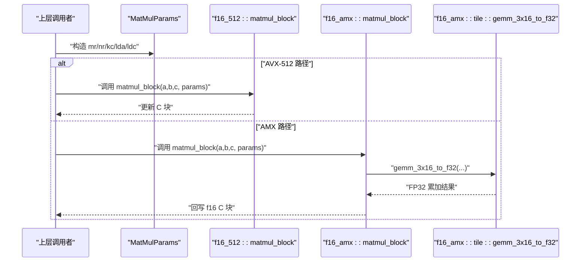
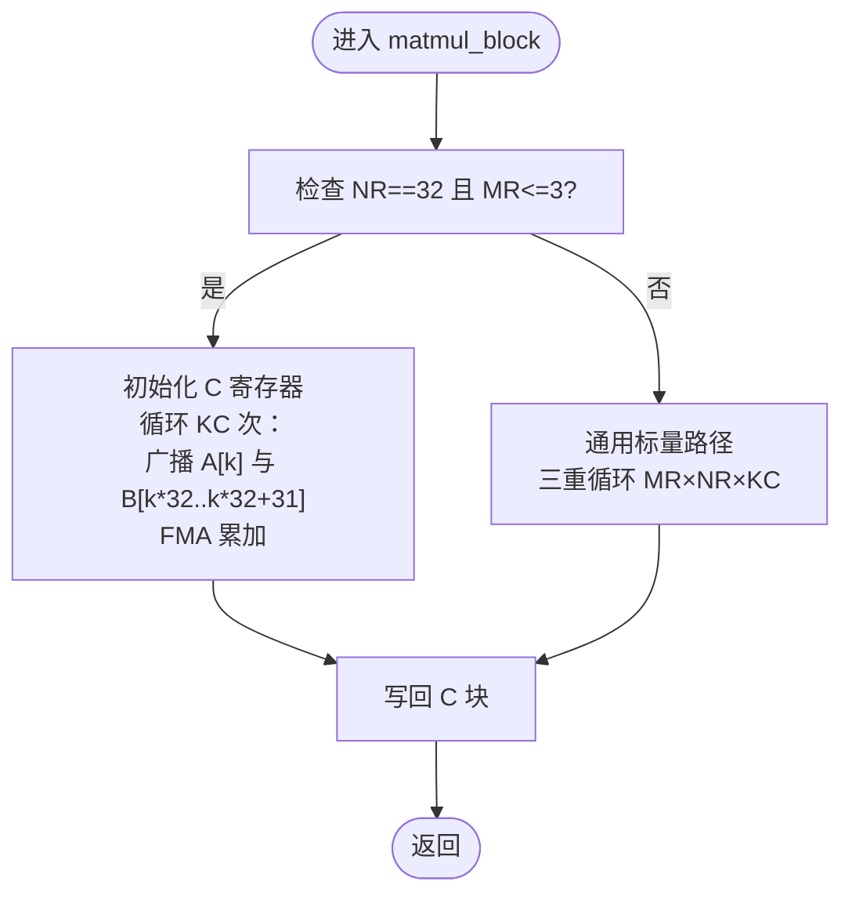
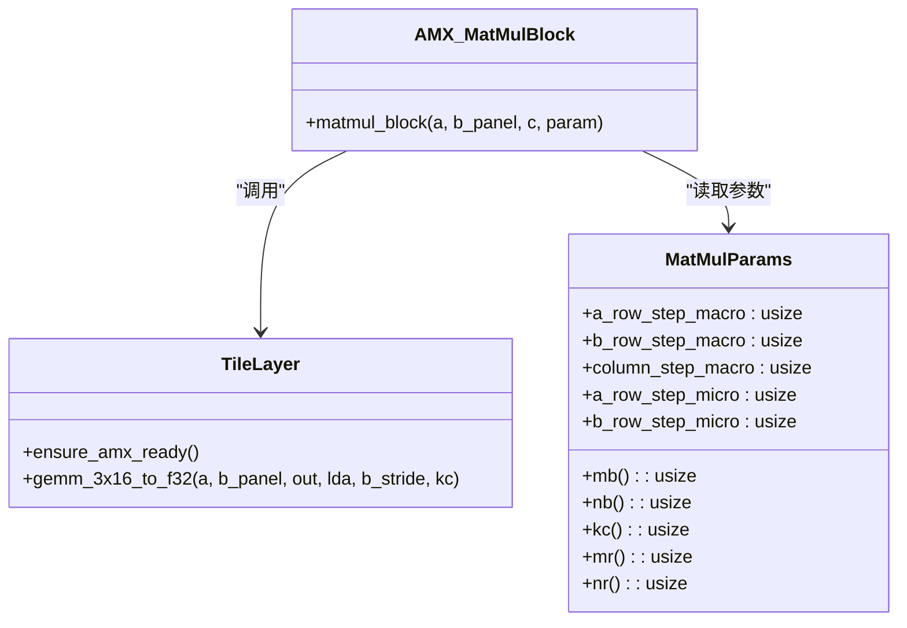
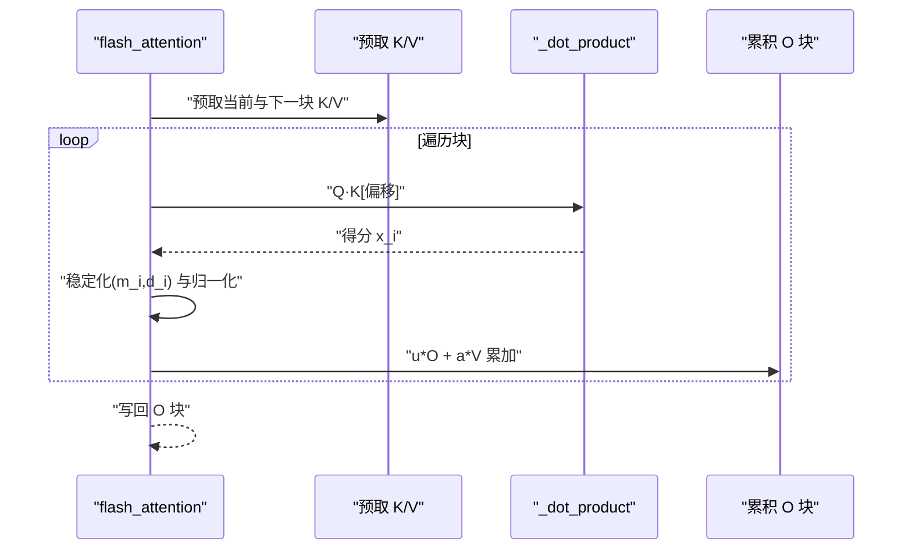
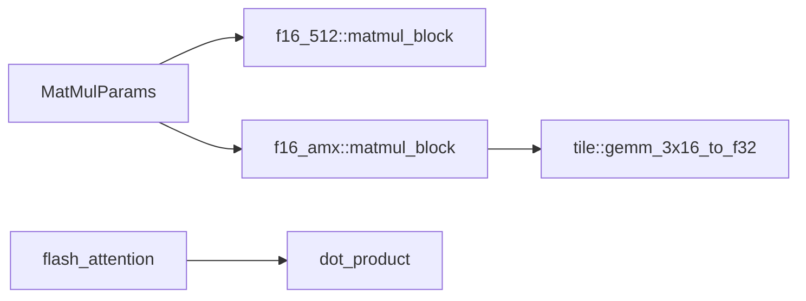

# SIMD 内核优化

<cite>
**本文引用的文件**   
- [src/kernel/x86_64/mod.rs](file://src/kernel/x86_64/mod.rs)
- [src/kernel/x86_64/f16_512/mod.rs](file://src/kernel/x86_64/f16_512/mod.rs)
- [src/kernel/x86_64/f32_256/mod.rs](file://src/kernel/x86_64/f32_256/mod.rs)
- [src/kernel/x86_64/f16_amx/mod.rs](file://src/kernel/x86_64/f16_amx/mod.rs)
- [src/kernel/common/matmul_params.rs](file://src/kernel/common/matmul_params.rs)
- [src/kernel/x86_64/f16_512/matmul_block.rs](file://src/kernel/x86_64/f16_512/matmul_block.rs)
- [src/kernel/x86_64/f16_amx/matmul_block.rs](file://src/kernel/x86_64/f16_amx/matmul_block.rs)
- [src/kernel/x86_64/f16_amx/tile.rs](file://src/kernel/x86_64/f16_amx/tile.rs)
- [src/kernel/x86_64/f16_512/flash_attention.rs](file://src/kernel/x86_64/f16_512/flash_attention.rs)
- [src/kernel/x86_64/f16_512/dot_product.rs](file://src/kernel/x86_64/f16_512/dot_product.rs)
- [src/kernel/x86_64/f16_512/rms_norm.rs](file://src/kernel/x86_64/f16_512/rms_norm.rs)
- [src/kernel/x86_64/f32_256/activation.rs](file://src/kernel/x86_64/f32_256/activation.rs)
- [src/mem_mgr/allocator.rs](file://src/mem_mgr/allocator.rs)
</cite>

## 目录
1. [简介](#简介)
2. [项目结构](#项目结构)
3. [核心组件](#核心组件)
4. [架构总览](#架构总览)
5. [详细组件分析](#详细组件分析)
6. [依赖关系分析](#依赖关系分析)
7. [性能与内存对齐](#性能与内存对齐)
8. [平台特定优化与特性检测](#平台特定优化与特性检测)
9. [调试与性能分析指南](#调试与性能分析指南)
10. [结论](#结论)

## 简介
本指南聚焦于在 x86_64 CPU 上利用 AVX-512 与 AMX 指令集进行高性能计算优化，覆盖 f16_512、f32_256 等数据路径的优化策略，以及矩阵乘法、注意力机制等复杂算子的实现要点。文档同时给出内存对齐要求（64 字节）与缓存局部性优化技巧，并说明如何编写平台特定的优化代码（条件编译与特性检测），最后提供性能分析与调试建议，帮助定位和消除瓶颈。

## 项目结构
本项目将 x86_64 平台的 SIMD 内核按数据类型与指令集划分到不同模块：
- f16_512：基于 AVX-512 FP16 的内核集合，包含矩阵块乘、FlashAttention、RMSNorm、激活函数等。
- f32_256：基于 AVX2 的 FP32 内核集合，包含激活函数等。
- f16_amx：基于 Intel AMX（Tile + FP16）的 GEMM 内核集合，使用 tile 寄存器与配置。

图表来源
- [src/kernel/x86_64/mod.rs:1-4](file://src/kernel/x86_64/mod.rs#L1-L4)
- [src/kernel/x86_64/f16_512/mod.rs:1-17](file://src/kernel/x86_64/f16_512/mod.rs#L1-L17)
- [src/kernel/x86_64/f32_256/mod.rs:1-5](file://src/kernel/x86_64/f32_256/mod.rs#L1-L5)
- [src/kernel/x86_64/f16_amx/mod.rs:1-6](file://src/kernel/x86_64/f16_amx/mod.rs#L1-L6)

章节来源
- [src/kernel/x86_64/mod.rs:1-4](file://src/kernel/x86_64/mod.rs#L1-L4)
- [src/kernel/x86_64/f16_512/mod.rs:1-17](file://src/kernel/x86_64/f16_512/mod.rs#L1-L17)
- [src/kernel/x86_64/f32_256/mod.rs:1-5](file://src/kernel/x86_64/f32_256/mod.rs#L1-L5)
- [src/kernel/x86_64/f16_amx/mod.rs:1-6](file://src/kernel/x86_64/f16_amx/mod.rs#L1-L6)

## 核心组件
- 矩阵乘法微核
  - f16_512::matmul_block：广播式 3×32 FP16 AVX-512 微核，使用 _mm512_fmadd_ph 累加，支持灵活 micro/macro 步长参数化。
  - f16_amx::matmul_block：AMX-FP16 版本，内部调用 tile 层 gemm_3x16_to_f32，分两半 3×16 计算后回写 f16 C。
- 注意力机制
  - f16_512::flash_attention：逐块扫描 KV，使用预取与向量归约，结合缩放与稳定化（max/denom）。
  - f16_512::block_flash_attention：分块注意力，维护 running_max/running_denom，按行处理可见窗口。
- 基础向量运算
  - f16_512::dot_product：AVX-512 FP16 点积，32 元素向量化累加。
  - f32_256::activation：AVX2 FP32 的 exp/tanh/sigmoid 近似实现。
- 归一化
  - f16_512::rms_norm：多种 RMSNorm 变体，含加权与残差融合版本。
- 内存管理
  - mem_mgr::AlignedBox：64 字节对齐分配器，适配 SIMD 512 访问模式。

章节来源
- [src/kernel/x86_64/f16_512/matmul_block.rs:1-236](file://src/kernel/x86_64/f16_512/matmul_block.rs#L1-L236)
- [src/kernel/x86_64/f16_amx/matmul_block.rs:1-172](file://src/kernel/x86_64/f16_amx/matmul_block.rs#L1-L172)
- [src/kernel/x86_64/f16_amx/tile.rs:1-168](file://src/kernel/x86_64/f16_amx/tile.rs#L1-L168)
- [src/kernel/x86_64/f16_512/flash_attention.rs:1-286](file://src/kernel/x86_64/f16_512/flash_attention.rs#L1-L286)
- [src/kernel/x86_64/f16_512/dot_product.rs:1-59](file://src/kernel/x86_64/f16_512/dot_product.rs#L1-L59)
- [src/kernel/x86_64/f32_256/activation.rs:1-64](file://src/kernel/x86_64/f32_256/activation.rs#L1-L64)
- [src/kernel/x86_64/f16_512/rms_norm.rs:1-257](file://src/kernel/x86_64/f16_512/rms_norm.rs#L1-L257)
- [src/mem_mgr/allocator.rs:1-156](file://src/mem_mgr/allocator.rs#L1-L156)

## 架构总览
下图展示了从高层模块到具体内核的路径选择与数据流。MatMulParams 作为统一参数载体，驱动不同后端（AVX-512 或 AMX）的微核执行。

图表来源
- [src/kernel/common/matmul_params.rs:1-36](file://src/kernel/common/matmul_params.rs#L1-L36)
- [src/kernel/x86_64/f16_512/matmul_block.rs:1-236](file://src/kernel/x86_64/f16_512/matmul_block.rs#L1-L236)
- [src/kernel/x86_64/f16_amx/matmul_block.rs:1-172](file://src/kernel/x86_64/f16_amx/matmul_block.rs#L1-L172)
- [src/kernel/x86_64/f16_amx/tile.rs:1-168](file://src/kernel/x86_64/f16_amx/tile.rs#L1-L168)

## 详细组件分析

### 矩阵乘法微核（f16_512）
- 设计要点
  - 采用 3×32 微核，MR=3、NR=32，KC 由参数传入，支持任意 lda/ldc 步长。
  - 使用 _mm512_fmadd_ph 做 fused multiply-add，减少中间存储与精度损失。
  - 对 B 面板采用 K×32 连续布局，便于顺序加载；A 按行访问，利于复用。
- 复杂度
  - 时间 O(MR·NR·KC)，空间 O(MR·NR) 累加寄存器。
- 优化机会
  - 当 NR=32 且 MR≤3 时走专用分支，避免循环开销。
  - 可考虑展开 KC 循环、利用硬件预取提示。

图表来源
- [src/kernel/x86_64/f16_512/matmul_block.rs:1-236](file://src/kernel/x86_64/f16_512/matmul_block.rs#L1-L236)

章节来源
- [src/kernel/x86_64/f16_512/matmul_block.rs:1-236](file://src/kernel/x86_64/f16_512/matmul_block.rs#L1-L236)

### 矩阵乘法微核（f16_amx）
- 设计要点
  - 通过 ensure_amx_ready() 确保线程拥有 AMX 权限。
  - 将 3×32 拆成两个 3×16 子块，分别调用 gemm_3x16_to_f32 得到 FP32 累加，再与原有 f16 C 相加回写。
  - tile 层负责将 A/B 装载至 tile 寄存器，执行 TDPFP16PS 指令。
- 数据布局
  - B 面板需满足 AMX pair-interleaved 布局约定，tile 层内完成重排与零填充。
- 复杂度
  - 时间 O(MR·NR·KC)，但受 tile 粒度 KR=32 与批处理影响，常数因子更优。

图表来源
- [src/kernel/common/matmul_params.rs:1-36](file://src/kernel/common/matmul_params.rs#L1-L36)
- [src/kernel/x86_64/f16_amx/matmul_block.rs:1-172](file://src/kernel/x86_64/f16_amx/matmul_block.rs#L1-L172)
- [src/kernel/x86_64/f16_amx/tile.rs:1-168](file://src/kernel/x86_64/f16_amx/tile.rs#L1-L168)

章节来源
- [src/kernel/x86_64/f16_amx/matmul_block.rs:1-172](file://src/kernel/x86_64/f16_amx/matmul_block.rs#L1-L172)
- [src/kernel/x86_64/f16_amx/tile.rs:1-168](file://src/kernel/x86_64/f16_amx/tile.rs#L1-L168)
- [src/kernel/common/matmul_params.rs:1-36](file://src/kernel/common/matmul_params.rs#L1-L36)

### FlashAttention（f16_512）
- 设计要点
  - 逐块扫描 KV，使用 _mm_prefetch 提前加载下一块 K/V，提升缓存命中。
  - 维护 m_i/d_i 稳定化变量，按块合并指数项，避免溢出。
  - 输出按 32 元素分块写入，充分利用 AVX-512 寄存器宽度。
- 关键流程
  - 计算 Q·K^T 得分 → 稳定化 → 权重归一化 → 加权 V 累加。

图表来源
- [src/kernel/x86_64/f16_512/flash_attention.rs:1-286](file://src/kernel/x86_64/f16_512/flash_attention.rs#L1-L286)
- [src/kernel/x86_64/f16_512/dot_product.rs:1-59](file://src/kernel/x86_64/f16_512/dot_product.rs#L1-L59)

章节来源
- [src/kernel/x86_64/f16_512/flash_attention.rs:1-286](file://src/kernel/x86_64/f16_512/flash_attention.rs#L1-L286)
- [src/kernel/x86_64/f16_512/dot_product.rs:1-59](file://src/kernel/x86_64/f16_512/dot_product.rs#L1-L59)

### RMSNorm（f16_512）
- 设计要点
  - 提供多种变体：标准 RMSNorm、单位权重、残差融合等。
  - 使用 AVX-512 向量归约求平方和，再乘以 rrms 与可选权重。
- 数值稳定性
  - 对全零输入直接置零输出，避免除零。

章节来源
- [src/kernel/x86_64/f16_512/rms_norm.rs:1-257](file://src/kernel/x86_64/f16_512/rms_norm.rs#L1-L257)

### 激活函数（f32_256）
- 设计要点
  - 使用 Cephes 多项式近似 exp(x)，并通过整数位操作构建 2^n 加速幂次。
  - tanh/sigmoid 基于 exp 组合实现，适合 AVX2 256bit 向量。

章节来源
- [src/kernel/x86_64/f32_256/activation.rs:1-64](file://src/kernel/x86_64/f32_256/activation.rs#L1-L64)

## 依赖关系分析
- 模块耦合
  - f16_amx::matmul_block 强依赖 tile 层与 AMX 权限检查。
  - f16_512::flash_attention 依赖 dot_product 与预取指令。
  - 所有内核共享 MatMulParams 作为参数契约。
- 外部依赖
  - 仅使用 std::arch::x86_64 内置 intrinsics 与系统调用（Linux 下 AMX 权限请求）。

图表来源
- [src/kernel/common/matmul_params.rs:1-36](file://src/kernel/common/matmul_params.rs#L1-L36)
- [src/kernel/x86_64/f16_512/matmul_block.rs:1-236](file://src/kernel/x86_64/f16_512/matmul_block.rs#L1-L236)
- [src/kernel/x86_64/f16_amx/matmul_block.rs:1-172](file://src/kernel/x86_64/f16_amx/matmul_block.rs#L1-L172)
- [src/kernel/x86_64/f16_amx/tile.rs:1-168](file://src/kernel/x86_64/f16_amx/tile.rs#L1-L168)
- [src/kernel/x86_64/f16_512/flash_attention.rs:1-286](file://src/kernel/x86_64/f16_512/flash_attention.rs#L1-L286)
- [src/kernel/x86_64/f16_512/dot_product.rs:1-59](file://src/kernel/x86_64/f16_512/dot_product.rs#L1-L59)

章节来源
- [src/kernel/common/matmul_params.rs:1-36](file://src/kernel/common/matmul_params.rs#L1-L36)
- [src/kernel/x86_64/f16_512/matmul_block.rs:1-236](file://src/kernel/x86_64/f16_512/matmul_block.rs#L1-L236)
- [src/kernel/x86_64/f16_amx/matmul_block.rs:1-172](file://src/kernel/x86_64/f16_amx/matmul_block.rs#L1-L172)
- [src/kernel/x86_64/f16_amx/tile.rs:1-168](file://src/kernel/x86_64/f16_amx/tile.rs#L1-L168)
- [src/kernel/x86_64/f16_512/flash_attention.rs:1-286](file://src/kernel/x86_64/f16_512/flash_attention.rs#L1-L286)
- [src/kernel/x86_64/f16_512/dot_product.rs:1-59](file://src/kernel/x86_64/f16_512/dot_product.rs#L1-L59)

## 性能与内存对齐
- 内存对齐
  - 使用 AlignedBox 进行 64 字节对齐分配，确保 AVX-512 对齐加载/存储的高效性与正确性。
  - 测试中验证地址模 64 为 0，保证 SIMD 最优路径。
- 缓存局部性
  - 矩阵乘法：B 面板按 K×NR 连续布局，A 按行访问，C 按行写回，最大化顺序访问与重用。
  - FlashAttention：使用 _mm_prefetch(_MM_HINT_T2) 提前加载后续 K/V 块，降低 L1/L2 缺失率。
- 数值与吞吐权衡
  - f16_512 微核以 FMA 为主，减少中间存储；AMX 路径借助 tile 寄存器批量计算，提高吞吐。
  - 小尾数场景（如瘦矩阵）更适合 CPU 的较大 L3 缓存与较低并行度需求。

章节来源
- [src/mem_mgr/allocator.rs:1-156](file://src/mem_mgr/allocator.rs#L1-L156)
- [src/kernel/x86_64/f16_512/matmul_block.rs:1-236](file://src/kernel/x86_64/f16_512/matmul_block.rs#L1-L236)
- [src/kernel/x86_64/f16_512/flash_attention.rs:1-286](file://src/kernel/x86_64/f16_512/flash_attention.rs#L1-L286)

## 平台特定优化与特性检测
- 条件编译与目标特性
  - AMX 内核使用 #[target_feature(enable = "amx-tile,amx-fp16")] 标记，仅在支持该特性的 CPU 上启用。
  - 运行时通过 is_x86_feature_detected!("avx512fp16") 与 is_x86_feature_detected!("amx-tile"/"amx-fp16") 进行特性检测，在不支持的平台上跳过测试或回退。
- AMX 权限获取（Linux）
  - 通过 arch_prctl 系统调用请求 XTILEDATA 权限，确保线程可使用 tile 寄存器。
- 最佳实践
  - 在高层根据运行时特性动态选择 f16_512 或 f16_amx 路径。
  - 对不支持的平台提供标量或 AVX2 回退实现，保证可移植性。

章节来源
- [src/kernel/x86_64/f16_amx/matmul_block.rs:1-172](file://src/kernel/x86_64/f16_amx/matmul_block.rs#L1-L172)
- [src/kernel/x86_64/f16_amx/tile.rs:1-168](file://src/kernel/x86_64/f16_amx/tile.rs#L1-L168)
- [src/kernel/x86_64/f16_512/matmul_block.rs:1-236](file://src/kernel/x86_64/f16_512/matmul_block.rs#L1-L236)

## 调试与性能分析指南
- 数值对齐与断言
  - 使用 debug_assert_eq! 校验 micro 步长与常量（如 AMX_MR/NR）一致，快速发现参数错误。
  - 单元测试中对小尺寸与边界 K 值（如非整倍数）进行断言，确保尾块处理正确。
- 性能剖析建议
  - 使用 perf 统计热点函数与指令级事件（如 cache-misses、fma 吞吐）。
  - 针对 FlashAttention 关注预取命中率与 L1/L2 缺失；针对 GEMM 关注寄存器压力与访存带宽。
- 常见陷阱
  - 未对齐访问导致性能退化或异常（确保使用 AlignedBox）。
  - AMX 权限未开启导致运行时 panic（确保 ensure_amx_ready 成功）。
  - 浮点误差累积（适当放宽 epsilon，或在关键路径使用更高精度累加）。

章节来源
- [src/kernel/x86_64/f16_amx/matmul_block.rs:1-172](file://src/kernel/x86_64/f16_amx/matmul_block.rs#L1-L172)
- [src/kernel/x86_64/f16_512/matmul_block.rs:1-236](file://src/kernel/x86_64/f16_512/matmul_block.rs#L1-L236)
- [src/mem_mgr/allocator.rs:1-156](file://src/mem_mgr/allocator.rs#L1-L156)

## 结论
通过在 f16_512 与 f16_amx 两条路径上分别实现高效的矩阵乘法与注意力内核，并结合 64 字节对齐与缓存友好的数据布局，eLLM 在 CPU 服务器上实现了高吞吐与低延迟的推理能力。对于长上下文场景，头-by-头的注意力执行与静态 KV 布局显著提升了缓存局部性；对于短上下文与小批次，CPU 的较大 L3 缓存与稳定的执行路径更具优势。建议在工程实践中依据运行时特性动态选择内核，配合严格的对齐与预取策略，持续优化端到端性能。