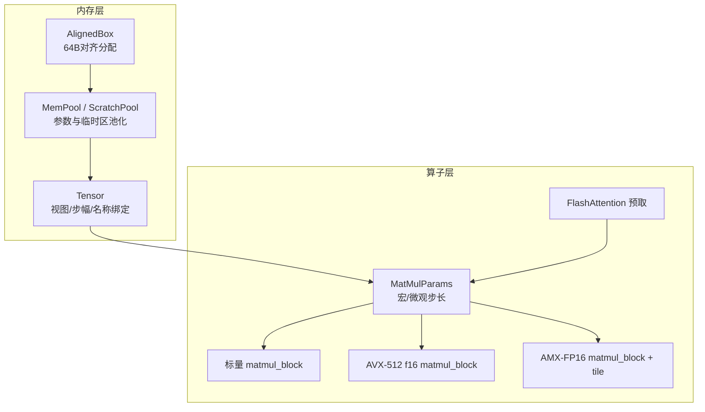
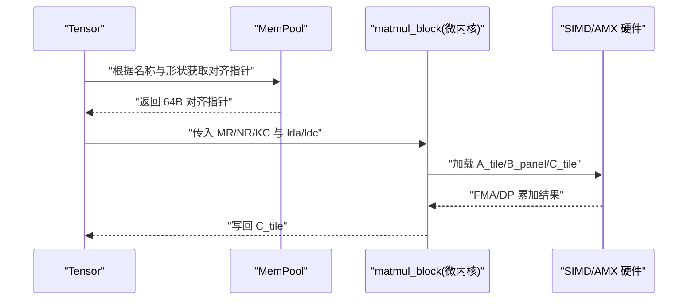
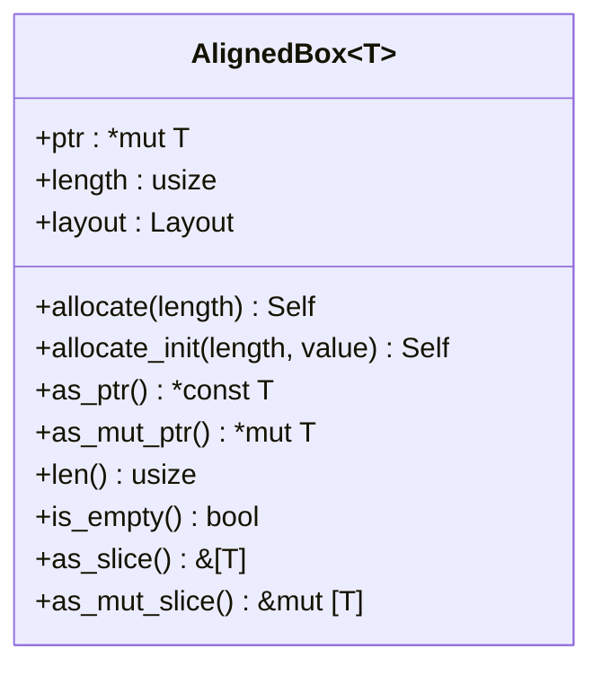
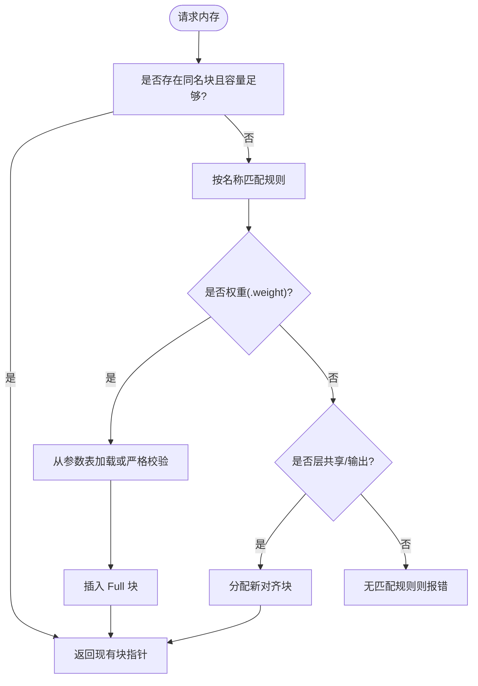
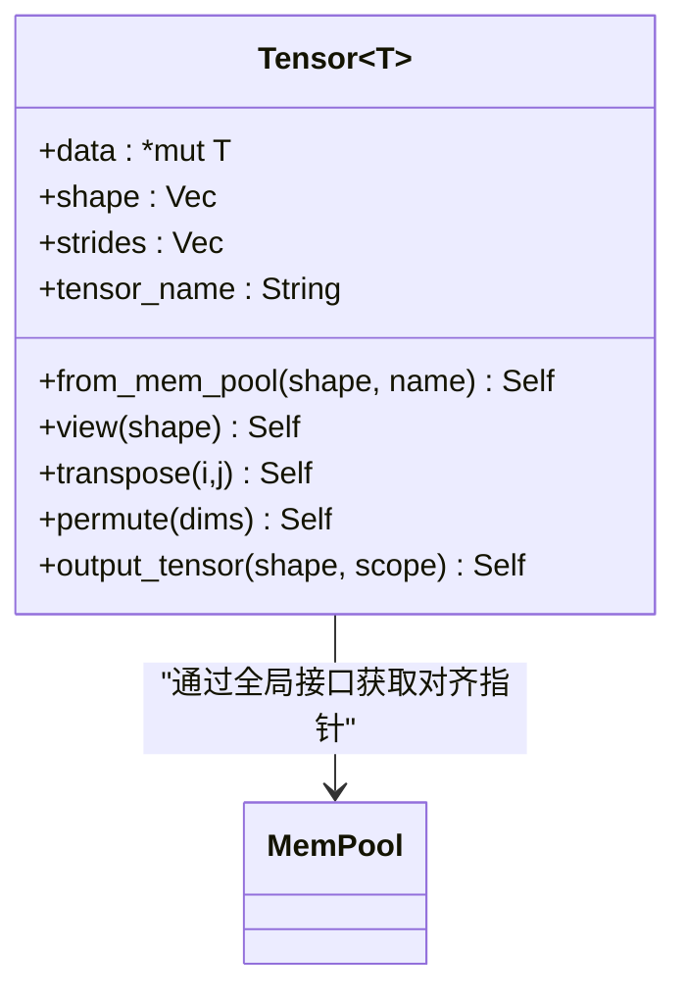
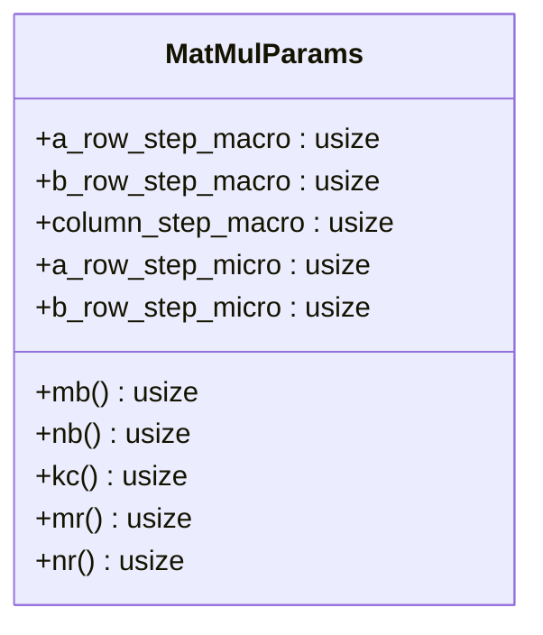
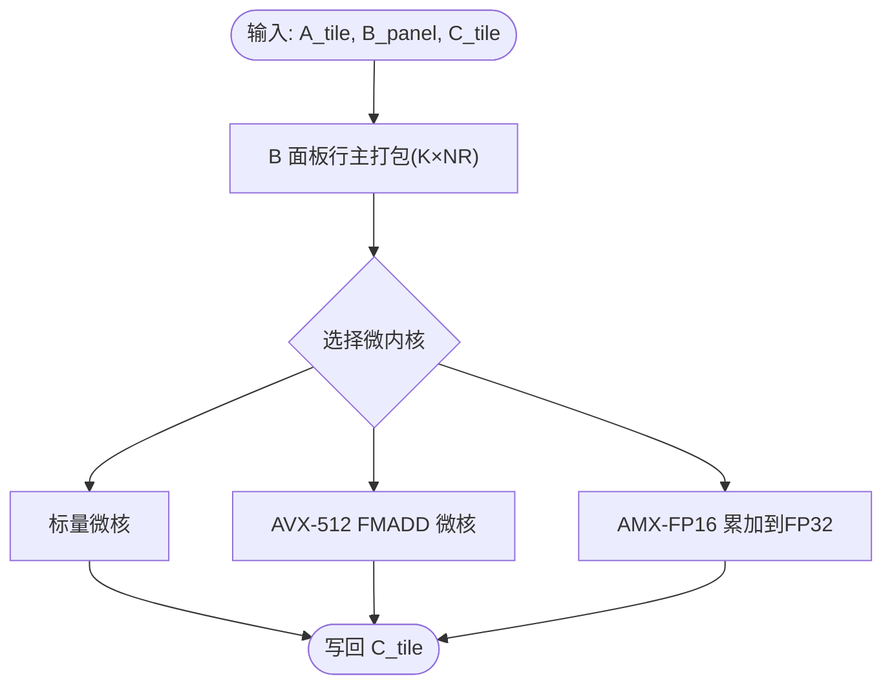
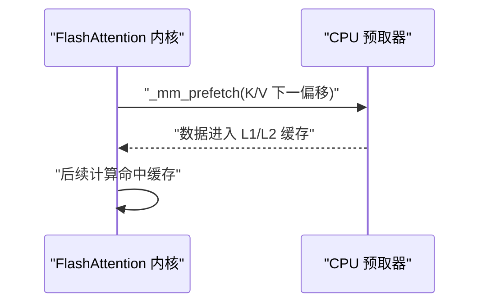
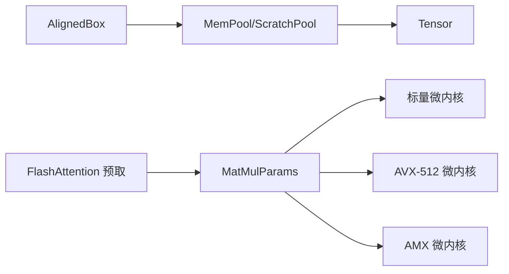

# 内存对齐与缓存优化

<cite>
**本文引用的文件**
- [src/mem_mgr/allocator.rs](file://src/mem_mgr/allocator.rs)
- [src/mem_mgr/mem_pool.rs](file://src/mem_mgr/mem_pool.rs)
- [src/kernel/common/matmul_params.rs](file://src/kernel/common/matmul_params.rs)
- [src/kernel/scalar/matmul_block.rs](file://src/kernel/scalar/matmul_block.rs)
- [src/kernel/x86_64/f16_512/matmul_block.rs](file://src/kernel/x86_64/f16_512/matmul_block.rs)
- [src/kernel/x86_64/f16_amx/tile.rs](file://src/kernel/x86_64/f16_amx/tile.rs)
- [src/kernel/x86_64/f16_amx/matmul_block.rs](file://src/kernel/x86_64/f16_amx/matmul_block.rs)
- [src/kernel/x86_64/f16_512/flash_attention.rs](file://src/kernel/x86_64/f16_512/flash_attention.rs)
- [src/tensor/storage.rs](file://src/tensor/storage.rs)
- [docs/design/operators/matmul.md](file://docs/design/operators/matmul.md)
- [README.md](file://README.md)
</cite>

## 目录
1. [简介](#简介)
2. [项目结构](#项目结构)
3. [核心组件](#核心组件)
4. [架构总览](#架构总览)
5. [详细组件分析](#详细组件分析)
6. [依赖关系分析](#依赖关系分析)
7. [性能考量](#性能考量)
8. [故障排查指南](#故障排查指南)
9. [结论](#结论)
10. [附录](#附录)

## 简介
本指南聚焦于内存对齐与缓存优化的工程实践，围绕以下目标展开：
- 解释 64 字节对齐对 SIMD（如 AVX-512、AMX）指令性能的影响及实现方法
- 阐述自定义内存分配器与内存池的设计原理，包括对齐分配策略与子块共享
- 说明缓存局部性优化技巧：数据预取、缓存行填充、内存布局优化
- 提供矩阵数据打包与重排的具体实现示例路径
- 指导如何避免缓存未命中与伪共享问题
- 给出内存使用分析与性能监控工具的使用建议

## 项目结构
本项目在内存与计算层面采用“以空间换时间”的策略，强调静态形状、连续存储、可复用执行管线。关键模块分布如下：
- 内存管理：对齐分配器与全局内存池
- 张量视图：基于池化分配的 Tensor 视图与步幅控制
- 算子内核：标量微核与 x86_64 平台专用内核（AVX-512 FP16、AMX-FP16）
- 设计文档：矩阵乘法分块、双缓冲与预取等优化策略

图示来源
- [src/mem_mgr/allocator.rs:1-156](file://src/mem_mgr/allocator.rs#L1-L156)
- [src/mem_mgr/mem_pool.rs:1-543](file://src/mem_mgr/mem_pool.rs#L1-L543)
- [src/tensor/storage.rs:1-154](file://src/tensor/storage.rs#L1-L154)
- [src/kernel/common/matmul_params.rs:1-36](file://src/kernel/common/matmul_params.rs#L1-L36)
- [src/kernel/scalar/matmul_block.rs:1-129](file://src/kernel/scalar/matmul_block.rs#L1-L129)
- [src/kernel/x86_64/f16_512/matmul_block.rs:1-236](file://src/kernel/x86_64/f16_512/matmul_block.rs#L1-L236)
- [src/kernel/x86_64/f16_amx/tile.rs:1-168](file://src/kernel/x86_64/f16_amx/tile.rs#L1-L168)
- [src/kernel/x86_64/f16_amx/matmul_block.rs:1-172](file://src/kernel/x86_64/f16_amx/matmul_block.rs#L1-L172)
- [src/kernel/x86_64/f16_512/flash_attention.rs:1-120](file://src/kernel/x86_64/f16_512/flash_attention.rs#L1-L120)

章节来源
- [README.md:47-182](file://README.md#L47-L182)

## 核心组件
- 对齐分配器 AlignedBox：保证 64 字节对齐，面向 SIMD512 友好访问
- 内存池 MemPool/ScratchPool：按名称/模式匹配复用大块内存，支持专家权重拼接为连续子块
- 张量 Tensor：通过池化分配获得对齐指针，维护 shape/strides 与名称
- 矩阵乘参数 MatMulParams：统一描述宏/微观分块与步长，供多后端共用
- 微内核：标量版与 AVX-512/AMX 版，均要求 B 面板行主打包、MR×NR 寄存器阻塞

章节来源
- [src/mem_mgr/allocator.rs:1-156](file://src/mem_mgr/allocator.rs#L1-L156)
- [src/mem_mgr/mem_pool.rs:1-543](file://src/mem_mgr/mem_pool.rs#L1-L543)
- [src/tensor/storage.rs:1-154](file://src/tensor/storage.rs#L1-L154)
- [src/kernel/common/matmul_params.rs:1-36](file://src/kernel/common/matmul_params.rs#L1-L36)
- [src/kernel/scalar/matmul_block.rs:1-129](file://src/kernel/scalar/matmul_block.rs#L1-L129)
- [src/kernel/x86_64/f16_512/matmul_block.rs:1-236](file://src/kernel/x86_64/f16_512/matmul_block.rs#L1-L236)
- [src/kernel/x86_64/f16_amx/matmul_block.rs:1-172](file://src/kernel/x86_64/f16_amx/matmul_block.rs#L1-L172)

## 架构总览
下图展示从高层到内核的调用链与数据流，体现“池化分配 → 视图/步幅 → 分块/打包 → 微内核”的流水线。

图示来源
- [src/tensor/storage.rs:41-50](file://src/tensor/storage.rs#L41-L50)
- [src/mem_mgr/mem_pool.rs:309-327](file://src/mem_mgr/mem_pool.rs#L309-L327)
- [src/kernel/scalar/matmul_block.rs:14-43](file://src/kernel/scalar/matmul_block.rs#L14-L43)
- [src/kernel/x86_64/f16_512/matmul_block.rs:22-85](file://src/kernel/x86_64/f16_512/matmul_block.rs#L22-L85)
- [src/kernel/x86_64/f16_amx/matmul_block.rs:18-51](file://src/kernel/x86_64/f16_amx/matmul_block.rs#L18-L51)

## 详细组件分析

### 对齐分配器 AlignedBox（64 字节对齐）
- 设计要点
  - 使用系统分配器按 64 字节对齐分配，满足 AVX-512 向量宽度与缓存行粒度
  - 提供 allocate/allocate_init/as_ptr/as_mut_slice 等安全封装
  - Drop 中负责析构元素并释放底层内存
- 性能影响
  - 对齐后 SIMD 向量化加载/存储更稳定，减少跨缓存行拆分
  - 便于编译器生成高效向量化代码，降低分支与边界处理开销

图示来源
- [src/mem_mgr/allocator.rs:1-156](file://src/mem_mgr/allocator.rs#L1-L156)

章节来源
- [src/mem_mgr/allocator.rs:1-156](file://src/mem_mgr/allocator.rs#L1-L156)

### 内存池 MemPool 与 ScratchPool（对齐+子块共享）
- 设计要点
  - 全局单例：f32/f16 参数池与 bool/usize 临时池
  - 名称匹配规则：权重、KV 输出、层共享参数等按正则分组
  - MoE 专家权重拼接：将 experts.* 权重合并为连续大数组，并以子块形式暴露各专家切片
  - ScratchPool：按名称复用已分配的对齐缓冲区，按需初始化
- 关键流程
  - get(name, shape)：先查现有块容量，再按规则匹配或分配新块
  - get_scratch(name, len, value)：确保对齐且长度足够，必要时重新分配并填充初值

图示来源
- [src/mem_mgr/mem_pool.rs:249-327](file://src/mem_mgr/mem_pool.rs#L249-L327)
- [src/mem_mgr/mem_pool.rs:370-427](file://src/mem_mgr/mem_pool.rs#L370-L427)
- [src/mem_mgr/mem_pool.rs:208-235](file://src/mem_mgr/mem_pool.rs#L208-L235)

章节来源
- [src/mem_mgr/mem_pool.rs:1-543](file://src/mem_mgr/mem_pool.rs#L1-L543)

### 张量视图 Tensor（池化分配 + 步幅控制）
- 设计要点
  - from_mem_pool/from_pool：通过全局池获取对齐指针，构造 shape/strides
  - view/permute/transpose：零拷贝改变视图，仅更新 shape/strides
  - output_tensor：按 scope_name.output 命名约定自动入池
- 与内存池协作
  - 所有输出与中间张量均可复用池内对齐内存，避免频繁分配

图示来源
- [src/tensor/storage.rs:1-154](file://src/tensor/storage.rs#L1-L154)
- [src/mem_mgr/mem_pool.rs:111-206](file://src/mem_mgr/mem_pool.rs#L111-L206)

章节来源
- [src/tensor/storage.rs:1-154](file://src/tensor/storage.rs#L1-L154)

### 矩阵乘参数 MatMulParams（宏/微观分块）
- 字段含义
  - a_row_step_macro/b_row_step_macro：A/C 的行距（lda/ldc）
  - column_step_macro：K 维面板长度 kc
  - a_row_step_micro/b_row_step_micro：MR/NR 寄存器阻塞尺寸
- 作用
  - 统一上层分块策略与下层微内核之间的契约
  - 便于在不同后端（标量/AVX-512/AMX）间复用同一套分块语义

图示来源
- [src/kernel/common/matmul_params.rs:1-36](file://src/kernel/common/matmul_params.rs#L1-L36)

章节来源
- [src/kernel/common/matmul_params.rs:1-36](file://src/kernel/common/matmul_params.rs#L1-L36)

### 微内核：标量 vs AVX-512 vs AMX
- 通用约定
  - A_tile：MR × kc，行主，行距 lda
  - B_panel：kc × NR，行主打包，行距 NR
  - C_tile：MR × NR，行主，行距 ldc
- 标量版
  - 纯循环实现，验证算法正确性与打包布局一致性
- AVX-512 FP16
  - 针对 MR=3、NR=32 的微核，使用 FMADD 加速
- AMX-FP16
  - 将 3×16 子块累积到 FP32，再叠加回 f16 C；需配置 Tile 与权限

图示来源
- [src/kernel/scalar/matmul_block.rs:14-43](file://src/kernel/scalar/matmul_block.rs#L14-L43)
- [src/kernel/x86_64/f16_512/matmul_block.rs:22-85](file://src/kernel/x86_64/f16_512/matmul_block.rs#L22-L85)
- [src/kernel/x86_64/f16_amx/matmul_block.rs:18-51](file://src/kernel/x86_64/f16_amx/matmul_block.rs#L18-L51)
- [src/kernel/x86_64/f16_amx/tile.rs:104-167](file://src/kernel/x86_64/f16_amx/tile.rs#L104-L167)

章节来源
- [src/kernel/scalar/matmul_block.rs:1-129](file://src/kernel/scalar/matmul_block.rs#L1-L129)
- [src/kernel/x86_64/f16_512/matmul_block.rs:1-236](file://src/kernel/x86_64/f16_512/matmul_block.rs#L1-L236)
- [src/kernel/x86_64/f16_amx/matmul_block.rs:1-172](file://src/kernel/x86_64/f16_amx/matmul_block.rs#L1-L172)
- [src/kernel/x86_64/f16_amx/tile.rs:1-168](file://src/kernel/x86_64/f16_amx/tile.rs#L1-L168)

### 缓存局部性与预取（FlashAttention 示例）
- 软件预取
  - 在注意力计算热点路径中，提前数行加载 K/V 数据，提升 L1/L2 命中率
- 连续访存
  - 行主打包与固定形状 KV 布局，使硬件预取器更易命中
- 参考实现位置
  - FlashAttention 中使用 _mm_prefetch 提示预取下一块数据

图示来源
- [src/kernel/x86_64/f16_512/flash_attention.rs:1-120](file://src/kernel/x86_64/f16_512/flash_attention.rs#L1-L120)

章节来源
- [src/kernel/x86_64/f16_512/flash_attention.rs:1-120](file://src/kernel/x86_64/f16_512/flash_attention.rs#L1-L120)

### 矩阵数据打包与重排（实现示例路径）
- B 面板打包
  - 将原始 B[K×N] 重排为 K×NR 行主面板，便于微内核顺序读取
  - 参考：[src/kernel/scalar/matmul_block.rs:14-43](file://src/kernel/scalar/matmul_block.rs#L14-L43)、[src/kernel/x86_64/f16_512/matmul_block.rs:22-85](file://src/kernel/x86_64/f16_512/matmul_block.rs#L22-L85)
- AMX 特殊布局
  - B 需要按 pair-interleaved 布局装载至 tile，见 tile.rs 中的打包逻辑
  - 参考：[src/kernel/x86_64/f16_amx/tile.rs:133-147](file://src/kernel/x86_64/f16_amx/tile.rs#L133-L147)
- 张量视图重排
  - 通过 permute/transpose/view 调整 strides，避免不必要的数据搬移
  - 参考：[src/tensor/storage.rs:100-149](file://src/tensor/storage.rs#L100-L149)

章节来源
- [src/kernel/scalar/matmul_block.rs:1-129](file://src/kernel/scalar/matmul_block.rs#L1-L129)
- [src/kernel/x86_64/f16_512/matmul_block.rs:1-236](file://src/kernel/x86_64/f16_512/matmul_block.rs#L1-L236)
- [src/kernel/x86_64/f16_amx/tile.rs:1-168](file://src/kernel/x86_64/f16_amx/tile.rs#L1-L168)
- [src/tensor/storage.rs:1-154](file://src/tensor/storage.rs#L1-L154)

## 依赖关系分析
- 低耦合高内聚
  - 内存层（AlignedBox/MemPool）独立于算子实现，通过全局接口被 Tensor 使用
  - 微内核通过 MatMulParams 抽象分块参数，屏蔽后端差异
- 外部依赖
  - 正则表达式用于参数名匹配与规则路由
  - once_cell 提供线程安全的 Lazy 全局池

图示来源
- [src/mem_mgr/allocator.rs:1-156](file://src/mem_mgr/allocator.rs#L1-L156)
- [src/mem_mgr/mem_pool.rs:1-543](file://src/mem_mgr/mem_pool.rs#L1-L543)
- [src/tensor/storage.rs:1-154](file://src/tensor/storage.rs#L1-L154)
- [src/kernel/common/matmul_params.rs:1-36](file://src/kernel/common/matmul_params.rs#L1-L36)
- [src/kernel/scalar/matmul_block.rs:1-129](file://src/kernel/scalar/matmul_block.rs#L1-L129)
- [src/kernel/x86_64/f16_512/matmul_block.rs:1-236](file://src/kernel/x86_64/f16_512/matmul_block.rs#L1-L236)
- [src/kernel/x86_64/f16_amx/matmul_block.rs:1-172](file://src/kernel/x86_64/f16_amx/matmul_block.rs#L1-L172)
- [src/kernel/x86_64/f16_512/flash_attention.rs:1-120](file://src/kernel/x86_64/f16_512/flash_attention.rs#L1-L120)

章节来源
- [src/mem_mgr/mod.rs:1-2](file://src/mem_mgr/mod.rs#L1-L2)

## 性能考量
- 对齐与缓存行
  - 64 字节对齐有助于 SIMD 向量化与减少跨缓存行访问
- 数据布局
  - 行主打包 B 面板、固定形状 KV 张量，提升空间局部性
- 预取与双缓冲
  - 热点路径使用 _mm_prefetch；当打包与计算并重时可采用双缓冲并行
- 头级串行与逐 head 驻留
  - 利用 CPU 大 L3 缓存，逐 head 顺序计算延长 KV 驻留窗口
- 参考文档
  - 矩阵乘法分块、双缓冲与预取策略详见设计文档

章节来源
- [docs/design/operators/matmul.md:481-519](file://docs/design/operators/matmul.md#L481-L519)
- [README.md:147-182](file://README.md#L147-L182)

## 故障排查指南
- 对齐失败
  - 检查分配器是否按 64 字节对齐，测试断言应通过
  - 参考：[src/mem_mgr/allocator.rs:130-155](file://src/mem_mgr/allocator.rs#L130-L155)
- 严格模式缺失权重
  - 使用 new_strict 时若缺少参数会 panic，确认参数键名与形状一致
  - 参考：[src/mem_mgr/mem_pool.rs:388-407](file://src/mem_mgr/mem_pool.rs#L388-L407)
- 形状不匹配
  - 严格模式下形状不一致会触发断言失败，核对 shape 与数据长度
  - 参考：[src/mem_mgr/mem_pool.rs:388-396](file://src/mem_mgr/mem_pool.rs#L388-L396)
- AMX 权限不足
  - 未启用 amx-tile/amx-fp16 或未申请权限会导致运行期错误
  - 参考：[src/kernel/x86_64/f16_amx/tile.rs:94-101](file://src/kernel/x86_64/f16_amx/tile.rs#L94-L101)

章节来源
- [src/mem_mgr/allocator.rs:130-155](file://src/mem_mgr/allocator.rs#L130-L155)
- [src/mem_mgr/mem_pool.rs:388-407](file://src/mem_mgr/mem_pool.rs#L388-L407)
- [src/kernel/x86_64/f16_amx/tile.rs:94-101](file://src/kernel/x86_64/f16_amx/tile.rs#L94-L101)

## 结论
通过将内存分配与池化管理前置，结合严格的 64 字节对齐、行主打包与逐 head 顺序计算，eLLM 在 CPU 平台上实现了良好的缓存局部性与稳定的吞吐表现。配合软件预取与双缓冲策略，可在热点路径进一步逼近硬件带宽上限。

## 附录
- 内存使用分析与性能监控建议
  - 使用 perf 统计 cache-misses、L1-dcache-load-misses、dTLB-load-misses 等指标定位未命中热点
  - 使用 valgrind/cachegrind 分析访存模式与缓存行为
  - 使用 pprof/火焰图识别热点函数与重复分配点
  - 关注 MemPool 的块复用率与 ScratchPool 的命中率，减少不必要的重新分配
  - 在 AVX-512/AMX 路径上，结合硬件计数器评估向量化利用率与指令吞吐