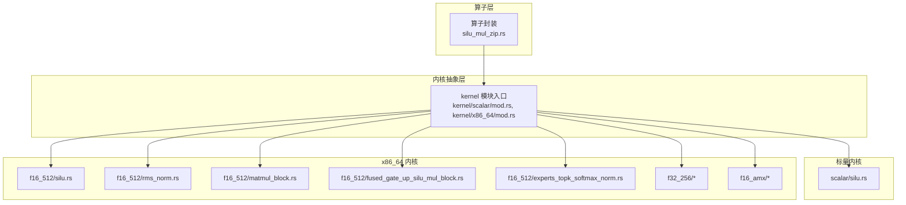
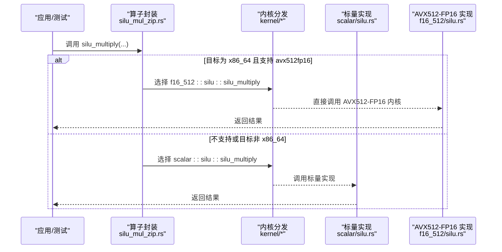
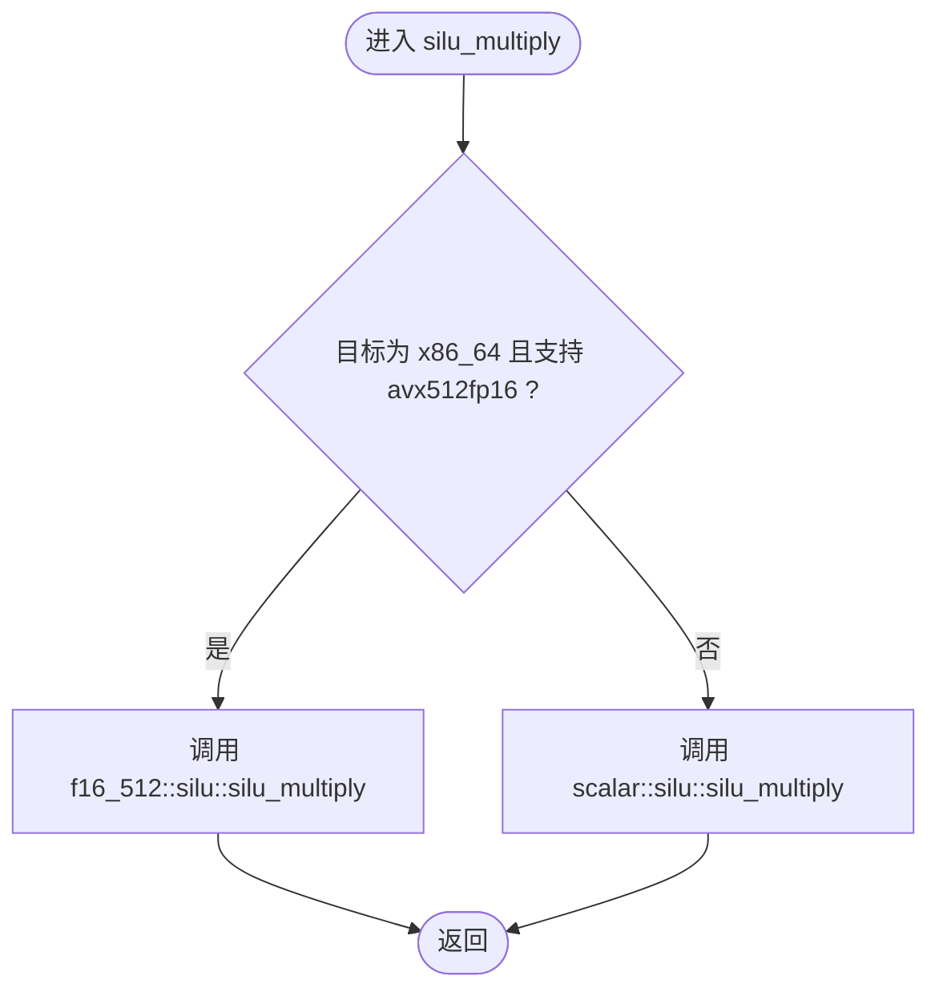
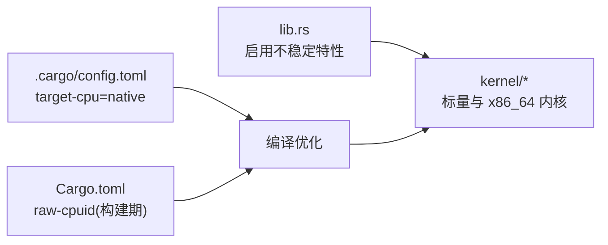

# 平台特定优化技术

<cite>
**本文引用的文件**
- [lib.rs](file://src/lib.rs)
- [Cargo.toml](file://Cargo.toml)
- [.cargo/config.toml](file://.cargo/config.toml)
- [kernel/x86_64/mod.rs](file://src/kernel/x86_64/mod.rs)
- [kernel/scalar/mod.rs](file://src/kernel/scalar/mod.rs)
- [kernel/x86_64/f16_512/mod.rs](file://src/kernel/x86_64/f16_512/mod.rs)
- [kernel/x86_64/f32_256/mod.rs](file://src/kernel/x86_64/f32_256/mod.rs)
- [kernel/x86_64/f16_amx/mod.rs](file://src/kernel/x86_64/f16_amx/mod.rs)
- [operators/elementwise/silu_mul_zip.rs](file://src/operators/elementwise/silu_mul_zip.rs)
- [kernel/scalar/silu.rs](file://src/kernel/scalar/silu.rs)
- [kernel/x86_64/f16_512/silu.rs](file://src/kernel/x86_64/f16_512/silu.rs)
- [kernel/x86_64/f16_512/rms_norm.rs](file://src/kernel/x86_64/f16_512/rms_norm.rs)
- [kernel/x86_64/f16_512/matmul_block.rs](file://src/kernel/x86_64/f16_512/matmul_block.rs)
- [kernel/x86_64/f16_512/fused_gate_up_silu_mul_block.rs](file://src/kernel/x86_64/f16_512/fused_gate_up_silu_mul_block.rs)
- [kernel/x86_64/f16_512/experts_topk_softmax_norm.rs](file://src/kernel/x86_64/f16_512/experts_topk_softmax_norm.rs)
- [num_traits/sigmoid.rs](file://src/num_traits/sigmoid.rs)
- [runtime/init.rs](file://src/runtime/init.rs)
</cite>

## 目录
1. [简介](#简介)
2. [项目结构](#项目结构)
3. [核心组件](#核心组件)
4. [架构总览](#架构总览)
5. [详细组件分析](#详细组件分析)
6. [依赖关系分析](#依赖关系分析)
7. [性能考量](#性能考量)
8. [故障排查指南](#故障排查指南)
9. [结论](#结论)
10. [附录](#附录)

## 简介
本指南聚焦于在 x86_64 平台上使用 Rust 的条件编译与特性检测，实现跨平台兼容的高性能推理内核。内容涵盖：
- 条件编译与运行时特性检测的组合策略
- f16_512（AVX512-FP16）、f32_256（AVX2）与 f16_amx（AMX）三种数据格式的实现选择与切换机制
- 标量实现与 SIMD/AMX 实现的权衡与回退路径
- 可移植优化代码的编写范式与最佳实践
- 交叉编译与部署注意事项

## 项目结构
本项目将“标量”和“平台特定”内核分层组织，上层算子通过统一接口调用底层实现，并在编译期或运行期选择最优路径。

图示来源
- [operators/elementwise/silu_mul_zip.rs:128-139](file://src/operators/elementwise/silu_mul_zip.rs#L128-L139)
- [kernel/scalar/mod.rs:1-16](file://src/kernel/scalar/mod.rs#L1-L16)
- [kernel/x86_64/mod.rs:1-4](file://src/kernel/x86_64/mod.rs#L1-L4)
- [kernel/scalar/silu.rs:1-56](file://src/kernel/scalar/silu.rs#L1-L56)
- [kernel/x86_64/f16_512/mod.rs:1-17](file://src/kernel/x86_64/f16_512/mod.rs#L1-L17)
- [kernel/x86_64/f32_256/mod.rs:1-5](file://src/kernel/x86_64/f32_256/mod.rs#L1-L5)
- [kernel/x86_64/f16_amx/mod.rs:1-6](file://src/kernel/x86_64/f16_amx/mod.rs#L1-L6)

章节来源
- [kernel/scalar/mod.rs:1-16](file://src/kernel/scalar/mod.rs#L1-L16)
- [kernel/x86_64/mod.rs:1-4](file://src/kernel/x86_64/mod.rs#L1-L4)
- [kernel/x86_64/f16_512/mod.rs:1-17](file://src/kernel/x86_64/f16_512/mod.rs#L1-L17)
- [kernel/x86_64/f32_256/mod.rs:1-5](file://src/kernel/x86_64/f32_256/mod.rs#L1-L5)
- [kernel/x86_64/f16_amx/mod.rs:1-6](file://src/kernel/x86_64/f16_amx/mod.rs#L1-L6)
- [operators/elementwise/silu_mul_zip.rs:128-139](file://src/operators/elementwise/silu_mul_zip.rs#L128-L139)

## 核心组件
- 顶层特性开关与不稳定 API 启用：用于暴露 AVX512-FP16、AMX 等内在函数能力。
- 构建配置：默认开启 -C target-cpu=native，使编译器针对本机 CPU 生成最优指令序列。
- 内核模块划分：标量与 x86_64 多后端并行存在，由上层按目标特性选择。
- 运行时初始化：加载模型权重并启动执行器，为后续算子调度提供上下文。

章节来源
- [lib.rs:1-6](file://src/lib.rs#L1-L6)
- [.cargo/config.toml:1-4](file://.cargo/config.toml#L1-L4)
- [runtime/init.rs:34-136](file://src/runtime/init.rs#L34-L136)

## 架构总览
下图展示从算子到具体内核的调用链与特性分支逻辑。

图示来源
- [operators/elementwise/silu_mul_zip.rs:128-139](file://src/operators/elementwise/silu_mul_zip.rs#L128-L139)
- [kernel/scalar/silu.rs:20-40](file://src/kernel/scalar/silu.rs#L20-L40)
- [kernel/x86_64/f16_512/silu.rs:1-36](file://src/kernel/x86_64/f16_512/silu.rs#L1-L36)

## 详细组件分析

### 条件编译与特性检测策略
- 编译期分支：使用 #[cfg(all(target_arch = "x86_64", target_feature = "avx512fp16"))] 在编译时选择 AVX512-FP16 路径；否则回退到标量实现。
- 运行期检测：在测试或动态路径中使用 is_x86_feature_detected!("avx512fp16") 进行保护，避免在不支持硬件上崩溃。
- 函数级特性标注：对关键内核使用 #[target_feature(enable = "avx512fp16")] 确保内联与调用约定正确。

章节来源
- [operators/elementwise/silu_mul_zip.rs:128-139](file://src/operators/elementwise/silu_mul_zip.rs#L128-L139)
- [kernel/x86_64/f16_512/experts_topk_softmax_norm.rs:199-202](file://src/kernel/x86_64/f16_512/experts_topk_softmax_norm.rs#L199-L202)
- [kernel/x86_64/f16_512/fused_gate_up_silu_mul_block.rs:19-19](file://src/kernel/x86_64/f16_512/fused_gate_up_silu_mul_block.rs#L19-L19)
- [kernel/x86_64/f16_512/matmul_rms_complex.rs:24-24](file://src/kernel/x86_64/f16_512/matmul_rms_complex.rs#L24-L24)

### 标量实现 vs SIMD/AMX 实现
- 标量实现：通用、可移植，适合所有平台与调试验证。
- AVX512-FP16 实现：以 512 位向量处理 f16，吞吐高，适合大向量/矩阵运算。
- AMX 实现：面向大型矩阵乘与融合算子，具备更高吞吐潜力，但需要 AMX 硬件支持。
- 切换机制：上层算子在编译期根据目标特性选择，或在运行期通过特性检测决定调用路径。

章节来源
- [kernel/scalar/silu.rs:1-56](file://src/kernel/scalar/silu.rs#L1-L56)
- [kernel/x86_64/f16_512/silu.rs:1-36](file://src/kernel/x86_64/f16_512/silu.rs#L1-L36)
- [kernel/x86_64/f16_amx/mod.rs:1-6](file://src/kernel/x86_64/f16_amx/mod.rs#L1-L6)

### f16_512（AVX512-FP16）内核要点
- 激活函数：SiLU 使用 512 位向量一次处理 32 个 f16 元素，减少循环开销与内存访问次数。
- RMSNorm：利用 FMADD、归约指令完成平方和与最大值计算，提升数值稳定性与吞吐。
- 块状矩阵乘：分块策略结合行/列步长参数，提高缓存命中与向量化效率。
- 融合算子：Gate/Up/SiLU/Mul 融合，减少中间缓冲与访存。

章节来源
- [kernel/x86_64/f16_512/silu.rs:1-36](file://src/kernel/x86_64/f16_512/silu.rs#L1-L36)
- [kernel/x86_64/f16_512/rms_norm.rs:1-43](file://src/kernel/x86_64/f16_512/rms_norm.rs#L1-L43)
- [kernel/x86_64/f16_512/matmul_block.rs:81-133](file://src/kernel/x86_64/f16_512/matmul_block.rs#L81-L133)
- [kernel/x86_64/f16_512/fused_gate_up_silu_mul_block.rs:100-118](file://src/kernel/x86_64/f16_512/fused_gate_up_silu_mul_block.rs#L100-L118)

### f32_256（AVX2）内核要点
- 适用于仅支持 AVX2 的平台，以 f32 为主的数据路径。
- 当前模块包含排序与 TopKSoftmax 相关实现，可作为 f32 场景下的基准或备选路径。

章节来源
- [kernel/x86_64/f32_256/mod.rs:1-5](file://src/kernel/x86_64/f32_256/mod.rs#L1-L5)

### f16_amx（AMX）内核要点
- 面向大规模矩阵乘与融合算子，配合 tile 操作提升吞吐。
- 与 f16_512 形成互补：小/中等规模用 AVX512-FP16，超大规模矩阵乘优先 AMX。

章节来源
- [kernel/x86_64/f16_amx/mod.rs:1-6](file://src/kernel/x86_64/f16_amx/mod.rs#L1-L6)

### 运行时初始化与线程配置
- 初始化流程负责加载模型权重、构建位置编码、创建调度器与执行器池，并将全局算子队列注入工作线程。
- 线程数与批大小、序列长度等参数共同影响并发度与缓存局部性。

章节来源
- [runtime/init.rs:34-136](file://src/runtime/init.rs#L34-L136)

### 典型算子调用序列（SiLU 乘法）

图示来源
- [operators/elementwise/silu_mul_zip.rs:128-139](file://src/operators/elementwise/silu_mul_zip.rs#L128-L139)
- [kernel/scalar/silu.rs:20-40](file://src/kernel/scalar/silu.rs#L20-L40)
- [kernel/x86_64/f16_512/silu.rs:1-36](file://src/kernel/x86_64/f16_512/silu.rs#L1-L36)

## 依赖关系分析
- 顶层启用不稳定特性与内在函数：lib.rs 中启用了 f16、stdarch_x86_avx512_f16、x86_amx_intrinsics 等。
- 构建配置：.cargo/config.toml 设置 target-cpu=native，最大化本机优化。
- 包配置：Cargo.toml 引入 raw-cpuid 作为构建期依赖，可用于构建阶段探测 CPU 能力（例如在 build.rs 中）。

图示来源
- [lib.rs:1-6](file://src/lib.rs#L1-L6)
- [.cargo/config.toml:1-4](file://.cargo/config.toml#L1-L4)
- [Cargo.toml:82-84](file://Cargo.toml#L82-L84)

章节来源
- [lib.rs:1-6](file://src/lib.rs#L1-L6)
- [.cargo/config.toml:1-4](file://.cargo/config.toml#L1-L4)
- [Cargo.toml:82-84](file://Cargo.toml#L82-L84)

## 性能考量
- 数据布局与分块：矩阵乘采用宏/微分块与行列步长参数，提升缓存命中率与向量化效率。
- 融合算子：将 Gate/Up/SiLU/Mul 等步骤融合，减少中间缓冲与访存。
- 归约与归一化：RMSNorm 使用 FMADD 与归约指令，降低循环开销。
- 线程与批大小：合理设置线程数与批大小，平衡并行度与缓存局部性。
- 精度与吞吐：f16_512 在高吞吐场景更优；f32_256 在 AVX2 平台可用；AMX 在大矩阵乘更具优势。

[本节为通用指导，不直接分析具体文件]

## 故障排查指南
- 特性缺失导致跳过测试：当检测到不支持 avx512fp16 或 avx512f 时，测试会跳过。确认 CPU 是否支持相应特性，或回退到标量路径。
- 构建未启用 native 优化：检查 .cargo/config.toml 是否包含 target-cpu=native。
- 运行期崩溃：若在未支持特性的机器上强制调用 AVX512-FP16 内核，可能触发非法指令。确保使用 #[cfg(...)] 或 is_x86_feature_detected 保护。
- 线程与内存：过高的线程数可能导致缓存抖动与内存带宽饱和，需结合批大小与序列长度调优。

章节来源
- [kernel/x86_64/f16_512/experts_topk_softmax_norm.rs:199-202](file://src/kernel/x86_64/f16_512/experts_topk_softmax_norm.rs#L199-L202)
- [kernel/x86_64/f16_512/fused_gate_up_silu_mul_block.rs:128-132](file://src/kernel/x86_64/f16_512/fused_gate_up_silu_mul_block.rs#L128-L132)
- [.cargo/config.toml:1-4](file://.cargo/config.toml#L1-L4)

## 结论
通过在 Rust 中组合使用条件编译与运行时特性检测，eLLM 能够在不同 x86_64 平台上自动选择最优内核路径：在支持 AVX512-FP16 的机器上使用 f16_512 高性能实现，在仅有 AVX2 的环境回退到 f32_256 或标量实现，并在具备 AMX 的平台上优先使用 f16_amx 的大矩阵加速。配合合理的分块、融合与线程配置，可在 CPU 服务器上获得稳定且高效的推理性能。

[本节为总结，不直接分析具体文件]

## 附录

### 数据格式选择策略与适用场景
- f16_512（AVX512-FP16）
  - 适用：大多数现代 Intel/AMD CPU，具备 AVX512-FP16 支持
  - 优点：高吞吐、低内存占用，适合激活、归一化、中小规模矩阵乘
  - 注意：需确保目标平台支持该特性，否则回退到标量
- f32_256（AVX2）
  - 适用：仅支持 AVX2 的平台
  - 优点：广泛兼容，数值稳定性好
  - 注意：吞吐通常低于 AVX512-FP16，适合基准与兼容性保障
- f16_amx（AMX）
  - 适用：支持 AMX 的服务器级 CPU
  - 优点：超大矩阵乘与融合算子的高吞吐
  - 注意：仅在 AMX 硬件上启用，需与 f16_512 形成互补

章节来源
- [kernel/x86_64/f16_512/mod.rs:1-17](file://src/kernel/x86_64/f16_512/mod.rs#L1-L17)
- [kernel/x86_64/f32_256/mod.rs:1-5](file://src/kernel/x86_64/f32_256/mod.rs#L1-L5)
- [kernel/x86_64/f16_amx/mod.rs:1-6](file://src/kernel/x86_64/f16_amx/mod.rs#L1-L6)

### 可移植优化代码编写范式
- 使用 #[cfg(all(target_arch = "x86_64", target_feature = "..."))] 在编译期选择路径
- 在测试或动态路径中使用 is_x86_feature_detected! 进行保护
- 对关键内核使用 #[target_feature(enable = "...")] 标注
- 保持标量实现作为兜底，便于调试与跨平台验证

章节来源
- [operators/elementwise/silu_mul_zip.rs:128-139](file://src/operators/elementwise/silu_mul_zip.rs#L128-L139)
- [kernel/x86_64/f16_512/experts_topk_softmax_norm.rs:199-202](file://src/kernel/x86_64/f16_512/experts_topk_softmax_norm.rs#L199-L202)
- [kernel/x86_64/f16_512/fused_gate_up_silu_mul_block.rs:19-19](file://src/kernel/x86_64/f16_512/fused_gate_up_silu_mul_block.rs#L19-L19)

### 交叉编译与部署注意事项
- 构建期 CPU 探测：可使用 raw-cpuid 在构建脚本中探测目标 CPU 能力，从而调整编译选项或启用/禁用某些特性模块
- 目标三元组：针对不同目标平台（如 x86_64-unknown-linux-gnu、x86_64-pc-windows-msvc）分别构建
- 运行时特性检测：即使构建为 native，也应在运行期检测特性，避免在旧硬件上崩溃
- 发布配置：保持 opt-level=3、lto=fat、codegen-units=1 以获得最佳性能

章节来源
- [Cargo.toml:69-80](file://Cargo.toml#L69-L80)
- [Cargo.toml:82-84](file://Cargo.toml#L82-L84)
- [.cargo/config.toml:1-4](file://.cargo/config.toml#L1-L4)