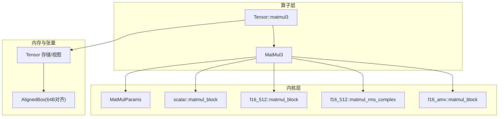
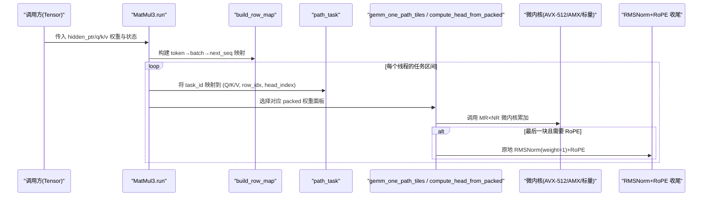
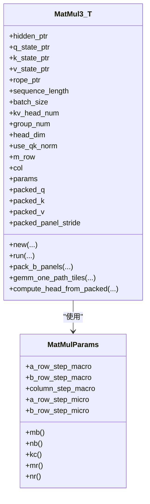
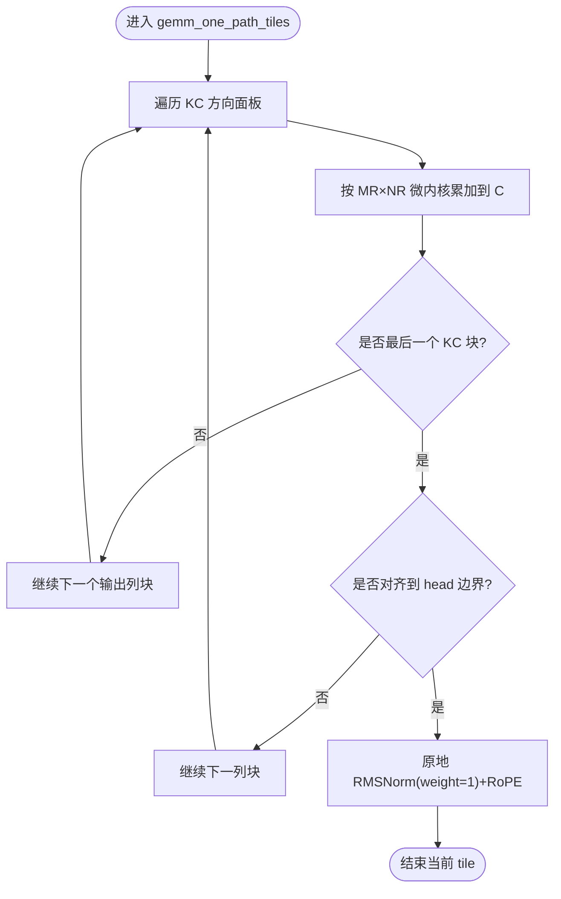
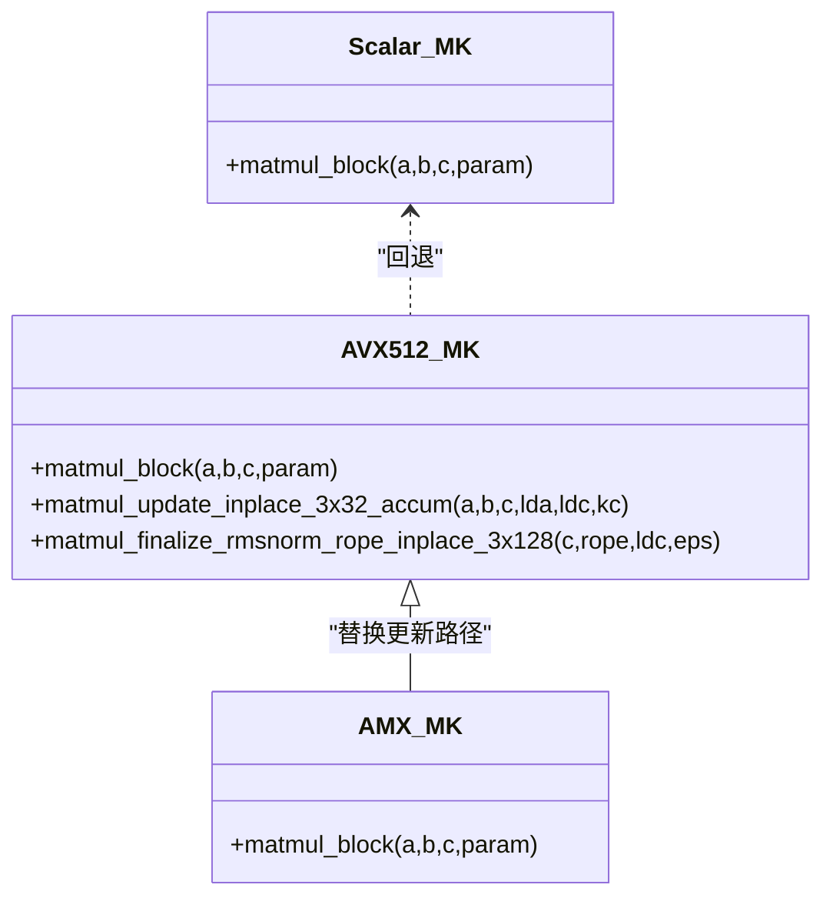
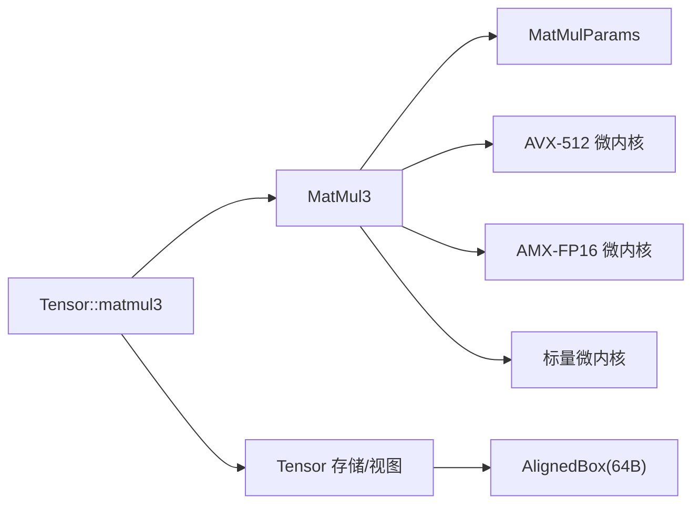

# 三矩阵乘法算子实现

<cite>
**本文引用的文件**   
- [src/operators/matmul/matmul3.rs](file://src/operators/matmul/matmul3.rs)
- [src/kernel/common/matmul_params.rs](file://src/kernel/common/matmul_params.rs)
- [src/kernel/scalar/matmul_block.rs](file://src/kernel/scalar/matmul_block.rs)
- [src/kernel/x86_64/f16_512/matmul_block.rs](file://src/kernel/x86_64/f16_512/matmul_block.rs)
- [src/kernel/x86_64/f16_amx/matmul_block.rs](file://src/kernel/x86_64/f16_amx/matmul_block.rs)
- [src/kernel/x86_64/f16_512/matmul_rms_complex.rs](file://src/kernel/x86_64/f16_512/matmul_rms_complex.rs)
- [src/tensor/matmul.rs](file://src/tensor/matmul.rs)
- [src/tensor/storage.rs](file://src/tensor/storage.rs)
- [src/mem_mgr/allocator.rs](file://src/mem_mgr/allocator.rs)
- [docs/design/operators/matmul.md](file://docs/design/operators/matmul.md)
</cite>

## 目录
1. [简介](#简介)
2. [项目结构](#项目结构)
3. [核心组件](#核心组件)
4. [架构总览](#架构总览)
5. [详细组件分析](#详细组件分析)
6. [依赖关系分析](#依赖关系分析)
7. [性能考量](#性能考量)
8. [故障排查指南](#故障排查指南)
9. [结论](#结论)
10. [附录](#附录)

## 简介
本文件围绕“三矩阵乘法算子”的实现进行深入解析，重点覆盖以下目标：
- MatMul3 结构体的设计模式与数据布局约定
- 将 Q/K/V 三路投影融合为单一计算图，减少内存访问开销
- C = A × B + C 的融合计算路径、数值精度处理与溢出保护机制
- SIMD（AVX-512）指令集在分块微内核中的应用，以及 AMX-FP16 加速路径
- 内存对齐要求与数据布局优化最佳实践
- 不同数据类型（f16/f32）与边界尺寸的处理策略
- 基准测试与优化建议

## 项目结构
该算子位于 operators 层，底层由 kernel 层的标量与 x86_64 特化微内核支撑，上层通过 Tensor API 编排执行。关键文件组织如下：
- 算子定义与调度：src/operators/matmul/matmul3.rs
- 通用参数与布局：src/kernel/common/matmul_params.rs
- 标量参考微核：src/kernel/scalar/matmul_block.rs
- AVX-512 FP16 微核与 RMSNorm+RoPE 收尾：src/kernel/x86_64/f16_512/matmul_block.rs, matmul_rms_complex.rs
- AMX-FP16 微核：src/kernel/x86_64/f16_amx/matmul_block.rs
- Tensor 接口与算子入队：src/tensor/matmul.rs, src/tensor/storage.rs
- 内存对齐分配器：src/mem_mgr/allocator.rs
- 设计文档与心智模型：docs/design/operators/matmul.md

图表来源
- [src/operators/matmul/matmul3.rs:1-200](file://src/operators/matmul/matmul3.rs#L1-L200)
- [src/kernel/common/matmul_params.rs:1-36](file://src/kernel/common/matmul_params.rs#L1-L36)
- [src/kernel/scalar/matmul_block.rs:1-43](file://src/kernel/scalar/matmul_block.rs#L1-L43)
- [src/kernel/x86_64/f16_512/matmul_block.rs:1-85](file://src/kernel/x86_64/f16_512/matmul_block.rs#L1-L85)
- [src/kernel/x86_64/f16_512/matmul_rms_complex.rs:1-120](file://src/kernel/x86_64/f16_512/matmul_rms_complex.rs#L1-L120)
- [src/kernel/x86_64/f16_amx/matmul_block.rs:1-51](file://src/kernel/x86_64/f16_amx/matmul_block.rs#L1-L51)
- [src/tensor/matmul.rs:136-203](file://src/tensor/matmul.rs#L136-L203)
- [src/tensor/storage.rs:1-154](file://src/tensor/storage.rs#L1-L154)
- [src/mem_mgr/allocator.rs:1-56](file://src/mem_mgr/allocator.rs#L1-L56)

章节来源
- [src/operators/matmul/matmul3.rs:1-200](file://src/operators/matmul/matmul3.rs#L1-L200)
- [src/kernel/common/matmul_params.rs:1-36](file://src/kernel/common/matmul_params.rs#L1-L36)
- [src/tensor/matmul.rs:136-203](file://src/tensor/matmul.rs#L136-L203)

## 核心组件
- MatMul3<T>：封装 Q/K/V 三路 GEMM 的输入指针、输出状态、权重面板预打包、分块参数与线程并行任务划分。支持可选的 RMSNorm+RoPE 收尾。
- MatMulParams：统一描述宏块（MB/NB/KC）与微块（MR/NR）大小，作为各层共享的布局契约。
- 微内核族：
  - 标量参考：用于验证与无硬件特性时的回退路径
  - AVX-512 FP16：广播式 3×32 微核，FMA 累加；另提供 3×128 RMSNorm+RoPE 原地收尾
  - AMX-FP16：利用 AMX tile 做 3×16 两半累加到 f32，再写回 f16

章节来源
- [src/operators/matmul/matmul3.rs:79-115](file://src/operators/matmul/matmul3.rs#L79-L115)
- [src/kernel/common/matmul_params.rs:1-36](file://src/kernel/common/matmul_params.rs#L1-L36)
- [src/kernel/scalar/matmul_block.rs:1-43](file://src/kernel/scalar/matmul_block.rs#L1-L43)
- [src/kernel/x86_64/f16_512/matmul_block.rs:1-85](file://src/kernel/x86_64/f16_512/matmul_block.rs#L1-L85)
- [src/kernel/x86_64/f16_512/matmul_rms_complex.rs:69-120](file://src/kernel/x86_64/f16_512/matmul_rms_complex.rs#L69-L120)
- [src/kernel/x86_64/f16_amx/matmul_block.rs:1-51](file://src/kernel/x86_64/f16_amx/matmul_block.rs#L1-L51)

## 架构总览
MatMul3 采用“上层任务切分 + 中层数据重排 + 下层微内核”的分层架构：
- 上层：根据 attention_list 构建行映射，按 V/K/Q 三路任务进行线程级调度
- 中层：对权重 NT 布局进行 panel 预打包，形成 Kc×NR 连续面板，提升缓存局部性
- 下层：调用 MR×NR 微内核完成累加，并在最后一步融合 RMSNorm+RoPE

图表来源
- [src/operators/matmul/matmul3.rs:525-621](file://src/operators/matmul/matmul3.rs#L525-L621)
- [src/operators/matmul/matmul3.rs:415-444](file://src/operators/matmul/matmul3.rs#L415-L444)
- [src/operators/matmul/matmul3.rs:497-522](file://src/operators/matmul/matmul3.rs#L497-L522)
- [src/operators/matmul/matmul3.rs:281-391](file://src/operators/matmul/matmul3.rs#L281-L391)
- [src/kernel/x86_64/f16_512/matmul_rms_complex.rs:69-120](file://src/kernel/x86_64/f16_512/matmul_rms_complex.rs#L69-L120)

## 详细组件分析

### MatMul3 结构体与数据布局
- 输入与输出
  - A: [M×K]，hidden_ptr
  - Wq_nt/Wk_nt/Wv_nt: [Nq×K]/[Nkv×K]/[Nkv×K]，NT 布局（行主 N×K）
  - Cq/Ck/Cv: [M×Nq]/[M×Nkv]/[M×Nkv]，分别写入 q_state/k_state/v_state
- 预打包
  - pack_b_panels 将 NT 权重重组为 Kc×NR 的面板数组，便于微内核以行主连续方式读取
- 分块参数
  - MB/MR/NB/NR/KC 来自 MatMulParams，确保 micro_tile_rows=3、micro_tile_cols=32 等断言
- 线程并行
  - 基于 total_tasks = rows × (kv_head_num×2 + query_head_count) 进行均匀分配

图表来源
- [src/operators/matmul/matmul3.rs:79-115](file://src/operators/matmul/matmul3.rs#L79-L115)
- [src/kernel/common/matmul_params.rs:1-36](file://src/kernel/common/matmul_params.rs#L1-L36)

章节来源
- [src/operators/matmul/matmul3.rs:79-115](file://src/operators/matmul/matmul3.rs#L79-L115)
- [src/operators/matmul/matmul3.rs:217-256](file://src/operators/matmul/matmul3.rs#L217-L256)
- [src/operators/matmul/matmul3.rs:281-391](file://src/operators/matmul/matmul3.rs#L281-L391)
- [src/operators/matmul/matmul3.rs:525-621](file://src/operators/matmul/matmul3.rs#L525-L621)

### 融合计算：C = A × B + C 与 RMSNorm+RoPE
- 融合点
  - 微内核直接对 C 做就地累加（+=），避免中间缓冲
  - 当到达 reduction 维末尾时，触发 finalize：原地执行 RMSNorm(weight=1) + RoPE
- 数值精度与溢出保护
  - AVX-512 路径：f16 累加在寄存器中，最终写回 f16；eps 使用 1e-6 稳定 RMSNorm
  - 回退路径：在 f32 累加后转回 f16，降低累积误差
  - RoPE 相位表按 head_dim 交错排列，按头粒度应用旋转

图表来源
- [src/operators/matmul/matmul3.rs:281-391](file://src/operators/matmul/matmul3.rs#L281-L391)
- [src/kernel/x86_64/f16_512/matmul_rms_complex.rs:69-120](file://src/kernel/x86_64/f16_512/matmul_rms_complex.rs#L69-L120)

章节来源
- [src/operators/matmul/matmul3.rs:281-391](file://src/operators/matmul/matmul3.rs#L281-L391)
- [src/kernel/x86_64/f16_512/matmul_rms_complex.rs:69-120](file://src/kernel/x86_64/f16_512/matmul_rms_complex.rs#L69-L120)

### SIMD 优化：AVX-512 与 AMX-FP16
- AVX-512 FP16 微核
  - 广播式 3×32：每步将 A 的一列广播到 512bit 向量，与 B_panel 的 32 列 FMA 累加
  - 优势：高吞吐、低访存次数，适合 MR=3、NR=32 的固定形状
- AMX-FP16 微核
  - 将 3×32 拆成两个 3×16 半块，累加到 f32 累加器，再写回 f16
  - 适合更大 K 维度下的持续吞吐
- 回退路径
  - 标量或 f32 累加回退，保证功能正确性与可移植性

图表来源
- [src/kernel/x86_64/f16_512/matmul_block.rs:1-85](file://src/kernel/x86_64/f16_512/matmul_block.rs#L1-L85)
- [src/kernel/x86_64/f16_512/matmul_rms_complex.rs:1-120](file://src/kernel/x86_64/f16_512/matmul_rms_complex.rs#L1-L120)
- [src/kernel/x86_64/f16_amx/matmul_block.rs:1-51](file://src/kernel/x86_64/f16_amx/matmul_block.rs#L1-L51)
- [src/kernel/scalar/matmul_block.rs:1-43](file://src/kernel/scalar/matmul_block.rs#L1-L43)

章节来源
- [src/kernel/x86_64/f16_512/matmul_block.rs:1-85](file://src/kernel/x86_64/f16_512/matmul_block.rs#L1-L85)
- [src/kernel/x86_64/f16_amx/matmul_block.rs:1-51](file://src/kernel/x86_64/f16_amx/matmul_block.rs#L1-L51)
- [src/kernel/scalar/matmul_block.rs:1-43](file://src/kernel/scalar/matmul_block.rs#L1-L43)

### 内存对齐与数据布局最佳实践
- 64 字节对齐
  - AlignedBox 使用 64 字节对齐分配，适配 AVX-512 向量化加载/存储
- 行主布局与面板打包
  - 权重采用 NT 布局（N×K），在构造阶段预打包为 Kc×NR 面板，使微内核能顺序读取
- 行距与步长
  - lda/ldc 由 MatMulParams 的 macro 字段传递，确保 tile 间跳转正确
- 头部对齐
  - head_dim 需为 NR（32）的倍数，保证 RoPE 与 RMSNorm 按整块处理

章节来源
- [src/mem_mgr/allocator.rs:1-56](file://src/mem_mgr/allocator.rs#L1-L56)
- [src/kernel/common/matmul_params.rs:1-36](file://src/kernel/common/matmul_params.rs#L1-L36)
- [src/operators/matmul/matmul3.rs:217-256](file://src/operators/matmul/matmul3.rs#L217-L256)
- [src/operators/matmul/matmul3.rs:303-307](file://src/operators/matmul/matmul3.rs#L303-L307)

### 数据类型与边界情况处理
- 数据类型
  - 主要面向 f16；回退路径使用 f32 累加以提高数值稳定性
- 边界尺寸
  - 非 3 倍数的 M：通过 pad 到 3 的倍数，仅处理有效行
  - 非 32 倍数的 N：通过 div_ceil 与 min 裁剪，保证 micro_tile 安全访问
  - K 维尾部：循环内按 reduction_block_cols 切片，兼容任意 KC

章节来源
- [src/operators/matmul/matmul3.rs:303-307](file://src/operators/matmul/matmul3.rs#L303-L307)
- [src/operators/matmul/matmul3.rs:331-391](file://src/operators/matmul/matmul3.rs#L331-L391)
- [src/kernel/x86_64/f16_512/matmul_block.rs:76-85](file://src/kernel/x86_64/f16_512/matmul_block.rs#L76-L85)

## 依赖关系分析
- 上层 Tensor API 负责创建 MatMul3 并加入全局操作队列
- MatMul3 依赖 MatMulParams 控制分块与微核形状
- 微内核根据目标平台特性选择 AVX-512、AMX 或标量路径
- 内存分配器提供 64 字节对齐缓冲区，保障 SIMD 高效访问

图表来源
- [src/tensor/matmul.rs:136-203](file://src/tensor/matmul.rs#L136-L203)
- [src/operators/matmul/matmul3.rs:1-200](file://src/operators/matmul/matmul3.rs#L1-L200)
- [src/kernel/common/matmul_params.rs:1-36](file://src/kernel/common/matmul_params.rs#L1-L36)
- [src/mem_mgr/allocator.rs:1-56](file://src/mem_mgr/allocator.rs#L1-L56)

章节来源
- [src/tensor/matmul.rs:136-203](file://src/tensor/matmul.rs#L136-L203)
- [src/operators/matmul/matmul3.rs:1-200](file://src/operators/matmul/matmul3.rs#L1-L200)

## 性能考量
- 分块与面板打包
  - 将 B 预打包为 Kc×NR 面板，显著减少随机访存，提升 L1/L2 命中率
- 微内核形状
  - MR=3、NR=32 与 AVX-512 的 512bit 宽度匹配良好，最大化 FMA 吞吐
- 线程并行
  - 按 tiles 总数均摊任务，避免细粒度同步开销
- 双缓冲与预取
  - 若打包与计算并重，可采用双缓冲策略隐藏打包延迟
- 更高阶并行
  - 当 tiles 不足时，引入 batch/slice/sample 维度参与调度，保持线程满载

章节来源
- [docs/design/operators/matmul.md:481-519](file://docs/design/operators/matmul.md#L481-L519)

## 故障排查指南
- 断言失败
  - 检查 micro_tile_rows=3、micro_tile_cols=32 与 head_dim%32==0 等断言条件
- 结果偏差
  - 对比标量参考路径与 AVX-512/AMX 路径，关注 eps 与 f32 累加的舍入差异
- 对齐问题
  - 确认所有输入/输出指针由 AlignedBox 分配或满足 64 字节对齐
- 线程数与任务分配
  - 校验 thread_num 与 available_parallelism，避免空任务区间

章节来源
- [src/operators/matmul/matmul3.rs:303-307](file://src/operators/matmul/matmul3.rs#L303-L307)
- [src/mem_mgr/allocator.rs:1-56](file://src/mem_mgr/allocator.rs#L1-L56)
- [src/operators/matmul/matmul3.rs:210-214](file://src/operators/matmul/matmul3.rs#L210-L214)

## 结论
MatMul3 通过“面板预打包 + MR×NR 微内核 + 原地融合 RMSNorm+RoPE”的设计，将 Q/K/V 三路投影融合为单一计算图，显著降低访存压力并提升吞吐。AVX-512 与 AMX-FP16 两条高性能路径配合标量回退，兼顾了性能与可移植性。遵循 64 字节对齐与行主布局的最佳实践，可在多种尺寸与数据类型下获得稳定高效的执行效果。

## 附录
- 使用示例与基准
  - 参考测试用例中对 MatMul3 的构造与运行流程，验证不同 M/N/K 组合的正确性与性能
  - 结合 docs/design/operators/matmul.md 的心智模型，理解分层设计与优化要点

章节来源
- [src/operators/matmul/matmul3.rs:1298-1338](file://src/operators/matmul/matmul3.rs#L1298-L1338)
- [docs/design/operators/matmul.md:1-519](file://docs/design/operators/matmul.md#L1-L519)