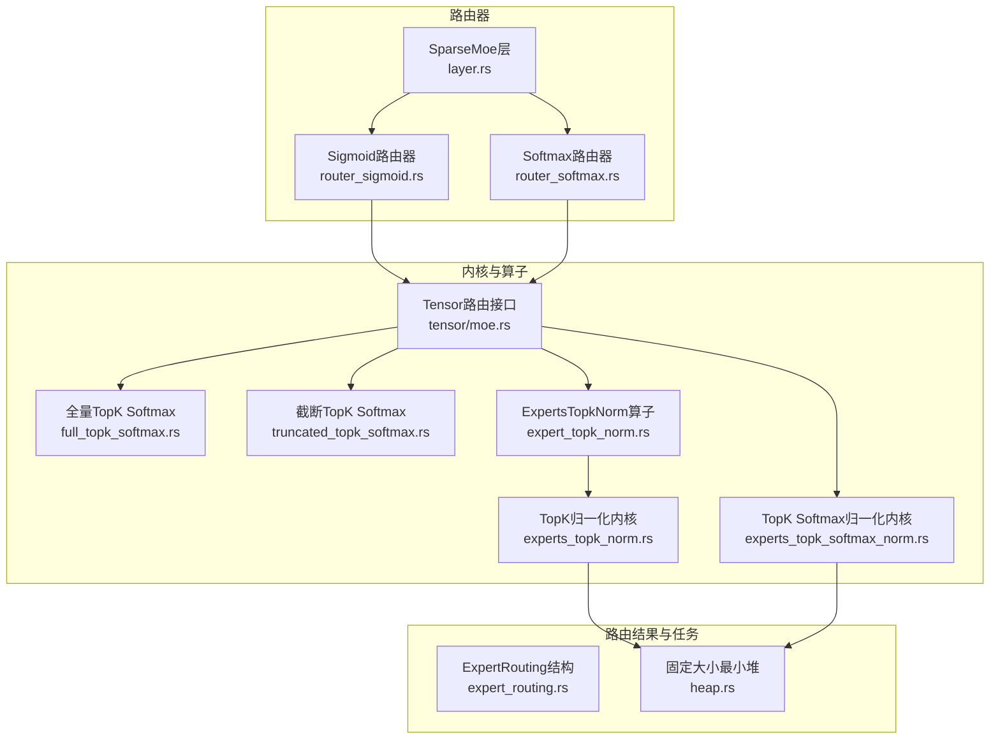
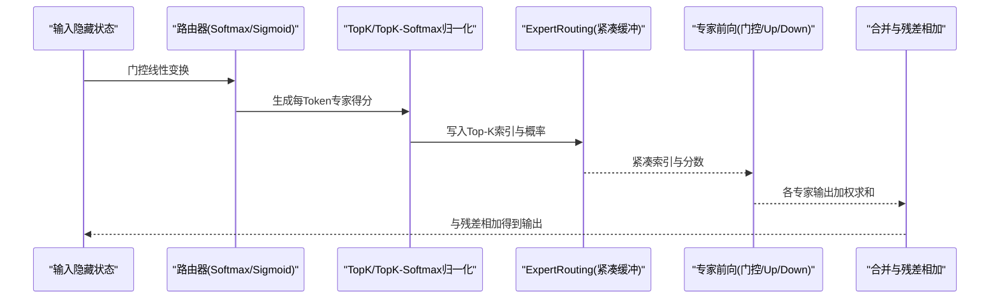
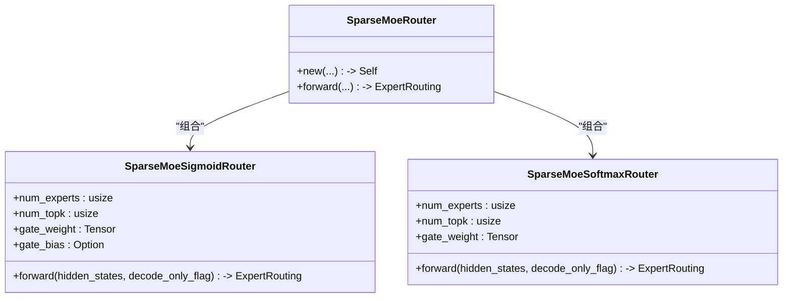
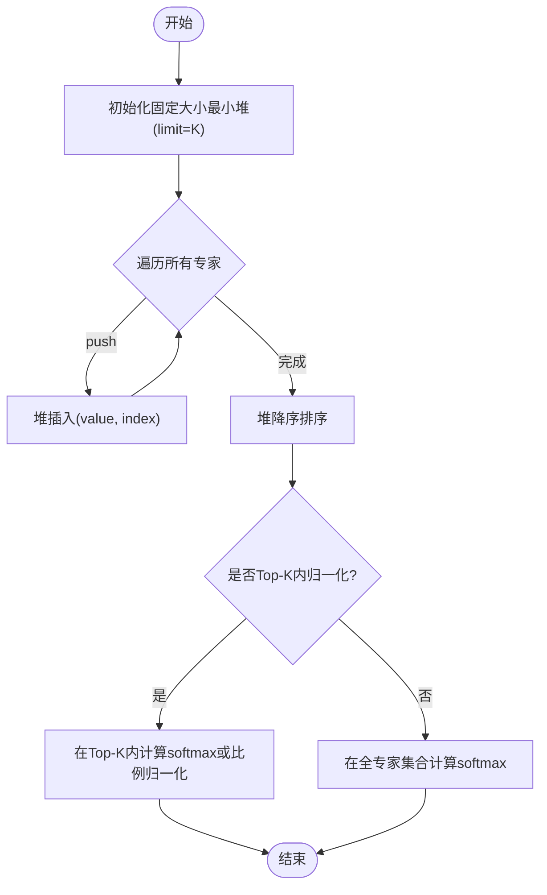
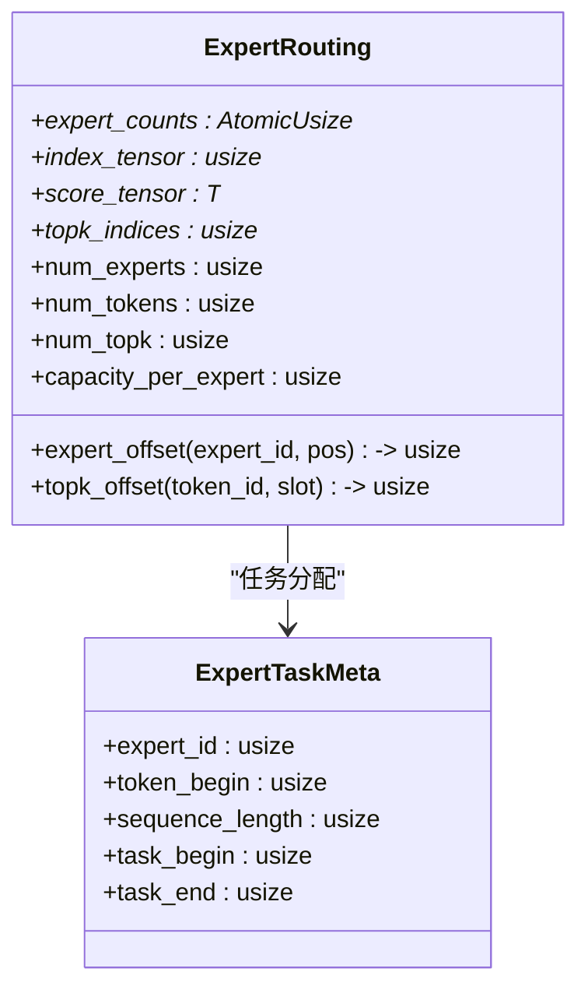
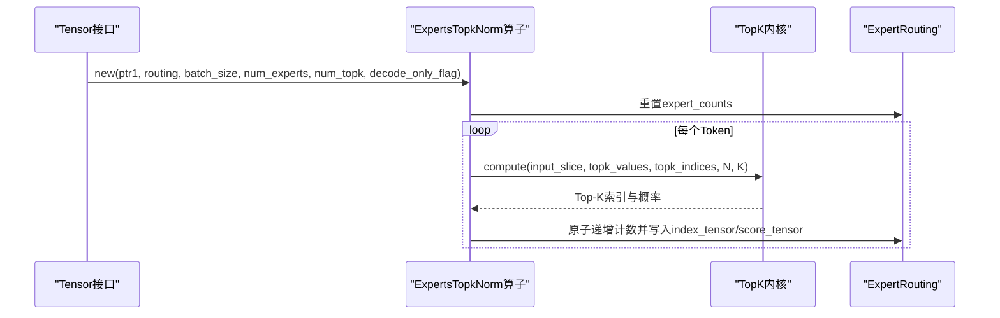
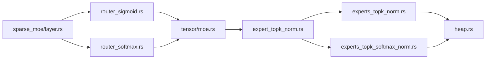

# 专家路由算子实现

<cite>
**本文引用的文件**   
- [src/transformer/sparse_moe/router_sigmoid.rs](file://src/transformer/sparse_moe/router_sigmoid.rs)
- [src/transformer/sparse_moe/router_softmax.rs](file://src/transformer/sparse_moe/router_softmax.rs)
- [src/transformer/sparse_moe/layer.rs](file://src/transformer/sparse_moe/layer.rs)
- [src/operators/expert/expert_routing.rs](file://src/operators/expert/expert_routing.rs)
- [src/kernel/scalar/experts_topk_norm.rs](file://src/kernel/scalar/experts_topk_norm.rs)
- [src/kernel/scalar/experts_topk_softmax_norm.rs](file://src/kernel/scalar/experts_topk_softmax_norm.rs)
- [src/kernel/scalar/full_topk_softmax.rs](file://src/kernel/scalar/full_topk_softmax.rs)
- [src/kernel/scalar/truncated_topk_softmax.rs](file://src/kernel/scalar/truncated_topk_softmax.rs)
- [src/operators/expert/expert_topk_norm.rs](file://src/operators/expert/expert_topk_norm.rs)
- [src/tensor/moe.rs](file://src/tensor/moe.rs)
- [src/transformer/config/router_scoring.rs](file://src/transformer/config/router_scoring.rs)
- [src/kernel/common/heap.rs](file://src/kernel/common/heap.rs)
</cite>

## 目录
1. [简介](#简介)
2. [项目结构](#项目结构)
3. [核心组件](#核心组件)
4. [架构总览](#架构总览)
5. [详细组件分析](#详细组件分析)
6. [依赖关系分析](#依赖关系分析)
7. [性能考虑](#性能考虑)
8. [故障排查指南](#故障排查指南)
9. [结论](#结论)
10. [附录](#附录)

## 简介
本文件聚焦于MoE（Mixture of Experts）中的“专家路由”算子实现，系统性解析Top-K选择与负载均衡策略、Sigmoid路由器与Softmax路由器的差异与适用场景、稀疏激活的权重分配流程、容量限制与溢出处理、以及性能优化与调参建议。文档面向不同技术背景的读者，既提供高层架构视图，也深入到关键内核与数据结构层面。

## 项目结构
围绕专家路由的核心代码分布在以下模块：
- 路由器封装与层集成：router_sigmoid.rs、router_softmax.rs、layer.rs
- 路由结果结构与任务分配：expert_routing.rs
- Top-K与Softmax内核：experts_topk_norm.rs、experts_topk_softmax_norm.rs、full_topk_softmax.rs、truncated_topk_softmax.rs
- 路由算子编排与张量接口：expert_topk_norm.rs、tensor/moe.rs
- 配置与堆实现：router_scoring.rs、kernel/common/heap.rs

图表来源
- [src/transformer/sparse_moe/router_sigmoid.rs:1-77](file://src/transformer/sparse_moe/router_sigmoid.rs#L1-L77)
- [src/transformer/sparse_moe/router_softmax.rs:1-84](file://src/transformer/sparse_moe/router_softmax.rs#L1-L84)
- [src/transformer/sparse_moe/layer.rs:1-200](file://src/transformer/sparse_moe/layer.rs#L1-L200)
- [src/operators/expert/expert_routing.rs:1-168](file://src/operators/expert/expert_routing.rs#L1-L168)
- [src/kernel/scalar/experts_topk_norm.rs:1-84](file://src/kernel/scalar/experts_topk_norm.rs#L1-L84)
- [src/kernel/scalar/experts_topk_softmax_norm.rs:1-165](file://src/kernel/scalar/experts_topk_softmax_norm.rs#L1-L165)
- [src/kernel/scalar/full_topk_softmax.rs:1-127](file://src/kernel/scalar/full_topk_softmax.rs#L1-L127)
- [src/kernel/scalar/truncated_topk_softmax.rs:1-120](file://src/kernel/scalar/truncated_topk_softmax.rs#L1-L120)
- [src/operators/expert/expert_topk_norm.rs:1-164](file://src/operators/expert/expert_topk_norm.rs#L1-L164)
- [src/tensor/moe.rs:1-332](file://src/tensor/moe.rs#L1-L332)
- [src/kernel/common/heap.rs:1-257](file://src/kernel/common/heap.rs#L1-L257)

章节来源
- [src/transformer/sparse_moe/router_sigmoid.rs:1-77](file://src/transformer/sparse_moe/router_sigmoid.rs#L1-L77)
- [src/transformer/sparse_moe/router_softmax.rs:1-84](file://src/transformer/sparse_moe/router_softmax.rs#L1-L84)
- [src/transformer/sparse_moe/layer.rs:1-200](file://src/transformer/sparse_moe/layer.rs#L1-L200)
- [src/operators/expert/expert_routing.rs:1-168](file://src/operators/expert/expert_routing.rs#L1-L168)
- [src/kernel/scalar/experts_topk_norm.rs:1-84](file://src/kernel/scalar/experts_topk_norm.rs#L1-L84)
- [src/kernel/scalar/experts_topk_softmax_norm.rs:1-165](file://src/kernel/scalar/experts_topk_softmax_norm.rs#L1-L165)
- [src/kernel/scalar/full_topk_softmax.rs:1-127](file://src/kernel/scalar/full_topk_softmax.rs#L1-L127)
- [src/kernel/scalar/truncated_topk_softmax.rs:1-120](file://src/kernel/scalar/truncated_topk_softmax.rs#L1-L120)
- [src/operators/expert/expert_topk_norm.rs:1-164](file://src/operators/expert/expert_topk_norm.rs#L1-L164)
- [src/tensor/moe.rs:1-332](file://src/tensor/moe.rs#L1-L332)
- [src/kernel/common/heap.rs:1-257](file://src/kernel/common/heap.rs#L1-L257)

## 核心组件
- 路由器抽象与具体实现
  - Sigmoid路由器：对门控线性输出做逐元素Sigmoid，再按Token进行Top-K并归一化。
  - Softmax路由器：对门控线性输出直接做Top-K Softmax归一化（支持在Top-K子集或全专家集合上归一化）。
- 路由结果结构
  - ExpertRouting：集中保存每个专家的计数、紧凑索引缓冲、分数缓冲、Top-K索引等，用于后续专家计算与合并。
- 内核与算子
  - FixedMinHeap：固定大小的最小堆，高效维护Top-K候选。
  - experts_topk_norm：基于堆的Top-K选择与概率归一化。
  - experts_topk_softmax_norm：Top-K Softmax归一化，支持仅对Top-K子集归一化以提升效率。
  - full_topk_softmax / truncated_topk_softmax：更通用的Top-K Softmax变体，支持温度采样与截断策略。
  - ExpertsTopkNorm算子：将路由结果写入ExpertRouting的紧凑缓冲，负责原子计数与溢出检查。
- Tensor接口
  - tensor/moe.rs：为路由提供高层API，如sigmoid_gate、topk_norm、softmax_norm，统一入队执行。

章节来源
- [src/transformer/sparse_moe/router_sigmoid.rs:1-77](file://src/transformer/sparse_moe/router_sigmoid.rs#L1-L77)
- [src/transformer/sparse_moe/router_softmax.rs:1-84](file://src/transformer/sparse_moe/router_softmax.rs#L1-L84)
- [src/operators/expert/expert_routing.rs:1-168](file://src/operators/expert/expert_routing.rs#L1-L168)
- [src/kernel/common/heap.rs:1-257](file://src/kernel/common/heap.rs#L1-L257)
- [src/kernel/scalar/experts_topk_norm.rs:1-84](file://src/kernel/scalar/experts_topk_norm.rs#L1-L84)
- [src/kernel/scalar/experts_topk_softmax_norm.rs:1-165](file://src/kernel/scalar/experts_topk_softmax_norm.rs#L1-L165)
- [src/kernel/scalar/full_topk_softmax.rs:1-127](file://src/kernel/scalar/full_topk_softmax.rs#L1-L127)
- [src/kernel/scalar/truncated_topk_softmax.rs:1-120](file://src/kernel/scalar/truncated_topk_softmax.rs#L1-L120)
- [src/operators/expert/expert_topk_norm.rs:1-164](file://src/operators/expert/expert_topk_norm.rs#L1-L164)
- [src/tensor/moe.rs:1-332](file://src/tensor/moe.rs#L1-L332)

## 架构总览
下图展示了从输入隐藏状态到最终专家输出的端到端数据流，包括路由选择、专家计算与残差合并。

图表来源
- [src/transformer/sparse_moe/layer.rs:152-198](file://src/transformer/sparse_moe/layer.rs#L152-L198)
- [src/tensor/moe.rs:155-244](file://src/tensor/moe.rs#L155-L244)
- [src/operators/expert/expert_topk_norm.rs:53-102](file://src/operators/expert/expert_topk_norm.rs#L53-L102)

## 详细组件分析

### Sigmoid路由器 vs Softmax路由器
- Sigmoid路由器
  - 先对门控线性输出做逐元素Sigmoid，再对每个Token取Top-K并进行归一化。
  - 适合需要独立阈值控制、多标签式专家选择的场景；对噪声相对鲁棒。
- Softmax路由器
  - 对门控线性输出直接进行Top-K Softmax归一化，可在Top-K子集内归一化以减少计算。
  - 适合需要严格概率分布、强调竞争性的路由场景。

图表来源
- [src/transformer/sparse_moe/router_sigmoid.rs:1-77](file://src/transformer/sparse_moe/router_sigmoid.rs#L1-L77)
- [src/transformer/sparse_moe/router_softmax.rs:1-84](file://src/transformer/sparse_moe/router_softmax.rs#L1-L84)
- [src/transformer/sparse_moe/layer.rs:14-72](file://src/transformer/sparse_moe/layer.rs#L14-L72)

章节来源
- [src/transformer/sparse_moe/router_sigmoid.rs:1-77](file://src/transformer/sparse_moe/router_sigmoid.rs#L1-L77)
- [src/transformer/sparse_moe/router_softmax.rs:1-84](file://src/transformer/sparse_moe/router_softmax.rs#L1-L84)
- [src/transformer/sparse_moe/layer.rs:14-72](file://src/transformer/sparse_moe/layer.rs#L14-L72)

### Top-K选择算法与堆实现
- 使用固定大小最小堆（FixedMinHeap）维护Top-K候选，时间复杂度O(N log K)，空间O(K)。
- 比较函数同时考虑值与索引，保证稳定排序与确定性。
- 在Top-K选择后，再进行概率归一化（Sigmoid路径为Top-K内归一化；Softmax路径可选择在Top-K或全专家集合上归一化）。

图表来源
- [src/kernel/common/heap.rs:1-257](file://src/kernel/common/heap.rs#L1-L257)
- [src/kernel/scalar/experts_topk_norm.rs:1-84](file://src/kernel/scalar/experts_topk_norm.rs#L1-L84)
- [src/kernel/scalar/experts_topk_softmax_norm.rs:1-165](file://src/kernel/scalar/experts_topk_softmax_norm.rs#L1-L165)

章节来源
- [src/kernel/common/heap.rs:1-257](file://src/kernel/common/heap.rs#L1-L257)
- [src/kernel/scalar/experts_topk_norm.rs:1-84](file://src/kernel/scalar/experts_topk_norm.rs#L1-L84)
- [src/kernel/scalar/experts_topk_softmax_norm.rs:1-165](file://src/kernel/scalar/experts_topk_softmax_norm.rs#L1-L165)

### 路由结果结构与任务分配
- ExpertRouting包含：
  - expert_counts：每个专家当前分配的token计数（原子变量，并发安全）。
  - index_tensor：紧凑的专家本地token索引缓冲。
  - score_tensor：对应token的权重分数。
  - topk_indices：每Token的Top-K专家ID。
  - capacity_per_expert：每个专家的最大容量（默认num_tokens * num_topk）。
- task_assign：将全局任务ID映射到特定专家及其局部tile，便于并行分块计算。

图表来源
- [src/operators/expert/expert_routing.rs:1-168](file://src/operators/expert/expert_routing.rs#L1-L168)

章节来源
- [src/operators/expert/expert_routing.rs:1-168](file://src/operators/expert/expert_routing.rs#L1-L168)

### 路由算子与Tensor接口
- Tensor接口提供：
  - sigmoid_gate：门控线性+Sigmoid，返回中间张量。
  - topk_norm：对Sigmoid输出进行Top-K选择与归一化，构建ExpertRouting。
  - softmax_norm：对Softmax输出进行Top-K Softmax归一化，构建ExpertRouting。
- ExpertsTopkNorm算子：
  - 重置专家计数，遍历Token，调用内核计算Top-K，并将结果写入ExpertRouting的紧凑缓冲。
  - 通过原子fetch_add确保并发写安全，并断言pos < capacity_per_expert以检测溢出。

图表来源
- [src/tensor/moe.rs:178-244](file://src/tensor/moe.rs#L178-L244)
- [src/operators/expert/expert_topk_norm.rs:53-102](file://src/operators/expert/expert_topk_norm.rs#L53-L102)

章节来源
- [src/tensor/moe.rs:178-244](file://src/tensor/moe.rs#L178-L244)
- [src/operators/expert/expert_topk_norm.rs:53-102](file://src/operators/expert/expert_topk_norm.rs#L53-L102)

### 稀疏专家网络的激活选择与权重分配
- 激活选择：每个Token选择Top-K个专家，避免全专家计算，降低FLOPs。
- 权重分配：
  - Sigmoid路径：对Top-K内的得分进行比例归一化。
  - Softmax路径：可选择在Top-K内或全专家集合上进行Softmax归一化，后者更严格但计算更大。
- 专家计算：根据ExpertRouting的紧凑索引，仅对被选中的Token-专家对进行矩阵乘法与激活，最后按权重合并。

章节来源
- [src/transformer/sparse_moe/layer.rs:152-198](file://src/transformer/sparse_moe/layer.rs#L152-L198)
- [src/kernel/scalar/experts_topk_norm.rs:1-84](file://src/kernel/scalar/experts_topk_norm.rs#L1-L84)
- [src/kernel/scalar/experts_topk_softmax_norm.rs:1-165](file://src/kernel/scalar/experts_topk_softmax_norm.rs#L1-L165)

### 专家负载不均衡与动态调整机制
- 现状：当前实现未内置显式的负载均衡损失或动态重路由逻辑。
- 建议方案：
  - 训练期引入辅助损失（如专家利用率惩罚），促使路由均匀化。
  - 推理期可结合历史统计进行软路由偏置（例如对过载专家施加负偏置）。
  - 在线监控expert_counts分布，触发阈值时切换路由策略或临时扩容。

章节来源
- [src/operators/expert/expert_routing.rs:1-168](file://src/operators/expert/expert_routing.rs#L1-L168)

### 专家容量限制与溢出处理
- 容量定义：capacity_per_expert = num_tokens * num_topk（默认上限）。
- 溢出检测：写入紧凑缓冲前通过断言检查pos < capacity_per_expert。
- 缓解策略：
  - 增大batch规模时的容量预留。
  - 动态调整num_topk或per-token路由上限。
  - 采用分层路由或专家分组减少单专家压力。

章节来源
- [src/operators/expert/expert_topk_norm.rs:89-98](file://src/operators/expert/expert_topk_norm.rs#L89-L98)
- [src/tensor/moe.rs:246-288](file://src/tensor/moe.rs#L246-L288)

### 路由性能优化技巧
- 预计算与缓存：
  - 门控权重与可选偏置在路由器构造时加载，避免重复分配。
  - 使用GlobalOperatorQueue延迟执行，批量调度减少同步开销。
- 内核优化：
  - 固定大小堆避免动态内存分配。
  - Top-K内归一化减少exp与sum的计算范围。
  - 针对f16/f32特化实现，提升吞吐。
- 批处理与线程划分：
  - 通过assign(task_size, ...)将Token分配到线程，最大化并行度。

章节来源
- [src/tensor/moe.rs:155-244](file://src/tensor/moe.rs#L155-L244)
- [src/operators/expert/expert_topk_norm.rs:53-102](file://src/operators/expert/expert_topk_norm.rs#L53-L102)
- [src/kernel/scalar/experts_topk_softmax_norm.rs:32-57](file://src/kernel/scalar/experts_topk_softmax_norm.rs#L32-L57)

### 路由参数与专家数量调优指南
- num_topk：
  - 较小值（如2-4）节省计算，但可能丢失重要专家；较大值（如6-8）提高精度但增加负载。
- 路由器类型：
  - Sigmoid适合多标签式选择与阈值控制；Softmax适合严格概率竞争。
- 归一化策略：
  - Top-K内归一化更快且数值稳定；全集合归一化更精确但开销更高。
- 温度与采样（TopK Softmax变体）：
  - 温度>1更平滑，<1更尖锐；配合top_p/min_p可进行核采样。

章节来源
- [src/transformer/config/router_scoring.rs:1-23](file://src/transformer/config/router_scoring.rs#L1-L23)
- [src/kernel/scalar/full_topk_softmax.rs:1-127](file://src/kernel/scalar/full_topk_softmax.rs#L1-L127)
- [src/kernel/scalar/truncated_topk_softmax.rs:1-120](file://src/kernel/scalar/truncated_topk_softmax.rs#L1-L120)

## 依赖关系分析
- 路由器依赖：
  - router_sigmoid.rs与router_softmax.rs均依赖Tensor接口进行门控线性与归一化。
- 内核依赖：
  - experts_topk_norm.rs与experts_topk_softmax_norm.rs依赖FixedMinHeap进行Top-K选择。
- 算子编排：
  - expert_topk_norm.rs作为算子，协调内核与ExpertRouting的数据布局。
- 层集成：
  - layer.rs组合路由器与专家前向，形成完整MoE层。

图表来源
- [src/transformer/sparse_moe/router_sigmoid.rs:1-77](file://src/transformer/sparse_moe/router_sigmoid.rs#L1-L77)
- [src/transformer/sparse_moe/router_softmax.rs:1-84](file://src/transformer/sparse_moe/router_softmax.rs#L1-L84)
- [src/tensor/moe.rs:155-244](file://src/tensor/moe.rs#L155-L244)
- [src/operators/expert/expert_topk_norm.rs:1-164](file://src/operators/expert/expert_topk_norm.rs#L1-L164)
- [src/kernel/scalar/experts_topk_norm.rs:1-84](file://src/kernel/scalar/experts_topk_norm.rs#L1-L84)
- [src/kernel/scalar/experts_topk_softmax_norm.rs:1-165](file://src/kernel/scalar/experts_topk_softmax_norm.rs#L1-L165)
- [src/kernel/common/heap.rs:1-257](file://src/kernel/common/heap.rs#L1-L257)
- [src/transformer/sparse_moe/layer.rs:1-200](file://src/transformer/sparse_moe/layer.rs#L1-L200)

章节来源
- [src/transformer/sparse_moe/router_sigmoid.rs:1-77](file://src/transformer/sparse_moe/router_sigmoid.rs#L1-L77)
- [src/transformer/sparse_moe/router_softmax.rs:1-84](file://src/transformer/sparse_moe/router_softmax.rs#L1-L84)
- [src/tensor/moe.rs:155-244](file://src/tensor/moe.rs#L155-L244)
- [src/operators/expert/expert_topk_norm.rs:1-164](file://src/operators/expert/expert_topk_norm.rs#L1-L164)
- [src/kernel/scalar/experts_topk_norm.rs:1-84](file://src/kernel/scalar/experts_topk_norm.rs#L1-L84)
- [src/kernel/scalar/experts_topk_softmax_norm.rs:1-165](file://src/kernel/scalar/experts_topk_softmax_norm.rs#L1-L165)
- [src/kernel/common/heap.rs:1-257](file://src/kernel/common/heap.rs#L1-L257)
- [src/transformer/sparse_moe/layer.rs:1-200](file://src/transformer/sparse_moe/layer.rs#L1-L200)

## 性能考虑
- 内存与分配：
  - 使用AlignedBox与全局内存池减少分配开销。
  - ExpertRouting的紧凑缓冲避免稀疏访问带来的随机访存。
- 并行与调度：
  - GlobalOperatorQueue统一入队，Executor按需执行，降低同步成本。
- 数值稳定性：
  - Softmax中减去最大值以避免溢出；Top-K内归一化减少exp计算范围。
- 数据类型：
  - f16/f32特化实现，兼顾精度与速度。

[本节为通用性能指导，无需列出具体文件来源]

## 故障排查指南
- 断言失败（容量溢出）：
  - 现象：写入expert_offset时断言pos < capacity_per_expert失败。
  - 原因：num_tokens或num_topk过大导致单个专家承载过多Token。
  - 解决：增大capacity_per_expert或减小num_topk/batch规模。
- 路由结果为空：
  - 现象：某专家expert_counts为0，无Token被路由。
  - 原因：得分过低或Top-K选择不命中。
  - 解决：调整路由器温度、偏置或num_topk。
- 数值不稳定：
  - 现象：Softmax出现NaN或Inf。
  - 原因：未正确减去最大值或输入异常。
  - 解决：检查输入缩放与数值范围，确认归一化分支。

章节来源
- [src/operators/expert/expert_topk_norm.rs:89-98](file://src/operators/expert/expert_topk_norm.rs#L89-L98)
- [src/kernel/scalar/experts_topk_softmax_norm.rs:32-57](file://src/kernel/scalar/experts_topk_softmax_norm.rs#L32-L57)

## 结论
该实现以模块化方式组织专家路由：路由器封装、内核级Top-K选择与归一化、紧凑缓冲的任务分配与合并。Sigmoid与Softmax两种路由策略各有适用场景；通过Top-K内归一化与固定大小堆实现高性能；当前未内置负载均衡，可通过训练期损失与推理期偏置进行改进；容量限制通过断言检测并提供调参建议。整体设计兼顾准确性、可扩展性与性能。

[本节为总结性内容，无需列出具体文件来源]

## 附录
- 配置项说明：
  - RouterScoringKind：Softmax或Sigmoid，支持从HuggingFace配置解析与模型家族默认值。
- 参考实现路径：
  - 路由器构造与选择：[src/transformer/sparse_moe/layer.rs:38-72](file://src/transformer/sparse_moe/layer.rs#L38-L72)
  - 路由接口与入队：[src/tensor/moe.rs:155-244](file://src/tensor/moe.rs#L155-L244)
  - Top-K内核与堆：[src/kernel/scalar/experts_topk_norm.rs:1-84](file://src/kernel/scalar/experts_topk_norm.rs#L1-L84), [src/kernel/common/heap.rs:1-257](file://src/kernel/common/heap.rs#L1-L257)

章节来源
- [src/transformer/config/router_scoring.rs:1-23](file://src/transformer/config/router_scoring.rs#L1-L23)
- [src/transformer/sparse_moe/layer.rs:38-72](file://src/transformer/sparse_moe/layer.rs#L38-L72)
- [src/tensor/moe.rs:155-244](file://src/tensor/moe.rs#L155-L244)
- [src/kernel/scalar/experts_topk_norm.rs:1-84](file://src/kernel/scalar/experts_topk_norm.rs#L1-L84)
- [src/kernel/common/heap.rs:1-257](file://src/kernel/common/heap.rs#L1-L257)