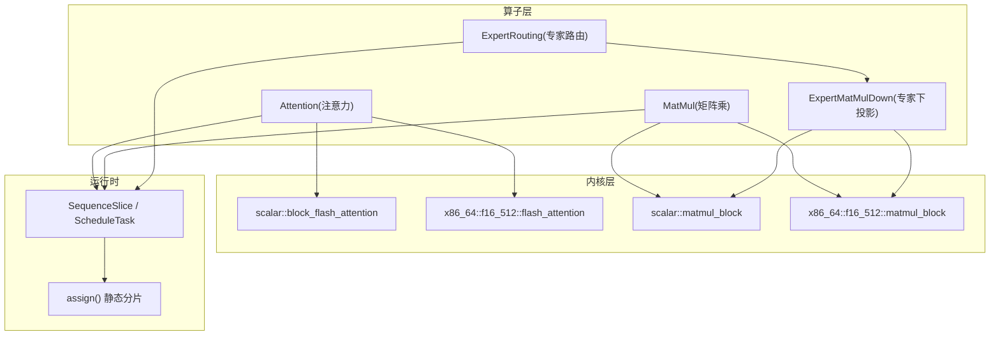
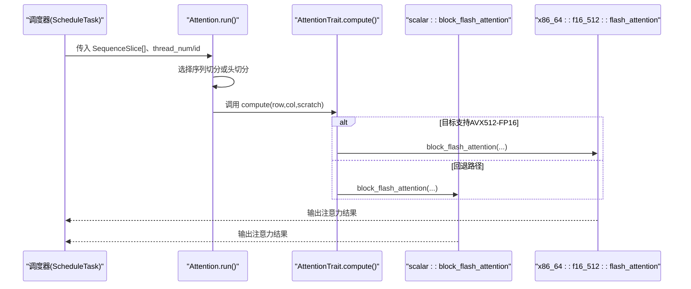
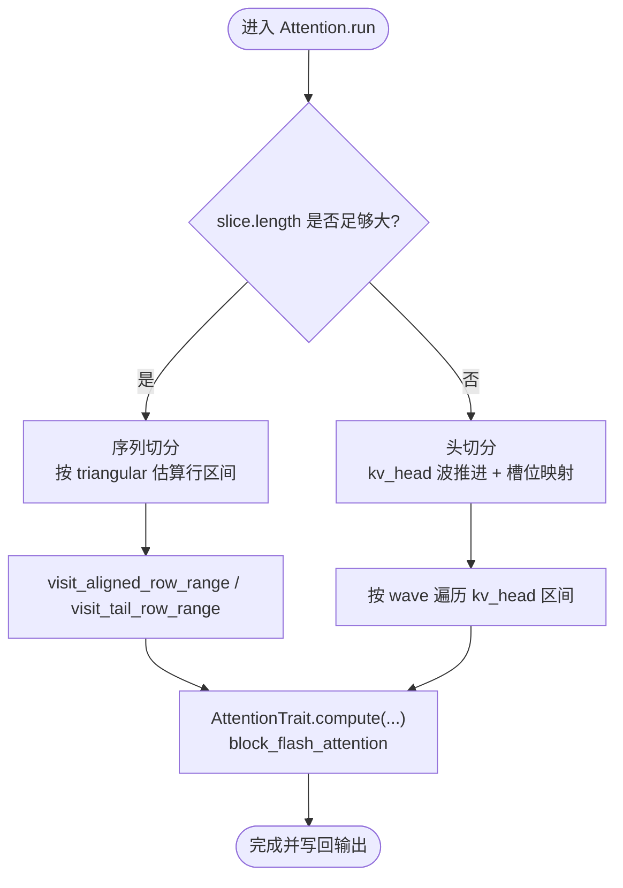
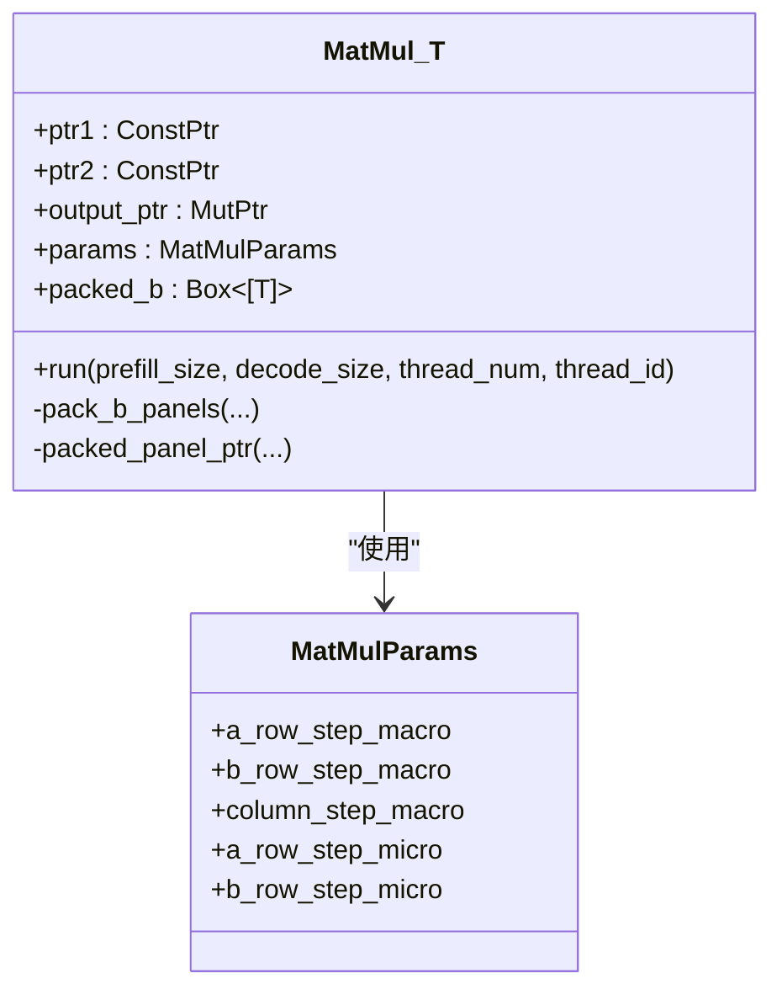
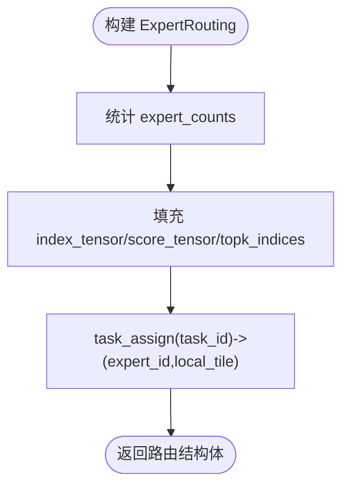
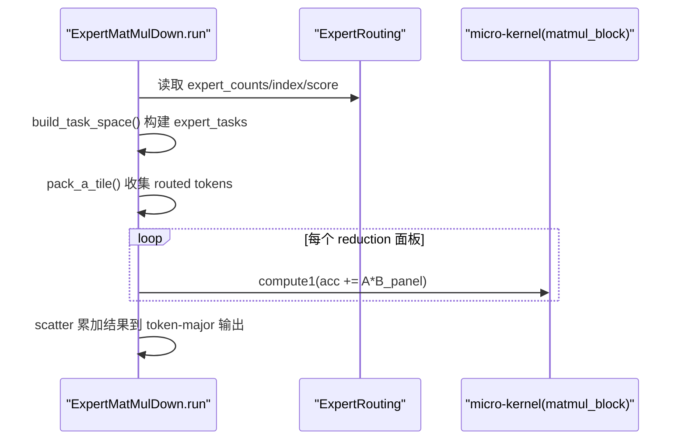
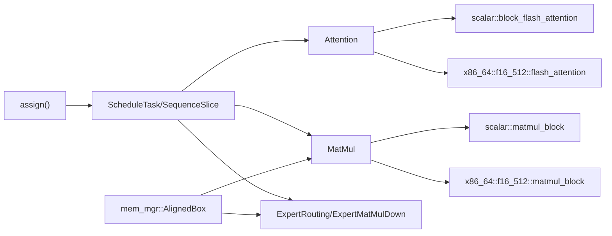

# 复杂算子实现示例

<cite>
**本文引用的文件**   
- [attention.rs](file://src/operators/attention/attention.rs)
- [compute.rs](file://src/operators/attention/compute.rs)
- [block_flash_attention.rs](file://src/kernel/scalar/block_flash_attention.rs)
- [flash_attention.rs](file://src/kernel/x86_64/f16_512/flash_attention.rs)
- [matmul.rs](file://src/operators/matmul/matmul.rs)
- [matmul_block.rs](file://src/kernel/scalar/matmul_block.rs)
- [expert_routing.rs](file://src/operators/expert/expert_routing.rs)
- [expert_matmul_mul.rs](file://src/operators/expert/expert_matmul_mul.rs)
- [allocator.rs](file://src/mem_mgr/allocator.rs)
- [task.rs](file://src/runtime/scheduler/task.rs)
- [assign.rs](file://src/operators/assign.rs)
- [matmul_params.rs](file://src/kernel/common/matmul_params.rs)
- [attention.md](file://docs/design/operators/attention.md)
- [matmul.md](file://docs/design/operators/matmul.md)
</cite>

## 目录
1. [引言](#引言)
2. [项目结构](#项目结构)
3. [核心组件](#核心组件)
4. [架构总览](#架构总览)
5. [详细组件分析](#详细组件分析)
6. [依赖关系分析](#依赖关系分析)
7. [性能考量](#性能考量)
8. [故障排查指南](#故障排查指南)
9. [结论](#结论)
10. [附录：可复用模板与最佳实践](#附录可复用模板与最佳实践)

## 引言
本文件以注意力机制、矩阵乘法、专家路由等复杂算子为例，系统阐述高级算子的实现模式与最佳实践。重点覆盖：
- 复杂计算图与数据依赖的组织方式
- 多线程并行策略（任务分割与结果合并）
- 内存管理与缓存优化技巧
- 性能调优方法与测量思路
- 边界情况与异常处理
- 可复用的代码模板与设计模式

## 项目结构
仓库采用“算子层 + 内核层 + 运行时调度”的分层组织：
- 算子层：封装高层业务逻辑、任务划分、线程私有缓冲管理
- 内核层：提供标量与SIMD/FMA优化的微内核实现
- 运行时：提供任务切片、调度与执行上下文

图表来源
- [attention.rs:1-120](file://src/operators/attention/attention.rs#L1-L120)
- [matmul.rs:1-120](file://src/operators/matmul/matmul.rs#L1-L120)
- [expert_routing.rs:1-80](file://src/operators/expert/expert_routing.rs#L1-L80)
- [block_flash_attention.rs:1-60](file://src/kernel/scalar/block_flash_attention.rs#L1-L60)
- [flash_attention.rs:1-60](file://src/kernel/x86_64/f16_512/flash_attention.rs#L1-L60)
- [matmul_block.rs:1-40](file://src/kernel/scalar/matmul_block.rs#L1-L40)
- [task.rs:1-40](file://src/runtime/scheduler/task.rs#L1-L40)
- [assign.rs:1-40](file://src/operators/assign.rs#L1-L40)

章节来源
- [attention.md:1-120](file://docs/design/operators/attention.md#L1-L120)
- [matmul.md:1-120](file://docs/design/operators/matmul.md#L1-L120)

## 核心组件
- 注意力算子 Attention：支持序列维与头维两种静态切分策略，块级遍历与因果掩码，按线程分配 scratch 缓冲
- 矩阵乘法 MatMul：MB×NB×KC 分块，B 预打包为面板，MR×NR 微内核，线程私有累加器
- 专家路由 ExpertRouting：将 token 路由到专家，构建紧凑队列与 score/index 张量
- 专家下投影 ExpertMatMulDown：基于路由结果的稀疏 GEMM，按 expert 维度组织任务与 tile

章节来源
- [attention.rs:1-120](file://src/operators/attention/attention.rs#L1-L120)
- [matmul.rs:1-120](file://src/operators/matmul/matmul.rs#L1-L120)
- [expert_routing.rs:1-80](file://src/operators/expert/expert_routing.rs#L1-L80)
- [expert_matmul_mul.rs:1-120](file://src/operators/expert/expert_matmul_mul.rs#L1-L120)

## 架构总览
下图展示从调度切片到具体内核的调用链，以及关键数据结构之间的关系。

图表来源
- [attention.rs:430-506](file://src/operators/attention/attention.rs#L430-L506)
- [compute.rs:1-120](file://src/operators/attention/compute.rs#L1-L120)
- [block_flash_attention.rs:1-95](file://src/kernel/scalar/block_flash_attention.rs#L1-L95)
- [flash_attention.rs:140-210](file://src/kernel/x86_64/f16_512/flash_attention.rs#L140-L210)

## 详细组件分析

### 注意力算子（Attention）
- 设计要点
  - 输入由 SequenceSlice 描述，包含 batch_index、token_start_index、length、next_sequence_index 等
  - 根据 slice.length 与 row_step 的关系，动态选择“序列切分”或“头切分”
  - 行方向按 triangular workload 近似平衡；列方向按 col_step 分块
  - 使用 running_max/running_denom 进行在线 softmax 数值稳定
- 多线程与任务分割
  - 长序列：按行区间连续分配，最后一段 tail 由最后一个线程处理
  - 短序列：按 kv_head 波推进，展开 (kv_head, local_head) 槽位后连续分配给线程
- 内存与缓存
  - 每线程分配 scratch（running_max/denom/scores），避免竞争
  - 访问 K/V 时利用 stride 与 head_stride 提升局部性

图表来源
- [attention.rs:314-436](file://src/operators/attention/attention.rs#L314-L436)
- [attention.rs:158-270](file://src/operators/attention/attention.rs#L158-L270)
- [compute.rs:10-130](file://src/operators/attention/compute.rs#L10-L130)

章节来源
- [attention.rs:1-506](file://src/operators/attention/attention.rs#L1-L506)
- [compute.rs:1-174](file://src/operators/attention/compute.rs#L1-L174)
- [block_flash_attention.rs:1-95](file://src/kernel/scalar/block_flash_attention.rs#L1-L95)
- [flash_attention.rs:140-210](file://src/kernel/x86_64/f16_512/flash_attention.rs#L140-L210)
- [attention.md:120-390](file://docs/design/operators/attention.md#L120-L390)

### 矩阵乘法（MatMul）
- 设计要点
  - MB×NB×KC 分块，B 预打包为 panel 布局，减少访存跳跃
  - MR×NR 微内核（如 3×32），充分利用 SIMD/FMA
  - 线程私有 b_panel_pool 与 acc_pool，避免竞争与重复分配
- 多线程与任务分割
  - 将 C 的 tile 展平为一维任务序列，用 assign() 连续分配
  - 每个线程独立维护自己的 panel/accumulator 工作区
- 内存与缓存
  - 预打包 B 面板，保证 micro-kernel 顺序读取
  - 对齐分配（AlignedBox）利于 512-bit 向量指令

图表来源
- [matmul.rs:27-100](file://src/operators/matmul/matmul.rs#L27-L100)
- [matmul_params.rs:1-36](file://src/kernel/common/matmul_params.rs#L1-L36)

章节来源
- [matmul.rs:1-289](file://src/operators/matmul/matmul.rs#L1-L289)
- [matmul_block.rs:1-43](file://src/kernel/scalar/matmul_block.rs#L1-L43)
- [matmul.md:100-210](file://docs/design/operators/matmul.md#L100-L210)

### 专家路由（ExpertRouting）
- 设计要点
  - 将 token 路由到 top-k experts，生成 index_tensor、score_tensor、topk_indices
  - 使用 AtomicUsize 统计各 expert 的 token 计数，便于后续并发安全访问
  - 提供 task_assign 将全局 task id 映射到 expert 与局部 tile
- 内存与缓存
  - 使用 AlignedBox 分配对齐内存，满足 SIMD 要求
  - 紧凑存储 per-expert 队列，提高访存局部性

图表来源
- [expert_routing.rs:68-125](file://src/operators/expert/expert_routing.rs#L68-L125)
- [allocator.rs:1-80](file://src/mem_mgr/allocator.rs#L1-L80)

章节来源
- [expert_routing.rs:1-168](file://src/operators/expert/expert_routing.rs#L1-L168)
- [allocator.rs:1-156](file://src/mem_mgr/allocator.rs#L1-L156)

### 专家下投影（ExpertMatMulDown）
- 设计要点
  - 基于 ExpertRouting 的紧凑队列，对每个 expert 做稀疏 GEMM
  - 将 routed tokens 收集到 a_tile，不足的行补零，保持 micro-kernel 形状不变
  - 输出按 token-major 布局，结合 route weight 写入对应 slot
- 多线程与任务分割
  - 构建 expert_tasks 元信息，按 output_column_tile_count 拆分任务
  - 使用 assign() 将任务范围分配给线程，线程内再按 KC/NR/MR 分层循环
- 内存与缓存
  - 线程私有 a_tile_pool、acc_pool、idx_buf_pool，避免竞争
  - 预打包 wdown NT 面板，加速 micro-kernel 读取

图表来源
- [expert_matmul_mul.rs:399-578](file://src/operators/expert/expert_matmul_mul.rs#L399-L578)
- [matmul_block.rs:1-43](file://src/kernel/scalar/matmul_block.rs#L1-L43)

章节来源
- [expert_matmul_mul.rs:1-578](file://src/operators/expert/expert_matmul_mul.rs#L1-L578)

## 依赖关系分析
- 算子层依赖内核层提供的微内核实现（标量与 x86_64 FP16）
- 调度层通过 SequenceSlice 提供任务切片，assign() 负责静态分片
- 内存管理器提供对齐分配，确保 SIMD 友好

图表来源
- [assign.rs:1-40](file://src/operators/assign.rs#L1-L40)
- [task.rs:1-40](file://src/runtime/scheduler/task.rs#L1-L40)
- [attention.rs:1-120](file://src/operators/attention/attention.rs#L1-L120)
- [matmul.rs:1-120](file://src/operators/matmul/matmul.rs#L1-L120)
- [expert_routing.rs:1-80](file://src/operators/expert/expert_routing.rs#L1-L80)
- [block_flash_attention.rs:1-60](file://src/kernel/scalar/block_flash_attention.rs#L1-L60)
- [flash_attention.rs:1-60](file://src/kernel/x86_64/f16_512/flash_attention.rs#L1-L60)
- [matmul_block.rs:1-40](file://src/kernel/scalar/matmul_block.rs#L1-L40)
- [allocator.rs:1-80](file://src/mem_mgr/allocator.rs#L1-L80)

章节来源
- [assign.rs:1-258](file://src/operators/assign.rs#L1-L258)
- [task.rs:1-73](file://src/runtime/scheduler/task.rs#L1-L73)

## 性能考量
- 分块与微内核
  - 选择合适的 MB/NB/KC/MR/NR，使 L1/L2 命中率最大化
  - 使用广播式 micro-kernel（如 3×32）提升 FMA 吞吐
- 预打包与对齐
  - B/wdown 预打包为 panel，减少随机访存
  - 使用 64 字节对齐分配，适配 512-bit 向量
- 线程私有缓冲
  - 避免 false sharing 与锁竞争
  - 复用缓冲区，降低分配开销
- 静态任务分配
  - 连续范围分配，提升空间局部性
  - 避免动态 work-stealing 的额外开销
- 数值稳定性
  - attention 中 running_max/running_denom 防止溢出/下溢
- 测量建议
  - 使用基准套件对不同参数组合进行 sweep
  - 关注 cache miss、FLOPs 利用率、线程占用率

章节来源
- [matmul.md:210-495](file://docs/design/operators/matmul.md#L210-L495)
- [attention.md:290-390](file://docs/design/operators/attention.md#L290-L390)
- [allocator.rs:1-156](file://src/mem_mgr/allocator.rs#L1-L156)

## 故障排查指南
- 常见错误与定位
  - 越界访问：检查 SequenceSlice 的 token_start_index、batch_index、length 与 next_sequence_index
  - 对齐问题：确认 AlignedBox 分配长度与类型，确保指针 64 字节对齐
  - 线程冲突：确认线程私有缓冲未共享，atomic 操作使用正确的 Ordering
  - 数值不稳定：检查 running_max/running_denom 初始化与更新逻辑
- 调试手段
  - 在关键路径添加断言（如 debug_assert!）
  - 使用最小可复现用例验证单线程行为
  - 对比 naive 实现与内核输出的误差

章节来源
- [attention.rs:508-704](file://src/operators/attention/attention.rs#L508-L704)
- [matmul.rs:364-662](file://src/operators/matmul/matmul.rs#L364-L662)
- [block_flash_attention.rs:97-281](file://src/kernel/scalar/block_flash_attention.rs#L97-L281)
- [flash_attention.rs:211-286](file://src/kernel/x86_64/f16_512/flash_attention.rs#L211-L286)

## 结论
本仓库通过清晰的算子-内核-调度分层，实现了高性能的注意力、矩阵乘法与专家路由算子。其核心在于：
- 静态任务分割与连续访问
- 预打包与线程私有缓冲
- 微内核与 SIMD/FMA 优化
- 数值稳定的在线计算
这些模式可复用于其他复杂算子，形成统一的实现范式。

## 附录：可复用模板与最佳实践
- 算子模板
  - 定义算子结构体，封装指针、参数与线程私有缓冲
  - new() 中完成预打包与缓冲分配；run() 只做计算与写回
  - 通过 trait 暴露 compute/compute2 等钩子，便于特化
- 任务分割模板
  - 使用 assign(length, num, id) 获取连续任务区间
  - 对于二维任务（如 tiles），先展平再映射回坐标
- 内存管理模板
  - 使用 AlignedBox 分配对齐内存
  - 为每个线程准备私有 scratch，生命周期与 run() 绑定
- 数值稳定模板
  - attention 中使用 running_max/running_denom
  - 必要时引入 eps 与 clamp 保护
- 性能调优模板
  - 调整 MB/NB/KC/MR/NR 参数，观察吞吐与缓存命中
  - 启用 AVX512-FP16 路径，回退到标量路径保证兼容

章节来源
- [matmul.rs:1-120](file://src/operators/matmul/matmul.rs#L1-L120)
- [expert_matmul_mul.rs:1-120](file://src/operators/expert/expert_matmul_mul.rs#L1-L120)
- [assign.rs:1-40](file://src/operators/assign.rs#L1-L40)
- [allocator.rs:1-80](file://src/mem_mgr/allocator.rs#L1-L80)
- [matmul.md:450-519](file://docs/design/operators/matmul.md#L450-L519)