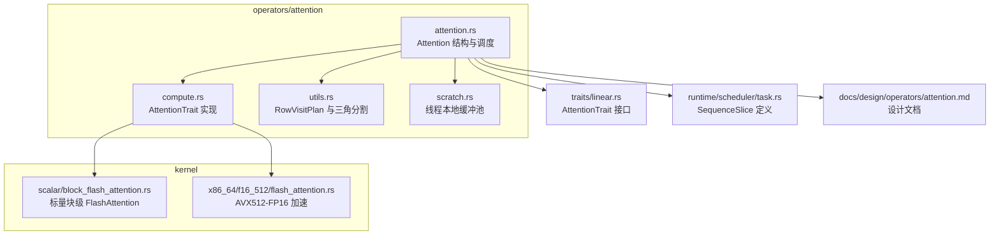
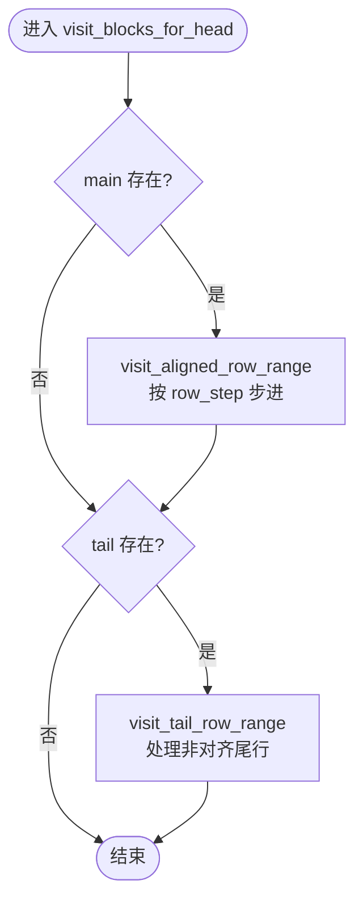
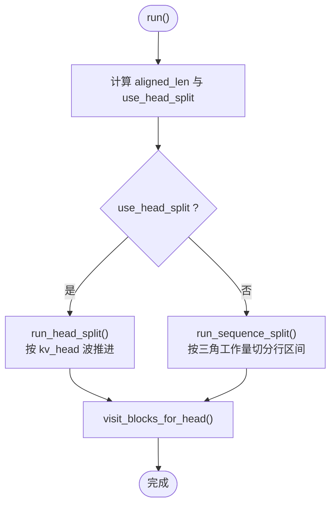
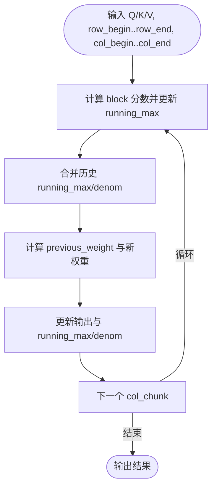
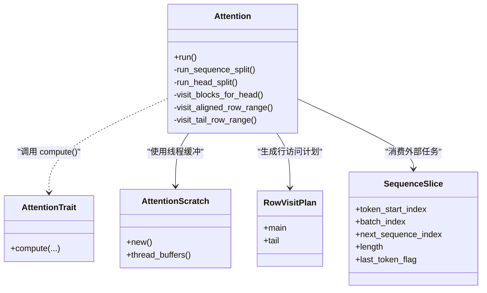

# 注意力算子实现详解

<cite>
**本文引用的文件**   
- [attention.rs](file://src/operators/attention/attention.rs)
- [compute.rs](file://src/operators/attention/compute.rs)
- [utils.rs](file://src/operators/attention/utils.rs)
- [scratch.rs](file://src/operators/attention/scratch.rs)
- [block_flash_attention.rs](file://src/kernel/scalar/block_flash_attention.rs)
- [flash_attention.rs](file://src/kernel/x86_64/f16_512/flash_attention.rs)
- [linear.rs](file://src/operators/traits/linear.rs)
- [task.rs](file://src/runtime/scheduler/task.rs)
- [attention.md](file://docs/design/operators/attention.md)
</cite>

## 目录
1. [简介](#简介)
2. [项目结构](#项目结构)
3. [核心组件](#核心组件)
4. [架构总览](#架构总览)
5. [详细组件分析](#详细组件分析)
6. [依赖关系分析](#依赖关系分析)
7. [性能考量](#性能考量)
8. [故障排查指南](#故障排查指南)
9. [结论](#结论)
10. [附录](#附录)

## 简介
本文件系统性解析 eLLM 中的注意力算子实现，重点覆盖：
- Attention 结构体的设计与 Q/K/V 指针管理、内存布局与步长参数
- 行访问计划 RowVisitPlan 的对齐与非对齐尾行处理
- 序列分割（sequence_split）与头部分割（head_split）的选择逻辑与性能权衡
- 多线程缓冲区管理与缓存优化技巧
- 缩放点积注意力与掩码机制的核心算法实现
- 不同 batch、序列长度、注意力头数组合场景的处理方式

## 项目结构
注意力算子位于 operators/attention 模块，包含核心结构、计算调度、线程本地缓冲与工具函数；底层内核在 kernel/scalar 与 kernel/x86_64 中提供标量与 AVX512-FP16 路径。



图表来源
- [attention.rs:1-120](file://src/operators/attention/attention.rs#L1-L120)
- [compute.rs:10-62](file://src/operators/attention/compute.rs#L10-L62)
- [utils.rs:1-61](file://src/operators/attention/utils.rs#L1-L61)
- [scratch.rs:19-73](file://src/operators/attention/scratch.rs#L19-L73)
- [block_flash_attention.rs:5-95](file://src/kernel/scalar/block_flash_attention.rs#L5-L95)
- [flash_attention.rs:142-210](file://src/kernel/x86_64/f16_512/flash_attention.rs#L142-L210)
- [linear.rs:1-22](file://src/operators/traits/linear.rs#L1-L22)
- [task.rs:1-8](file://src/runtime/scheduler/task.rs#L1-L8)
- [attention.md:136-201](file://docs/design/operators/attention.md#L136-L201)

章节来源
- [attention.rs:1-120](file://src/operators/attention/attention.rs#L1-L120)
- [compute.rs:10-62](file://src/operators/attention/compute.rs#L10-L62)
- [utils.rs:1-61](file://src/operators/attention/utils.rs#L1-L61)
- [scratch.rs:19-73](file://src/operators/attention/scratch.rs#L19-L73)
- [block_flash_attention.rs:5-95](file://src/kernel/scalar/block_flash_attention.rs#L5-L95)
- [flash_attention.rs:142-210](file://src/kernel/x86_64/f16_512/flash_attention.rs#L142-L210)
- [linear.rs:1-22](file://src/operators/traits/linear.rs#L1-L22)
- [task.rs:1-8](file://src/runtime/scheduler/task.rs#L1-L8)
- [attention.md:136-201](file://docs/design/operators/attention.md#L136-L201)

## 核心组件
- Attention<T>：封装 Q/K/V 与输出指针、步长、维度、线程配置与线程本地缓冲池，提供 run() 入口与两种分割策略。
- AttentionTrait<T>：抽象 compute() 接口，按数据类型选择标量或 AVX512-FP16 内核。
- RowVisitPlan：描述主对齐行范围与尾部非对齐行范围，配合 visit_aligned_row_range / visit_tail_row_range 完成行遍历。
- AttentionScratch：为每个线程分配 running_max、running_denom、scores 的本地缓冲，避免跨线程竞争并提升缓存局部性。
- block_flash_attention：实现分块增量式 softmax 与数值稳定的在线更新，支持因果掩码。

章节来源
- [attention.rs:14-100](file://src/operators/attention/attention.rs#L14-L100)
- [compute.rs:10-62](file://src/operators/attention/compute.rs#L10-L62)
- [utils.rs:1-61](file://src/operators/attention/utils.rs#L1-L61)
- [scratch.rs:19-73](file://src/operators/attention/scratch.rs#L19-L73)
- [block_flash_attention.rs:5-95](file://src/kernel/scalar/block_flash_attention.rs#L5-L95)

## 架构总览
整体执行流程从 run() 开始，根据 slice.length 与 row_step 判断使用 sequence_split 还是 head_split，随后对每个 kv_head 与 local_head 调用 visit_blocks_for_head，内部再按 row_step × col_step 分块迭代，最终通过 AttentionTrait::compute 进入具体内核。

```mermaid
sequenceDiagram
participant Caller as "调用方"
participant Att as "Attention.run()"
participant Seq as "run_sequence_split()"
participant Head as "run_head_split()"
participant Block as "visit_blocks_for_head()"
trait as "AttentionTrait.compute()"
kernel as "block_flash_attention()"
Caller->>Att : run(prefill, decode, slices, thread_num, thread_id)
alt 长切片(按序列切分)
Att->>Seq : 计算 aligned_len 与 use_head_split=false
Seq->>Block : 为每个 kv_head/local_head 生成 RowVisitPlan
Block->>trait : compute(row_chunk,col_chunk,...)
trait->>kernel : 标量/AVX512 内核
kernel-->>Block : 更新 output + running_max/denom
else 短切片(按头切分)
Att->>Head : 计算 active_thread_num/kv_heads_per_wave
Head->>Block : 按 wave 静态分配连续 slot 给线程
Block->>trait : compute(...)
trait->>kernel : 标量/AVX512 内核
end
Block-->>Att : 完成当前 slice 的计算
Att-->>Caller : 返回
```

图表来源
- [attention.rs:439-505](file://src/operators/attention/attention.rs#L439-L505)
- [attention.rs:314-361](file://src/operators/attention/attention.rs#L314-L361)
- [attention.rs:364-436](file://src/operators/attention/attention.rs#L364-L436)
- [attention.rs:273-311](file://src/operators/attention/attention.rs#L273-L311)
- [compute.rs:10-62](file://src/operators/attention/compute.rs#L10-L62)
- [block_flash_attention.rs:5-95](file://src/kernel/scalar/block_flash_attention.rs#L5-L95)

## 详细组件分析

### Attention 结构体与 Q/K/V 指针管理
- 字段涵盖 q_ptr/k_ptr/v_ptr/output_ptr、batch_size、sequence_length、attention_head_num、kv_head_num、各维 stride（k_batch_stride/k_head_stride/k_seq_stride 等）、row_step/col_step、inverse_sqrt_head、decode_only_flag、thread_num 与 scratch。
- new() 初始化所有元数据并创建线程本地缓冲池。
- run() 遍历 attention_list，定位每个 slice 的 Q/K/V/O 指针，计算 col_end、aligned_len，依据条件选择 sequence_split 或 head_split。

章节来源
- [attention.rs:14-100](file://src/operators/attention/attention.rs#L14-L100)
- [attention.rs:439-505](file://src/operators/attention/attention.rs#L439-L505)

### 行访问计划 RowVisitPlan 与对齐/尾行处理
- RowVisitPlan.main：对齐的行区间，由 split_sequence_by_triangle 基于三角工作量估计进行负载均衡。
- RowVisitPlan.tail：当 aligned_len < slice.length 时，将剩余尾行交给最后一个线程处理，保证完整覆盖。
- visit_aligned_row_range：按 row_step 步进，逐块调用 AttentionTrait::compute，维护 running_max/denom/scores。
- visit_tail_row_range：直接处理非对齐尾行，同样按 col_step 分块调用 compute。



图表来源
- [attention.rs:273-311](file://src/operators/attention/attention.rs#L273-L311)
- [attention.rs:158-215](file://src/operators/attention/attention.rs#L158-L215)
- [attention.rs:217-270](file://src/operators/attention/attention.rs#L217-L270)
- [utils.rs:40-61](file://src/operators/attention/utils.rs#L40-L61)

章节来源
- [attention.rs:158-270](file://src/operators/attention/attention.rs#L158-L270)
- [utils.rs:1-61](file://src/operators/attention/utils.rs#L1-L61)

### 序列分割（sequence_split）与头部分割（head_split）
- 选择逻辑：use_head_split = slice.length > 0 && thread_num > 0 && ceil(slice.length / row_step) < thread_num。否则走 sequence_split。
- sequence_split：按三角工作量估算，将连续行区间分配给线程，保证因果注意力的负载近似均衡；最后线程额外处理 tail。
- head_split：以 kv_head 为单位推进“波”，每波激活最少 kv_head 数以满足线程覆盖；在当前波内将展平的 (kv_head, local_head) 槽位连续分配给线程，无动态抢占。



图表来源
- [attention.rs:439-505](file://src/operators/attention/attention.rs#L439-L505)
- [attention.rs:314-361](file://src/operators/attention/attention.rs#L314-L361)
- [attention.rs:364-436](file://src/operators/attention/attention.rs#L364-L436)

章节来源
- [attention.rs:314-436](file://src/operators/attention/attention.rs#L314-L436)
- [attention.md:136-201](file://docs/design/operators/attention.md#L136-L201)

### 多线程缓冲区管理与缓存优化
- AttentionScratch 为每个线程预分配 running_max、running_denom、scores 缓冲，stride 分别等于 row_step 与 col_step。
- thread_buffers() 通过原始指针偏移获取线程私有切片，避免锁与竞争。
- clear() 初始化 running_max 为负无穷、denom 与 scores 为零，确保增量更新的正确性。
- 这种设计提升了 L1/L2 缓存命中率，减少跨线程同步开销。

章节来源
- [scratch.rs:19-92](file://src/operators/attention/scratch.rs#L19-L92)

### 注意力计算核心算法：缩放点积与掩码
- AttentionTrait::compute 默认调用标量 block_flash_attention；f16 特化在支持 AVX512-FP16 时切换到 x86_64::f16_512::flash_attention。
- block_flash_attention 实现在线 softmax：逐列块计算 score，维护 running_max/denom，逐步合并前序结果，数值稳定且支持因果掩码 visible_col_end = min(next_sequence_index + row + 1, total_col_end)。
- 权重更新采用 previous_weight = carry / next_denom 的方式融合历史输出，避免重复计算。



图表来源
- [compute.rs:10-62](file://src/operators/attention/compute.rs#L10-L62)
- [block_flash_attention.rs:5-95](file://src/kernel/scalar/block_flash_attention.rs#L5-L95)
- [flash_attention.rs:142-210](file://src/kernel/x86_64/f16_512/flash_attention.rs#L142-L210)

章节来源
- [compute.rs:10-62](file://src/operators/attention/compute.rs#L10-L62)
- [block_flash_attention.rs:5-95](file://src/kernel/scalar/block_flash_attention.rs#L5-L95)
- [flash_attention.rs:142-210](file://src/kernel/x86_64/f16_512/flash_attention.rs#L142-L210)

### 不同 batch、序列长度、注意力头数的组合场景
- batch 维度通过 SequenceSlice.batch_index 定位 K/V 批起始位置，Q/O 通过 token_start_index 与 q_token_stride 定位。
- 序列长度影响分割策略：长序列优先按行区间切分，短序列优先按 kv_head 波推进。
- 注意力头数与 kv_head 数决定 attention_heads_per_kv 与 wave 大小，确保线程覆盖与缓存局部性。

章节来源
- [attention.rs:439-505](file://src/operators/attention/attention.rs#L439-L505)
- [task.rs:1-8](file://src/runtime/scheduler/task.rs#L1-L8)
- [attention.md:136-201](file://docs/design/operators/attention.md#L136-L201)

## 依赖关系分析
- Attention 依赖 AttentionTrait 抽象，compute() 多态分发到标量或 AVX512-FP16 内核。
- utils.rs 提供 RowVisitPlan 与三角分割工具，被 visit_* 方法使用。
- scratch.rs 提供线程本地缓冲，被 visit_* 方法按需获取。
- runtime/scheduler/task.rs 定义 SequenceSlice，作为外部任务单元传入 Attention.run()。



图表来源
- [attention.rs:14-100](file://src/operators/attention/attention.rs#L14-L100)
- [linear.rs:1-22](file://src/operators/traits/linear.rs#L1-L22)
- [scratch.rs:19-73](file://src/operators/attention/scratch.rs#L19-L73)
- [utils.rs:1-61](file://src/operators/attention/utils.rs#L1-L61)
- [task.rs:1-8](file://src/runtime/scheduler/task.rs#L1-L8)

章节来源
- [attention.rs:14-100](file://src/operators/attention/attention.rs#L14-L100)
- [linear.rs:1-22](file://src/operators/traits/linear.rs#L1-L22)
- [scratch.rs:19-73](file://src/operators/attention/scratch.rs#L19-L73)
- [utils.rs:1-61](file://src/operators/attention/utils.rs#L1-L61)
- [task.rs:1-8](file://src/runtime/scheduler/task.rs#L1-L8)

## 性能考量
- 分块粒度：row_step=1、col_step=8，平衡访存与计算密度。
- 三角工作量估计：缓解因果注意力的负载不均衡问题，提高线程利用率。
- 头部分割波推进：短序列下最小化 kv_head 激活数量，提升缓存局部性与核心覆盖率。
- 线程本地缓冲：避免跨线程竞争，降低同步开销，提升 L1/L2 命中。
- 数值稳定性：在线 softmax 维护 running_max/denom，避免溢出与精度损失。

[本节为通用指导，不直接分析具体文件]

## 故障排查指南
- 若输出全零或异常小值：检查 running_max 初始化为负无穷、running_denom 初始化为零是否正确；确认 col_end 与 visible_col_end 计算无误。
- 若线程未充分利用：检查 use_head_split 条件与 slice.length、row_step 的关系；确认 thread_num 与 attention_head_num 的比例是否导致空闲。
- 若尾行未更新：确认 RowVisitPlan.tail 是否存在并被最后一个线程执行。
- 若 K/V 读取错位：核对 k_batch_stride/k_head_stride/k_seq_stride 与 v 对应步长是否与数据布局一致。

章节来源
- [scratch.rs:75-92](file://src/operators/attention/scratch.rs#L75-L92)
- [attention.rs:439-505](file://src/operators/attention/attention.rs#L439-L505)
- [attention.rs:273-311](file://src/operators/attention/attention.rs#L273-L311)

## 结论
该注意力算子通过 Attention 结构体统一管理 Q/K/V 指针与步长，结合 RowVisitPlan 与分块遍历实现高效的因果注意力计算。sequence_split 与 head_split 两种策略在不同序列长度下自适应切换，最大化 CPU 利用率与缓存局部性。线程本地缓冲与在线 softmax 保证了数值稳定性与高性能。整体设计清晰、可扩展，适用于多种 batch、序列长度与注意力头数组合。

[本节为总结，不直接分析具体文件]

## 附录
- 设计文档参考：CPU Attention 静态并行分配策略、GQA 语义与因果语义说明。
- 关键参数：thread_num、num_attention_heads、num_key_value_heads、head_size、row_step、col_step、sequence_length。

章节来源
- [attention.md:1-390](file://docs/design/operators/attention.md#L1-L390)