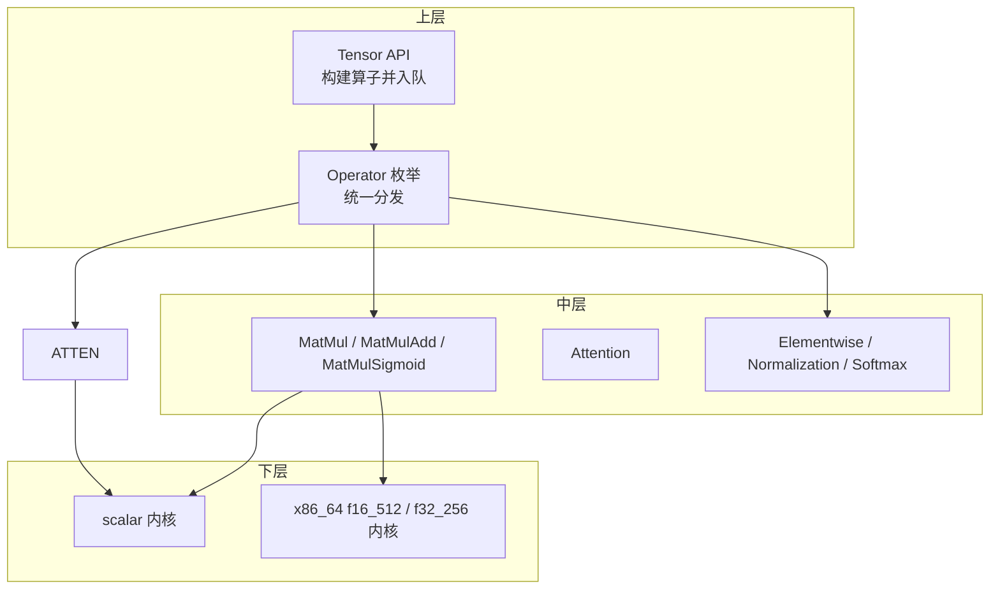
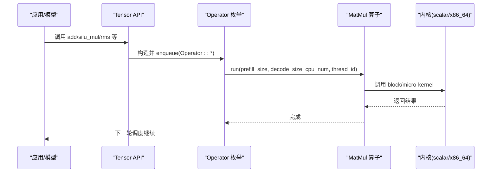
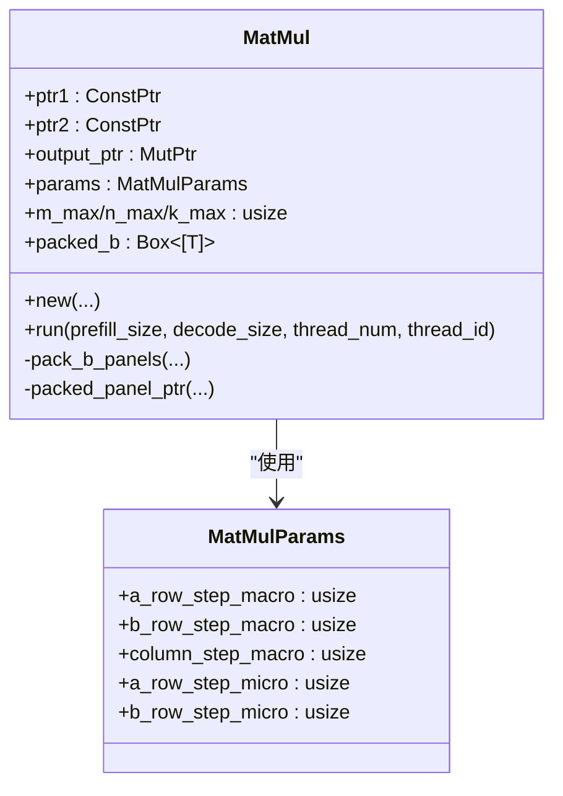
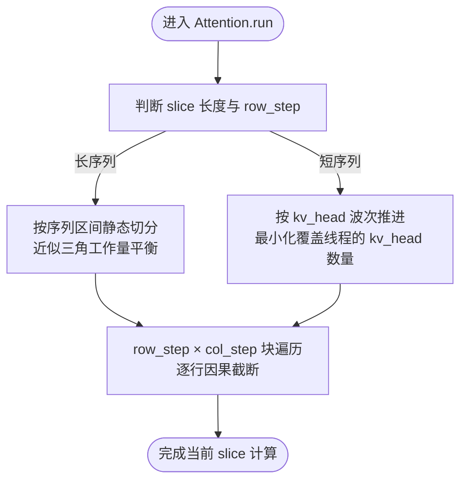
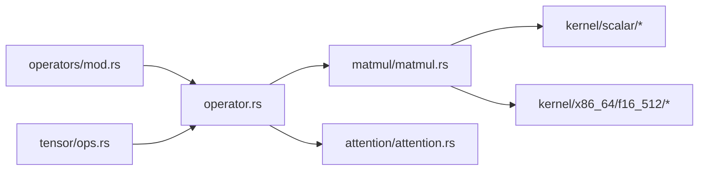

# 新算子开发

<cite>
**本文引用的文件**   
- [src/operators/operator.rs](file://src/operators/operator.rs)
- [src/operators/mod.rs](file://src/operators/mod.rs)
- [src/tensor/ops.rs](file://src/tensor/ops.rs)
- [src/kernel/mod.rs](file://src/kernel/mod.rs)
- [src/kernel/scalar/matmul_block.rs](file://src/kernel/scalar/matmul_block.rs)
- [src/kernel/x86_64/f16_512/matmul_block.rs](file://src/kernel/x86_64/f16_512/matmul_block.rs)
- [src/operators/matmul/matmul.rs](file://src/operators/matmul/matmul.rs)
- [src/operators/attention/attention.rs](file://src/operators/attention/attention.rs)
- [src/operators/attention/mod.rs](file://src/operators/attention/mod.rs)
- [docs/design/operators/matmul.md](file://docs/design/operators/matmul.md)
- [docs/design/operators/attention.md](file://docs/design/operators/attention.md)
- [docs/contributing/new_operator.md](file://docs/contributing/new_operator.md)
- [alignment/README.md](file://alignment/README.md)
</cite>

## 目录
1. [引言](#引言)
2. [项目结构](#项目结构)
3. [核心组件](#核心组件)
4. [架构总览](#架构总览)
5. [详细组件分析](#详细组件分析)
6. [依赖关系分析](#依赖关系分析)
7. [性能与SIMD优化](#性能与simd优化)
8. [测试与基准](#测试与基准)
9. [注册机制与生命周期](#注册机制与生命周期)
10. [内存对齐与缓存优化](#内存对齐与缓存优化)
11. [常见算子模板与参考实现](#常见算子模板与参考实现)
12. [故障排查指南](#故障排查指南)
13. [结论](#结论)

## 引言
本指南面向希望在 eLLM 中新增高性能算子的开发者，系统阐述算子架构、接口规范、SIMD内核优化方法、复杂算子（矩阵乘法、注意力）的实现范式、测试与基准流程、注册机制与生命周期管理，以及内存对齐与缓存优化等底层技巧。文档以仓库现有实现为依据，提供可追溯的源码路径与图示，帮助读者快速上手并写出高质量的高性能算子。

## 项目结构
eLLM 的算子系统采用“上层调度 + 中层算子 + 下层内核”的分层设计：
- 上层调度：通过 Operator 枚举统一分发，结合运行时任务切片进行静态并行分配。
- 中层算子：按功能域组织（如 matmul、attention、elementwise、softmax 等），封装数据指针、分块参数与线程私有缓冲区。
- 下层内核：标量与平台特定 SIMD 内核（x86_64 AVX-512 FP16 等），负责微核计算。

图表来源
- [src/operators/operator.rs:32-224](file://src/operators/operator.rs#L32-L224)
- [src/tensor/ops.rs:13-166](file://src/tensor/ops.rs#L13-L166)
- [src/operators/matmul/matmul.rs:27-100](file://src/operators/matmul/matmul.rs#L27-L100)
- [src/operators/attention/attention.rs:14-100](file://src/operators/attention/attention.rs#L14-L100)
- [src/kernel/mod.rs:1-4](file://src/kernel/mod.rs#L1-L4)

章节来源
- [src/operators/operator.rs:32-224](file://src/operators/operator.rs#L32-L224)
- [src/operators/mod.rs:1-109](file://src/operators/mod.rs#L1-L109)
- [src/tensor/ops.rs:13-166](file://src/tensor/ops.rs#L13-L166)
- [src/kernel/mod.rs:1-4](file://src/kernel/mod.rs#L1-L4)

## 核心组件
- Operator 枚举：集中承载所有算子变体，并提供 run 分发入口，支持多参调用与 kind 标识。
- Tensor API：在高层暴露 add/silu_mul/rms/lookup_rms/lift_vector 等方法，内部构造对应 Operator 并入队执行。
- 算子族：
  - 线性类：MatMul/MatMulAdd/MatMulSigmoid/MatMul3/Attention
  - 变换类：RMSMap/SigmoidMap/AddZipMap/SiluMulZipMap/LookupRMSMap/LiftVector
  - 路由与专家：TopKSoftmax/Experts* 系列
- 内核层：scalar 通用实现与 x86_64 平台特定 SIMD 实现（如 f16_512）。

章节来源
- [src/operators/operator.rs:32-224](file://src/operators/operator.rs#L32-L224)
- [src/operators/mod.rs:1-109](file://src/operators/mod.rs#L1-L109)
- [src/tensor/ops.rs:13-166](file://src/tensor/ops.rs#L13-L166)

## 架构总览
下图展示了从 Tensor API 到 Operator 分发，再到具体算子与内核调用的完整链路。

图表来源
- [src/tensor/ops.rs:31-166](file://src/tensor/ops.rs#L31-L166)
- [src/operators/operator.rs:79-198](file://src/operators/operator.rs#L79-L198)
- [src/operators/matmul/matmul.rs:165-288](file://src/operators/matmul/matmul.rs#L165-L288)
- [src/kernel/scalar/matmul_block.rs:1-200](file://src/kernel/scalar/matmul_block.rs#L1-L200)

## 详细组件分析

### 矩阵乘法（MatMul）
- 数据结构与职责
  - 保存输入 A、转置权重 B_nt、输出 C 的指针，以及分块参数 MatMulParams。
  - new() 阶段预打包 B 为 panel 布局，run() 阶段仅做分块遍历与微核调用，避免重复 pack 与分配。
- 分块策略
  - 宏块 MB/NB/KC 与微块 MR/NR 分层；行维度补齐至 MR 倍数，列维度对齐 NR。
  - 使用 assign 将 tile 任务连续分配给线程，保证写回区域连续、减少伪共享。
- 内核选择
  - 默认走 scalar 路径；当目标特性 avx512fp16 可用时，切换至 f16_512 广播式 3×32 微核。

图表来源
- [src/operators/matmul/matmul.rs:27-100](file://src/operators/matmul/matmul.rs#L27-L100)
- [src/operators/matmul/matmul.rs:165-288](file://src/operators/matmul/matmul.rs#L165-L288)
- [src/kernel/common/matmul_params.rs](file://src/kernel/common/matmul_params.rs)

章节来源
- [src/operators/matmul/matmul.rs:27-100](file://src/operators/matmul/matmul.rs#L27-L100)
- [src/operators/matmul/matmul.rs:165-288](file://src/operators/matmul/matmul.rs#L165-L288)
- [docs/design/operators/matmul.md:71-105](file://docs/design/operators/matmul.md#L71-L105)

### 注意力（Attention）
- 结构与参数
  - 维护 Q/K/V 与输出指针、序列长度、批大小、头数与步长等元信息，并持有线程私有的 scratch 缓冲。
- 静态并行策略
  - 外部任务源为 SequenceSlice；根据 slice 长度与 row_step 决定“按序列切分”或“按 kv_head 波次切分”。
  - 短 slice 场景下，优先激活最少 kv_head 波次覆盖线程，再在波次内对扁平化的 (kv_head, local_head) 槽位做连续分配。
- 块遍历与因果约束
  - 内部按 row_step × col_step 二维块遍历；逐行可见列上界由因果掩码截断。

图表来源
- [src/operators/attention/attention.rs:14-100](file://src/operators/attention/attention.rs#L14-L100)
- [src/operators/attention/attention.rs:157-200](file://src/operators/attention/attention.rs#L157-L200)
- [docs/design/operators/attention.md:136-166](file://docs/design/operators/attention.md#L136-L166)
- [docs/design/operators/attention.md:178-230](file://docs/design/operators/attention.md#L178-L230)

章节来源
- [src/operators/attention/attention.rs:14-100](file://src/operators/attention/attention.rs#L14-L100)
- [src/operators/attention/mod.rs:1-11](file://src/operators/attention/mod.rs#L1-L11)
- [docs/design/operators/attention.md:1-390](file://docs/design/operators/attention.md#L1-L390)

### 元素级与归一化算子
- 典型算子：AddZipMap、SiluMulZipMap、SigmoidMap、RMSMap、LookupRMSMap、LiftVector。
- 特点：无状态、按线程划分工作范围、直接操作原始指针，适合大规模逐元素或轻量规约。

章节来源
- [src/tensor/ops.rs:31-166](file://src/tensor/ops.rs#L31-L166)
- [src/operators/mod.rs:8-13](file://src/operators/mod.rs#L8-L13)

## 依赖关系分析
- Operator 枚举集中导入各算子模块，并在 run 中进行 match 分发。
- Tensor API 通过 GlobalMemPool 与 GlobalOperatorQueue 抽象，创建算子并加入全局队列。
- 内核层通过条件编译选择标量或 SIMD 路径。

图表来源
- [src/operators/mod.rs:1-109](file://src/operators/mod.rs#L1-L109)
- [src/operators/operator.rs:1-30](file://src/operators/operator.rs#L1-L30)
- [src/tensor/ops.rs:1-30](file://src/tensor/ops.rs#L1-L30)
- [src/kernel/mod.rs:1-4](file://src/kernel/mod.rs#L1-L4)

章节来源
- [src/operators/mod.rs:1-109](file://src/operators/mod.rs#L1-L109)
- [src/operators/operator.rs:1-30](file://src/operators/operator.rs#L1-L30)
- [src/tensor/ops.rs:1-30](file://src/tensor/ops.rs#L1-L30)
- [src/kernel/mod.rs:1-4](file://src/kernel/mod.rs#L1-L4)

## 性能与SIMD优化
- 分块与打包
  - 将 B 预打包为 KC×NR 的连续面板，使微核顺序访问，提升缓存命中与向量加载效率。
- 寄存器阻塞与 FMA
  - 采用 MR×NR 的微核，例如 3×32，利用广播乘加指令最大化算术强度。
- 线程私有缓冲
  - 每个线程拥有独立的 b_panel_pool 与 acc_pool，避免竞争与伪共享。
- 静态任务分配
  - 基于 assign 的连续 tile 分配，保持写入区域连续，利于 L1/L2 预取。
- 平台特性分支
  - 在 avx512fp16 可用时启用 f16_512 微核，否则回退标量实现。

章节来源
- [docs/design/operators/matmul.md:108-210](file://docs/design/operators/matmul.md#L108-L210)
- [src/operators/matmul/matmul.rs:294-362](file://src/operators/matmul/matmul.rs#L294-L362)
- [src/kernel/x86_64/f16_512/matmul_block.rs:1-85](file://src/kernel/x86_64/f16_512/matmul_block.rs#L1-L85)

## 测试与基准
- 对齐测试流程
  - 使用 Python 参考实现生成 .npy 期望输出；编写 Rust 对齐二进制读取相同输入，运行算子并与 .npy 对比。
  - 推荐目录结构 alignment/<op_name>/，包含 generate_data.py、*_alignment_test.rs 等。
- 快速启动
  - 可使用模板工具一键生成新算子对齐测试骨架。
- 运行方式
  - 先生成数据，再运行 Rust 对齐程序进行比对。

章节来源
- [docs/contributing/new_operator.md:98-124](file://docs/contributing/new_operator.md#L98-L124)
- [alignment/README.md:39-89](file://alignment/README.md#L39-L89)

## 注册机制与生命周期
- 注册
  - 在 operators/mod.rs 中声明模块与导出类型；在 operator.rs 的 Operator 枚举中添加变体，并在 run 中匹配分发。
- 入队
  - 在资源初始化处将新算子 push 到 operator_queue，ExecutorPool 每轮按序执行。
- 生命周期
  - 算子应为无状态（相对于请求），可变状态保存在 BatchSequence 与 SlotState 中；run 每轮被调用一次，依据 prefill/decode 列表处理当前批次。

章节来源
- [docs/contributing/new_operator.md:25-95](file://docs/contributing/new_operator.md#L25-L95)
- [src/operators/operator.rs:32-224](file://src/operators/operator.rs#L32-L224)

## 内存对齐与缓存优化
- 行补齐与对齐
  - 将实际行数补齐至 MR 倍数，确保微核无需 tail 处理；宏块需与微块对齐。
- 连续写入
  - 线程任务尽量覆盖连续的 C 区域，降低缓存行冲突与写放大。
- 预取与双缓冲
  - 在 pack 与 compute 之间考虑软件预取或双缓冲，但需先验证收益。
- 参数调优
  - MB/NB/KC/MR/NR 应针对硬件缓存层级与向量宽度调优，避免过大导致面板溢出或过小导致循环开销上升。

章节来源
- [docs/design/operators/matmul.md:212-342](file://docs/design/operators/matmul.md#L212-L342)
- [docs/design/operators/matmul.md:451-493](file://docs/design/operators/matmul.md#L451-L493)

## 常见算子模板与参考实现
- 简单逐元素算子骨架
  - 定义结构体与 new/run；在父 mod.rs 暴露；在 Operator 枚举添加变体并分发；在资源初始化入队。
- 矩阵乘法参考
  - 参考 MatMul 的分块、打包与微核调用流程；注意 M 补齐与 N/K 对齐要求。
- 注意力参考
  - 参考 Attention 的 Slice 驱动、长短序列两种切分策略与块遍历语义。

章节来源
- [docs/contributing/new_operator.md:25-95](file://docs/contributing/new_operator.md#L25-L95)
- [src/operators/matmul/matmul.rs:165-288](file://src/operators/matmul/matmul.rs#L165-L288)
- [src/operators/attention/attention.rs:157-200](file://src/operators/attention/attention.rs#L157-L200)

## 故障排查指南
- 多线程一致性
  - 使用单线程与多线程链路的等价性测试，确保分块与分配逻辑正确。
- 精度与数值稳定性
  - 小尺寸与大批量混合用例；关注舍入误差与不同路径（scalar vs SIMD）的一致性。
- 边界与尾部
  - 检查 M 补齐、N/K 对齐、tail 行/列的处理是否满足断言与预期。
- 对齐测试
  - 若出现偏差，优先回归 Python 参考实现生成的 .npy 数据进行定位。

章节来源
- [src/operators/operator.rs:616-751](file://src/operators/operator.rs#L616-L751)
- [src/operators/matmul/matmul.rs:364-661](file://src/operators/matmul/matmul.rs#L364-L661)
- [alignment/README.md:39-89](file://alignment/README.md#L39-L89)

## 结论
通过在 eLLM 中遵循统一的算子接口、静态并行分配与分层内核设计，开发者可以高效地实现高性能算子。矩阵乘法与注意力作为典型代表，展示了分块、打包、寄存器阻塞、SIMD 微核与线程私有缓冲的组合优化效果。配合完善的对齐测试与基准流程，可保障正确性与性能。建议在新算子开发中复用现有模板与最佳实践，并结合目标硬件特性持续调优。